cola Report for Consensus Partitioning
==================

**Date**: 2019-12-03 16:04:52 CET, **cola version**: 1.3.2

----------------------------------------------------------------

<style type='text/css'>

body, td, th {
   font-family: Arial,Helvetica,sans-serif;
   background-color: white;
   font-size: 13px;
  max-width: 800px;
  margin: auto;
  margin-left:210px;
  padding: 0px 10px 0px 10px;
  border-left: 1px solid #EEEEEE;
  line-height: 150%;
}

tt, code, pre {
   font-family: 'DejaVu Sans Mono', 'Droid Sans Mono', 'Lucida Console', Consolas, Monaco, 

monospace;
}

h1 {
   font-size:2.2em;
}

h2 {
   font-size:1.8em;
}

h3 {
   font-size:1.4em;
}

h4 {
   font-size:1.0em;
}

h5 {
   font-size:0.9em;
}

h6 {
   font-size:0.8em;
}

a {
  text-decoration: none;
  color: #0366d6;
}

a:hover {
  text-decoration: underline;
}

a:visited {
   color: #0366d6;
}

pre, img {
  max-width: 100%;
}
pre {
  overflow-x: auto;
}
pre code {
   display: block; padding: 0.5em;
}

code {
  font-size: 92%;
  border: 1px solid #ccc;
}

code[class] {
  background-color: #F8F8F8;
}

table, td, th {
  border: 1px solid #ccc;
}

blockquote {
   color:#666666;
   margin:0;
   padding-left: 1em;
   border-left: 0.5em #EEE solid;
}

hr {
   height: 0px;
   border-bottom: none;
   border-top-width: thin;
   border-top-style: dotted;
   border-top-color: #999999;
}

@media print {
   * {
      background: transparent !important;
      color: black !important;
      filter:none !important;
      -ms-filter: none !important;
   }

   body {
      font-size:12pt;
      max-width:100%;
   }

   a, a:visited {
      text-decoration: underline;
   }

   hr {
      visibility: hidden;
      page-break-before: always;
   }

   pre, blockquote {
      padding-right: 1em;
      page-break-inside: avoid;
   }

   tr, img {
      page-break-inside: avoid;
   }

   img {
      max-width: 100% !important;
   }

   @page :left {
      margin: 15mm 20mm 15mm 10mm;
   }

   @page :right {
      margin: 15mm 10mm 15mm 20mm;
   }

   p, h2, h3 {
      orphans: 3; widows: 3;
   }

   h2, h3 {
      page-break-after: avoid;
   }
}
</style>


## Summary


All available functions which can be applied to this `res_list` object:


```r
res_list
```

```
#> A 'ConsensusPartitionList' object with 24 methods.
#>   On a matrix with 21168 rows and 61 columns.
#>   Top rows are extracted by 'SD, CV, MAD, ATC' methods.
#>   Subgroups are detected by 'hclust, kmeans, skmeans, pam, mclust, NMF' method.
#>   Number of partitions are tried for k = 2, 3, 4, 5, 6.
#>   Performed in total 30000 partitions by row resampling.
#> 
#> Following methods can be applied to this 'ConsensusPartitionList' object:
#>  [1] "cola_report"           "collect_classes"       "collect_plots"         "collect_stats"        
#>  [5] "colnames"              "functional_enrichment" "get_anno_col"          "get_anno"             
#>  [9] "get_classes"           "get_matrix"            "get_membership"        "get_stats"            
#> [13] "is_best_k"             "is_stable_k"           "ncol"                  "nrow"                 
#> [17] "rownames"              "show"                  "suggest_best_k"        "test_to_known_factors"
#> [21] "top_rows_heatmap"      "top_rows_overlap"     
#> 
#> You can get result for a single method by, e.g. object["SD", "hclust"] or object["SD:hclust"]
#> or a subset of methods by object[c("SD", "CV")], c("hclust", "kmeans")]
```

The call of `run_all_consensus_partition_methods()` was:


```
#> run_all_consensus_partition_methods(data = mat, mc.cores = 4, anno = anno)
```

Dimension of the input matrix:


```r
mat = get_matrix(res_list)
dim(mat)
```

```
#> [1] 21168    61
```

### Density distribution

The density distribution for each sample is visualized as in one column in the
following heatmap. The clustering is based on the distance which is the
Kolmogorov-Smirnov statistic between two distributions.


```r
library(ComplexHeatmap)
densityHeatmap(mat, top_annotation = HeatmapAnnotation(df = get_anno(res_list), 
    col = get_anno_col(res_list)), ylab = "value", cluster_columns = TRUE, show_column_names = FALSE,
    mc.cores = 4)
```


### Suggest the best k


Folowing table shows the best `k` (number of partitions) for each combination
of top-value methods and partition methods. Clicking on the method name in
the table goes to the section for a single combination of methods.

[The cola vignette](http://bioconductor.org/packages/devel/bioc/vignettes/cola/inst/doc/cola.html#toc_13)
explains the definition of the metrics used for determining the best
number of partitions.


```r
suggest_best_k(res_list)
```


|                            | The best k| 1-PAC| Mean silhouette| Concordance|   |Optional k |
|:---------------------------|----------:|-----:|---------------:|-----------:|:--|:----------|
|[SD:kmeans](#SD-kmeans)     |          3| 1.000|           0.967|       0.982|** |           |
|[SD:skmeans](#SD-skmeans)   |          2| 1.000|           0.982|       0.993|** |           |
|[SD:pam](#SD-pam)           |          4| 1.000|           0.963|       0.987|** |2,3        |
|[CV:kmeans](#CV-kmeans)     |          3| 1.000|           0.970|       0.986|** |           |
|[CV:pam](#CV-pam)           |          4| 1.000|           0.974|       0.990|** |3          |
|[MAD:skmeans](#MAD-skmeans) |          2| 1.000|           0.976|       0.991|** |           |
|[MAD:NMF](#MAD-NMF)         |          2| 1.000|           0.972|       0.988|** |           |
|[ATC:pam](#ATC-pam)         |          4| 1.000|           0.972|       0.989|** |2,3        |
|[ATC:NMF](#ATC-NMF)         |          2| 1.000|           0.961|       0.986|** |           |
|[MAD:pam](#MAD-pam)         |          4| 0.987|           0.944|       0.978|** |2,3        |
|[MAD:kmeans](#MAD-kmeans)   |          4| 0.986|           0.967|       0.967|** |           |
|[ATC:hclust](#ATC-hclust)   |          4| 0.962|           0.934|       0.974|** |           |
|[MAD:mclust](#MAD-mclust)   |          6| 0.952|           0.934|       0.960|** |4          |
|[CV:mclust](#CV-mclust)     |          4| 0.941|           0.917|       0.966|*  |           |
|[SD:hclust](#SD-hclust)     |          4| 0.935|           0.924|       0.963|*  |3          |
|[CV:skmeans](#CV-skmeans)   |          3| 0.924|           0.939|       0.968|*  |2          |
|[MAD:hclust](#MAD-hclust)   |          4| 0.918|           0.883|       0.944|*  |3          |
|[SD:NMF](#SD-NMF)           |          4| 0.912|           0.885|       0.954|*  |           |
|[ATC:skmeans](#ATC-skmeans) |          3| 0.900|           0.932|       0.962|*  |2          |
|[CV:hclust](#CV-hclust)     |          3| 0.891|           0.897|       0.954|   |           |
|[CV:NMF](#CV-NMF)           |          3| 0.874|           0.895|       0.956|   |           |
|[ATC:kmeans](#ATC-kmeans)   |          2| 0.847|           0.943|       0.973|   |           |
|[SD:mclust](#SD-mclust)     |          3| 0.840|           0.889|       0.950|   |           |
|[ATC:mclust](#ATC-mclust)   |          2| 0.642|           0.778|       0.913|   |           |

\*\*: 1-PAC > 0.95, \*: 1-PAC > 0.9


### CDF of consensus matrices

Cumulative distribution function curves of consensus matrix for all methods.


```r
collect_plots(res_list, fun = plot_ecdf)
```


### Consensus heatmap

Consensus heatmaps for all methods. ([What is a consensus heatmap?](http://bioconductor.org/packages/devel/bioc/vignettes/cola/inst/doc/cola.html#toc_9))


<style type='text/css'>


.ui-helper-hidden {
	display: none;
}
.ui-helper-hidden-accessible {
	border: 0;
	clip: rect(0 0 0 0);
	height: 1px;
	margin: -1px;
	overflow: hidden;
	padding: 0;
	position: absolute;
	width: 1px;
}
.ui-helper-reset {
	margin: 0;
	padding: 0;
	border: 0;
	outline: 0;
	line-height: 1.3;
	text-decoration: none;
	font-size: 100%;
	list-style: none;
}
.ui-helper-clearfix:before,
.ui-helper-clearfix:after {
	content: "";
	display: table;
	border-collapse: collapse;
}
.ui-helper-clearfix:after {
	clear: both;
}
.ui-helper-zfix {
	width: 100%;
	height: 100%;
	top: 0;
	left: 0;
	position: absolute;
	opacity: 0;
	filter:Alpha(Opacity=0); 
}

.ui-front {
	z-index: 100;
}


.ui-state-disabled {
	cursor: default !important;
	pointer-events: none;
}


.ui-icon {
	display: inline-block;
	vertical-align: middle;
	margin-top: -.25em;
	position: relative;
	text-indent: -99999px;
	overflow: hidden;
	background-repeat: no-repeat;
}

.ui-widget-icon-block {
	left: 50%;
	margin-left: -8px;
	display: block;
}


.ui-widget-overlay {
	position: fixed;
	top: 0;
	left: 0;
	width: 100%;
	height: 100%;
}
.ui-accordion .ui-accordion-header {
	display: block;
	cursor: pointer;
	position: relative;
	margin: 2px 0 0 0;
	padding: .5em .5em .5em .7em;
	font-size: 100%;
}
.ui-accordion .ui-accordion-content {
	padding: 1em 2.2em;
	border-top: 0;
	overflow: auto;
}
.ui-autocomplete {
	position: absolute;
	top: 0;
	left: 0;
	cursor: default;
}
.ui-menu {
	list-style: none;
	padding: 0;
	margin: 0;
	display: block;
	outline: 0;
}
.ui-menu .ui-menu {
	position: absolute;
}
.ui-menu .ui-menu-item {
	margin: 0;
	cursor: pointer;
	
	list-style-image: url("data:image/gif;base64,R0lGODlhAQABAIAAAAAAAP///yH5BAEAAAAALAAAAAABAAEAAAIBRAA7");
}
.ui-menu .ui-menu-item-wrapper {
	position: relative;
	padding: 3px 1em 3px .4em;
}
.ui-menu .ui-menu-divider {
	margin: 5px 0;
	height: 0;
	font-size: 0;
	line-height: 0;
	border-width: 1px 0 0 0;
}
.ui-menu .ui-state-focus,
.ui-menu .ui-state-active {
	margin: -1px;
}


.ui-menu-icons {
	position: relative;
}
.ui-menu-icons .ui-menu-item-wrapper {
	padding-left: 2em;
}


.ui-menu .ui-icon {
	position: absolute;
	top: 0;
	bottom: 0;
	left: .2em;
	margin: auto 0;
}


.ui-menu .ui-menu-icon {
	left: auto;
	right: 0;
}
.ui-button {
	padding: .4em 1em;
	display: inline-block;
	position: relative;
	line-height: normal;
	margin-right: .1em;
	cursor: pointer;
	vertical-align: middle;
	text-align: center;
	-webkit-user-select: none;
	-moz-user-select: none;
	-ms-user-select: none;
	user-select: none;

	
	overflow: visible;
}

.ui-button,
.ui-button:link,
.ui-button:visited,
.ui-button:hover,
.ui-button:active {
	text-decoration: none;
}


.ui-button-icon-only {
	width: 2em;
	box-sizing: border-box;
	text-indent: -9999px;
	white-space: nowrap;
}


input.ui-button.ui-button-icon-only {
	text-indent: 0;
}


.ui-button-icon-only .ui-icon {
	position: absolute;
	top: 50%;
	left: 50%;
	margin-top: -8px;
	margin-left: -8px;
}

.ui-button.ui-icon-notext .ui-icon {
	padding: 0;
	width: 2.1em;
	height: 2.1em;
	text-indent: -9999px;
	white-space: nowrap;

}

input.ui-button.ui-icon-notext .ui-icon {
	width: auto;
	height: auto;
	text-indent: 0;
	white-space: normal;
	padding: .4em 1em;
}


input.ui-button::-moz-focus-inner,
button.ui-button::-moz-focus-inner {
	border: 0;
	padding: 0;
}
.ui-controlgroup {
	vertical-align: middle;
	display: inline-block;
}
.ui-controlgroup > .ui-controlgroup-item {
	float: left;
	margin-left: 0;
	margin-right: 0;
}
.ui-controlgroup > .ui-controlgroup-item:focus,
.ui-controlgroup > .ui-controlgroup-item.ui-visual-focus {
	z-index: 9999;
}
.ui-controlgroup-vertical > .ui-controlgroup-item {
	display: block;
	float: none;
	width: 100%;
	margin-top: 0;
	margin-bottom: 0;
	text-align: left;
}
.ui-controlgroup-vertical .ui-controlgroup-item {
	box-sizing: border-box;
}
.ui-controlgroup .ui-controlgroup-label {
	padding: .4em 1em;
}
.ui-controlgroup .ui-controlgroup-label span {
	font-size: 80%;
}
.ui-controlgroup-horizontal .ui-controlgroup-label + .ui-controlgroup-item {
	border-left: none;
}
.ui-controlgroup-vertical .ui-controlgroup-label + .ui-controlgroup-item {
	border-top: none;
}
.ui-controlgroup-horizontal .ui-controlgroup-label.ui-widget-content {
	border-right: none;
}
.ui-controlgroup-vertical .ui-controlgroup-label.ui-widget-content {
	border-bottom: none;
}


.ui-controlgroup-vertical .ui-spinner-input {

	
	width: 75%;
	width: calc( 100% - 2.4em );
}
.ui-controlgroup-vertical .ui-spinner .ui-spinner-up {
	border-top-style: solid;
}

.ui-checkboxradio-label .ui-icon-background {
	box-shadow: inset 1px 1px 1px #ccc;
	border-radius: .12em;
	border: none;
}
.ui-checkboxradio-radio-label .ui-icon-background {
	width: 16px;
	height: 16px;
	border-radius: 1em;
	overflow: visible;
	border: none;
}
.ui-checkboxradio-radio-label.ui-checkboxradio-checked .ui-icon,
.ui-checkboxradio-radio-label.ui-checkboxradio-checked:hover .ui-icon {
	background-image: none;
	width: 8px;
	height: 8px;
	border-width: 4px;
	border-style: solid;
}
.ui-checkboxradio-disabled {
	pointer-events: none;
}
.ui-datepicker {
	width: 17em;
	padding: .2em .2em 0;
	display: none;
}
.ui-datepicker .ui-datepicker-header {
	position: relative;
	padding: .2em 0;
}
.ui-datepicker .ui-datepicker-prev,
.ui-datepicker .ui-datepicker-next {
	position: absolute;
	top: 2px;
	width: 1.8em;
	height: 1.8em;
}
.ui-datepicker .ui-datepicker-prev-hover,
.ui-datepicker .ui-datepicker-next-hover {
	top: 1px;
}
.ui-datepicker .ui-datepicker-prev {
	left: 2px;
}
.ui-datepicker .ui-datepicker-next {
	right: 2px;
}
.ui-datepicker .ui-datepicker-prev-hover {
	left: 1px;
}
.ui-datepicker .ui-datepicker-next-hover {
	right: 1px;
}
.ui-datepicker .ui-datepicker-prev span,
.ui-datepicker .ui-datepicker-next span {
	display: block;
	position: absolute;
	left: 50%;
	margin-left: -8px;
	top: 50%;
	margin-top: -8px;
}
.ui-datepicker .ui-datepicker-title {
	margin: 0 2.3em;
	line-height: 1.8em;
	text-align: center;
}
.ui-datepicker .ui-datepicker-title select {
	font-size: 1em;
	margin: 1px 0;
}
.ui-datepicker select.ui-datepicker-month,
.ui-datepicker select.ui-datepicker-year {
	width: 45%;
}
.ui-datepicker table {
	width: 100%;
	font-size: .9em;
	border-collapse: collapse;
	margin: 0 0 .4em;
}
.ui-datepicker th {
	padding: .7em .3em;
	text-align: center;
	font-weight: bold;
	border: 0;
}
.ui-datepicker td {
	border: 0;
	padding: 1px;
}
.ui-datepicker td span,
.ui-datepicker td a {
	display: block;
	padding: .2em;
	text-align: right;
	text-decoration: none;
}
.ui-datepicker .ui-datepicker-buttonpane {
	background-image: none;
	margin: .7em 0 0 0;
	padding: 0 .2em;
	border-left: 0;
	border-right: 0;
	border-bottom: 0;
}
.ui-datepicker .ui-datepicker-buttonpane button {
	float: right;
	margin: .5em .2em .4em;
	cursor: pointer;
	padding: .2em .6em .3em .6em;
	width: auto;
	overflow: visible;
}
.ui-datepicker .ui-datepicker-buttonpane button.ui-datepicker-current {
	float: left;
}


.ui-datepicker.ui-datepicker-multi {
	width: auto;
}
.ui-datepicker-multi .ui-datepicker-group {
	float: left;
}
.ui-datepicker-multi .ui-datepicker-group table {
	width: 95%;
	margin: 0 auto .4em;
}
.ui-datepicker-multi-2 .ui-datepicker-group {
	width: 50%;
}
.ui-datepicker-multi-3 .ui-datepicker-group {
	width: 33.3%;
}
.ui-datepicker-multi-4 .ui-datepicker-group {
	width: 25%;
}
.ui-datepicker-multi .ui-datepicker-group-last .ui-datepicker-header,
.ui-datepicker-multi .ui-datepicker-group-middle .ui-datepicker-header {
	border-left-width: 0;
}
.ui-datepicker-multi .ui-datepicker-buttonpane {
	clear: left;
}
.ui-datepicker-row-break {
	clear: both;
	width: 100%;
	font-size: 0;
}


.ui-datepicker-rtl {
	direction: rtl;
}
.ui-datepicker-rtl .ui-datepicker-prev {
	right: 2px;
	left: auto;
}
.ui-datepicker-rtl .ui-datepicker-next {
	left: 2px;
	right: auto;
}
.ui-datepicker-rtl .ui-datepicker-prev:hover {
	right: 1px;
	left: auto;
}
.ui-datepicker-rtl .ui-datepicker-next:hover {
	left: 1px;
	right: auto;
}
.ui-datepicker-rtl .ui-datepicker-buttonpane {
	clear: right;
}
.ui-datepicker-rtl .ui-datepicker-buttonpane button {
	float: left;
}
.ui-datepicker-rtl .ui-datepicker-buttonpane button.ui-datepicker-current,
.ui-datepicker-rtl .ui-datepicker-group {
	float: right;
}
.ui-datepicker-rtl .ui-datepicker-group-last .ui-datepicker-header,
.ui-datepicker-rtl .ui-datepicker-group-middle .ui-datepicker-header {
	border-right-width: 0;
	border-left-width: 1px;
}


.ui-datepicker .ui-icon {
	display: block;
	text-indent: -99999px;
	overflow: hidden;
	background-repeat: no-repeat;
	left: .5em;
	top: .3em;
}
.ui-dialog {
	position: absolute;
	top: 0;
	left: 0;
	padding: .2em;
	outline: 0;
}
.ui-dialog .ui-dialog-titlebar {
	padding: .4em 1em;
	position: relative;
}
.ui-dialog .ui-dialog-title {
	float: left;
	margin: .1em 0;
	white-space: nowrap;
	width: 90%;
	overflow: hidden;
	text-overflow: ellipsis;
}
.ui-dialog .ui-dialog-titlebar-close {
	position: absolute;
	right: .3em;
	top: 50%;
	width: 20px;
	margin: -10px 0 0 0;
	padding: 1px;
	height: 20px;
}
.ui-dialog .ui-dialog-content {
	position: relative;
	border: 0;
	padding: .5em 1em;
	background: none;
	overflow: auto;
}
.ui-dialog .ui-dialog-buttonpane {
	text-align: left;
	border-width: 1px 0 0 0;
	background-image: none;
	margin-top: .5em;
	padding: .3em 1em .5em .4em;
}
.ui-dialog .ui-dialog-buttonpane .ui-dialog-buttonset {
	float: right;
}
.ui-dialog .ui-dialog-buttonpane button {
	margin: .5em .4em .5em 0;
	cursor: pointer;
}
.ui-dialog .ui-resizable-n {
	height: 2px;
	top: 0;
}
.ui-dialog .ui-resizable-e {
	width: 2px;
	right: 0;
}
.ui-dialog .ui-resizable-s {
	height: 2px;
	bottom: 0;
}
.ui-dialog .ui-resizable-w {
	width: 2px;
	left: 0;
}
.ui-dialog .ui-resizable-se,
.ui-dialog .ui-resizable-sw,
.ui-dialog .ui-resizable-ne,
.ui-dialog .ui-resizable-nw {
	width: 7px;
	height: 7px;
}
.ui-dialog .ui-resizable-se {
	right: 0;
	bottom: 0;
}
.ui-dialog .ui-resizable-sw {
	left: 0;
	bottom: 0;
}
.ui-dialog .ui-resizable-ne {
	right: 0;
	top: 0;
}
.ui-dialog .ui-resizable-nw {
	left: 0;
	top: 0;
}
.ui-draggable .ui-dialog-titlebar {
	cursor: move;
}
.ui-draggable-handle {
	-ms-touch-action: none;
	touch-action: none;
}
.ui-resizable {
	position: relative;
}
.ui-resizable-handle {
	position: absolute;
	font-size: 0.1px;
	display: block;
	-ms-touch-action: none;
	touch-action: none;
}
.ui-resizable-disabled .ui-resizable-handle,
.ui-resizable-autohide .ui-resizable-handle {
	display: none;
}
.ui-resizable-n {
	cursor: n-resize;
	height: 7px;
	width: 100%;
	top: -5px;
	left: 0;
}
.ui-resizable-s {
	cursor: s-resize;
	height: 7px;
	width: 100%;
	bottom: -5px;
	left: 0;
}
.ui-resizable-e {
	cursor: e-resize;
	width: 7px;
	right: -5px;
	top: 0;
	height: 100%;
}
.ui-resizable-w {
	cursor: w-resize;
	width: 7px;
	left: -5px;
	top: 0;
	height: 100%;
}
.ui-resizable-se {
	cursor: se-resize;
	width: 12px;
	height: 12px;
	right: 1px;
	bottom: 1px;
}
.ui-resizable-sw {
	cursor: sw-resize;
	width: 9px;
	height: 9px;
	left: -5px;
	bottom: -5px;
}
.ui-resizable-nw {
	cursor: nw-resize;
	width: 9px;
	height: 9px;
	left: -5px;
	top: -5px;
}
.ui-resizable-ne {
	cursor: ne-resize;
	width: 9px;
	height: 9px;
	right: -5px;
	top: -5px;
}
.ui-progressbar {
	height: 2em;
	text-align: left;
	overflow: hidden;
}
.ui-progressbar .ui-progressbar-value {
	margin: -1px;
	height: 100%;
}
.ui-progressbar .ui-progressbar-overlay {
	background: url("data:image/gif;base64,R0lGODlhKAAoAIABAAAAAP///yH/C05FVFNDQVBFMi4wAwEAAAAh+QQJAQABACwAAAAAKAAoAAACkYwNqXrdC52DS06a7MFZI+4FHBCKoDeWKXqymPqGqxvJrXZbMx7Ttc+w9XgU2FB3lOyQRWET2IFGiU9m1frDVpxZZc6bfHwv4c1YXP6k1Vdy292Fb6UkuvFtXpvWSzA+HycXJHUXiGYIiMg2R6W459gnWGfHNdjIqDWVqemH2ekpObkpOlppWUqZiqr6edqqWQAAIfkECQEAAQAsAAAAACgAKAAAApSMgZnGfaqcg1E2uuzDmmHUBR8Qil95hiPKqWn3aqtLsS18y7G1SzNeowWBENtQd+T1JktP05nzPTdJZlR6vUxNWWjV+vUWhWNkWFwxl9VpZRedYcflIOLafaa28XdsH/ynlcc1uPVDZxQIR0K25+cICCmoqCe5mGhZOfeYSUh5yJcJyrkZWWpaR8doJ2o4NYq62lAAACH5BAkBAAEALAAAAAAoACgAAAKVDI4Yy22ZnINRNqosw0Bv7i1gyHUkFj7oSaWlu3ovC8GxNso5fluz3qLVhBVeT/Lz7ZTHyxL5dDalQWPVOsQWtRnuwXaFTj9jVVh8pma9JjZ4zYSj5ZOyma7uuolffh+IR5aW97cHuBUXKGKXlKjn+DiHWMcYJah4N0lYCMlJOXipGRr5qdgoSTrqWSq6WFl2ypoaUAAAIfkECQEAAQAsAAAAACgAKAAAApaEb6HLgd/iO7FNWtcFWe+ufODGjRfoiJ2akShbueb0wtI50zm02pbvwfWEMWBQ1zKGlLIhskiEPm9R6vRXxV4ZzWT2yHOGpWMyorblKlNp8HmHEb/lCXjcW7bmtXP8Xt229OVWR1fod2eWqNfHuMjXCPkIGNileOiImVmCOEmoSfn3yXlJWmoHGhqp6ilYuWYpmTqKUgAAIfkECQEAAQAsAAAAACgAKAAAApiEH6kb58biQ3FNWtMFWW3eNVcojuFGfqnZqSebuS06w5V80/X02pKe8zFwP6EFWOT1lDFk8rGERh1TTNOocQ61Hm4Xm2VexUHpzjymViHrFbiELsefVrn6XKfnt2Q9G/+Xdie499XHd2g4h7ioOGhXGJboGAnXSBnoBwKYyfioubZJ2Hn0RuRZaflZOil56Zp6iioKSXpUAAAh+QQJAQABACwAAAAAKAAoAAACkoQRqRvnxuI7kU1a1UU5bd5tnSeOZXhmn5lWK3qNTWvRdQxP8qvaC+/yaYQzXO7BMvaUEmJRd3TsiMAgswmNYrSgZdYrTX6tSHGZO73ezuAw2uxuQ+BbeZfMxsexY35+/Qe4J1inV0g4x3WHuMhIl2jXOKT2Q+VU5fgoSUI52VfZyfkJGkha6jmY+aaYdirq+lQAACH5BAkBAAEALAAAAAAoACgAAAKWBIKpYe0L3YNKToqswUlvznigd4wiR4KhZrKt9Upqip61i9E3vMvxRdHlbEFiEXfk9YARYxOZZD6VQ2pUunBmtRXo1Lf8hMVVcNl8JafV38aM2/Fu5V16Bn63r6xt97j09+MXSFi4BniGFae3hzbH9+hYBzkpuUh5aZmHuanZOZgIuvbGiNeomCnaxxap2upaCZsq+1kAACH5BAkBAAEALAAAAAAoACgAAAKXjI8By5zf4kOxTVrXNVlv1X0d8IGZGKLnNpYtm8Lr9cqVeuOSvfOW79D9aDHizNhDJidFZhNydEahOaDH6nomtJjp1tutKoNWkvA6JqfRVLHU/QUfau9l2x7G54d1fl995xcIGAdXqMfBNadoYrhH+Mg2KBlpVpbluCiXmMnZ2Sh4GBqJ+ckIOqqJ6LmKSllZmsoq6wpQAAAh+QQJAQABACwAAAAAKAAoAAAClYx/oLvoxuJDkU1a1YUZbJ59nSd2ZXhWqbRa2/gF8Gu2DY3iqs7yrq+xBYEkYvFSM8aSSObE+ZgRl1BHFZNr7pRCavZ5BW2142hY3AN/zWtsmf12p9XxxFl2lpLn1rseztfXZjdIWIf2s5dItwjYKBgo9yg5pHgzJXTEeGlZuenpyPmpGQoKOWkYmSpaSnqKileI2FAAACH5BAkBAAEALAAAAAAoACgAAAKVjB+gu+jG4kORTVrVhRlsnn2dJ3ZleFaptFrb+CXmO9OozeL5VfP99HvAWhpiUdcwkpBH3825AwYdU8xTqlLGhtCosArKMpvfa1mMRae9VvWZfeB2XfPkeLmm18lUcBj+p5dnN8jXZ3YIGEhYuOUn45aoCDkp16hl5IjYJvjWKcnoGQpqyPlpOhr3aElaqrq56Bq7VAAAOw==");
	height: 100%;
	filter: alpha(opacity=25); 
	opacity: 0.25;
}
.ui-progressbar-indeterminate .ui-progressbar-value {
	background-image: none;
}
.ui-selectable {
	-ms-touch-action: none;
	touch-action: none;
}
.ui-selectable-helper {
	position: absolute;
	z-index: 100;
	border: 1px dotted black;
}
.ui-selectmenu-menu {
	padding: 0;
	margin: 0;
	position: absolute;
	top: 0;
	left: 0;
	display: none;
}
.ui-selectmenu-menu .ui-menu {
	overflow: auto;
	overflow-x: hidden;
	padding-bottom: 1px;
}
.ui-selectmenu-menu .ui-menu .ui-selectmenu-optgroup {
	font-size: 1em;
	font-weight: bold;
	line-height: 1.5;
	padding: 2px 0.4em;
	margin: 0.5em 0 0 0;
	height: auto;
	border: 0;
}
.ui-selectmenu-open {
	display: block;
}
.ui-selectmenu-text {
	display: block;
	margin-right: 20px;
	overflow: hidden;
	text-overflow: ellipsis;
}
.ui-selectmenu-button.ui-button {
	text-align: left;
	white-space: nowrap;
	width: 14em;
}
.ui-selectmenu-icon.ui-icon {
	float: right;
	margin-top: 0;
}
.ui-slider {
	position: relative;
	text-align: left;
}
.ui-slider .ui-slider-handle {
	position: absolute;
	z-index: 2;
	width: 1.2em;
	height: 1.2em;
	cursor: default;
	-ms-touch-action: none;
	touch-action: none;
}
.ui-slider .ui-slider-range {
	position: absolute;
	z-index: 1;
	font-size: .7em;
	display: block;
	border: 0;
	background-position: 0 0;
}


.ui-slider.ui-state-disabled .ui-slider-handle,
.ui-slider.ui-state-disabled .ui-slider-range {
	filter: inherit;
}

.ui-slider-horizontal {
	height: .8em;
}
.ui-slider-horizontal .ui-slider-handle {
	top: -.3em;
	margin-left: -.6em;
}
.ui-slider-horizontal .ui-slider-range {
	top: 0;
	height: 100%;
}
.ui-slider-horizontal .ui-slider-range-min {
	left: 0;
}
.ui-slider-horizontal .ui-slider-range-max {
	right: 0;
}

.ui-slider-vertical {
	width: .8em;
	height: 100px;
}
.ui-slider-vertical .ui-slider-handle {
	left: -.3em;
	margin-left: 0;
	margin-bottom: -.6em;
}
.ui-slider-vertical .ui-slider-range {
	left: 0;
	width: 100%;
}
.ui-slider-vertical .ui-slider-range-min {
	bottom: 0;
}
.ui-slider-vertical .ui-slider-range-max {
	top: 0;
}
.ui-sortable-handle {
	-ms-touch-action: none;
	touch-action: none;
}
.ui-spinner {
	position: relative;
	display: inline-block;
	overflow: hidden;
	padding: 0;
	vertical-align: middle;
}
.ui-spinner-input {
	border: none;
	background: none;
	color: inherit;
	padding: .222em 0;
	margin: .2em 0;
	vertical-align: middle;
	margin-left: .4em;
	margin-right: 2em;
}
.ui-spinner-button {
	width: 1.6em;
	height: 50%;
	font-size: .5em;
	padding: 0;
	margin: 0;
	text-align: center;
	position: absolute;
	cursor: default;
	display: block;
	overflow: hidden;
	right: 0;
}

.ui-spinner a.ui-spinner-button {
	border-top-style: none;
	border-bottom-style: none;
	border-right-style: none;
}
.ui-spinner-up {
	top: 0;
}
.ui-spinner-down {
	bottom: 0;
}
.ui-tabs {
	position: relative;
	padding: .2em;
}
.ui-tabs .ui-tabs-nav {
	margin: 0;
	padding: .2em .2em 0;
}
.ui-tabs .ui-tabs-nav li {
	list-style: none;
	float: left;
	position: relative;
	top: 0;
	margin: 1px .2em 0 0;
	border-bottom-width: 0;
	padding: 0;
	white-space: nowrap;
}
.ui-tabs .ui-tabs-nav .ui-tabs-anchor {
	float: left;
	padding: .5em 1em;
	text-decoration: none;
}
.ui-tabs .ui-tabs-nav li.ui-tabs-active {
	margin-bottom: -1px;
	padding-bottom: 1px;
}
.ui-tabs .ui-tabs-nav li.ui-tabs-active .ui-tabs-anchor,
.ui-tabs .ui-tabs-nav li.ui-state-disabled .ui-tabs-anchor,
.ui-tabs .ui-tabs-nav li.ui-tabs-loading .ui-tabs-anchor {
	cursor: text;
}
.ui-tabs-collapsible .ui-tabs-nav li.ui-tabs-active .ui-tabs-anchor {
	cursor: pointer;
}
.ui-tabs .ui-tabs-panel {
	display: block;
	border-width: 0;
	padding: 1em 1.4em;
	background: none;
}
.ui-tooltip {
	padding: 8px;
	position: absolute;
	z-index: 9999;
	max-width: 300px;
}
body .ui-tooltip {
	border-width: 2px;
}

.ui-widget {
	font-family: Arial,Helvetica,sans-serif;
	font-size: 1em;
}
.ui-widget .ui-widget {
	font-size: 1em;
}
.ui-widget input,
.ui-widget select,
.ui-widget textarea,
.ui-widget button {
	font-family: Arial,Helvetica,sans-serif;
	font-size: 1em;
}
.ui-widget.ui-widget-content {
	border: 1px solid #c5c5c5;
}
.ui-widget-content {
	border: 1px solid #dddddd;
	background: #ffffff;
	color: #333333;
}
.ui-widget-content a {
	color: #333333;
}
.ui-widget-header {
	border: 1px solid #dddddd;
	background: #e9e9e9;
	color: #333333;
	font-weight: bold;
}
.ui-widget-header a {
	color: #333333;
}


.ui-state-default,
.ui-widget-content .ui-state-default,
.ui-widget-header .ui-state-default,
.ui-button,


html .ui-button.ui-state-disabled:hover,
html .ui-button.ui-state-disabled:active {
	border: 1px solid #c5c5c5;
	background: #f6f6f6;
	font-weight: normal;
	color: #454545;
}
.ui-state-default a,
.ui-state-default a:link,
.ui-state-default a:visited,
a.ui-button,
a:link.ui-button,
a:visited.ui-button,
.ui-button {
	color: #454545;
	text-decoration: none;
}
.ui-state-hover,
.ui-widget-content .ui-state-hover,
.ui-widget-header .ui-state-hover,
.ui-state-focus,
.ui-widget-content .ui-state-focus,
.ui-widget-header .ui-state-focus,
.ui-button:hover,
.ui-button:focus {
	border: 1px solid #cccccc;
	background: #ededed;
	font-weight: normal;
	color: #2b2b2b;
}
.ui-state-hover a,
.ui-state-hover a:hover,
.ui-state-hover a:link,
.ui-state-hover a:visited,
.ui-state-focus a,
.ui-state-focus a:hover,
.ui-state-focus a:link,
.ui-state-focus a:visited,
a.ui-button:hover,
a.ui-button:focus {
	color: #2b2b2b;
	text-decoration: none;
}

.ui-visual-focus {
	box-shadow: 0 0 3px 1px rgb(94, 158, 214);
}
.ui-state-active,
.ui-widget-content .ui-state-active,
.ui-widget-header .ui-state-active,
a.ui-button:active,
.ui-button:active,
.ui-button.ui-state-active:hover {
	border: 1px solid #003eff;
	background: #007fff;
	font-weight: normal;
	color: #ffffff;
}
.ui-icon-background,
.ui-state-active .ui-icon-background {
	border: #003eff;
	background-color: #ffffff;
}
.ui-state-active a,
.ui-state-active a:link,
.ui-state-active a:visited {
	color: #ffffff;
	text-decoration: none;
}


.ui-state-highlight,
.ui-widget-content .ui-state-highlight,
.ui-widget-header .ui-state-highlight {
	border: 1px solid #dad55e;
	background: #fffa90;
	color: #777620;
}
.ui-state-checked {
	border: 1px solid #dad55e;
	background: #fffa90;
}
.ui-state-highlight a,
.ui-widget-content .ui-state-highlight a,
.ui-widget-header .ui-state-highlight a {
	color: #777620;
}
.ui-state-error,
.ui-widget-content .ui-state-error,
.ui-widget-header .ui-state-error {
	border: 1px solid #f1a899;
	background: #fddfdf;
	color: #5f3f3f;
}
.ui-state-error a,
.ui-widget-content .ui-state-error a,
.ui-widget-header .ui-state-error a {
	color: #5f3f3f;
}
.ui-state-error-text,
.ui-widget-content .ui-state-error-text,
.ui-widget-header .ui-state-error-text {
	color: #5f3f3f;
}
.ui-priority-primary,
.ui-widget-content .ui-priority-primary,
.ui-widget-header .ui-priority-primary {
	font-weight: bold;
}
.ui-priority-secondary,
.ui-widget-content .ui-priority-secondary,
.ui-widget-header .ui-priority-secondary {
	opacity: .7;
	filter:Alpha(Opacity=70); 
	font-weight: normal;
}
.ui-state-disabled,
.ui-widget-content .ui-state-disabled,
.ui-widget-header .ui-state-disabled {
	opacity: .35;
	filter:Alpha(Opacity=35); 
	background-image: none;
}
.ui-state-disabled .ui-icon {
	filter:Alpha(Opacity=35); 
}


.ui-icon {
	width: 16px;
	height: 16px;
}
.ui-icon,
.ui-widget-content .ui-icon {
	background-image: url("images/ui-icons_444444_256x240.png");
}
.ui-widget-header .ui-icon {
	background-image: url("images/ui-icons_444444_256x240.png");
}
.ui-state-hover .ui-icon,
.ui-state-focus .ui-icon,
.ui-button:hover .ui-icon,
.ui-button:focus .ui-icon {
	background-image: url("images/ui-icons_555555_256x240.png");
}
.ui-state-active .ui-icon,
.ui-button:active .ui-icon {
	background-image: url("images/ui-icons_ffffff_256x240.png");
}
.ui-state-highlight .ui-icon,
.ui-button .ui-state-highlight.ui-icon {
	background-image: url("images/ui-icons_777620_256x240.png");
}
.ui-state-error .ui-icon,
.ui-state-error-text .ui-icon {
	background-image: url("images/ui-icons_cc0000_256x240.png");
}
.ui-button .ui-icon {
	background-image: url("images/ui-icons_777777_256x240.png");
}


.ui-icon-blank { background-position: 16px 16px; }
.ui-icon-caret-1-n { background-position: 0 0; }
.ui-icon-caret-1-ne { background-position: -16px 0; }
.ui-icon-caret-1-e { background-position: -32px 0; }
.ui-icon-caret-1-se { background-position: -48px 0; }
.ui-icon-caret-1-s { background-position: -65px 0; }
.ui-icon-caret-1-sw { background-position: -80px 0; }
.ui-icon-caret-1-w { background-position: -96px 0; }
.ui-icon-caret-1-nw { background-position: -112px 0; }
.ui-icon-caret-2-n-s { background-position: -128px 0; }
.ui-icon-caret-2-e-w { background-position: -144px 0; }
.ui-icon-triangle-1-n { background-position: 0 -16px; }
.ui-icon-triangle-1-ne { background-position: -16px -16px; }
.ui-icon-triangle-1-e { background-position: -32px -16px; }
.ui-icon-triangle-1-se { background-position: -48px -16px; }
.ui-icon-triangle-1-s { background-position: -65px -16px; }
.ui-icon-triangle-1-sw { background-position: -80px -16px; }
.ui-icon-triangle-1-w { background-position: -96px -16px; }
.ui-icon-triangle-1-nw { background-position: -112px -16px; }
.ui-icon-triangle-2-n-s { background-position: -128px -16px; }
.ui-icon-triangle-2-e-w { background-position: -144px -16px; }
.ui-icon-arrow-1-n { background-position: 0 -32px; }
.ui-icon-arrow-1-ne { background-position: -16px -32px; }
.ui-icon-arrow-1-e { background-position: -32px -32px; }
.ui-icon-arrow-1-se { background-position: -48px -32px; }
.ui-icon-arrow-1-s { background-position: -65px -32px; }
.ui-icon-arrow-1-sw { background-position: -80px -32px; }
.ui-icon-arrow-1-w { background-position: -96px -32px; }
.ui-icon-arrow-1-nw { background-position: -112px -32px; }
.ui-icon-arrow-2-n-s { background-position: -128px -32px; }
.ui-icon-arrow-2-ne-sw { background-position: -144px -32px; }
.ui-icon-arrow-2-e-w { background-position: -160px -32px; }
.ui-icon-arrow-2-se-nw { background-position: -176px -32px; }
.ui-icon-arrowstop-1-n { background-position: -192px -32px; }
.ui-icon-arrowstop-1-e { background-position: -208px -32px; }
.ui-icon-arrowstop-1-s { background-position: -224px -32px; }
.ui-icon-arrowstop-1-w { background-position: -240px -32px; }
.ui-icon-arrowthick-1-n { background-position: 1px -48px; }
.ui-icon-arrowthick-1-ne { background-position: -16px -48px; }
.ui-icon-arrowthick-1-e { background-position: -32px -48px; }
.ui-icon-arrowthick-1-se { background-position: -48px -48px; }
.ui-icon-arrowthick-1-s { background-position: -64px -48px; }
.ui-icon-arrowthick-1-sw { background-position: -80px -48px; }
.ui-icon-arrowthick-1-w { background-position: -96px -48px; }
.ui-icon-arrowthick-1-nw { background-position: -112px -48px; }
.ui-icon-arrowthick-2-n-s { background-position: -128px -48px; }
.ui-icon-arrowthick-2-ne-sw { background-position: -144px -48px; }
.ui-icon-arrowthick-2-e-w { background-position: -160px -48px; }
.ui-icon-arrowthick-2-se-nw { background-position: -176px -48px; }
.ui-icon-arrowthickstop-1-n { background-position: -192px -48px; }
.ui-icon-arrowthickstop-1-e { background-position: -208px -48px; }
.ui-icon-arrowthickstop-1-s { background-position: -224px -48px; }
.ui-icon-arrowthickstop-1-w { background-position: -240px -48px; }
.ui-icon-arrowreturnthick-1-w { background-position: 0 -64px; }
.ui-icon-arrowreturnthick-1-n { background-position: -16px -64px; }
.ui-icon-arrowreturnthick-1-e { background-position: -32px -64px; }
.ui-icon-arrowreturnthick-1-s { background-position: -48px -64px; }
.ui-icon-arrowreturn-1-w { background-position: -64px -64px; }
.ui-icon-arrowreturn-1-n { background-position: -80px -64px; }
.ui-icon-arrowreturn-1-e { background-position: -96px -64px; }
.ui-icon-arrowreturn-1-s { background-position: -112px -64px; }
.ui-icon-arrowrefresh-1-w { background-position: -128px -64px; }
.ui-icon-arrowrefresh-1-n { background-position: -144px -64px; }
.ui-icon-arrowrefresh-1-e { background-position: -160px -64px; }
.ui-icon-arrowrefresh-1-s { background-position: -176px -64px; }
.ui-icon-arrow-4 { background-position: 0 -80px; }
.ui-icon-arrow-4-diag { background-position: -16px -80px; }
.ui-icon-extlink { background-position: -32px -80px; }
.ui-icon-newwin { background-position: -48px -80px; }
.ui-icon-refresh { background-position: -64px -80px; }
.ui-icon-shuffle { background-position: -80px -80px; }
.ui-icon-transfer-e-w { background-position: -96px -80px; }
.ui-icon-transferthick-e-w { background-position: -112px -80px; }
.ui-icon-folder-collapsed { background-position: 0 -96px; }
.ui-icon-folder-open { background-position: -16px -96px; }
.ui-icon-document { background-position: -32px -96px; }
.ui-icon-document-b { background-position: -48px -96px; }
.ui-icon-note { background-position: -64px -96px; }
.ui-icon-mail-closed { background-position: -80px -96px; }
.ui-icon-mail-open { background-position: -96px -96px; }
.ui-icon-suitcase { background-position: -112px -96px; }
.ui-icon-comment { background-position: -128px -96px; }
.ui-icon-person { background-position: -144px -96px; }
.ui-icon-print { background-position: -160px -96px; }
.ui-icon-trash { background-position: -176px -96px; }
.ui-icon-locked { background-position: -192px -96px; }
.ui-icon-unlocked { background-position: -208px -96px; }
.ui-icon-bookmark { background-position: -224px -96px; }
.ui-icon-tag { background-position: -240px -96px; }
.ui-icon-home { background-position: 0 -112px; }
.ui-icon-flag { background-position: -16px -112px; }
.ui-icon-calendar { background-position: -32px -112px; }
.ui-icon-cart { background-position: -48px -112px; }
.ui-icon-pencil { background-position: -64px -112px; }
.ui-icon-clock { background-position: -80px -112px; }
.ui-icon-disk { background-position: -96px -112px; }
.ui-icon-calculator { background-position: -112px -112px; }
.ui-icon-zoomin { background-position: -128px -112px; }
.ui-icon-zoomout { background-position: -144px -112px; }
.ui-icon-search { background-position: -160px -112px; }
.ui-icon-wrench { background-position: -176px -112px; }
.ui-icon-gear { background-position: -192px -112px; }
.ui-icon-heart { background-position: -208px -112px; }
.ui-icon-star { background-position: -224px -112px; }
.ui-icon-link { background-position: -240px -112px; }
.ui-icon-cancel { background-position: 0 -128px; }
.ui-icon-plus { background-position: -16px -128px; }
.ui-icon-plusthick { background-position: -32px -128px; }
.ui-icon-minus { background-position: -48px -128px; }
.ui-icon-minusthick { background-position: -64px -128px; }
.ui-icon-close { background-position: -80px -128px; }
.ui-icon-closethick { background-position: -96px -128px; }
.ui-icon-key { background-position: -112px -128px; }
.ui-icon-lightbulb { background-position: -128px -128px; }
.ui-icon-scissors { background-position: -144px -128px; }
.ui-icon-clipboard { background-position: -160px -128px; }
.ui-icon-copy { background-position: -176px -128px; }
.ui-icon-contact { background-position: -192px -128px; }
.ui-icon-image { background-position: -208px -128px; }
.ui-icon-video { background-position: -224px -128px; }
.ui-icon-script { background-position: -240px -128px; }
.ui-icon-alert { background-position: 0 -144px; }
.ui-icon-info { background-position: -16px -144px; }
.ui-icon-notice { background-position: -32px -144px; }
.ui-icon-help { background-position: -48px -144px; }
.ui-icon-check { background-position: -64px -144px; }
.ui-icon-bullet { background-position: -80px -144px; }
.ui-icon-radio-on { background-position: -96px -144px; }
.ui-icon-radio-off { background-position: -112px -144px; }
.ui-icon-pin-w { background-position: -128px -144px; }
.ui-icon-pin-s { background-position: -144px -144px; }
.ui-icon-play { background-position: 0 -160px; }
.ui-icon-pause { background-position: -16px -160px; }
.ui-icon-seek-next { background-position: -32px -160px; }
.ui-icon-seek-prev { background-position: -48px -160px; }
.ui-icon-seek-end { background-position: -64px -160px; }
.ui-icon-seek-start { background-position: -80px -160px; }

.ui-icon-seek-first { background-position: -80px -160px; }
.ui-icon-stop { background-position: -96px -160px; }
.ui-icon-eject { background-position: -112px -160px; }
.ui-icon-volume-off { background-position: -128px -160px; }
.ui-icon-volume-on { background-position: -144px -160px; }
.ui-icon-power { background-position: 0 -176px; }
.ui-icon-signal-diag { background-position: -16px -176px; }
.ui-icon-signal { background-position: -32px -176px; }
.ui-icon-battery-0 { background-position: -48px -176px; }
.ui-icon-battery-1 { background-position: -64px -176px; }
.ui-icon-battery-2 { background-position: -80px -176px; }
.ui-icon-battery-3 { background-position: -96px -176px; }
.ui-icon-circle-plus { background-position: 0 -192px; }
.ui-icon-circle-minus { background-position: -16px -192px; }
.ui-icon-circle-close { background-position: -32px -192px; }
.ui-icon-circle-triangle-e { background-position: -48px -192px; }
.ui-icon-circle-triangle-s { background-position: -64px -192px; }
.ui-icon-circle-triangle-w { background-position: -80px -192px; }
.ui-icon-circle-triangle-n { background-position: -96px -192px; }
.ui-icon-circle-arrow-e { background-position: -112px -192px; }
.ui-icon-circle-arrow-s { background-position: -128px -192px; }
.ui-icon-circle-arrow-w { background-position: -144px -192px; }
.ui-icon-circle-arrow-n { background-position: -160px -192px; }
.ui-icon-circle-zoomin { background-position: -176px -192px; }
.ui-icon-circle-zoomout { background-position: -192px -192px; }
.ui-icon-circle-check { background-position: -208px -192px; }
.ui-icon-circlesmall-plus { background-position: 0 -208px; }
.ui-icon-circlesmall-minus { background-position: -16px -208px; }
.ui-icon-circlesmall-close { background-position: -32px -208px; }
.ui-icon-squaresmall-plus { background-position: -48px -208px; }
.ui-icon-squaresmall-minus { background-position: -64px -208px; }
.ui-icon-squaresmall-close { background-position: -80px -208px; }
.ui-icon-grip-dotted-vertical { background-position: 0 -224px; }
.ui-icon-grip-dotted-horizontal { background-position: -16px -224px; }
.ui-icon-grip-solid-vertical { background-position: -32px -224px; }
.ui-icon-grip-solid-horizontal { background-position: -48px -224px; }
.ui-icon-gripsmall-diagonal-se { background-position: -64px -224px; }
.ui-icon-grip-diagonal-se { background-position: -80px -224px; }


.ui-corner-all,
.ui-corner-top,
.ui-corner-left,
.ui-corner-tl {
	border-top-left-radius: 3px;
}
.ui-corner-all,
.ui-corner-top,
.ui-corner-right,
.ui-corner-tr {
	border-top-right-radius: 3px;
}
.ui-corner-all,
.ui-corner-bottom,
.ui-corner-left,
.ui-corner-bl {
	border-bottom-left-radius: 3px;
}
.ui-corner-all,
.ui-corner-bottom,
.ui-corner-right,
.ui-corner-br {
	border-bottom-right-radius: 3px;
}


.ui-widget-overlay {
	background: #aaaaaa;
	opacity: .3;
	filter: Alpha(Opacity=30); 
}
.ui-widget-shadow {
	-webkit-box-shadow: 0px 0px 5px #666666;
	box-shadow: 0px 0px 5px #666666;
} 
</style>
<script src='js/jquery-1.12.4.js'></script>
<script src='js/jquery-ui.js'></script>

<script>
$( function() {
	$( '#tabs-collect-consensus-heatmap' ).tabs();
} );
</script>
<div id='tabs-collect-consensus-heatmap'>
<ul>
<li><a href='#tab-collect-consensus-heatmap-1'>k = 2</a></li>
<li><a href='#tab-collect-consensus-heatmap-2'>k = 3</a></li>
<li><a href='#tab-collect-consensus-heatmap-3'>k = 4</a></li>
<li><a href='#tab-collect-consensus-heatmap-4'>k = 5</a></li>
<li><a href='#tab-collect-consensus-heatmap-5'>k = 6</a></li>
</ul>
<div id='tab-collect-consensus-heatmap-1'>
<pre><code class="r">collect_plots(res_list, k = 2, fun = consensus_heatmap, mc.cores = 4)
</code></pre>

<p></p>

</div>
<div id='tab-collect-consensus-heatmap-2'>
<pre><code class="r">collect_plots(res_list, k = 3, fun = consensus_heatmap, mc.cores = 4)
</code></pre>

<p></p>

</div>
<div id='tab-collect-consensus-heatmap-3'>
<pre><code class="r">collect_plots(res_list, k = 4, fun = consensus_heatmap, mc.cores = 4)
</code></pre>

<p></p>

</div>
<div id='tab-collect-consensus-heatmap-4'>
<pre><code class="r">collect_plots(res_list, k = 5, fun = consensus_heatmap, mc.cores = 4)
</code></pre>

<p></p>

</div>
<div id='tab-collect-consensus-heatmap-5'>
<pre><code class="r">collect_plots(res_list, k = 6, fun = consensus_heatmap, mc.cores = 4)
</code></pre>

<p></p>

</div>
</div>


### Membership heatmap

Membership heatmaps for all methods. ([What is a membership heatmap?](http://bioconductor.org/packages/devel/bioc/vignettes/cola/inst/doc/cola.html#toc_12))


<script>
$( function() {
	$( '#tabs-collect-membership-heatmap' ).tabs();
} );
</script>
<div id='tabs-collect-membership-heatmap'>
<ul>
<li><a href='#tab-collect-membership-heatmap-1'>k = 2</a></li>
<li><a href='#tab-collect-membership-heatmap-2'>k = 3</a></li>
<li><a href='#tab-collect-membership-heatmap-3'>k = 4</a></li>
<li><a href='#tab-collect-membership-heatmap-4'>k = 5</a></li>
<li><a href='#tab-collect-membership-heatmap-5'>k = 6</a></li>
</ul>
<div id='tab-collect-membership-heatmap-1'>
<pre><code class="r">collect_plots(res_list, k = 2, fun = membership_heatmap, mc.cores = 4)
</code></pre>

<p></p>

</div>
<div id='tab-collect-membership-heatmap-2'>
<pre><code class="r">collect_plots(res_list, k = 3, fun = membership_heatmap, mc.cores = 4)
</code></pre>

<p></p>

</div>
<div id='tab-collect-membership-heatmap-3'>
<pre><code class="r">collect_plots(res_list, k = 4, fun = membership_heatmap, mc.cores = 4)
</code></pre>

<p></p>

</div>
<div id='tab-collect-membership-heatmap-4'>
<pre><code class="r">collect_plots(res_list, k = 5, fun = membership_heatmap, mc.cores = 4)
</code></pre>

<p></p>

</div>
<div id='tab-collect-membership-heatmap-5'>
<pre><code class="r">collect_plots(res_list, k = 6, fun = membership_heatmap, mc.cores = 4)
</code></pre>

<p></p>

</div>
</div>


### Signature heatmap

Signature heatmaps for all methods. ([What is a signature heatmap?](http://bioconductor.org/packages/devel/bioc/vignettes/cola/inst/doc/cola.html#toc_22))


Note in following heatmaps, rows are scaled.


<script>
$( function() {
	$( '#tabs-collect-get-signatures' ).tabs();
} );
</script>
<div id='tabs-collect-get-signatures'>
<ul>
<li><a href='#tab-collect-get-signatures-1'>k = 2</a></li>
<li><a href='#tab-collect-get-signatures-2'>k = 3</a></li>
<li><a href='#tab-collect-get-signatures-3'>k = 4</a></li>
<li><a href='#tab-collect-get-signatures-4'>k = 5</a></li>
<li><a href='#tab-collect-get-signatures-5'>k = 6</a></li>
</ul>
<div id='tab-collect-get-signatures-1'>
<pre><code class="r">collect_plots(res_list, k = 2, fun = get_signatures, mc.cores = 4)
</code></pre>

<p></p>

</div>
<div id='tab-collect-get-signatures-2'>
<pre><code class="r">collect_plots(res_list, k = 3, fun = get_signatures, mc.cores = 4)
</code></pre>

<p></p>

</div>
<div id='tab-collect-get-signatures-3'>
<pre><code class="r">collect_plots(res_list, k = 4, fun = get_signatures, mc.cores = 4)
</code></pre>

<p></p>

</div>
<div id='tab-collect-get-signatures-4'>
<pre><code class="r">collect_plots(res_list, k = 5, fun = get_signatures, mc.cores = 4)
</code></pre>

<p></p>

</div>
<div id='tab-collect-get-signatures-5'>
<pre><code class="r">collect_plots(res_list, k = 6, fun = get_signatures, mc.cores = 4)
</code></pre>

<p></p>

</div>
</div>


### Statistics table

The statistics used for measuring the stability of consensus partitioning.
([How are they
defined?](http://bioconductor.org/packages/devel/bioc/vignettes/cola/inst/doc/cola.html#toc_13))


<script>
$( function() {
	$( '#tabs-get-stats-from-consensus-partition-list' ).tabs();
} );
</script>
<div id='tabs-get-stats-from-consensus-partition-list'>
<ul>
<li><a href='#tab-get-stats-from-consensus-partition-list-1'>k = 2</a></li>
<li><a href='#tab-get-stats-from-consensus-partition-list-2'>k = 3</a></li>
<li><a href='#tab-get-stats-from-consensus-partition-list-3'>k = 4</a></li>
<li><a href='#tab-get-stats-from-consensus-partition-list-4'>k = 5</a></li>
<li><a href='#tab-get-stats-from-consensus-partition-list-5'>k = 6</a></li>
</ul>
<div id='tab-get-stats-from-consensus-partition-list-1'>
<pre><code class="r">get_stats(res_list, k = 2)
</code></pre>

<pre><code>#&gt;             k 1-PAC mean_silhouette concordance area_increased  Rand Jaccard
#&gt; SD:NMF      2 0.806           0.892       0.956          0.500 0.498   0.498
#&gt; CV:NMF      2 0.774           0.870       0.947          0.501 0.492   0.492
#&gt; MAD:NMF     2 1.000           0.972       0.988          0.494 0.503   0.503
#&gt; ATC:NMF     2 1.000           0.961       0.986          0.491 0.508   0.508
#&gt; SD:skmeans  2 1.000           0.982       0.993          0.490 0.508   0.508
#&gt; CV:skmeans  2 1.000           0.988       0.995          0.496 0.503   0.503
#&gt; MAD:skmeans 2 1.000           0.976       0.991          0.489 0.515   0.515
#&gt; ATC:skmeans 2 1.000           0.991       0.996          0.496 0.503   0.503
#&gt; SD:mclust   2 0.272           0.658       0.799          0.457 0.493   0.493
#&gt; CV:mclust   2 0.494           0.772       0.885          0.495 0.503   0.503
#&gt; MAD:mclust  2 0.446           0.215       0.581          0.487 0.721   0.721
#&gt; ATC:mclust  2 0.642           0.778       0.913          0.456 0.552   0.552
#&gt; SD:kmeans   2 0.368           0.728       0.773          0.411 0.541   0.541
#&gt; CV:kmeans   2 0.323           0.687       0.700          0.406 0.552   0.552
#&gt; MAD:kmeans  2 0.495           0.920       0.898          0.443 0.515   0.515
#&gt; ATC:kmeans  2 0.847           0.943       0.973          0.469 0.515   0.515
#&gt; SD:pam      2 1.000           0.972       0.987          0.456 0.552   0.552
#&gt; CV:pam      2 0.788           0.887       0.947          0.473 0.541   0.541
#&gt; MAD:pam     2 0.966           0.948       0.965          0.455 0.552   0.552
#&gt; ATC:pam     2 0.932           0.953       0.978          0.450 0.564   0.564
#&gt; SD:hclust   2 0.607           0.915       0.946          0.303 0.744   0.744
#&gt; CV:hclust   2 0.368           0.566       0.712          0.379 0.541   0.541
#&gt; MAD:hclust  2 0.432           0.579       0.718          0.338 0.531   0.531
#&gt; ATC:hclust  2 0.508           0.926       0.909          0.369 0.607   0.607
</code></pre>

</div>
<div id='tab-get-stats-from-consensus-partition-list-2'>
<pre><code class="r">get_stats(res_list, k = 3)
</code></pre>

<pre><code>#&gt;             k 1-PAC mean_silhouette concordance area_increased  Rand Jaccard
#&gt; SD:NMF      3 0.845           0.874       0.947          0.319 0.697   0.466
#&gt; CV:NMF      3 0.874           0.895       0.956          0.301 0.661   0.424
#&gt; MAD:NMF     3 0.814           0.851       0.939          0.345 0.708   0.481
#&gt; ATC:NMF     3 0.869           0.865       0.947          0.334 0.751   0.549
#&gt; SD:skmeans  3 0.869           0.894       0.951          0.375 0.722   0.500
#&gt; CV:skmeans  3 0.924           0.939       0.968          0.359 0.711   0.483
#&gt; MAD:skmeans 3 0.722           0.853       0.930          0.372 0.733   0.517
#&gt; ATC:skmeans 3 0.900           0.932       0.962          0.280 0.803   0.624
#&gt; SD:mclust   3 0.840           0.889       0.950          0.435 0.727   0.511
#&gt; CV:mclust   3 0.842           0.865       0.939          0.314 0.733   0.522
#&gt; MAD:mclust  3 0.818           0.882       0.943          0.335 0.560   0.418
#&gt; ATC:mclust  3 0.668           0.814       0.898          0.374 0.727   0.537
#&gt; SD:kmeans   3 1.000           0.967       0.982          0.459 0.820   0.677
#&gt; CV:kmeans   3 1.000           0.970       0.986          0.477 0.815   0.675
#&gt; MAD:kmeans  3 0.780           0.915       0.944          0.385 0.757   0.579
#&gt; ATC:kmeans  3 0.659           0.782       0.841          0.316 0.734   0.550
#&gt; SD:pam      3 1.000           0.999       1.000          0.328 0.843   0.715
#&gt; CV:pam      3 1.000           0.987       0.994          0.289 0.845   0.715
#&gt; MAD:pam     3 1.000           0.989       0.995          0.338 0.843   0.715
#&gt; ATC:pam     3 1.000           0.971       0.987          0.342 0.838   0.712
#&gt; SD:hclust   3 0.917           0.937       0.974          0.906 0.685   0.577
#&gt; CV:hclust   3 0.891           0.897       0.954          0.548 0.767   0.607
#&gt; MAD:hclust  3 0.915           0.913       0.965          0.723 0.702   0.526
#&gt; ATC:hclust  3 0.725           0.935       0.933          0.565 0.823   0.708
</code></pre>

</div>
<div id='tab-get-stats-from-consensus-partition-list-3'>
<pre><code class="r">get_stats(res_list, k = 4)
</code></pre>

<pre><code>#&gt;             k 1-PAC mean_silhouette concordance area_increased  Rand Jaccard
#&gt; SD:NMF      4 0.912           0.885       0.954         0.0900 0.816   0.543
#&gt; CV:NMF      4 0.885           0.892       0.950         0.1035 0.830   0.579
#&gt; MAD:NMF     4 0.894           0.900       0.953         0.0853 0.804   0.513
#&gt; ATC:NMF     4 0.675           0.653       0.825         0.1239 0.797   0.489
#&gt; SD:skmeans  4 0.858           0.872       0.944         0.1049 0.786   0.463
#&gt; CV:skmeans  4 0.754           0.812       0.911         0.1074 0.797   0.480
#&gt; MAD:skmeans 4 0.835           0.854       0.936         0.1015 0.784   0.464
#&gt; ATC:skmeans 4 0.754           0.800       0.906         0.1530 0.839   0.581
#&gt; SD:mclust   4 0.898           0.857       0.944         0.1089 0.889   0.699
#&gt; CV:mclust   4 0.941           0.917       0.966         0.0982 0.918   0.774
#&gt; MAD:mclust  4 0.918           0.878       0.951         0.1176 0.907   0.744
#&gt; ATC:mclust  4 0.707           0.758       0.881         0.1159 0.946   0.851
#&gt; SD:kmeans   4 0.889           0.900       0.948         0.1583 0.889   0.722
#&gt; CV:kmeans   4 0.848           0.893       0.902         0.1593 0.874   0.693
#&gt; MAD:kmeans  4 0.986           0.967       0.967         0.1480 0.867   0.673
#&gt; ATC:kmeans  4 0.679           0.899       0.896         0.1203 0.863   0.668
#&gt; SD:pam      4 1.000           0.963       0.987         0.1144 0.926   0.814
#&gt; CV:pam      4 1.000           0.974       0.990         0.1074 0.926   0.814
#&gt; MAD:pam     4 0.987           0.944       0.978         0.1157 0.926   0.814
#&gt; ATC:pam     4 1.000           0.972       0.989         0.1370 0.911   0.780
#&gt; SD:hclust   4 0.935           0.924       0.963         0.2386 0.850   0.650
#&gt; CV:hclust   4 0.754           0.827       0.896         0.1977 0.877   0.700
#&gt; MAD:hclust  4 0.918           0.883       0.944         0.2066 0.850   0.650
#&gt; ATC:hclust  4 0.962           0.934       0.974         0.2409 0.843   0.634
</code></pre>

</div>
<div id='tab-get-stats-from-consensus-partition-list-4'>
<pre><code class="r">get_stats(res_list, k = 5)
</code></pre>

<pre><code>#&gt;             k 1-PAC mean_silhouette concordance area_increased  Rand Jaccard
#&gt; SD:NMF      5 0.727           0.706       0.850         0.0625 0.979   0.929
#&gt; CV:NMF      5 0.835           0.800       0.907         0.0507 0.966   0.885
#&gt; MAD:NMF     5 0.770           0.759       0.885         0.0485 0.978   0.921
#&gt; ATC:NMF     5 0.763           0.701       0.858         0.0554 0.954   0.820
#&gt; SD:skmeans  5 0.791           0.680       0.852         0.0707 0.884   0.595
#&gt; CV:skmeans  5 0.744           0.612       0.802         0.0677 0.877   0.574
#&gt; MAD:skmeans 5 0.784           0.688       0.847         0.0769 0.893   0.632
#&gt; ATC:skmeans 5 0.750           0.720       0.853         0.0636 0.925   0.718
#&gt; SD:mclust   5 0.738           0.759       0.806         0.0552 1.000   1.000
#&gt; CV:mclust   5 0.786           0.586       0.803         0.0628 0.923   0.740
#&gt; MAD:mclust  5 0.842           0.872       0.907         0.0369 0.986   0.952
#&gt; ATC:mclust  5 0.778           0.701       0.850         0.0991 0.938   0.808
#&gt; SD:kmeans   5 0.756           0.799       0.862         0.0723 1.000   1.000
#&gt; CV:kmeans   5 0.765           0.786       0.859         0.0739 0.992   0.974
#&gt; MAD:kmeans  5 0.805           0.871       0.888         0.0705 1.000   1.000
#&gt; ATC:kmeans  5 0.791           0.854       0.878         0.0811 1.000   1.000
#&gt; SD:pam      5 0.858           0.811       0.914         0.1411 0.907   0.713
#&gt; CV:pam      5 0.833           0.818       0.905         0.1156 0.928   0.778
#&gt; MAD:pam     5 0.854           0.847       0.923         0.1271 0.920   0.753
#&gt; ATC:pam     5 0.850           0.839       0.918         0.1094 0.920   0.747
#&gt; SD:hclust   5 0.942           0.897       0.958         0.0198 0.987   0.953
#&gt; CV:hclust   5 0.789           0.834       0.908         0.0335 0.990   0.966
#&gt; MAD:hclust  5 0.927           0.910       0.954         0.0306 0.987   0.953
#&gt; ATC:hclust  5 0.904           0.820       0.936         0.0272 0.989   0.960
</code></pre>

</div>
<div id='tab-get-stats-from-consensus-partition-list-5'>
<pre><code class="r">get_stats(res_list, k = 6)
</code></pre>

<pre><code>#&gt;             k 1-PAC mean_silhouette concordance area_increased  Rand Jaccard
#&gt; SD:NMF      6 0.748           0.634       0.784         0.0481 0.951   0.830
#&gt; CV:NMF      6 0.735           0.597       0.792         0.0610 0.961   0.855
#&gt; MAD:NMF     6 0.759           0.667       0.811         0.0493 0.952   0.827
#&gt; ATC:NMF     6 0.745           0.583       0.799         0.0306 0.975   0.889
#&gt; SD:skmeans  6 0.799           0.660       0.799         0.0333 0.918   0.641
#&gt; CV:skmeans  6 0.776           0.579       0.777         0.0353 0.949   0.761
#&gt; MAD:skmeans 6 0.794           0.625       0.792         0.0345 0.954   0.787
#&gt; ATC:skmeans 6 0.762           0.652       0.796         0.0348 0.943   0.743
#&gt; SD:mclust   6 0.783           0.836       0.876         0.0578 0.889   0.611
#&gt; CV:mclust   6 0.805           0.680       0.838         0.0613 0.905   0.621
#&gt; MAD:mclust  6 0.952           0.934       0.960         0.0720 0.916   0.695
#&gt; ATC:mclust  6 0.838           0.774       0.861         0.0271 0.936   0.759
#&gt; SD:kmeans   6 0.743           0.595       0.754         0.0527 0.919   0.732
#&gt; CV:kmeans   6 0.741           0.632       0.782         0.0457 0.962   0.867
#&gt; MAD:kmeans  6 0.776           0.661       0.822         0.0456 0.940   0.794
#&gt; ATC:kmeans  6 0.785           0.772       0.830         0.0496 0.943   0.800
#&gt; SD:pam      6 0.839           0.726       0.877         0.0178 0.979   0.912
#&gt; CV:pam      6 0.854           0.798       0.887         0.0343 0.974   0.899
#&gt; MAD:pam     6 0.882           0.872       0.924         0.0432 0.939   0.756
#&gt; ATC:pam     6 0.819           0.691       0.882         0.0365 0.975   0.896
#&gt; SD:hclust   6 0.919           0.842       0.936         0.0135 0.996   0.984
#&gt; CV:hclust   6 0.765           0.709       0.871         0.0370 0.975   0.909
#&gt; MAD:hclust  6 0.865           0.867       0.926         0.0282 0.996   0.984
#&gt; ATC:hclust  6 0.892           0.803       0.916         0.0244 0.961   0.863
</code></pre>

</div>
</div>

Following heatmap plots the partition for each combination of methods and the
lightness correspond to the silhouette scores for samples in each method. On
top the consensus subgroup is inferred from all methods by taking the mean
silhouette scores as weight.


<script>
$( function() {
	$( '#tabs-collect-stats-from-consensus-partition-list' ).tabs();
} );
</script>
<div id='tabs-collect-stats-from-consensus-partition-list'>
<ul>
<li><a href='#tab-collect-stats-from-consensus-partition-list-1'>k = 2</a></li>
<li><a href='#tab-collect-stats-from-consensus-partition-list-2'>k = 3</a></li>
<li><a href='#tab-collect-stats-from-consensus-partition-list-3'>k = 4</a></li>
<li><a href='#tab-collect-stats-from-consensus-partition-list-4'>k = 5</a></li>
<li><a href='#tab-collect-stats-from-consensus-partition-list-5'>k = 6</a></li>
</ul>
<div id='tab-collect-stats-from-consensus-partition-list-1'>
<pre><code class="r">collect_stats(res_list, k = 2)
</code></pre>

<p></p>

</div>
<div id='tab-collect-stats-from-consensus-partition-list-2'>
<pre><code class="r">collect_stats(res_list, k = 3)
</code></pre>

<p></p>

</div>
<div id='tab-collect-stats-from-consensus-partition-list-3'>
<pre><code class="r">collect_stats(res_list, k = 4)
</code></pre>

<p></p>

</div>
<div id='tab-collect-stats-from-consensus-partition-list-4'>
<pre><code class="r">collect_stats(res_list, k = 5)
</code></pre>

<p></p>

</div>
<div id='tab-collect-stats-from-consensus-partition-list-5'>
<pre><code class="r">collect_stats(res_list, k = 6)
</code></pre>

<p></p>

</div>
</div>

### Partition from all methods


Collect partitions from all methods:


<script>
$( function() {
	$( '#tabs-collect-classes-from-consensus-partition-list' ).tabs();
} );
</script>
<div id='tabs-collect-classes-from-consensus-partition-list'>
<ul>
<li><a href='#tab-collect-classes-from-consensus-partition-list-1'>k = 2</a></li>
<li><a href='#tab-collect-classes-from-consensus-partition-list-2'>k = 3</a></li>
<li><a href='#tab-collect-classes-from-consensus-partition-list-3'>k = 4</a></li>
<li><a href='#tab-collect-classes-from-consensus-partition-list-4'>k = 5</a></li>
<li><a href='#tab-collect-classes-from-consensus-partition-list-5'>k = 6</a></li>
</ul>
<div id='tab-collect-classes-from-consensus-partition-list-1'>
<pre><code class="r">collect_classes(res_list, k = 2)
</code></pre>

<p></p>

</div>
<div id='tab-collect-classes-from-consensus-partition-list-2'>
<pre><code class="r">collect_classes(res_list, k = 3)
</code></pre>

<p></p>

</div>
<div id='tab-collect-classes-from-consensus-partition-list-3'>
<pre><code class="r">collect_classes(res_list, k = 4)
</code></pre>

<p></p>

</div>
<div id='tab-collect-classes-from-consensus-partition-list-4'>
<pre><code class="r">collect_classes(res_list, k = 5)
</code></pre>

<p></p>

</div>
<div id='tab-collect-classes-from-consensus-partition-list-5'>
<pre><code class="r">collect_classes(res_list, k = 6)
</code></pre>

<p></p>

</div>
</div>


### Top rows overlap


Overlap of top rows from different top-row methods:


<script>
$( function() {
	$( '#tabs-top-rows-overlap-by-euler' ).tabs();
} );
</script>
<div id='tabs-top-rows-overlap-by-euler'>
<ul>
<li><a href='#tab-top-rows-overlap-by-euler-1'>top_n = 1000</a></li>
<li><a href='#tab-top-rows-overlap-by-euler-2'>top_n = 2000</a></li>
<li><a href='#tab-top-rows-overlap-by-euler-3'>top_n = 3000</a></li>
<li><a href='#tab-top-rows-overlap-by-euler-4'>top_n = 4000</a></li>
<li><a href='#tab-top-rows-overlap-by-euler-5'>top_n = 5000</a></li>
</ul>
<div id='tab-top-rows-overlap-by-euler-1'>
<pre><code class="r">top_rows_overlap(res_list, top_n = 1000, method = &quot;euler&quot;)
</code></pre>

<p></p>

</div>
<div id='tab-top-rows-overlap-by-euler-2'>
<pre><code class="r">top_rows_overlap(res_list, top_n = 2000, method = &quot;euler&quot;)
</code></pre>

<p></p>

</div>
<div id='tab-top-rows-overlap-by-euler-3'>
<pre><code class="r">top_rows_overlap(res_list, top_n = 3000, method = &quot;euler&quot;)
</code></pre>

<p></p>

</div>
<div id='tab-top-rows-overlap-by-euler-4'>
<pre><code class="r">top_rows_overlap(res_list, top_n = 4000, method = &quot;euler&quot;)
</code></pre>

<p></p>

</div>
<div id='tab-top-rows-overlap-by-euler-5'>
<pre><code class="r">top_rows_overlap(res_list, top_n = 5000, method = &quot;euler&quot;)
</code></pre>

<p></p>

</div>
</div>

Also visualize the correspondance of rankings between different top-row methods:


<script>
$( function() {
	$( '#tabs-top-rows-overlap-by-correspondance' ).tabs();
} );
</script>
<div id='tabs-top-rows-overlap-by-correspondance'>
<ul>
<li><a href='#tab-top-rows-overlap-by-correspondance-1'>top_n = 1000</a></li>
<li><a href='#tab-top-rows-overlap-by-correspondance-2'>top_n = 2000</a></li>
<li><a href='#tab-top-rows-overlap-by-correspondance-3'>top_n = 3000</a></li>
<li><a href='#tab-top-rows-overlap-by-correspondance-4'>top_n = 4000</a></li>
<li><a href='#tab-top-rows-overlap-by-correspondance-5'>top_n = 5000</a></li>
</ul>
<div id='tab-top-rows-overlap-by-correspondance-1'>
<pre><code class="r">top_rows_overlap(res_list, top_n = 1000, method = &quot;correspondance&quot;)
</code></pre>

<p></p>

</div>
<div id='tab-top-rows-overlap-by-correspondance-2'>
<pre><code class="r">top_rows_overlap(res_list, top_n = 2000, method = &quot;correspondance&quot;)
</code></pre>

<p></p>

</div>
<div id='tab-top-rows-overlap-by-correspondance-3'>
<pre><code class="r">top_rows_overlap(res_list, top_n = 3000, method = &quot;correspondance&quot;)
</code></pre>

<p></p>

</div>
<div id='tab-top-rows-overlap-by-correspondance-4'>
<pre><code class="r">top_rows_overlap(res_list, top_n = 4000, method = &quot;correspondance&quot;)
</code></pre>

<p></p>

</div>
<div id='tab-top-rows-overlap-by-correspondance-5'>
<pre><code class="r">top_rows_overlap(res_list, top_n = 5000, method = &quot;correspondance&quot;)
</code></pre>

<p></p>

</div>
</div>


Heatmaps of the top rows:


<script>
$( function() {
	$( '#tabs-top-rows-heatmap' ).tabs();
} );
</script>
<div id='tabs-top-rows-heatmap'>
<ul>
<li><a href='#tab-top-rows-heatmap-1'>top_n = 1000</a></li>
<li><a href='#tab-top-rows-heatmap-2'>top_n = 2000</a></li>
<li><a href='#tab-top-rows-heatmap-3'>top_n = 3000</a></li>
<li><a href='#tab-top-rows-heatmap-4'>top_n = 4000</a></li>
<li><a href='#tab-top-rows-heatmap-5'>top_n = 5000</a></li>
</ul>
<div id='tab-top-rows-heatmap-1'>
<pre><code class="r">top_rows_heatmap(res_list, top_n = 1000)
</code></pre>

<p></p>

</div>
<div id='tab-top-rows-heatmap-2'>
<pre><code class="r">top_rows_heatmap(res_list, top_n = 2000)
</code></pre>

<p></p>

</div>
<div id='tab-top-rows-heatmap-3'>
<pre><code class="r">top_rows_heatmap(res_list, top_n = 3000)
</code></pre>

<p></p>

</div>
<div id='tab-top-rows-heatmap-4'>
<pre><code class="r">top_rows_heatmap(res_list, top_n = 4000)
</code></pre>

<p></p>

</div>
<div id='tab-top-rows-heatmap-5'>
<pre><code class="r">top_rows_heatmap(res_list, top_n = 5000)
</code></pre>

<p></p>

</div>
</div>


### Test to known annotations


Test correlation between subgroups and known annotations. If the known
annotation is numeric, one-way ANOVA test is applied, and if the known
annotation is discrete, chi-squared contingency table test is applied.


<script>
$( function() {
	$( '#tabs-test-to-known-factors-from-consensus-partition-list' ).tabs();
} );
</script>
<div id='tabs-test-to-known-factors-from-consensus-partition-list'>
<ul>
<li><a href='#tab-test-to-known-factors-from-consensus-partition-list-1'>k = 2</a></li>
<li><a href='#tab-test-to-known-factors-from-consensus-partition-list-2'>k = 3</a></li>
<li><a href='#tab-test-to-known-factors-from-consensus-partition-list-3'>k = 4</a></li>
<li><a href='#tab-test-to-known-factors-from-consensus-partition-list-4'>k = 5</a></li>
<li><a href='#tab-test-to-known-factors-from-consensus-partition-list-5'>k = 6</a></li>
</ul>
<div id='tab-test-to-known-factors-from-consensus-partition-list-1'>
<pre><code class="r">test_to_known_factors(res_list, k = 2)
</code></pre>

<pre><code>#&gt;              n disease.state(p) k
#&gt; SD:NMF      58         1.05e-11 2
#&gt; CV:NMF      56         1.75e-09 2
#&gt; MAD:NMF     60         6.78e-13 2
#&gt; ATC:NMF     59         1.54e-13 2
#&gt; SD:skmeans  60         9.36e-14 2
#&gt; CV:skmeans  61         2.53e-12 2
#&gt; MAD:skmeans 60         9.36e-14 2
#&gt; ATC:skmeans 61         2.53e-12 2
#&gt; SD:mclust   51         8.42e-12 2
#&gt; CV:mclust   55         7.58e-12 2
#&gt; MAD:mclust   9               NA 2
#&gt; ATC:mclust  51         8.42e-12 2
#&gt; SD:kmeans   58         2.54e-13 2
#&gt; CV:kmeans   48         3.33e-11 2
#&gt; MAD:kmeans  61         5.68e-14 2
#&gt; ATC:kmeans  61         5.68e-14 2
#&gt; SD:pam      61         1.09e-10 2
#&gt; CV:pam      57         6.32e-10 2
#&gt; MAD:pam     60         1.69e-10 2
#&gt; ATC:pam     61         5.78e-10 2
#&gt; SD:hclust   61         5.68e-14 2
#&gt; CV:hclust   47         1.47e-08 2
#&gt; MAD:hclust  46         2.27e-08 2
#&gt; ATC:hclust  61         5.49e-08 2
</code></pre>

</div>
<div id='tab-test-to-known-factors-from-consensus-partition-list-2'>
<pre><code class="r">test_to_known_factors(res_list, k = 3)
</code></pre>

<pre><code>#&gt;              n disease.state(p) k
#&gt; SD:NMF      58         3.82e-14 3
#&gt; CV:NMF      59         3.53e-15 3
#&gt; MAD:NMF     56         2.12e-13 3
#&gt; ATC:NMF     56         1.21e-09 3
#&gt; SD:skmeans  58         1.47e-12 3
#&gt; CV:skmeans  61         1.51e-13 3
#&gt; MAD:skmeans 58         1.47e-12 3
#&gt; ATC:skmeans 59         2.62e-10 3
#&gt; SD:mclust   60         2.13e-19 3
#&gt; CV:mclust   59         4.76e-19 3
#&gt; MAD:mclust  60         2.13e-19 3
#&gt; ATC:mclust  57         2.32e-15 3
#&gt; SD:kmeans   60         1.88e-21 3
#&gt; CV:kmeans   60         1.88e-21 3
#&gt; MAD:kmeans  60         1.88e-21 3
#&gt; ATC:kmeans  61         3.74e-21 3
#&gt; SD:pam      61         6.70e-22 3
#&gt; CV:pam      61         6.70e-22 3
#&gt; MAD:pam     61         6.70e-22 3
#&gt; ATC:pam     61         3.74e-21 3
#&gt; SD:hclust   58         4.67e-19 3
#&gt; CV:hclust   59         1.58e-19 3
#&gt; MAD:hclust  58         8.94e-20 3
#&gt; ATC:hclust  61         3.64e-19 3
</code></pre>

</div>
<div id='tab-test-to-known-factors-from-consensus-partition-list-3'>
<pre><code class="r">test_to_known_factors(res_list, k = 4)
</code></pre>

<pre><code>#&gt;              n disease.state(p) k
#&gt; SD:NMF      58         2.45e-19 4
#&gt; CV:NMF      58         8.53e-21 4
#&gt; MAD:NMF     58         2.45e-19 4
#&gt; ATC:NMF     46         7.13e-12 4
#&gt; SD:skmeans  58         5.27e-17 4
#&gt; CV:skmeans  57         6.33e-18 4
#&gt; MAD:skmeans 57         7.66e-18 4
#&gt; ATC:skmeans 56         9.11e-12 4
#&gt; SD:mclust   56         3.11e-20 4
#&gt; CV:mclust   58         8.78e-22 4
#&gt; MAD:mclust  58         4.42e-21 4
#&gt; ATC:mclust  54         9.16e-20 4
#&gt; SD:kmeans   58         3.15e-21 4
#&gt; CV:kmeans   59         1.37e-21 4
#&gt; MAD:kmeans  61         2.38e-22 4
#&gt; ATC:kmeans  61         2.38e-22 4
#&gt; SD:pam      60         1.47e-22 4
#&gt; CV:pam      61         3.47e-22 4
#&gt; MAD:pam     60         9.09e-22 4
#&gt; ATC:pam     60         3.16e-21 4
#&gt; SD:hclust   59         6.37e-21 4
#&gt; CV:hclust   58         1.14e-20 4
#&gt; MAD:hclust  57         2.14e-21 4
#&gt; ATC:hclust  58         8.60e-22 4
</code></pre>

</div>
<div id='tab-test-to-known-factors-from-consensus-partition-list-4'>
<pre><code class="r">test_to_known_factors(res_list, k = 5)
</code></pre>

<pre><code>#&gt;              n disease.state(p) k
#&gt; SD:NMF      50         2.51e-19 5
#&gt; CV:NMF      54         6.25e-19 5
#&gt; MAD:NMF     54         1.53e-18 5
#&gt; ATC:NMF     48         1.53e-12 5
#&gt; SD:skmeans  45         1.46e-14 5
#&gt; CV:skmeans  36         1.83e-11 5
#&gt; MAD:skmeans 45         1.62e-14 5
#&gt; ATC:skmeans 49         3.43e-16 5
#&gt; SD:mclust   53         2.63e-19 5
#&gt; CV:mclust   35         4.09e-13 5
#&gt; MAD:mclust  58         3.46e-20 5
#&gt; ATC:mclust  47         7.65e-17 5
#&gt; SD:kmeans   57         6.85e-21 5
#&gt; CV:kmeans   53         2.52e-19 5
#&gt; MAD:kmeans  61         2.38e-22 5
#&gt; ATC:kmeans  61         2.38e-22 5
#&gt; SD:pam      55         3.18e-19 5
#&gt; CV:pam      57         4.82e-20 5
#&gt; MAD:pam     59         7.23e-21 5
#&gt; ATC:pam     58         3.75e-19 5
#&gt; SD:hclust   58         2.22e-21 5
#&gt; CV:hclust   58         2.22e-21 5
#&gt; MAD:hclust  57         5.72e-21 5
#&gt; ATC:hclust  49         2.62e-20 5
</code></pre>

</div>
<div id='tab-test-to-known-factors-from-consensus-partition-list-5'>
<pre><code class="r">test_to_known_factors(res_list, k = 6)
</code></pre>

<pre><code>#&gt;              n disease.state(p) k
#&gt; SD:NMF      46         1.82e-16 6
#&gt; CV:NMF      43         3.31e-14 6
#&gt; MAD:NMF     46         1.16e-17 6
#&gt; ATC:NMF     39         5.47e-11 6
#&gt; SD:skmeans  40         5.02e-13 6
#&gt; CV:skmeans  34         1.23e-11 6
#&gt; MAD:skmeans 38         3.11e-13 6
#&gt; ATC:skmeans 42         2.63e-13 6
#&gt; SD:mclust   60         7.11e-20 6
#&gt; CV:mclust   50         8.71e-16 6
#&gt; MAD:mclust  60         7.11e-20 6
#&gt; ATC:mclust  53         4.93e-17 6
#&gt; SD:kmeans   41         1.93e-14 6
#&gt; CV:kmeans   48         3.43e-16 6
#&gt; MAD:kmeans  46         1.82e-16 6
#&gt; ATC:kmeans  57         5.72e-21 6
#&gt; SD:pam      49         1.15e-15 6
#&gt; CV:pam      56         1.70e-18 6
#&gt; MAD:pam     59         5.78e-19 6
#&gt; ATC:pam     47         7.15e-17 6
#&gt; SD:hclust   57         5.72e-21 6
#&gt; CV:hclust   54         1.35e-18 6
#&gt; MAD:hclust  58         2.22e-21 6
#&gt; ATC:hclust  52         3.67e-20 6
</code></pre>

</div>
</div>


 
## Results for each method


---------------------------------------------------


### SD:hclust*


The object with results only for a single top-value method and a single partition method 
can be extracted as:

```r
res = res_list["SD", "hclust"]
# you can also extract it by
# res = res_list["SD:hclust"]
```

A summary of `res` and all the functions that can be applied to it:

```r
res
```

```
#> A 'ConsensusPartition' object with k = 2, 3, 4, 5, 6.
#>   On a matrix with 21168 rows and 61 columns.
#>   Top rows (1000, 2000, 3000, 4000, 5000) are extracted by 'SD' method.
#>   Subgroups are detected by 'hclust' method.
#>   Performed in total 1250 partitions by row resampling.
#>   Best k for subgroups seems to be 4.
#> 
#> Following methods can be applied to this 'ConsensusPartition' object:
#>  [1] "cola_report"             "collect_classes"         "collect_plots"          
#>  [4] "collect_stats"           "colnames"                "compare_signatures"     
#>  [7] "consensus_heatmap"       "dimension_reduction"     "functional_enrichment"  
#> [10] "get_anno_col"            "get_anno"                "get_classes"            
#> [13] "get_consensus"           "get_matrix"              "get_membership"         
#> [16] "get_param"               "get_signatures"          "get_stats"              
#> [19] "is_best_k"               "is_stable_k"             "membership_heatmap"     
#> [22] "ncol"                    "nrow"                    "plot_ecdf"              
#> [25] "rownames"                "select_partition_number" "show"                   
#> [28] "suggest_best_k"          "test_to_known_factors"
```

`collect_plots()` function collects all the plots made from `res` for all `k` (number of partitions)
into one single page to provide an easy and fast comparison between different `k`.

```r
collect_plots(res)
```


The plots are:

- The first row: a plot of the ECDF (Empirical cumulative distribution
  function) curves of the consensus matrix for each `k` and the heatmap of
  predicted classes for each `k`.
- The second row: heatmaps of the consensus matrix for each `k`.
- The third row: heatmaps of the membership matrix for each `k`.
- The fouth row: heatmaps of the signatures for each `k`.

All the plots in panels can be made by individual functions and they are
plotted later in this section.

`select_partition_number()` produces several plots showing different
statistics for choosing "optimized" `k`. There are following statistics:

- ECDF curves of the consensus matrix for each `k`;
- 1-PAC. [The PAC
  score](https://en.wikipedia.org/wiki/Consensus_clustering#Over-interpretation_potential_of_consensus_clustering)
  measures the proportion of the ambiguous subgrouping.
- Mean silhouette score.
- Concordance. The mean probability of fiting the consensus class ids in all
  partitions.
- Area increased. Denote $A_k$ as the area under the ECDF curve for current
  `k`, the area increased is defined as $A_k - A_{k-1}$.
- Rand index. The percent of pairs of samples that are both in a same cluster
  or both are not in a same cluster in the partition of k and k-1.
- Jaccard index. The ratio of pairs of samples are both in a same cluster in
  the partition of k and k-1 and the pairs of samples are both in a same
  cluster in the partition k or k-1.

The detailed explanations of these statistics can be found in [the cola
vignette](http://bioconductor.org/packages/devel/bioc/vignettes/cola/inst/doc/cola.html#toc_13).

Generally speaking, lower PAC score, higher mean silhouette score or higher
concordance corresponds to better partition. Rand index and Jaccard index
measure how similar the current partition is compared to partition with `k-1`.
If they are too similar, we won't accept `k` is better than `k-1`.

```r
select_partition_number(res)
```


The numeric values for all these statistics can be obtained by `get_stats()`.

```r
get_stats(res)
```

```
#>   k 1-PAC mean_silhouette concordance area_increased  Rand Jaccard
#> 2 2 0.607           0.915       0.946         0.3032 0.744   0.744
#> 3 3 0.917           0.937       0.974         0.9059 0.685   0.577
#> 4 4 0.935           0.924       0.963         0.2386 0.850   0.650
#> 5 5 0.942           0.897       0.958         0.0198 0.987   0.953
#> 6 6 0.919           0.842       0.936         0.0135 0.996   0.984
```

`suggest_best_k()` suggests the best $k$ based on these statistics. The rules are as follows:

- All $k$ with Jaccard index larger than 0.95 are removed because the increase of
  the partition number does not provides enough extra information. If all $k$ are removed,
  the best $k$ is assigned by `NA`.
- For $k$ with 1-PAC larger than 0.9, the maximal $k$ is taken as the "best k". Other $k$ is called "optional k".
- If it does not fit the second rule. The $k$ with the highest vote of highest
  1-PAC, mean silhouette and concordance is taken as the "best k".

```r
suggest_best_k(res)
```

```
#> [1] 4
#> attr(,"optional")
#> [1] 3
```

There is also optional best $k$ = 3 that is worth to check.

Following shows the table of the partitions (You need to click the **show/hide
code output** link to see it). The membership matrix (columns with name `p*`)
is inferred by
[`clue::cl_consensus()`](https://www.rdocumentation.org/link/cl_consensus?package=clue)
function with the `SE` method. Basically the value in the membership matrix
represents the probability to belong to a certain group. The finall class
label for an item is determined with the group with highest probability it
belongs to.

In `get_classes()` function, the entropy is calculated from the membership
matrix and the silhouette score is calculated from the consensus matrix.


<script>
$( function() {
	$( '#tabs-SD-hclust-get-classes' ).tabs();
} );
</script>
<div id='tabs-SD-hclust-get-classes'>
<ul>
<li><a href='#tab-SD-hclust-get-classes-1'>k = 2</a></li>
<li><a href='#tab-SD-hclust-get-classes-2'>k = 3</a></li>
<li><a href='#tab-SD-hclust-get-classes-3'>k = 4</a></li>
<li><a href='#tab-SD-hclust-get-classes-4'>k = 5</a></li>
<li><a href='#tab-SD-hclust-get-classes-5'>k = 6</a></li>
</ul>

<div id='tab-SD-hclust-get-classes-1'>
<p><a id='tab-SD-hclust-get-classes-1-a' style='color:#0366d6' href='#'>show/hide code output</a></p>
<pre><code class="r">cbind(get_classes(res, k = 2), get_membership(res, k = 2))
</code></pre>

<pre><code>#&gt;           class entropy silhouette    p1    p2
#&gt; GSM246087     1   0.000      1.000 1.000 0.000
#&gt; GSM246088     1   0.000      1.000 1.000 0.000
#&gt; GSM246089     1   0.000      1.000 1.000 0.000
#&gt; GSM246090     1   0.000      1.000 1.000 0.000
#&gt; GSM246119     1   0.000      1.000 1.000 0.000
#&gt; GSM246120     1   0.000      1.000 1.000 0.000
#&gt; GSM246121     1   0.000      1.000 1.000 0.000
#&gt; GSM246122     1   0.000      1.000 1.000 0.000
#&gt; GSM246123     1   0.000      1.000 1.000 0.000
#&gt; GSM246422     2   0.000      0.930 0.000 1.000
#&gt; GSM246423     2   0.000      0.930 0.000 1.000
#&gt; GSM246484     2   0.000      0.930 0.000 1.000
#&gt; GSM246485     2   0.416      0.895 0.084 0.916
#&gt; GSM246486     2   0.000      0.930 0.000 1.000
#&gt; GSM246487     2   0.000      0.930 0.000 1.000
#&gt; GSM246488     2   0.000      0.930 0.000 1.000
#&gt; GSM246489     2   0.714      0.835 0.196 0.804
#&gt; GSM246490     2   0.706      0.838 0.192 0.808
#&gt; GSM246491     2   0.706      0.838 0.192 0.808
#&gt; GSM247162     2   0.714      0.835 0.196 0.804
#&gt; GSM247163     2   0.706      0.838 0.192 0.808
#&gt; GSM247164     2   0.706      0.838 0.192 0.808
#&gt; GSM247165     2   0.706      0.838 0.192 0.808
#&gt; GSM247166     2   0.714      0.835 0.196 0.804
#&gt; GSM247168     2   0.714      0.835 0.196 0.804
#&gt; GSM247169     2   0.714      0.835 0.196 0.804
#&gt; GSM247171     2   0.714      0.835 0.196 0.804
#&gt; GSM247173     2   0.714      0.835 0.196 0.804
#&gt; GSM247174     2   0.714      0.835 0.196 0.804
#&gt; GSM247175     2   0.714      0.835 0.196 0.804
#&gt; GSM247188     2   0.714      0.835 0.196 0.804
#&gt; GSM247189     2   0.416      0.895 0.084 0.916
#&gt; GSM247190     2   0.714      0.835 0.196 0.804
#&gt; GSM247650     2   0.000      0.930 0.000 1.000
#&gt; GSM247651     2   0.000      0.930 0.000 1.000
#&gt; GSM247652     2   0.000      0.930 0.000 1.000
#&gt; GSM247653     2   0.000      0.930 0.000 1.000
#&gt; GSM247654     2   0.000      0.930 0.000 1.000
#&gt; GSM247655     2   0.000      0.930 0.000 1.000
#&gt; GSM247656     2   0.000      0.930 0.000 1.000
#&gt; GSM247657     2   0.000      0.930 0.000 1.000
#&gt; GSM247658     2   0.000      0.930 0.000 1.000
#&gt; GSM247659     2   0.000      0.930 0.000 1.000
#&gt; GSM247660     2   0.000      0.930 0.000 1.000
#&gt; GSM247661     2   0.000      0.930 0.000 1.000
#&gt; GSM247662     2   0.000      0.930 0.000 1.000
#&gt; GSM247663     2   0.000      0.930 0.000 1.000
#&gt; GSM247856     2   0.000      0.930 0.000 1.000
#&gt; GSM247857     2   0.000      0.930 0.000 1.000
#&gt; GSM247859     2   0.000      0.930 0.000 1.000
#&gt; GSM247860     2   0.000      0.930 0.000 1.000
#&gt; GSM247862     2   0.000      0.930 0.000 1.000
#&gt; GSM247864     2   0.000      0.930 0.000 1.000
#&gt; GSM247865     2   0.000      0.930 0.000 1.000
#&gt; GSM247866     2   0.000      0.930 0.000 1.000
#&gt; GSM247876     2   0.000      0.930 0.000 1.000
#&gt; GSM247877     2   0.000      0.930 0.000 1.000
#&gt; GSM247878     2   0.000      0.930 0.000 1.000
#&gt; GSM247879     2   0.000      0.930 0.000 1.000
#&gt; GSM247881     2   0.000      0.930 0.000 1.000
#&gt; GSM247883     2   0.000      0.930 0.000 1.000
</code></pre>

<script>
$('#tab-SD-hclust-get-classes-1-a').parent().next().next().hide();
$('#tab-SD-hclust-get-classes-1-a').click(function(){
  $('#tab-SD-hclust-get-classes-1-a').parent().next().next().toggle();
  return(false);
});
</script>
</div>

<div id='tab-SD-hclust-get-classes-2'>
<p><a id='tab-SD-hclust-get-classes-2-a' style='color:#0366d6' href='#'>show/hide code output</a></p>
<pre><code class="r">cbind(get_classes(res, k = 3), get_membership(res, k = 3))
</code></pre>

<pre><code>#&gt;           class entropy silhouette    p1    p2 p3
#&gt; GSM246087     3  0.0000      1.000 0.000 0.000  1
#&gt; GSM246088     3  0.0000      1.000 0.000 0.000  1
#&gt; GSM246089     3  0.0000      1.000 0.000 0.000  1
#&gt; GSM246090     3  0.0000      1.000 0.000 0.000  1
#&gt; GSM246119     3  0.0000      1.000 0.000 0.000  1
#&gt; GSM246120     3  0.0000      1.000 0.000 0.000  1
#&gt; GSM246121     3  0.0000      1.000 0.000 0.000  1
#&gt; GSM246122     3  0.0000      1.000 0.000 0.000  1
#&gt; GSM246123     3  0.0000      1.000 0.000 0.000  1
#&gt; GSM246422     1  0.0000      0.962 1.000 0.000  0
#&gt; GSM246423     1  0.0000      0.962 1.000 0.000  0
#&gt; GSM246484     1  0.0000      0.962 1.000 0.000  0
#&gt; GSM246485     1  0.5968      0.460 0.636 0.364  0
#&gt; GSM246486     1  0.3816      0.824 0.852 0.148  0
#&gt; GSM246487     1  0.3816      0.824 0.852 0.148  0
#&gt; GSM246488     1  0.4291      0.785 0.820 0.180  0
#&gt; GSM246489     2  0.0000      0.968 0.000 1.000  0
#&gt; GSM246490     2  0.0237      0.965 0.004 0.996  0
#&gt; GSM246491     2  0.0237      0.965 0.004 0.996  0
#&gt; GSM247162     2  0.0000      0.968 0.000 1.000  0
#&gt; GSM247163     2  0.0237      0.965 0.004 0.996  0
#&gt; GSM247164     2  0.0237      0.965 0.004 0.996  0
#&gt; GSM247165     2  0.5706      0.486 0.320 0.680  0
#&gt; GSM247166     2  0.0000      0.968 0.000 1.000  0
#&gt; GSM247168     2  0.0000      0.968 0.000 1.000  0
#&gt; GSM247169     2  0.0000      0.968 0.000 1.000  0
#&gt; GSM247171     2  0.0000      0.968 0.000 1.000  0
#&gt; GSM247173     2  0.0000      0.968 0.000 1.000  0
#&gt; GSM247174     2  0.0000      0.968 0.000 1.000  0
#&gt; GSM247175     2  0.0000      0.968 0.000 1.000  0
#&gt; GSM247188     2  0.0000      0.968 0.000 1.000  0
#&gt; GSM247189     1  0.5968      0.460 0.636 0.364  0
#&gt; GSM247190     2  0.0000      0.968 0.000 1.000  0
#&gt; GSM247650     1  0.0000      0.962 1.000 0.000  0
#&gt; GSM247651     1  0.0000      0.962 1.000 0.000  0
#&gt; GSM247652     1  0.0000      0.962 1.000 0.000  0
#&gt; GSM247653     1  0.0000      0.962 1.000 0.000  0
#&gt; GSM247654     1  0.0000      0.962 1.000 0.000  0
#&gt; GSM247655     1  0.0000      0.962 1.000 0.000  0
#&gt; GSM247656     1  0.0000      0.962 1.000 0.000  0
#&gt; GSM247657     1  0.0000      0.962 1.000 0.000  0
#&gt; GSM247658     1  0.0000      0.962 1.000 0.000  0
#&gt; GSM247659     1  0.0000      0.962 1.000 0.000  0
#&gt; GSM247660     1  0.0000      0.962 1.000 0.000  0
#&gt; GSM247661     1  0.0000      0.962 1.000 0.000  0
#&gt; GSM247662     1  0.0000      0.962 1.000 0.000  0
#&gt; GSM247663     1  0.0000      0.962 1.000 0.000  0
#&gt; GSM247856     1  0.0000      0.962 1.000 0.000  0
#&gt; GSM247857     1  0.0000      0.962 1.000 0.000  0
#&gt; GSM247859     1  0.0000      0.962 1.000 0.000  0
#&gt; GSM247860     1  0.0000      0.962 1.000 0.000  0
#&gt; GSM247862     1  0.0000      0.962 1.000 0.000  0
#&gt; GSM247864     1  0.0000      0.962 1.000 0.000  0
#&gt; GSM247865     1  0.1411      0.933 0.964 0.036  0
#&gt; GSM247866     1  0.0000      0.962 1.000 0.000  0
#&gt; GSM247876     1  0.0000      0.962 1.000 0.000  0
#&gt; GSM247877     1  0.0000      0.962 1.000 0.000  0
#&gt; GSM247878     1  0.0000      0.962 1.000 0.000  0
#&gt; GSM247879     1  0.0000      0.962 1.000 0.000  0
#&gt; GSM247881     1  0.0000      0.962 1.000 0.000  0
#&gt; GSM247883     1  0.0000      0.962 1.000 0.000  0
</code></pre>

<script>
$('#tab-SD-hclust-get-classes-2-a').parent().next().next().hide();
$('#tab-SD-hclust-get-classes-2-a').click(function(){
  $('#tab-SD-hclust-get-classes-2-a').parent().next().next().toggle();
  return(false);
});
</script>
</div>

<div id='tab-SD-hclust-get-classes-3'>
<p><a id='tab-SD-hclust-get-classes-3-a' style='color:#0366d6' href='#'>show/hide code output</a></p>
<pre><code class="r">cbind(get_classes(res, k = 4), get_membership(res, k = 4))
</code></pre>

<pre><code>#&gt;           class entropy silhouette    p1    p2 p3    p4
#&gt; GSM246087     3  0.0000      1.000 0.000 0.000  1 0.000
#&gt; GSM246088     3  0.0000      1.000 0.000 0.000  1 0.000
#&gt; GSM246089     3  0.0000      1.000 0.000 0.000  1 0.000
#&gt; GSM246090     3  0.0000      1.000 0.000 0.000  1 0.000
#&gt; GSM246119     3  0.0000      1.000 0.000 0.000  1 0.000
#&gt; GSM246120     3  0.0000      1.000 0.000 0.000  1 0.000
#&gt; GSM246121     3  0.0000      1.000 0.000 0.000  1 0.000
#&gt; GSM246122     3  0.0000      1.000 0.000 0.000  1 0.000
#&gt; GSM246123     3  0.0000      1.000 0.000 0.000  1 0.000
#&gt; GSM246422     4  0.0921      0.848 0.028 0.000  0 0.972
#&gt; GSM246423     4  0.0921      0.848 0.028 0.000  0 0.972
#&gt; GSM246484     4  0.0921      0.848 0.028 0.000  0 0.972
#&gt; GSM246485     4  0.5371      0.559 0.020 0.364  0 0.616
#&gt; GSM246486     4  0.3913      0.827 0.028 0.148  0 0.824
#&gt; GSM246487     4  0.3913      0.827 0.028 0.148  0 0.824
#&gt; GSM246488     4  0.4281      0.804 0.028 0.180  0 0.792
#&gt; GSM246489     2  0.0000      0.972 0.000 1.000  0 0.000
#&gt; GSM246490     2  0.0188      0.969 0.004 0.996  0 0.000
#&gt; GSM246491     2  0.0188      0.969 0.004 0.996  0 0.000
#&gt; GSM247162     2  0.0000      0.972 0.000 1.000  0 0.000
#&gt; GSM247163     2  0.0188      0.969 0.004 0.996  0 0.000
#&gt; GSM247164     2  0.0188      0.969 0.004 0.996  0 0.000
#&gt; GSM247165     2  0.4677      0.393 0.004 0.680  0 0.316
#&gt; GSM247166     2  0.0000      0.972 0.000 1.000  0 0.000
#&gt; GSM247168     2  0.0000      0.972 0.000 1.000  0 0.000
#&gt; GSM247169     2  0.0000      0.972 0.000 1.000  0 0.000
#&gt; GSM247171     2  0.0000      0.972 0.000 1.000  0 0.000
#&gt; GSM247173     2  0.0000      0.972 0.000 1.000  0 0.000
#&gt; GSM247174     2  0.0000      0.972 0.000 1.000  0 0.000
#&gt; GSM247175     2  0.0000      0.972 0.000 1.000  0 0.000
#&gt; GSM247188     2  0.0000      0.972 0.000 1.000  0 0.000
#&gt; GSM247189     4  0.5371      0.559 0.020 0.364  0 0.616
#&gt; GSM247190     2  0.0000      0.972 0.000 1.000  0 0.000
#&gt; GSM247650     1  0.0000      0.979 1.000 0.000  0 0.000
#&gt; GSM247651     1  0.0336      0.976 0.992 0.000  0 0.008
#&gt; GSM247652     1  0.0000      0.979 1.000 0.000  0 0.000
#&gt; GSM247653     1  0.0000      0.979 1.000 0.000  0 0.000
#&gt; GSM247654     1  0.0000      0.979 1.000 0.000  0 0.000
#&gt; GSM247655     1  0.0000      0.979 1.000 0.000  0 0.000
#&gt; GSM247656     1  0.0000      0.979 1.000 0.000  0 0.000
#&gt; GSM247657     1  0.0000      0.979 1.000 0.000  0 0.000
#&gt; GSM247658     1  0.0000      0.979 1.000 0.000  0 0.000
#&gt; GSM247659     1  0.0000      0.979 1.000 0.000  0 0.000
#&gt; GSM247660     1  0.0336      0.976 0.992 0.000  0 0.008
#&gt; GSM247661     1  0.0000      0.979 1.000 0.000  0 0.000
#&gt; GSM247662     1  0.0000      0.979 1.000 0.000  0 0.000
#&gt; GSM247663     1  0.0469      0.973 0.988 0.000  0 0.012
#&gt; GSM247856     1  0.0000      0.979 1.000 0.000  0 0.000
#&gt; GSM247857     1  0.0000      0.979 1.000 0.000  0 0.000
#&gt; GSM247859     1  0.0336      0.976 0.992 0.000  0 0.008
#&gt; GSM247860     1  0.0000      0.979 1.000 0.000  0 0.000
#&gt; GSM247862     1  0.0000      0.979 1.000 0.000  0 0.000
#&gt; GSM247864     1  0.0000      0.979 1.000 0.000  0 0.000
#&gt; GSM247865     1  0.5742      0.286 0.596 0.036  0 0.368
#&gt; GSM247866     1  0.0000      0.979 1.000 0.000  0 0.000
#&gt; GSM247876     1  0.0707      0.966 0.980 0.000  0 0.020
#&gt; GSM247877     4  0.0921      0.840 0.028 0.000  0 0.972
#&gt; GSM247878     4  0.0000      0.835 0.000 0.000  0 1.000
#&gt; GSM247879     4  0.0921      0.840 0.028 0.000  0 0.972
#&gt; GSM247881     1  0.0336      0.976 0.992 0.000  0 0.008
#&gt; GSM247883     1  0.0336      0.976 0.992 0.000  0 0.008
</code></pre>

<script>
$('#tab-SD-hclust-get-classes-3-a').parent().next().next().hide();
$('#tab-SD-hclust-get-classes-3-a').click(function(){
  $('#tab-SD-hclust-get-classes-3-a').parent().next().next().toggle();
  return(false);
});
</script>
</div>

<div id='tab-SD-hclust-get-classes-4'>
<p><a id='tab-SD-hclust-get-classes-4-a' style='color:#0366d6' href='#'>show/hide code output</a></p>
<pre><code class="r">cbind(get_classes(res, k = 5), get_membership(res, k = 5))
</code></pre>

<pre><code>#&gt;           class entropy silhouette    p1    p2 p3    p4    p5
#&gt; GSM246087     3  0.0000      1.000 0.000 0.000  1 0.000 0.000
#&gt; GSM246088     3  0.0000      1.000 0.000 0.000  1 0.000 0.000
#&gt; GSM246089     3  0.0000      1.000 0.000 0.000  1 0.000 0.000
#&gt; GSM246090     3  0.0000      1.000 0.000 0.000  1 0.000 0.000
#&gt; GSM246119     3  0.0000      1.000 0.000 0.000  1 0.000 0.000
#&gt; GSM246120     3  0.0000      1.000 0.000 0.000  1 0.000 0.000
#&gt; GSM246121     3  0.0000      1.000 0.000 0.000  1 0.000 0.000
#&gt; GSM246122     3  0.0000      1.000 0.000 0.000  1 0.000 0.000
#&gt; GSM246123     3  0.0000      1.000 0.000 0.000  1 0.000 0.000
#&gt; GSM246422     4  0.0000      0.664 0.000 0.000  0 1.000 0.000
#&gt; GSM246423     4  0.0000      0.664 0.000 0.000  0 1.000 0.000
#&gt; GSM246484     4  0.0000      0.664 0.000 0.000  0 1.000 0.000
#&gt; GSM246485     4  0.4074      0.591 0.000 0.364  0 0.636 0.000
#&gt; GSM246486     4  0.2605      0.756 0.000 0.148  0 0.852 0.000
#&gt; GSM246487     4  0.2605      0.756 0.000 0.148  0 0.852 0.000
#&gt; GSM246488     4  0.2929      0.742 0.000 0.180  0 0.820 0.000
#&gt; GSM246489     2  0.0000      0.971 0.000 1.000  0 0.000 0.000
#&gt; GSM246490     2  0.0162      0.969 0.000 0.996  0 0.004 0.000
#&gt; GSM246491     2  0.0162      0.969 0.000 0.996  0 0.004 0.000
#&gt; GSM247162     2  0.0000      0.971 0.000 1.000  0 0.000 0.000
#&gt; GSM247163     2  0.0162      0.969 0.000 0.996  0 0.004 0.000
#&gt; GSM247164     2  0.0162      0.969 0.000 0.996  0 0.004 0.000
#&gt; GSM247165     2  0.3895      0.338 0.000 0.680  0 0.320 0.000
#&gt; GSM247166     2  0.0000      0.971 0.000 1.000  0 0.000 0.000
#&gt; GSM247168     2  0.0000      0.971 0.000 1.000  0 0.000 0.000
#&gt; GSM247169     2  0.0000      0.971 0.000 1.000  0 0.000 0.000
#&gt; GSM247171     2  0.0000      0.971 0.000 1.000  0 0.000 0.000
#&gt; GSM247173     2  0.0000      0.971 0.000 1.000  0 0.000 0.000
#&gt; GSM247174     2  0.0000      0.971 0.000 1.000  0 0.000 0.000
#&gt; GSM247175     2  0.0000      0.971 0.000 1.000  0 0.000 0.000
#&gt; GSM247188     2  0.0000      0.971 0.000 1.000  0 0.000 0.000
#&gt; GSM247189     4  0.4074      0.591 0.000 0.364  0 0.636 0.000
#&gt; GSM247190     2  0.0000      0.971 0.000 1.000  0 0.000 0.000
#&gt; GSM247650     1  0.0000      0.977 1.000 0.000  0 0.000 0.000
#&gt; GSM247651     1  0.0404      0.971 0.988 0.000  0 0.012 0.000
#&gt; GSM247652     1  0.0000      0.977 1.000 0.000  0 0.000 0.000
#&gt; GSM247653     1  0.0000      0.977 1.000 0.000  0 0.000 0.000
#&gt; GSM247654     1  0.0000      0.977 1.000 0.000  0 0.000 0.000
#&gt; GSM247655     1  0.0000      0.977 1.000 0.000  0 0.000 0.000
#&gt; GSM247656     1  0.0000      0.977 1.000 0.000  0 0.000 0.000
#&gt; GSM247657     1  0.0000      0.977 1.000 0.000  0 0.000 0.000
#&gt; GSM247658     1  0.0000      0.977 1.000 0.000  0 0.000 0.000
#&gt; GSM247659     1  0.0000      0.977 1.000 0.000  0 0.000 0.000
#&gt; GSM247660     1  0.0404      0.971 0.988 0.000  0 0.012 0.000
#&gt; GSM247661     1  0.0000      0.977 1.000 0.000  0 0.000 0.000
#&gt; GSM247662     1  0.0000      0.977 1.000 0.000  0 0.000 0.000
#&gt; GSM247663     1  0.0404      0.970 0.988 0.000  0 0.000 0.012
#&gt; GSM247856     1  0.0000      0.977 1.000 0.000  0 0.000 0.000
#&gt; GSM247857     1  0.0000      0.977 1.000 0.000  0 0.000 0.000
#&gt; GSM247859     1  0.0404      0.971 0.988 0.000  0 0.012 0.000
#&gt; GSM247860     1  0.0000      0.977 1.000 0.000  0 0.000 0.000
#&gt; GSM247862     1  0.0000      0.977 1.000 0.000  0 0.000 0.000
#&gt; GSM247864     1  0.0000      0.977 1.000 0.000  0 0.000 0.000
#&gt; GSM247865     1  0.4958      0.305 0.592 0.036  0 0.372 0.000
#&gt; GSM247866     1  0.0000      0.977 1.000 0.000  0 0.000 0.000
#&gt; GSM247876     1  0.0609      0.964 0.980 0.000  0 0.000 0.020
#&gt; GSM247877     5  0.0000      0.749 0.000 0.000  0 0.000 1.000
#&gt; GSM247878     5  0.4307      0.182 0.000 0.000  0 0.496 0.504
#&gt; GSM247879     5  0.0000      0.749 0.000 0.000  0 0.000 1.000
#&gt; GSM247881     1  0.0404      0.971 0.988 0.000  0 0.012 0.000
#&gt; GSM247883     1  0.0404      0.971 0.988 0.000  0 0.012 0.000
</code></pre>

<script>
$('#tab-SD-hclust-get-classes-4-a').parent().next().next().hide();
$('#tab-SD-hclust-get-classes-4-a').click(function(){
  $('#tab-SD-hclust-get-classes-4-a').parent().next().next().toggle();
  return(false);
});
</script>
</div>

<div id='tab-SD-hclust-get-classes-5'>
<p><a id='tab-SD-hclust-get-classes-5-a' style='color:#0366d6' href='#'>show/hide code output</a></p>
<pre><code class="r">cbind(get_classes(res, k = 6), get_membership(res, k = 6))
</code></pre>

<pre><code>#&gt;           class entropy silhouette    p1    p2    p3    p4    p5    p6
#&gt; GSM246087     3  0.0000      0.854 0.000 0.000 1.000 0.000 0.000 0.000
#&gt; GSM246088     3  0.0000      0.854 0.000 0.000 1.000 0.000 0.000 0.000
#&gt; GSM246089     6  0.1141      0.000 0.000 0.000 0.052 0.000 0.000 0.948
#&gt; GSM246090     3  0.0000      0.854 0.000 0.000 1.000 0.000 0.000 0.000
#&gt; GSM246119     3  0.3244      0.732 0.000 0.000 0.732 0.000 0.000 0.268
#&gt; GSM246120     3  0.3244      0.732 0.000 0.000 0.732 0.000 0.000 0.268
#&gt; GSM246121     3  0.0865      0.848 0.000 0.000 0.964 0.000 0.000 0.036
#&gt; GSM246122     3  0.0000      0.854 0.000 0.000 1.000 0.000 0.000 0.000
#&gt; GSM246123     3  0.3244      0.732 0.000 0.000 0.732 0.000 0.000 0.268
#&gt; GSM246422     4  0.0146      0.668 0.000 0.000 0.000 0.996 0.000 0.004
#&gt; GSM246423     4  0.0146      0.668 0.000 0.000 0.000 0.996 0.000 0.004
#&gt; GSM246484     4  0.0146      0.668 0.000 0.000 0.000 0.996 0.000 0.004
#&gt; GSM246485     4  0.3647      0.592 0.000 0.360 0.000 0.640 0.000 0.000
#&gt; GSM246486     4  0.2300      0.757 0.000 0.144 0.000 0.856 0.000 0.000
#&gt; GSM246487     4  0.2300      0.757 0.000 0.144 0.000 0.856 0.000 0.000
#&gt; GSM246488     4  0.2597      0.743 0.000 0.176 0.000 0.824 0.000 0.000
#&gt; GSM246489     2  0.0000      0.971 0.000 1.000 0.000 0.000 0.000 0.000
#&gt; GSM246490     2  0.0146      0.969 0.000 0.996 0.000 0.004 0.000 0.000
#&gt; GSM246491     2  0.0146      0.969 0.000 0.996 0.000 0.004 0.000 0.000
#&gt; GSM247162     2  0.0000      0.971 0.000 1.000 0.000 0.000 0.000 0.000
#&gt; GSM247163     2  0.0146      0.969 0.000 0.996 0.000 0.004 0.000 0.000
#&gt; GSM247164     2  0.0146      0.969 0.000 0.996 0.000 0.004 0.000 0.000
#&gt; GSM247165     2  0.3515      0.330 0.000 0.676 0.000 0.324 0.000 0.000
#&gt; GSM247166     2  0.0000      0.971 0.000 1.000 0.000 0.000 0.000 0.000
#&gt; GSM247168     2  0.0000      0.971 0.000 1.000 0.000 0.000 0.000 0.000
#&gt; GSM247169     2  0.0000      0.971 0.000 1.000 0.000 0.000 0.000 0.000
#&gt; GSM247171     2  0.0000      0.971 0.000 1.000 0.000 0.000 0.000 0.000
#&gt; GSM247173     2  0.0000      0.971 0.000 1.000 0.000 0.000 0.000 0.000
#&gt; GSM247174     2  0.0000      0.971 0.000 1.000 0.000 0.000 0.000 0.000
#&gt; GSM247175     2  0.0000      0.971 0.000 1.000 0.000 0.000 0.000 0.000
#&gt; GSM247188     2  0.0000      0.971 0.000 1.000 0.000 0.000 0.000 0.000
#&gt; GSM247189     4  0.3647      0.592 0.000 0.360 0.000 0.640 0.000 0.000
#&gt; GSM247190     2  0.0000      0.971 0.000 1.000 0.000 0.000 0.000 0.000
#&gt; GSM247650     1  0.0000      0.958 1.000 0.000 0.000 0.000 0.000 0.000
#&gt; GSM247651     1  0.0363      0.955 0.988 0.000 0.000 0.012 0.000 0.000
#&gt; GSM247652     1  0.0000      0.958 1.000 0.000 0.000 0.000 0.000 0.000
#&gt; GSM247653     1  0.1007      0.953 0.956 0.000 0.000 0.000 0.000 0.044
#&gt; GSM247654     1  0.1007      0.953 0.956 0.000 0.000 0.000 0.000 0.044
#&gt; GSM247655     1  0.0000      0.958 1.000 0.000 0.000 0.000 0.000 0.000
#&gt; GSM247656     1  0.1007      0.953 0.956 0.000 0.000 0.000 0.000 0.044
#&gt; GSM247657     1  0.1075      0.953 0.952 0.000 0.000 0.000 0.000 0.048
#&gt; GSM247658     1  0.0000      0.958 1.000 0.000 0.000 0.000 0.000 0.000
#&gt; GSM247659     1  0.1075      0.953 0.952 0.000 0.000 0.000 0.000 0.048
#&gt; GSM247660     1  0.0363      0.955 0.988 0.000 0.000 0.012 0.000 0.000
#&gt; GSM247661     1  0.1007      0.953 0.956 0.000 0.000 0.000 0.000 0.044
#&gt; GSM247662     1  0.1075      0.953 0.952 0.000 0.000 0.000 0.000 0.048
#&gt; GSM247663     1  0.0363      0.954 0.988 0.000 0.000 0.000 0.012 0.000
#&gt; GSM247856     1  0.0000      0.958 1.000 0.000 0.000 0.000 0.000 0.000
#&gt; GSM247857     1  0.1075      0.953 0.952 0.000 0.000 0.000 0.000 0.048
#&gt; GSM247859     1  0.0363      0.955 0.988 0.000 0.000 0.012 0.000 0.000
#&gt; GSM247860     1  0.1007      0.953 0.956 0.000 0.000 0.000 0.000 0.044
#&gt; GSM247862     1  0.0458      0.958 0.984 0.000 0.000 0.000 0.000 0.016
#&gt; GSM247864     1  0.0000      0.958 1.000 0.000 0.000 0.000 0.000 0.000
#&gt; GSM247865     1  0.4400      0.290 0.592 0.032 0.000 0.376 0.000 0.000
#&gt; GSM247866     1  0.1007      0.953 0.956 0.000 0.000 0.000 0.000 0.044
#&gt; GSM247876     1  0.0547      0.952 0.980 0.000 0.000 0.000 0.020 0.000
#&gt; GSM247877     5  0.0000      0.605 0.000 0.000 0.000 0.000 1.000 0.000
#&gt; GSM247878     5  0.3998      0.180 0.000 0.000 0.000 0.492 0.504 0.004
#&gt; GSM247879     5  0.0000      0.605 0.000 0.000 0.000 0.000 1.000 0.000
#&gt; GSM247881     1  0.0363      0.955 0.988 0.000 0.000 0.012 0.000 0.000
#&gt; GSM247883     1  0.0363      0.955 0.988 0.000 0.000 0.012 0.000 0.000
</code></pre>

<script>
$('#tab-SD-hclust-get-classes-5-a').parent().next().next().hide();
$('#tab-SD-hclust-get-classes-5-a').click(function(){
  $('#tab-SD-hclust-get-classes-5-a').parent().next().next().toggle();
  return(false);
});
</script>
</div>
</div>

Heatmaps for the consensus matrix. It visualizes the probability of two
samples to be in a same group.


<script>
$( function() {
	$( '#tabs-SD-hclust-consensus-heatmap' ).tabs();
} );
</script>
<div id='tabs-SD-hclust-consensus-heatmap'>
<ul>
<li><a href='#tab-SD-hclust-consensus-heatmap-1'>k = 2</a></li>
<li><a href='#tab-SD-hclust-consensus-heatmap-2'>k = 3</a></li>
<li><a href='#tab-SD-hclust-consensus-heatmap-3'>k = 4</a></li>
<li><a href='#tab-SD-hclust-consensus-heatmap-4'>k = 5</a></li>
<li><a href='#tab-SD-hclust-consensus-heatmap-5'>k = 6</a></li>
</ul>
<div id='tab-SD-hclust-consensus-heatmap-1'>
<pre><code class="r">consensus_heatmap(res, k = 2)
</code></pre>

<p></p>

</div>
<div id='tab-SD-hclust-consensus-heatmap-2'>
<pre><code class="r">consensus_heatmap(res, k = 3)
</code></pre>

<p></p>

</div>
<div id='tab-SD-hclust-consensus-heatmap-3'>
<pre><code class="r">consensus_heatmap(res, k = 4)
</code></pre>

<p></p>

</div>
<div id='tab-SD-hclust-consensus-heatmap-4'>
<pre><code class="r">consensus_heatmap(res, k = 5)
</code></pre>

<p></p>

</div>
<div id='tab-SD-hclust-consensus-heatmap-5'>
<pre><code class="r">consensus_heatmap(res, k = 6)
</code></pre>

<p></p>

</div>
</div>

Heatmaps for the membership of samples in all partitions to see how consistent they are:


<script>
$( function() {
	$( '#tabs-SD-hclust-membership-heatmap' ).tabs();
} );
</script>
<div id='tabs-SD-hclust-membership-heatmap'>
<ul>
<li><a href='#tab-SD-hclust-membership-heatmap-1'>k = 2</a></li>
<li><a href='#tab-SD-hclust-membership-heatmap-2'>k = 3</a></li>
<li><a href='#tab-SD-hclust-membership-heatmap-3'>k = 4</a></li>
<li><a href='#tab-SD-hclust-membership-heatmap-4'>k = 5</a></li>
<li><a href='#tab-SD-hclust-membership-heatmap-5'>k = 6</a></li>
</ul>
<div id='tab-SD-hclust-membership-heatmap-1'>
<pre><code class="r">membership_heatmap(res, k = 2)
</code></pre>

<p></p>

</div>
<div id='tab-SD-hclust-membership-heatmap-2'>
<pre><code class="r">membership_heatmap(res, k = 3)
</code></pre>

<p></p>

</div>
<div id='tab-SD-hclust-membership-heatmap-3'>
<pre><code class="r">membership_heatmap(res, k = 4)
</code></pre>

<p></p>

</div>
<div id='tab-SD-hclust-membership-heatmap-4'>
<pre><code class="r">membership_heatmap(res, k = 5)
</code></pre>

<p></p>

</div>
<div id='tab-SD-hclust-membership-heatmap-5'>
<pre><code class="r">membership_heatmap(res, k = 6)
</code></pre>

<p></p>

</div>
</div>

As soon as we have had the classes for columns, we can look for signatures
which are significantly different between classes which can be candidate marks
for certain classes. Following are the heatmaps for signatures.


Signature heatmaps where rows are scaled:


<script>
$( function() {
	$( '#tabs-SD-hclust-get-signatures' ).tabs();
} );
</script>
<div id='tabs-SD-hclust-get-signatures'>
<ul>
<li><a href='#tab-SD-hclust-get-signatures-1'>k = 2</a></li>
<li><a href='#tab-SD-hclust-get-signatures-2'>k = 3</a></li>
<li><a href='#tab-SD-hclust-get-signatures-3'>k = 4</a></li>
<li><a href='#tab-SD-hclust-get-signatures-4'>k = 5</a></li>
<li><a href='#tab-SD-hclust-get-signatures-5'>k = 6</a></li>
</ul>
<div id='tab-SD-hclust-get-signatures-1'>
<pre><code class="r">get_signatures(res, k = 2)
</code></pre>

<p></p>

</div>
<div id='tab-SD-hclust-get-signatures-2'>
<pre><code class="r">get_signatures(res, k = 3)
</code></pre>

<p></p>

</div>
<div id='tab-SD-hclust-get-signatures-3'>
<pre><code class="r">get_signatures(res, k = 4)
</code></pre>

<p></p>

</div>
<div id='tab-SD-hclust-get-signatures-4'>
<pre><code class="r">get_signatures(res, k = 5)
</code></pre>

<p></p>

</div>
<div id='tab-SD-hclust-get-signatures-5'>
<pre><code class="r">get_signatures(res, k = 6)
</code></pre>

<p></p>

</div>
</div>


Signature heatmaps where rows are not scaled:


<script>
$( function() {
	$( '#tabs-SD-hclust-get-signatures-no-scale' ).tabs();
} );
</script>
<div id='tabs-SD-hclust-get-signatures-no-scale'>
<ul>
<li><a href='#tab-SD-hclust-get-signatures-no-scale-1'>k = 2</a></li>
<li><a href='#tab-SD-hclust-get-signatures-no-scale-2'>k = 3</a></li>
<li><a href='#tab-SD-hclust-get-signatures-no-scale-3'>k = 4</a></li>
<li><a href='#tab-SD-hclust-get-signatures-no-scale-4'>k = 5</a></li>
<li><a href='#tab-SD-hclust-get-signatures-no-scale-5'>k = 6</a></li>
</ul>
<div id='tab-SD-hclust-get-signatures-no-scale-1'>
<pre><code class="r">get_signatures(res, k = 2, scale_rows = FALSE)
</code></pre>

<p></p>

</div>
<div id='tab-SD-hclust-get-signatures-no-scale-2'>
<pre><code class="r">get_signatures(res, k = 3, scale_rows = FALSE)
</code></pre>

<p></p>

</div>
<div id='tab-SD-hclust-get-signatures-no-scale-3'>
<pre><code class="r">get_signatures(res, k = 4, scale_rows = FALSE)
</code></pre>

<p></p>

</div>
<div id='tab-SD-hclust-get-signatures-no-scale-4'>
<pre><code class="r">get_signatures(res, k = 5, scale_rows = FALSE)
</code></pre>

<p></p>

</div>
<div id='tab-SD-hclust-get-signatures-no-scale-5'>
<pre><code class="r">get_signatures(res, k = 6, scale_rows = FALSE)
</code></pre>

<p></p>

</div>
</div>


Compare the overlap of signatures from different k:

```r
compare_signatures(res)
```


`get_signature()` returns a data frame invisibly. TO get the list of signatures, the function
call should be assigned to a variable explicitly. In following code, if `plot` argument is set
to `FALSE`, no heatmap is plotted while only the differential analysis is performed.

```r
# code only for demonstration
tb = get_signature(res, k = ..., plot = FALSE)
```

An example of the output of `tb` is:

```
#>   which_row         fdr    mean_1    mean_2 scaled_mean_1 scaled_mean_2 km
#> 1        38 0.042760348  8.373488  9.131774    -0.5533452     0.5164555  1
#> 2        40 0.018707592  7.106213  8.469186    -0.6173731     0.5762149  1
#> 3        55 0.019134737 10.221463 11.207825    -0.6159697     0.5749050  1
#> 4        59 0.006059896  5.921854  7.869574    -0.6899429     0.6439467  1
#> 5        60 0.018055526  8.928898 10.211722    -0.6204761     0.5791110  1
#> 6        98 0.009384629 15.714769 14.887706     0.6635654    -0.6193277  2
...
```

The columns in `tb` are:

1. `which_row`: row indices corresponding to the input matrix.
2. `fdr`: FDR for the differential test. 
3. `mean_x`: The mean value in group x.
4. `scaled_mean_x`: The mean value in group x after rows are scaled.
5. `km`: Row groups if k-means clustering is applied to rows.


UMAP plot which shows how samples are separated.


<script>
$( function() {
	$( '#tabs-SD-hclust-dimension-reduction' ).tabs();
} );
</script>
<div id='tabs-SD-hclust-dimension-reduction'>
<ul>
<li><a href='#tab-SD-hclust-dimension-reduction-1'>k = 2</a></li>
<li><a href='#tab-SD-hclust-dimension-reduction-2'>k = 3</a></li>
<li><a href='#tab-SD-hclust-dimension-reduction-3'>k = 4</a></li>
<li><a href='#tab-SD-hclust-dimension-reduction-4'>k = 5</a></li>
<li><a href='#tab-SD-hclust-dimension-reduction-5'>k = 6</a></li>
</ul>
<div id='tab-SD-hclust-dimension-reduction-1'>
<pre><code class="r">dimension_reduction(res, k = 2, method = &quot;UMAP&quot;)
</code></pre>

<p></p>

</div>
<div id='tab-SD-hclust-dimension-reduction-2'>
<pre><code class="r">dimension_reduction(res, k = 3, method = &quot;UMAP&quot;)
</code></pre>

<p></p>

</div>
<div id='tab-SD-hclust-dimension-reduction-3'>
<pre><code class="r">dimension_reduction(res, k = 4, method = &quot;UMAP&quot;)
</code></pre>

<p></p>

</div>
<div id='tab-SD-hclust-dimension-reduction-4'>
<pre><code class="r">dimension_reduction(res, k = 5, method = &quot;UMAP&quot;)
</code></pre>

<p></p>

</div>
<div id='tab-SD-hclust-dimension-reduction-5'>
<pre><code class="r">dimension_reduction(res, k = 6, method = &quot;UMAP&quot;)
</code></pre>

<p></p>

</div>
</div>


Following heatmap shows how subgroups are split when increasing `k`:

```r
collect_classes(res)
```


Test correlation between subgroups and known annotations. If the known
annotation is numeric, one-way ANOVA test is applied, and if the known
annotation is discrete, chi-squared contingency table test is applied.

```r
test_to_known_factors(res)
```

```
#>            n disease.state(p) k
#> SD:hclust 61         5.68e-14 2
#> SD:hclust 58         4.67e-19 3
#> SD:hclust 59         6.37e-21 4
#> SD:hclust 58         2.22e-21 5
#> SD:hclust 57         5.72e-21 6
```


If matrix rows can be associated to genes, consider to use `GO_Enrichment(res,
...)` to perform function enrichment for the signature genes.


 

---------------------------------------------------


### SD:kmeans**


The object with results only for a single top-value method and a single partition method 
can be extracted as:

```r
res = res_list["SD", "kmeans"]
# you can also extract it by
# res = res_list["SD:kmeans"]
```

A summary of `res` and all the functions that can be applied to it:

```r
res
```

```
#> A 'ConsensusPartition' object with k = 2, 3, 4, 5, 6.
#>   On a matrix with 21168 rows and 61 columns.
#>   Top rows (1000, 2000, 3000, 4000, 5000) are extracted by 'SD' method.
#>   Subgroups are detected by 'kmeans' method.
#>   Performed in total 1250 partitions by row resampling.
#>   Best k for subgroups seems to be 3.
#> 
#> Following methods can be applied to this 'ConsensusPartition' object:
#>  [1] "cola_report"             "collect_classes"         "collect_plots"          
#>  [4] "collect_stats"           "colnames"                "compare_signatures"     
#>  [7] "consensus_heatmap"       "dimension_reduction"     "functional_enrichment"  
#> [10] "get_anno_col"            "get_anno"                "get_classes"            
#> [13] "get_consensus"           "get_matrix"              "get_membership"         
#> [16] "get_param"               "get_signatures"          "get_stats"              
#> [19] "is_best_k"               "is_stable_k"             "membership_heatmap"     
#> [22] "ncol"                    "nrow"                    "plot_ecdf"              
#> [25] "rownames"                "select_partition_number" "show"                   
#> [28] "suggest_best_k"          "test_to_known_factors"
```

`collect_plots()` function collects all the plots made from `res` for all `k` (number of partitions)
into one single page to provide an easy and fast comparison between different `k`.

```r
collect_plots(res)
```

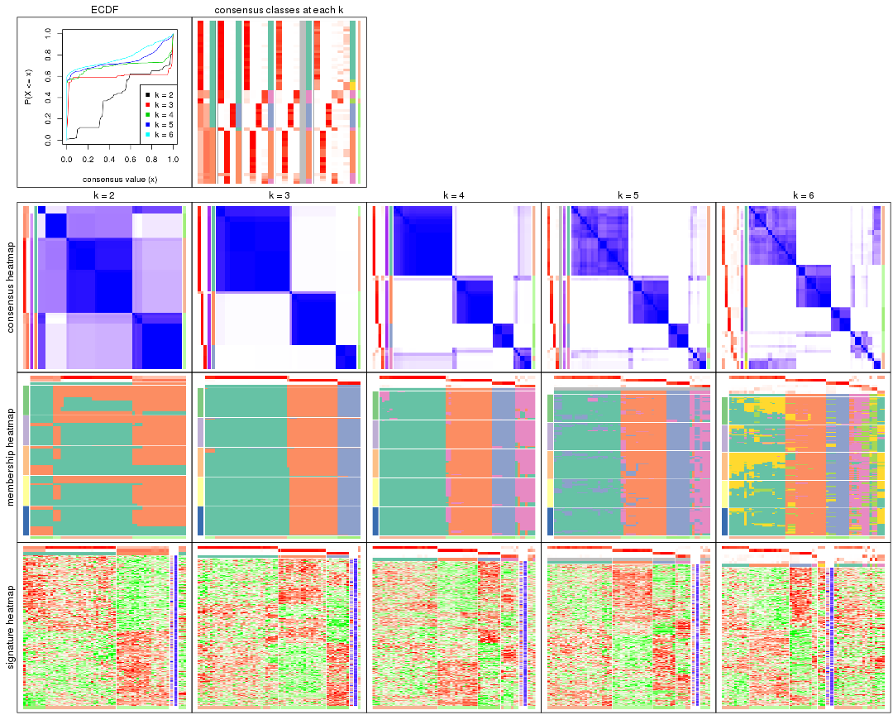

The plots are:

- The first row: a plot of the ECDF (Empirical cumulative distribution
  function) curves of the consensus matrix for each `k` and the heatmap of
  predicted classes for each `k`.
- The second row: heatmaps of the consensus matrix for each `k`.
- The third row: heatmaps of the membership matrix for each `k`.
- The fouth row: heatmaps of the signatures for each `k`.

All the plots in panels can be made by individual functions and they are
plotted later in this section.

`select_partition_number()` produces several plots showing different
statistics for choosing "optimized" `k`. There are following statistics:

- ECDF curves of the consensus matrix for each `k`;
- 1-PAC. [The PAC
  score](https://en.wikipedia.org/wiki/Consensus_clustering#Over-interpretation_potential_of_consensus_clustering)
  measures the proportion of the ambiguous subgrouping.
- Mean silhouette score.
- Concordance. The mean probability of fiting the consensus class ids in all
  partitions.
- Area increased. Denote $A_k$ as the area under the ECDF curve for current
  `k`, the area increased is defined as $A_k - A_{k-1}$.
- Rand index. The percent of pairs of samples that are both in a same cluster
  or both are not in a same cluster in the partition of k and k-1.
- Jaccard index. The ratio of pairs of samples are both in a same cluster in
  the partition of k and k-1 and the pairs of samples are both in a same
  cluster in the partition k or k-1.

The detailed explanations of these statistics can be found in [the cola
vignette](http://bioconductor.org/packages/devel/bioc/vignettes/cola/inst/doc/cola.html#toc_13).

Generally speaking, lower PAC score, higher mean silhouette score or higher
concordance corresponds to better partition. Rand index and Jaccard index
measure how similar the current partition is compared to partition with `k-1`.
If they are too similar, we won't accept `k` is better than `k-1`.

```r
select_partition_number(res)
```


The numeric values for all these statistics can be obtained by `get_stats()`.

```r
get_stats(res)
```

```
#>   k 1-PAC mean_silhouette concordance area_increased  Rand Jaccard
#> 2 2 0.368           0.728       0.773         0.4111 0.541   0.541
#> 3 3 1.000           0.967       0.982         0.4589 0.820   0.677
#> 4 4 0.889           0.900       0.948         0.1583 0.889   0.722
#> 5 5 0.756           0.799       0.862         0.0723 1.000   1.000
#> 6 6 0.743           0.595       0.754         0.0527 0.919   0.732
```

`suggest_best_k()` suggests the best $k$ based on these statistics. The rules are as follows:

- All $k$ with Jaccard index larger than 0.95 are removed because the increase of
  the partition number does not provides enough extra information. If all $k$ are removed,
  the best $k$ is assigned by `NA`.
- For $k$ with 1-PAC larger than 0.9, the maximal $k$ is taken as the "best k". Other $k$ is called "optional k".
- If it does not fit the second rule. The $k$ with the highest vote of highest
  1-PAC, mean silhouette and concordance is taken as the "best k".

```r
suggest_best_k(res)
```

```
#> [1] 3
```


Following shows the table of the partitions (You need to click the **show/hide
code output** link to see it). The membership matrix (columns with name `p*`)
is inferred by
[`clue::cl_consensus()`](https://www.rdocumentation.org/link/cl_consensus?package=clue)
function with the `SE` method. Basically the value in the membership matrix
represents the probability to belong to a certain group. The finall class
label for an item is determined with the group with highest probability it
belongs to.

In `get_classes()` function, the entropy is calculated from the membership
matrix and the silhouette score is calculated from the consensus matrix.


<script>
$( function() {
	$( '#tabs-SD-kmeans-get-classes' ).tabs();
} );
</script>
<div id='tabs-SD-kmeans-get-classes'>
<ul>
<li><a href='#tab-SD-kmeans-get-classes-1'>k = 2</a></li>
<li><a href='#tab-SD-kmeans-get-classes-2'>k = 3</a></li>
<li><a href='#tab-SD-kmeans-get-classes-3'>k = 4</a></li>
<li><a href='#tab-SD-kmeans-get-classes-4'>k = 5</a></li>
<li><a href='#tab-SD-kmeans-get-classes-5'>k = 6</a></li>
</ul>

<div id='tab-SD-kmeans-get-classes-1'>
<p><a id='tab-SD-kmeans-get-classes-1-a' style='color:#0366d6' href='#'>show/hide code output</a></p>
<pre><code class="r">cbind(get_classes(res, k = 2), get_membership(res, k = 2))
</code></pre>

<pre><code>#&gt;           class entropy silhouette    p1    p2
#&gt; GSM246087     1  0.9795      0.525 0.584 0.416
#&gt; GSM246088     1  0.9795      0.525 0.584 0.416
#&gt; GSM246089     1  0.9795      0.525 0.584 0.416
#&gt; GSM246090     1  0.9795      0.525 0.584 0.416
#&gt; GSM246119     1  0.9795      0.525 0.584 0.416
#&gt; GSM246120     1  0.9795      0.525 0.584 0.416
#&gt; GSM246121     1  0.9795      0.525 0.584 0.416
#&gt; GSM246122     1  0.9795      0.525 0.584 0.416
#&gt; GSM246123     1  0.9795      0.525 0.584 0.416
#&gt; GSM246422     1  0.9977     -0.623 0.528 0.472
#&gt; GSM246423     1  0.9977     -0.623 0.528 0.472
#&gt; GSM246484     1  0.9977     -0.623 0.528 0.472
#&gt; GSM246485     2  0.9710      0.868 0.400 0.600
#&gt; GSM246486     2  0.9795      0.838 0.416 0.584
#&gt; GSM246487     2  0.9909      0.795 0.444 0.556
#&gt; GSM246488     2  0.9795      0.838 0.416 0.584
#&gt; GSM246489     2  0.9000      0.967 0.316 0.684
#&gt; GSM246490     2  0.9000      0.967 0.316 0.684
#&gt; GSM246491     2  0.9000      0.967 0.316 0.684
#&gt; GSM247162     2  0.9000      0.967 0.316 0.684
#&gt; GSM247163     2  0.9000      0.967 0.316 0.684
#&gt; GSM247164     2  0.9000      0.967 0.316 0.684
#&gt; GSM247165     2  0.9000      0.967 0.316 0.684
#&gt; GSM247166     2  0.9000      0.967 0.316 0.684
#&gt; GSM247168     2  0.9000      0.967 0.316 0.684
#&gt; GSM247169     2  0.9000      0.967 0.316 0.684
#&gt; GSM247171     2  0.9000      0.967 0.316 0.684
#&gt; GSM247173     2  0.9000      0.967 0.316 0.684
#&gt; GSM247174     2  0.9000      0.967 0.316 0.684
#&gt; GSM247175     2  0.9000      0.967 0.316 0.684
#&gt; GSM247188     2  0.9000      0.967 0.316 0.684
#&gt; GSM247189     2  0.9000      0.967 0.316 0.684
#&gt; GSM247190     2  0.9000      0.967 0.316 0.684
#&gt; GSM247650     1  0.0376      0.780 0.996 0.004
#&gt; GSM247651     1  0.1633      0.779 0.976 0.024
#&gt; GSM247652     1  0.1633      0.779 0.976 0.024
#&gt; GSM247653     1  0.0376      0.780 0.996 0.004
#&gt; GSM247654     1  0.1633      0.779 0.976 0.024
#&gt; GSM247655     1  0.1633      0.779 0.976 0.024
#&gt; GSM247656     1  0.0376      0.780 0.996 0.004
#&gt; GSM247657     1  0.1633      0.779 0.976 0.024
#&gt; GSM247658     1  0.1633      0.779 0.976 0.024
#&gt; GSM247659     1  0.0376      0.780 0.996 0.004
#&gt; GSM247660     1  0.1633      0.779 0.976 0.024
#&gt; GSM247661     1  0.0376      0.780 0.996 0.004
#&gt; GSM247662     1  0.0376      0.780 0.996 0.004
#&gt; GSM247663     1  0.0376      0.780 0.996 0.004
#&gt; GSM247856     1  0.1414      0.780 0.980 0.020
#&gt; GSM247857     1  0.1633      0.779 0.976 0.024
#&gt; GSM247859     1  0.1633      0.779 0.976 0.024
#&gt; GSM247860     1  0.0000      0.781 1.000 0.000
#&gt; GSM247862     1  0.1633      0.779 0.976 0.024
#&gt; GSM247864     1  0.1633      0.779 0.976 0.024
#&gt; GSM247865     1  0.3431      0.725 0.936 0.064
#&gt; GSM247866     1  0.1633      0.779 0.976 0.024
#&gt; GSM247876     1  0.0000      0.781 1.000 0.000
#&gt; GSM247877     1  0.0000      0.781 1.000 0.000
#&gt; GSM247878     1  0.1633      0.779 0.976 0.024
#&gt; GSM247879     1  0.0376      0.780 0.996 0.004
#&gt; GSM247881     1  0.1633      0.779 0.976 0.024
#&gt; GSM247883     1  0.1633      0.779 0.976 0.024
</code></pre>

<script>
$('#tab-SD-kmeans-get-classes-1-a').parent().next().next().hide();
$('#tab-SD-kmeans-get-classes-1-a').click(function(){
  $('#tab-SD-kmeans-get-classes-1-a').parent().next().next().toggle();
  return(false);
});
</script>
</div>

<div id='tab-SD-kmeans-get-classes-2'>
<p><a id='tab-SD-kmeans-get-classes-2-a' style='color:#0366d6' href='#'>show/hide code output</a></p>
<pre><code class="r">cbind(get_classes(res, k = 3), get_membership(res, k = 3))
</code></pre>

<pre><code>#&gt;           class entropy silhouette    p1    p2    p3
#&gt; GSM246087     3  0.0424      0.997 0.000 0.008 0.992
#&gt; GSM246088     3  0.0424      0.997 0.000 0.008 0.992
#&gt; GSM246089     3  0.0892      0.996 0.000 0.020 0.980
#&gt; GSM246090     3  0.0424      0.997 0.000 0.008 0.992
#&gt; GSM246119     3  0.0892      0.996 0.000 0.020 0.980
#&gt; GSM246120     3  0.0892      0.996 0.000 0.020 0.980
#&gt; GSM246121     3  0.0424      0.997 0.000 0.008 0.992
#&gt; GSM246122     3  0.0424      0.997 0.000 0.008 0.992
#&gt; GSM246123     3  0.0892      0.996 0.000 0.020 0.980
#&gt; GSM246422     1  0.1832      0.957 0.956 0.036 0.008
#&gt; GSM246423     1  0.1832      0.957 0.956 0.036 0.008
#&gt; GSM246484     1  0.1832      0.957 0.956 0.036 0.008
#&gt; GSM246485     2  0.6295      0.114 0.472 0.528 0.000
#&gt; GSM246486     2  0.1170      0.956 0.016 0.976 0.008
#&gt; GSM246487     1  0.1765      0.955 0.956 0.040 0.004
#&gt; GSM246488     2  0.1170      0.956 0.016 0.976 0.008
#&gt; GSM246489     2  0.0592      0.965 0.012 0.988 0.000
#&gt; GSM246490     2  0.0592      0.965 0.012 0.988 0.000
#&gt; GSM246491     2  0.0592      0.965 0.012 0.988 0.000
#&gt; GSM247162     2  0.0592      0.965 0.012 0.988 0.000
#&gt; GSM247163     2  0.0592      0.965 0.012 0.988 0.000
#&gt; GSM247164     2  0.0592      0.965 0.012 0.988 0.000
#&gt; GSM247165     2  0.0592      0.965 0.012 0.988 0.000
#&gt; GSM247166     2  0.0592      0.965 0.012 0.988 0.000
#&gt; GSM247168     2  0.0592      0.965 0.012 0.988 0.000
#&gt; GSM247169     2  0.0592      0.965 0.012 0.988 0.000
#&gt; GSM247171     2  0.0592      0.965 0.012 0.988 0.000
#&gt; GSM247173     2  0.0592      0.965 0.012 0.988 0.000
#&gt; GSM247174     2  0.0592      0.965 0.012 0.988 0.000
#&gt; GSM247175     2  0.0592      0.965 0.012 0.988 0.000
#&gt; GSM247188     2  0.0592      0.965 0.012 0.988 0.000
#&gt; GSM247189     2  0.0829      0.962 0.012 0.984 0.004
#&gt; GSM247190     2  0.0592      0.965 0.012 0.988 0.000
#&gt; GSM247650     1  0.0237      0.992 0.996 0.000 0.004
#&gt; GSM247651     1  0.0000      0.992 1.000 0.000 0.000
#&gt; GSM247652     1  0.0237      0.992 0.996 0.000 0.004
#&gt; GSM247653     1  0.0237      0.992 0.996 0.000 0.004
#&gt; GSM247654     1  0.0237      0.992 0.996 0.000 0.004
#&gt; GSM247655     1  0.0000      0.992 1.000 0.000 0.000
#&gt; GSM247656     1  0.0237      0.992 0.996 0.000 0.004
#&gt; GSM247657     1  0.0237      0.992 0.996 0.000 0.004
#&gt; GSM247658     1  0.0000      0.992 1.000 0.000 0.000
#&gt; GSM247659     1  0.0237      0.992 0.996 0.000 0.004
#&gt; GSM247660     1  0.0000      0.992 1.000 0.000 0.000
#&gt; GSM247661     1  0.0237      0.992 0.996 0.000 0.004
#&gt; GSM247662     1  0.0237      0.992 0.996 0.000 0.004
#&gt; GSM247663     1  0.0237      0.992 0.996 0.000 0.004
#&gt; GSM247856     1  0.0237      0.992 0.996 0.000 0.004
#&gt; GSM247857     1  0.0237      0.992 0.996 0.000 0.004
#&gt; GSM247859     1  0.0000      0.992 1.000 0.000 0.000
#&gt; GSM247860     1  0.0237      0.992 0.996 0.000 0.004
#&gt; GSM247862     1  0.0000      0.992 1.000 0.000 0.000
#&gt; GSM247864     1  0.0000      0.992 1.000 0.000 0.000
#&gt; GSM247865     1  0.0000      0.992 1.000 0.000 0.000
#&gt; GSM247866     1  0.0000      0.992 1.000 0.000 0.000
#&gt; GSM247876     1  0.0237      0.992 0.996 0.000 0.004
#&gt; GSM247877     1  0.0424      0.988 0.992 0.000 0.008
#&gt; GSM247878     1  0.0424      0.988 0.992 0.000 0.008
#&gt; GSM247879     1  0.0237      0.992 0.996 0.000 0.004
#&gt; GSM247881     1  0.0000      0.992 1.000 0.000 0.000
#&gt; GSM247883     1  0.0000      0.992 1.000 0.000 0.000
</code></pre>

<script>
$('#tab-SD-kmeans-get-classes-2-a').parent().next().next().hide();
$('#tab-SD-kmeans-get-classes-2-a').click(function(){
  $('#tab-SD-kmeans-get-classes-2-a').parent().next().next().toggle();
  return(false);
});
</script>
</div>

<div id='tab-SD-kmeans-get-classes-3'>
<p><a id='tab-SD-kmeans-get-classes-3-a' style='color:#0366d6' href='#'>show/hide code output</a></p>
<pre><code class="r">cbind(get_classes(res, k = 4), get_membership(res, k = 4))
</code></pre>

<pre><code>#&gt;           class entropy silhouette    p1    p2    p3    p4
#&gt; GSM246087     3  0.0000      0.981 0.000 0.000 1.000 0.000
#&gt; GSM246088     3  0.0000      0.981 0.000 0.000 1.000 0.000
#&gt; GSM246089     3  0.1867      0.964 0.000 0.000 0.928 0.072
#&gt; GSM246090     3  0.0000      0.981 0.000 0.000 1.000 0.000
#&gt; GSM246119     3  0.1389      0.975 0.000 0.000 0.952 0.048
#&gt; GSM246120     3  0.1389      0.975 0.000 0.000 0.952 0.048
#&gt; GSM246121     3  0.0000      0.981 0.000 0.000 1.000 0.000
#&gt; GSM246122     3  0.0000      0.981 0.000 0.000 1.000 0.000
#&gt; GSM246123     3  0.1389      0.975 0.000 0.000 0.952 0.048
#&gt; GSM246422     4  0.2859      0.842 0.112 0.008 0.000 0.880
#&gt; GSM246423     4  0.2859      0.842 0.112 0.008 0.000 0.880
#&gt; GSM246484     4  0.2859      0.842 0.112 0.008 0.000 0.880
#&gt; GSM246485     2  0.7483     -0.160 0.184 0.456 0.000 0.360
#&gt; GSM246486     4  0.4624      0.441 0.000 0.340 0.000 0.660
#&gt; GSM246487     4  0.5331      0.618 0.332 0.024 0.000 0.644
#&gt; GSM246488     4  0.2921      0.724 0.000 0.140 0.000 0.860
#&gt; GSM246489     2  0.0000      0.926 0.000 1.000 0.000 0.000
#&gt; GSM246490     2  0.0000      0.926 0.000 1.000 0.000 0.000
#&gt; GSM246491     2  0.0000      0.926 0.000 1.000 0.000 0.000
#&gt; GSM247162     2  0.0000      0.926 0.000 1.000 0.000 0.000
#&gt; GSM247163     2  0.0000      0.926 0.000 1.000 0.000 0.000
#&gt; GSM247164     2  0.0000      0.926 0.000 1.000 0.000 0.000
#&gt; GSM247165     2  0.0000      0.926 0.000 1.000 0.000 0.000
#&gt; GSM247166     2  0.1211      0.910 0.000 0.960 0.000 0.040
#&gt; GSM247168     2  0.1211      0.910 0.000 0.960 0.000 0.040
#&gt; GSM247169     2  0.1211      0.910 0.000 0.960 0.000 0.040
#&gt; GSM247171     2  0.0000      0.926 0.000 1.000 0.000 0.000
#&gt; GSM247173     2  0.0000      0.926 0.000 1.000 0.000 0.000
#&gt; GSM247174     2  0.1211      0.910 0.000 0.960 0.000 0.040
#&gt; GSM247175     2  0.0000      0.926 0.000 1.000 0.000 0.000
#&gt; GSM247188     2  0.0592      0.920 0.000 0.984 0.000 0.016
#&gt; GSM247189     2  0.4925      0.166 0.000 0.572 0.000 0.428
#&gt; GSM247190     2  0.0188      0.925 0.000 0.996 0.000 0.004
#&gt; GSM247650     1  0.0000      0.986 1.000 0.000 0.000 0.000
#&gt; GSM247651     1  0.2081      0.906 0.916 0.000 0.000 0.084
#&gt; GSM247652     1  0.0000      0.986 1.000 0.000 0.000 0.000
#&gt; GSM247653     1  0.0000      0.986 1.000 0.000 0.000 0.000
#&gt; GSM247654     1  0.0000      0.986 1.000 0.000 0.000 0.000
#&gt; GSM247655     1  0.0188      0.984 0.996 0.000 0.000 0.004
#&gt; GSM247656     1  0.0000      0.986 1.000 0.000 0.000 0.000
#&gt; GSM247657     1  0.0000      0.986 1.000 0.000 0.000 0.000
#&gt; GSM247658     1  0.0000      0.986 1.000 0.000 0.000 0.000
#&gt; GSM247659     1  0.0000      0.986 1.000 0.000 0.000 0.000
#&gt; GSM247660     1  0.1716      0.929 0.936 0.000 0.000 0.064
#&gt; GSM247661     1  0.0000      0.986 1.000 0.000 0.000 0.000
#&gt; GSM247662     1  0.0000      0.986 1.000 0.000 0.000 0.000
#&gt; GSM247663     1  0.0336      0.981 0.992 0.000 0.000 0.008
#&gt; GSM247856     1  0.0000      0.986 1.000 0.000 0.000 0.000
#&gt; GSM247857     1  0.0000      0.986 1.000 0.000 0.000 0.000
#&gt; GSM247859     1  0.1211      0.953 0.960 0.000 0.000 0.040
#&gt; GSM247860     1  0.0000      0.986 1.000 0.000 0.000 0.000
#&gt; GSM247862     1  0.0000      0.986 1.000 0.000 0.000 0.000
#&gt; GSM247864     1  0.0188      0.984 0.996 0.000 0.000 0.004
#&gt; GSM247865     1  0.1867      0.921 0.928 0.000 0.000 0.072
#&gt; GSM247866     1  0.0000      0.986 1.000 0.000 0.000 0.000
#&gt; GSM247876     1  0.0336      0.981 0.992 0.000 0.000 0.008
#&gt; GSM247877     4  0.3172      0.824 0.160 0.000 0.000 0.840
#&gt; GSM247878     4  0.3123      0.826 0.156 0.000 0.000 0.844
#&gt; GSM247879     1  0.0707      0.972 0.980 0.000 0.000 0.020
#&gt; GSM247881     1  0.0000      0.986 1.000 0.000 0.000 0.000
#&gt; GSM247883     1  0.0188      0.984 0.996 0.000 0.000 0.004
</code></pre>

<script>
$('#tab-SD-kmeans-get-classes-3-a').parent().next().next().hide();
$('#tab-SD-kmeans-get-classes-3-a').click(function(){
  $('#tab-SD-kmeans-get-classes-3-a').parent().next().next().toggle();
  return(false);
});
</script>
</div>

<div id='tab-SD-kmeans-get-classes-4'>
<p><a id='tab-SD-kmeans-get-classes-4-a' style='color:#0366d6' href='#'>show/hide code output</a></p>
<pre><code class="r">cbind(get_classes(res, k = 5), get_membership(res, k = 5))
</code></pre>

<pre><code>#&gt;           class entropy silhouette    p1    p2    p3    p4 p5
#&gt; GSM246087     3  0.0000     0.9534 0.000 0.000 1.000 0.000 NA
#&gt; GSM246088     3  0.0000     0.9534 0.000 0.000 1.000 0.000 NA
#&gt; GSM246089     3  0.2964     0.9214 0.000 0.000 0.856 0.024 NA
#&gt; GSM246090     3  0.0000     0.9534 0.000 0.000 1.000 0.000 NA
#&gt; GSM246119     3  0.2304     0.9395 0.000 0.000 0.892 0.008 NA
#&gt; GSM246120     3  0.2304     0.9395 0.000 0.000 0.892 0.008 NA
#&gt; GSM246121     3  0.0000     0.9534 0.000 0.000 1.000 0.000 NA
#&gt; GSM246122     3  0.0000     0.9534 0.000 0.000 1.000 0.000 NA
#&gt; GSM246123     3  0.2304     0.9395 0.000 0.000 0.892 0.008 NA
#&gt; GSM246422     4  0.0963     0.7390 0.036 0.000 0.000 0.964 NA
#&gt; GSM246423     4  0.0963     0.7390 0.036 0.000 0.000 0.964 NA
#&gt; GSM246484     4  0.0963     0.7390 0.036 0.000 0.000 0.964 NA
#&gt; GSM246485     2  0.8456    -0.3225 0.164 0.312 0.000 0.276 NA
#&gt; GSM246486     4  0.6538     0.3815 0.000 0.272 0.000 0.480 NA
#&gt; GSM246487     4  0.6755     0.4646 0.296 0.004 0.000 0.452 NA
#&gt; GSM246488     4  0.4693     0.6551 0.000 0.056 0.000 0.700 NA
#&gt; GSM246489     2  0.0000     0.8805 0.000 1.000 0.000 0.000 NA
#&gt; GSM246490     2  0.0609     0.8766 0.000 0.980 0.000 0.000 NA
#&gt; GSM246491     2  0.0609     0.8766 0.000 0.980 0.000 0.000 NA
#&gt; GSM247162     2  0.0000     0.8805 0.000 1.000 0.000 0.000 NA
#&gt; GSM247163     2  0.1121     0.8665 0.000 0.956 0.000 0.000 NA
#&gt; GSM247164     2  0.0880     0.8721 0.000 0.968 0.000 0.000 NA
#&gt; GSM247165     2  0.2377     0.8009 0.000 0.872 0.000 0.000 NA
#&gt; GSM247166     2  0.2377     0.8292 0.000 0.872 0.000 0.000 NA
#&gt; GSM247168     2  0.2377     0.8292 0.000 0.872 0.000 0.000 NA
#&gt; GSM247169     2  0.2377     0.8292 0.000 0.872 0.000 0.000 NA
#&gt; GSM247171     2  0.0000     0.8805 0.000 1.000 0.000 0.000 NA
#&gt; GSM247173     2  0.0000     0.8805 0.000 1.000 0.000 0.000 NA
#&gt; GSM247174     2  0.2127     0.8389 0.000 0.892 0.000 0.000 NA
#&gt; GSM247175     2  0.0000     0.8805 0.000 1.000 0.000 0.000 NA
#&gt; GSM247188     2  0.0510     0.8780 0.000 0.984 0.000 0.000 NA
#&gt; GSM247189     2  0.6458     0.0988 0.000 0.496 0.000 0.280 NA
#&gt; GSM247190     2  0.0609     0.8772 0.000 0.980 0.000 0.000 NA
#&gt; GSM247650     1  0.2230     0.8544 0.884 0.000 0.000 0.000 NA
#&gt; GSM247651     1  0.3601     0.8132 0.820 0.000 0.000 0.052 NA
#&gt; GSM247652     1  0.1341     0.8734 0.944 0.000 0.000 0.000 NA
#&gt; GSM247653     1  0.3210     0.8173 0.788 0.000 0.000 0.000 NA
#&gt; GSM247654     1  0.2732     0.8414 0.840 0.000 0.000 0.000 NA
#&gt; GSM247655     1  0.2513     0.8455 0.876 0.000 0.000 0.008 NA
#&gt; GSM247656     1  0.2179     0.8618 0.888 0.000 0.000 0.000 NA
#&gt; GSM247657     1  0.2127     0.8593 0.892 0.000 0.000 0.000 NA
#&gt; GSM247658     1  0.1851     0.8665 0.912 0.000 0.000 0.000 NA
#&gt; GSM247659     1  0.2127     0.8623 0.892 0.000 0.000 0.000 NA
#&gt; GSM247660     1  0.3229     0.8264 0.840 0.000 0.000 0.032 NA
#&gt; GSM247661     1  0.3210     0.8173 0.788 0.000 0.000 0.000 NA
#&gt; GSM247662     1  0.2074     0.8625 0.896 0.000 0.000 0.000 NA
#&gt; GSM247663     1  0.3835     0.7670 0.744 0.000 0.000 0.012 NA
#&gt; GSM247856     1  0.0703     0.8736 0.976 0.000 0.000 0.000 NA
#&gt; GSM247857     1  0.2020     0.8631 0.900 0.000 0.000 0.000 NA
#&gt; GSM247859     1  0.1836     0.8592 0.932 0.000 0.000 0.032 NA
#&gt; GSM247860     1  0.3210     0.8173 0.788 0.000 0.000 0.000 NA
#&gt; GSM247862     1  0.1478     0.8736 0.936 0.000 0.000 0.000 NA
#&gt; GSM247864     1  0.2612     0.8431 0.868 0.000 0.000 0.008 NA
#&gt; GSM247865     1  0.2304     0.8515 0.908 0.000 0.000 0.044 NA
#&gt; GSM247866     1  0.3242     0.8257 0.784 0.000 0.000 0.000 NA
#&gt; GSM247876     1  0.3807     0.7665 0.748 0.000 0.000 0.012 NA
#&gt; GSM247877     4  0.4924     0.6337 0.060 0.000 0.000 0.668 NA
#&gt; GSM247878     4  0.4901     0.6357 0.060 0.000 0.000 0.672 NA
#&gt; GSM247879     1  0.4787     0.6226 0.640 0.000 0.000 0.036 NA
#&gt; GSM247881     1  0.0703     0.8716 0.976 0.000 0.000 0.000 NA
#&gt; GSM247883     1  0.1124     0.8665 0.960 0.000 0.000 0.004 NA
</code></pre>

<script>
$('#tab-SD-kmeans-get-classes-4-a').parent().next().next().hide();
$('#tab-SD-kmeans-get-classes-4-a').click(function(){
  $('#tab-SD-kmeans-get-classes-4-a').parent().next().next().toggle();
  return(false);
});
</script>
</div>

<div id='tab-SD-kmeans-get-classes-5'>
<p><a id='tab-SD-kmeans-get-classes-5-a' style='color:#0366d6' href='#'>show/hide code output</a></p>
<pre><code class="r">cbind(get_classes(res, k = 6), get_membership(res, k = 6))
</code></pre>

<pre><code>#&gt;           class entropy silhouette    p1    p2    p3    p4    p5    p6
#&gt; GSM246087     3  0.0000     0.9185 0.000 0.000 1.000 0.000 0.000 0.000
#&gt; GSM246088     3  0.0000     0.9185 0.000 0.000 1.000 0.000 0.000 0.000
#&gt; GSM246089     3  0.4645     0.8544 0.000 0.000 0.752 0.080 0.080 0.088
#&gt; GSM246090     3  0.0000     0.9185 0.000 0.000 1.000 0.000 0.000 0.000
#&gt; GSM246119     3  0.3695     0.8937 0.000 0.000 0.820 0.044 0.052 0.084
#&gt; GSM246120     3  0.3695     0.8937 0.000 0.000 0.820 0.044 0.052 0.084
#&gt; GSM246121     3  0.0146     0.9183 0.000 0.000 0.996 0.004 0.000 0.000
#&gt; GSM246122     3  0.0146     0.9183 0.000 0.000 0.996 0.004 0.000 0.000
#&gt; GSM246123     3  0.3695     0.8937 0.000 0.000 0.820 0.044 0.052 0.084
#&gt; GSM246422     4  0.4726     0.3519 0.000 0.000 0.000 0.528 0.424 0.048
#&gt; GSM246423     4  0.4726     0.3519 0.000 0.000 0.000 0.528 0.424 0.048
#&gt; GSM246484     4  0.4726     0.3519 0.000 0.000 0.000 0.528 0.424 0.048
#&gt; GSM246485     4  0.5272     0.4209 0.104 0.256 0.000 0.624 0.000 0.016
#&gt; GSM246486     4  0.2920     0.5177 0.008 0.168 0.000 0.820 0.000 0.004
#&gt; GSM246487     4  0.3441     0.3429 0.216 0.004 0.000 0.768 0.004 0.008
#&gt; GSM246488     4  0.2637     0.5022 0.000 0.024 0.000 0.872 0.096 0.008
#&gt; GSM246489     2  0.0000     0.8905 0.000 1.000 0.000 0.000 0.000 0.000
#&gt; GSM246490     2  0.1257     0.8770 0.000 0.952 0.000 0.028 0.000 0.020
#&gt; GSM246491     2  0.1257     0.8770 0.000 0.952 0.000 0.028 0.000 0.020
#&gt; GSM247162     2  0.0000     0.8905 0.000 1.000 0.000 0.000 0.000 0.000
#&gt; GSM247163     2  0.1549     0.8682 0.000 0.936 0.000 0.044 0.000 0.020
#&gt; GSM247164     2  0.1549     0.8682 0.000 0.936 0.000 0.044 0.000 0.020
#&gt; GSM247165     2  0.2536     0.8013 0.000 0.864 0.000 0.116 0.000 0.020
#&gt; GSM247166     2  0.4394     0.6894 0.000 0.688 0.000 0.028 0.020 0.264
#&gt; GSM247168     2  0.4394     0.6894 0.000 0.688 0.000 0.028 0.020 0.264
#&gt; GSM247169     2  0.4394     0.6894 0.000 0.688 0.000 0.028 0.020 0.264
#&gt; GSM247171     2  0.0000     0.8905 0.000 1.000 0.000 0.000 0.000 0.000
#&gt; GSM247173     2  0.0000     0.8905 0.000 1.000 0.000 0.000 0.000 0.000
#&gt; GSM247174     2  0.3090     0.8012 0.000 0.828 0.000 0.028 0.004 0.140
#&gt; GSM247175     2  0.0000     0.8905 0.000 1.000 0.000 0.000 0.000 0.000
#&gt; GSM247188     2  0.0508     0.8872 0.000 0.984 0.000 0.012 0.000 0.004
#&gt; GSM247189     4  0.4172     0.0899 0.000 0.460 0.000 0.528 0.000 0.012
#&gt; GSM247190     2  0.1124     0.8776 0.000 0.956 0.000 0.008 0.000 0.036
#&gt; GSM247650     1  0.2094     0.6019 0.900 0.000 0.000 0.000 0.080 0.020
#&gt; GSM247651     1  0.3346     0.5862 0.840 0.000 0.000 0.056 0.080 0.024
#&gt; GSM247652     1  0.3050     0.2317 0.764 0.000 0.000 0.000 0.000 0.236
#&gt; GSM247653     6  0.3851     0.9749 0.460 0.000 0.000 0.000 0.000 0.540
#&gt; GSM247654     1  0.3923    -0.5746 0.580 0.000 0.000 0.000 0.004 0.416
#&gt; GSM247655     1  0.2755     0.6049 0.876 0.000 0.000 0.040 0.068 0.016
#&gt; GSM247656     1  0.3679     0.1499 0.724 0.000 0.000 0.004 0.012 0.260
#&gt; GSM247657     1  0.3702     0.1148 0.720 0.000 0.000 0.004 0.012 0.264
#&gt; GSM247658     1  0.3244     0.0933 0.732 0.000 0.000 0.000 0.000 0.268
#&gt; GSM247659     1  0.3680     0.2363 0.744 0.000 0.000 0.004 0.020 0.232
#&gt; GSM247660     1  0.3238     0.5906 0.848 0.000 0.000 0.056 0.072 0.024
#&gt; GSM247661     6  0.4076     0.9599 0.452 0.000 0.000 0.000 0.008 0.540
#&gt; GSM247662     1  0.3329     0.3598 0.792 0.000 0.000 0.004 0.020 0.184
#&gt; GSM247663     1  0.4198     0.4200 0.708 0.000 0.000 0.000 0.232 0.060
#&gt; GSM247856     1  0.2001     0.5396 0.900 0.000 0.000 0.004 0.004 0.092
#&gt; GSM247857     1  0.3329     0.3598 0.792 0.000 0.000 0.004 0.020 0.184
#&gt; GSM247859     1  0.1984     0.6068 0.912 0.000 0.000 0.056 0.000 0.032
#&gt; GSM247860     6  0.3854     0.9726 0.464 0.000 0.000 0.000 0.000 0.536
#&gt; GSM247862     1  0.1908     0.5540 0.900 0.000 0.000 0.004 0.000 0.096
#&gt; GSM247864     1  0.2911     0.6040 0.868 0.000 0.000 0.036 0.072 0.024
#&gt; GSM247865     1  0.2288     0.5962 0.896 0.000 0.000 0.072 0.004 0.028
#&gt; GSM247866     1  0.4659    -0.0635 0.624 0.000 0.000 0.004 0.052 0.320
#&gt; GSM247876     1  0.4075     0.4200 0.712 0.000 0.000 0.000 0.240 0.048
#&gt; GSM247877     5  0.2412     0.4355 0.028 0.000 0.000 0.092 0.880 0.000
#&gt; GSM247878     5  0.2412     0.4355 0.028 0.000 0.000 0.092 0.880 0.000
#&gt; GSM247879     5  0.4650    -0.1819 0.472 0.000 0.000 0.000 0.488 0.040
#&gt; GSM247881     1  0.0767     0.5977 0.976 0.000 0.000 0.004 0.012 0.008
#&gt; GSM247883     1  0.1633     0.6086 0.932 0.000 0.000 0.044 0.000 0.024
</code></pre>

<script>
$('#tab-SD-kmeans-get-classes-5-a').parent().next().next().hide();
$('#tab-SD-kmeans-get-classes-5-a').click(function(){
  $('#tab-SD-kmeans-get-classes-5-a').parent().next().next().toggle();
  return(false);
});
</script>
</div>
</div>

Heatmaps for the consensus matrix. It visualizes the probability of two
samples to be in a same group.


<script>
$( function() {
	$( '#tabs-SD-kmeans-consensus-heatmap' ).tabs();
} );
</script>
<div id='tabs-SD-kmeans-consensus-heatmap'>
<ul>
<li><a href='#tab-SD-kmeans-consensus-heatmap-1'>k = 2</a></li>
<li><a href='#tab-SD-kmeans-consensus-heatmap-2'>k = 3</a></li>
<li><a href='#tab-SD-kmeans-consensus-heatmap-3'>k = 4</a></li>
<li><a href='#tab-SD-kmeans-consensus-heatmap-4'>k = 5</a></li>
<li><a href='#tab-SD-kmeans-consensus-heatmap-5'>k = 6</a></li>
</ul>
<div id='tab-SD-kmeans-consensus-heatmap-1'>
<pre><code class="r">consensus_heatmap(res, k = 2)
</code></pre>

<p></p>

</div>
<div id='tab-SD-kmeans-consensus-heatmap-2'>
<pre><code class="r">consensus_heatmap(res, k = 3)
</code></pre>

<p></p>

</div>
<div id='tab-SD-kmeans-consensus-heatmap-3'>
<pre><code class="r">consensus_heatmap(res, k = 4)
</code></pre>

<p></p>

</div>
<div id='tab-SD-kmeans-consensus-heatmap-4'>
<pre><code class="r">consensus_heatmap(res, k = 5)
</code></pre>

<p></p>

</div>
<div id='tab-SD-kmeans-consensus-heatmap-5'>
<pre><code class="r">consensus_heatmap(res, k = 6)
</code></pre>

<p></p>

</div>
</div>

Heatmaps for the membership of samples in all partitions to see how consistent they are:


<script>
$( function() {
	$( '#tabs-SD-kmeans-membership-heatmap' ).tabs();
} );
</script>
<div id='tabs-SD-kmeans-membership-heatmap'>
<ul>
<li><a href='#tab-SD-kmeans-membership-heatmap-1'>k = 2</a></li>
<li><a href='#tab-SD-kmeans-membership-heatmap-2'>k = 3</a></li>
<li><a href='#tab-SD-kmeans-membership-heatmap-3'>k = 4</a></li>
<li><a href='#tab-SD-kmeans-membership-heatmap-4'>k = 5</a></li>
<li><a href='#tab-SD-kmeans-membership-heatmap-5'>k = 6</a></li>
</ul>
<div id='tab-SD-kmeans-membership-heatmap-1'>
<pre><code class="r">membership_heatmap(res, k = 2)
</code></pre>

<p></p>

</div>
<div id='tab-SD-kmeans-membership-heatmap-2'>
<pre><code class="r">membership_heatmap(res, k = 3)
</code></pre>

<p></p>

</div>
<div id='tab-SD-kmeans-membership-heatmap-3'>
<pre><code class="r">membership_heatmap(res, k = 4)
</code></pre>

<p></p>

</div>
<div id='tab-SD-kmeans-membership-heatmap-4'>
<pre><code class="r">membership_heatmap(res, k = 5)
</code></pre>

<p></p>

</div>
<div id='tab-SD-kmeans-membership-heatmap-5'>
<pre><code class="r">membership_heatmap(res, k = 6)
</code></pre>

<p></p>

</div>
</div>

As soon as we have had the classes for columns, we can look for signatures
which are significantly different between classes which can be candidate marks
for certain classes. Following are the heatmaps for signatures.


Signature heatmaps where rows are scaled:


<script>
$( function() {
	$( '#tabs-SD-kmeans-get-signatures' ).tabs();
} );
</script>
<div id='tabs-SD-kmeans-get-signatures'>
<ul>
<li><a href='#tab-SD-kmeans-get-signatures-1'>k = 2</a></li>
<li><a href='#tab-SD-kmeans-get-signatures-2'>k = 3</a></li>
<li><a href='#tab-SD-kmeans-get-signatures-3'>k = 4</a></li>
<li><a href='#tab-SD-kmeans-get-signatures-4'>k = 5</a></li>
<li><a href='#tab-SD-kmeans-get-signatures-5'>k = 6</a></li>
</ul>
<div id='tab-SD-kmeans-get-signatures-1'>
<pre><code class="r">get_signatures(res, k = 2)
</code></pre>

<p></p>

</div>
<div id='tab-SD-kmeans-get-signatures-2'>
<pre><code class="r">get_signatures(res, k = 3)
</code></pre>

<p></p>

</div>
<div id='tab-SD-kmeans-get-signatures-3'>
<pre><code class="r">get_signatures(res, k = 4)
</code></pre>

<p></p>

</div>
<div id='tab-SD-kmeans-get-signatures-4'>
<pre><code class="r">get_signatures(res, k = 5)
</code></pre>

<p></p>

</div>
<div id='tab-SD-kmeans-get-signatures-5'>
<pre><code class="r">get_signatures(res, k = 6)
</code></pre>

<p></p>

</div>
</div>


Signature heatmaps where rows are not scaled:


<script>
$( function() {
	$( '#tabs-SD-kmeans-get-signatures-no-scale' ).tabs();
} );
</script>
<div id='tabs-SD-kmeans-get-signatures-no-scale'>
<ul>
<li><a href='#tab-SD-kmeans-get-signatures-no-scale-1'>k = 2</a></li>
<li><a href='#tab-SD-kmeans-get-signatures-no-scale-2'>k = 3</a></li>
<li><a href='#tab-SD-kmeans-get-signatures-no-scale-3'>k = 4</a></li>
<li><a href='#tab-SD-kmeans-get-signatures-no-scale-4'>k = 5</a></li>
<li><a href='#tab-SD-kmeans-get-signatures-no-scale-5'>k = 6</a></li>
</ul>
<div id='tab-SD-kmeans-get-signatures-no-scale-1'>
<pre><code class="r">get_signatures(res, k = 2, scale_rows = FALSE)
</code></pre>

<p></p>

</div>
<div id='tab-SD-kmeans-get-signatures-no-scale-2'>
<pre><code class="r">get_signatures(res, k = 3, scale_rows = FALSE)
</code></pre>

<p></p>

</div>
<div id='tab-SD-kmeans-get-signatures-no-scale-3'>
<pre><code class="r">get_signatures(res, k = 4, scale_rows = FALSE)
</code></pre>

<p></p>

</div>
<div id='tab-SD-kmeans-get-signatures-no-scale-4'>
<pre><code class="r">get_signatures(res, k = 5, scale_rows = FALSE)
</code></pre>

<p></p>

</div>
<div id='tab-SD-kmeans-get-signatures-no-scale-5'>
<pre><code class="r">get_signatures(res, k = 6, scale_rows = FALSE)
</code></pre>

<p></p>

</div>
</div>


Compare the overlap of signatures from different k:

```r
compare_signatures(res)
```


`get_signature()` returns a data frame invisibly. TO get the list of signatures, the function
call should be assigned to a variable explicitly. In following code, if `plot` argument is set
to `FALSE`, no heatmap is plotted while only the differential analysis is performed.

```r
# code only for demonstration
tb = get_signature(res, k = ..., plot = FALSE)
```

An example of the output of `tb` is:

```
#>   which_row         fdr    mean_1    mean_2 scaled_mean_1 scaled_mean_2 km
#> 1        38 0.042760348  8.373488  9.131774    -0.5533452     0.5164555  1
#> 2        40 0.018707592  7.106213  8.469186    -0.6173731     0.5762149  1
#> 3        55 0.019134737 10.221463 11.207825    -0.6159697     0.5749050  1
#> 4        59 0.006059896  5.921854  7.869574    -0.6899429     0.6439467  1
#> 5        60 0.018055526  8.928898 10.211722    -0.6204761     0.5791110  1
#> 6        98 0.009384629 15.714769 14.887706     0.6635654    -0.6193277  2
...
```

The columns in `tb` are:

1. `which_row`: row indices corresponding to the input matrix.
2. `fdr`: FDR for the differential test. 
3. `mean_x`: The mean value in group x.
4. `scaled_mean_x`: The mean value in group x after rows are scaled.
5. `km`: Row groups if k-means clustering is applied to rows.


UMAP plot which shows how samples are separated.


<script>
$( function() {
	$( '#tabs-SD-kmeans-dimension-reduction' ).tabs();
} );
</script>
<div id='tabs-SD-kmeans-dimension-reduction'>
<ul>
<li><a href='#tab-SD-kmeans-dimension-reduction-1'>k = 2</a></li>
<li><a href='#tab-SD-kmeans-dimension-reduction-2'>k = 3</a></li>
<li><a href='#tab-SD-kmeans-dimension-reduction-3'>k = 4</a></li>
<li><a href='#tab-SD-kmeans-dimension-reduction-4'>k = 5</a></li>
<li><a href='#tab-SD-kmeans-dimension-reduction-5'>k = 6</a></li>
</ul>
<div id='tab-SD-kmeans-dimension-reduction-1'>
<pre><code class="r">dimension_reduction(res, k = 2, method = &quot;UMAP&quot;)
</code></pre>

<p></p>

</div>
<div id='tab-SD-kmeans-dimension-reduction-2'>
<pre><code class="r">dimension_reduction(res, k = 3, method = &quot;UMAP&quot;)
</code></pre>

<p></p>

</div>
<div id='tab-SD-kmeans-dimension-reduction-3'>
<pre><code class="r">dimension_reduction(res, k = 4, method = &quot;UMAP&quot;)
</code></pre>

<p></p>

</div>
<div id='tab-SD-kmeans-dimension-reduction-4'>
<pre><code class="r">dimension_reduction(res, k = 5, method = &quot;UMAP&quot;)
</code></pre>

<p></p>

</div>
<div id='tab-SD-kmeans-dimension-reduction-5'>
<pre><code class="r">dimension_reduction(res, k = 6, method = &quot;UMAP&quot;)
</code></pre>

<p></p>

</div>
</div>


Following heatmap shows how subgroups are split when increasing `k`:

```r
collect_classes(res)
```


Test correlation between subgroups and known annotations. If the known
annotation is numeric, one-way ANOVA test is applied, and if the known
annotation is discrete, chi-squared contingency table test is applied.

```r
test_to_known_factors(res)
```

```
#>            n disease.state(p) k
#> SD:kmeans 58         2.54e-13 2
#> SD:kmeans 60         1.88e-21 3
#> SD:kmeans 58         3.15e-21 4
#> SD:kmeans 57         6.85e-21 5
#> SD:kmeans 41         1.93e-14 6
```


If matrix rows can be associated to genes, consider to use `GO_Enrichment(res,
...)` to perform function enrichment for the signature genes.


 

---------------------------------------------------


### SD:skmeans**


The object with results only for a single top-value method and a single partition method 
can be extracted as:

```r
res = res_list["SD", "skmeans"]
# you can also extract it by
# res = res_list["SD:skmeans"]
```

A summary of `res` and all the functions that can be applied to it:

```r
res
```

```
#> A 'ConsensusPartition' object with k = 2, 3, 4, 5, 6.
#>   On a matrix with 21168 rows and 61 columns.
#>   Top rows (1000, 2000, 3000, 4000, 5000) are extracted by 'SD' method.
#>   Subgroups are detected by 'skmeans' method.
#>   Performed in total 1250 partitions by row resampling.
#>   Best k for subgroups seems to be 2.
#> 
#> Following methods can be applied to this 'ConsensusPartition' object:
#>  [1] "cola_report"             "collect_classes"         "collect_plots"          
#>  [4] "collect_stats"           "colnames"                "compare_signatures"     
#>  [7] "consensus_heatmap"       "dimension_reduction"     "functional_enrichment"  
#> [10] "get_anno_col"            "get_anno"                "get_classes"            
#> [13] "get_consensus"           "get_matrix"              "get_membership"         
#> [16] "get_param"               "get_signatures"          "get_stats"              
#> [19] "is_best_k"               "is_stable_k"             "membership_heatmap"     
#> [22] "ncol"                    "nrow"                    "plot_ecdf"              
#> [25] "rownames"                "select_partition_number" "show"                   
#> [28] "suggest_best_k"          "test_to_known_factors"
```

`collect_plots()` function collects all the plots made from `res` for all `k` (number of partitions)
into one single page to provide an easy and fast comparison between different `k`.

```r
collect_plots(res)
```


The plots are:

- The first row: a plot of the ECDF (Empirical cumulative distribution
  function) curves of the consensus matrix for each `k` and the heatmap of
  predicted classes for each `k`.
- The second row: heatmaps of the consensus matrix for each `k`.
- The third row: heatmaps of the membership matrix for each `k`.
- The fouth row: heatmaps of the signatures for each `k`.

All the plots in panels can be made by individual functions and they are
plotted later in this section.

`select_partition_number()` produces several plots showing different
statistics for choosing "optimized" `k`. There are following statistics:

- ECDF curves of the consensus matrix for each `k`;
- 1-PAC. [The PAC
  score](https://en.wikipedia.org/wiki/Consensus_clustering#Over-interpretation_potential_of_consensus_clustering)
  measures the proportion of the ambiguous subgrouping.
- Mean silhouette score.
- Concordance. The mean probability of fiting the consensus class ids in all
  partitions.
- Area increased. Denote $A_k$ as the area under the ECDF curve for current
  `k`, the area increased is defined as $A_k - A_{k-1}$.
- Rand index. The percent of pairs of samples that are both in a same cluster
  or both are not in a same cluster in the partition of k and k-1.
- Jaccard index. The ratio of pairs of samples are both in a same cluster in
  the partition of k and k-1 and the pairs of samples are both in a same
  cluster in the partition k or k-1.

The detailed explanations of these statistics can be found in [the cola
vignette](http://bioconductor.org/packages/devel/bioc/vignettes/cola/inst/doc/cola.html#toc_13).

Generally speaking, lower PAC score, higher mean silhouette score or higher
concordance corresponds to better partition. Rand index and Jaccard index
measure how similar the current partition is compared to partition with `k-1`.
If they are too similar, we won't accept `k` is better than `k-1`.

```r
select_partition_number(res)
```


The numeric values for all these statistics can be obtained by `get_stats()`.

```r
get_stats(res)
```

```
#>   k 1-PAC mean_silhouette concordance area_increased  Rand Jaccard
#> 2 2 1.000           0.982       0.993         0.4901 0.508   0.508
#> 3 3 0.869           0.894       0.951         0.3748 0.722   0.500
#> 4 4 0.858           0.872       0.944         0.1049 0.786   0.463
#> 5 5 0.791           0.680       0.852         0.0707 0.884   0.595
#> 6 6 0.799           0.660       0.799         0.0333 0.918   0.641
```

`suggest_best_k()` suggests the best $k$ based on these statistics. The rules are as follows:

- All $k$ with Jaccard index larger than 0.95 are removed because the increase of
  the partition number does not provides enough extra information. If all $k$ are removed,
  the best $k$ is assigned by `NA`.
- For $k$ with 1-PAC larger than 0.9, the maximal $k$ is taken as the "best k". Other $k$ is called "optional k".
- If it does not fit the second rule. The $k$ with the highest vote of highest
  1-PAC, mean silhouette and concordance is taken as the "best k".

```r
suggest_best_k(res)
```

```
#> [1] 2
```


Following shows the table of the partitions (You need to click the **show/hide
code output** link to see it). The membership matrix (columns with name `p*`)
is inferred by
[`clue::cl_consensus()`](https://www.rdocumentation.org/link/cl_consensus?package=clue)
function with the `SE` method. Basically the value in the membership matrix
represents the probability to belong to a certain group. The finall class
label for an item is determined with the group with highest probability it
belongs to.

In `get_classes()` function, the entropy is calculated from the membership
matrix and the silhouette score is calculated from the consensus matrix.


<script>
$( function() {
	$( '#tabs-SD-skmeans-get-classes' ).tabs();
} );
</script>
<div id='tabs-SD-skmeans-get-classes'>
<ul>
<li><a href='#tab-SD-skmeans-get-classes-1'>k = 2</a></li>
<li><a href='#tab-SD-skmeans-get-classes-2'>k = 3</a></li>
<li><a href='#tab-SD-skmeans-get-classes-3'>k = 4</a></li>
<li><a href='#tab-SD-skmeans-get-classes-4'>k = 5</a></li>
<li><a href='#tab-SD-skmeans-get-classes-5'>k = 6</a></li>
</ul>

<div id='tab-SD-skmeans-get-classes-1'>
<p><a id='tab-SD-skmeans-get-classes-1-a' style='color:#0366d6' href='#'>show/hide code output</a></p>
<pre><code class="r">cbind(get_classes(res, k = 2), get_membership(res, k = 2))
</code></pre>

<pre><code>#&gt;           class entropy silhouette    p1    p2
#&gt; GSM246087     1   0.000      0.999 1.000 0.000
#&gt; GSM246088     1   0.000      0.999 1.000 0.000
#&gt; GSM246089     1   0.000      0.999 1.000 0.000
#&gt; GSM246090     1   0.000      0.999 1.000 0.000
#&gt; GSM246119     1   0.000      0.999 1.000 0.000
#&gt; GSM246120     1   0.000      0.999 1.000 0.000
#&gt; GSM246121     1   0.000      0.999 1.000 0.000
#&gt; GSM246122     1   0.000      0.999 1.000 0.000
#&gt; GSM246123     1   0.000      0.999 1.000 0.000
#&gt; GSM246422     2   0.000      0.984 0.000 1.000
#&gt; GSM246423     2   0.000      0.984 0.000 1.000
#&gt; GSM246484     2   0.000      0.984 0.000 1.000
#&gt; GSM246485     2   0.000      0.984 0.000 1.000
#&gt; GSM246486     2   0.000      0.984 0.000 1.000
#&gt; GSM246487     2   0.000      0.984 0.000 1.000
#&gt; GSM246488     2   0.000      0.984 0.000 1.000
#&gt; GSM246489     2   0.000      0.984 0.000 1.000
#&gt; GSM246490     2   0.000      0.984 0.000 1.000
#&gt; GSM246491     2   0.000      0.984 0.000 1.000
#&gt; GSM247162     2   0.000      0.984 0.000 1.000
#&gt; GSM247163     2   0.000      0.984 0.000 1.000
#&gt; GSM247164     2   0.000      0.984 0.000 1.000
#&gt; GSM247165     2   0.000      0.984 0.000 1.000
#&gt; GSM247166     2   0.000      0.984 0.000 1.000
#&gt; GSM247168     2   0.000      0.984 0.000 1.000
#&gt; GSM247169     2   0.000      0.984 0.000 1.000
#&gt; GSM247171     2   0.000      0.984 0.000 1.000
#&gt; GSM247173     2   0.000      0.984 0.000 1.000
#&gt; GSM247174     2   0.000      0.984 0.000 1.000
#&gt; GSM247175     2   0.000      0.984 0.000 1.000
#&gt; GSM247188     2   0.000      0.984 0.000 1.000
#&gt; GSM247189     2   0.000      0.984 0.000 1.000
#&gt; GSM247190     2   0.000      0.984 0.000 1.000
#&gt; GSM247650     1   0.000      0.999 1.000 0.000
#&gt; GSM247651     1   0.000      0.999 1.000 0.000
#&gt; GSM247652     1   0.000      0.999 1.000 0.000
#&gt; GSM247653     1   0.000      0.999 1.000 0.000
#&gt; GSM247654     1   0.000      0.999 1.000 0.000
#&gt; GSM247655     1   0.000      0.999 1.000 0.000
#&gt; GSM247656     1   0.000      0.999 1.000 0.000
#&gt; GSM247657     1   0.000      0.999 1.000 0.000
#&gt; GSM247658     1   0.000      0.999 1.000 0.000
#&gt; GSM247659     1   0.000      0.999 1.000 0.000
#&gt; GSM247660     1   0.000      0.999 1.000 0.000
#&gt; GSM247661     1   0.000      0.999 1.000 0.000
#&gt; GSM247662     1   0.000      0.999 1.000 0.000
#&gt; GSM247663     1   0.000      0.999 1.000 0.000
#&gt; GSM247856     1   0.000      0.999 1.000 0.000
#&gt; GSM247857     1   0.000      0.999 1.000 0.000
#&gt; GSM247859     1   0.000      0.999 1.000 0.000
#&gt; GSM247860     1   0.000      0.999 1.000 0.000
#&gt; GSM247862     1   0.000      0.999 1.000 0.000
#&gt; GSM247864     1   0.000      0.999 1.000 0.000
#&gt; GSM247865     2   0.952      0.405 0.372 0.628
#&gt; GSM247866     1   0.000      0.999 1.000 0.000
#&gt; GSM247876     1   0.000      0.999 1.000 0.000
#&gt; GSM247877     1   0.000      0.999 1.000 0.000
#&gt; GSM247878     1   0.000      0.999 1.000 0.000
#&gt; GSM247879     1   0.000      0.999 1.000 0.000
#&gt; GSM247881     1   0.000      0.999 1.000 0.000
#&gt; GSM247883     1   0.278      0.948 0.952 0.048
</code></pre>

<script>
$('#tab-SD-skmeans-get-classes-1-a').parent().next().next().hide();
$('#tab-SD-skmeans-get-classes-1-a').click(function(){
  $('#tab-SD-skmeans-get-classes-1-a').parent().next().next().toggle();
  return(false);
});
</script>
</div>

<div id='tab-SD-skmeans-get-classes-2'>
<p><a id='tab-SD-skmeans-get-classes-2-a' style='color:#0366d6' href='#'>show/hide code output</a></p>
<pre><code class="r">cbind(get_classes(res, k = 3), get_membership(res, k = 3))
</code></pre>

<pre><code>#&gt;           class entropy silhouette    p1    p2    p3
#&gt; GSM246087     3  0.0000      0.910 0.000 0.000 1.000
#&gt; GSM246088     3  0.0000      0.910 0.000 0.000 1.000
#&gt; GSM246089     3  0.0000      0.910 0.000 0.000 1.000
#&gt; GSM246090     3  0.0000      0.910 0.000 0.000 1.000
#&gt; GSM246119     3  0.0000      0.910 0.000 0.000 1.000
#&gt; GSM246120     3  0.0000      0.910 0.000 0.000 1.000
#&gt; GSM246121     3  0.0000      0.910 0.000 0.000 1.000
#&gt; GSM246122     3  0.0000      0.910 0.000 0.000 1.000
#&gt; GSM246123     3  0.0000      0.910 0.000 0.000 1.000
#&gt; GSM246422     1  0.0747      0.917 0.984 0.016 0.000
#&gt; GSM246423     1  0.0747      0.917 0.984 0.016 0.000
#&gt; GSM246484     1  0.0747      0.917 0.984 0.016 0.000
#&gt; GSM246485     2  0.0424      0.990 0.008 0.992 0.000
#&gt; GSM246486     2  0.1031      0.977 0.024 0.976 0.000
#&gt; GSM246487     1  0.3267      0.825 0.884 0.116 0.000
#&gt; GSM246488     2  0.1643      0.958 0.044 0.956 0.000
#&gt; GSM246489     2  0.0000      0.996 0.000 1.000 0.000
#&gt; GSM246490     2  0.0000      0.996 0.000 1.000 0.000
#&gt; GSM246491     2  0.0000      0.996 0.000 1.000 0.000
#&gt; GSM247162     2  0.0000      0.996 0.000 1.000 0.000
#&gt; GSM247163     2  0.0000      0.996 0.000 1.000 0.000
#&gt; GSM247164     2  0.0000      0.996 0.000 1.000 0.000
#&gt; GSM247165     2  0.0000      0.996 0.000 1.000 0.000
#&gt; GSM247166     2  0.0000      0.996 0.000 1.000 0.000
#&gt; GSM247168     2  0.0000      0.996 0.000 1.000 0.000
#&gt; GSM247169     2  0.0000      0.996 0.000 1.000 0.000
#&gt; GSM247171     2  0.0000      0.996 0.000 1.000 0.000
#&gt; GSM247173     2  0.0000      0.996 0.000 1.000 0.000
#&gt; GSM247174     2  0.0000      0.996 0.000 1.000 0.000
#&gt; GSM247175     2  0.0000      0.996 0.000 1.000 0.000
#&gt; GSM247188     2  0.0000      0.996 0.000 1.000 0.000
#&gt; GSM247189     2  0.0000      0.996 0.000 1.000 0.000
#&gt; GSM247190     2  0.0000      0.996 0.000 1.000 0.000
#&gt; GSM247650     1  0.2878      0.860 0.904 0.000 0.096
#&gt; GSM247651     1  0.0000      0.924 1.000 0.000 0.000
#&gt; GSM247652     1  0.6026      0.320 0.624 0.000 0.376
#&gt; GSM247653     3  0.0747      0.906 0.016 0.000 0.984
#&gt; GSM247654     3  0.4654      0.766 0.208 0.000 0.792
#&gt; GSM247655     1  0.0000      0.924 1.000 0.000 0.000
#&gt; GSM247656     3  0.2711      0.866 0.088 0.000 0.912
#&gt; GSM247657     3  0.4750      0.757 0.216 0.000 0.784
#&gt; GSM247658     1  0.1964      0.894 0.944 0.000 0.056
#&gt; GSM247659     3  0.0000      0.910 0.000 0.000 1.000
#&gt; GSM247660     1  0.0000      0.924 1.000 0.000 0.000
#&gt; GSM247661     3  0.0747      0.906 0.016 0.000 0.984
#&gt; GSM247662     3  0.4504      0.779 0.196 0.000 0.804
#&gt; GSM247663     1  0.2625      0.872 0.916 0.000 0.084
#&gt; GSM247856     3  0.6267      0.256 0.452 0.000 0.548
#&gt; GSM247857     3  0.5327      0.680 0.272 0.000 0.728
#&gt; GSM247859     1  0.0000      0.924 1.000 0.000 0.000
#&gt; GSM247860     3  0.0892      0.905 0.020 0.000 0.980
#&gt; GSM247862     1  0.0000      0.924 1.000 0.000 0.000
#&gt; GSM247864     1  0.0000      0.924 1.000 0.000 0.000
#&gt; GSM247865     1  0.0000      0.924 1.000 0.000 0.000
#&gt; GSM247866     1  0.0000      0.924 1.000 0.000 0.000
#&gt; GSM247876     1  0.2261      0.890 0.932 0.000 0.068
#&gt; GSM247877     1  0.4291      0.761 0.820 0.000 0.180
#&gt; GSM247878     1  0.0000      0.924 1.000 0.000 0.000
#&gt; GSM247879     1  0.6045      0.445 0.620 0.000 0.380
#&gt; GSM247881     1  0.0237      0.923 0.996 0.000 0.004
#&gt; GSM247883     1  0.0000      0.924 1.000 0.000 0.000
</code></pre>

<script>
$('#tab-SD-skmeans-get-classes-2-a').parent().next().next().hide();
$('#tab-SD-skmeans-get-classes-2-a').click(function(){
  $('#tab-SD-skmeans-get-classes-2-a').parent().next().next().toggle();
  return(false);
});
</script>
</div>

<div id='tab-SD-skmeans-get-classes-3'>
<p><a id='tab-SD-skmeans-get-classes-3-a' style='color:#0366d6' href='#'>show/hide code output</a></p>
<pre><code class="r">cbind(get_classes(res, k = 4), get_membership(res, k = 4))
</code></pre>

<pre><code>#&gt;           class entropy silhouette    p1    p2    p3    p4
#&gt; GSM246087     3  0.0000      0.986 0.000 0.000 1.000 0.000
#&gt; GSM246088     3  0.0000      0.986 0.000 0.000 1.000 0.000
#&gt; GSM246089     3  0.0000      0.986 0.000 0.000 1.000 0.000
#&gt; GSM246090     3  0.0000      0.986 0.000 0.000 1.000 0.000
#&gt; GSM246119     3  0.0000      0.986 0.000 0.000 1.000 0.000
#&gt; GSM246120     3  0.0000      0.986 0.000 0.000 1.000 0.000
#&gt; GSM246121     3  0.0000      0.986 0.000 0.000 1.000 0.000
#&gt; GSM246122     3  0.0000      0.986 0.000 0.000 1.000 0.000
#&gt; GSM246123     3  0.0000      0.986 0.000 0.000 1.000 0.000
#&gt; GSM246422     4  0.0000      0.865 0.000 0.000 0.000 1.000
#&gt; GSM246423     4  0.0000      0.865 0.000 0.000 0.000 1.000
#&gt; GSM246484     4  0.0000      0.865 0.000 0.000 0.000 1.000
#&gt; GSM246485     2  0.4790      0.441 0.000 0.620 0.000 0.380
#&gt; GSM246486     4  0.1302      0.838 0.000 0.044 0.000 0.956
#&gt; GSM246487     4  0.0000      0.865 0.000 0.000 0.000 1.000
#&gt; GSM246488     4  0.0707      0.855 0.000 0.020 0.000 0.980
#&gt; GSM246489     2  0.0000      0.966 0.000 1.000 0.000 0.000
#&gt; GSM246490     2  0.0000      0.966 0.000 1.000 0.000 0.000
#&gt; GSM246491     2  0.0000      0.966 0.000 1.000 0.000 0.000
#&gt; GSM247162     2  0.0000      0.966 0.000 1.000 0.000 0.000
#&gt; GSM247163     2  0.0000      0.966 0.000 1.000 0.000 0.000
#&gt; GSM247164     2  0.0000      0.966 0.000 1.000 0.000 0.000
#&gt; GSM247165     2  0.0000      0.966 0.000 1.000 0.000 0.000
#&gt; GSM247166     2  0.0000      0.966 0.000 1.000 0.000 0.000
#&gt; GSM247168     2  0.0000      0.966 0.000 1.000 0.000 0.000
#&gt; GSM247169     2  0.0000      0.966 0.000 1.000 0.000 0.000
#&gt; GSM247171     2  0.0000      0.966 0.000 1.000 0.000 0.000
#&gt; GSM247173     2  0.0000      0.966 0.000 1.000 0.000 0.000
#&gt; GSM247174     2  0.0000      0.966 0.000 1.000 0.000 0.000
#&gt; GSM247175     2  0.0000      0.966 0.000 1.000 0.000 0.000
#&gt; GSM247188     2  0.0000      0.966 0.000 1.000 0.000 0.000
#&gt; GSM247189     2  0.3610      0.757 0.000 0.800 0.000 0.200
#&gt; GSM247190     2  0.0000      0.966 0.000 1.000 0.000 0.000
#&gt; GSM247650     1  0.0336      0.909 0.992 0.000 0.000 0.008
#&gt; GSM247651     4  0.4522      0.543 0.320 0.000 0.000 0.680
#&gt; GSM247652     1  0.0000      0.909 1.000 0.000 0.000 0.000
#&gt; GSM247653     1  0.0469      0.906 0.988 0.000 0.012 0.000
#&gt; GSM247654     1  0.0188      0.908 0.996 0.000 0.004 0.000
#&gt; GSM247655     1  0.2647      0.825 0.880 0.000 0.000 0.120
#&gt; GSM247656     1  0.4916      0.250 0.576 0.000 0.424 0.000
#&gt; GSM247657     1  0.0000      0.909 1.000 0.000 0.000 0.000
#&gt; GSM247658     1  0.0000      0.909 1.000 0.000 0.000 0.000
#&gt; GSM247659     3  0.0921      0.962 0.028 0.000 0.972 0.000
#&gt; GSM247660     4  0.4624      0.501 0.340 0.000 0.000 0.660
#&gt; GSM247661     1  0.1022      0.896 0.968 0.000 0.032 0.000
#&gt; GSM247662     1  0.2469      0.831 0.892 0.000 0.108 0.000
#&gt; GSM247663     1  0.0469      0.907 0.988 0.000 0.000 0.012
#&gt; GSM247856     1  0.0707      0.904 0.980 0.000 0.020 0.000
#&gt; GSM247857     1  0.0000      0.909 1.000 0.000 0.000 0.000
#&gt; GSM247859     1  0.4643      0.456 0.656 0.000 0.000 0.344
#&gt; GSM247860     1  0.0817      0.900 0.976 0.000 0.024 0.000
#&gt; GSM247862     1  0.0188      0.909 0.996 0.000 0.000 0.004
#&gt; GSM247864     1  0.3528      0.743 0.808 0.000 0.000 0.192
#&gt; GSM247865     4  0.3764      0.700 0.216 0.000 0.000 0.784
#&gt; GSM247866     1  0.0336      0.908 0.992 0.000 0.000 0.008
#&gt; GSM247876     1  0.1042      0.903 0.972 0.000 0.008 0.020
#&gt; GSM247877     4  0.3219      0.711 0.000 0.000 0.164 0.836
#&gt; GSM247878     4  0.0000      0.865 0.000 0.000 0.000 1.000
#&gt; GSM247879     3  0.2919      0.889 0.044 0.000 0.896 0.060
#&gt; GSM247881     1  0.0336      0.909 0.992 0.000 0.000 0.008
#&gt; GSM247883     1  0.4008      0.658 0.756 0.000 0.000 0.244
</code></pre>

<script>
$('#tab-SD-skmeans-get-classes-3-a').parent().next().next().hide();
$('#tab-SD-skmeans-get-classes-3-a').click(function(){
  $('#tab-SD-skmeans-get-classes-3-a').parent().next().next().toggle();
  return(false);
});
</script>
</div>

<div id='tab-SD-skmeans-get-classes-4'>
<p><a id='tab-SD-skmeans-get-classes-4-a' style='color:#0366d6' href='#'>show/hide code output</a></p>
<pre><code class="r">cbind(get_classes(res, k = 5), get_membership(res, k = 5))
</code></pre>

<pre><code>#&gt;           class entropy silhouette    p1    p2    p3    p4    p5
#&gt; GSM246087     3  0.0000      0.967 0.000 0.000 1.000 0.000 0.000
#&gt; GSM246088     3  0.0000      0.967 0.000 0.000 1.000 0.000 0.000
#&gt; GSM246089     3  0.0000      0.967 0.000 0.000 1.000 0.000 0.000
#&gt; GSM246090     3  0.0000      0.967 0.000 0.000 1.000 0.000 0.000
#&gt; GSM246119     3  0.0000      0.967 0.000 0.000 1.000 0.000 0.000
#&gt; GSM246120     3  0.0000      0.967 0.000 0.000 1.000 0.000 0.000
#&gt; GSM246121     3  0.0000      0.967 0.000 0.000 1.000 0.000 0.000
#&gt; GSM246122     3  0.0000      0.967 0.000 0.000 1.000 0.000 0.000
#&gt; GSM246123     3  0.0000      0.967 0.000 0.000 1.000 0.000 0.000
#&gt; GSM246422     4  0.0162      0.772 0.004 0.000 0.000 0.996 0.000
#&gt; GSM246423     4  0.0162      0.772 0.004 0.000 0.000 0.996 0.000
#&gt; GSM246484     4  0.0162      0.772 0.004 0.000 0.000 0.996 0.000
#&gt; GSM246485     4  0.4455      0.231 0.000 0.404 0.000 0.588 0.008
#&gt; GSM246486     4  0.0794      0.763 0.000 0.028 0.000 0.972 0.000
#&gt; GSM246487     4  0.0566      0.769 0.012 0.004 0.000 0.984 0.000
#&gt; GSM246488     4  0.0510      0.769 0.000 0.016 0.000 0.984 0.000
#&gt; GSM246489     2  0.0000      0.971 0.000 1.000 0.000 0.000 0.000
#&gt; GSM246490     2  0.0162      0.970 0.004 0.996 0.000 0.000 0.000
#&gt; GSM246491     2  0.0162      0.970 0.004 0.996 0.000 0.000 0.000
#&gt; GSM247162     2  0.0000      0.971 0.000 1.000 0.000 0.000 0.000
#&gt; GSM247163     2  0.0162      0.970 0.004 0.996 0.000 0.000 0.000
#&gt; GSM247164     2  0.0162      0.970 0.004 0.996 0.000 0.000 0.000
#&gt; GSM247165     2  0.0162      0.970 0.004 0.996 0.000 0.000 0.000
#&gt; GSM247166     2  0.0162      0.970 0.000 0.996 0.000 0.000 0.004
#&gt; GSM247168     2  0.0162      0.970 0.000 0.996 0.000 0.000 0.004
#&gt; GSM247169     2  0.0162      0.970 0.000 0.996 0.000 0.000 0.004
#&gt; GSM247171     2  0.0162      0.970 0.004 0.996 0.000 0.000 0.000
#&gt; GSM247173     2  0.0000      0.971 0.000 1.000 0.000 0.000 0.000
#&gt; GSM247174     2  0.0162      0.970 0.000 0.996 0.000 0.000 0.004
#&gt; GSM247175     2  0.0000      0.971 0.000 1.000 0.000 0.000 0.000
#&gt; GSM247188     2  0.0000      0.971 0.000 1.000 0.000 0.000 0.000
#&gt; GSM247189     2  0.4310      0.305 0.004 0.604 0.000 0.392 0.000
#&gt; GSM247190     2  0.0000      0.971 0.000 1.000 0.000 0.000 0.000
#&gt; GSM247650     1  0.2170      0.588 0.904 0.000 0.004 0.004 0.088
#&gt; GSM247651     1  0.4083      0.579 0.744 0.000 0.000 0.228 0.028
#&gt; GSM247652     5  0.3366      0.570 0.232 0.000 0.000 0.000 0.768
#&gt; GSM247653     5  0.1408      0.685 0.044 0.000 0.008 0.000 0.948
#&gt; GSM247654     5  0.0963      0.688 0.036 0.000 0.000 0.000 0.964
#&gt; GSM247655     1  0.3427      0.587 0.836 0.000 0.000 0.056 0.108
#&gt; GSM247656     5  0.5091      0.499 0.084 0.000 0.244 0.000 0.672
#&gt; GSM247657     5  0.2280      0.667 0.120 0.000 0.000 0.000 0.880
#&gt; GSM247658     5  0.3876      0.440 0.316 0.000 0.000 0.000 0.684
#&gt; GSM247659     3  0.4575      0.603 0.052 0.000 0.712 0.000 0.236
#&gt; GSM247660     1  0.3929      0.593 0.764 0.000 0.000 0.208 0.028
#&gt; GSM247661     5  0.1893      0.682 0.048 0.000 0.024 0.000 0.928
#&gt; GSM247662     5  0.5652      0.388 0.344 0.000 0.092 0.000 0.564
#&gt; GSM247663     1  0.3421      0.516 0.788 0.000 0.000 0.008 0.204
#&gt; GSM247856     5  0.5071      0.182 0.424 0.000 0.036 0.000 0.540
#&gt; GSM247857     5  0.4470      0.402 0.372 0.000 0.012 0.000 0.616
#&gt; GSM247859     1  0.6111      0.362 0.560 0.000 0.000 0.180 0.260
#&gt; GSM247860     5  0.2110      0.678 0.072 0.000 0.016 0.000 0.912
#&gt; GSM247862     1  0.4449      0.044 0.512 0.000 0.000 0.004 0.484
#&gt; GSM247864     1  0.2983      0.605 0.868 0.000 0.000 0.056 0.076
#&gt; GSM247865     4  0.5044     -0.122 0.464 0.000 0.000 0.504 0.032
#&gt; GSM247866     1  0.4510      0.226 0.560 0.000 0.000 0.008 0.432
#&gt; GSM247876     1  0.3541      0.561 0.824 0.000 0.012 0.020 0.144
#&gt; GSM247877     4  0.5714      0.153 0.412 0.000 0.072 0.512 0.004
#&gt; GSM247878     1  0.4227      0.126 0.580 0.000 0.000 0.420 0.000
#&gt; GSM247879     1  0.5439      0.312 0.596 0.000 0.348 0.032 0.024
#&gt; GSM247881     1  0.4126      0.168 0.620 0.000 0.000 0.000 0.380
#&gt; GSM247883     1  0.5325      0.326 0.616 0.000 0.000 0.076 0.308
</code></pre>

<script>
$('#tab-SD-skmeans-get-classes-4-a').parent().next().next().hide();
$('#tab-SD-skmeans-get-classes-4-a').click(function(){
  $('#tab-SD-skmeans-get-classes-4-a').parent().next().next().toggle();
  return(false);
});
</script>
</div>

<div id='tab-SD-skmeans-get-classes-5'>
<p><a id='tab-SD-skmeans-get-classes-5-a' style='color:#0366d6' href='#'>show/hide code output</a></p>
<pre><code class="r">cbind(get_classes(res, k = 6), get_membership(res, k = 6))
</code></pre>

<pre><code>#&gt;           class entropy silhouette    p1    p2    p3    p4    p5    p6
#&gt; GSM246087     3  0.0000    0.94453 0.000 0.000 1.000 0.000 0.000 0.000
#&gt; GSM246088     3  0.0000    0.94453 0.000 0.000 1.000 0.000 0.000 0.000
#&gt; GSM246089     3  0.0146    0.94486 0.000 0.000 0.996 0.000 0.004 0.000
#&gt; GSM246090     3  0.0000    0.94453 0.000 0.000 1.000 0.000 0.000 0.000
#&gt; GSM246119     3  0.0146    0.94486 0.000 0.000 0.996 0.000 0.004 0.000
#&gt; GSM246120     3  0.0146    0.94486 0.000 0.000 0.996 0.000 0.004 0.000
#&gt; GSM246121     3  0.0146    0.94486 0.000 0.000 0.996 0.000 0.004 0.000
#&gt; GSM246122     3  0.0000    0.94453 0.000 0.000 1.000 0.000 0.000 0.000
#&gt; GSM246123     3  0.0146    0.94486 0.000 0.000 0.996 0.000 0.004 0.000
#&gt; GSM246422     4  0.1141    0.84551 0.000 0.000 0.000 0.948 0.052 0.000
#&gt; GSM246423     4  0.1141    0.84551 0.000 0.000 0.000 0.948 0.052 0.000
#&gt; GSM246484     4  0.1141    0.84551 0.000 0.000 0.000 0.948 0.052 0.000
#&gt; GSM246485     4  0.4662    0.41066 0.004 0.332 0.000 0.620 0.040 0.004
#&gt; GSM246486     4  0.1261    0.83093 0.000 0.024 0.000 0.952 0.024 0.000
#&gt; GSM246487     4  0.2001    0.80238 0.048 0.000 0.000 0.912 0.040 0.000
#&gt; GSM246488     4  0.0291    0.84298 0.000 0.004 0.000 0.992 0.004 0.000
#&gt; GSM246489     2  0.0146    0.95928 0.000 0.996 0.000 0.000 0.000 0.004
#&gt; GSM246490     2  0.0551    0.95621 0.004 0.984 0.000 0.008 0.000 0.004
#&gt; GSM246491     2  0.0146    0.95875 0.004 0.996 0.000 0.000 0.000 0.000
#&gt; GSM247162     2  0.0146    0.95927 0.004 0.996 0.000 0.000 0.000 0.000
#&gt; GSM247163     2  0.0291    0.95770 0.004 0.992 0.000 0.004 0.000 0.000
#&gt; GSM247164     2  0.0520    0.95438 0.008 0.984 0.000 0.008 0.000 0.000
#&gt; GSM247165     2  0.0717    0.94920 0.008 0.976 0.000 0.016 0.000 0.000
#&gt; GSM247166     2  0.0767    0.95308 0.008 0.976 0.000 0.000 0.012 0.004
#&gt; GSM247168     2  0.0767    0.95308 0.008 0.976 0.000 0.000 0.012 0.004
#&gt; GSM247169     2  0.0767    0.95308 0.008 0.976 0.000 0.000 0.012 0.004
#&gt; GSM247171     2  0.0000    0.95924 0.000 1.000 0.000 0.000 0.000 0.000
#&gt; GSM247173     2  0.0146    0.95924 0.004 0.996 0.000 0.000 0.000 0.000
#&gt; GSM247174     2  0.0405    0.95754 0.008 0.988 0.000 0.000 0.004 0.000
#&gt; GSM247175     2  0.0000    0.95924 0.000 1.000 0.000 0.000 0.000 0.000
#&gt; GSM247188     2  0.0291    0.95849 0.004 0.992 0.000 0.000 0.004 0.000
#&gt; GSM247189     2  0.4886    0.04426 0.012 0.520 0.000 0.432 0.036 0.000
#&gt; GSM247190     2  0.0000    0.95924 0.000 1.000 0.000 0.000 0.000 0.000
#&gt; GSM247650     1  0.4971    0.16501 0.508 0.000 0.000 0.000 0.424 0.068
#&gt; GSM247651     1  0.6050    0.35464 0.512 0.000 0.000 0.172 0.296 0.020
#&gt; GSM247652     6  0.4932    0.36761 0.372 0.000 0.000 0.000 0.072 0.556
#&gt; GSM247653     6  0.0820    0.61817 0.012 0.000 0.000 0.000 0.016 0.972
#&gt; GSM247654     6  0.1643    0.61172 0.068 0.000 0.000 0.000 0.008 0.924
#&gt; GSM247655     1  0.4430    0.49533 0.708 0.000 0.000 0.032 0.232 0.028
#&gt; GSM247656     6  0.6882    0.25616 0.284 0.000 0.180 0.000 0.084 0.452
#&gt; GSM247657     6  0.4674    0.37124 0.332 0.000 0.000 0.000 0.060 0.608
#&gt; GSM247658     6  0.4827    0.41658 0.276 0.000 0.000 0.000 0.092 0.632
#&gt; GSM247659     3  0.6604    0.31715 0.220 0.000 0.532 0.000 0.104 0.144
#&gt; GSM247660     1  0.5798    0.41401 0.568 0.000 0.000 0.140 0.268 0.024
#&gt; GSM247661     6  0.1515    0.61006 0.028 0.000 0.008 0.000 0.020 0.944
#&gt; GSM247662     1  0.6202    0.13141 0.560 0.000 0.060 0.000 0.140 0.240
#&gt; GSM247663     5  0.5037    0.44665 0.172 0.000 0.000 0.000 0.640 0.188
#&gt; GSM247856     1  0.6714   -0.12353 0.432 0.000 0.048 0.004 0.176 0.340
#&gt; GSM247857     1  0.5250    0.16678 0.612 0.000 0.008 0.000 0.116 0.264
#&gt; GSM247859     1  0.5374    0.49042 0.688 0.000 0.000 0.112 0.096 0.104
#&gt; GSM247860     6  0.1564    0.61379 0.024 0.000 0.000 0.000 0.040 0.936
#&gt; GSM247862     6  0.5384    0.00606 0.428 0.000 0.000 0.004 0.096 0.472
#&gt; GSM247864     1  0.4511    0.45599 0.672 0.000 0.000 0.036 0.276 0.016
#&gt; GSM247865     1  0.5912    0.27484 0.488 0.000 0.000 0.364 0.128 0.020
#&gt; GSM247866     6  0.5839    0.15544 0.276 0.000 0.000 0.000 0.236 0.488
#&gt; GSM247876     5  0.4162    0.58517 0.144 0.000 0.000 0.004 0.752 0.100
#&gt; GSM247877     5  0.3812    0.61277 0.012 0.000 0.012 0.248 0.728 0.000
#&gt; GSM247878     5  0.4294    0.59826 0.060 0.000 0.000 0.248 0.692 0.000
#&gt; GSM247879     5  0.4624    0.60605 0.068 0.000 0.124 0.020 0.760 0.028
#&gt; GSM247881     1  0.3962    0.45783 0.764 0.000 0.000 0.000 0.116 0.120
#&gt; GSM247883     1  0.3225    0.51860 0.852 0.000 0.000 0.036 0.064 0.048
</code></pre>

<script>
$('#tab-SD-skmeans-get-classes-5-a').parent().next().next().hide();
$('#tab-SD-skmeans-get-classes-5-a').click(function(){
  $('#tab-SD-skmeans-get-classes-5-a').parent().next().next().toggle();
  return(false);
});
</script>
</div>
</div>

Heatmaps for the consensus matrix. It visualizes the probability of two
samples to be in a same group.


<script>
$( function() {
	$( '#tabs-SD-skmeans-consensus-heatmap' ).tabs();
} );
</script>
<div id='tabs-SD-skmeans-consensus-heatmap'>
<ul>
<li><a href='#tab-SD-skmeans-consensus-heatmap-1'>k = 2</a></li>
<li><a href='#tab-SD-skmeans-consensus-heatmap-2'>k = 3</a></li>
<li><a href='#tab-SD-skmeans-consensus-heatmap-3'>k = 4</a></li>
<li><a href='#tab-SD-skmeans-consensus-heatmap-4'>k = 5</a></li>
<li><a href='#tab-SD-skmeans-consensus-heatmap-5'>k = 6</a></li>
</ul>
<div id='tab-SD-skmeans-consensus-heatmap-1'>
<pre><code class="r">consensus_heatmap(res, k = 2)
</code></pre>

<p></p>

</div>
<div id='tab-SD-skmeans-consensus-heatmap-2'>
<pre><code class="r">consensus_heatmap(res, k = 3)
</code></pre>

<p></p>

</div>
<div id='tab-SD-skmeans-consensus-heatmap-3'>
<pre><code class="r">consensus_heatmap(res, k = 4)
</code></pre>

<p></p>

</div>
<div id='tab-SD-skmeans-consensus-heatmap-4'>
<pre><code class="r">consensus_heatmap(res, k = 5)
</code></pre>

<p></p>

</div>
<div id='tab-SD-skmeans-consensus-heatmap-5'>
<pre><code class="r">consensus_heatmap(res, k = 6)
</code></pre>

<p></p>

</div>
</div>

Heatmaps for the membership of samples in all partitions to see how consistent they are:


<script>
$( function() {
	$( '#tabs-SD-skmeans-membership-heatmap' ).tabs();
} );
</script>
<div id='tabs-SD-skmeans-membership-heatmap'>
<ul>
<li><a href='#tab-SD-skmeans-membership-heatmap-1'>k = 2</a></li>
<li><a href='#tab-SD-skmeans-membership-heatmap-2'>k = 3</a></li>
<li><a href='#tab-SD-skmeans-membership-heatmap-3'>k = 4</a></li>
<li><a href='#tab-SD-skmeans-membership-heatmap-4'>k = 5</a></li>
<li><a href='#tab-SD-skmeans-membership-heatmap-5'>k = 6</a></li>
</ul>
<div id='tab-SD-skmeans-membership-heatmap-1'>
<pre><code class="r">membership_heatmap(res, k = 2)
</code></pre>

<p></p>

</div>
<div id='tab-SD-skmeans-membership-heatmap-2'>
<pre><code class="r">membership_heatmap(res, k = 3)
</code></pre>

<p></p>

</div>
<div id='tab-SD-skmeans-membership-heatmap-3'>
<pre><code class="r">membership_heatmap(res, k = 4)
</code></pre>

<p></p>

</div>
<div id='tab-SD-skmeans-membership-heatmap-4'>
<pre><code class="r">membership_heatmap(res, k = 5)
</code></pre>

<p>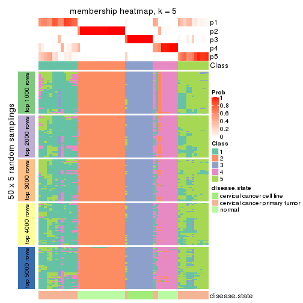</p>

</div>
<div id='tab-SD-skmeans-membership-heatmap-5'>
<pre><code class="r">membership_heatmap(res, k = 6)
</code></pre>

<p></p>

</div>
</div>

As soon as we have had the classes for columns, we can look for signatures
which are significantly different between classes which can be candidate marks
for certain classes. Following are the heatmaps for signatures.


Signature heatmaps where rows are scaled:


<script>
$( function() {
	$( '#tabs-SD-skmeans-get-signatures' ).tabs();
} );
</script>
<div id='tabs-SD-skmeans-get-signatures'>
<ul>
<li><a href='#tab-SD-skmeans-get-signatures-1'>k = 2</a></li>
<li><a href='#tab-SD-skmeans-get-signatures-2'>k = 3</a></li>
<li><a href='#tab-SD-skmeans-get-signatures-3'>k = 4</a></li>
<li><a href='#tab-SD-skmeans-get-signatures-4'>k = 5</a></li>
<li><a href='#tab-SD-skmeans-get-signatures-5'>k = 6</a></li>
</ul>
<div id='tab-SD-skmeans-get-signatures-1'>
<pre><code class="r">get_signatures(res, k = 2)
</code></pre>

<p></p>

</div>
<div id='tab-SD-skmeans-get-signatures-2'>
<pre><code class="r">get_signatures(res, k = 3)
</code></pre>

<p></p>

</div>
<div id='tab-SD-skmeans-get-signatures-3'>
<pre><code class="r">get_signatures(res, k = 4)
</code></pre>

<p></p>

</div>
<div id='tab-SD-skmeans-get-signatures-4'>
<pre><code class="r">get_signatures(res, k = 5)
</code></pre>

<p></p>

</div>
<div id='tab-SD-skmeans-get-signatures-5'>
<pre><code class="r">get_signatures(res, k = 6)
</code></pre>

<p></p>

</div>
</div>


Signature heatmaps where rows are not scaled:


<script>
$( function() {
	$( '#tabs-SD-skmeans-get-signatures-no-scale' ).tabs();
} );
</script>
<div id='tabs-SD-skmeans-get-signatures-no-scale'>
<ul>
<li><a href='#tab-SD-skmeans-get-signatures-no-scale-1'>k = 2</a></li>
<li><a href='#tab-SD-skmeans-get-signatures-no-scale-2'>k = 3</a></li>
<li><a href='#tab-SD-skmeans-get-signatures-no-scale-3'>k = 4</a></li>
<li><a href='#tab-SD-skmeans-get-signatures-no-scale-4'>k = 5</a></li>
<li><a href='#tab-SD-skmeans-get-signatures-no-scale-5'>k = 6</a></li>
</ul>
<div id='tab-SD-skmeans-get-signatures-no-scale-1'>
<pre><code class="r">get_signatures(res, k = 2, scale_rows = FALSE)
</code></pre>

<p></p>

</div>
<div id='tab-SD-skmeans-get-signatures-no-scale-2'>
<pre><code class="r">get_signatures(res, k = 3, scale_rows = FALSE)
</code></pre>

<p></p>

</div>
<div id='tab-SD-skmeans-get-signatures-no-scale-3'>
<pre><code class="r">get_signatures(res, k = 4, scale_rows = FALSE)
</code></pre>

<p></p>

</div>
<div id='tab-SD-skmeans-get-signatures-no-scale-4'>
<pre><code class="r">get_signatures(res, k = 5, scale_rows = FALSE)
</code></pre>

<p></p>

</div>
<div id='tab-SD-skmeans-get-signatures-no-scale-5'>
<pre><code class="r">get_signatures(res, k = 6, scale_rows = FALSE)
</code></pre>

<p></p>

</div>
</div>


Compare the overlap of signatures from different k:

```r
compare_signatures(res)
```


`get_signature()` returns a data frame invisibly. TO get the list of signatures, the function
call should be assigned to a variable explicitly. In following code, if `plot` argument is set
to `FALSE`, no heatmap is plotted while only the differential analysis is performed.

```r
# code only for demonstration
tb = get_signature(res, k = ..., plot = FALSE)
```

An example of the output of `tb` is:

```
#>   which_row         fdr    mean_1    mean_2 scaled_mean_1 scaled_mean_2 km
#> 1        38 0.042760348  8.373488  9.131774    -0.5533452     0.5164555  1
#> 2        40 0.018707592  7.106213  8.469186    -0.6173731     0.5762149  1
#> 3        55 0.019134737 10.221463 11.207825    -0.6159697     0.5749050  1
#> 4        59 0.006059896  5.921854  7.869574    -0.6899429     0.6439467  1
#> 5        60 0.018055526  8.928898 10.211722    -0.6204761     0.5791110  1
#> 6        98 0.009384629 15.714769 14.887706     0.6635654    -0.6193277  2
...
```

The columns in `tb` are:

1. `which_row`: row indices corresponding to the input matrix.
2. `fdr`: FDR for the differential test. 
3. `mean_x`: The mean value in group x.
4. `scaled_mean_x`: The mean value in group x after rows are scaled.
5. `km`: Row groups if k-means clustering is applied to rows.


UMAP plot which shows how samples are separated.


<script>
$( function() {
	$( '#tabs-SD-skmeans-dimension-reduction' ).tabs();
} );
</script>
<div id='tabs-SD-skmeans-dimension-reduction'>
<ul>
<li><a href='#tab-SD-skmeans-dimension-reduction-1'>k = 2</a></li>
<li><a href='#tab-SD-skmeans-dimension-reduction-2'>k = 3</a></li>
<li><a href='#tab-SD-skmeans-dimension-reduction-3'>k = 4</a></li>
<li><a href='#tab-SD-skmeans-dimension-reduction-4'>k = 5</a></li>
<li><a href='#tab-SD-skmeans-dimension-reduction-5'>k = 6</a></li>
</ul>
<div id='tab-SD-skmeans-dimension-reduction-1'>
<pre><code class="r">dimension_reduction(res, k = 2, method = &quot;UMAP&quot;)
</code></pre>

<p></p>

</div>
<div id='tab-SD-skmeans-dimension-reduction-2'>
<pre><code class="r">dimension_reduction(res, k = 3, method = &quot;UMAP&quot;)
</code></pre>

<p></p>

</div>
<div id='tab-SD-skmeans-dimension-reduction-3'>
<pre><code class="r">dimension_reduction(res, k = 4, method = &quot;UMAP&quot;)
</code></pre>

<p></p>

</div>
<div id='tab-SD-skmeans-dimension-reduction-4'>
<pre><code class="r">dimension_reduction(res, k = 5, method = &quot;UMAP&quot;)
</code></pre>

<p></p>

</div>
<div id='tab-SD-skmeans-dimension-reduction-5'>
<pre><code class="r">dimension_reduction(res, k = 6, method = &quot;UMAP&quot;)
</code></pre>

<p></p>

</div>
</div>


Following heatmap shows how subgroups are split when increasing `k`:

```r
collect_classes(res)
```


Test correlation between subgroups and known annotations. If the known
annotation is numeric, one-way ANOVA test is applied, and if the known
annotation is discrete, chi-squared contingency table test is applied.

```r
test_to_known_factors(res)
```

```
#>             n disease.state(p) k
#> SD:skmeans 60         9.36e-14 2
#> SD:skmeans 58         1.47e-12 3
#> SD:skmeans 58         5.27e-17 4
#> SD:skmeans 45         1.46e-14 5
#> SD:skmeans 40         5.02e-13 6
```


If matrix rows can be associated to genes, consider to use `GO_Enrichment(res,
...)` to perform function enrichment for the signature genes.


 

---------------------------------------------------


### SD:pam**


The object with results only for a single top-value method and a single partition method 
can be extracted as:

```r
res = res_list["SD", "pam"]
# you can also extract it by
# res = res_list["SD:pam"]
```

A summary of `res` and all the functions that can be applied to it:

```r
res
```

```
#> A 'ConsensusPartition' object with k = 2, 3, 4, 5, 6.
#>   On a matrix with 21168 rows and 61 columns.
#>   Top rows (1000, 2000, 3000, 4000, 5000) are extracted by 'SD' method.
#>   Subgroups are detected by 'pam' method.
#>   Performed in total 1250 partitions by row resampling.
#>   Best k for subgroups seems to be 4.
#> 
#> Following methods can be applied to this 'ConsensusPartition' object:
#>  [1] "cola_report"             "collect_classes"         "collect_plots"          
#>  [4] "collect_stats"           "colnames"                "compare_signatures"     
#>  [7] "consensus_heatmap"       "dimension_reduction"     "functional_enrichment"  
#> [10] "get_anno_col"            "get_anno"                "get_classes"            
#> [13] "get_consensus"           "get_matrix"              "get_membership"         
#> [16] "get_param"               "get_signatures"          "get_stats"              
#> [19] "is_best_k"               "is_stable_k"             "membership_heatmap"     
#> [22] "ncol"                    "nrow"                    "plot_ecdf"              
#> [25] "rownames"                "select_partition_number" "show"                   
#> [28] "suggest_best_k"          "test_to_known_factors"
```

`collect_plots()` function collects all the plots made from `res` for all `k` (number of partitions)
into one single page to provide an easy and fast comparison between different `k`.

```r
collect_plots(res)
```


The plots are:

- The first row: a plot of the ECDF (Empirical cumulative distribution
  function) curves of the consensus matrix for each `k` and the heatmap of
  predicted classes for each `k`.
- The second row: heatmaps of the consensus matrix for each `k`.
- The third row: heatmaps of the membership matrix for each `k`.
- The fouth row: heatmaps of the signatures for each `k`.

All the plots in panels can be made by individual functions and they are
plotted later in this section.

`select_partition_number()` produces several plots showing different
statistics for choosing "optimized" `k`. There are following statistics:

- ECDF curves of the consensus matrix for each `k`;
- 1-PAC. [The PAC
  score](https://en.wikipedia.org/wiki/Consensus_clustering#Over-interpretation_potential_of_consensus_clustering)
  measures the proportion of the ambiguous subgrouping.
- Mean silhouette score.
- Concordance. The mean probability of fiting the consensus class ids in all
  partitions.
- Area increased. Denote $A_k$ as the area under the ECDF curve for current
  `k`, the area increased is defined as $A_k - A_{k-1}$.
- Rand index. The percent of pairs of samples that are both in a same cluster
  or both are not in a same cluster in the partition of k and k-1.
- Jaccard index. The ratio of pairs of samples are both in a same cluster in
  the partition of k and k-1 and the pairs of samples are both in a same
  cluster in the partition k or k-1.

The detailed explanations of these statistics can be found in [the cola
vignette](http://bioconductor.org/packages/devel/bioc/vignettes/cola/inst/doc/cola.html#toc_13).

Generally speaking, lower PAC score, higher mean silhouette score or higher
concordance corresponds to better partition. Rand index and Jaccard index
measure how similar the current partition is compared to partition with `k-1`.
If they are too similar, we won't accept `k` is better than `k-1`.

```r
select_partition_number(res)
```


The numeric values for all these statistics can be obtained by `get_stats()`.

```r
get_stats(res)
```

```
#>   k 1-PAC mean_silhouette concordance area_increased  Rand Jaccard
#> 2 2 1.000           0.972       0.987         0.4560 0.552   0.552
#> 3 3 1.000           0.999       1.000         0.3283 0.843   0.715
#> 4 4 1.000           0.963       0.987         0.1144 0.926   0.814
#> 5 5 0.858           0.811       0.914         0.1411 0.907   0.713
#> 6 6 0.839           0.726       0.877         0.0178 0.979   0.912
```

`suggest_best_k()` suggests the best $k$ based on these statistics. The rules are as follows:

- All $k$ with Jaccard index larger than 0.95 are removed because the increase of
  the partition number does not provides enough extra information. If all $k$ are removed,
  the best $k$ is assigned by `NA`.
- For $k$ with 1-PAC larger than 0.9, the maximal $k$ is taken as the "best k". Other $k$ is called "optional k".
- If it does not fit the second rule. The $k$ with the highest vote of highest
  1-PAC, mean silhouette and concordance is taken as the "best k".

```r
suggest_best_k(res)
```

```
#> [1] 4
#> attr(,"optional")
#> [1] 2 3
```

There is also optional best $k$ = 2 3 that is worth to check.

Following shows the table of the partitions (You need to click the **show/hide
code output** link to see it). The membership matrix (columns with name `p*`)
is inferred by
[`clue::cl_consensus()`](https://www.rdocumentation.org/link/cl_consensus?package=clue)
function with the `SE` method. Basically the value in the membership matrix
represents the probability to belong to a certain group. The finall class
label for an item is determined with the group with highest probability it
belongs to.

In `get_classes()` function, the entropy is calculated from the membership
matrix and the silhouette score is calculated from the consensus matrix.


<script>
$( function() {
	$( '#tabs-SD-pam-get-classes' ).tabs();
} );
</script>
<div id='tabs-SD-pam-get-classes'>
<ul>
<li><a href='#tab-SD-pam-get-classes-1'>k = 2</a></li>
<li><a href='#tab-SD-pam-get-classes-2'>k = 3</a></li>
<li><a href='#tab-SD-pam-get-classes-3'>k = 4</a></li>
<li><a href='#tab-SD-pam-get-classes-4'>k = 5</a></li>
<li><a href='#tab-SD-pam-get-classes-5'>k = 6</a></li>
</ul>

<div id='tab-SD-pam-get-classes-1'>
<p><a id='tab-SD-pam-get-classes-1-a' style='color:#0366d6' href='#'>show/hide code output</a></p>
<pre><code class="r">cbind(get_classes(res, k = 2), get_membership(res, k = 2))
</code></pre>

<pre><code>#&gt;           class entropy silhouette    p1    p2
#&gt; GSM246087     1  0.8207      0.676 0.744 0.256
#&gt; GSM246088     1  0.0938      0.971 0.988 0.012
#&gt; GSM246089     1  0.0000      0.981 1.000 0.000
#&gt; GSM246090     1  0.2778      0.939 0.952 0.048
#&gt; GSM246119     1  0.0000      0.981 1.000 0.000
#&gt; GSM246120     1  0.0000      0.981 1.000 0.000
#&gt; GSM246121     1  0.6712      0.794 0.824 0.176
#&gt; GSM246122     1  0.8443      0.649 0.728 0.272
#&gt; GSM246123     1  0.0000      0.981 1.000 0.000
#&gt; GSM246422     1  0.0000      0.981 1.000 0.000
#&gt; GSM246423     1  0.0000      0.981 1.000 0.000
#&gt; GSM246484     1  0.0376      0.978 0.996 0.004
#&gt; GSM246485     2  0.0672      0.992 0.008 0.992
#&gt; GSM246486     2  0.0000      0.999 0.000 1.000
#&gt; GSM246487     1  0.0376      0.978 0.996 0.004
#&gt; GSM246488     2  0.0000      0.999 0.000 1.000
#&gt; GSM246489     2  0.0000      0.999 0.000 1.000
#&gt; GSM246490     2  0.0000      0.999 0.000 1.000
#&gt; GSM246491     2  0.0000      0.999 0.000 1.000
#&gt; GSM247162     2  0.0000      0.999 0.000 1.000
#&gt; GSM247163     2  0.0000      0.999 0.000 1.000
#&gt; GSM247164     2  0.0000      0.999 0.000 1.000
#&gt; GSM247165     2  0.0000      0.999 0.000 1.000
#&gt; GSM247166     2  0.0000      0.999 0.000 1.000
#&gt; GSM247168     2  0.0000      0.999 0.000 1.000
#&gt; GSM247169     2  0.0000      0.999 0.000 1.000
#&gt; GSM247171     2  0.0000      0.999 0.000 1.000
#&gt; GSM247173     2  0.0000      0.999 0.000 1.000
#&gt; GSM247174     2  0.0000      0.999 0.000 1.000
#&gt; GSM247175     2  0.0000      0.999 0.000 1.000
#&gt; GSM247188     2  0.0000      0.999 0.000 1.000
#&gt; GSM247189     2  0.0376      0.996 0.004 0.996
#&gt; GSM247190     2  0.0000      0.999 0.000 1.000
#&gt; GSM247650     1  0.0000      0.981 1.000 0.000
#&gt; GSM247651     1  0.0000      0.981 1.000 0.000
#&gt; GSM247652     1  0.0000      0.981 1.000 0.000
#&gt; GSM247653     1  0.0000      0.981 1.000 0.000
#&gt; GSM247654     1  0.0000      0.981 1.000 0.000
#&gt; GSM247655     1  0.0000      0.981 1.000 0.000
#&gt; GSM247656     1  0.0000      0.981 1.000 0.000
#&gt; GSM247657     1  0.0000      0.981 1.000 0.000
#&gt; GSM247658     1  0.0000      0.981 1.000 0.000
#&gt; GSM247659     1  0.0000      0.981 1.000 0.000
#&gt; GSM247660     1  0.0000      0.981 1.000 0.000
#&gt; GSM247661     1  0.0000      0.981 1.000 0.000
#&gt; GSM247662     1  0.0000      0.981 1.000 0.000
#&gt; GSM247663     1  0.0000      0.981 1.000 0.000
#&gt; GSM247856     1  0.0000      0.981 1.000 0.000
#&gt; GSM247857     1  0.0000      0.981 1.000 0.000
#&gt; GSM247859     1  0.0000      0.981 1.000 0.000
#&gt; GSM247860     1  0.0000      0.981 1.000 0.000
#&gt; GSM247862     1  0.0000      0.981 1.000 0.000
#&gt; GSM247864     1  0.0000      0.981 1.000 0.000
#&gt; GSM247865     1  0.0000      0.981 1.000 0.000
#&gt; GSM247866     1  0.0000      0.981 1.000 0.000
#&gt; GSM247876     1  0.0000      0.981 1.000 0.000
#&gt; GSM247877     1  0.0000      0.981 1.000 0.000
#&gt; GSM247878     1  0.0000      0.981 1.000 0.000
#&gt; GSM247879     1  0.0000      0.981 1.000 0.000
#&gt; GSM247881     1  0.0000      0.981 1.000 0.000
#&gt; GSM247883     1  0.0000      0.981 1.000 0.000
</code></pre>

<script>
$('#tab-SD-pam-get-classes-1-a').parent().next().next().hide();
$('#tab-SD-pam-get-classes-1-a').click(function(){
  $('#tab-SD-pam-get-classes-1-a').parent().next().next().toggle();
  return(false);
});
</script>
</div>

<div id='tab-SD-pam-get-classes-2'>
<p><a id='tab-SD-pam-get-classes-2-a' style='color:#0366d6' href='#'>show/hide code output</a></p>
<pre><code class="r">cbind(get_classes(res, k = 3), get_membership(res, k = 3))
</code></pre>

<pre><code>#&gt;           class entropy silhouette    p1    p2 p3
#&gt; GSM246087     3  0.0000      1.000 0.000 0.000  1
#&gt; GSM246088     3  0.0000      1.000 0.000 0.000  1
#&gt; GSM246089     3  0.0000      1.000 0.000 0.000  1
#&gt; GSM246090     3  0.0000      1.000 0.000 0.000  1
#&gt; GSM246119     3  0.0000      1.000 0.000 0.000  1
#&gt; GSM246120     3  0.0000      1.000 0.000 0.000  1
#&gt; GSM246121     3  0.0000      1.000 0.000 0.000  1
#&gt; GSM246122     3  0.0000      1.000 0.000 0.000  1
#&gt; GSM246123     3  0.0000      1.000 0.000 0.000  1
#&gt; GSM246422     1  0.0000      1.000 1.000 0.000  0
#&gt; GSM246423     1  0.0000      1.000 1.000 0.000  0
#&gt; GSM246484     1  0.0000      1.000 1.000 0.000  0
#&gt; GSM246485     2  0.0592      0.984 0.012 0.988  0
#&gt; GSM246486     2  0.0000      0.999 0.000 1.000  0
#&gt; GSM246487     1  0.0000      1.000 1.000 0.000  0
#&gt; GSM246488     2  0.0000      0.999 0.000 1.000  0
#&gt; GSM246489     2  0.0000      0.999 0.000 1.000  0
#&gt; GSM246490     2  0.0000      0.999 0.000 1.000  0
#&gt; GSM246491     2  0.0000      0.999 0.000 1.000  0
#&gt; GSM247162     2  0.0000      0.999 0.000 1.000  0
#&gt; GSM247163     2  0.0000      0.999 0.000 1.000  0
#&gt; GSM247164     2  0.0000      0.999 0.000 1.000  0
#&gt; GSM247165     2  0.0000      0.999 0.000 1.000  0
#&gt; GSM247166     2  0.0000      0.999 0.000 1.000  0
#&gt; GSM247168     2  0.0000      0.999 0.000 1.000  0
#&gt; GSM247169     2  0.0000      0.999 0.000 1.000  0
#&gt; GSM247171     2  0.0000      0.999 0.000 1.000  0
#&gt; GSM247173     2  0.0000      0.999 0.000 1.000  0
#&gt; GSM247174     2  0.0000      0.999 0.000 1.000  0
#&gt; GSM247175     2  0.0000      0.999 0.000 1.000  0
#&gt; GSM247188     2  0.0000      0.999 0.000 1.000  0
#&gt; GSM247189     2  0.0237      0.994 0.004 0.996  0
#&gt; GSM247190     2  0.0000      0.999 0.000 1.000  0
#&gt; GSM247650     1  0.0000      1.000 1.000 0.000  0
#&gt; GSM247651     1  0.0000      1.000 1.000 0.000  0
#&gt; GSM247652     1  0.0000      1.000 1.000 0.000  0
#&gt; GSM247653     1  0.0000      1.000 1.000 0.000  0
#&gt; GSM247654     1  0.0000      1.000 1.000 0.000  0
#&gt; GSM247655     1  0.0000      1.000 1.000 0.000  0
#&gt; GSM247656     1  0.0000      1.000 1.000 0.000  0
#&gt; GSM247657     1  0.0000      1.000 1.000 0.000  0
#&gt; GSM247658     1  0.0000      1.000 1.000 0.000  0
#&gt; GSM247659     1  0.0000      1.000 1.000 0.000  0
#&gt; GSM247660     1  0.0000      1.000 1.000 0.000  0
#&gt; GSM247661     1  0.0000      1.000 1.000 0.000  0
#&gt; GSM247662     1  0.0000      1.000 1.000 0.000  0
#&gt; GSM247663     1  0.0000      1.000 1.000 0.000  0
#&gt; GSM247856     1  0.0000      1.000 1.000 0.000  0
#&gt; GSM247857     1  0.0000      1.000 1.000 0.000  0
#&gt; GSM247859     1  0.0000      1.000 1.000 0.000  0
#&gt; GSM247860     1  0.0000      1.000 1.000 0.000  0
#&gt; GSM247862     1  0.0000      1.000 1.000 0.000  0
#&gt; GSM247864     1  0.0000      1.000 1.000 0.000  0
#&gt; GSM247865     1  0.0000      1.000 1.000 0.000  0
#&gt; GSM247866     1  0.0000      1.000 1.000 0.000  0
#&gt; GSM247876     1  0.0000      1.000 1.000 0.000  0
#&gt; GSM247877     1  0.0000      1.000 1.000 0.000  0
#&gt; GSM247878     1  0.0000      1.000 1.000 0.000  0
#&gt; GSM247879     1  0.0000      1.000 1.000 0.000  0
#&gt; GSM247881     1  0.0000      1.000 1.000 0.000  0
#&gt; GSM247883     1  0.0000      1.000 1.000 0.000  0
</code></pre>

<script>
$('#tab-SD-pam-get-classes-2-a').parent().next().next().hide();
$('#tab-SD-pam-get-classes-2-a').click(function(){
  $('#tab-SD-pam-get-classes-2-a').parent().next().next().toggle();
  return(false);
});
</script>
</div>

<div id='tab-SD-pam-get-classes-3'>
<p><a id='tab-SD-pam-get-classes-3-a' style='color:#0366d6' href='#'>show/hide code output</a></p>
<pre><code class="r">cbind(get_classes(res, k = 4), get_membership(res, k = 4))
</code></pre>

<pre><code>#&gt;           class entropy silhouette    p1    p2 p3    p4
#&gt; GSM246087     3  0.0000      1.000 0.000 0.000  1 0.000
#&gt; GSM246088     3  0.0000      1.000 0.000 0.000  1 0.000
#&gt; GSM246089     3  0.0000      1.000 0.000 0.000  1 0.000
#&gt; GSM246090     3  0.0000      1.000 0.000 0.000  1 0.000
#&gt; GSM246119     3  0.0000      1.000 0.000 0.000  1 0.000
#&gt; GSM246120     3  0.0000      1.000 0.000 0.000  1 0.000
#&gt; GSM246121     3  0.0000      1.000 0.000 0.000  1 0.000
#&gt; GSM246122     3  0.0000      1.000 0.000 0.000  1 0.000
#&gt; GSM246123     3  0.0000      1.000 0.000 0.000  1 0.000
#&gt; GSM246422     4  0.0000      0.863 0.000 0.000  0 1.000
#&gt; GSM246423     4  0.0000      0.863 0.000 0.000  0 1.000
#&gt; GSM246484     4  0.0000      0.863 0.000 0.000  0 1.000
#&gt; GSM246485     2  0.0336      0.979 0.008 0.992  0 0.000
#&gt; GSM246486     2  0.3569      0.758 0.000 0.804  0 0.196
#&gt; GSM246487     1  0.0000      0.989 1.000 0.000  0 0.000
#&gt; GSM246488     4  0.0000      0.863 0.000 0.000  0 1.000
#&gt; GSM246489     2  0.0000      0.988 0.000 1.000  0 0.000
#&gt; GSM246490     2  0.0000      0.988 0.000 1.000  0 0.000
#&gt; GSM246491     2  0.0000      0.988 0.000 1.000  0 0.000
#&gt; GSM247162     2  0.0000      0.988 0.000 1.000  0 0.000
#&gt; GSM247163     2  0.0000      0.988 0.000 1.000  0 0.000
#&gt; GSM247164     2  0.0000      0.988 0.000 1.000  0 0.000
#&gt; GSM247165     2  0.0000      0.988 0.000 1.000  0 0.000
#&gt; GSM247166     2  0.0000      0.988 0.000 1.000  0 0.000
#&gt; GSM247168     2  0.0000      0.988 0.000 1.000  0 0.000
#&gt; GSM247169     2  0.0000      0.988 0.000 1.000  0 0.000
#&gt; GSM247171     2  0.0000      0.988 0.000 1.000  0 0.000
#&gt; GSM247173     2  0.0000      0.988 0.000 1.000  0 0.000
#&gt; GSM247174     2  0.0000      0.988 0.000 1.000  0 0.000
#&gt; GSM247175     2  0.0000      0.988 0.000 1.000  0 0.000
#&gt; GSM247188     2  0.0000      0.988 0.000 1.000  0 0.000
#&gt; GSM247189     2  0.0188      0.984 0.004 0.996  0 0.000
#&gt; GSM247190     2  0.0000      0.988 0.000 1.000  0 0.000
#&gt; GSM247650     1  0.0000      0.989 1.000 0.000  0 0.000
#&gt; GSM247651     1  0.0000      0.989 1.000 0.000  0 0.000
#&gt; GSM247652     1  0.0000      0.989 1.000 0.000  0 0.000
#&gt; GSM247653     1  0.0000      0.989 1.000 0.000  0 0.000
#&gt; GSM247654     1  0.0000      0.989 1.000 0.000  0 0.000
#&gt; GSM247655     1  0.0000      0.989 1.000 0.000  0 0.000
#&gt; GSM247656     1  0.0000      0.989 1.000 0.000  0 0.000
#&gt; GSM247657     1  0.0000      0.989 1.000 0.000  0 0.000
#&gt; GSM247658     1  0.0000      0.989 1.000 0.000  0 0.000
#&gt; GSM247659     1  0.0000      0.989 1.000 0.000  0 0.000
#&gt; GSM247660     1  0.0000      0.989 1.000 0.000  0 0.000
#&gt; GSM247661     1  0.0000      0.989 1.000 0.000  0 0.000
#&gt; GSM247662     1  0.0000      0.989 1.000 0.000  0 0.000
#&gt; GSM247663     1  0.0000      0.989 1.000 0.000  0 0.000
#&gt; GSM247856     1  0.0000      0.989 1.000 0.000  0 0.000
#&gt; GSM247857     1  0.0000      0.989 1.000 0.000  0 0.000
#&gt; GSM247859     1  0.0000      0.989 1.000 0.000  0 0.000
#&gt; GSM247860     1  0.0000      0.989 1.000 0.000  0 0.000
#&gt; GSM247862     1  0.0000      0.989 1.000 0.000  0 0.000
#&gt; GSM247864     1  0.0000      0.989 1.000 0.000  0 0.000
#&gt; GSM247865     1  0.0000      0.989 1.000 0.000  0 0.000
#&gt; GSM247866     1  0.0000      0.989 1.000 0.000  0 0.000
#&gt; GSM247876     1  0.0000      0.989 1.000 0.000  0 0.000
#&gt; GSM247877     4  0.4679      0.443 0.352 0.000  0 0.648
#&gt; GSM247878     1  0.4134      0.609 0.740 0.000  0 0.260
#&gt; GSM247879     1  0.0000      0.989 1.000 0.000  0 0.000
#&gt; GSM247881     1  0.0000      0.989 1.000 0.000  0 0.000
#&gt; GSM247883     1  0.0000      0.989 1.000 0.000  0 0.000
</code></pre>

<script>
$('#tab-SD-pam-get-classes-3-a').parent().next().next().hide();
$('#tab-SD-pam-get-classes-3-a').click(function(){
  $('#tab-SD-pam-get-classes-3-a').parent().next().next().toggle();
  return(false);
});
</script>
</div>

<div id='tab-SD-pam-get-classes-4'>
<p><a id='tab-SD-pam-get-classes-4-a' style='color:#0366d6' href='#'>show/hide code output</a></p>
<pre><code class="r">cbind(get_classes(res, k = 5), get_membership(res, k = 5))
</code></pre>

<pre><code>#&gt;           class entropy silhouette    p1    p2 p3    p4    p5
#&gt; GSM246087     3  0.0000     1.0000 0.000 0.000  1 0.000 0.000
#&gt; GSM246088     3  0.0000     1.0000 0.000 0.000  1 0.000 0.000
#&gt; GSM246089     3  0.0000     1.0000 0.000 0.000  1 0.000 0.000
#&gt; GSM246090     3  0.0000     1.0000 0.000 0.000  1 0.000 0.000
#&gt; GSM246119     3  0.0000     1.0000 0.000 0.000  1 0.000 0.000
#&gt; GSM246120     3  0.0000     1.0000 0.000 0.000  1 0.000 0.000
#&gt; GSM246121     3  0.0000     1.0000 0.000 0.000  1 0.000 0.000
#&gt; GSM246122     3  0.0000     1.0000 0.000 0.000  1 0.000 0.000
#&gt; GSM246123     3  0.0000     1.0000 0.000 0.000  1 0.000 0.000
#&gt; GSM246422     4  0.0000     0.8766 0.000 0.000  0 1.000 0.000
#&gt; GSM246423     4  0.0000     0.8766 0.000 0.000  0 1.000 0.000
#&gt; GSM246484     4  0.0000     0.8766 0.000 0.000  0 1.000 0.000
#&gt; GSM246485     2  0.0579     0.9731 0.008 0.984  0 0.000 0.008
#&gt; GSM246486     2  0.3074     0.7545 0.000 0.804  0 0.196 0.000
#&gt; GSM246487     1  0.0510     0.7607 0.984 0.000  0 0.000 0.016
#&gt; GSM246488     4  0.0000     0.8766 0.000 0.000  0 1.000 0.000
#&gt; GSM246489     2  0.0000     0.9876 0.000 1.000  0 0.000 0.000
#&gt; GSM246490     2  0.0000     0.9876 0.000 1.000  0 0.000 0.000
#&gt; GSM246491     2  0.0000     0.9876 0.000 1.000  0 0.000 0.000
#&gt; GSM247162     2  0.0000     0.9876 0.000 1.000  0 0.000 0.000
#&gt; GSM247163     2  0.0000     0.9876 0.000 1.000  0 0.000 0.000
#&gt; GSM247164     2  0.0000     0.9876 0.000 1.000  0 0.000 0.000
#&gt; GSM247165     2  0.0000     0.9876 0.000 1.000  0 0.000 0.000
#&gt; GSM247166     2  0.0000     0.9876 0.000 1.000  0 0.000 0.000
#&gt; GSM247168     2  0.0000     0.9876 0.000 1.000  0 0.000 0.000
#&gt; GSM247169     2  0.0000     0.9876 0.000 1.000  0 0.000 0.000
#&gt; GSM247171     2  0.0000     0.9876 0.000 1.000  0 0.000 0.000
#&gt; GSM247173     2  0.0000     0.9876 0.000 1.000  0 0.000 0.000
#&gt; GSM247174     2  0.0000     0.9876 0.000 1.000  0 0.000 0.000
#&gt; GSM247175     2  0.0000     0.9876 0.000 1.000  0 0.000 0.000
#&gt; GSM247188     2  0.0000     0.9876 0.000 1.000  0 0.000 0.000
#&gt; GSM247189     2  0.0162     0.9837 0.004 0.996  0 0.000 0.000
#&gt; GSM247190     2  0.0000     0.9876 0.000 1.000  0 0.000 0.000
#&gt; GSM247650     1  0.1270     0.7625 0.948 0.000  0 0.000 0.052
#&gt; GSM247651     1  0.0510     0.7607 0.984 0.000  0 0.000 0.016
#&gt; GSM247652     5  0.4030     0.4153 0.352 0.000  0 0.000 0.648
#&gt; GSM247653     5  0.3508     0.5882 0.252 0.000  0 0.000 0.748
#&gt; GSM247654     5  0.3074     0.6768 0.196 0.000  0 0.000 0.804
#&gt; GSM247655     1  0.0290     0.7627 0.992 0.000  0 0.000 0.008
#&gt; GSM247656     5  0.1121     0.7457 0.044 0.000  0 0.000 0.956
#&gt; GSM247657     5  0.0609     0.7742 0.020 0.000  0 0.000 0.980
#&gt; GSM247658     1  0.3003     0.6831 0.812 0.000  0 0.000 0.188
#&gt; GSM247659     5  0.1270     0.7783 0.052 0.000  0 0.000 0.948
#&gt; GSM247660     1  0.1121     0.7644 0.956 0.000  0 0.000 0.044
#&gt; GSM247661     5  0.3876     0.4514 0.316 0.000  0 0.000 0.684
#&gt; GSM247662     5  0.2471     0.7315 0.136 0.000  0 0.000 0.864
#&gt; GSM247663     1  0.1608     0.7596 0.928 0.000  0 0.000 0.072
#&gt; GSM247856     1  0.4192     0.4219 0.596 0.000  0 0.000 0.404
#&gt; GSM247857     5  0.1270     0.7783 0.052 0.000  0 0.000 0.948
#&gt; GSM247859     1  0.3876     0.5470 0.684 0.000  0 0.000 0.316
#&gt; GSM247860     1  0.4201     0.0758 0.592 0.000  0 0.000 0.408
#&gt; GSM247862     1  0.1121     0.7644 0.956 0.000  0 0.000 0.044
#&gt; GSM247864     1  0.1121     0.7644 0.956 0.000  0 0.000 0.044
#&gt; GSM247865     1  0.3876     0.5470 0.684 0.000  0 0.000 0.316
#&gt; GSM247866     1  0.1121     0.7644 0.956 0.000  0 0.000 0.044
#&gt; GSM247876     1  0.3999     0.5520 0.656 0.000  0 0.000 0.344
#&gt; GSM247877     4  0.4101     0.3464 0.372 0.000  0 0.628 0.000
#&gt; GSM247878     1  0.1908     0.7255 0.908 0.000  0 0.092 0.000
#&gt; GSM247879     1  0.1908     0.7320 0.908 0.000  0 0.000 0.092
#&gt; GSM247881     1  0.3913     0.5681 0.676 0.000  0 0.000 0.324
#&gt; GSM247883     1  0.4182     0.4193 0.600 0.000  0 0.000 0.400
</code></pre>

<script>
$('#tab-SD-pam-get-classes-4-a').parent().next().next().hide();
$('#tab-SD-pam-get-classes-4-a').click(function(){
  $('#tab-SD-pam-get-classes-4-a').parent().next().next().toggle();
  return(false);
});
</script>
</div>

<div id='tab-SD-pam-get-classes-5'>
<p><a id='tab-SD-pam-get-classes-5-a' style='color:#0366d6' href='#'>show/hide code output</a></p>
<pre><code class="r">cbind(get_classes(res, k = 6), get_membership(res, k = 6))
</code></pre>

<pre><code>#&gt;           class entropy silhouette    p1    p2    p3    p4    p5    p6
#&gt; GSM246087     3  0.1387     0.9211 0.000 0.000 0.932 0.000 0.000 0.068
#&gt; GSM246088     3  0.1387     0.9211 0.000 0.000 0.932 0.000 0.000 0.068
#&gt; GSM246089     3  0.3789     0.5625 0.000 0.000 0.584 0.000 0.000 0.416
#&gt; GSM246090     3  0.1387     0.9211 0.000 0.000 0.932 0.000 0.000 0.068
#&gt; GSM246119     3  0.0458     0.9203 0.000 0.000 0.984 0.000 0.000 0.016
#&gt; GSM246120     3  0.0458     0.9203 0.000 0.000 0.984 0.000 0.000 0.016
#&gt; GSM246121     3  0.0000     0.9220 0.000 0.000 1.000 0.000 0.000 0.000
#&gt; GSM246122     3  0.1387     0.9211 0.000 0.000 0.932 0.000 0.000 0.068
#&gt; GSM246123     3  0.0458     0.9203 0.000 0.000 0.984 0.000 0.000 0.016
#&gt; GSM246422     4  0.0000     0.8655 0.000 0.000 0.000 1.000 0.000 0.000
#&gt; GSM246423     4  0.0000     0.8655 0.000 0.000 0.000 1.000 0.000 0.000
#&gt; GSM246484     4  0.0000     0.8655 0.000 0.000 0.000 1.000 0.000 0.000
#&gt; GSM246485     2  0.0520     0.9731 0.008 0.984 0.000 0.000 0.008 0.000
#&gt; GSM246486     2  0.2762     0.7551 0.000 0.804 0.000 0.196 0.000 0.000
#&gt; GSM246487     1  0.0000     0.6817 1.000 0.000 0.000 0.000 0.000 0.000
#&gt; GSM246488     4  0.0000     0.8655 0.000 0.000 0.000 1.000 0.000 0.000
#&gt; GSM246489     2  0.0000     0.9876 0.000 1.000 0.000 0.000 0.000 0.000
#&gt; GSM246490     2  0.0000     0.9876 0.000 1.000 0.000 0.000 0.000 0.000
#&gt; GSM246491     2  0.0000     0.9876 0.000 1.000 0.000 0.000 0.000 0.000
#&gt; GSM247162     2  0.0000     0.9876 0.000 1.000 0.000 0.000 0.000 0.000
#&gt; GSM247163     2  0.0000     0.9876 0.000 1.000 0.000 0.000 0.000 0.000
#&gt; GSM247164     2  0.0000     0.9876 0.000 1.000 0.000 0.000 0.000 0.000
#&gt; GSM247165     2  0.0000     0.9876 0.000 1.000 0.000 0.000 0.000 0.000
#&gt; GSM247166     2  0.0000     0.9876 0.000 1.000 0.000 0.000 0.000 0.000
#&gt; GSM247168     2  0.0000     0.9876 0.000 1.000 0.000 0.000 0.000 0.000
#&gt; GSM247169     2  0.0000     0.9876 0.000 1.000 0.000 0.000 0.000 0.000
#&gt; GSM247171     2  0.0000     0.9876 0.000 1.000 0.000 0.000 0.000 0.000
#&gt; GSM247173     2  0.0000     0.9876 0.000 1.000 0.000 0.000 0.000 0.000
#&gt; GSM247174     2  0.0000     0.9876 0.000 1.000 0.000 0.000 0.000 0.000
#&gt; GSM247175     2  0.0000     0.9876 0.000 1.000 0.000 0.000 0.000 0.000
#&gt; GSM247188     2  0.0000     0.9876 0.000 1.000 0.000 0.000 0.000 0.000
#&gt; GSM247189     2  0.0146     0.9837 0.004 0.996 0.000 0.000 0.000 0.000
#&gt; GSM247190     2  0.0000     0.9876 0.000 1.000 0.000 0.000 0.000 0.000
#&gt; GSM247650     1  0.1267     0.6813 0.940 0.000 0.000 0.000 0.060 0.000
#&gt; GSM247651     1  0.0000     0.6817 1.000 0.000 0.000 0.000 0.000 0.000
#&gt; GSM247652     1  0.5731     0.0598 0.516 0.000 0.000 0.000 0.260 0.224
#&gt; GSM247653     6  0.5634     0.7787 0.164 0.000 0.000 0.000 0.336 0.500
#&gt; GSM247654     6  0.5486     0.7559 0.132 0.000 0.000 0.000 0.372 0.496
#&gt; GSM247655     1  0.0260     0.6834 0.992 0.000 0.000 0.000 0.008 0.000
#&gt; GSM247656     5  0.4291    -0.0128 0.052 0.000 0.000 0.000 0.680 0.268
#&gt; GSM247657     5  0.0260     0.6971 0.008 0.000 0.000 0.000 0.992 0.000
#&gt; GSM247658     1  0.4582     0.4210 0.684 0.000 0.000 0.000 0.100 0.216
#&gt; GSM247659     5  0.0146     0.7005 0.004 0.000 0.000 0.000 0.996 0.000
#&gt; GSM247660     1  0.1219     0.6833 0.948 0.000 0.000 0.000 0.048 0.004
#&gt; GSM247661     5  0.5461     0.2169 0.248 0.000 0.000 0.000 0.568 0.184
#&gt; GSM247662     5  0.1444     0.6483 0.072 0.000 0.000 0.000 0.928 0.000
#&gt; GSM247663     1  0.3651     0.5508 0.772 0.000 0.000 0.000 0.048 0.180
#&gt; GSM247856     1  0.5520     0.1184 0.532 0.000 0.000 0.000 0.312 0.156
#&gt; GSM247857     5  0.0146     0.7005 0.004 0.000 0.000 0.000 0.996 0.000
#&gt; GSM247859     1  0.4181     0.4496 0.700 0.000 0.000 0.000 0.248 0.052
#&gt; GSM247860     1  0.5190    -0.1859 0.464 0.000 0.000 0.000 0.088 0.448
#&gt; GSM247862     1  0.1219     0.6833 0.948 0.000 0.000 0.000 0.048 0.004
#&gt; GSM247864     1  0.1219     0.6833 0.948 0.000 0.000 0.000 0.048 0.004
#&gt; GSM247865     1  0.4181     0.4496 0.700 0.000 0.000 0.000 0.248 0.052
#&gt; GSM247866     1  0.1219     0.6833 0.948 0.000 0.000 0.000 0.048 0.004
#&gt; GSM247876     1  0.4481     0.4582 0.648 0.000 0.000 0.000 0.296 0.056
#&gt; GSM247877     4  0.4099     0.3451 0.372 0.000 0.000 0.612 0.000 0.016
#&gt; GSM247878     1  0.1610     0.6534 0.916 0.000 0.000 0.084 0.000 0.000
#&gt; GSM247879     1  0.2581     0.6099 0.856 0.000 0.000 0.000 0.128 0.016
#&gt; GSM247881     1  0.4809     0.4111 0.652 0.000 0.000 0.000 0.240 0.108
#&gt; GSM247883     1  0.5610     0.1153 0.536 0.000 0.000 0.000 0.272 0.192
</code></pre>

<script>
$('#tab-SD-pam-get-classes-5-a').parent().next().next().hide();
$('#tab-SD-pam-get-classes-5-a').click(function(){
  $('#tab-SD-pam-get-classes-5-a').parent().next().next().toggle();
  return(false);
});
</script>
</div>
</div>

Heatmaps for the consensus matrix. It visualizes the probability of two
samples to be in a same group.


<script>
$( function() {
	$( '#tabs-SD-pam-consensus-heatmap' ).tabs();
} );
</script>
<div id='tabs-SD-pam-consensus-heatmap'>
<ul>
<li><a href='#tab-SD-pam-consensus-heatmap-1'>k = 2</a></li>
<li><a href='#tab-SD-pam-consensus-heatmap-2'>k = 3</a></li>
<li><a href='#tab-SD-pam-consensus-heatmap-3'>k = 4</a></li>
<li><a href='#tab-SD-pam-consensus-heatmap-4'>k = 5</a></li>
<li><a href='#tab-SD-pam-consensus-heatmap-5'>k = 6</a></li>
</ul>
<div id='tab-SD-pam-consensus-heatmap-1'>
<pre><code class="r">consensus_heatmap(res, k = 2)
</code></pre>

<p></p>

</div>
<div id='tab-SD-pam-consensus-heatmap-2'>
<pre><code class="r">consensus_heatmap(res, k = 3)
</code></pre>

<p></p>

</div>
<div id='tab-SD-pam-consensus-heatmap-3'>
<pre><code class="r">consensus_heatmap(res, k = 4)
</code></pre>

<p></p>

</div>
<div id='tab-SD-pam-consensus-heatmap-4'>
<pre><code class="r">consensus_heatmap(res, k = 5)
</code></pre>

<p></p>

</div>
<div id='tab-SD-pam-consensus-heatmap-5'>
<pre><code class="r">consensus_heatmap(res, k = 6)
</code></pre>

<p></p>

</div>
</div>

Heatmaps for the membership of samples in all partitions to see how consistent they are:


<script>
$( function() {
	$( '#tabs-SD-pam-membership-heatmap' ).tabs();
} );
</script>
<div id='tabs-SD-pam-membership-heatmap'>
<ul>
<li><a href='#tab-SD-pam-membership-heatmap-1'>k = 2</a></li>
<li><a href='#tab-SD-pam-membership-heatmap-2'>k = 3</a></li>
<li><a href='#tab-SD-pam-membership-heatmap-3'>k = 4</a></li>
<li><a href='#tab-SD-pam-membership-heatmap-4'>k = 5</a></li>
<li><a href='#tab-SD-pam-membership-heatmap-5'>k = 6</a></li>
</ul>
<div id='tab-SD-pam-membership-heatmap-1'>
<pre><code class="r">membership_heatmap(res, k = 2)
</code></pre>

<p></p>

</div>
<div id='tab-SD-pam-membership-heatmap-2'>
<pre><code class="r">membership_heatmap(res, k = 3)
</code></pre>

<p></p>

</div>
<div id='tab-SD-pam-membership-heatmap-3'>
<pre><code class="r">membership_heatmap(res, k = 4)
</code></pre>

<p></p>

</div>
<div id='tab-SD-pam-membership-heatmap-4'>
<pre><code class="r">membership_heatmap(res, k = 5)
</code></pre>

<p></p>

</div>
<div id='tab-SD-pam-membership-heatmap-5'>
<pre><code class="r">membership_heatmap(res, k = 6)
</code></pre>

<p></p>

</div>
</div>

As soon as we have had the classes for columns, we can look for signatures
which are significantly different between classes which can be candidate marks
for certain classes. Following are the heatmaps for signatures.


Signature heatmaps where rows are scaled:


<script>
$( function() {
	$( '#tabs-SD-pam-get-signatures' ).tabs();
} );
</script>
<div id='tabs-SD-pam-get-signatures'>
<ul>
<li><a href='#tab-SD-pam-get-signatures-1'>k = 2</a></li>
<li><a href='#tab-SD-pam-get-signatures-2'>k = 3</a></li>
<li><a href='#tab-SD-pam-get-signatures-3'>k = 4</a></li>
<li><a href='#tab-SD-pam-get-signatures-4'>k = 5</a></li>
<li><a href='#tab-SD-pam-get-signatures-5'>k = 6</a></li>
</ul>
<div id='tab-SD-pam-get-signatures-1'>
<pre><code class="r">get_signatures(res, k = 2)
</code></pre>

<p></p>

</div>
<div id='tab-SD-pam-get-signatures-2'>
<pre><code class="r">get_signatures(res, k = 3)
</code></pre>

<p></p>

</div>
<div id='tab-SD-pam-get-signatures-3'>
<pre><code class="r">get_signatures(res, k = 4)
</code></pre>

<p></p>

</div>
<div id='tab-SD-pam-get-signatures-4'>
<pre><code class="r">get_signatures(res, k = 5)
</code></pre>

<p></p>

</div>
<div id='tab-SD-pam-get-signatures-5'>
<pre><code class="r">get_signatures(res, k = 6)
</code></pre>

<p></p>

</div>
</div>


Signature heatmaps where rows are not scaled:


<script>
$( function() {
	$( '#tabs-SD-pam-get-signatures-no-scale' ).tabs();
} );
</script>
<div id='tabs-SD-pam-get-signatures-no-scale'>
<ul>
<li><a href='#tab-SD-pam-get-signatures-no-scale-1'>k = 2</a></li>
<li><a href='#tab-SD-pam-get-signatures-no-scale-2'>k = 3</a></li>
<li><a href='#tab-SD-pam-get-signatures-no-scale-3'>k = 4</a></li>
<li><a href='#tab-SD-pam-get-signatures-no-scale-4'>k = 5</a></li>
<li><a href='#tab-SD-pam-get-signatures-no-scale-5'>k = 6</a></li>
</ul>
<div id='tab-SD-pam-get-signatures-no-scale-1'>
<pre><code class="r">get_signatures(res, k = 2, scale_rows = FALSE)
</code></pre>

<p></p>

</div>
<div id='tab-SD-pam-get-signatures-no-scale-2'>
<pre><code class="r">get_signatures(res, k = 3, scale_rows = FALSE)
</code></pre>

<p></p>

</div>
<div id='tab-SD-pam-get-signatures-no-scale-3'>
<pre><code class="r">get_signatures(res, k = 4, scale_rows = FALSE)
</code></pre>

<p></p>

</div>
<div id='tab-SD-pam-get-signatures-no-scale-4'>
<pre><code class="r">get_signatures(res, k = 5, scale_rows = FALSE)
</code></pre>

<p></p>

</div>
<div id='tab-SD-pam-get-signatures-no-scale-5'>
<pre><code class="r">get_signatures(res, k = 6, scale_rows = FALSE)
</code></pre>

<p></p>

</div>
</div>


Compare the overlap of signatures from different k:

```r
compare_signatures(res)
```

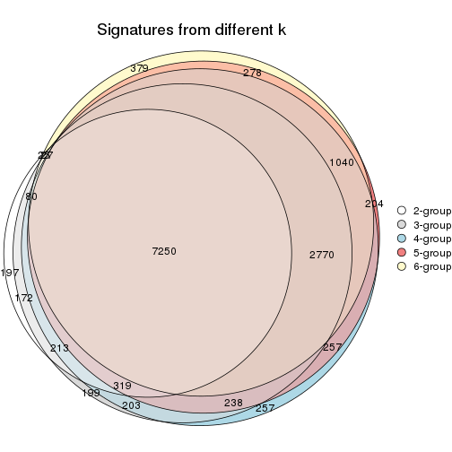

`get_signature()` returns a data frame invisibly. TO get the list of signatures, the function
call should be assigned to a variable explicitly. In following code, if `plot` argument is set
to `FALSE`, no heatmap is plotted while only the differential analysis is performed.

```r
# code only for demonstration
tb = get_signature(res, k = ..., plot = FALSE)
```

An example of the output of `tb` is:

```
#>   which_row         fdr    mean_1    mean_2 scaled_mean_1 scaled_mean_2 km
#> 1        38 0.042760348  8.373488  9.131774    -0.5533452     0.5164555  1
#> 2        40 0.018707592  7.106213  8.469186    -0.6173731     0.5762149  1
#> 3        55 0.019134737 10.221463 11.207825    -0.6159697     0.5749050  1
#> 4        59 0.006059896  5.921854  7.869574    -0.6899429     0.6439467  1
#> 5        60 0.018055526  8.928898 10.211722    -0.6204761     0.5791110  1
#> 6        98 0.009384629 15.714769 14.887706     0.6635654    -0.6193277  2
...
```

The columns in `tb` are:

1. `which_row`: row indices corresponding to the input matrix.
2. `fdr`: FDR for the differential test. 
3. `mean_x`: The mean value in group x.
4. `scaled_mean_x`: The mean value in group x after rows are scaled.
5. `km`: Row groups if k-means clustering is applied to rows.


UMAP plot which shows how samples are separated.


<script>
$( function() {
	$( '#tabs-SD-pam-dimension-reduction' ).tabs();
} );
</script>
<div id='tabs-SD-pam-dimension-reduction'>
<ul>
<li><a href='#tab-SD-pam-dimension-reduction-1'>k = 2</a></li>
<li><a href='#tab-SD-pam-dimension-reduction-2'>k = 3</a></li>
<li><a href='#tab-SD-pam-dimension-reduction-3'>k = 4</a></li>
<li><a href='#tab-SD-pam-dimension-reduction-4'>k = 5</a></li>
<li><a href='#tab-SD-pam-dimension-reduction-5'>k = 6</a></li>
</ul>
<div id='tab-SD-pam-dimension-reduction-1'>
<pre><code class="r">dimension_reduction(res, k = 2, method = &quot;UMAP&quot;)
</code></pre>

<p></p>

</div>
<div id='tab-SD-pam-dimension-reduction-2'>
<pre><code class="r">dimension_reduction(res, k = 3, method = &quot;UMAP&quot;)
</code></pre>

<p></p>

</div>
<div id='tab-SD-pam-dimension-reduction-3'>
<pre><code class="r">dimension_reduction(res, k = 4, method = &quot;UMAP&quot;)
</code></pre>

<p></p>

</div>
<div id='tab-SD-pam-dimension-reduction-4'>
<pre><code class="r">dimension_reduction(res, k = 5, method = &quot;UMAP&quot;)
</code></pre>

<p></p>

</div>
<div id='tab-SD-pam-dimension-reduction-5'>
<pre><code class="r">dimension_reduction(res, k = 6, method = &quot;UMAP&quot;)
</code></pre>

<p></p>

</div>
</div>


Following heatmap shows how subgroups are split when increasing `k`:

```r
collect_classes(res)
```


Test correlation between subgroups and known annotations. If the known
annotation is numeric, one-way ANOVA test is applied, and if the known
annotation is discrete, chi-squared contingency table test is applied.

```r
test_to_known_factors(res)
```

```
#>         n disease.state(p) k
#> SD:pam 61         1.09e-10 2
#> SD:pam 61         6.70e-22 3
#> SD:pam 60         1.47e-22 4
#> SD:pam 55         3.18e-19 5
#> SD:pam 49         1.15e-15 6
```


If matrix rows can be associated to genes, consider to use `GO_Enrichment(res,
...)` to perform function enrichment for the signature genes.


 

---------------------------------------------------


### SD:mclust


The object with results only for a single top-value method and a single partition method 
can be extracted as:

```r
res = res_list["SD", "mclust"]
# you can also extract it by
# res = res_list["SD:mclust"]
```

A summary of `res` and all the functions that can be applied to it:

```r
res
```

```
#> A 'ConsensusPartition' object with k = 2, 3, 4, 5, 6.
#>   On a matrix with 21168 rows and 61 columns.
#>   Top rows (1000, 2000, 3000, 4000, 5000) are extracted by 'SD' method.
#>   Subgroups are detected by 'mclust' method.
#>   Performed in total 1250 partitions by row resampling.
#>   Best k for subgroups seems to be 3.
#> 
#> Following methods can be applied to this 'ConsensusPartition' object:
#>  [1] "cola_report"             "collect_classes"         "collect_plots"          
#>  [4] "collect_stats"           "colnames"                "compare_signatures"     
#>  [7] "consensus_heatmap"       "dimension_reduction"     "functional_enrichment"  
#> [10] "get_anno_col"            "get_anno"                "get_classes"            
#> [13] "get_consensus"           "get_matrix"              "get_membership"         
#> [16] "get_param"               "get_signatures"          "get_stats"              
#> [19] "is_best_k"               "is_stable_k"             "membership_heatmap"     
#> [22] "ncol"                    "nrow"                    "plot_ecdf"              
#> [25] "rownames"                "select_partition_number" "show"                   
#> [28] "suggest_best_k"          "test_to_known_factors"
```

`collect_plots()` function collects all the plots made from `res` for all `k` (number of partitions)
into one single page to provide an easy and fast comparison between different `k`.

```r
collect_plots(res)
```


The plots are:

- The first row: a plot of the ECDF (Empirical cumulative distribution
  function) curves of the consensus matrix for each `k` and the heatmap of
  predicted classes for each `k`.
- The second row: heatmaps of the consensus matrix for each `k`.
- The third row: heatmaps of the membership matrix for each `k`.
- The fouth row: heatmaps of the signatures for each `k`.

All the plots in panels can be made by individual functions and they are
plotted later in this section.

`select_partition_number()` produces several plots showing different
statistics for choosing "optimized" `k`. There are following statistics:

- ECDF curves of the consensus matrix for each `k`;
- 1-PAC. [The PAC
  score](https://en.wikipedia.org/wiki/Consensus_clustering#Over-interpretation_potential_of_consensus_clustering)
  measures the proportion of the ambiguous subgrouping.
- Mean silhouette score.
- Concordance. The mean probability of fiting the consensus class ids in all
  partitions.
- Area increased. Denote $A_k$ as the area under the ECDF curve for current
  `k`, the area increased is defined as $A_k - A_{k-1}$.
- Rand index. The percent of pairs of samples that are both in a same cluster
  or both are not in a same cluster in the partition of k and k-1.
- Jaccard index. The ratio of pairs of samples are both in a same cluster in
  the partition of k and k-1 and the pairs of samples are both in a same
  cluster in the partition k or k-1.

The detailed explanations of these statistics can be found in [the cola
vignette](http://bioconductor.org/packages/devel/bioc/vignettes/cola/inst/doc/cola.html#toc_13).

Generally speaking, lower PAC score, higher mean silhouette score or higher
concordance corresponds to better partition. Rand index and Jaccard index
measure how similar the current partition is compared to partition with `k-1`.
If they are too similar, we won't accept `k` is better than `k-1`.

```r
select_partition_number(res)
```


The numeric values for all these statistics can be obtained by `get_stats()`.

```r
get_stats(res)
```

```
#>   k 1-PAC mean_silhouette concordance area_increased  Rand Jaccard
#> 2 2 0.272           0.658       0.799         0.4568 0.493   0.493
#> 3 3 0.840           0.889       0.950         0.4347 0.727   0.511
#> 4 4 0.898           0.857       0.944         0.1089 0.889   0.699
#> 5 5 0.738           0.759       0.806         0.0552 1.000   1.000
#> 6 6 0.783           0.836       0.876         0.0578 0.889   0.611
```

`suggest_best_k()` suggests the best $k$ based on these statistics. The rules are as follows:

- All $k$ with Jaccard index larger than 0.95 are removed because the increase of
  the partition number does not provides enough extra information. If all $k$ are removed,
  the best $k$ is assigned by `NA`.
- For $k$ with 1-PAC larger than 0.9, the maximal $k$ is taken as the "best k". Other $k$ is called "optional k".
- If it does not fit the second rule. The $k$ with the highest vote of highest
  1-PAC, mean silhouette and concordance is taken as the "best k".

```r
suggest_best_k(res)
```

```
#> [1] 3
```


Following shows the table of the partitions (You need to click the **show/hide
code output** link to see it). The membership matrix (columns with name `p*`)
is inferred by
[`clue::cl_consensus()`](https://www.rdocumentation.org/link/cl_consensus?package=clue)
function with the `SE` method. Basically the value in the membership matrix
represents the probability to belong to a certain group. The finall class
label for an item is determined with the group with highest probability it
belongs to.

In `get_classes()` function, the entropy is calculated from the membership
matrix and the silhouette score is calculated from the consensus matrix.


<script>
$( function() {
	$( '#tabs-SD-mclust-get-classes' ).tabs();
} );
</script>
<div id='tabs-SD-mclust-get-classes'>
<ul>
<li><a href='#tab-SD-mclust-get-classes-1'>k = 2</a></li>
<li><a href='#tab-SD-mclust-get-classes-2'>k = 3</a></li>
<li><a href='#tab-SD-mclust-get-classes-3'>k = 4</a></li>
<li><a href='#tab-SD-mclust-get-classes-4'>k = 5</a></li>
<li><a href='#tab-SD-mclust-get-classes-5'>k = 6</a></li>
</ul>

<div id='tab-SD-mclust-get-classes-1'>
<p><a id='tab-SD-mclust-get-classes-1-a' style='color:#0366d6' href='#'>show/hide code output</a></p>
<pre><code class="r">cbind(get_classes(res, k = 2), get_membership(res, k = 2))
</code></pre>

<pre><code>#&gt;           class entropy silhouette    p1    p2
#&gt; GSM246087     2  0.6623      0.584 0.172 0.828
#&gt; GSM246088     2  0.6623      0.584 0.172 0.828
#&gt; GSM246089     2  0.6623      0.584 0.172 0.828
#&gt; GSM246090     2  0.6623      0.584 0.172 0.828
#&gt; GSM246119     2  0.6623      0.584 0.172 0.828
#&gt; GSM246120     2  0.6623      0.584 0.172 0.828
#&gt; GSM246121     2  0.6623      0.584 0.172 0.828
#&gt; GSM246122     2  0.6623      0.584 0.172 0.828
#&gt; GSM246123     2  0.6623      0.584 0.172 0.828
#&gt; GSM246422     2  0.7453      0.499 0.212 0.788
#&gt; GSM246423     2  0.7453      0.499 0.212 0.788
#&gt; GSM246484     2  0.7453      0.499 0.212 0.788
#&gt; GSM246485     1  0.9944     -0.144 0.544 0.456
#&gt; GSM246486     1  0.9944     -0.144 0.544 0.456
#&gt; GSM246487     1  0.8327      0.496 0.736 0.264
#&gt; GSM246488     1  0.9944     -0.144 0.544 0.456
#&gt; GSM246489     2  0.9170      0.630 0.332 0.668
#&gt; GSM246490     2  0.9170      0.630 0.332 0.668
#&gt; GSM246491     2  0.9170      0.630 0.332 0.668
#&gt; GSM247162     2  0.9170      0.630 0.332 0.668
#&gt; GSM247163     2  0.9170      0.630 0.332 0.668
#&gt; GSM247164     2  0.9170      0.630 0.332 0.668
#&gt; GSM247165     2  0.9170      0.630 0.332 0.668
#&gt; GSM247166     2  0.9170      0.630 0.332 0.668
#&gt; GSM247168     2  0.9170      0.630 0.332 0.668
#&gt; GSM247169     2  0.9170      0.630 0.332 0.668
#&gt; GSM247171     2  0.9170      0.630 0.332 0.668
#&gt; GSM247173     2  0.9170      0.630 0.332 0.668
#&gt; GSM247174     2  0.9170      0.630 0.332 0.668
#&gt; GSM247175     2  0.9170      0.630 0.332 0.668
#&gt; GSM247188     2  0.9170      0.630 0.332 0.668
#&gt; GSM247189     2  0.9635      0.537 0.388 0.612
#&gt; GSM247190     2  0.9170      0.630 0.332 0.668
#&gt; GSM247650     1  0.0376      0.883 0.996 0.004
#&gt; GSM247651     1  0.0000      0.886 1.000 0.000
#&gt; GSM247652     1  0.0000      0.886 1.000 0.000
#&gt; GSM247653     1  0.0000      0.886 1.000 0.000
#&gt; GSM247654     1  0.0000      0.886 1.000 0.000
#&gt; GSM247655     1  0.0000      0.886 1.000 0.000
#&gt; GSM247656     1  0.0938      0.874 0.988 0.012
#&gt; GSM247657     1  0.0000      0.886 1.000 0.000
#&gt; GSM247658     1  0.0000      0.886 1.000 0.000
#&gt; GSM247659     1  0.5737      0.723 0.864 0.136
#&gt; GSM247660     1  0.0000      0.886 1.000 0.000
#&gt; GSM247661     1  0.0000      0.886 1.000 0.000
#&gt; GSM247662     1  0.0672      0.878 0.992 0.008
#&gt; GSM247663     1  0.0376      0.883 0.996 0.004
#&gt; GSM247856     1  0.0376      0.883 0.996 0.004
#&gt; GSM247857     1  0.0000      0.886 1.000 0.000
#&gt; GSM247859     1  0.0000      0.886 1.000 0.000
#&gt; GSM247860     1  0.0000      0.886 1.000 0.000
#&gt; GSM247862     1  0.0000      0.886 1.000 0.000
#&gt; GSM247864     1  0.0000      0.886 1.000 0.000
#&gt; GSM247865     1  0.5842      0.701 0.860 0.140
#&gt; GSM247866     1  0.0000      0.886 1.000 0.000
#&gt; GSM247876     1  0.4161      0.784 0.916 0.084
#&gt; GSM247877     2  0.9358      0.376 0.352 0.648
#&gt; GSM247878     2  0.9170      0.399 0.332 0.668
#&gt; GSM247879     2  0.9608      0.330 0.384 0.616
#&gt; GSM247881     1  0.0000      0.886 1.000 0.000
#&gt; GSM247883     1  0.2948      0.829 0.948 0.052
</code></pre>

<script>
$('#tab-SD-mclust-get-classes-1-a').parent().next().next().hide();
$('#tab-SD-mclust-get-classes-1-a').click(function(){
  $('#tab-SD-mclust-get-classes-1-a').parent().next().next().toggle();
  return(false);
});
</script>
</div>

<div id='tab-SD-mclust-get-classes-2'>
<p><a id='tab-SD-mclust-get-classes-2-a' style='color:#0366d6' href='#'>show/hide code output</a></p>
<pre><code class="r">cbind(get_classes(res, k = 3), get_membership(res, k = 3))
</code></pre>

<pre><code>#&gt;           class entropy silhouette    p1    p2    p3
#&gt; GSM246087     3  0.0000      0.947 0.000 0.000 1.000
#&gt; GSM246088     3  0.0000      0.947 0.000 0.000 1.000
#&gt; GSM246089     3  0.0000      0.947 0.000 0.000 1.000
#&gt; GSM246090     3  0.0000      0.947 0.000 0.000 1.000
#&gt; GSM246119     3  0.0000      0.947 0.000 0.000 1.000
#&gt; GSM246120     3  0.0000      0.947 0.000 0.000 1.000
#&gt; GSM246121     3  0.0000      0.947 0.000 0.000 1.000
#&gt; GSM246122     3  0.0000      0.947 0.000 0.000 1.000
#&gt; GSM246123     3  0.0000      0.947 0.000 0.000 1.000
#&gt; GSM246422     3  0.4346      0.785 0.000 0.184 0.816
#&gt; GSM246423     3  0.4346      0.785 0.000 0.184 0.816
#&gt; GSM246484     3  0.4346      0.785 0.000 0.184 0.816
#&gt; GSM246485     2  0.4750      0.752 0.000 0.784 0.216
#&gt; GSM246486     2  0.4504      0.775 0.000 0.804 0.196
#&gt; GSM246487     2  0.4750      0.752 0.000 0.784 0.216
#&gt; GSM246488     2  0.4654      0.762 0.000 0.792 0.208
#&gt; GSM246489     2  0.0000      0.933 0.000 1.000 0.000
#&gt; GSM246490     2  0.0000      0.933 0.000 1.000 0.000
#&gt; GSM246491     2  0.1163      0.919 0.000 0.972 0.028
#&gt; GSM247162     2  0.0000      0.933 0.000 1.000 0.000
#&gt; GSM247163     2  0.1289      0.916 0.000 0.968 0.032
#&gt; GSM247164     2  0.0000      0.933 0.000 1.000 0.000
#&gt; GSM247165     2  0.0000      0.933 0.000 1.000 0.000
#&gt; GSM247166     2  0.0000      0.933 0.000 1.000 0.000
#&gt; GSM247168     2  0.0000      0.933 0.000 1.000 0.000
#&gt; GSM247169     2  0.0000      0.933 0.000 1.000 0.000
#&gt; GSM247171     2  0.0000      0.933 0.000 1.000 0.000
#&gt; GSM247173     2  0.0000      0.933 0.000 1.000 0.000
#&gt; GSM247174     2  0.0000      0.933 0.000 1.000 0.000
#&gt; GSM247175     2  0.0000      0.933 0.000 1.000 0.000
#&gt; GSM247188     2  0.0000      0.933 0.000 1.000 0.000
#&gt; GSM247189     2  0.5216      0.681 0.000 0.740 0.260
#&gt; GSM247190     2  0.0000      0.933 0.000 1.000 0.000
#&gt; GSM247650     1  0.0000      0.945 1.000 0.000 0.000
#&gt; GSM247651     1  0.0000      0.945 1.000 0.000 0.000
#&gt; GSM247652     1  0.0000      0.945 1.000 0.000 0.000
#&gt; GSM247653     1  0.0000      0.945 1.000 0.000 0.000
#&gt; GSM247654     1  0.0000      0.945 1.000 0.000 0.000
#&gt; GSM247655     1  0.0000      0.945 1.000 0.000 0.000
#&gt; GSM247656     1  0.0000      0.945 1.000 0.000 0.000
#&gt; GSM247657     1  0.0000      0.945 1.000 0.000 0.000
#&gt; GSM247658     1  0.0000      0.945 1.000 0.000 0.000
#&gt; GSM247659     1  0.5706      0.557 0.680 0.000 0.320
#&gt; GSM247660     1  0.0000      0.945 1.000 0.000 0.000
#&gt; GSM247661     1  0.0000      0.945 1.000 0.000 0.000
#&gt; GSM247662     1  0.0000      0.945 1.000 0.000 0.000
#&gt; GSM247663     1  0.0000      0.945 1.000 0.000 0.000
#&gt; GSM247856     1  0.0000      0.945 1.000 0.000 0.000
#&gt; GSM247857     1  0.0000      0.945 1.000 0.000 0.000
#&gt; GSM247859     1  0.0000      0.945 1.000 0.000 0.000
#&gt; GSM247860     1  0.0000      0.945 1.000 0.000 0.000
#&gt; GSM247862     1  0.0000      0.945 1.000 0.000 0.000
#&gt; GSM247864     1  0.0000      0.945 1.000 0.000 0.000
#&gt; GSM247865     1  0.1950      0.908 0.952 0.008 0.040
#&gt; GSM247866     1  0.0000      0.945 1.000 0.000 0.000
#&gt; GSM247876     1  0.4605      0.732 0.796 0.000 0.204
#&gt; GSM247877     3  0.0000      0.947 0.000 0.000 1.000
#&gt; GSM247878     1  0.5650      0.571 0.688 0.000 0.312
#&gt; GSM247879     1  0.6295      0.212 0.528 0.000 0.472
#&gt; GSM247881     1  0.0000      0.945 1.000 0.000 0.000
#&gt; GSM247883     1  0.0237      0.942 0.996 0.004 0.000
</code></pre>

<script>
$('#tab-SD-mclust-get-classes-2-a').parent().next().next().hide();
$('#tab-SD-mclust-get-classes-2-a').click(function(){
  $('#tab-SD-mclust-get-classes-2-a').parent().next().next().toggle();
  return(false);
});
</script>
</div>

<div id='tab-SD-mclust-get-classes-3'>
<p><a id='tab-SD-mclust-get-classes-3-a' style='color:#0366d6' href='#'>show/hide code output</a></p>
<pre><code class="r">cbind(get_classes(res, k = 4), get_membership(res, k = 4))
</code></pre>

<pre><code>#&gt;           class entropy silhouette    p1    p2 p3    p4
#&gt; GSM246087     3  0.0000    1.00000 0.000 0.000  1 0.000
#&gt; GSM246088     3  0.0000    1.00000 0.000 0.000  1 0.000
#&gt; GSM246089     3  0.0000    1.00000 0.000 0.000  1 0.000
#&gt; GSM246090     3  0.0000    1.00000 0.000 0.000  1 0.000
#&gt; GSM246119     3  0.0000    1.00000 0.000 0.000  1 0.000
#&gt; GSM246120     3  0.0000    1.00000 0.000 0.000  1 0.000
#&gt; GSM246121     3  0.0000    1.00000 0.000 0.000  1 0.000
#&gt; GSM246122     3  0.0000    1.00000 0.000 0.000  1 0.000
#&gt; GSM246123     3  0.0000    1.00000 0.000 0.000  1 0.000
#&gt; GSM246422     4  0.0000    0.90435 0.000 0.000  0 1.000
#&gt; GSM246423     4  0.0000    0.90435 0.000 0.000  0 1.000
#&gt; GSM246484     4  0.0000    0.90435 0.000 0.000  0 1.000
#&gt; GSM246485     4  0.1940    0.89810 0.000 0.076  0 0.924
#&gt; GSM246486     4  0.1940    0.89810 0.000 0.076  0 0.924
#&gt; GSM246487     4  0.1940    0.89810 0.000 0.076  0 0.924
#&gt; GSM246488     4  0.1940    0.89810 0.000 0.076  0 0.924
#&gt; GSM246489     2  0.0000    0.89358 0.000 1.000  0 0.000
#&gt; GSM246490     2  0.0000    0.89358 0.000 1.000  0 0.000
#&gt; GSM246491     2  0.4661    0.43616 0.000 0.652  0 0.348
#&gt; GSM247162     2  0.0000    0.89358 0.000 1.000  0 0.000
#&gt; GSM247163     2  0.4999   -0.00421 0.000 0.508  0 0.492
#&gt; GSM247164     2  0.4304    0.59072 0.000 0.716  0 0.284
#&gt; GSM247165     2  0.4304    0.59072 0.000 0.716  0 0.284
#&gt; GSM247166     2  0.0000    0.89358 0.000 1.000  0 0.000
#&gt; GSM247168     2  0.0000    0.89358 0.000 1.000  0 0.000
#&gt; GSM247169     2  0.0000    0.89358 0.000 1.000  0 0.000
#&gt; GSM247171     2  0.0000    0.89358 0.000 1.000  0 0.000
#&gt; GSM247173     2  0.0000    0.89358 0.000 1.000  0 0.000
#&gt; GSM247174     2  0.0000    0.89358 0.000 1.000  0 0.000
#&gt; GSM247175     2  0.0000    0.89358 0.000 1.000  0 0.000
#&gt; GSM247188     2  0.0000    0.89358 0.000 1.000  0 0.000
#&gt; GSM247189     4  0.1940    0.89810 0.000 0.076  0 0.924
#&gt; GSM247190     2  0.0000    0.89358 0.000 1.000  0 0.000
#&gt; GSM247650     1  0.0000    0.93973 1.000 0.000  0 0.000
#&gt; GSM247651     1  0.0000    0.93973 1.000 0.000  0 0.000
#&gt; GSM247652     1  0.0000    0.93973 1.000 0.000  0 0.000
#&gt; GSM247653     1  0.0000    0.93973 1.000 0.000  0 0.000
#&gt; GSM247654     1  0.0000    0.93973 1.000 0.000  0 0.000
#&gt; GSM247655     1  0.0000    0.93973 1.000 0.000  0 0.000
#&gt; GSM247656     1  0.0000    0.93973 1.000 0.000  0 0.000
#&gt; GSM247657     1  0.0000    0.93973 1.000 0.000  0 0.000
#&gt; GSM247658     1  0.0000    0.93973 1.000 0.000  0 0.000
#&gt; GSM247659     1  0.4985    0.06186 0.532 0.000  0 0.468
#&gt; GSM247660     1  0.0000    0.93973 1.000 0.000  0 0.000
#&gt; GSM247661     1  0.0000    0.93973 1.000 0.000  0 0.000
#&gt; GSM247662     1  0.0000    0.93973 1.000 0.000  0 0.000
#&gt; GSM247663     1  0.0188    0.93651 0.996 0.000  0 0.004
#&gt; GSM247856     1  0.0000    0.93973 1.000 0.000  0 0.000
#&gt; GSM247857     1  0.0000    0.93973 1.000 0.000  0 0.000
#&gt; GSM247859     1  0.0000    0.93973 1.000 0.000  0 0.000
#&gt; GSM247860     1  0.0000    0.93973 1.000 0.000  0 0.000
#&gt; GSM247862     1  0.0000    0.93973 1.000 0.000  0 0.000
#&gt; GSM247864     1  0.0000    0.93973 1.000 0.000  0 0.000
#&gt; GSM247865     1  0.4624    0.47944 0.660 0.000  0 0.340
#&gt; GSM247866     1  0.0000    0.93973 1.000 0.000  0 0.000
#&gt; GSM247876     1  0.3486    0.73098 0.812 0.000  0 0.188
#&gt; GSM247877     4  0.0188    0.90351 0.004 0.000  0 0.996
#&gt; GSM247878     4  0.0188    0.90351 0.004 0.000  0 0.996
#&gt; GSM247879     4  0.4643    0.40698 0.344 0.000  0 0.656
#&gt; GSM247881     1  0.0000    0.93973 1.000 0.000  0 0.000
#&gt; GSM247883     1  0.4431    0.54541 0.696 0.000  0 0.304
</code></pre>

<script>
$('#tab-SD-mclust-get-classes-3-a').parent().next().next().hide();
$('#tab-SD-mclust-get-classes-3-a').click(function(){
  $('#tab-SD-mclust-get-classes-3-a').parent().next().next().toggle();
  return(false);
});
</script>
</div>

<div id='tab-SD-mclust-get-classes-4'>
<p><a id='tab-SD-mclust-get-classes-4-a' style='color:#0366d6' href='#'>show/hide code output</a></p>
<pre><code class="r">cbind(get_classes(res, k = 5), get_membership(res, k = 5))
</code></pre>

<pre><code>#&gt;           class entropy silhouette    p1    p2 p3    p4 p5
#&gt; GSM246087     3  0.0000      1.000 0.000 0.000  1 0.000 NA
#&gt; GSM246088     3  0.0000      1.000 0.000 0.000  1 0.000 NA
#&gt; GSM246089     3  0.0000      1.000 0.000 0.000  1 0.000 NA
#&gt; GSM246090     3  0.0000      1.000 0.000 0.000  1 0.000 NA
#&gt; GSM246119     3  0.0000      1.000 0.000 0.000  1 0.000 NA
#&gt; GSM246120     3  0.0000      1.000 0.000 0.000  1 0.000 NA
#&gt; GSM246121     3  0.0000      1.000 0.000 0.000  1 0.000 NA
#&gt; GSM246122     3  0.0000      1.000 0.000 0.000  1 0.000 NA
#&gt; GSM246123     3  0.0000      1.000 0.000 0.000  1 0.000 NA
#&gt; GSM246422     4  0.4210      0.655 0.000 0.000  0 0.588 NA
#&gt; GSM246423     4  0.4210      0.655 0.000 0.000  0 0.588 NA
#&gt; GSM246484     4  0.4210      0.655 0.000 0.000  0 0.588 NA
#&gt; GSM246485     4  0.6770      0.440 0.132 0.104  0 0.612 NA
#&gt; GSM246486     4  0.3424      0.409 0.000 0.240  0 0.760 NA
#&gt; GSM246487     4  0.6280      0.361 0.164 0.004  0 0.540 NA
#&gt; GSM246488     4  0.3395      0.416 0.000 0.236  0 0.764 NA
#&gt; GSM246489     2  0.0000      0.913 0.000 1.000  0 0.000 NA
#&gt; GSM246490     2  0.0609      0.901 0.000 0.980  0 0.020 NA
#&gt; GSM246491     2  0.4812      0.415 0.000 0.600  0 0.372 NA
#&gt; GSM247162     2  0.0000      0.913 0.000 1.000  0 0.000 NA
#&gt; GSM247163     2  0.4824      0.405 0.000 0.596  0 0.376 NA
#&gt; GSM247164     2  0.2813      0.782 0.000 0.832  0 0.168 NA
#&gt; GSM247165     2  0.2813      0.782 0.000 0.832  0 0.168 NA
#&gt; GSM247166     2  0.0000      0.913 0.000 1.000  0 0.000 NA
#&gt; GSM247168     2  0.0000      0.913 0.000 1.000  0 0.000 NA
#&gt; GSM247169     2  0.0000      0.913 0.000 1.000  0 0.000 NA
#&gt; GSM247171     2  0.0000      0.913 0.000 1.000  0 0.000 NA
#&gt; GSM247173     2  0.0000      0.913 0.000 1.000  0 0.000 NA
#&gt; GSM247174     2  0.0000      0.913 0.000 1.000  0 0.000 NA
#&gt; GSM247175     2  0.0000      0.913 0.000 1.000  0 0.000 NA
#&gt; GSM247188     2  0.0000      0.913 0.000 1.000  0 0.000 NA
#&gt; GSM247189     4  0.3395      0.416 0.000 0.236  0 0.764 NA
#&gt; GSM247190     2  0.0000      0.913 0.000 1.000  0 0.000 NA
#&gt; GSM247650     1  0.3636      0.740 0.728 0.000  0 0.000 NA
#&gt; GSM247651     1  0.1357      0.806 0.948 0.000  0 0.004 NA
#&gt; GSM247652     1  0.0609      0.802 0.980 0.000  0 0.000 NA
#&gt; GSM247653     1  0.3730      0.658 0.712 0.000  0 0.000 NA
#&gt; GSM247654     1  0.3242      0.707 0.784 0.000  0 0.000 NA
#&gt; GSM247655     1  0.1205      0.804 0.956 0.000  0 0.004 NA
#&gt; GSM247656     1  0.3837      0.755 0.692 0.000  0 0.000 NA
#&gt; GSM247657     1  0.3039      0.718 0.808 0.000  0 0.000 NA
#&gt; GSM247658     1  0.0671      0.802 0.980 0.000  0 0.004 NA
#&gt; GSM247659     1  0.6076      0.508 0.536 0.000  0 0.144 NA
#&gt; GSM247660     1  0.1357      0.806 0.948 0.000  0 0.004 NA
#&gt; GSM247661     1  0.3730      0.658 0.712 0.000  0 0.000 NA
#&gt; GSM247662     1  0.3210      0.777 0.788 0.000  0 0.000 NA
#&gt; GSM247663     1  0.3636      0.740 0.728 0.000  0 0.000 NA
#&gt; GSM247856     1  0.3039      0.776 0.808 0.000  0 0.000 NA
#&gt; GSM247857     1  0.2020      0.804 0.900 0.000  0 0.000 NA
#&gt; GSM247859     1  0.4563      0.727 0.708 0.000  0 0.048 NA
#&gt; GSM247860     1  0.3730      0.658 0.712 0.000  0 0.000 NA
#&gt; GSM247862     1  0.0865      0.802 0.972 0.000  0 0.004 NA
#&gt; GSM247864     1  0.1357      0.806 0.948 0.000  0 0.004 NA
#&gt; GSM247865     1  0.6155      0.517 0.556 0.000  0 0.192 NA
#&gt; GSM247866     1  0.0955      0.802 0.968 0.000  0 0.004 NA
#&gt; GSM247876     1  0.5213      0.675 0.640 0.000  0 0.076 NA
#&gt; GSM247877     4  0.4249      0.650 0.000 0.000  0 0.568 NA
#&gt; GSM247878     4  0.4397      0.649 0.004 0.000  0 0.564 NA
#&gt; GSM247879     4  0.6674      0.457 0.248 0.000  0 0.428 NA
#&gt; GSM247881     1  0.2439      0.796 0.876 0.000  0 0.004 NA
#&gt; GSM247883     1  0.5763      0.585 0.620 0.000  0 0.192 NA
</code></pre>

<script>
$('#tab-SD-mclust-get-classes-4-a').parent().next().next().hide();
$('#tab-SD-mclust-get-classes-4-a').click(function(){
  $('#tab-SD-mclust-get-classes-4-a').parent().next().next().toggle();
  return(false);
});
</script>
</div>

<div id='tab-SD-mclust-get-classes-5'>
<p><a id='tab-SD-mclust-get-classes-5-a' style='color:#0366d6' href='#'>show/hide code output</a></p>
<pre><code class="r">cbind(get_classes(res, k = 6), get_membership(res, k = 6))
</code></pre>

<pre><code>#&gt;           class entropy silhouette    p1    p2    p3    p4    p5    p6
#&gt; GSM246087     3  0.0363      0.948 0.000 0.000 0.988 0.012 0.000 0.000
#&gt; GSM246088     3  0.0363      0.948 0.000 0.000 0.988 0.012 0.000 0.000
#&gt; GSM246089     3  0.1957      0.937 0.000 0.000 0.888 0.112 0.000 0.000
#&gt; GSM246090     3  0.0363      0.948 0.000 0.000 0.988 0.012 0.000 0.000
#&gt; GSM246119     3  0.1957      0.937 0.000 0.000 0.888 0.112 0.000 0.000
#&gt; GSM246120     3  0.1957      0.937 0.000 0.000 0.888 0.112 0.000 0.000
#&gt; GSM246121     3  0.0000      0.948 0.000 0.000 1.000 0.000 0.000 0.000
#&gt; GSM246122     3  0.0363      0.948 0.000 0.000 0.988 0.012 0.000 0.000
#&gt; GSM246123     3  0.1957      0.937 0.000 0.000 0.888 0.112 0.000 0.000
#&gt; GSM246422     5  0.1075      0.966 0.000 0.000 0.000 0.048 0.952 0.000
#&gt; GSM246423     5  0.1075      0.966 0.000 0.000 0.000 0.048 0.952 0.000
#&gt; GSM246484     5  0.1075      0.966 0.000 0.000 0.000 0.048 0.952 0.000
#&gt; GSM246485     4  0.3001      0.927 0.008 0.024 0.000 0.840 0.128 0.000
#&gt; GSM246486     4  0.2389      0.943 0.000 0.008 0.000 0.864 0.128 0.000
#&gt; GSM246487     4  0.4820      0.823 0.100 0.020 0.000 0.724 0.148 0.008
#&gt; GSM246488     4  0.2278      0.943 0.000 0.004 0.000 0.868 0.128 0.000
#&gt; GSM246489     2  0.0000      0.936 0.000 1.000 0.000 0.000 0.000 0.000
#&gt; GSM246490     2  0.1765      0.880 0.000 0.904 0.000 0.096 0.000 0.000
#&gt; GSM246491     2  0.3777      0.718 0.004 0.788 0.000 0.084 0.124 0.000
#&gt; GSM247162     2  0.0000      0.936 0.000 1.000 0.000 0.000 0.000 0.000
#&gt; GSM247163     2  0.4742      0.605 0.004 0.688 0.000 0.184 0.124 0.000
#&gt; GSM247164     2  0.2260      0.851 0.000 0.860 0.000 0.140 0.000 0.000
#&gt; GSM247165     2  0.2300      0.847 0.000 0.856 0.000 0.144 0.000 0.000
#&gt; GSM247166     2  0.0000      0.936 0.000 1.000 0.000 0.000 0.000 0.000
#&gt; GSM247168     2  0.0000      0.936 0.000 1.000 0.000 0.000 0.000 0.000
#&gt; GSM247169     2  0.0000      0.936 0.000 1.000 0.000 0.000 0.000 0.000
#&gt; GSM247171     2  0.0000      0.936 0.000 1.000 0.000 0.000 0.000 0.000
#&gt; GSM247173     2  0.0000      0.936 0.000 1.000 0.000 0.000 0.000 0.000
#&gt; GSM247174     2  0.0000      0.936 0.000 1.000 0.000 0.000 0.000 0.000
#&gt; GSM247175     2  0.0000      0.936 0.000 1.000 0.000 0.000 0.000 0.000
#&gt; GSM247188     2  0.0000      0.936 0.000 1.000 0.000 0.000 0.000 0.000
#&gt; GSM247189     4  0.2278      0.943 0.000 0.004 0.000 0.868 0.128 0.000
#&gt; GSM247190     2  0.0000      0.936 0.000 1.000 0.000 0.000 0.000 0.000
#&gt; GSM247650     1  0.2520      0.713 0.844 0.000 0.000 0.004 0.000 0.152
#&gt; GSM247651     1  0.2003      0.814 0.884 0.000 0.000 0.000 0.000 0.116
#&gt; GSM247652     6  0.3309      0.752 0.280 0.000 0.000 0.000 0.000 0.720
#&gt; GSM247653     6  0.1007      0.781 0.044 0.000 0.000 0.000 0.000 0.956
#&gt; GSM247654     6  0.1957      0.801 0.112 0.000 0.000 0.000 0.000 0.888
#&gt; GSM247655     1  0.2092      0.812 0.876 0.000 0.000 0.000 0.000 0.124
#&gt; GSM247656     6  0.2362      0.790 0.136 0.000 0.000 0.004 0.000 0.860
#&gt; GSM247657     6  0.2378      0.800 0.152 0.000 0.000 0.000 0.000 0.848
#&gt; GSM247658     6  0.3266      0.762 0.272 0.000 0.000 0.000 0.000 0.728
#&gt; GSM247659     6  0.5193      0.606 0.200 0.000 0.000 0.004 0.164 0.632
#&gt; GSM247660     1  0.2003      0.814 0.884 0.000 0.000 0.000 0.000 0.116
#&gt; GSM247661     6  0.0547      0.771 0.020 0.000 0.000 0.000 0.000 0.980
#&gt; GSM247662     6  0.3508      0.743 0.292 0.000 0.000 0.004 0.000 0.704
#&gt; GSM247663     1  0.1908      0.758 0.900 0.000 0.000 0.004 0.000 0.096
#&gt; GSM247856     6  0.3547      0.733 0.300 0.000 0.000 0.004 0.000 0.696
#&gt; GSM247857     6  0.3151      0.780 0.252 0.000 0.000 0.000 0.000 0.748
#&gt; GSM247859     1  0.0865      0.806 0.964 0.000 0.000 0.000 0.000 0.036
#&gt; GSM247860     6  0.0865      0.773 0.036 0.000 0.000 0.000 0.000 0.964
#&gt; GSM247862     1  0.2416      0.794 0.844 0.000 0.000 0.000 0.000 0.156
#&gt; GSM247864     1  0.2003      0.814 0.884 0.000 0.000 0.000 0.000 0.116
#&gt; GSM247865     1  0.1346      0.797 0.952 0.000 0.000 0.016 0.008 0.024
#&gt; GSM247866     1  0.2135      0.810 0.872 0.000 0.000 0.000 0.000 0.128
#&gt; GSM247876     1  0.4153      0.629 0.752 0.000 0.000 0.004 0.148 0.096
#&gt; GSM247877     5  0.0000      0.951 0.000 0.000 0.000 0.000 1.000 0.000
#&gt; GSM247878     5  0.0000      0.951 0.000 0.000 0.000 0.000 1.000 0.000
#&gt; GSM247879     1  0.4751      0.530 0.624 0.000 0.000 0.000 0.300 0.076
#&gt; GSM247881     1  0.3851     -0.079 0.540 0.000 0.000 0.000 0.000 0.460
#&gt; GSM247883     1  0.1700      0.806 0.928 0.000 0.000 0.024 0.000 0.048
</code></pre>

<script>
$('#tab-SD-mclust-get-classes-5-a').parent().next().next().hide();
$('#tab-SD-mclust-get-classes-5-a').click(function(){
  $('#tab-SD-mclust-get-classes-5-a').parent().next().next().toggle();
  return(false);
});
</script>
</div>
</div>

Heatmaps for the consensus matrix. It visualizes the probability of two
samples to be in a same group.


<script>
$( function() {
	$( '#tabs-SD-mclust-consensus-heatmap' ).tabs();
} );
</script>
<div id='tabs-SD-mclust-consensus-heatmap'>
<ul>
<li><a href='#tab-SD-mclust-consensus-heatmap-1'>k = 2</a></li>
<li><a href='#tab-SD-mclust-consensus-heatmap-2'>k = 3</a></li>
<li><a href='#tab-SD-mclust-consensus-heatmap-3'>k = 4</a></li>
<li><a href='#tab-SD-mclust-consensus-heatmap-4'>k = 5</a></li>
<li><a href='#tab-SD-mclust-consensus-heatmap-5'>k = 6</a></li>
</ul>
<div id='tab-SD-mclust-consensus-heatmap-1'>
<pre><code class="r">consensus_heatmap(res, k = 2)
</code></pre>

<p></p>

</div>
<div id='tab-SD-mclust-consensus-heatmap-2'>
<pre><code class="r">consensus_heatmap(res, k = 3)
</code></pre>

<p></p>

</div>
<div id='tab-SD-mclust-consensus-heatmap-3'>
<pre><code class="r">consensus_heatmap(res, k = 4)
</code></pre>

<p></p>

</div>
<div id='tab-SD-mclust-consensus-heatmap-4'>
<pre><code class="r">consensus_heatmap(res, k = 5)
</code></pre>

<p></p>

</div>
<div id='tab-SD-mclust-consensus-heatmap-5'>
<pre><code class="r">consensus_heatmap(res, k = 6)
</code></pre>

<p></p>

</div>
</div>

Heatmaps for the membership of samples in all partitions to see how consistent they are:


<script>
$( function() {
	$( '#tabs-SD-mclust-membership-heatmap' ).tabs();
} );
</script>
<div id='tabs-SD-mclust-membership-heatmap'>
<ul>
<li><a href='#tab-SD-mclust-membership-heatmap-1'>k = 2</a></li>
<li><a href='#tab-SD-mclust-membership-heatmap-2'>k = 3</a></li>
<li><a href='#tab-SD-mclust-membership-heatmap-3'>k = 4</a></li>
<li><a href='#tab-SD-mclust-membership-heatmap-4'>k = 5</a></li>
<li><a href='#tab-SD-mclust-membership-heatmap-5'>k = 6</a></li>
</ul>
<div id='tab-SD-mclust-membership-heatmap-1'>
<pre><code class="r">membership_heatmap(res, k = 2)
</code></pre>

<p></p>

</div>
<div id='tab-SD-mclust-membership-heatmap-2'>
<pre><code class="r">membership_heatmap(res, k = 3)
</code></pre>

<p></p>

</div>
<div id='tab-SD-mclust-membership-heatmap-3'>
<pre><code class="r">membership_heatmap(res, k = 4)
</code></pre>

<p></p>

</div>
<div id='tab-SD-mclust-membership-heatmap-4'>
<pre><code class="r">membership_heatmap(res, k = 5)
</code></pre>

<p></p>

</div>
<div id='tab-SD-mclust-membership-heatmap-5'>
<pre><code class="r">membership_heatmap(res, k = 6)
</code></pre>

<p></p>

</div>
</div>

As soon as we have had the classes for columns, we can look for signatures
which are significantly different between classes which can be candidate marks
for certain classes. Following are the heatmaps for signatures.


Signature heatmaps where rows are scaled:


<script>
$( function() {
	$( '#tabs-SD-mclust-get-signatures' ).tabs();
} );
</script>
<div id='tabs-SD-mclust-get-signatures'>
<ul>
<li><a href='#tab-SD-mclust-get-signatures-1'>k = 2</a></li>
<li><a href='#tab-SD-mclust-get-signatures-2'>k = 3</a></li>
<li><a href='#tab-SD-mclust-get-signatures-3'>k = 4</a></li>
<li><a href='#tab-SD-mclust-get-signatures-4'>k = 5</a></li>
<li><a href='#tab-SD-mclust-get-signatures-5'>k = 6</a></li>
</ul>
<div id='tab-SD-mclust-get-signatures-1'>
<pre><code class="r">get_signatures(res, k = 2)
</code></pre>

<p></p>

</div>
<div id='tab-SD-mclust-get-signatures-2'>
<pre><code class="r">get_signatures(res, k = 3)
</code></pre>

<p></p>

</div>
<div id='tab-SD-mclust-get-signatures-3'>
<pre><code class="r">get_signatures(res, k = 4)
</code></pre>

<p>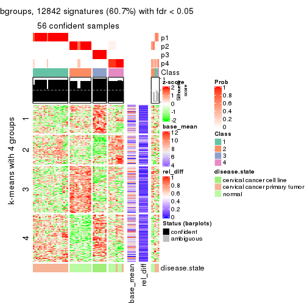</p>

</div>
<div id='tab-SD-mclust-get-signatures-4'>
<pre><code class="r">get_signatures(res, k = 5)
</code></pre>

<p></p>

</div>
<div id='tab-SD-mclust-get-signatures-5'>
<pre><code class="r">get_signatures(res, k = 6)
</code></pre>

<p></p>

</div>
</div>


Signature heatmaps where rows are not scaled:


<script>
$( function() {
	$( '#tabs-SD-mclust-get-signatures-no-scale' ).tabs();
} );
</script>
<div id='tabs-SD-mclust-get-signatures-no-scale'>
<ul>
<li><a href='#tab-SD-mclust-get-signatures-no-scale-1'>k = 2</a></li>
<li><a href='#tab-SD-mclust-get-signatures-no-scale-2'>k = 3</a></li>
<li><a href='#tab-SD-mclust-get-signatures-no-scale-3'>k = 4</a></li>
<li><a href='#tab-SD-mclust-get-signatures-no-scale-4'>k = 5</a></li>
<li><a href='#tab-SD-mclust-get-signatures-no-scale-5'>k = 6</a></li>
</ul>
<div id='tab-SD-mclust-get-signatures-no-scale-1'>
<pre><code class="r">get_signatures(res, k = 2, scale_rows = FALSE)
</code></pre>

<p></p>

</div>
<div id='tab-SD-mclust-get-signatures-no-scale-2'>
<pre><code class="r">get_signatures(res, k = 3, scale_rows = FALSE)
</code></pre>

<p></p>

</div>
<div id='tab-SD-mclust-get-signatures-no-scale-3'>
<pre><code class="r">get_signatures(res, k = 4, scale_rows = FALSE)
</code></pre>

<p></p>

</div>
<div id='tab-SD-mclust-get-signatures-no-scale-4'>
<pre><code class="r">get_signatures(res, k = 5, scale_rows = FALSE)
</code></pre>

<p></p>

</div>
<div id='tab-SD-mclust-get-signatures-no-scale-5'>
<pre><code class="r">get_signatures(res, k = 6, scale_rows = FALSE)
</code></pre>

<p></p>

</div>
</div>


Compare the overlap of signatures from different k:

```r
compare_signatures(res)
```


`get_signature()` returns a data frame invisibly. TO get the list of signatures, the function
call should be assigned to a variable explicitly. In following code, if `plot` argument is set
to `FALSE`, no heatmap is plotted while only the differential analysis is performed.

```r
# code only for demonstration
tb = get_signature(res, k = ..., plot = FALSE)
```

An example of the output of `tb` is:

```
#>   which_row         fdr    mean_1    mean_2 scaled_mean_1 scaled_mean_2 km
#> 1        38 0.042760348  8.373488  9.131774    -0.5533452     0.5164555  1
#> 2        40 0.018707592  7.106213  8.469186    -0.6173731     0.5762149  1
#> 3        55 0.019134737 10.221463 11.207825    -0.6159697     0.5749050  1
#> 4        59 0.006059896  5.921854  7.869574    -0.6899429     0.6439467  1
#> 5        60 0.018055526  8.928898 10.211722    -0.6204761     0.5791110  1
#> 6        98 0.009384629 15.714769 14.887706     0.6635654    -0.6193277  2
...
```

The columns in `tb` are:

1. `which_row`: row indices corresponding to the input matrix.
2. `fdr`: FDR for the differential test. 
3. `mean_x`: The mean value in group x.
4. `scaled_mean_x`: The mean value in group x after rows are scaled.
5. `km`: Row groups if k-means clustering is applied to rows.


UMAP plot which shows how samples are separated.


<script>
$( function() {
	$( '#tabs-SD-mclust-dimension-reduction' ).tabs();
} );
</script>
<div id='tabs-SD-mclust-dimension-reduction'>
<ul>
<li><a href='#tab-SD-mclust-dimension-reduction-1'>k = 2</a></li>
<li><a href='#tab-SD-mclust-dimension-reduction-2'>k = 3</a></li>
<li><a href='#tab-SD-mclust-dimension-reduction-3'>k = 4</a></li>
<li><a href='#tab-SD-mclust-dimension-reduction-4'>k = 5</a></li>
<li><a href='#tab-SD-mclust-dimension-reduction-5'>k = 6</a></li>
</ul>
<div id='tab-SD-mclust-dimension-reduction-1'>
<pre><code class="r">dimension_reduction(res, k = 2, method = &quot;UMAP&quot;)
</code></pre>

<p></p>

</div>
<div id='tab-SD-mclust-dimension-reduction-2'>
<pre><code class="r">dimension_reduction(res, k = 3, method = &quot;UMAP&quot;)
</code></pre>

<p></p>

</div>
<div id='tab-SD-mclust-dimension-reduction-3'>
<pre><code class="r">dimension_reduction(res, k = 4, method = &quot;UMAP&quot;)
</code></pre>

<p></p>

</div>
<div id='tab-SD-mclust-dimension-reduction-4'>
<pre><code class="r">dimension_reduction(res, k = 5, method = &quot;UMAP&quot;)
</code></pre>

<p></p>

</div>
<div id='tab-SD-mclust-dimension-reduction-5'>
<pre><code class="r">dimension_reduction(res, k = 6, method = &quot;UMAP&quot;)
</code></pre>

<p></p>

</div>
</div>


Following heatmap shows how subgroups are split when increasing `k`:

```r
collect_classes(res)
```


Test correlation between subgroups and known annotations. If the known
annotation is numeric, one-way ANOVA test is applied, and if the known
annotation is discrete, chi-squared contingency table test is applied.

```r
test_to_known_factors(res)
```

```
#>            n disease.state(p) k
#> SD:mclust 51         8.42e-12 2
#> SD:mclust 60         2.13e-19 3
#> SD:mclust 56         3.11e-20 4
#> SD:mclust 53         2.63e-19 5
#> SD:mclust 60         7.11e-20 6
```


If matrix rows can be associated to genes, consider to use `GO_Enrichment(res,
...)` to perform function enrichment for the signature genes.


 

---------------------------------------------------


### SD:NMF*


The object with results only for a single top-value method and a single partition method 
can be extracted as:

```r
res = res_list["SD", "NMF"]
# you can also extract it by
# res = res_list["SD:NMF"]
```

A summary of `res` and all the functions that can be applied to it:

```r
res
```

```
#> A 'ConsensusPartition' object with k = 2, 3, 4, 5, 6.
#>   On a matrix with 21168 rows and 61 columns.
#>   Top rows (1000, 2000, 3000, 4000, 5000) are extracted by 'SD' method.
#>   Subgroups are detected by 'NMF' method.
#>   Performed in total 1250 partitions by row resampling.
#>   Best k for subgroups seems to be 4.
#> 
#> Following methods can be applied to this 'ConsensusPartition' object:
#>  [1] "cola_report"             "collect_classes"         "collect_plots"          
#>  [4] "collect_stats"           "colnames"                "compare_signatures"     
#>  [7] "consensus_heatmap"       "dimension_reduction"     "functional_enrichment"  
#> [10] "get_anno_col"            "get_anno"                "get_classes"            
#> [13] "get_consensus"           "get_matrix"              "get_membership"         
#> [16] "get_param"               "get_signatures"          "get_stats"              
#> [19] "is_best_k"               "is_stable_k"             "membership_heatmap"     
#> [22] "ncol"                    "nrow"                    "plot_ecdf"              
#> [25] "rownames"                "select_partition_number" "show"                   
#> [28] "suggest_best_k"          "test_to_known_factors"
```

`collect_plots()` function collects all the plots made from `res` for all `k` (number of partitions)
into one single page to provide an easy and fast comparison between different `k`.

```r
collect_plots(res)
```


The plots are:

- The first row: a plot of the ECDF (Empirical cumulative distribution
  function) curves of the consensus matrix for each `k` and the heatmap of
  predicted classes for each `k`.
- The second row: heatmaps of the consensus matrix for each `k`.
- The third row: heatmaps of the membership matrix for each `k`.
- The fouth row: heatmaps of the signatures for each `k`.

All the plots in panels can be made by individual functions and they are
plotted later in this section.

`select_partition_number()` produces several plots showing different
statistics for choosing "optimized" `k`. There are following statistics:

- ECDF curves of the consensus matrix for each `k`;
- 1-PAC. [The PAC
  score](https://en.wikipedia.org/wiki/Consensus_clustering#Over-interpretation_potential_of_consensus_clustering)
  measures the proportion of the ambiguous subgrouping.
- Mean silhouette score.
- Concordance. The mean probability of fiting the consensus class ids in all
  partitions.
- Area increased. Denote $A_k$ as the area under the ECDF curve for current
  `k`, the area increased is defined as $A_k - A_{k-1}$.
- Rand index. The percent of pairs of samples that are both in a same cluster
  or both are not in a same cluster in the partition of k and k-1.
- Jaccard index. The ratio of pairs of samples are both in a same cluster in
  the partition of k and k-1 and the pairs of samples are both in a same
  cluster in the partition k or k-1.

The detailed explanations of these statistics can be found in [the cola
vignette](http://bioconductor.org/packages/devel/bioc/vignettes/cola/inst/doc/cola.html#toc_13).

Generally speaking, lower PAC score, higher mean silhouette score or higher
concordance corresponds to better partition. Rand index and Jaccard index
measure how similar the current partition is compared to partition with `k-1`.
If they are too similar, we won't accept `k` is better than `k-1`.

```r
select_partition_number(res)
```


The numeric values for all these statistics can be obtained by `get_stats()`.

```r
get_stats(res)
```

```
#>   k 1-PAC mean_silhouette concordance area_increased  Rand Jaccard
#> 2 2 0.806           0.892       0.956         0.4996 0.498   0.498
#> 3 3 0.845           0.874       0.947         0.3189 0.697   0.466
#> 4 4 0.912           0.885       0.954         0.0900 0.816   0.543
#> 5 5 0.727           0.706       0.850         0.0625 0.979   0.929
#> 6 6 0.748           0.634       0.784         0.0481 0.951   0.830
```

`suggest_best_k()` suggests the best $k$ based on these statistics. The rules are as follows:

- All $k$ with Jaccard index larger than 0.95 are removed because the increase of
  the partition number does not provides enough extra information. If all $k$ are removed,
  the best $k$ is assigned by `NA`.
- For $k$ with 1-PAC larger than 0.9, the maximal $k$ is taken as the "best k". Other $k$ is called "optional k".
- If it does not fit the second rule. The $k$ with the highest vote of highest
  1-PAC, mean silhouette and concordance is taken as the "best k".

```r
suggest_best_k(res)
```

```
#> [1] 4
```


Following shows the table of the partitions (You need to click the **show/hide
code output** link to see it). The membership matrix (columns with name `p*`)
is inferred by
[`clue::cl_consensus()`](https://www.rdocumentation.org/link/cl_consensus?package=clue)
function with the `SE` method. Basically the value in the membership matrix
represents the probability to belong to a certain group. The finall class
label for an item is determined with the group with highest probability it
belongs to.

In `get_classes()` function, the entropy is calculated from the membership
matrix and the silhouette score is calculated from the consensus matrix.


<script>
$( function() {
	$( '#tabs-SD-NMF-get-classes' ).tabs();
} );
</script>
<div id='tabs-SD-NMF-get-classes'>
<ul>
<li><a href='#tab-SD-NMF-get-classes-1'>k = 2</a></li>
<li><a href='#tab-SD-NMF-get-classes-2'>k = 3</a></li>
<li><a href='#tab-SD-NMF-get-classes-3'>k = 4</a></li>
<li><a href='#tab-SD-NMF-get-classes-4'>k = 5</a></li>
<li><a href='#tab-SD-NMF-get-classes-5'>k = 6</a></li>
</ul>

<div id='tab-SD-NMF-get-classes-1'>
<p><a id='tab-SD-NMF-get-classes-1-a' style='color:#0366d6' href='#'>show/hide code output</a></p>
<pre><code class="r">cbind(get_classes(res, k = 2), get_membership(res, k = 2))
</code></pre>

<pre><code>#&gt;           class entropy silhouette    p1    p2
#&gt; GSM246087     1  0.0000    0.94094 1.000 0.000
#&gt; GSM246088     1  0.0000    0.94094 1.000 0.000
#&gt; GSM246089     1  0.0000    0.94094 1.000 0.000
#&gt; GSM246090     1  0.0000    0.94094 1.000 0.000
#&gt; GSM246119     1  0.0000    0.94094 1.000 0.000
#&gt; GSM246120     1  0.0000    0.94094 1.000 0.000
#&gt; GSM246121     1  0.0000    0.94094 1.000 0.000
#&gt; GSM246122     1  0.0000    0.94094 1.000 0.000
#&gt; GSM246123     1  0.0000    0.94094 1.000 0.000
#&gt; GSM246422     2  0.0376    0.96136 0.004 0.996
#&gt; GSM246423     2  0.3274    0.91007 0.060 0.940
#&gt; GSM246484     2  0.0000    0.96448 0.000 1.000
#&gt; GSM246485     2  0.0000    0.96448 0.000 1.000
#&gt; GSM246486     2  0.0000    0.96448 0.000 1.000
#&gt; GSM246487     2  0.0000    0.96448 0.000 1.000
#&gt; GSM246488     2  0.0000    0.96448 0.000 1.000
#&gt; GSM246489     2  0.0000    0.96448 0.000 1.000
#&gt; GSM246490     2  0.0000    0.96448 0.000 1.000
#&gt; GSM246491     2  0.0000    0.96448 0.000 1.000
#&gt; GSM247162     2  0.0000    0.96448 0.000 1.000
#&gt; GSM247163     2  0.0000    0.96448 0.000 1.000
#&gt; GSM247164     2  0.0000    0.96448 0.000 1.000
#&gt; GSM247165     2  0.0000    0.96448 0.000 1.000
#&gt; GSM247166     2  0.0000    0.96448 0.000 1.000
#&gt; GSM247168     2  0.0000    0.96448 0.000 1.000
#&gt; GSM247169     2  0.0000    0.96448 0.000 1.000
#&gt; GSM247171     2  0.0000    0.96448 0.000 1.000
#&gt; GSM247173     2  0.0000    0.96448 0.000 1.000
#&gt; GSM247174     2  0.0000    0.96448 0.000 1.000
#&gt; GSM247175     2  0.0000    0.96448 0.000 1.000
#&gt; GSM247188     2  0.0000    0.96448 0.000 1.000
#&gt; GSM247189     2  0.0000    0.96448 0.000 1.000
#&gt; GSM247190     2  0.0000    0.96448 0.000 1.000
#&gt; GSM247650     1  0.0000    0.94094 1.000 0.000
#&gt; GSM247651     2  0.9977    0.00698 0.472 0.528
#&gt; GSM247652     1  0.0000    0.94094 1.000 0.000
#&gt; GSM247653     1  0.0000    0.94094 1.000 0.000
#&gt; GSM247654     1  0.0000    0.94094 1.000 0.000
#&gt; GSM247655     1  0.6247    0.81369 0.844 0.156
#&gt; GSM247656     1  0.0000    0.94094 1.000 0.000
#&gt; GSM247657     1  0.0000    0.94094 1.000 0.000
#&gt; GSM247658     1  0.0938    0.93484 0.988 0.012
#&gt; GSM247659     1  0.0000    0.94094 1.000 0.000
#&gt; GSM247660     1  0.9996    0.09283 0.512 0.488
#&gt; GSM247661     1  0.0000    0.94094 1.000 0.000
#&gt; GSM247662     1  0.0000    0.94094 1.000 0.000
#&gt; GSM247663     1  0.0000    0.94094 1.000 0.000
#&gt; GSM247856     1  0.0000    0.94094 1.000 0.000
#&gt; GSM247857     1  0.0000    0.94094 1.000 0.000
#&gt; GSM247859     1  0.9815    0.31846 0.580 0.420
#&gt; GSM247860     1  0.0376    0.93899 0.996 0.004
#&gt; GSM247862     1  0.4562    0.87289 0.904 0.096
#&gt; GSM247864     1  0.2043    0.92239 0.968 0.032
#&gt; GSM247865     2  0.5946    0.81328 0.144 0.856
#&gt; GSM247866     1  0.8713    0.61221 0.708 0.292
#&gt; GSM247876     1  0.0000    0.94094 1.000 0.000
#&gt; GSM247877     1  0.2603    0.91423 0.956 0.044
#&gt; GSM247878     1  0.6343    0.80915 0.840 0.160
#&gt; GSM247879     1  0.0000    0.94094 1.000 0.000
#&gt; GSM247881     1  0.5946    0.82686 0.856 0.144
#&gt; GSM247883     2  0.6247    0.79680 0.156 0.844
</code></pre>

<script>
$('#tab-SD-NMF-get-classes-1-a').parent().next().next().hide();
$('#tab-SD-NMF-get-classes-1-a').click(function(){
  $('#tab-SD-NMF-get-classes-1-a').parent().next().next().toggle();
  return(false);
});
</script>
</div>

<div id='tab-SD-NMF-get-classes-2'>
<p><a id='tab-SD-NMF-get-classes-2-a' style='color:#0366d6' href='#'>show/hide code output</a></p>
<pre><code class="r">cbind(get_classes(res, k = 3), get_membership(res, k = 3))
</code></pre>

<pre><code>#&gt;           class entropy silhouette    p1    p2    p3
#&gt; GSM246087     3  0.0000      0.906 0.000 0.000 1.000
#&gt; GSM246088     3  0.0000      0.906 0.000 0.000 1.000
#&gt; GSM246089     3  0.0000      0.906 0.000 0.000 1.000
#&gt; GSM246090     3  0.0000      0.906 0.000 0.000 1.000
#&gt; GSM246119     3  0.0000      0.906 0.000 0.000 1.000
#&gt; GSM246120     3  0.0000      0.906 0.000 0.000 1.000
#&gt; GSM246121     3  0.0000      0.906 0.000 0.000 1.000
#&gt; GSM246122     3  0.0000      0.906 0.000 0.000 1.000
#&gt; GSM246123     3  0.0000      0.906 0.000 0.000 1.000
#&gt; GSM246422     1  0.0000      0.948 1.000 0.000 0.000
#&gt; GSM246423     1  0.0000      0.948 1.000 0.000 0.000
#&gt; GSM246484     1  0.0000      0.948 1.000 0.000 0.000
#&gt; GSM246485     2  0.2448      0.889 0.076 0.924 0.000
#&gt; GSM246486     2  0.5678      0.569 0.316 0.684 0.000
#&gt; GSM246487     1  0.1031      0.926 0.976 0.024 0.000
#&gt; GSM246488     2  0.6095      0.410 0.392 0.608 0.000
#&gt; GSM246489     2  0.0000      0.951 0.000 1.000 0.000
#&gt; GSM246490     2  0.0000      0.951 0.000 1.000 0.000
#&gt; GSM246491     2  0.0000      0.951 0.000 1.000 0.000
#&gt; GSM247162     2  0.0000      0.951 0.000 1.000 0.000
#&gt; GSM247163     2  0.0000      0.951 0.000 1.000 0.000
#&gt; GSM247164     2  0.0000      0.951 0.000 1.000 0.000
#&gt; GSM247165     2  0.0000      0.951 0.000 1.000 0.000
#&gt; GSM247166     2  0.0000      0.951 0.000 1.000 0.000
#&gt; GSM247168     2  0.0000      0.951 0.000 1.000 0.000
#&gt; GSM247169     2  0.0000      0.951 0.000 1.000 0.000
#&gt; GSM247171     2  0.0000      0.951 0.000 1.000 0.000
#&gt; GSM247173     2  0.0000      0.951 0.000 1.000 0.000
#&gt; GSM247174     2  0.0000      0.951 0.000 1.000 0.000
#&gt; GSM247175     2  0.0000      0.951 0.000 1.000 0.000
#&gt; GSM247188     2  0.0000      0.951 0.000 1.000 0.000
#&gt; GSM247189     2  0.1643      0.916 0.044 0.956 0.000
#&gt; GSM247190     2  0.0000      0.951 0.000 1.000 0.000
#&gt; GSM247650     1  0.5216      0.629 0.740 0.000 0.260
#&gt; GSM247651     1  0.0000      0.948 1.000 0.000 0.000
#&gt; GSM247652     1  0.2448      0.884 0.924 0.000 0.076
#&gt; GSM247653     3  0.6274      0.201 0.456 0.000 0.544
#&gt; GSM247654     1  0.6079      0.310 0.612 0.000 0.388
#&gt; GSM247655     1  0.0000      0.948 1.000 0.000 0.000
#&gt; GSM247656     3  0.2959      0.848 0.100 0.000 0.900
#&gt; GSM247657     3  0.5138      0.681 0.252 0.000 0.748
#&gt; GSM247658     1  0.0000      0.948 1.000 0.000 0.000
#&gt; GSM247659     3  0.0000      0.906 0.000 0.000 1.000
#&gt; GSM247660     1  0.0000      0.948 1.000 0.000 0.000
#&gt; GSM247661     3  0.3752      0.810 0.144 0.000 0.856
#&gt; GSM247662     3  0.1411      0.890 0.036 0.000 0.964
#&gt; GSM247663     1  0.2066      0.900 0.940 0.000 0.060
#&gt; GSM247856     1  0.5178      0.634 0.744 0.000 0.256
#&gt; GSM247857     3  0.5650      0.575 0.312 0.000 0.688
#&gt; GSM247859     1  0.0000      0.948 1.000 0.000 0.000
#&gt; GSM247860     1  0.0000      0.948 1.000 0.000 0.000
#&gt; GSM247862     1  0.0000      0.948 1.000 0.000 0.000
#&gt; GSM247864     1  0.0000      0.948 1.000 0.000 0.000
#&gt; GSM247865     1  0.0000      0.948 1.000 0.000 0.000
#&gt; GSM247866     1  0.0000      0.948 1.000 0.000 0.000
#&gt; GSM247876     1  0.0000      0.948 1.000 0.000 0.000
#&gt; GSM247877     1  0.0000      0.948 1.000 0.000 0.000
#&gt; GSM247878     1  0.0000      0.948 1.000 0.000 0.000
#&gt; GSM247879     1  0.0892      0.934 0.980 0.000 0.020
#&gt; GSM247881     1  0.0000      0.948 1.000 0.000 0.000
#&gt; GSM247883     1  0.0000      0.948 1.000 0.000 0.000
</code></pre>

<script>
$('#tab-SD-NMF-get-classes-2-a').parent().next().next().hide();
$('#tab-SD-NMF-get-classes-2-a').click(function(){
  $('#tab-SD-NMF-get-classes-2-a').parent().next().next().toggle();
  return(false);
});
</script>
</div>

<div id='tab-SD-NMF-get-classes-3'>
<p><a id='tab-SD-NMF-get-classes-3-a' style='color:#0366d6' href='#'>show/hide code output</a></p>
<pre><code class="r">cbind(get_classes(res, k = 4), get_membership(res, k = 4))
</code></pre>

<pre><code>#&gt;           class entropy silhouette    p1    p2    p3    p4
#&gt; GSM246087     3  0.0000     0.9618 0.000 0.000 1.000 0.000
#&gt; GSM246088     3  0.0000     0.9618 0.000 0.000 1.000 0.000
#&gt; GSM246089     3  0.0000     0.9618 0.000 0.000 1.000 0.000
#&gt; GSM246090     3  0.0000     0.9618 0.000 0.000 1.000 0.000
#&gt; GSM246119     3  0.0000     0.9618 0.000 0.000 1.000 0.000
#&gt; GSM246120     3  0.0000     0.9618 0.000 0.000 1.000 0.000
#&gt; GSM246121     3  0.0000     0.9618 0.000 0.000 1.000 0.000
#&gt; GSM246122     3  0.0000     0.9618 0.000 0.000 1.000 0.000
#&gt; GSM246123     3  0.0000     0.9618 0.000 0.000 1.000 0.000
#&gt; GSM246422     4  0.0000     0.8757 0.000 0.000 0.000 1.000
#&gt; GSM246423     4  0.0000     0.8757 0.000 0.000 0.000 1.000
#&gt; GSM246484     4  0.0000     0.8757 0.000 0.000 0.000 1.000
#&gt; GSM246485     2  0.0188     0.9695 0.000 0.996 0.000 0.004
#&gt; GSM246486     2  0.4817     0.2418 0.000 0.612 0.000 0.388
#&gt; GSM246487     1  0.7660    -0.0421 0.428 0.216 0.000 0.356
#&gt; GSM246488     4  0.3688     0.7018 0.000 0.208 0.000 0.792
#&gt; GSM246489     2  0.0000     0.9735 0.000 1.000 0.000 0.000
#&gt; GSM246490     2  0.0000     0.9735 0.000 1.000 0.000 0.000
#&gt; GSM246491     2  0.0000     0.9735 0.000 1.000 0.000 0.000
#&gt; GSM247162     2  0.0000     0.9735 0.000 1.000 0.000 0.000
#&gt; GSM247163     2  0.0000     0.9735 0.000 1.000 0.000 0.000
#&gt; GSM247164     2  0.0000     0.9735 0.000 1.000 0.000 0.000
#&gt; GSM247165     2  0.0000     0.9735 0.000 1.000 0.000 0.000
#&gt; GSM247166     2  0.0000     0.9735 0.000 1.000 0.000 0.000
#&gt; GSM247168     2  0.0000     0.9735 0.000 1.000 0.000 0.000
#&gt; GSM247169     2  0.0000     0.9735 0.000 1.000 0.000 0.000
#&gt; GSM247171     2  0.0000     0.9735 0.000 1.000 0.000 0.000
#&gt; GSM247173     2  0.0000     0.9735 0.000 1.000 0.000 0.000
#&gt; GSM247174     2  0.0000     0.9735 0.000 1.000 0.000 0.000
#&gt; GSM247175     2  0.0000     0.9735 0.000 1.000 0.000 0.000
#&gt; GSM247188     2  0.0000     0.9735 0.000 1.000 0.000 0.000
#&gt; GSM247189     4  0.4999     0.0504 0.000 0.492 0.000 0.508
#&gt; GSM247190     2  0.0000     0.9735 0.000 1.000 0.000 0.000
#&gt; GSM247650     1  0.0804     0.9365 0.980 0.000 0.008 0.012
#&gt; GSM247651     1  0.3726     0.7609 0.788 0.000 0.000 0.212
#&gt; GSM247652     1  0.0000     0.9410 1.000 0.000 0.000 0.000
#&gt; GSM247653     1  0.0000     0.9410 1.000 0.000 0.000 0.000
#&gt; GSM247654     1  0.0000     0.9410 1.000 0.000 0.000 0.000
#&gt; GSM247655     1  0.0336     0.9395 0.992 0.000 0.000 0.008
#&gt; GSM247656     1  0.1557     0.9041 0.944 0.000 0.056 0.000
#&gt; GSM247657     1  0.0000     0.9410 1.000 0.000 0.000 0.000
#&gt; GSM247658     1  0.0000     0.9410 1.000 0.000 0.000 0.000
#&gt; GSM247659     3  0.4040     0.6309 0.248 0.000 0.752 0.000
#&gt; GSM247660     1  0.1940     0.9010 0.924 0.000 0.000 0.076
#&gt; GSM247661     1  0.0000     0.9410 1.000 0.000 0.000 0.000
#&gt; GSM247662     1  0.2921     0.8157 0.860 0.000 0.140 0.000
#&gt; GSM247663     1  0.1557     0.9152 0.944 0.000 0.000 0.056
#&gt; GSM247856     1  0.0000     0.9410 1.000 0.000 0.000 0.000
#&gt; GSM247857     1  0.0000     0.9410 1.000 0.000 0.000 0.000
#&gt; GSM247859     1  0.0188     0.9404 0.996 0.000 0.000 0.004
#&gt; GSM247860     1  0.0000     0.9410 1.000 0.000 0.000 0.000
#&gt; GSM247862     1  0.0000     0.9410 1.000 0.000 0.000 0.000
#&gt; GSM247864     1  0.1022     0.9299 0.968 0.000 0.000 0.032
#&gt; GSM247865     1  0.1022     0.9300 0.968 0.000 0.000 0.032
#&gt; GSM247866     1  0.0336     0.9395 0.992 0.000 0.000 0.008
#&gt; GSM247876     1  0.3801     0.7493 0.780 0.000 0.000 0.220
#&gt; GSM247877     4  0.0000     0.8757 0.000 0.000 0.000 1.000
#&gt; GSM247878     4  0.0000     0.8757 0.000 0.000 0.000 1.000
#&gt; GSM247879     4  0.0000     0.8757 0.000 0.000 0.000 1.000
#&gt; GSM247881     1  0.0000     0.9410 1.000 0.000 0.000 0.000
#&gt; GSM247883     1  0.0188     0.9404 0.996 0.000 0.000 0.004
</code></pre>

<script>
$('#tab-SD-NMF-get-classes-3-a').parent().next().next().hide();
$('#tab-SD-NMF-get-classes-3-a').click(function(){
  $('#tab-SD-NMF-get-classes-3-a').parent().next().next().toggle();
  return(false);
});
</script>
</div>

<div id='tab-SD-NMF-get-classes-4'>
<p><a id='tab-SD-NMF-get-classes-4-a' style='color:#0366d6' href='#'>show/hide code output</a></p>
<pre><code class="r">cbind(get_classes(res, k = 5), get_membership(res, k = 5))
</code></pre>

<pre><code>#&gt;           class entropy silhouette    p1    p2    p3    p4    p5
#&gt; GSM246087     3  0.0703     0.8530 0.000 0.000 0.976 0.000 0.024
#&gt; GSM246088     3  0.0290     0.8586 0.000 0.000 0.992 0.000 0.008
#&gt; GSM246089     3  0.3752     0.6278 0.000 0.000 0.708 0.000 0.292
#&gt; GSM246090     3  0.0000     0.8601 0.000 0.000 1.000 0.000 0.000
#&gt; GSM246119     3  0.1608     0.8600 0.000 0.000 0.928 0.000 0.072
#&gt; GSM246120     3  0.1608     0.8600 0.000 0.000 0.928 0.000 0.072
#&gt; GSM246121     3  0.1792     0.8558 0.000 0.000 0.916 0.000 0.084
#&gt; GSM246122     3  0.0794     0.8508 0.000 0.000 0.972 0.000 0.028
#&gt; GSM246123     3  0.1732     0.8573 0.000 0.000 0.920 0.000 0.080
#&gt; GSM246422     4  0.0000     0.5499 0.000 0.000 0.000 1.000 0.000
#&gt; GSM246423     4  0.0290     0.5488 0.000 0.000 0.000 0.992 0.008
#&gt; GSM246484     4  0.0404     0.5456 0.000 0.000 0.000 0.988 0.012
#&gt; GSM246485     2  0.4690     0.6641 0.004 0.748 0.000 0.140 0.108
#&gt; GSM246486     2  0.5103     0.0195 0.004 0.524 0.000 0.444 0.028
#&gt; GSM246487     4  0.7224     0.1701 0.216 0.212 0.000 0.516 0.056
#&gt; GSM246488     4  0.3327     0.4758 0.000 0.144 0.000 0.828 0.028
#&gt; GSM246489     2  0.0162     0.9477 0.000 0.996 0.000 0.000 0.004
#&gt; GSM246490     2  0.0000     0.9481 0.000 1.000 0.000 0.000 0.000
#&gt; GSM246491     2  0.0162     0.9477 0.000 0.996 0.000 0.000 0.004
#&gt; GSM247162     2  0.0162     0.9476 0.000 0.996 0.000 0.000 0.004
#&gt; GSM247163     2  0.0290     0.9462 0.000 0.992 0.000 0.000 0.008
#&gt; GSM247164     2  0.0324     0.9462 0.000 0.992 0.000 0.004 0.004
#&gt; GSM247165     2  0.0693     0.9381 0.000 0.980 0.000 0.008 0.012
#&gt; GSM247166     2  0.0162     0.9481 0.000 0.996 0.000 0.000 0.004
#&gt; GSM247168     2  0.0162     0.9481 0.000 0.996 0.000 0.000 0.004
#&gt; GSM247169     2  0.0162     0.9481 0.000 0.996 0.000 0.000 0.004
#&gt; GSM247171     2  0.0162     0.9476 0.000 0.996 0.000 0.000 0.004
#&gt; GSM247173     2  0.0162     0.9481 0.000 0.996 0.000 0.000 0.004
#&gt; GSM247174     2  0.0162     0.9481 0.000 0.996 0.000 0.000 0.004
#&gt; GSM247175     2  0.0000     0.9481 0.000 1.000 0.000 0.000 0.000
#&gt; GSM247188     2  0.0290     0.9459 0.000 0.992 0.000 0.000 0.008
#&gt; GSM247189     4  0.5591     0.1272 0.000 0.432 0.000 0.496 0.072
#&gt; GSM247190     2  0.0162     0.9476 0.000 0.996 0.000 0.000 0.004
#&gt; GSM247650     1  0.3337     0.7898 0.856 0.000 0.064 0.008 0.072
#&gt; GSM247651     1  0.4777     0.5696 0.664 0.000 0.000 0.292 0.044
#&gt; GSM247652     1  0.2127     0.7900 0.892 0.000 0.000 0.000 0.108
#&gt; GSM247653     1  0.2377     0.7846 0.872 0.000 0.000 0.000 0.128
#&gt; GSM247654     1  0.2020     0.8040 0.900 0.000 0.000 0.000 0.100
#&gt; GSM247655     1  0.0912     0.8022 0.972 0.000 0.000 0.016 0.012
#&gt; GSM247656     1  0.5974     0.4401 0.564 0.000 0.292 0.000 0.144
#&gt; GSM247657     1  0.2280     0.7845 0.880 0.000 0.000 0.000 0.120
#&gt; GSM247658     1  0.2020     0.7907 0.900 0.000 0.000 0.000 0.100
#&gt; GSM247659     3  0.6203     0.2633 0.188 0.000 0.544 0.000 0.268
#&gt; GSM247660     1  0.3309     0.7583 0.836 0.000 0.000 0.128 0.036
#&gt; GSM247661     1  0.2690     0.7732 0.844 0.000 0.000 0.000 0.156
#&gt; GSM247662     1  0.6761     0.0637 0.380 0.000 0.352 0.000 0.268
#&gt; GSM247663     1  0.3399     0.7701 0.812 0.000 0.004 0.012 0.172
#&gt; GSM247856     1  0.3336     0.7821 0.832 0.000 0.008 0.016 0.144
#&gt; GSM247857     1  0.4481     0.6786 0.720 0.000 0.048 0.000 0.232
#&gt; GSM247859     1  0.3764     0.7751 0.800 0.000 0.000 0.044 0.156
#&gt; GSM247860     1  0.2516     0.7679 0.860 0.000 0.000 0.000 0.140
#&gt; GSM247862     1  0.2074     0.7885 0.896 0.000 0.000 0.000 0.104
#&gt; GSM247864     1  0.3535     0.7727 0.832 0.000 0.000 0.088 0.080
#&gt; GSM247865     1  0.5399     0.6430 0.664 0.000 0.000 0.188 0.148
#&gt; GSM247866     1  0.2813     0.7402 0.832 0.000 0.000 0.000 0.168
#&gt; GSM247876     1  0.5696     0.3309 0.560 0.000 0.000 0.096 0.344
#&gt; GSM247877     4  0.4313    -0.1482 0.008 0.000 0.000 0.636 0.356
#&gt; GSM247878     4  0.2304     0.4567 0.008 0.000 0.000 0.892 0.100
#&gt; GSM247879     5  0.5789     0.0000 0.076 0.000 0.024 0.272 0.628
#&gt; GSM247881     1  0.0703     0.8017 0.976 0.000 0.000 0.000 0.024
#&gt; GSM247883     1  0.2976     0.7844 0.852 0.004 0.000 0.012 0.132
</code></pre>

<script>
$('#tab-SD-NMF-get-classes-4-a').parent().next().next().hide();
$('#tab-SD-NMF-get-classes-4-a').click(function(){
  $('#tab-SD-NMF-get-classes-4-a').parent().next().next().toggle();
  return(false);
});
</script>
</div>

<div id='tab-SD-NMF-get-classes-5'>
<p><a id='tab-SD-NMF-get-classes-5-a' style='color:#0366d6' href='#'>show/hide code output</a></p>
<pre><code class="r">cbind(get_classes(res, k = 6), get_membership(res, k = 6))
</code></pre>

<pre><code>#&gt;           class entropy silhouette    p1    p2    p3    p4    p5 p6
#&gt; GSM246087     3  0.1152    0.75261 0.000 0.000 0.952 0.000 0.004 NA
#&gt; GSM246088     3  0.0692    0.75908 0.000 0.000 0.976 0.000 0.004 NA
#&gt; GSM246089     3  0.5928    0.36126 0.000 0.000 0.464 0.000 0.268 NA
#&gt; GSM246090     3  0.0146    0.76260 0.000 0.000 0.996 0.000 0.004 NA
#&gt; GSM246119     3  0.3103    0.74981 0.000 0.000 0.836 0.000 0.100 NA
#&gt; GSM246120     3  0.2897    0.75461 0.000 0.000 0.852 0.000 0.088 NA
#&gt; GSM246121     3  0.3321    0.74232 0.000 0.000 0.820 0.000 0.100 NA
#&gt; GSM246122     3  0.1349    0.75005 0.000 0.000 0.940 0.000 0.004 NA
#&gt; GSM246123     3  0.2923    0.75532 0.000 0.000 0.848 0.000 0.100 NA
#&gt; GSM246422     4  0.0000    0.63300 0.000 0.000 0.000 1.000 0.000 NA
#&gt; GSM246423     4  0.0000    0.63300 0.000 0.000 0.000 1.000 0.000 NA
#&gt; GSM246484     4  0.0146    0.63135 0.000 0.000 0.000 0.996 0.004 NA
#&gt; GSM246485     2  0.6949   -0.27737 0.016 0.372 0.000 0.340 0.028 NA
#&gt; GSM246486     4  0.4370    0.39899 0.000 0.356 0.000 0.616 0.008 NA
#&gt; GSM246487     4  0.6136    0.34317 0.236 0.184 0.000 0.552 0.012 NA
#&gt; GSM246488     4  0.1411    0.63340 0.000 0.060 0.000 0.936 0.004 NA
#&gt; GSM246489     2  0.0603    0.93482 0.000 0.980 0.000 0.000 0.004 NA
#&gt; GSM246490     2  0.0458    0.93473 0.000 0.984 0.000 0.000 0.000 NA
#&gt; GSM246491     2  0.0363    0.93604 0.000 0.988 0.000 0.000 0.000 NA
#&gt; GSM247162     2  0.0000    0.93600 0.000 1.000 0.000 0.000 0.000 NA
#&gt; GSM247163     2  0.0520    0.93306 0.000 0.984 0.000 0.000 0.008 NA
#&gt; GSM247164     2  0.0000    0.93600 0.000 1.000 0.000 0.000 0.000 NA
#&gt; GSM247165     2  0.0976    0.92915 0.000 0.968 0.000 0.008 0.008 NA
#&gt; GSM247166     2  0.1802    0.90141 0.000 0.916 0.000 0.000 0.012 NA
#&gt; GSM247168     2  0.1745    0.90275 0.000 0.920 0.000 0.000 0.012 NA
#&gt; GSM247169     2  0.1802    0.90034 0.000 0.916 0.000 0.000 0.012 NA
#&gt; GSM247171     2  0.0405    0.93383 0.000 0.988 0.000 0.000 0.004 NA
#&gt; GSM247173     2  0.0260    0.93642 0.000 0.992 0.000 0.000 0.000 NA
#&gt; GSM247174     2  0.0790    0.93000 0.000 0.968 0.000 0.000 0.000 NA
#&gt; GSM247175     2  0.0291    0.93478 0.000 0.992 0.000 0.000 0.004 NA
#&gt; GSM247188     2  0.0291    0.93596 0.000 0.992 0.000 0.000 0.004 NA
#&gt; GSM247189     4  0.4668    0.39540 0.000 0.276 0.000 0.660 0.052 NA
#&gt; GSM247190     2  0.0000    0.93600 0.000 1.000 0.000 0.000 0.000 NA
#&gt; GSM247650     1  0.5648    0.32046 0.604 0.000 0.224 0.000 0.148 NA
#&gt; GSM247651     1  0.5092    0.43765 0.604 0.000 0.000 0.320 0.024 NA
#&gt; GSM247652     1  0.1152    0.66096 0.952 0.000 0.004 0.000 0.000 NA
#&gt; GSM247653     1  0.4703    0.56422 0.492 0.000 0.000 0.000 0.044 NA
#&gt; GSM247654     1  0.3888    0.64683 0.672 0.000 0.000 0.000 0.016 NA
#&gt; GSM247655     1  0.2573    0.67070 0.872 0.000 0.000 0.012 0.012 NA
#&gt; GSM247656     1  0.5940   -0.00253 0.428 0.000 0.412 0.000 0.012 NA
#&gt; GSM247657     1  0.4051    0.61540 0.560 0.000 0.000 0.000 0.008 NA
#&gt; GSM247658     1  0.1806    0.66205 0.908 0.000 0.000 0.000 0.004 NA
#&gt; GSM247659     3  0.6539    0.32464 0.048 0.004 0.512 0.000 0.192 NA
#&gt; GSM247660     1  0.6112    0.54976 0.548 0.000 0.000 0.216 0.032 NA
#&gt; GSM247661     1  0.4264    0.57867 0.500 0.000 0.000 0.000 0.016 NA
#&gt; GSM247662     3  0.6782    0.22473 0.120 0.000 0.448 0.000 0.104 NA
#&gt; GSM247663     1  0.2039    0.62641 0.904 0.000 0.000 0.000 0.076 NA
#&gt; GSM247856     1  0.1621    0.64722 0.944 0.000 0.016 0.008 0.012 NA
#&gt; GSM247857     1  0.6613    0.36808 0.408 0.000 0.148 0.000 0.060 NA
#&gt; GSM247859     1  0.1794    0.65720 0.924 0.000 0.000 0.036 0.000 NA
#&gt; GSM247860     1  0.5106    0.56602 0.520 0.000 0.000 0.000 0.084 NA
#&gt; GSM247862     1  0.4184    0.62152 0.576 0.000 0.000 0.000 0.016 NA
#&gt; GSM247864     1  0.5811    0.58996 0.644 0.000 0.008 0.096 0.068 NA
#&gt; GSM247865     1  0.3946    0.44526 0.736 0.000 0.000 0.228 0.020 NA
#&gt; GSM247866     1  0.5186    0.61752 0.612 0.000 0.000 0.000 0.156 NA
#&gt; GSM247876     5  0.4910    0.33880 0.312 0.000 0.000 0.052 0.620 NA
#&gt; GSM247877     5  0.3923    0.26910 0.000 0.000 0.000 0.416 0.580 NA
#&gt; GSM247878     4  0.3841    0.25555 0.028 0.000 0.000 0.716 0.256 NA
#&gt; GSM247879     5  0.2908    0.55019 0.020 0.004 0.000 0.124 0.848 NA
#&gt; GSM247881     1  0.4807    0.58833 0.692 0.000 0.008 0.000 0.164 NA
#&gt; GSM247883     1  0.1930    0.63176 0.916 0.000 0.000 0.000 0.048 NA
</code></pre>

<script>
$('#tab-SD-NMF-get-classes-5-a').parent().next().next().hide();
$('#tab-SD-NMF-get-classes-5-a').click(function(){
  $('#tab-SD-NMF-get-classes-5-a').parent().next().next().toggle();
  return(false);
});
</script>
</div>
</div>

Heatmaps for the consensus matrix. It visualizes the probability of two
samples to be in a same group.


<script>
$( function() {
	$( '#tabs-SD-NMF-consensus-heatmap' ).tabs();
} );
</script>
<div id='tabs-SD-NMF-consensus-heatmap'>
<ul>
<li><a href='#tab-SD-NMF-consensus-heatmap-1'>k = 2</a></li>
<li><a href='#tab-SD-NMF-consensus-heatmap-2'>k = 3</a></li>
<li><a href='#tab-SD-NMF-consensus-heatmap-3'>k = 4</a></li>
<li><a href='#tab-SD-NMF-consensus-heatmap-4'>k = 5</a></li>
<li><a href='#tab-SD-NMF-consensus-heatmap-5'>k = 6</a></li>
</ul>
<div id='tab-SD-NMF-consensus-heatmap-1'>
<pre><code class="r">consensus_heatmap(res, k = 2)
</code></pre>

<p></p>

</div>
<div id='tab-SD-NMF-consensus-heatmap-2'>
<pre><code class="r">consensus_heatmap(res, k = 3)
</code></pre>

<p></p>

</div>
<div id='tab-SD-NMF-consensus-heatmap-3'>
<pre><code class="r">consensus_heatmap(res, k = 4)
</code></pre>

<p></p>

</div>
<div id='tab-SD-NMF-consensus-heatmap-4'>
<pre><code class="r">consensus_heatmap(res, k = 5)
</code></pre>

<p></p>

</div>
<div id='tab-SD-NMF-consensus-heatmap-5'>
<pre><code class="r">consensus_heatmap(res, k = 6)
</code></pre>

<p></p>

</div>
</div>

Heatmaps for the membership of samples in all partitions to see how consistent they are:


<script>
$( function() {
	$( '#tabs-SD-NMF-membership-heatmap' ).tabs();
} );
</script>
<div id='tabs-SD-NMF-membership-heatmap'>
<ul>
<li><a href='#tab-SD-NMF-membership-heatmap-1'>k = 2</a></li>
<li><a href='#tab-SD-NMF-membership-heatmap-2'>k = 3</a></li>
<li><a href='#tab-SD-NMF-membership-heatmap-3'>k = 4</a></li>
<li><a href='#tab-SD-NMF-membership-heatmap-4'>k = 5</a></li>
<li><a href='#tab-SD-NMF-membership-heatmap-5'>k = 6</a></li>
</ul>
<div id='tab-SD-NMF-membership-heatmap-1'>
<pre><code class="r">membership_heatmap(res, k = 2)
</code></pre>

<p></p>

</div>
<div id='tab-SD-NMF-membership-heatmap-2'>
<pre><code class="r">membership_heatmap(res, k = 3)
</code></pre>

<p></p>

</div>
<div id='tab-SD-NMF-membership-heatmap-3'>
<pre><code class="r">membership_heatmap(res, k = 4)
</code></pre>

<p></p>

</div>
<div id='tab-SD-NMF-membership-heatmap-4'>
<pre><code class="r">membership_heatmap(res, k = 5)
</code></pre>

<p></p>

</div>
<div id='tab-SD-NMF-membership-heatmap-5'>
<pre><code class="r">membership_heatmap(res, k = 6)
</code></pre>

<p></p>

</div>
</div>

As soon as we have had the classes for columns, we can look for signatures
which are significantly different between classes which can be candidate marks
for certain classes. Following are the heatmaps for signatures.


Signature heatmaps where rows are scaled:


<script>
$( function() {
	$( '#tabs-SD-NMF-get-signatures' ).tabs();
} );
</script>
<div id='tabs-SD-NMF-get-signatures'>
<ul>
<li><a href='#tab-SD-NMF-get-signatures-1'>k = 2</a></li>
<li><a href='#tab-SD-NMF-get-signatures-2'>k = 3</a></li>
<li><a href='#tab-SD-NMF-get-signatures-3'>k = 4</a></li>
<li><a href='#tab-SD-NMF-get-signatures-4'>k = 5</a></li>
<li><a href='#tab-SD-NMF-get-signatures-5'>k = 6</a></li>
</ul>
<div id='tab-SD-NMF-get-signatures-1'>
<pre><code class="r">get_signatures(res, k = 2)
</code></pre>

<p></p>

</div>
<div id='tab-SD-NMF-get-signatures-2'>
<pre><code class="r">get_signatures(res, k = 3)
</code></pre>

<p></p>

</div>
<div id='tab-SD-NMF-get-signatures-3'>
<pre><code class="r">get_signatures(res, k = 4)
</code></pre>

<p></p>

</div>
<div id='tab-SD-NMF-get-signatures-4'>
<pre><code class="r">get_signatures(res, k = 5)
</code></pre>

<p></p>

</div>
<div id='tab-SD-NMF-get-signatures-5'>
<pre><code class="r">get_signatures(res, k = 6)
</code></pre>

<p></p>

</div>
</div>


Signature heatmaps where rows are not scaled:


<script>
$( function() {
	$( '#tabs-SD-NMF-get-signatures-no-scale' ).tabs();
} );
</script>
<div id='tabs-SD-NMF-get-signatures-no-scale'>
<ul>
<li><a href='#tab-SD-NMF-get-signatures-no-scale-1'>k = 2</a></li>
<li><a href='#tab-SD-NMF-get-signatures-no-scale-2'>k = 3</a></li>
<li><a href='#tab-SD-NMF-get-signatures-no-scale-3'>k = 4</a></li>
<li><a href='#tab-SD-NMF-get-signatures-no-scale-4'>k = 5</a></li>
<li><a href='#tab-SD-NMF-get-signatures-no-scale-5'>k = 6</a></li>
</ul>
<div id='tab-SD-NMF-get-signatures-no-scale-1'>
<pre><code class="r">get_signatures(res, k = 2, scale_rows = FALSE)
</code></pre>

<p></p>

</div>
<div id='tab-SD-NMF-get-signatures-no-scale-2'>
<pre><code class="r">get_signatures(res, k = 3, scale_rows = FALSE)
</code></pre>

<p></p>

</div>
<div id='tab-SD-NMF-get-signatures-no-scale-3'>
<pre><code class="r">get_signatures(res, k = 4, scale_rows = FALSE)
</code></pre>

<p></p>

</div>
<div id='tab-SD-NMF-get-signatures-no-scale-4'>
<pre><code class="r">get_signatures(res, k = 5, scale_rows = FALSE)
</code></pre>

<p></p>

</div>
<div id='tab-SD-NMF-get-signatures-no-scale-5'>
<pre><code class="r">get_signatures(res, k = 6, scale_rows = FALSE)
</code></pre>

<p></p>

</div>
</div>


Compare the overlap of signatures from different k:

```r
compare_signatures(res)
```


`get_signature()` returns a data frame invisibly. TO get the list of signatures, the function
call should be assigned to a variable explicitly. In following code, if `plot` argument is set
to `FALSE`, no heatmap is plotted while only the differential analysis is performed.

```r
# code only for demonstration
tb = get_signature(res, k = ..., plot = FALSE)
```

An example of the output of `tb` is:

```
#>   which_row         fdr    mean_1    mean_2 scaled_mean_1 scaled_mean_2 km
#> 1        38 0.042760348  8.373488  9.131774    -0.5533452     0.5164555  1
#> 2        40 0.018707592  7.106213  8.469186    -0.6173731     0.5762149  1
#> 3        55 0.019134737 10.221463 11.207825    -0.6159697     0.5749050  1
#> 4        59 0.006059896  5.921854  7.869574    -0.6899429     0.6439467  1
#> 5        60 0.018055526  8.928898 10.211722    -0.6204761     0.5791110  1
#> 6        98 0.009384629 15.714769 14.887706     0.6635654    -0.6193277  2
...
```

The columns in `tb` are:

1. `which_row`: row indices corresponding to the input matrix.
2. `fdr`: FDR for the differential test. 
3. `mean_x`: The mean value in group x.
4. `scaled_mean_x`: The mean value in group x after rows are scaled.
5. `km`: Row groups if k-means clustering is applied to rows.


UMAP plot which shows how samples are separated.


<script>
$( function() {
	$( '#tabs-SD-NMF-dimension-reduction' ).tabs();
} );
</script>
<div id='tabs-SD-NMF-dimension-reduction'>
<ul>
<li><a href='#tab-SD-NMF-dimension-reduction-1'>k = 2</a></li>
<li><a href='#tab-SD-NMF-dimension-reduction-2'>k = 3</a></li>
<li><a href='#tab-SD-NMF-dimension-reduction-3'>k = 4</a></li>
<li><a href='#tab-SD-NMF-dimension-reduction-4'>k = 5</a></li>
<li><a href='#tab-SD-NMF-dimension-reduction-5'>k = 6</a></li>
</ul>
<div id='tab-SD-NMF-dimension-reduction-1'>
<pre><code class="r">dimension_reduction(res, k = 2, method = &quot;UMAP&quot;)
</code></pre>

<p></p>

</div>
<div id='tab-SD-NMF-dimension-reduction-2'>
<pre><code class="r">dimension_reduction(res, k = 3, method = &quot;UMAP&quot;)
</code></pre>

<p></p>

</div>
<div id='tab-SD-NMF-dimension-reduction-3'>
<pre><code class="r">dimension_reduction(res, k = 4, method = &quot;UMAP&quot;)
</code></pre>

<p></p>

</div>
<div id='tab-SD-NMF-dimension-reduction-4'>
<pre><code class="r">dimension_reduction(res, k = 5, method = &quot;UMAP&quot;)
</code></pre>

<p></p>

</div>
<div id='tab-SD-NMF-dimension-reduction-5'>
<pre><code class="r">dimension_reduction(res, k = 6, method = &quot;UMAP&quot;)
</code></pre>

<p></p>

</div>
</div>


Following heatmap shows how subgroups are split when increasing `k`:

```r
collect_classes(res)
```


Test correlation between subgroups and known annotations. If the known
annotation is numeric, one-way ANOVA test is applied, and if the known
annotation is discrete, chi-squared contingency table test is applied.

```r
test_to_known_factors(res)
```

```
#>         n disease.state(p) k
#> SD:NMF 58         1.05e-11 2
#> SD:NMF 58         3.82e-14 3
#> SD:NMF 58         2.45e-19 4
#> SD:NMF 50         2.51e-19 5
#> SD:NMF 46         1.82e-16 6
```


If matrix rows can be associated to genes, consider to use `GO_Enrichment(res,
...)` to perform function enrichment for the signature genes.


 

---------------------------------------------------


### CV:hclust


The object with results only for a single top-value method and a single partition method 
can be extracted as:

```r
res = res_list["CV", "hclust"]
# you can also extract it by
# res = res_list["CV:hclust"]
```

A summary of `res` and all the functions that can be applied to it:

```r
res
```

```
#> A 'ConsensusPartition' object with k = 2, 3, 4, 5, 6.
#>   On a matrix with 21168 rows and 61 columns.
#>   Top rows (1000, 2000, 3000, 4000, 5000) are extracted by 'CV' method.
#>   Subgroups are detected by 'hclust' method.
#>   Performed in total 1250 partitions by row resampling.
#>   Best k for subgroups seems to be 3.
#> 
#> Following methods can be applied to this 'ConsensusPartition' object:
#>  [1] "cola_report"             "collect_classes"         "collect_plots"          
#>  [4] "collect_stats"           "colnames"                "compare_signatures"     
#>  [7] "consensus_heatmap"       "dimension_reduction"     "functional_enrichment"  
#> [10] "get_anno_col"            "get_anno"                "get_classes"            
#> [13] "get_consensus"           "get_matrix"              "get_membership"         
#> [16] "get_param"               "get_signatures"          "get_stats"              
#> [19] "is_best_k"               "is_stable_k"             "membership_heatmap"     
#> [22] "ncol"                    "nrow"                    "plot_ecdf"              
#> [25] "rownames"                "select_partition_number" "show"                   
#> [28] "suggest_best_k"          "test_to_known_factors"
```

`collect_plots()` function collects all the plots made from `res` for all `k` (number of partitions)
into one single page to provide an easy and fast comparison between different `k`.

```r
collect_plots(res)
```


The plots are:

- The first row: a plot of the ECDF (Empirical cumulative distribution
  function) curves of the consensus matrix for each `k` and the heatmap of
  predicted classes for each `k`.
- The second row: heatmaps of the consensus matrix for each `k`.
- The third row: heatmaps of the membership matrix for each `k`.
- The fouth row: heatmaps of the signatures for each `k`.

All the plots in panels can be made by individual functions and they are
plotted later in this section.

`select_partition_number()` produces several plots showing different
statistics for choosing "optimized" `k`. There are following statistics:

- ECDF curves of the consensus matrix for each `k`;
- 1-PAC. [The PAC
  score](https://en.wikipedia.org/wiki/Consensus_clustering#Over-interpretation_potential_of_consensus_clustering)
  measures the proportion of the ambiguous subgrouping.
- Mean silhouette score.
- Concordance. The mean probability of fiting the consensus class ids in all
  partitions.
- Area increased. Denote $A_k$ as the area under the ECDF curve for current
  `k`, the area increased is defined as $A_k - A_{k-1}$.
- Rand index. The percent of pairs of samples that are both in a same cluster
  or both are not in a same cluster in the partition of k and k-1.
- Jaccard index. The ratio of pairs of samples are both in a same cluster in
  the partition of k and k-1 and the pairs of samples are both in a same
  cluster in the partition k or k-1.

The detailed explanations of these statistics can be found in [the cola
vignette](http://bioconductor.org/packages/devel/bioc/vignettes/cola/inst/doc/cola.html#toc_13).

Generally speaking, lower PAC score, higher mean silhouette score or higher
concordance corresponds to better partition. Rand index and Jaccard index
measure how similar the current partition is compared to partition with `k-1`.
If they are too similar, we won't accept `k` is better than `k-1`.

```r
select_partition_number(res)
```

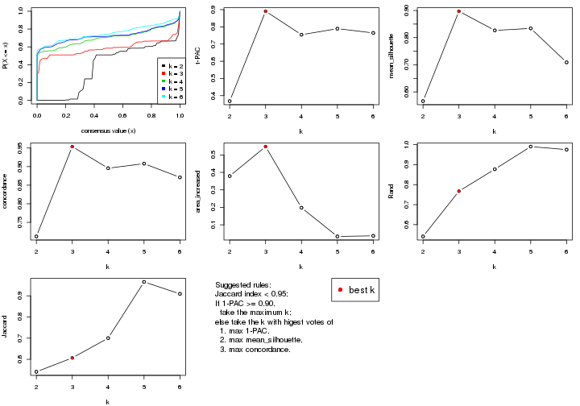

The numeric values for all these statistics can be obtained by `get_stats()`.

```r
get_stats(res)
```

```
#>   k 1-PAC mean_silhouette concordance area_increased  Rand Jaccard
#> 2 2 0.368           0.566       0.712         0.3790 0.541   0.541
#> 3 3 0.891           0.897       0.954         0.5475 0.767   0.607
#> 4 4 0.754           0.827       0.896         0.1977 0.877   0.700
#> 5 5 0.789           0.834       0.908         0.0335 0.990   0.966
#> 6 6 0.765           0.709       0.871         0.0370 0.975   0.909
```

`suggest_best_k()` suggests the best $k$ based on these statistics. The rules are as follows:

- All $k$ with Jaccard index larger than 0.95 are removed because the increase of
  the partition number does not provides enough extra information. If all $k$ are removed,
  the best $k$ is assigned by `NA`.
- For $k$ with 1-PAC larger than 0.9, the maximal $k$ is taken as the "best k". Other $k$ is called "optional k".
- If it does not fit the second rule. The $k$ with the highest vote of highest
  1-PAC, mean silhouette and concordance is taken as the "best k".

```r
suggest_best_k(res)
```

```
#> [1] 3
```


Following shows the table of the partitions (You need to click the **show/hide
code output** link to see it). The membership matrix (columns with name `p*`)
is inferred by
[`clue::cl_consensus()`](https://www.rdocumentation.org/link/cl_consensus?package=clue)
function with the `SE` method. Basically the value in the membership matrix
represents the probability to belong to a certain group. The finall class
label for an item is determined with the group with highest probability it
belongs to.

In `get_classes()` function, the entropy is calculated from the membership
matrix and the silhouette score is calculated from the consensus matrix.


<script>
$( function() {
	$( '#tabs-CV-hclust-get-classes' ).tabs();
} );
</script>
<div id='tabs-CV-hclust-get-classes'>
<ul>
<li><a href='#tab-CV-hclust-get-classes-1'>k = 2</a></li>
<li><a href='#tab-CV-hclust-get-classes-2'>k = 3</a></li>
<li><a href='#tab-CV-hclust-get-classes-3'>k = 4</a></li>
<li><a href='#tab-CV-hclust-get-classes-4'>k = 5</a></li>
<li><a href='#tab-CV-hclust-get-classes-5'>k = 6</a></li>
</ul>

<div id='tab-CV-hclust-get-classes-1'>
<p><a id='tab-CV-hclust-get-classes-1-a' style='color:#0366d6' href='#'>show/hide code output</a></p>
<pre><code class="r">cbind(get_classes(res, k = 2), get_membership(res, k = 2))
</code></pre>

<pre><code>#&gt;           class entropy silhouette    p1    p2
#&gt; GSM246087     1   0.866     0.0371 0.712 0.288
#&gt; GSM246088     1   0.866     0.0371 0.712 0.288
#&gt; GSM246089     1   0.866     0.0371 0.712 0.288
#&gt; GSM246090     1   0.866     0.0371 0.712 0.288
#&gt; GSM246119     1   0.866     0.0371 0.712 0.288
#&gt; GSM246120     1   0.866     0.0371 0.712 0.288
#&gt; GSM246121     1   0.866     0.0371 0.712 0.288
#&gt; GSM246122     1   0.866     0.0371 0.712 0.288
#&gt; GSM246123     1   0.866     0.0371 0.712 0.288
#&gt; GSM246422     1   0.963     0.7004 0.612 0.388
#&gt; GSM246423     1   0.963     0.7004 0.612 0.388
#&gt; GSM246484     1   0.963     0.7004 0.612 0.388
#&gt; GSM246485     2   0.808     0.4082 0.248 0.752
#&gt; GSM246486     2   0.992    -0.2991 0.448 0.552
#&gt; GSM246487     2   0.992    -0.2991 0.448 0.552
#&gt; GSM246488     2   0.998    -0.3691 0.472 0.528
#&gt; GSM246489     2   0.000     0.8195 0.000 1.000
#&gt; GSM246490     2   0.000     0.8195 0.000 1.000
#&gt; GSM246491     2   0.000     0.8195 0.000 1.000
#&gt; GSM247162     2   0.000     0.8195 0.000 1.000
#&gt; GSM247163     2   0.000     0.8195 0.000 1.000
#&gt; GSM247164     2   0.000     0.8195 0.000 1.000
#&gt; GSM247165     2   0.689     0.5496 0.184 0.816
#&gt; GSM247166     2   0.000     0.8195 0.000 1.000
#&gt; GSM247168     2   0.000     0.8195 0.000 1.000
#&gt; GSM247169     2   0.000     0.8195 0.000 1.000
#&gt; GSM247171     2   0.000     0.8195 0.000 1.000
#&gt; GSM247173     2   0.000     0.8195 0.000 1.000
#&gt; GSM247174     2   0.000     0.8195 0.000 1.000
#&gt; GSM247175     2   0.000     0.8195 0.000 1.000
#&gt; GSM247188     2   0.000     0.8195 0.000 1.000
#&gt; GSM247189     2   0.808     0.4082 0.248 0.752
#&gt; GSM247190     2   0.000     0.8195 0.000 1.000
#&gt; GSM247650     1   0.963     0.7004 0.612 0.388
#&gt; GSM247651     1   0.963     0.7004 0.612 0.388
#&gt; GSM247652     1   0.963     0.7004 0.612 0.388
#&gt; GSM247653     1   0.978     0.6646 0.588 0.412
#&gt; GSM247654     1   0.969     0.6911 0.604 0.396
#&gt; GSM247655     1   0.963     0.7004 0.612 0.388
#&gt; GSM247656     1   0.963     0.7004 0.612 0.388
#&gt; GSM247657     1   0.969     0.6911 0.604 0.396
#&gt; GSM247658     1   0.969     0.6911 0.604 0.396
#&gt; GSM247659     1   0.963     0.7004 0.612 0.388
#&gt; GSM247660     1   0.963     0.7004 0.612 0.388
#&gt; GSM247661     1   0.978     0.6646 0.588 0.412
#&gt; GSM247662     1   0.963     0.7004 0.612 0.388
#&gt; GSM247663     1   0.963     0.7004 0.612 0.388
#&gt; GSM247856     1   0.963     0.7004 0.612 0.388
#&gt; GSM247857     1   0.963     0.7004 0.612 0.388
#&gt; GSM247859     1   0.963     0.7004 0.612 0.388
#&gt; GSM247860     1   0.978     0.6646 0.588 0.412
#&gt; GSM247862     1   0.975     0.6716 0.592 0.408
#&gt; GSM247864     1   0.963     0.7004 0.612 0.388
#&gt; GSM247865     1   0.966     0.6950 0.608 0.392
#&gt; GSM247866     1   0.975     0.6716 0.592 0.408
#&gt; GSM247876     1   0.963     0.7004 0.612 0.388
#&gt; GSM247877     1   0.963     0.7004 0.612 0.388
#&gt; GSM247878     1   0.963     0.7004 0.612 0.388
#&gt; GSM247879     1   0.963     0.7004 0.612 0.388
#&gt; GSM247881     1   0.963     0.7004 0.612 0.388
#&gt; GSM247883     1   0.963     0.7004 0.612 0.388
</code></pre>

<script>
$('#tab-CV-hclust-get-classes-1-a').parent().next().next().hide();
$('#tab-CV-hclust-get-classes-1-a').click(function(){
  $('#tab-CV-hclust-get-classes-1-a').parent().next().next().toggle();
  return(false);
});
</script>
</div>

<div id='tab-CV-hclust-get-classes-2'>
<p><a id='tab-CV-hclust-get-classes-2-a' style='color:#0366d6' href='#'>show/hide code output</a></p>
<pre><code class="r">cbind(get_classes(res, k = 3), get_membership(res, k = 3))
</code></pre>

<pre><code>#&gt;           class entropy silhouette    p1    p2    p3
#&gt; GSM246087     3  0.0000      1.000 0.000 0.000 1.000
#&gt; GSM246088     3  0.0000      1.000 0.000 0.000 1.000
#&gt; GSM246089     3  0.0000      1.000 0.000 0.000 1.000
#&gt; GSM246090     3  0.0000      1.000 0.000 0.000 1.000
#&gt; GSM246119     3  0.0000      1.000 0.000 0.000 1.000
#&gt; GSM246120     3  0.0000      1.000 0.000 0.000 1.000
#&gt; GSM246121     3  0.0000      1.000 0.000 0.000 1.000
#&gt; GSM246122     3  0.0000      1.000 0.000 0.000 1.000
#&gt; GSM246123     3  0.0000      1.000 0.000 0.000 1.000
#&gt; GSM246422     1  0.0592      0.945 0.988 0.012 0.000
#&gt; GSM246423     1  0.0592      0.945 0.988 0.012 0.000
#&gt; GSM246484     1  0.0592      0.945 0.988 0.012 0.000
#&gt; GSM246485     2  0.6291      0.120 0.468 0.532 0.000
#&gt; GSM246486     1  0.5760      0.509 0.672 0.328 0.000
#&gt; GSM246487     1  0.5760      0.509 0.672 0.328 0.000
#&gt; GSM246488     1  0.5621      0.553 0.692 0.308 0.000
#&gt; GSM246489     2  0.0592      0.913 0.012 0.988 0.000
#&gt; GSM246490     2  0.0592      0.913 0.012 0.988 0.000
#&gt; GSM246491     2  0.0592      0.913 0.012 0.988 0.000
#&gt; GSM247162     2  0.0592      0.913 0.012 0.988 0.000
#&gt; GSM247163     2  0.0592      0.913 0.012 0.988 0.000
#&gt; GSM247164     2  0.0592      0.913 0.012 0.988 0.000
#&gt; GSM247165     2  0.5254      0.630 0.264 0.736 0.000
#&gt; GSM247166     2  0.0592      0.913 0.012 0.988 0.000
#&gt; GSM247168     2  0.0592      0.913 0.012 0.988 0.000
#&gt; GSM247169     2  0.0592      0.913 0.012 0.988 0.000
#&gt; GSM247171     2  0.0592      0.913 0.012 0.988 0.000
#&gt; GSM247173     2  0.0592      0.913 0.012 0.988 0.000
#&gt; GSM247174     2  0.0592      0.913 0.012 0.988 0.000
#&gt; GSM247175     2  0.0592      0.913 0.012 0.988 0.000
#&gt; GSM247188     2  0.0592      0.913 0.012 0.988 0.000
#&gt; GSM247189     2  0.5905      0.455 0.352 0.648 0.000
#&gt; GSM247190     2  0.0592      0.913 0.012 0.988 0.000
#&gt; GSM247650     1  0.0424      0.952 0.992 0.008 0.000
#&gt; GSM247651     1  0.0424      0.952 0.992 0.008 0.000
#&gt; GSM247652     1  0.0237      0.952 0.996 0.004 0.000
#&gt; GSM247653     1  0.2590      0.909 0.924 0.072 0.004
#&gt; GSM247654     1  0.0747      0.949 0.984 0.016 0.000
#&gt; GSM247655     1  0.0424      0.952 0.992 0.008 0.000
#&gt; GSM247656     1  0.0237      0.952 0.996 0.004 0.000
#&gt; GSM247657     1  0.0747      0.949 0.984 0.016 0.000
#&gt; GSM247658     1  0.0892      0.947 0.980 0.020 0.000
#&gt; GSM247659     1  0.0237      0.952 0.996 0.004 0.000
#&gt; GSM247660     1  0.0424      0.952 0.992 0.008 0.000
#&gt; GSM247661     1  0.2261      0.915 0.932 0.068 0.000
#&gt; GSM247662     1  0.0237      0.952 0.996 0.004 0.000
#&gt; GSM247663     1  0.0424      0.952 0.992 0.008 0.000
#&gt; GSM247856     1  0.0424      0.952 0.992 0.008 0.000
#&gt; GSM247857     1  0.0237      0.952 0.996 0.004 0.000
#&gt; GSM247859     1  0.0424      0.952 0.992 0.008 0.000
#&gt; GSM247860     1  0.2590      0.909 0.924 0.072 0.004
#&gt; GSM247862     1  0.2066      0.921 0.940 0.060 0.000
#&gt; GSM247864     1  0.0424      0.952 0.992 0.008 0.000
#&gt; GSM247865     1  0.0592      0.947 0.988 0.012 0.000
#&gt; GSM247866     1  0.2165      0.918 0.936 0.064 0.000
#&gt; GSM247876     1  0.0237      0.952 0.996 0.004 0.000
#&gt; GSM247877     1  0.0592      0.945 0.988 0.012 0.000
#&gt; GSM247878     1  0.0592      0.945 0.988 0.012 0.000
#&gt; GSM247879     1  0.0592      0.945 0.988 0.012 0.000
#&gt; GSM247881     1  0.0237      0.952 0.996 0.004 0.000
#&gt; GSM247883     1  0.0237      0.952 0.996 0.004 0.000
</code></pre>

<script>
$('#tab-CV-hclust-get-classes-2-a').parent().next().next().hide();
$('#tab-CV-hclust-get-classes-2-a').click(function(){
  $('#tab-CV-hclust-get-classes-2-a').parent().next().next().toggle();
  return(false);
});
</script>
</div>

<div id='tab-CV-hclust-get-classes-3'>
<p><a id='tab-CV-hclust-get-classes-3-a' style='color:#0366d6' href='#'>show/hide code output</a></p>
<pre><code class="r">cbind(get_classes(res, k = 4), get_membership(res, k = 4))
</code></pre>

<pre><code>#&gt;           class entropy silhouette    p1    p2 p3    p4
#&gt; GSM246087     3  0.0000     1.0000 0.000 0.000  1 0.000
#&gt; GSM246088     3  0.0000     1.0000 0.000 0.000  1 0.000
#&gt; GSM246089     3  0.0000     1.0000 0.000 0.000  1 0.000
#&gt; GSM246090     3  0.0000     1.0000 0.000 0.000  1 0.000
#&gt; GSM246119     3  0.0000     1.0000 0.000 0.000  1 0.000
#&gt; GSM246120     3  0.0000     1.0000 0.000 0.000  1 0.000
#&gt; GSM246121     3  0.0000     1.0000 0.000 0.000  1 0.000
#&gt; GSM246122     3  0.0000     1.0000 0.000 0.000  1 0.000
#&gt; GSM246123     3  0.0000     1.0000 0.000 0.000  1 0.000
#&gt; GSM246422     4  0.3764     0.7410 0.216 0.000  0 0.784
#&gt; GSM246423     4  0.3764     0.7410 0.216 0.000  0 0.784
#&gt; GSM246484     4  0.3764     0.7410 0.216 0.000  0 0.784
#&gt; GSM246485     2  0.6979    -0.0452 0.128 0.528  0 0.344
#&gt; GSM246486     4  0.7031     0.5152 0.140 0.324  0 0.536
#&gt; GSM246487     4  0.7031     0.5152 0.140 0.324  0 0.536
#&gt; GSM246488     4  0.6783     0.5304 0.124 0.304  0 0.572
#&gt; GSM246489     2  0.0000     0.9239 0.000 1.000  0 0.000
#&gt; GSM246490     2  0.0000     0.9239 0.000 1.000  0 0.000
#&gt; GSM246491     2  0.0000     0.9239 0.000 1.000  0 0.000
#&gt; GSM247162     2  0.0000     0.9239 0.000 1.000  0 0.000
#&gt; GSM247163     2  0.0000     0.9239 0.000 1.000  0 0.000
#&gt; GSM247164     2  0.0000     0.9239 0.000 1.000  0 0.000
#&gt; GSM247165     2  0.4642     0.5962 0.020 0.740  0 0.240
#&gt; GSM247166     2  0.0000     0.9239 0.000 1.000  0 0.000
#&gt; GSM247168     2  0.0000     0.9239 0.000 1.000  0 0.000
#&gt; GSM247169     2  0.0000     0.9239 0.000 1.000  0 0.000
#&gt; GSM247171     2  0.0000     0.9239 0.000 1.000  0 0.000
#&gt; GSM247173     2  0.0000     0.9239 0.000 1.000  0 0.000
#&gt; GSM247174     2  0.0000     0.9239 0.000 1.000  0 0.000
#&gt; GSM247175     2  0.0000     0.9239 0.000 1.000  0 0.000
#&gt; GSM247188     2  0.0000     0.9239 0.000 1.000  0 0.000
#&gt; GSM247189     2  0.5614     0.4142 0.044 0.652  0 0.304
#&gt; GSM247190     2  0.0000     0.9239 0.000 1.000  0 0.000
#&gt; GSM247650     1  0.0188     0.8967 0.996 0.000  0 0.004
#&gt; GSM247651     1  0.2281     0.8320 0.904 0.000  0 0.096
#&gt; GSM247652     1  0.0469     0.8945 0.988 0.000  0 0.012
#&gt; GSM247653     1  0.3764     0.7382 0.784 0.000  0 0.216
#&gt; GSM247654     1  0.0817     0.8919 0.976 0.000  0 0.024
#&gt; GSM247655     1  0.0336     0.8959 0.992 0.000  0 0.008
#&gt; GSM247656     1  0.0469     0.8945 0.988 0.000  0 0.012
#&gt; GSM247657     1  0.0817     0.8922 0.976 0.000  0 0.024
#&gt; GSM247658     1  0.1118     0.8864 0.964 0.000  0 0.036
#&gt; GSM247659     1  0.0592     0.8951 0.984 0.000  0 0.016
#&gt; GSM247660     1  0.2281     0.8320 0.904 0.000  0 0.096
#&gt; GSM247661     1  0.3610     0.7547 0.800 0.000  0 0.200
#&gt; GSM247662     1  0.0592     0.8951 0.984 0.000  0 0.016
#&gt; GSM247663     1  0.0336     0.8961 0.992 0.000  0 0.008
#&gt; GSM247856     1  0.0188     0.8967 0.996 0.000  0 0.004
#&gt; GSM247857     1  0.0592     0.8951 0.984 0.000  0 0.016
#&gt; GSM247859     1  0.2149     0.8401 0.912 0.000  0 0.088
#&gt; GSM247860     1  0.3764     0.7382 0.784 0.000  0 0.216
#&gt; GSM247862     1  0.3172     0.7959 0.840 0.000  0 0.160
#&gt; GSM247864     1  0.0336     0.8970 0.992 0.000  0 0.008
#&gt; GSM247865     1  0.4608     0.4272 0.692 0.004  0 0.304
#&gt; GSM247866     1  0.3610     0.7545 0.800 0.000  0 0.200
#&gt; GSM247876     1  0.1716     0.8594 0.936 0.000  0 0.064
#&gt; GSM247877     4  0.4888     0.6109 0.412 0.000  0 0.588
#&gt; GSM247878     4  0.4877     0.6208 0.408 0.000  0 0.592
#&gt; GSM247879     4  0.4888     0.6109 0.412 0.000  0 0.588
#&gt; GSM247881     1  0.1022     0.8882 0.968 0.000  0 0.032
#&gt; GSM247883     1  0.1022     0.8882 0.968 0.000  0 0.032
</code></pre>

<script>
$('#tab-CV-hclust-get-classes-3-a').parent().next().next().hide();
$('#tab-CV-hclust-get-classes-3-a').click(function(){
  $('#tab-CV-hclust-get-classes-3-a').parent().next().next().toggle();
  return(false);
});
</script>
</div>

<div id='tab-CV-hclust-get-classes-4'>
<p><a id='tab-CV-hclust-get-classes-4-a' style='color:#0366d6' href='#'>show/hide code output</a></p>
<pre><code class="r">cbind(get_classes(res, k = 5), get_membership(res, k = 5))
</code></pre>

<pre><code>#&gt;           class entropy silhouette    p1    p2 p3    p4    p5
#&gt; GSM246087     3  0.0000      1.000 0.000 0.000  1 0.000 0.000
#&gt; GSM246088     3  0.0000      1.000 0.000 0.000  1 0.000 0.000
#&gt; GSM246089     3  0.0000      1.000 0.000 0.000  1 0.000 0.000
#&gt; GSM246090     3  0.0000      1.000 0.000 0.000  1 0.000 0.000
#&gt; GSM246119     3  0.0000      1.000 0.000 0.000  1 0.000 0.000
#&gt; GSM246120     3  0.0000      1.000 0.000 0.000  1 0.000 0.000
#&gt; GSM246121     3  0.0000      1.000 0.000 0.000  1 0.000 0.000
#&gt; GSM246122     3  0.0000      1.000 0.000 0.000  1 0.000 0.000
#&gt; GSM246123     3  0.0000      1.000 0.000 0.000  1 0.000 0.000
#&gt; GSM246422     4  0.3318      0.615 0.192 0.000  0 0.800 0.008
#&gt; GSM246423     4  0.3318      0.615 0.192 0.000  0 0.800 0.008
#&gt; GSM246484     4  0.3318      0.615 0.192 0.000  0 0.800 0.008
#&gt; GSM246485     2  0.6021     -0.177 0.128 0.524  0 0.348 0.000
#&gt; GSM246486     4  0.6043      0.656 0.140 0.320  0 0.540 0.000
#&gt; GSM246487     4  0.6043      0.656 0.140 0.320  0 0.540 0.000
#&gt; GSM246488     4  0.5827      0.664 0.124 0.300  0 0.576 0.000
#&gt; GSM246489     2  0.0000      0.919 0.000 1.000  0 0.000 0.000
#&gt; GSM246490     2  0.0000      0.919 0.000 1.000  0 0.000 0.000
#&gt; GSM246491     2  0.0000      0.919 0.000 1.000  0 0.000 0.000
#&gt; GSM247162     2  0.0000      0.919 0.000 1.000  0 0.000 0.000
#&gt; GSM247163     2  0.0000      0.919 0.000 1.000  0 0.000 0.000
#&gt; GSM247164     2  0.0000      0.919 0.000 1.000  0 0.000 0.000
#&gt; GSM247165     2  0.4026      0.553 0.020 0.736  0 0.244 0.000
#&gt; GSM247166     2  0.0000      0.919 0.000 1.000  0 0.000 0.000
#&gt; GSM247168     2  0.0000      0.919 0.000 1.000  0 0.000 0.000
#&gt; GSM247169     2  0.0000      0.919 0.000 1.000  0 0.000 0.000
#&gt; GSM247171     2  0.0000      0.919 0.000 1.000  0 0.000 0.000
#&gt; GSM247173     2  0.0000      0.919 0.000 1.000  0 0.000 0.000
#&gt; GSM247174     2  0.0000      0.919 0.000 1.000  0 0.000 0.000
#&gt; GSM247175     2  0.0000      0.919 0.000 1.000  0 0.000 0.000
#&gt; GSM247188     2  0.0000      0.919 0.000 1.000  0 0.000 0.000
#&gt; GSM247189     2  0.4854      0.340 0.044 0.648  0 0.308 0.000
#&gt; GSM247190     2  0.0000      0.919 0.000 1.000  0 0.000 0.000
#&gt; GSM247650     1  0.0162      0.905 0.996 0.000  0 0.000 0.004
#&gt; GSM247651     1  0.1965      0.848 0.904 0.000  0 0.096 0.000
#&gt; GSM247652     1  0.0404      0.904 0.988 0.000  0 0.012 0.000
#&gt; GSM247653     1  0.3745      0.768 0.780 0.000  0 0.196 0.024
#&gt; GSM247654     1  0.0798      0.902 0.976 0.000  0 0.016 0.008
#&gt; GSM247655     1  0.0290      0.904 0.992 0.000  0 0.008 0.000
#&gt; GSM247656     1  0.0404      0.904 0.988 0.000  0 0.012 0.000
#&gt; GSM247657     1  0.0771      0.902 0.976 0.000  0 0.020 0.004
#&gt; GSM247658     1  0.1106      0.898 0.964 0.000  0 0.024 0.012
#&gt; GSM247659     1  0.0510      0.905 0.984 0.000  0 0.016 0.000
#&gt; GSM247660     1  0.1965      0.848 0.904 0.000  0 0.096 0.000
#&gt; GSM247661     1  0.3318      0.785 0.800 0.000  0 0.192 0.008
#&gt; GSM247662     1  0.0510      0.905 0.984 0.000  0 0.016 0.000
#&gt; GSM247663     1  0.0955      0.901 0.968 0.000  0 0.004 0.028
#&gt; GSM247856     1  0.0162      0.905 0.996 0.000  0 0.000 0.004
#&gt; GSM247857     1  0.0510      0.905 0.984 0.000  0 0.016 0.000
#&gt; GSM247859     1  0.1851      0.855 0.912 0.000  0 0.088 0.000
#&gt; GSM247860     1  0.3745      0.768 0.780 0.000  0 0.196 0.024
#&gt; GSM247862     1  0.2997      0.824 0.840 0.000  0 0.148 0.012
#&gt; GSM247864     1  0.0324      0.905 0.992 0.000  0 0.004 0.004
#&gt; GSM247865     1  0.3837      0.493 0.692 0.000  0 0.308 0.000
#&gt; GSM247866     1  0.3456      0.786 0.800 0.000  0 0.184 0.016
#&gt; GSM247876     1  0.2806      0.811 0.844 0.000  0 0.004 0.152
#&gt; GSM247877     5  0.0703      0.830 0.024 0.000  0 0.000 0.976
#&gt; GSM247878     5  0.5472      0.569 0.108 0.000  0 0.260 0.632
#&gt; GSM247879     5  0.0703      0.830 0.024 0.000  0 0.000 0.976
#&gt; GSM247881     1  0.0880      0.897 0.968 0.000  0 0.032 0.000
#&gt; GSM247883     1  0.0880      0.897 0.968 0.000  0 0.032 0.000
</code></pre>

<script>
$('#tab-CV-hclust-get-classes-4-a').parent().next().next().hide();
$('#tab-CV-hclust-get-classes-4-a').click(function(){
  $('#tab-CV-hclust-get-classes-4-a').parent().next().next().toggle();
  return(false);
});
</script>
</div>

<div id='tab-CV-hclust-get-classes-5'>
<p><a id='tab-CV-hclust-get-classes-5-a' style='color:#0366d6' href='#'>show/hide code output</a></p>
<pre><code class="r">cbind(get_classes(res, k = 6), get_membership(res, k = 6))
</code></pre>

<pre><code>#&gt;           class entropy silhouette    p1    p2    p3    p4    p5    p6
#&gt; GSM246087     3  0.0000      0.956 0.000 0.000 1.000 0.000 0.000 0.000
#&gt; GSM246088     3  0.0000      0.956 0.000 0.000 1.000 0.000 0.000 0.000
#&gt; GSM246089     3  0.5030      0.544 0.000 0.000 0.616 0.116 0.000 0.268
#&gt; GSM246090     3  0.0000      0.956 0.000 0.000 1.000 0.000 0.000 0.000
#&gt; GSM246119     3  0.0000      0.956 0.000 0.000 1.000 0.000 0.000 0.000
#&gt; GSM246120     3  0.0000      0.956 0.000 0.000 1.000 0.000 0.000 0.000
#&gt; GSM246121     3  0.0000      0.956 0.000 0.000 1.000 0.000 0.000 0.000
#&gt; GSM246122     3  0.0000      0.956 0.000 0.000 1.000 0.000 0.000 0.000
#&gt; GSM246123     3  0.0000      0.956 0.000 0.000 1.000 0.000 0.000 0.000
#&gt; GSM246422     4  0.2003      0.598 0.116 0.000 0.000 0.884 0.000 0.000
#&gt; GSM246423     4  0.2003      0.598 0.116 0.000 0.000 0.884 0.000 0.000
#&gt; GSM246484     4  0.2003      0.598 0.116 0.000 0.000 0.884 0.000 0.000
#&gt; GSM246485     2  0.5771     -0.169 0.128 0.524 0.000 0.332 0.000 0.016
#&gt; GSM246486     4  0.5947      0.646 0.136 0.320 0.000 0.520 0.000 0.024
#&gt; GSM246487     4  0.5947      0.646 0.136 0.320 0.000 0.520 0.000 0.024
#&gt; GSM246488     4  0.5642      0.664 0.124 0.300 0.000 0.560 0.000 0.016
#&gt; GSM246489     2  0.0000      0.919 0.000 1.000 0.000 0.000 0.000 0.000
#&gt; GSM246490     2  0.0000      0.919 0.000 1.000 0.000 0.000 0.000 0.000
#&gt; GSM246491     2  0.0000      0.919 0.000 1.000 0.000 0.000 0.000 0.000
#&gt; GSM247162     2  0.0000      0.919 0.000 1.000 0.000 0.000 0.000 0.000
#&gt; GSM247163     2  0.0000      0.919 0.000 1.000 0.000 0.000 0.000 0.000
#&gt; GSM247164     2  0.0000      0.919 0.000 1.000 0.000 0.000 0.000 0.000
#&gt; GSM247165     2  0.3946      0.553 0.020 0.736 0.000 0.228 0.000 0.016
#&gt; GSM247166     2  0.0000      0.919 0.000 1.000 0.000 0.000 0.000 0.000
#&gt; GSM247168     2  0.0000      0.919 0.000 1.000 0.000 0.000 0.000 0.000
#&gt; GSM247169     2  0.0000      0.919 0.000 1.000 0.000 0.000 0.000 0.000
#&gt; GSM247171     2  0.0000      0.919 0.000 1.000 0.000 0.000 0.000 0.000
#&gt; GSM247173     2  0.0000      0.919 0.000 1.000 0.000 0.000 0.000 0.000
#&gt; GSM247174     2  0.0000      0.919 0.000 1.000 0.000 0.000 0.000 0.000
#&gt; GSM247175     2  0.0000      0.919 0.000 1.000 0.000 0.000 0.000 0.000
#&gt; GSM247188     2  0.0000      0.919 0.000 1.000 0.000 0.000 0.000 0.000
#&gt; GSM247189     2  0.4712      0.340 0.044 0.648 0.000 0.292 0.000 0.016
#&gt; GSM247190     2  0.0000      0.919 0.000 1.000 0.000 0.000 0.000 0.000
#&gt; GSM247650     1  0.0547      0.759 0.980 0.000 0.000 0.000 0.000 0.020
#&gt; GSM247651     1  0.2163      0.704 0.892 0.000 0.000 0.092 0.000 0.016
#&gt; GSM247652     1  0.0725      0.761 0.976 0.000 0.000 0.012 0.000 0.012
#&gt; GSM247653     6  0.3847      0.980 0.456 0.000 0.000 0.000 0.000 0.544
#&gt; GSM247654     1  0.1556      0.720 0.920 0.000 0.000 0.000 0.000 0.080
#&gt; GSM247655     1  0.0622      0.761 0.980 0.000 0.000 0.008 0.000 0.012
#&gt; GSM247656     1  0.1563      0.743 0.932 0.000 0.000 0.012 0.000 0.056
#&gt; GSM247657     1  0.1444      0.725 0.928 0.000 0.000 0.000 0.000 0.072
#&gt; GSM247658     1  0.1267      0.735 0.940 0.000 0.000 0.000 0.000 0.060
#&gt; GSM247659     1  0.1745      0.739 0.920 0.000 0.000 0.012 0.000 0.068
#&gt; GSM247660     1  0.2163      0.704 0.892 0.000 0.000 0.092 0.000 0.016
#&gt; GSM247661     1  0.3851     -0.792 0.540 0.000 0.000 0.000 0.000 0.460
#&gt; GSM247662     1  0.1625      0.743 0.928 0.000 0.000 0.012 0.000 0.060
#&gt; GSM247663     1  0.2814      0.607 0.820 0.000 0.000 0.000 0.008 0.172
#&gt; GSM247856     1  0.0632      0.757 0.976 0.000 0.000 0.000 0.000 0.024
#&gt; GSM247857     1  0.1625      0.743 0.928 0.000 0.000 0.012 0.000 0.060
#&gt; GSM247859     1  0.2147      0.713 0.896 0.000 0.000 0.084 0.000 0.020
#&gt; GSM247860     6  0.3851      0.981 0.460 0.000 0.000 0.000 0.000 0.540
#&gt; GSM247862     1  0.3349      0.161 0.748 0.000 0.000 0.008 0.000 0.244
#&gt; GSM247864     1  0.0603      0.759 0.980 0.000 0.000 0.004 0.000 0.016
#&gt; GSM247865     1  0.4079      0.381 0.680 0.000 0.000 0.288 0.000 0.032
#&gt; GSM247866     1  0.3823     -0.727 0.564 0.000 0.000 0.000 0.000 0.436
#&gt; GSM247876     1  0.4631      0.351 0.692 0.000 0.000 0.000 0.140 0.168
#&gt; GSM247877     5  0.0000      0.837 0.000 0.000 0.000 0.000 1.000 0.000
#&gt; GSM247878     5  0.4306      0.599 0.032 0.000 0.000 0.344 0.624 0.000
#&gt; GSM247879     5  0.0000      0.837 0.000 0.000 0.000 0.000 1.000 0.000
#&gt; GSM247881     1  0.1168      0.760 0.956 0.000 0.000 0.028 0.000 0.016
#&gt; GSM247883     1  0.1074      0.759 0.960 0.000 0.000 0.028 0.000 0.012
</code></pre>

<script>
$('#tab-CV-hclust-get-classes-5-a').parent().next().next().hide();
$('#tab-CV-hclust-get-classes-5-a').click(function(){
  $('#tab-CV-hclust-get-classes-5-a').parent().next().next().toggle();
  return(false);
});
</script>
</div>
</div>

Heatmaps for the consensus matrix. It visualizes the probability of two
samples to be in a same group.


<script>
$( function() {
	$( '#tabs-CV-hclust-consensus-heatmap' ).tabs();
} );
</script>
<div id='tabs-CV-hclust-consensus-heatmap'>
<ul>
<li><a href='#tab-CV-hclust-consensus-heatmap-1'>k = 2</a></li>
<li><a href='#tab-CV-hclust-consensus-heatmap-2'>k = 3</a></li>
<li><a href='#tab-CV-hclust-consensus-heatmap-3'>k = 4</a></li>
<li><a href='#tab-CV-hclust-consensus-heatmap-4'>k = 5</a></li>
<li><a href='#tab-CV-hclust-consensus-heatmap-5'>k = 6</a></li>
</ul>
<div id='tab-CV-hclust-consensus-heatmap-1'>
<pre><code class="r">consensus_heatmap(res, k = 2)
</code></pre>

<p></p>

</div>
<div id='tab-CV-hclust-consensus-heatmap-2'>
<pre><code class="r">consensus_heatmap(res, k = 3)
</code></pre>

<p></p>

</div>
<div id='tab-CV-hclust-consensus-heatmap-3'>
<pre><code class="r">consensus_heatmap(res, k = 4)
</code></pre>

<p></p>

</div>
<div id='tab-CV-hclust-consensus-heatmap-4'>
<pre><code class="r">consensus_heatmap(res, k = 5)
</code></pre>

<p></p>

</div>
<div id='tab-CV-hclust-consensus-heatmap-5'>
<pre><code class="r">consensus_heatmap(res, k = 6)
</code></pre>

<p></p>

</div>
</div>

Heatmaps for the membership of samples in all partitions to see how consistent they are:


<script>
$( function() {
	$( '#tabs-CV-hclust-membership-heatmap' ).tabs();
} );
</script>
<div id='tabs-CV-hclust-membership-heatmap'>
<ul>
<li><a href='#tab-CV-hclust-membership-heatmap-1'>k = 2</a></li>
<li><a href='#tab-CV-hclust-membership-heatmap-2'>k = 3</a></li>
<li><a href='#tab-CV-hclust-membership-heatmap-3'>k = 4</a></li>
<li><a href='#tab-CV-hclust-membership-heatmap-4'>k = 5</a></li>
<li><a href='#tab-CV-hclust-membership-heatmap-5'>k = 6</a></li>
</ul>
<div id='tab-CV-hclust-membership-heatmap-1'>
<pre><code class="r">membership_heatmap(res, k = 2)
</code></pre>

<p></p>

</div>
<div id='tab-CV-hclust-membership-heatmap-2'>
<pre><code class="r">membership_heatmap(res, k = 3)
</code></pre>

<p></p>

</div>
<div id='tab-CV-hclust-membership-heatmap-3'>
<pre><code class="r">membership_heatmap(res, k = 4)
</code></pre>

<p></p>

</div>
<div id='tab-CV-hclust-membership-heatmap-4'>
<pre><code class="r">membership_heatmap(res, k = 5)
</code></pre>

<p></p>

</div>
<div id='tab-CV-hclust-membership-heatmap-5'>
<pre><code class="r">membership_heatmap(res, k = 6)
</code></pre>

<p>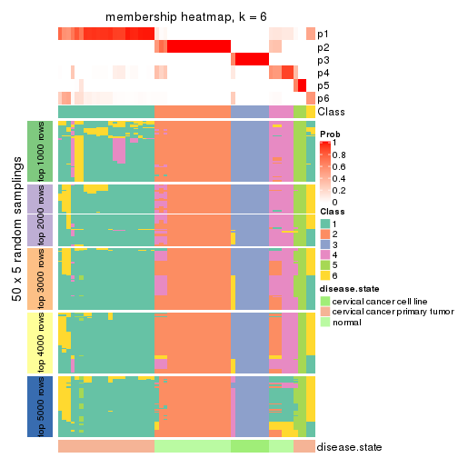</p>

</div>
</div>

As soon as we have had the classes for columns, we can look for signatures
which are significantly different between classes which can be candidate marks
for certain classes. Following are the heatmaps for signatures.


Signature heatmaps where rows are scaled:


<script>
$( function() {
	$( '#tabs-CV-hclust-get-signatures' ).tabs();
} );
</script>
<div id='tabs-CV-hclust-get-signatures'>
<ul>
<li><a href='#tab-CV-hclust-get-signatures-1'>k = 2</a></li>
<li><a href='#tab-CV-hclust-get-signatures-2'>k = 3</a></li>
<li><a href='#tab-CV-hclust-get-signatures-3'>k = 4</a></li>
<li><a href='#tab-CV-hclust-get-signatures-4'>k = 5</a></li>
<li><a href='#tab-CV-hclust-get-signatures-5'>k = 6</a></li>
</ul>
<div id='tab-CV-hclust-get-signatures-1'>
<pre><code class="r">get_signatures(res, k = 2)
</code></pre>

<p></p>

</div>
<div id='tab-CV-hclust-get-signatures-2'>
<pre><code class="r">get_signatures(res, k = 3)
</code></pre>

<p></p>

</div>
<div id='tab-CV-hclust-get-signatures-3'>
<pre><code class="r">get_signatures(res, k = 4)
</code></pre>

<p></p>

</div>
<div id='tab-CV-hclust-get-signatures-4'>
<pre><code class="r">get_signatures(res, k = 5)
</code></pre>

<p></p>

</div>
<div id='tab-CV-hclust-get-signatures-5'>
<pre><code class="r">get_signatures(res, k = 6)
</code></pre>

<p></p>

</div>
</div>


Signature heatmaps where rows are not scaled:


<script>
$( function() {
	$( '#tabs-CV-hclust-get-signatures-no-scale' ).tabs();
} );
</script>
<div id='tabs-CV-hclust-get-signatures-no-scale'>
<ul>
<li><a href='#tab-CV-hclust-get-signatures-no-scale-1'>k = 2</a></li>
<li><a href='#tab-CV-hclust-get-signatures-no-scale-2'>k = 3</a></li>
<li><a href='#tab-CV-hclust-get-signatures-no-scale-3'>k = 4</a></li>
<li><a href='#tab-CV-hclust-get-signatures-no-scale-4'>k = 5</a></li>
<li><a href='#tab-CV-hclust-get-signatures-no-scale-5'>k = 6</a></li>
</ul>
<div id='tab-CV-hclust-get-signatures-no-scale-1'>
<pre><code class="r">get_signatures(res, k = 2, scale_rows = FALSE)
</code></pre>

<p></p>

</div>
<div id='tab-CV-hclust-get-signatures-no-scale-2'>
<pre><code class="r">get_signatures(res, k = 3, scale_rows = FALSE)
</code></pre>

<p></p>

</div>
<div id='tab-CV-hclust-get-signatures-no-scale-3'>
<pre><code class="r">get_signatures(res, k = 4, scale_rows = FALSE)
</code></pre>

<p></p>

</div>
<div id='tab-CV-hclust-get-signatures-no-scale-4'>
<pre><code class="r">get_signatures(res, k = 5, scale_rows = FALSE)
</code></pre>

<p></p>

</div>
<div id='tab-CV-hclust-get-signatures-no-scale-5'>
<pre><code class="r">get_signatures(res, k = 6, scale_rows = FALSE)
</code></pre>

<p></p>

</div>
</div>


Compare the overlap of signatures from different k:

```r
compare_signatures(res)
```


`get_signature()` returns a data frame invisibly. TO get the list of signatures, the function
call should be assigned to a variable explicitly. In following code, if `plot` argument is set
to `FALSE`, no heatmap is plotted while only the differential analysis is performed.

```r
# code only for demonstration
tb = get_signature(res, k = ..., plot = FALSE)
```

An example of the output of `tb` is:

```
#>   which_row         fdr    mean_1    mean_2 scaled_mean_1 scaled_mean_2 km
#> 1        38 0.042760348  8.373488  9.131774    -0.5533452     0.5164555  1
#> 2        40 0.018707592  7.106213  8.469186    -0.6173731     0.5762149  1
#> 3        55 0.019134737 10.221463 11.207825    -0.6159697     0.5749050  1
#> 4        59 0.006059896  5.921854  7.869574    -0.6899429     0.6439467  1
#> 5        60 0.018055526  8.928898 10.211722    -0.6204761     0.5791110  1
#> 6        98 0.009384629 15.714769 14.887706     0.6635654    -0.6193277  2
...
```

The columns in `tb` are:

1. `which_row`: row indices corresponding to the input matrix.
2. `fdr`: FDR for the differential test. 
3. `mean_x`: The mean value in group x.
4. `scaled_mean_x`: The mean value in group x after rows are scaled.
5. `km`: Row groups if k-means clustering is applied to rows.


UMAP plot which shows how samples are separated.


<script>
$( function() {
	$( '#tabs-CV-hclust-dimension-reduction' ).tabs();
} );
</script>
<div id='tabs-CV-hclust-dimension-reduction'>
<ul>
<li><a href='#tab-CV-hclust-dimension-reduction-1'>k = 2</a></li>
<li><a href='#tab-CV-hclust-dimension-reduction-2'>k = 3</a></li>
<li><a href='#tab-CV-hclust-dimension-reduction-3'>k = 4</a></li>
<li><a href='#tab-CV-hclust-dimension-reduction-4'>k = 5</a></li>
<li><a href='#tab-CV-hclust-dimension-reduction-5'>k = 6</a></li>
</ul>
<div id='tab-CV-hclust-dimension-reduction-1'>
<pre><code class="r">dimension_reduction(res, k = 2, method = &quot;UMAP&quot;)
</code></pre>

<p></p>

</div>
<div id='tab-CV-hclust-dimension-reduction-2'>
<pre><code class="r">dimension_reduction(res, k = 3, method = &quot;UMAP&quot;)
</code></pre>

<p></p>

</div>
<div id='tab-CV-hclust-dimension-reduction-3'>
<pre><code class="r">dimension_reduction(res, k = 4, method = &quot;UMAP&quot;)
</code></pre>

<p></p>

</div>
<div id='tab-CV-hclust-dimension-reduction-4'>
<pre><code class="r">dimension_reduction(res, k = 5, method = &quot;UMAP&quot;)
</code></pre>

<p></p>

</div>
<div id='tab-CV-hclust-dimension-reduction-5'>
<pre><code class="r">dimension_reduction(res, k = 6, method = &quot;UMAP&quot;)
</code></pre>

<p></p>

</div>
</div>


Following heatmap shows how subgroups are split when increasing `k`:

```r
collect_classes(res)
```


Test correlation between subgroups and known annotations. If the known
annotation is numeric, one-way ANOVA test is applied, and if the known
annotation is discrete, chi-squared contingency table test is applied.

```r
test_to_known_factors(res)
```

```
#>            n disease.state(p) k
#> CV:hclust 47         1.47e-08 2
#> CV:hclust 59         1.58e-19 3
#> CV:hclust 58         1.14e-20 4
#> CV:hclust 58         2.22e-21 5
#> CV:hclust 54         1.35e-18 6
```


If matrix rows can be associated to genes, consider to use `GO_Enrichment(res,
...)` to perform function enrichment for the signature genes.


 

---------------------------------------------------


### CV:kmeans**


The object with results only for a single top-value method and a single partition method 
can be extracted as:

```r
res = res_list["CV", "kmeans"]
# you can also extract it by
# res = res_list["CV:kmeans"]
```

A summary of `res` and all the functions that can be applied to it:

```r
res
```

```
#> A 'ConsensusPartition' object with k = 2, 3, 4, 5, 6.
#>   On a matrix with 21168 rows and 61 columns.
#>   Top rows (1000, 2000, 3000, 4000, 5000) are extracted by 'CV' method.
#>   Subgroups are detected by 'kmeans' method.
#>   Performed in total 1250 partitions by row resampling.
#>   Best k for subgroups seems to be 3.
#> 
#> Following methods can be applied to this 'ConsensusPartition' object:
#>  [1] "cola_report"             "collect_classes"         "collect_plots"          
#>  [4] "collect_stats"           "colnames"                "compare_signatures"     
#>  [7] "consensus_heatmap"       "dimension_reduction"     "functional_enrichment"  
#> [10] "get_anno_col"            "get_anno"                "get_classes"            
#> [13] "get_consensus"           "get_matrix"              "get_membership"         
#> [16] "get_param"               "get_signatures"          "get_stats"              
#> [19] "is_best_k"               "is_stable_k"             "membership_heatmap"     
#> [22] "ncol"                    "nrow"                    "plot_ecdf"              
#> [25] "rownames"                "select_partition_number" "show"                   
#> [28] "suggest_best_k"          "test_to_known_factors"
```

`collect_plots()` function collects all the plots made from `res` for all `k` (number of partitions)
into one single page to provide an easy and fast comparison between different `k`.

```r
collect_plots(res)
```


The plots are:

- The first row: a plot of the ECDF (Empirical cumulative distribution
  function) curves of the consensus matrix for each `k` and the heatmap of
  predicted classes for each `k`.
- The second row: heatmaps of the consensus matrix for each `k`.
- The third row: heatmaps of the membership matrix for each `k`.
- The fouth row: heatmaps of the signatures for each `k`.

All the plots in panels can be made by individual functions and they are
plotted later in this section.

`select_partition_number()` produces several plots showing different
statistics for choosing "optimized" `k`. There are following statistics:

- ECDF curves of the consensus matrix for each `k`;
- 1-PAC. [The PAC
  score](https://en.wikipedia.org/wiki/Consensus_clustering#Over-interpretation_potential_of_consensus_clustering)
  measures the proportion of the ambiguous subgrouping.
- Mean silhouette score.
- Concordance. The mean probability of fiting the consensus class ids in all
  partitions.
- Area increased. Denote $A_k$ as the area under the ECDF curve for current
  `k`, the area increased is defined as $A_k - A_{k-1}$.
- Rand index. The percent of pairs of samples that are both in a same cluster
  or both are not in a same cluster in the partition of k and k-1.
- Jaccard index. The ratio of pairs of samples are both in a same cluster in
  the partition of k and k-1 and the pairs of samples are both in a same
  cluster in the partition k or k-1.

The detailed explanations of these statistics can be found in [the cola
vignette](http://bioconductor.org/packages/devel/bioc/vignettes/cola/inst/doc/cola.html#toc_13).

Generally speaking, lower PAC score, higher mean silhouette score or higher
concordance corresponds to better partition. Rand index and Jaccard index
measure how similar the current partition is compared to partition with `k-1`.
If they are too similar, we won't accept `k` is better than `k-1`.

```r
select_partition_number(res)
```


The numeric values for all these statistics can be obtained by `get_stats()`.

```r
get_stats(res)
```

```
#>   k 1-PAC mean_silhouette concordance area_increased  Rand Jaccard
#> 2 2 0.323           0.687       0.700         0.4056 0.552   0.552
#> 3 3 1.000           0.970       0.986         0.4773 0.815   0.675
#> 4 4 0.848           0.893       0.902         0.1593 0.874   0.693
#> 5 5 0.765           0.786       0.859         0.0739 0.992   0.974
#> 6 6 0.741           0.632       0.782         0.0457 0.962   0.867
```

`suggest_best_k()` suggests the best $k$ based on these statistics. The rules are as follows:

- All $k$ with Jaccard index larger than 0.95 are removed because the increase of
  the partition number does not provides enough extra information. If all $k$ are removed,
  the best $k$ is assigned by `NA`.
- For $k$ with 1-PAC larger than 0.9, the maximal $k$ is taken as the "best k". Other $k$ is called "optional k".
- If it does not fit the second rule. The $k$ with the highest vote of highest
  1-PAC, mean silhouette and concordance is taken as the "best k".

```r
suggest_best_k(res)
```

```
#> [1] 3
```


Following shows the table of the partitions (You need to click the **show/hide
code output** link to see it). The membership matrix (columns with name `p*`)
is inferred by
[`clue::cl_consensus()`](https://www.rdocumentation.org/link/cl_consensus?package=clue)
function with the `SE` method. Basically the value in the membership matrix
represents the probability to belong to a certain group. The finall class
label for an item is determined with the group with highest probability it
belongs to.

In `get_classes()` function, the entropy is calculated from the membership
matrix and the silhouette score is calculated from the consensus matrix.


<script>
$( function() {
	$( '#tabs-CV-kmeans-get-classes' ).tabs();
} );
</script>
<div id='tabs-CV-kmeans-get-classes'>
<ul>
<li><a href='#tab-CV-kmeans-get-classes-1'>k = 2</a></li>
<li><a href='#tab-CV-kmeans-get-classes-2'>k = 3</a></li>
<li><a href='#tab-CV-kmeans-get-classes-3'>k = 4</a></li>
<li><a href='#tab-CV-kmeans-get-classes-4'>k = 5</a></li>
<li><a href='#tab-CV-kmeans-get-classes-5'>k = 6</a></li>
</ul>

<div id='tab-CV-kmeans-get-classes-1'>
<p><a id='tab-CV-kmeans-get-classes-1-a' style='color:#0366d6' href='#'>show/hide code output</a></p>
<pre><code class="r">cbind(get_classes(res, k = 2), get_membership(res, k = 2))
</code></pre>

<pre><code>#&gt;           class entropy silhouette    p1    p2
#&gt; GSM246087     1  0.9993      0.428 0.516 0.484
#&gt; GSM246088     1  0.9993      0.428 0.516 0.484
#&gt; GSM246089     1  0.9993      0.428 0.516 0.484
#&gt; GSM246090     1  0.9993      0.428 0.516 0.484
#&gt; GSM246119     1  0.9993      0.428 0.516 0.484
#&gt; GSM246120     1  0.9993      0.428 0.516 0.484
#&gt; GSM246121     1  0.9993      0.428 0.516 0.484
#&gt; GSM246122     1  0.9993      0.428 0.516 0.484
#&gt; GSM246123     1  0.9993      0.428 0.516 0.484
#&gt; GSM246422     1  0.9129     -0.158 0.672 0.328
#&gt; GSM246423     1  0.9129     -0.158 0.672 0.328
#&gt; GSM246484     1  0.9129     -0.158 0.672 0.328
#&gt; GSM246485     2  0.9998      0.703 0.492 0.508
#&gt; GSM246486     2  0.9993      0.718 0.484 0.516
#&gt; GSM246487     1  0.9933     -0.600 0.548 0.452
#&gt; GSM246488     2  0.9993      0.718 0.484 0.516
#&gt; GSM246489     2  0.9209      0.958 0.336 0.664
#&gt; GSM246490     2  0.9209      0.958 0.336 0.664
#&gt; GSM246491     2  0.9209      0.958 0.336 0.664
#&gt; GSM247162     2  0.9209      0.958 0.336 0.664
#&gt; GSM247163     2  0.9209      0.958 0.336 0.664
#&gt; GSM247164     2  0.9209      0.958 0.336 0.664
#&gt; GSM247165     2  0.9209      0.958 0.336 0.664
#&gt; GSM247166     2  0.9209      0.958 0.336 0.664
#&gt; GSM247168     2  0.9209      0.958 0.336 0.664
#&gt; GSM247169     2  0.9209      0.958 0.336 0.664
#&gt; GSM247171     2  0.9209      0.958 0.336 0.664
#&gt; GSM247173     2  0.9209      0.958 0.336 0.664
#&gt; GSM247174     2  0.9209      0.958 0.336 0.664
#&gt; GSM247175     2  0.9209      0.958 0.336 0.664
#&gt; GSM247188     2  0.9209      0.958 0.336 0.664
#&gt; GSM247189     2  0.9209      0.958 0.336 0.664
#&gt; GSM247190     2  0.9209      0.958 0.336 0.664
#&gt; GSM247650     1  0.0376      0.749 0.996 0.004
#&gt; GSM247651     1  0.2043      0.735 0.968 0.032
#&gt; GSM247652     1  0.0000      0.749 1.000 0.000
#&gt; GSM247653     1  0.0000      0.749 1.000 0.000
#&gt; GSM247654     1  0.0000      0.749 1.000 0.000
#&gt; GSM247655     1  0.2043      0.735 0.968 0.032
#&gt; GSM247656     1  0.0376      0.749 0.996 0.004
#&gt; GSM247657     1  0.0000      0.749 1.000 0.000
#&gt; GSM247658     1  0.0000      0.749 1.000 0.000
#&gt; GSM247659     1  0.3431      0.695 0.936 0.064
#&gt; GSM247660     1  0.2043      0.735 0.968 0.032
#&gt; GSM247661     1  0.0376      0.749 0.996 0.004
#&gt; GSM247662     1  0.0376      0.749 0.996 0.004
#&gt; GSM247663     1  0.0376      0.749 0.996 0.004
#&gt; GSM247856     1  0.0000      0.749 1.000 0.000
#&gt; GSM247857     1  0.0000      0.749 1.000 0.000
#&gt; GSM247859     1  0.2043      0.735 0.968 0.032
#&gt; GSM247860     1  0.0000      0.749 1.000 0.000
#&gt; GSM247862     1  0.2043      0.735 0.968 0.032
#&gt; GSM247864     1  0.2043      0.735 0.968 0.032
#&gt; GSM247865     1  0.3733      0.678 0.928 0.072
#&gt; GSM247866     1  0.2043      0.735 0.968 0.032
#&gt; GSM247876     1  0.0376      0.749 0.996 0.004
#&gt; GSM247877     1  0.2236      0.737 0.964 0.036
#&gt; GSM247878     1  0.2043      0.735 0.968 0.032
#&gt; GSM247879     1  0.0376      0.749 0.996 0.004
#&gt; GSM247881     1  0.2043      0.735 0.968 0.032
#&gt; GSM247883     1  0.2043      0.735 0.968 0.032
</code></pre>

<script>
$('#tab-CV-kmeans-get-classes-1-a').parent().next().next().hide();
$('#tab-CV-kmeans-get-classes-1-a').click(function(){
  $('#tab-CV-kmeans-get-classes-1-a').parent().next().next().toggle();
  return(false);
});
</script>
</div>

<div id='tab-CV-kmeans-get-classes-2'>
<p><a id='tab-CV-kmeans-get-classes-2-a' style='color:#0366d6' href='#'>show/hide code output</a></p>
<pre><code class="r">cbind(get_classes(res, k = 3), get_membership(res, k = 3))
</code></pre>

<pre><code>#&gt;           class entropy silhouette    p1    p2    p3
#&gt; GSM246087     3  0.0237     0.9984 0.000 0.004 0.996
#&gt; GSM246088     3  0.0237     0.9984 0.000 0.004 0.996
#&gt; GSM246089     3  0.0237     0.9972 0.000 0.004 0.996
#&gt; GSM246090     3  0.0237     0.9984 0.000 0.004 0.996
#&gt; GSM246119     3  0.0000     0.9986 0.000 0.000 1.000
#&gt; GSM246120     3  0.0000     0.9986 0.000 0.000 1.000
#&gt; GSM246121     3  0.0000     0.9986 0.000 0.000 1.000
#&gt; GSM246122     3  0.0237     0.9984 0.000 0.004 0.996
#&gt; GSM246123     3  0.0000     0.9986 0.000 0.000 1.000
#&gt; GSM246422     1  0.0424     0.9742 0.992 0.008 0.000
#&gt; GSM246423     1  0.0424     0.9742 0.992 0.008 0.000
#&gt; GSM246484     1  0.0424     0.9742 0.992 0.008 0.000
#&gt; GSM246485     1  0.6299     0.0706 0.524 0.476 0.000
#&gt; GSM246486     2  0.0592     0.9893 0.012 0.988 0.000
#&gt; GSM246487     1  0.0424     0.9742 0.992 0.008 0.000
#&gt; GSM246488     2  0.2959     0.8712 0.100 0.900 0.000
#&gt; GSM246489     2  0.0424     0.9929 0.008 0.992 0.000
#&gt; GSM246490     2  0.0424     0.9929 0.008 0.992 0.000
#&gt; GSM246491     2  0.0424     0.9929 0.008 0.992 0.000
#&gt; GSM247162     2  0.0424     0.9929 0.008 0.992 0.000
#&gt; GSM247163     2  0.0424     0.9929 0.008 0.992 0.000
#&gt; GSM247164     2  0.0424     0.9929 0.008 0.992 0.000
#&gt; GSM247165     2  0.0424     0.9929 0.008 0.992 0.000
#&gt; GSM247166     2  0.0424     0.9929 0.008 0.992 0.000
#&gt; GSM247168     2  0.0424     0.9929 0.008 0.992 0.000
#&gt; GSM247169     2  0.0424     0.9929 0.008 0.992 0.000
#&gt; GSM247171     2  0.0424     0.9929 0.008 0.992 0.000
#&gt; GSM247173     2  0.0424     0.9929 0.008 0.992 0.000
#&gt; GSM247174     2  0.0424     0.9929 0.008 0.992 0.000
#&gt; GSM247175     2  0.0424     0.9929 0.008 0.992 0.000
#&gt; GSM247188     2  0.0424     0.9929 0.008 0.992 0.000
#&gt; GSM247189     2  0.0424     0.9929 0.008 0.992 0.000
#&gt; GSM247190     2  0.0424     0.9929 0.008 0.992 0.000
#&gt; GSM247650     1  0.0237     0.9809 0.996 0.000 0.004
#&gt; GSM247651     1  0.0000     0.9796 1.000 0.000 0.000
#&gt; GSM247652     1  0.0237     0.9809 0.996 0.000 0.004
#&gt; GSM247653     1  0.0237     0.9809 0.996 0.000 0.004
#&gt; GSM247654     1  0.0237     0.9809 0.996 0.000 0.004
#&gt; GSM247655     1  0.0000     0.9796 1.000 0.000 0.000
#&gt; GSM247656     1  0.0237     0.9809 0.996 0.000 0.004
#&gt; GSM247657     1  0.0237     0.9809 0.996 0.000 0.004
#&gt; GSM247658     1  0.0237     0.9809 0.996 0.000 0.004
#&gt; GSM247659     1  0.0237     0.9809 0.996 0.000 0.004
#&gt; GSM247660     1  0.0000     0.9796 1.000 0.000 0.000
#&gt; GSM247661     1  0.0237     0.9809 0.996 0.000 0.004
#&gt; GSM247662     1  0.0237     0.9809 0.996 0.000 0.004
#&gt; GSM247663     1  0.0237     0.9809 0.996 0.000 0.004
#&gt; GSM247856     1  0.0237     0.9809 0.996 0.000 0.004
#&gt; GSM247857     1  0.0237     0.9809 0.996 0.000 0.004
#&gt; GSM247859     1  0.0000     0.9796 1.000 0.000 0.000
#&gt; GSM247860     1  0.0237     0.9809 0.996 0.000 0.004
#&gt; GSM247862     1  0.0237     0.9809 0.996 0.000 0.004
#&gt; GSM247864     1  0.0000     0.9796 1.000 0.000 0.000
#&gt; GSM247865     1  0.0000     0.9796 1.000 0.000 0.000
#&gt; GSM247866     1  0.0237     0.9809 0.996 0.000 0.004
#&gt; GSM247876     1  0.0237     0.9809 0.996 0.000 0.004
#&gt; GSM247877     1  0.0237     0.9809 0.996 0.000 0.004
#&gt; GSM247878     1  0.0000     0.9796 1.000 0.000 0.000
#&gt; GSM247879     1  0.0237     0.9809 0.996 0.000 0.004
#&gt; GSM247881     1  0.0237     0.9809 0.996 0.000 0.004
#&gt; GSM247883     1  0.0000     0.9796 1.000 0.000 0.000
</code></pre>

<script>
$('#tab-CV-kmeans-get-classes-2-a').parent().next().next().hide();
$('#tab-CV-kmeans-get-classes-2-a').click(function(){
  $('#tab-CV-kmeans-get-classes-2-a').parent().next().next().toggle();
  return(false);
});
</script>
</div>

<div id='tab-CV-kmeans-get-classes-3'>
<p><a id='tab-CV-kmeans-get-classes-3-a' style='color:#0366d6' href='#'>show/hide code output</a></p>
<pre><code class="r">cbind(get_classes(res, k = 4), get_membership(res, k = 4))
</code></pre>

<pre><code>#&gt;           class entropy silhouette    p1    p2    p3    p4
#&gt; GSM246087     3  0.0817      0.986 0.000 0.000 0.976 0.024
#&gt; GSM246088     3  0.0817      0.986 0.000 0.000 0.976 0.024
#&gt; GSM246089     3  0.1635      0.961 0.000 0.008 0.948 0.044
#&gt; GSM246090     3  0.0817      0.986 0.000 0.000 0.976 0.024
#&gt; GSM246119     3  0.0000      0.987 0.000 0.000 1.000 0.000
#&gt; GSM246120     3  0.0000      0.987 0.000 0.000 1.000 0.000
#&gt; GSM246121     3  0.0000      0.987 0.000 0.000 1.000 0.000
#&gt; GSM246122     3  0.0817      0.986 0.000 0.000 0.976 0.024
#&gt; GSM246123     3  0.0000      0.987 0.000 0.000 1.000 0.000
#&gt; GSM246422     4  0.2760      0.804 0.128 0.000 0.000 0.872
#&gt; GSM246423     4  0.2760      0.804 0.128 0.000 0.000 0.872
#&gt; GSM246484     4  0.2760      0.804 0.128 0.000 0.000 0.872
#&gt; GSM246485     4  0.7841      0.416 0.276 0.324 0.000 0.400
#&gt; GSM246486     4  0.4295      0.604 0.008 0.240 0.000 0.752
#&gt; GSM246487     4  0.4468      0.771 0.232 0.016 0.000 0.752
#&gt; GSM246488     4  0.3108      0.710 0.016 0.112 0.000 0.872
#&gt; GSM246489     2  0.0336      0.957 0.008 0.992 0.000 0.000
#&gt; GSM246490     2  0.0336      0.957 0.008 0.992 0.000 0.000
#&gt; GSM246491     2  0.0336      0.957 0.008 0.992 0.000 0.000
#&gt; GSM247162     2  0.0336      0.957 0.008 0.992 0.000 0.000
#&gt; GSM247163     2  0.0336      0.957 0.008 0.992 0.000 0.000
#&gt; GSM247164     2  0.0336      0.957 0.008 0.992 0.000 0.000
#&gt; GSM247165     2  0.0336      0.957 0.008 0.992 0.000 0.000
#&gt; GSM247166     2  0.1970      0.929 0.008 0.932 0.000 0.060
#&gt; GSM247168     2  0.1970      0.929 0.008 0.932 0.000 0.060
#&gt; GSM247169     2  0.1970      0.929 0.008 0.932 0.000 0.060
#&gt; GSM247171     2  0.0336      0.957 0.008 0.992 0.000 0.000
#&gt; GSM247173     2  0.0336      0.957 0.008 0.992 0.000 0.000
#&gt; GSM247174     2  0.1807      0.933 0.008 0.940 0.000 0.052
#&gt; GSM247175     2  0.0524      0.956 0.008 0.988 0.000 0.004
#&gt; GSM247188     2  0.0672      0.955 0.008 0.984 0.000 0.008
#&gt; GSM247189     2  0.5138      0.257 0.008 0.600 0.000 0.392
#&gt; GSM247190     2  0.0672      0.955 0.008 0.984 0.000 0.008
#&gt; GSM247650     1  0.0000      0.960 1.000 0.000 0.000 0.000
#&gt; GSM247651     1  0.4277      0.526 0.720 0.000 0.000 0.280
#&gt; GSM247652     1  0.0000      0.960 1.000 0.000 0.000 0.000
#&gt; GSM247653     1  0.0000      0.960 1.000 0.000 0.000 0.000
#&gt; GSM247654     1  0.0000      0.960 1.000 0.000 0.000 0.000
#&gt; GSM247655     1  0.0000      0.960 1.000 0.000 0.000 0.000
#&gt; GSM247656     1  0.0000      0.960 1.000 0.000 0.000 0.000
#&gt; GSM247657     1  0.0000      0.960 1.000 0.000 0.000 0.000
#&gt; GSM247658     1  0.0000      0.960 1.000 0.000 0.000 0.000
#&gt; GSM247659     1  0.0000      0.960 1.000 0.000 0.000 0.000
#&gt; GSM247660     1  0.4193      0.553 0.732 0.000 0.000 0.268
#&gt; GSM247661     1  0.0000      0.960 1.000 0.000 0.000 0.000
#&gt; GSM247662     1  0.0000      0.960 1.000 0.000 0.000 0.000
#&gt; GSM247663     1  0.0000      0.960 1.000 0.000 0.000 0.000
#&gt; GSM247856     1  0.0000      0.960 1.000 0.000 0.000 0.000
#&gt; GSM247857     1  0.0000      0.960 1.000 0.000 0.000 0.000
#&gt; GSM247859     1  0.0000      0.960 1.000 0.000 0.000 0.000
#&gt; GSM247860     1  0.0000      0.960 1.000 0.000 0.000 0.000
#&gt; GSM247862     1  0.0000      0.960 1.000 0.000 0.000 0.000
#&gt; GSM247864     1  0.0000      0.960 1.000 0.000 0.000 0.000
#&gt; GSM247865     1  0.4008      0.611 0.756 0.000 0.000 0.244
#&gt; GSM247866     1  0.0000      0.960 1.000 0.000 0.000 0.000
#&gt; GSM247876     1  0.0000      0.960 1.000 0.000 0.000 0.000
#&gt; GSM247877     4  0.4277      0.727 0.280 0.000 0.000 0.720
#&gt; GSM247878     4  0.4222      0.735 0.272 0.000 0.000 0.728
#&gt; GSM247879     1  0.0000      0.960 1.000 0.000 0.000 0.000
#&gt; GSM247881     1  0.0000      0.960 1.000 0.000 0.000 0.000
#&gt; GSM247883     1  0.0000      0.960 1.000 0.000 0.000 0.000
</code></pre>

<script>
$('#tab-CV-kmeans-get-classes-3-a').parent().next().next().hide();
$('#tab-CV-kmeans-get-classes-3-a').click(function(){
  $('#tab-CV-kmeans-get-classes-3-a').parent().next().next().toggle();
  return(false);
});
</script>
</div>

<div id='tab-CV-kmeans-get-classes-4'>
<p><a id='tab-CV-kmeans-get-classes-4-a' style='color:#0366d6' href='#'>show/hide code output</a></p>
<pre><code class="r">cbind(get_classes(res, k = 5), get_membership(res, k = 5))
</code></pre>

<pre><code>#&gt;           class entropy silhouette    p1    p2    p3    p4    p5
#&gt; GSM246087     3  0.1571      0.965 0.000 0.000 0.936 0.004 0.060
#&gt; GSM246088     3  0.1571      0.965 0.000 0.000 0.936 0.004 0.060
#&gt; GSM246089     3  0.0865      0.960 0.000 0.000 0.972 0.004 0.024
#&gt; GSM246090     3  0.1571      0.965 0.000 0.000 0.936 0.004 0.060
#&gt; GSM246119     3  0.0162      0.969 0.000 0.000 0.996 0.000 0.004
#&gt; GSM246120     3  0.0000      0.970 0.000 0.000 1.000 0.000 0.000
#&gt; GSM246121     3  0.0162      0.969 0.000 0.000 0.996 0.000 0.004
#&gt; GSM246122     3  0.1571      0.965 0.000 0.000 0.936 0.004 0.060
#&gt; GSM246123     3  0.0162      0.969 0.000 0.000 0.996 0.000 0.004
#&gt; GSM246422     4  0.2997      0.458 0.012 0.000 0.000 0.840 0.148
#&gt; GSM246423     4  0.2997      0.458 0.012 0.000 0.000 0.840 0.148
#&gt; GSM246484     4  0.2997      0.458 0.012 0.000 0.000 0.840 0.148
#&gt; GSM246485     4  0.6904      0.196 0.184 0.300 0.000 0.492 0.024
#&gt; GSM246486     4  0.3942      0.420 0.000 0.232 0.000 0.748 0.020
#&gt; GSM246487     4  0.4415      0.238 0.184 0.012 0.000 0.760 0.044
#&gt; GSM246488     4  0.0794      0.504 0.000 0.028 0.000 0.972 0.000
#&gt; GSM246489     2  0.0000      0.906 0.000 1.000 0.000 0.000 0.000
#&gt; GSM246490     2  0.0000      0.906 0.000 1.000 0.000 0.000 0.000
#&gt; GSM246491     2  0.0000      0.906 0.000 1.000 0.000 0.000 0.000
#&gt; GSM247162     2  0.0000      0.906 0.000 1.000 0.000 0.000 0.000
#&gt; GSM247163     2  0.0794      0.894 0.000 0.972 0.000 0.028 0.000
#&gt; GSM247164     2  0.0794      0.894 0.000 0.972 0.000 0.028 0.000
#&gt; GSM247165     2  0.1908      0.845 0.000 0.908 0.000 0.092 0.000
#&gt; GSM247166     2  0.3550      0.771 0.000 0.760 0.000 0.004 0.236
#&gt; GSM247168     2  0.3550      0.771 0.000 0.760 0.000 0.004 0.236
#&gt; GSM247169     2  0.3550      0.771 0.000 0.760 0.000 0.004 0.236
#&gt; GSM247171     2  0.0000      0.906 0.000 1.000 0.000 0.000 0.000
#&gt; GSM247173     2  0.0162      0.906 0.000 0.996 0.000 0.000 0.004
#&gt; GSM247174     2  0.1571      0.889 0.000 0.936 0.000 0.004 0.060
#&gt; GSM247175     2  0.0566      0.904 0.000 0.984 0.000 0.004 0.012
#&gt; GSM247188     2  0.1502      0.891 0.000 0.940 0.000 0.004 0.056
#&gt; GSM247189     2  0.4415      0.278 0.000 0.604 0.000 0.388 0.008
#&gt; GSM247190     2  0.1124      0.898 0.000 0.960 0.000 0.004 0.036
#&gt; GSM247650     1  0.1965      0.828 0.904 0.000 0.000 0.000 0.096
#&gt; GSM247651     1  0.4808      0.640 0.728 0.000 0.000 0.136 0.136
#&gt; GSM247652     1  0.1270      0.844 0.948 0.000 0.000 0.000 0.052
#&gt; GSM247653     1  0.3039      0.779 0.808 0.000 0.000 0.000 0.192
#&gt; GSM247654     1  0.1851      0.835 0.912 0.000 0.000 0.000 0.088
#&gt; GSM247655     1  0.2574      0.812 0.876 0.000 0.000 0.012 0.112
#&gt; GSM247656     1  0.1671      0.838 0.924 0.000 0.000 0.000 0.076
#&gt; GSM247657     1  0.1792      0.837 0.916 0.000 0.000 0.000 0.084
#&gt; GSM247658     1  0.2230      0.819 0.884 0.000 0.000 0.000 0.116
#&gt; GSM247659     1  0.2127      0.832 0.892 0.000 0.000 0.000 0.108
#&gt; GSM247660     1  0.4588      0.672 0.748 0.000 0.000 0.136 0.116
#&gt; GSM247661     1  0.3039      0.780 0.808 0.000 0.000 0.000 0.192
#&gt; GSM247662     1  0.1197      0.847 0.952 0.000 0.000 0.000 0.048
#&gt; GSM247663     1  0.2471      0.820 0.864 0.000 0.000 0.000 0.136
#&gt; GSM247856     1  0.0703      0.848 0.976 0.000 0.000 0.000 0.024
#&gt; GSM247857     1  0.1197      0.847 0.952 0.000 0.000 0.000 0.048
#&gt; GSM247859     1  0.1809      0.842 0.928 0.000 0.000 0.012 0.060
#&gt; GSM247860     1  0.3039      0.780 0.808 0.000 0.000 0.000 0.192
#&gt; GSM247862     1  0.1608      0.844 0.928 0.000 0.000 0.000 0.072
#&gt; GSM247864     1  0.2389      0.815 0.880 0.000 0.000 0.004 0.116
#&gt; GSM247865     1  0.4390      0.684 0.760 0.000 0.000 0.156 0.084
#&gt; GSM247866     1  0.3074      0.802 0.804 0.000 0.000 0.000 0.196
#&gt; GSM247876     1  0.3949      0.581 0.668 0.000 0.000 0.000 0.332
#&gt; GSM247877     5  0.6117      0.931 0.136 0.000 0.000 0.360 0.504
#&gt; GSM247878     5  0.6248      0.930 0.148 0.000 0.000 0.384 0.468
#&gt; GSM247879     1  0.4126      0.487 0.620 0.000 0.000 0.000 0.380
#&gt; GSM247881     1  0.1341      0.844 0.944 0.000 0.000 0.000 0.056
#&gt; GSM247883     1  0.1628      0.842 0.936 0.000 0.000 0.008 0.056
</code></pre>

<script>
$('#tab-CV-kmeans-get-classes-4-a').parent().next().next().hide();
$('#tab-CV-kmeans-get-classes-4-a').click(function(){
  $('#tab-CV-kmeans-get-classes-4-a').parent().next().next().toggle();
  return(false);
});
</script>
</div>

<div id='tab-CV-kmeans-get-classes-5'>
<p><a id='tab-CV-kmeans-get-classes-5-a' style='color:#0366d6' href='#'>show/hide code output</a></p>
<pre><code class="r">cbind(get_classes(res, k = 6), get_membership(res, k = 6))
</code></pre>

<pre><code>#&gt;           class entropy silhouette    p1    p2    p3    p4    p5    p6
#&gt; GSM246087     3  0.1720      0.945 0.000 0.000 0.928 0.000 0.032 0.040
#&gt; GSM246088     3  0.1720      0.945 0.000 0.000 0.928 0.000 0.032 0.040
#&gt; GSM246089     3  0.2733      0.873 0.000 0.000 0.864 0.000 0.080 0.056
#&gt; GSM246090     3  0.1720      0.945 0.000 0.000 0.928 0.000 0.032 0.040
#&gt; GSM246119     3  0.0725      0.945 0.000 0.000 0.976 0.000 0.012 0.012
#&gt; GSM246120     3  0.0725      0.945 0.000 0.000 0.976 0.000 0.012 0.012
#&gt; GSM246121     3  0.0000      0.947 0.000 0.000 1.000 0.000 0.000 0.000
#&gt; GSM246122     3  0.1720      0.945 0.000 0.000 0.928 0.000 0.032 0.040
#&gt; GSM246123     3  0.0725      0.945 0.000 0.000 0.976 0.000 0.012 0.012
#&gt; GSM246422     4  0.4168      0.506 0.000 0.000 0.000 0.696 0.256 0.048
#&gt; GSM246423     4  0.4168      0.506 0.000 0.000 0.000 0.696 0.256 0.048
#&gt; GSM246484     4  0.4168      0.506 0.000 0.000 0.000 0.696 0.256 0.048
#&gt; GSM246485     4  0.5771      0.365 0.124 0.240 0.000 0.604 0.024 0.008
#&gt; GSM246486     4  0.3352      0.514 0.004 0.180 0.000 0.796 0.016 0.004
#&gt; GSM246487     4  0.3462      0.434 0.180 0.008 0.000 0.792 0.016 0.004
#&gt; GSM246488     4  0.0291      0.570 0.000 0.004 0.000 0.992 0.004 0.000
#&gt; GSM246489     2  0.0000      0.866 0.000 1.000 0.000 0.000 0.000 0.000
#&gt; GSM246490     2  0.0405      0.865 0.000 0.988 0.000 0.000 0.008 0.004
#&gt; GSM246491     2  0.0622      0.864 0.000 0.980 0.000 0.000 0.012 0.008
#&gt; GSM247162     2  0.0000      0.866 0.000 1.000 0.000 0.000 0.000 0.000
#&gt; GSM247163     2  0.1078      0.857 0.000 0.964 0.000 0.016 0.012 0.008
#&gt; GSM247164     2  0.0976      0.858 0.000 0.968 0.000 0.016 0.008 0.008
#&gt; GSM247165     2  0.2982      0.744 0.000 0.828 0.000 0.152 0.012 0.008
#&gt; GSM247166     2  0.5084      0.601 0.000 0.612 0.000 0.000 0.124 0.264
#&gt; GSM247168     2  0.5084      0.601 0.000 0.612 0.000 0.000 0.124 0.264
#&gt; GSM247169     2  0.5100      0.601 0.000 0.612 0.000 0.000 0.128 0.260
#&gt; GSM247171     2  0.0146      0.866 0.000 0.996 0.000 0.000 0.000 0.004
#&gt; GSM247173     2  0.0146      0.866 0.000 0.996 0.000 0.000 0.000 0.004
#&gt; GSM247174     2  0.1934      0.838 0.000 0.916 0.000 0.000 0.040 0.044
#&gt; GSM247175     2  0.0260      0.865 0.000 0.992 0.000 0.000 0.008 0.000
#&gt; GSM247188     2  0.1498      0.849 0.000 0.940 0.000 0.000 0.028 0.032
#&gt; GSM247189     2  0.4617      0.129 0.000 0.524 0.000 0.444 0.024 0.008
#&gt; GSM247190     2  0.0820      0.861 0.000 0.972 0.000 0.000 0.012 0.016
#&gt; GSM247650     1  0.1461      0.627 0.940 0.000 0.000 0.000 0.044 0.016
#&gt; GSM247651     1  0.2822      0.581 0.864 0.000 0.000 0.056 0.076 0.004
#&gt; GSM247652     1  0.2482      0.504 0.848 0.000 0.000 0.000 0.004 0.148
#&gt; GSM247653     6  0.4045      0.973 0.428 0.000 0.000 0.000 0.008 0.564
#&gt; GSM247654     1  0.3547      0.132 0.696 0.000 0.000 0.000 0.004 0.300
#&gt; GSM247655     1  0.1434      0.625 0.940 0.000 0.000 0.012 0.048 0.000
#&gt; GSM247656     1  0.3349      0.337 0.748 0.000 0.000 0.000 0.008 0.244
#&gt; GSM247657     1  0.3690      0.143 0.700 0.000 0.000 0.000 0.012 0.288
#&gt; GSM247658     1  0.3795     -0.357 0.632 0.000 0.000 0.000 0.004 0.364
#&gt; GSM247659     1  0.3756      0.225 0.712 0.000 0.000 0.000 0.020 0.268
#&gt; GSM247660     1  0.2325      0.599 0.892 0.000 0.000 0.048 0.060 0.000
#&gt; GSM247661     6  0.4141      0.946 0.432 0.000 0.000 0.000 0.012 0.556
#&gt; GSM247662     1  0.2946      0.460 0.812 0.000 0.000 0.000 0.012 0.176
#&gt; GSM247663     1  0.3013      0.588 0.844 0.000 0.000 0.000 0.088 0.068
#&gt; GSM247856     1  0.2146      0.544 0.880 0.000 0.000 0.000 0.004 0.116
#&gt; GSM247857     1  0.2946      0.460 0.812 0.000 0.000 0.000 0.012 0.176
#&gt; GSM247859     1  0.0984      0.627 0.968 0.000 0.000 0.012 0.008 0.012
#&gt; GSM247860     6  0.4045      0.973 0.428 0.000 0.000 0.000 0.008 0.564
#&gt; GSM247862     1  0.1957      0.587 0.912 0.000 0.000 0.008 0.008 0.072
#&gt; GSM247864     1  0.1398      0.624 0.940 0.000 0.000 0.008 0.052 0.000
#&gt; GSM247865     1  0.2505      0.577 0.880 0.000 0.000 0.092 0.020 0.008
#&gt; GSM247866     1  0.4139     -0.273 0.640 0.000 0.000 0.000 0.024 0.336
#&gt; GSM247876     1  0.4675      0.177 0.560 0.000 0.000 0.000 0.392 0.048
#&gt; GSM247877     5  0.5045      0.950 0.156 0.000 0.000 0.132 0.688 0.024
#&gt; GSM247878     5  0.4666      0.949 0.168 0.000 0.000 0.144 0.688 0.000
#&gt; GSM247879     1  0.4808     -0.124 0.476 0.000 0.000 0.000 0.472 0.052
#&gt; GSM247881     1  0.0972      0.622 0.964 0.000 0.000 0.000 0.008 0.028
#&gt; GSM247883     1  0.0870      0.627 0.972 0.000 0.000 0.012 0.004 0.012
</code></pre>

<script>
$('#tab-CV-kmeans-get-classes-5-a').parent().next().next().hide();
$('#tab-CV-kmeans-get-classes-5-a').click(function(){
  $('#tab-CV-kmeans-get-classes-5-a').parent().next().next().toggle();
  return(false);
});
</script>
</div>
</div>

Heatmaps for the consensus matrix. It visualizes the probability of two
samples to be in a same group.


<script>
$( function() {
	$( '#tabs-CV-kmeans-consensus-heatmap' ).tabs();
} );
</script>
<div id='tabs-CV-kmeans-consensus-heatmap'>
<ul>
<li><a href='#tab-CV-kmeans-consensus-heatmap-1'>k = 2</a></li>
<li><a href='#tab-CV-kmeans-consensus-heatmap-2'>k = 3</a></li>
<li><a href='#tab-CV-kmeans-consensus-heatmap-3'>k = 4</a></li>
<li><a href='#tab-CV-kmeans-consensus-heatmap-4'>k = 5</a></li>
<li><a href='#tab-CV-kmeans-consensus-heatmap-5'>k = 6</a></li>
</ul>
<div id='tab-CV-kmeans-consensus-heatmap-1'>
<pre><code class="r">consensus_heatmap(res, k = 2)
</code></pre>

<p></p>

</div>
<div id='tab-CV-kmeans-consensus-heatmap-2'>
<pre><code class="r">consensus_heatmap(res, k = 3)
</code></pre>

<p></p>

</div>
<div id='tab-CV-kmeans-consensus-heatmap-3'>
<pre><code class="r">consensus_heatmap(res, k = 4)
</code></pre>

<p></p>

</div>
<div id='tab-CV-kmeans-consensus-heatmap-4'>
<pre><code class="r">consensus_heatmap(res, k = 5)
</code></pre>

<p></p>

</div>
<div id='tab-CV-kmeans-consensus-heatmap-5'>
<pre><code class="r">consensus_heatmap(res, k = 6)
</code></pre>

<p></p>

</div>
</div>

Heatmaps for the membership of samples in all partitions to see how consistent they are:


<script>
$( function() {
	$( '#tabs-CV-kmeans-membership-heatmap' ).tabs();
} );
</script>
<div id='tabs-CV-kmeans-membership-heatmap'>
<ul>
<li><a href='#tab-CV-kmeans-membership-heatmap-1'>k = 2</a></li>
<li><a href='#tab-CV-kmeans-membership-heatmap-2'>k = 3</a></li>
<li><a href='#tab-CV-kmeans-membership-heatmap-3'>k = 4</a></li>
<li><a href='#tab-CV-kmeans-membership-heatmap-4'>k = 5</a></li>
<li><a href='#tab-CV-kmeans-membership-heatmap-5'>k = 6</a></li>
</ul>
<div id='tab-CV-kmeans-membership-heatmap-1'>
<pre><code class="r">membership_heatmap(res, k = 2)
</code></pre>

<p></p>

</div>
<div id='tab-CV-kmeans-membership-heatmap-2'>
<pre><code class="r">membership_heatmap(res, k = 3)
</code></pre>

<p></p>

</div>
<div id='tab-CV-kmeans-membership-heatmap-3'>
<pre><code class="r">membership_heatmap(res, k = 4)
</code></pre>

<p></p>

</div>
<div id='tab-CV-kmeans-membership-heatmap-4'>
<pre><code class="r">membership_heatmap(res, k = 5)
</code></pre>

<p></p>

</div>
<div id='tab-CV-kmeans-membership-heatmap-5'>
<pre><code class="r">membership_heatmap(res, k = 6)
</code></pre>

<p></p>

</div>
</div>

As soon as we have had the classes for columns, we can look for signatures
which are significantly different between classes which can be candidate marks
for certain classes. Following are the heatmaps for signatures.


Signature heatmaps where rows are scaled:


<script>
$( function() {
	$( '#tabs-CV-kmeans-get-signatures' ).tabs();
} );
</script>
<div id='tabs-CV-kmeans-get-signatures'>
<ul>
<li><a href='#tab-CV-kmeans-get-signatures-1'>k = 2</a></li>
<li><a href='#tab-CV-kmeans-get-signatures-2'>k = 3</a></li>
<li><a href='#tab-CV-kmeans-get-signatures-3'>k = 4</a></li>
<li><a href='#tab-CV-kmeans-get-signatures-4'>k = 5</a></li>
<li><a href='#tab-CV-kmeans-get-signatures-5'>k = 6</a></li>
</ul>
<div id='tab-CV-kmeans-get-signatures-1'>
<pre><code class="r">get_signatures(res, k = 2)
</code></pre>

<p></p>

</div>
<div id='tab-CV-kmeans-get-signatures-2'>
<pre><code class="r">get_signatures(res, k = 3)
</code></pre>

<p></p>

</div>
<div id='tab-CV-kmeans-get-signatures-3'>
<pre><code class="r">get_signatures(res, k = 4)
</code></pre>

<p></p>

</div>
<div id='tab-CV-kmeans-get-signatures-4'>
<pre><code class="r">get_signatures(res, k = 5)
</code></pre>

<p></p>

</div>
<div id='tab-CV-kmeans-get-signatures-5'>
<pre><code class="r">get_signatures(res, k = 6)
</code></pre>

<p></p>

</div>
</div>


Signature heatmaps where rows are not scaled:


<script>
$( function() {
	$( '#tabs-CV-kmeans-get-signatures-no-scale' ).tabs();
} );
</script>
<div id='tabs-CV-kmeans-get-signatures-no-scale'>
<ul>
<li><a href='#tab-CV-kmeans-get-signatures-no-scale-1'>k = 2</a></li>
<li><a href='#tab-CV-kmeans-get-signatures-no-scale-2'>k = 3</a></li>
<li><a href='#tab-CV-kmeans-get-signatures-no-scale-3'>k = 4</a></li>
<li><a href='#tab-CV-kmeans-get-signatures-no-scale-4'>k = 5</a></li>
<li><a href='#tab-CV-kmeans-get-signatures-no-scale-5'>k = 6</a></li>
</ul>
<div id='tab-CV-kmeans-get-signatures-no-scale-1'>
<pre><code class="r">get_signatures(res, k = 2, scale_rows = FALSE)
</code></pre>

<p></p>

</div>
<div id='tab-CV-kmeans-get-signatures-no-scale-2'>
<pre><code class="r">get_signatures(res, k = 3, scale_rows = FALSE)
</code></pre>

<p></p>

</div>
<div id='tab-CV-kmeans-get-signatures-no-scale-3'>
<pre><code class="r">get_signatures(res, k = 4, scale_rows = FALSE)
</code></pre>

<p></p>

</div>
<div id='tab-CV-kmeans-get-signatures-no-scale-4'>
<pre><code class="r">get_signatures(res, k = 5, scale_rows = FALSE)
</code></pre>

<p></p>

</div>
<div id='tab-CV-kmeans-get-signatures-no-scale-5'>
<pre><code class="r">get_signatures(res, k = 6, scale_rows = FALSE)
</code></pre>

<p></p>

</div>
</div>


Compare the overlap of signatures from different k:

```r
compare_signatures(res)
```


`get_signature()` returns a data frame invisibly. TO get the list of signatures, the function
call should be assigned to a variable explicitly. In following code, if `plot` argument is set
to `FALSE`, no heatmap is plotted while only the differential analysis is performed.

```r
# code only for demonstration
tb = get_signature(res, k = ..., plot = FALSE)
```

An example of the output of `tb` is:

```
#>   which_row         fdr    mean_1    mean_2 scaled_mean_1 scaled_mean_2 km
#> 1        38 0.042760348  8.373488  9.131774    -0.5533452     0.5164555  1
#> 2        40 0.018707592  7.106213  8.469186    -0.6173731     0.5762149  1
#> 3        55 0.019134737 10.221463 11.207825    -0.6159697     0.5749050  1
#> 4        59 0.006059896  5.921854  7.869574    -0.6899429     0.6439467  1
#> 5        60 0.018055526  8.928898 10.211722    -0.6204761     0.5791110  1
#> 6        98 0.009384629 15.714769 14.887706     0.6635654    -0.6193277  2
...
```

The columns in `tb` are:

1. `which_row`: row indices corresponding to the input matrix.
2. `fdr`: FDR for the differential test. 
3. `mean_x`: The mean value in group x.
4. `scaled_mean_x`: The mean value in group x after rows are scaled.
5. `km`: Row groups if k-means clustering is applied to rows.


UMAP plot which shows how samples are separated.


<script>
$( function() {
	$( '#tabs-CV-kmeans-dimension-reduction' ).tabs();
} );
</script>
<div id='tabs-CV-kmeans-dimension-reduction'>
<ul>
<li><a href='#tab-CV-kmeans-dimension-reduction-1'>k = 2</a></li>
<li><a href='#tab-CV-kmeans-dimension-reduction-2'>k = 3</a></li>
<li><a href='#tab-CV-kmeans-dimension-reduction-3'>k = 4</a></li>
<li><a href='#tab-CV-kmeans-dimension-reduction-4'>k = 5</a></li>
<li><a href='#tab-CV-kmeans-dimension-reduction-5'>k = 6</a></li>
</ul>
<div id='tab-CV-kmeans-dimension-reduction-1'>
<pre><code class="r">dimension_reduction(res, k = 2, method = &quot;UMAP&quot;)
</code></pre>

<p></p>

</div>
<div id='tab-CV-kmeans-dimension-reduction-2'>
<pre><code class="r">dimension_reduction(res, k = 3, method = &quot;UMAP&quot;)
</code></pre>

<p></p>

</div>
<div id='tab-CV-kmeans-dimension-reduction-3'>
<pre><code class="r">dimension_reduction(res, k = 4, method = &quot;UMAP&quot;)
</code></pre>

<p></p>

</div>
<div id='tab-CV-kmeans-dimension-reduction-4'>
<pre><code class="r">dimension_reduction(res, k = 5, method = &quot;UMAP&quot;)
</code></pre>

<p>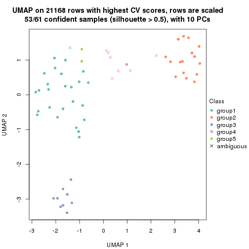</p>

</div>
<div id='tab-CV-kmeans-dimension-reduction-5'>
<pre><code class="r">dimension_reduction(res, k = 6, method = &quot;UMAP&quot;)
</code></pre>

<p></p>

</div>
</div>


Following heatmap shows how subgroups are split when increasing `k`:

```r
collect_classes(res)
```


Test correlation between subgroups and known annotations. If the known
annotation is numeric, one-way ANOVA test is applied, and if the known
annotation is discrete, chi-squared contingency table test is applied.

```r
test_to_known_factors(res)
```

```
#>            n disease.state(p) k
#> CV:kmeans 48         3.33e-11 2
#> CV:kmeans 60         1.88e-21 3
#> CV:kmeans 59         1.37e-21 4
#> CV:kmeans 53         2.52e-19 5
#> CV:kmeans 48         3.43e-16 6
```


If matrix rows can be associated to genes, consider to use `GO_Enrichment(res,
...)` to perform function enrichment for the signature genes.


 

---------------------------------------------------


### CV:skmeans*


The object with results only for a single top-value method and a single partition method 
can be extracted as:

```r
res = res_list["CV", "skmeans"]
# you can also extract it by
# res = res_list["CV:skmeans"]
```

A summary of `res` and all the functions that can be applied to it:

```r
res
```

```
#> A 'ConsensusPartition' object with k = 2, 3, 4, 5, 6.
#>   On a matrix with 21168 rows and 61 columns.
#>   Top rows (1000, 2000, 3000, 4000, 5000) are extracted by 'CV' method.
#>   Subgroups are detected by 'skmeans' method.
#>   Performed in total 1250 partitions by row resampling.
#>   Best k for subgroups seems to be 3.
#> 
#> Following methods can be applied to this 'ConsensusPartition' object:
#>  [1] "cola_report"             "collect_classes"         "collect_plots"          
#>  [4] "collect_stats"           "colnames"                "compare_signatures"     
#>  [7] "consensus_heatmap"       "dimension_reduction"     "functional_enrichment"  
#> [10] "get_anno_col"            "get_anno"                "get_classes"            
#> [13] "get_consensus"           "get_matrix"              "get_membership"         
#> [16] "get_param"               "get_signatures"          "get_stats"              
#> [19] "is_best_k"               "is_stable_k"             "membership_heatmap"     
#> [22] "ncol"                    "nrow"                    "plot_ecdf"              
#> [25] "rownames"                "select_partition_number" "show"                   
#> [28] "suggest_best_k"          "test_to_known_factors"
```

`collect_plots()` function collects all the plots made from `res` for all `k` (number of partitions)
into one single page to provide an easy and fast comparison between different `k`.

```r
collect_plots(res)
```


The plots are:

- The first row: a plot of the ECDF (Empirical cumulative distribution
  function) curves of the consensus matrix for each `k` and the heatmap of
  predicted classes for each `k`.
- The second row: heatmaps of the consensus matrix for each `k`.
- The third row: heatmaps of the membership matrix for each `k`.
- The fouth row: heatmaps of the signatures for each `k`.

All the plots in panels can be made by individual functions and they are
plotted later in this section.

`select_partition_number()` produces several plots showing different
statistics for choosing "optimized" `k`. There are following statistics:

- ECDF curves of the consensus matrix for each `k`;
- 1-PAC. [The PAC
  score](https://en.wikipedia.org/wiki/Consensus_clustering#Over-interpretation_potential_of_consensus_clustering)
  measures the proportion of the ambiguous subgrouping.
- Mean silhouette score.
- Concordance. The mean probability of fiting the consensus class ids in all
  partitions.
- Area increased. Denote $A_k$ as the area under the ECDF curve for current
  `k`, the area increased is defined as $A_k - A_{k-1}$.
- Rand index. The percent of pairs of samples that are both in a same cluster
  or both are not in a same cluster in the partition of k and k-1.
- Jaccard index. The ratio of pairs of samples are both in a same cluster in
  the partition of k and k-1 and the pairs of samples are both in a same
  cluster in the partition k or k-1.

The detailed explanations of these statistics can be found in [the cola
vignette](http://bioconductor.org/packages/devel/bioc/vignettes/cola/inst/doc/cola.html#toc_13).

Generally speaking, lower PAC score, higher mean silhouette score or higher
concordance corresponds to better partition. Rand index and Jaccard index
measure how similar the current partition is compared to partition with `k-1`.
If they are too similar, we won't accept `k` is better than `k-1`.

```r
select_partition_number(res)
```


The numeric values for all these statistics can be obtained by `get_stats()`.

```r
get_stats(res)
```

```
#>   k 1-PAC mean_silhouette concordance area_increased  Rand Jaccard
#> 2 2 1.000           0.988       0.995         0.4961 0.503   0.503
#> 3 3 0.924           0.939       0.968         0.3588 0.711   0.483
#> 4 4 0.754           0.812       0.911         0.1074 0.797   0.480
#> 5 5 0.744           0.612       0.802         0.0677 0.877   0.574
#> 6 6 0.776           0.579       0.777         0.0353 0.949   0.761
```

`suggest_best_k()` suggests the best $k$ based on these statistics. The rules are as follows:

- All $k$ with Jaccard index larger than 0.95 are removed because the increase of
  the partition number does not provides enough extra information. If all $k$ are removed,
  the best $k$ is assigned by `NA`.
- For $k$ with 1-PAC larger than 0.9, the maximal $k$ is taken as the "best k". Other $k$ is called "optional k".
- If it does not fit the second rule. The $k$ with the highest vote of highest
  1-PAC, mean silhouette and concordance is taken as the "best k".

```r
suggest_best_k(res)
```

```
#> [1] 3
#> attr(,"optional")
#> [1] 2
```

There is also optional best $k$ = 2 that is worth to check.

Following shows the table of the partitions (You need to click the **show/hide
code output** link to see it). The membership matrix (columns with name `p*`)
is inferred by
[`clue::cl_consensus()`](https://www.rdocumentation.org/link/cl_consensus?package=clue)
function with the `SE` method. Basically the value in the membership matrix
represents the probability to belong to a certain group. The finall class
label for an item is determined with the group with highest probability it
belongs to.

In `get_classes()` function, the entropy is calculated from the membership
matrix and the silhouette score is calculated from the consensus matrix.


<script>
$( function() {
	$( '#tabs-CV-skmeans-get-classes' ).tabs();
} );
</script>
<div id='tabs-CV-skmeans-get-classes'>
<ul>
<li><a href='#tab-CV-skmeans-get-classes-1'>k = 2</a></li>
<li><a href='#tab-CV-skmeans-get-classes-2'>k = 3</a></li>
<li><a href='#tab-CV-skmeans-get-classes-3'>k = 4</a></li>
<li><a href='#tab-CV-skmeans-get-classes-4'>k = 5</a></li>
<li><a href='#tab-CV-skmeans-get-classes-5'>k = 6</a></li>
</ul>

<div id='tab-CV-skmeans-get-classes-1'>
<p><a id='tab-CV-skmeans-get-classes-1-a' style='color:#0366d6' href='#'>show/hide code output</a></p>
<pre><code class="r">cbind(get_classes(res, k = 2), get_membership(res, k = 2))
</code></pre>

<pre><code>#&gt;           class entropy silhouette    p1    p2
#&gt; GSM246087     1   0.000      1.000 1.000 0.000
#&gt; GSM246088     1   0.000      1.000 1.000 0.000
#&gt; GSM246089     1   0.000      1.000 1.000 0.000
#&gt; GSM246090     1   0.000      1.000 1.000 0.000
#&gt; GSM246119     1   0.000      1.000 1.000 0.000
#&gt; GSM246120     1   0.000      1.000 1.000 0.000
#&gt; GSM246121     1   0.000      1.000 1.000 0.000
#&gt; GSM246122     1   0.000      1.000 1.000 0.000
#&gt; GSM246123     1   0.000      1.000 1.000 0.000
#&gt; GSM246422     2   0.000      0.988 0.000 1.000
#&gt; GSM246423     2   0.000      0.988 0.000 1.000
#&gt; GSM246484     2   0.000      0.988 0.000 1.000
#&gt; GSM246485     2   0.000      0.988 0.000 1.000
#&gt; GSM246486     2   0.000      0.988 0.000 1.000
#&gt; GSM246487     2   0.000      0.988 0.000 1.000
#&gt; GSM246488     2   0.000      0.988 0.000 1.000
#&gt; GSM246489     2   0.000      0.988 0.000 1.000
#&gt; GSM246490     2   0.000      0.988 0.000 1.000
#&gt; GSM246491     2   0.000      0.988 0.000 1.000
#&gt; GSM247162     2   0.000      0.988 0.000 1.000
#&gt; GSM247163     2   0.000      0.988 0.000 1.000
#&gt; GSM247164     2   0.000      0.988 0.000 1.000
#&gt; GSM247165     2   0.000      0.988 0.000 1.000
#&gt; GSM247166     2   0.000      0.988 0.000 1.000
#&gt; GSM247168     2   0.000      0.988 0.000 1.000
#&gt; GSM247169     2   0.000      0.988 0.000 1.000
#&gt; GSM247171     2   0.000      0.988 0.000 1.000
#&gt; GSM247173     2   0.000      0.988 0.000 1.000
#&gt; GSM247174     2   0.000      0.988 0.000 1.000
#&gt; GSM247175     2   0.000      0.988 0.000 1.000
#&gt; GSM247188     2   0.000      0.988 0.000 1.000
#&gt; GSM247189     2   0.000      0.988 0.000 1.000
#&gt; GSM247190     2   0.000      0.988 0.000 1.000
#&gt; GSM247650     1   0.000      1.000 1.000 0.000
#&gt; GSM247651     1   0.000      1.000 1.000 0.000
#&gt; GSM247652     1   0.000      1.000 1.000 0.000
#&gt; GSM247653     1   0.000      1.000 1.000 0.000
#&gt; GSM247654     1   0.000      1.000 1.000 0.000
#&gt; GSM247655     1   0.000      1.000 1.000 0.000
#&gt; GSM247656     1   0.000      1.000 1.000 0.000
#&gt; GSM247657     1   0.000      1.000 1.000 0.000
#&gt; GSM247658     1   0.000      1.000 1.000 0.000
#&gt; GSM247659     1   0.000      1.000 1.000 0.000
#&gt; GSM247660     1   0.000      1.000 1.000 0.000
#&gt; GSM247661     1   0.000      1.000 1.000 0.000
#&gt; GSM247662     1   0.000      1.000 1.000 0.000
#&gt; GSM247663     1   0.000      1.000 1.000 0.000
#&gt; GSM247856     1   0.000      1.000 1.000 0.000
#&gt; GSM247857     1   0.000      1.000 1.000 0.000
#&gt; GSM247859     1   0.000      1.000 1.000 0.000
#&gt; GSM247860     1   0.000      1.000 1.000 0.000
#&gt; GSM247862     1   0.000      1.000 1.000 0.000
#&gt; GSM247864     1   0.000      1.000 1.000 0.000
#&gt; GSM247865     2   0.000      0.988 0.000 1.000
#&gt; GSM247866     1   0.000      1.000 1.000 0.000
#&gt; GSM247876     1   0.000      1.000 1.000 0.000
#&gt; GSM247877     1   0.000      1.000 1.000 0.000
#&gt; GSM247878     1   0.000      1.000 1.000 0.000
#&gt; GSM247879     1   0.000      1.000 1.000 0.000
#&gt; GSM247881     1   0.000      1.000 1.000 0.000
#&gt; GSM247883     2   0.886      0.563 0.304 0.696
</code></pre>

<script>
$('#tab-CV-skmeans-get-classes-1-a').parent().next().next().hide();
$('#tab-CV-skmeans-get-classes-1-a').click(function(){
  $('#tab-CV-skmeans-get-classes-1-a').parent().next().next().toggle();
  return(false);
});
</script>
</div>

<div id='tab-CV-skmeans-get-classes-2'>
<p><a id='tab-CV-skmeans-get-classes-2-a' style='color:#0366d6' href='#'>show/hide code output</a></p>
<pre><code class="r">cbind(get_classes(res, k = 3), get_membership(res, k = 3))
</code></pre>

<pre><code>#&gt;           class entropy silhouette    p1    p2    p3
#&gt; GSM246087     3  0.0000      0.957 0.000 0.000 1.000
#&gt; GSM246088     3  0.0000      0.957 0.000 0.000 1.000
#&gt; GSM246089     3  0.0000      0.957 0.000 0.000 1.000
#&gt; GSM246090     3  0.0000      0.957 0.000 0.000 1.000
#&gt; GSM246119     3  0.0000      0.957 0.000 0.000 1.000
#&gt; GSM246120     3  0.0000      0.957 0.000 0.000 1.000
#&gt; GSM246121     3  0.0000      0.957 0.000 0.000 1.000
#&gt; GSM246122     3  0.0000      0.957 0.000 0.000 1.000
#&gt; GSM246123     3  0.0000      0.957 0.000 0.000 1.000
#&gt; GSM246422     1  0.0892      0.935 0.980 0.020 0.000
#&gt; GSM246423     1  0.0892      0.935 0.980 0.020 0.000
#&gt; GSM246484     1  0.0892      0.935 0.980 0.020 0.000
#&gt; GSM246485     2  0.0237      0.993 0.004 0.996 0.000
#&gt; GSM246486     2  0.0592      0.986 0.012 0.988 0.000
#&gt; GSM246487     1  0.2356      0.896 0.928 0.072 0.000
#&gt; GSM246488     2  0.2066      0.938 0.060 0.940 0.000
#&gt; GSM246489     2  0.0000      0.996 0.000 1.000 0.000
#&gt; GSM246490     2  0.0000      0.996 0.000 1.000 0.000
#&gt; GSM246491     2  0.0000      0.996 0.000 1.000 0.000
#&gt; GSM247162     2  0.0000      0.996 0.000 1.000 0.000
#&gt; GSM247163     2  0.0000      0.996 0.000 1.000 0.000
#&gt; GSM247164     2  0.0000      0.996 0.000 1.000 0.000
#&gt; GSM247165     2  0.0000      0.996 0.000 1.000 0.000
#&gt; GSM247166     2  0.0000      0.996 0.000 1.000 0.000
#&gt; GSM247168     2  0.0000      0.996 0.000 1.000 0.000
#&gt; GSM247169     2  0.0000      0.996 0.000 1.000 0.000
#&gt; GSM247171     2  0.0000      0.996 0.000 1.000 0.000
#&gt; GSM247173     2  0.0000      0.996 0.000 1.000 0.000
#&gt; GSM247174     2  0.0000      0.996 0.000 1.000 0.000
#&gt; GSM247175     2  0.0000      0.996 0.000 1.000 0.000
#&gt; GSM247188     2  0.0000      0.996 0.000 1.000 0.000
#&gt; GSM247189     2  0.0000      0.996 0.000 1.000 0.000
#&gt; GSM247190     2  0.0000      0.996 0.000 1.000 0.000
#&gt; GSM247650     1  0.2066      0.917 0.940 0.000 0.060
#&gt; GSM247651     1  0.0000      0.943 1.000 0.000 0.000
#&gt; GSM247652     1  0.3412      0.858 0.876 0.000 0.124
#&gt; GSM247653     3  0.1031      0.951 0.024 0.000 0.976
#&gt; GSM247654     3  0.4178      0.816 0.172 0.000 0.828
#&gt; GSM247655     1  0.0000      0.943 1.000 0.000 0.000
#&gt; GSM247656     3  0.1411      0.945 0.036 0.000 0.964
#&gt; GSM247657     3  0.3192      0.885 0.112 0.000 0.888
#&gt; GSM247658     1  0.2066      0.916 0.940 0.000 0.060
#&gt; GSM247659     3  0.0000      0.957 0.000 0.000 1.000
#&gt; GSM247660     1  0.0000      0.943 1.000 0.000 0.000
#&gt; GSM247661     3  0.0892      0.951 0.020 0.000 0.980
#&gt; GSM247662     3  0.2066      0.931 0.060 0.000 0.940
#&gt; GSM247663     1  0.2165      0.913 0.936 0.000 0.064
#&gt; GSM247856     1  0.5178      0.668 0.744 0.000 0.256
#&gt; GSM247857     3  0.5098      0.703 0.248 0.000 0.752
#&gt; GSM247859     1  0.0000      0.943 1.000 0.000 0.000
#&gt; GSM247860     3  0.1964      0.933 0.056 0.000 0.944
#&gt; GSM247862     1  0.0000      0.943 1.000 0.000 0.000
#&gt; GSM247864     1  0.0000      0.943 1.000 0.000 0.000
#&gt; GSM247865     1  0.0000      0.943 1.000 0.000 0.000
#&gt; GSM247866     1  0.0000      0.943 1.000 0.000 0.000
#&gt; GSM247876     1  0.2796      0.893 0.908 0.000 0.092
#&gt; GSM247877     1  0.2796      0.891 0.908 0.000 0.092
#&gt; GSM247878     1  0.0000      0.943 1.000 0.000 0.000
#&gt; GSM247879     1  0.5529      0.617 0.704 0.000 0.296
#&gt; GSM247881     1  0.0000      0.943 1.000 0.000 0.000
#&gt; GSM247883     1  0.0000      0.943 1.000 0.000 0.000
</code></pre>

<script>
$('#tab-CV-skmeans-get-classes-2-a').parent().next().next().hide();
$('#tab-CV-skmeans-get-classes-2-a').click(function(){
  $('#tab-CV-skmeans-get-classes-2-a').parent().next().next().toggle();
  return(false);
});
</script>
</div>

<div id='tab-CV-skmeans-get-classes-3'>
<p><a id='tab-CV-skmeans-get-classes-3-a' style='color:#0366d6' href='#'>show/hide code output</a></p>
<pre><code class="r">cbind(get_classes(res, k = 4), get_membership(res, k = 4))
</code></pre>

<pre><code>#&gt;           class entropy silhouette    p1    p2    p3    p4
#&gt; GSM246087     3  0.0000     0.9037 0.000 0.000 1.000 0.000
#&gt; GSM246088     3  0.0000     0.9037 0.000 0.000 1.000 0.000
#&gt; GSM246089     3  0.0000     0.9037 0.000 0.000 1.000 0.000
#&gt; GSM246090     3  0.0000     0.9037 0.000 0.000 1.000 0.000
#&gt; GSM246119     3  0.0000     0.9037 0.000 0.000 1.000 0.000
#&gt; GSM246120     3  0.0000     0.9037 0.000 0.000 1.000 0.000
#&gt; GSM246121     3  0.0000     0.9037 0.000 0.000 1.000 0.000
#&gt; GSM246122     3  0.0000     0.9037 0.000 0.000 1.000 0.000
#&gt; GSM246123     3  0.0000     0.9037 0.000 0.000 1.000 0.000
#&gt; GSM246422     4  0.0000     0.8501 0.000 0.000 0.000 1.000
#&gt; GSM246423     4  0.0000     0.8501 0.000 0.000 0.000 1.000
#&gt; GSM246484     4  0.0000     0.8501 0.000 0.000 0.000 1.000
#&gt; GSM246485     2  0.4999     0.0941 0.000 0.508 0.000 0.492
#&gt; GSM246486     4  0.2868     0.7549 0.000 0.136 0.000 0.864
#&gt; GSM246487     4  0.0469     0.8473 0.000 0.012 0.000 0.988
#&gt; GSM246488     4  0.1389     0.8286 0.000 0.048 0.000 0.952
#&gt; GSM246489     2  0.0000     0.9542 0.000 1.000 0.000 0.000
#&gt; GSM246490     2  0.0000     0.9542 0.000 1.000 0.000 0.000
#&gt; GSM246491     2  0.0000     0.9542 0.000 1.000 0.000 0.000
#&gt; GSM247162     2  0.0000     0.9542 0.000 1.000 0.000 0.000
#&gt; GSM247163     2  0.0000     0.9542 0.000 1.000 0.000 0.000
#&gt; GSM247164     2  0.0000     0.9542 0.000 1.000 0.000 0.000
#&gt; GSM247165     2  0.0000     0.9542 0.000 1.000 0.000 0.000
#&gt; GSM247166     2  0.0000     0.9542 0.000 1.000 0.000 0.000
#&gt; GSM247168     2  0.0000     0.9542 0.000 1.000 0.000 0.000
#&gt; GSM247169     2  0.0000     0.9542 0.000 1.000 0.000 0.000
#&gt; GSM247171     2  0.0000     0.9542 0.000 1.000 0.000 0.000
#&gt; GSM247173     2  0.0000     0.9542 0.000 1.000 0.000 0.000
#&gt; GSM247174     2  0.0000     0.9542 0.000 1.000 0.000 0.000
#&gt; GSM247175     2  0.0000     0.9542 0.000 1.000 0.000 0.000
#&gt; GSM247188     2  0.0000     0.9542 0.000 1.000 0.000 0.000
#&gt; GSM247189     2  0.4193     0.6417 0.000 0.732 0.000 0.268
#&gt; GSM247190     2  0.0000     0.9542 0.000 1.000 0.000 0.000
#&gt; GSM247650     1  0.1767     0.8582 0.944 0.000 0.012 0.044
#&gt; GSM247651     4  0.4500     0.5659 0.316 0.000 0.000 0.684
#&gt; GSM247652     1  0.0336     0.8608 0.992 0.000 0.008 0.000
#&gt; GSM247653     1  0.3024     0.7970 0.852 0.000 0.148 0.000
#&gt; GSM247654     1  0.1940     0.8489 0.924 0.000 0.076 0.000
#&gt; GSM247655     1  0.3649     0.7327 0.796 0.000 0.000 0.204
#&gt; GSM247656     3  0.4961     0.1215 0.448 0.000 0.552 0.000
#&gt; GSM247657     1  0.1792     0.8514 0.932 0.000 0.068 0.000
#&gt; GSM247658     1  0.0188     0.8604 0.996 0.000 0.004 0.000
#&gt; GSM247659     3  0.2408     0.8264 0.104 0.000 0.896 0.000
#&gt; GSM247660     4  0.4564     0.5355 0.328 0.000 0.000 0.672
#&gt; GSM247661     1  0.3400     0.7643 0.820 0.000 0.180 0.000
#&gt; GSM247662     1  0.3978     0.7621 0.796 0.000 0.192 0.012
#&gt; GSM247663     1  0.0524     0.8615 0.988 0.000 0.004 0.008
#&gt; GSM247856     1  0.2342     0.8549 0.912 0.000 0.080 0.008
#&gt; GSM247857     1  0.1305     0.8639 0.960 0.000 0.036 0.004
#&gt; GSM247859     1  0.4989     0.0698 0.528 0.000 0.000 0.472
#&gt; GSM247860     1  0.2011     0.8503 0.920 0.000 0.080 0.000
#&gt; GSM247862     1  0.0592     0.8603 0.984 0.000 0.000 0.016
#&gt; GSM247864     1  0.3074     0.7869 0.848 0.000 0.000 0.152
#&gt; GSM247865     4  0.3074     0.7789 0.152 0.000 0.000 0.848
#&gt; GSM247866     1  0.1389     0.8566 0.952 0.000 0.000 0.048
#&gt; GSM247876     1  0.4953     0.7459 0.776 0.000 0.104 0.120
#&gt; GSM247877     4  0.3850     0.7752 0.044 0.000 0.116 0.840
#&gt; GSM247878     4  0.2868     0.7995 0.136 0.000 0.000 0.864
#&gt; GSM247879     3  0.6883     0.4302 0.212 0.000 0.596 0.192
#&gt; GSM247881     1  0.1792     0.8483 0.932 0.000 0.000 0.068
#&gt; GSM247883     1  0.4193     0.6324 0.732 0.000 0.000 0.268
</code></pre>

<script>
$('#tab-CV-skmeans-get-classes-3-a').parent().next().next().hide();
$('#tab-CV-skmeans-get-classes-3-a').click(function(){
  $('#tab-CV-skmeans-get-classes-3-a').parent().next().next().toggle();
  return(false);
});
</script>
</div>

<div id='tab-CV-skmeans-get-classes-4'>
<p><a id='tab-CV-skmeans-get-classes-4-a' style='color:#0366d6' href='#'>show/hide code output</a></p>
<pre><code class="r">cbind(get_classes(res, k = 5), get_membership(res, k = 5))
</code></pre>

<pre><code>#&gt;           class entropy silhouette    p1    p2    p3    p4    p5
#&gt; GSM246087     3  0.0000    0.96575 0.000 0.000 1.000 0.000 0.000
#&gt; GSM246088     3  0.0000    0.96575 0.000 0.000 1.000 0.000 0.000
#&gt; GSM246089     3  0.0000    0.96575 0.000 0.000 1.000 0.000 0.000
#&gt; GSM246090     3  0.0000    0.96575 0.000 0.000 1.000 0.000 0.000
#&gt; GSM246119     3  0.0000    0.96575 0.000 0.000 1.000 0.000 0.000
#&gt; GSM246120     3  0.0000    0.96575 0.000 0.000 1.000 0.000 0.000
#&gt; GSM246121     3  0.0000    0.96575 0.000 0.000 1.000 0.000 0.000
#&gt; GSM246122     3  0.0000    0.96575 0.000 0.000 1.000 0.000 0.000
#&gt; GSM246123     3  0.0000    0.96575 0.000 0.000 1.000 0.000 0.000
#&gt; GSM246422     4  0.0510    0.74835 0.016 0.000 0.000 0.984 0.000
#&gt; GSM246423     4  0.0510    0.74835 0.016 0.000 0.000 0.984 0.000
#&gt; GSM246484     4  0.0510    0.74835 0.016 0.000 0.000 0.984 0.000
#&gt; GSM246485     4  0.4919    0.36076 0.016 0.368 0.000 0.604 0.012
#&gt; GSM246486     4  0.2997    0.64947 0.012 0.148 0.000 0.840 0.000
#&gt; GSM246487     4  0.1043    0.73691 0.040 0.000 0.000 0.960 0.000
#&gt; GSM246488     4  0.0671    0.74536 0.004 0.016 0.000 0.980 0.000
#&gt; GSM246489     2  0.0000    0.96960 0.000 1.000 0.000 0.000 0.000
#&gt; GSM246490     2  0.0451    0.96709 0.004 0.988 0.000 0.008 0.000
#&gt; GSM246491     2  0.0451    0.96730 0.008 0.988 0.000 0.004 0.000
#&gt; GSM247162     2  0.0000    0.96960 0.000 1.000 0.000 0.000 0.000
#&gt; GSM247163     2  0.0579    0.96407 0.008 0.984 0.000 0.008 0.000
#&gt; GSM247164     2  0.0579    0.96407 0.008 0.984 0.000 0.008 0.000
#&gt; GSM247165     2  0.0992    0.95122 0.008 0.968 0.000 0.024 0.000
#&gt; GSM247166     2  0.0162    0.96860 0.000 0.996 0.000 0.004 0.000
#&gt; GSM247168     2  0.0162    0.96860 0.000 0.996 0.000 0.004 0.000
#&gt; GSM247169     2  0.0162    0.96860 0.000 0.996 0.000 0.004 0.000
#&gt; GSM247171     2  0.0162    0.96896 0.004 0.996 0.000 0.000 0.000
#&gt; GSM247173     2  0.0000    0.96960 0.000 1.000 0.000 0.000 0.000
#&gt; GSM247174     2  0.0000    0.96960 0.000 1.000 0.000 0.000 0.000
#&gt; GSM247175     2  0.0162    0.96896 0.004 0.996 0.000 0.000 0.000
#&gt; GSM247188     2  0.0000    0.96960 0.000 1.000 0.000 0.000 0.000
#&gt; GSM247189     2  0.4478    0.39518 0.008 0.628 0.000 0.360 0.004
#&gt; GSM247190     2  0.0000    0.96960 0.000 1.000 0.000 0.000 0.000
#&gt; GSM247650     1  0.3631    0.36484 0.788 0.000 0.008 0.008 0.196
#&gt; GSM247651     1  0.5153    0.17878 0.524 0.000 0.000 0.436 0.040
#&gt; GSM247652     5  0.4138    0.36306 0.384 0.000 0.000 0.000 0.616
#&gt; GSM247653     5  0.2221    0.55233 0.052 0.000 0.036 0.000 0.912
#&gt; GSM247654     5  0.2843    0.55355 0.144 0.000 0.008 0.000 0.848
#&gt; GSM247655     1  0.4509    0.42791 0.752 0.000 0.000 0.096 0.152
#&gt; GSM247656     5  0.6424    0.22198 0.176 0.000 0.380 0.000 0.444
#&gt; GSM247657     5  0.3582    0.48300 0.224 0.000 0.008 0.000 0.768
#&gt; GSM247658     5  0.3913    0.45847 0.324 0.000 0.000 0.000 0.676
#&gt; GSM247659     3  0.4964    0.58611 0.096 0.000 0.700 0.000 0.204
#&gt; GSM247660     1  0.5394    0.28286 0.540 0.000 0.000 0.400 0.060
#&gt; GSM247661     5  0.3593    0.52269 0.088 0.000 0.084 0.000 0.828
#&gt; GSM247662     1  0.6299   -0.00702 0.504 0.000 0.144 0.004 0.348
#&gt; GSM247663     1  0.4327    0.12764 0.632 0.000 0.000 0.008 0.360
#&gt; GSM247856     5  0.5457    0.21413 0.460 0.000 0.060 0.000 0.480
#&gt; GSM247857     1  0.5116   -0.05621 0.508 0.000 0.028 0.004 0.460
#&gt; GSM247859     1  0.6442    0.29914 0.504 0.000 0.000 0.252 0.244
#&gt; GSM247860     5  0.3085    0.51912 0.116 0.000 0.032 0.000 0.852
#&gt; GSM247862     1  0.4830   -0.02522 0.492 0.000 0.000 0.020 0.488
#&gt; GSM247864     1  0.3966    0.43844 0.796 0.000 0.000 0.072 0.132
#&gt; GSM247865     4  0.5323    0.27588 0.296 0.000 0.000 0.624 0.080
#&gt; GSM247866     5  0.4522    0.06789 0.440 0.000 0.000 0.008 0.552
#&gt; GSM247876     1  0.5674    0.29685 0.640 0.000 0.036 0.052 0.272
#&gt; GSM247877     4  0.6135   -0.03362 0.444 0.000 0.032 0.468 0.056
#&gt; GSM247878     1  0.4803    0.05279 0.536 0.000 0.000 0.444 0.020
#&gt; GSM247879     1  0.7540    0.23694 0.512 0.000 0.216 0.116 0.156
#&gt; GSM247881     1  0.4080    0.32064 0.728 0.000 0.000 0.020 0.252
#&gt; GSM247883     1  0.5357    0.30309 0.640 0.000 0.000 0.096 0.264
</code></pre>

<script>
$('#tab-CV-skmeans-get-classes-4-a').parent().next().next().hide();
$('#tab-CV-skmeans-get-classes-4-a').click(function(){
  $('#tab-CV-skmeans-get-classes-4-a').parent().next().next().toggle();
  return(false);
});
</script>
</div>

<div id='tab-CV-skmeans-get-classes-5'>
<p><a id='tab-CV-skmeans-get-classes-5-a' style='color:#0366d6' href='#'>show/hide code output</a></p>
<pre><code class="r">cbind(get_classes(res, k = 6), get_membership(res, k = 6))
</code></pre>

<pre><code>#&gt;           class entropy silhouette    p1    p2    p3    p4    p5    p6
#&gt; GSM246087     3  0.0146     0.9469 0.000 0.000 0.996 0.000 0.000 0.004
#&gt; GSM246088     3  0.0146     0.9469 0.000 0.000 0.996 0.000 0.000 0.004
#&gt; GSM246089     3  0.0000     0.9474 0.000 0.000 1.000 0.000 0.000 0.000
#&gt; GSM246090     3  0.0146     0.9469 0.000 0.000 0.996 0.000 0.000 0.004
#&gt; GSM246119     3  0.0000     0.9474 0.000 0.000 1.000 0.000 0.000 0.000
#&gt; GSM246120     3  0.0000     0.9474 0.000 0.000 1.000 0.000 0.000 0.000
#&gt; GSM246121     3  0.0000     0.9474 0.000 0.000 1.000 0.000 0.000 0.000
#&gt; GSM246122     3  0.0146     0.9469 0.000 0.000 0.996 0.000 0.000 0.004
#&gt; GSM246123     3  0.0000     0.9474 0.000 0.000 1.000 0.000 0.000 0.000
#&gt; GSM246422     4  0.1074     0.7956 0.012 0.000 0.000 0.960 0.028 0.000
#&gt; GSM246423     4  0.1074     0.7956 0.012 0.000 0.000 0.960 0.028 0.000
#&gt; GSM246484     4  0.1074     0.7956 0.012 0.000 0.000 0.960 0.028 0.000
#&gt; GSM246485     4  0.4899     0.4637 0.016 0.252 0.000 0.676 0.032 0.024
#&gt; GSM246486     4  0.2214     0.7254 0.004 0.092 0.000 0.892 0.012 0.000
#&gt; GSM246487     4  0.1477     0.7761 0.048 0.004 0.000 0.940 0.008 0.000
#&gt; GSM246488     4  0.0405     0.7905 0.000 0.004 0.000 0.988 0.008 0.000
#&gt; GSM246489     2  0.0291     0.9466 0.000 0.992 0.000 0.004 0.004 0.000
#&gt; GSM246490     2  0.0767     0.9446 0.004 0.976 0.000 0.008 0.012 0.000
#&gt; GSM246491     2  0.0603     0.9459 0.000 0.980 0.000 0.004 0.016 0.000
#&gt; GSM247162     2  0.0508     0.9471 0.000 0.984 0.000 0.004 0.012 0.000
#&gt; GSM247163     2  0.1346     0.9379 0.008 0.952 0.000 0.016 0.024 0.000
#&gt; GSM247164     2  0.1078     0.9391 0.008 0.964 0.000 0.016 0.012 0.000
#&gt; GSM247165     2  0.1913     0.9058 0.004 0.920 0.000 0.060 0.012 0.004
#&gt; GSM247166     2  0.1268     0.9359 0.000 0.952 0.000 0.004 0.036 0.008
#&gt; GSM247168     2  0.1124     0.9371 0.000 0.956 0.000 0.000 0.036 0.008
#&gt; GSM247169     2  0.1124     0.9371 0.000 0.956 0.000 0.000 0.036 0.008
#&gt; GSM247171     2  0.0436     0.9465 0.004 0.988 0.000 0.004 0.004 0.000
#&gt; GSM247173     2  0.0665     0.9457 0.004 0.980 0.000 0.008 0.008 0.000
#&gt; GSM247174     2  0.0777     0.9418 0.000 0.972 0.000 0.000 0.024 0.004
#&gt; GSM247175     2  0.0000     0.9467 0.000 1.000 0.000 0.000 0.000 0.000
#&gt; GSM247188     2  0.0363     0.9456 0.000 0.988 0.000 0.000 0.012 0.000
#&gt; GSM247189     2  0.5266     0.0617 0.004 0.492 0.000 0.420 0.084 0.000
#&gt; GSM247190     2  0.0000     0.9467 0.000 1.000 0.000 0.000 0.000 0.000
#&gt; GSM247650     1  0.5592     0.1328 0.536 0.000 0.012 0.004 0.352 0.096
#&gt; GSM247651     1  0.6550    -0.0250 0.372 0.000 0.000 0.348 0.256 0.024
#&gt; GSM247652     1  0.4704    -0.1858 0.488 0.000 0.000 0.000 0.044 0.468
#&gt; GSM247653     6  0.3455     0.5193 0.052 0.000 0.036 0.000 0.076 0.836
#&gt; GSM247654     6  0.4263     0.3981 0.276 0.000 0.008 0.000 0.032 0.684
#&gt; GSM247655     1  0.4892     0.3345 0.720 0.000 0.000 0.056 0.148 0.076
#&gt; GSM247656     6  0.7042     0.1703 0.280 0.000 0.256 0.000 0.072 0.392
#&gt; GSM247657     6  0.4917     0.3431 0.300 0.000 0.016 0.000 0.056 0.628
#&gt; GSM247658     6  0.4694     0.2071 0.376 0.000 0.000 0.000 0.052 0.572
#&gt; GSM247659     3  0.6526     0.2980 0.100 0.000 0.544 0.000 0.144 0.212
#&gt; GSM247660     1  0.6813     0.0794 0.424 0.000 0.000 0.296 0.224 0.056
#&gt; GSM247661     6  0.4201     0.4767 0.084 0.000 0.048 0.000 0.084 0.784
#&gt; GSM247662     1  0.6893     0.0609 0.464 0.000 0.100 0.000 0.160 0.276
#&gt; GSM247663     5  0.6240    -0.1069 0.368 0.000 0.004 0.004 0.392 0.232
#&gt; GSM247856     1  0.5999    -0.0138 0.504 0.000 0.052 0.000 0.084 0.360
#&gt; GSM247857     1  0.6267     0.0330 0.464 0.000 0.028 0.000 0.168 0.340
#&gt; GSM247859     1  0.6376     0.2865 0.576 0.000 0.000 0.160 0.112 0.152
#&gt; GSM247860     6  0.4060     0.4801 0.060 0.000 0.016 0.000 0.156 0.768
#&gt; GSM247862     1  0.6095     0.0800 0.432 0.000 0.000 0.012 0.180 0.376
#&gt; GSM247864     1  0.5517     0.2283 0.612 0.000 0.000 0.048 0.268 0.072
#&gt; GSM247865     4  0.6219     0.0294 0.360 0.000 0.000 0.480 0.108 0.052
#&gt; GSM247866     6  0.6182     0.0125 0.264 0.000 0.000 0.004 0.340 0.392
#&gt; GSM247876     5  0.4648     0.4813 0.148 0.000 0.012 0.016 0.740 0.084
#&gt; GSM247877     5  0.4481     0.5229 0.048 0.000 0.008 0.212 0.720 0.012
#&gt; GSM247878     5  0.5454     0.4505 0.160 0.000 0.000 0.232 0.600 0.008
#&gt; GSM247879     5  0.4090     0.5334 0.072 0.000 0.068 0.020 0.808 0.032
#&gt; GSM247881     1  0.4990     0.3203 0.660 0.000 0.000 0.004 0.184 0.152
#&gt; GSM247883     1  0.4824     0.3715 0.736 0.000 0.000 0.072 0.088 0.104
</code></pre>

<script>
$('#tab-CV-skmeans-get-classes-5-a').parent().next().next().hide();
$('#tab-CV-skmeans-get-classes-5-a').click(function(){
  $('#tab-CV-skmeans-get-classes-5-a').parent().next().next().toggle();
  return(false);
});
</script>
</div>
</div>

Heatmaps for the consensus matrix. It visualizes the probability of two
samples to be in a same group.


<script>
$( function() {
	$( '#tabs-CV-skmeans-consensus-heatmap' ).tabs();
} );
</script>
<div id='tabs-CV-skmeans-consensus-heatmap'>
<ul>
<li><a href='#tab-CV-skmeans-consensus-heatmap-1'>k = 2</a></li>
<li><a href='#tab-CV-skmeans-consensus-heatmap-2'>k = 3</a></li>
<li><a href='#tab-CV-skmeans-consensus-heatmap-3'>k = 4</a></li>
<li><a href='#tab-CV-skmeans-consensus-heatmap-4'>k = 5</a></li>
<li><a href='#tab-CV-skmeans-consensus-heatmap-5'>k = 6</a></li>
</ul>
<div id='tab-CV-skmeans-consensus-heatmap-1'>
<pre><code class="r">consensus_heatmap(res, k = 2)
</code></pre>

<p></p>

</div>
<div id='tab-CV-skmeans-consensus-heatmap-2'>
<pre><code class="r">consensus_heatmap(res, k = 3)
</code></pre>

<p></p>

</div>
<div id='tab-CV-skmeans-consensus-heatmap-3'>
<pre><code class="r">consensus_heatmap(res, k = 4)
</code></pre>

<p></p>

</div>
<div id='tab-CV-skmeans-consensus-heatmap-4'>
<pre><code class="r">consensus_heatmap(res, k = 5)
</code></pre>

<p>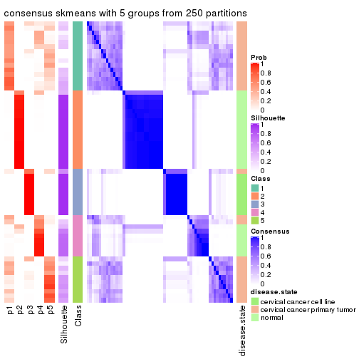</p>

</div>
<div id='tab-CV-skmeans-consensus-heatmap-5'>
<pre><code class="r">consensus_heatmap(res, k = 6)
</code></pre>

<p></p>

</div>
</div>

Heatmaps for the membership of samples in all partitions to see how consistent they are:


<script>
$( function() {
	$( '#tabs-CV-skmeans-membership-heatmap' ).tabs();
} );
</script>
<div id='tabs-CV-skmeans-membership-heatmap'>
<ul>
<li><a href='#tab-CV-skmeans-membership-heatmap-1'>k = 2</a></li>
<li><a href='#tab-CV-skmeans-membership-heatmap-2'>k = 3</a></li>
<li><a href='#tab-CV-skmeans-membership-heatmap-3'>k = 4</a></li>
<li><a href='#tab-CV-skmeans-membership-heatmap-4'>k = 5</a></li>
<li><a href='#tab-CV-skmeans-membership-heatmap-5'>k = 6</a></li>
</ul>
<div id='tab-CV-skmeans-membership-heatmap-1'>
<pre><code class="r">membership_heatmap(res, k = 2)
</code></pre>

<p></p>

</div>
<div id='tab-CV-skmeans-membership-heatmap-2'>
<pre><code class="r">membership_heatmap(res, k = 3)
</code></pre>

<p></p>

</div>
<div id='tab-CV-skmeans-membership-heatmap-3'>
<pre><code class="r">membership_heatmap(res, k = 4)
</code></pre>

<p></p>

</div>
<div id='tab-CV-skmeans-membership-heatmap-4'>
<pre><code class="r">membership_heatmap(res, k = 5)
</code></pre>

<p>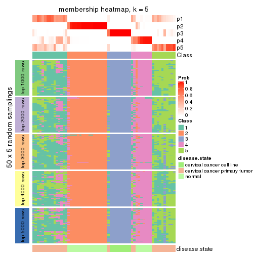</p>

</div>
<div id='tab-CV-skmeans-membership-heatmap-5'>
<pre><code class="r">membership_heatmap(res, k = 6)
</code></pre>

<p></p>

</div>
</div>

As soon as we have had the classes for columns, we can look for signatures
which are significantly different between classes which can be candidate marks
for certain classes. Following are the heatmaps for signatures.


Signature heatmaps where rows are scaled:


<script>
$( function() {
	$( '#tabs-CV-skmeans-get-signatures' ).tabs();
} );
</script>
<div id='tabs-CV-skmeans-get-signatures'>
<ul>
<li><a href='#tab-CV-skmeans-get-signatures-1'>k = 2</a></li>
<li><a href='#tab-CV-skmeans-get-signatures-2'>k = 3</a></li>
<li><a href='#tab-CV-skmeans-get-signatures-3'>k = 4</a></li>
<li><a href='#tab-CV-skmeans-get-signatures-4'>k = 5</a></li>
<li><a href='#tab-CV-skmeans-get-signatures-5'>k = 6</a></li>
</ul>
<div id='tab-CV-skmeans-get-signatures-1'>
<pre><code class="r">get_signatures(res, k = 2)
</code></pre>

<p></p>

</div>
<div id='tab-CV-skmeans-get-signatures-2'>
<pre><code class="r">get_signatures(res, k = 3)
</code></pre>

<p></p>

</div>
<div id='tab-CV-skmeans-get-signatures-3'>
<pre><code class="r">get_signatures(res, k = 4)
</code></pre>

<p></p>

</div>
<div id='tab-CV-skmeans-get-signatures-4'>
<pre><code class="r">get_signatures(res, k = 5)
</code></pre>

<p>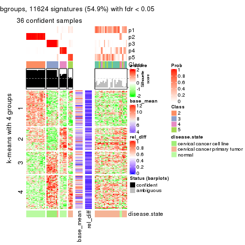</p>

</div>
<div id='tab-CV-skmeans-get-signatures-5'>
<pre><code class="r">get_signatures(res, k = 6)
</code></pre>

<p></p>

</div>
</div>


Signature heatmaps where rows are not scaled:


<script>
$( function() {
	$( '#tabs-CV-skmeans-get-signatures-no-scale' ).tabs();
} );
</script>
<div id='tabs-CV-skmeans-get-signatures-no-scale'>
<ul>
<li><a href='#tab-CV-skmeans-get-signatures-no-scale-1'>k = 2</a></li>
<li><a href='#tab-CV-skmeans-get-signatures-no-scale-2'>k = 3</a></li>
<li><a href='#tab-CV-skmeans-get-signatures-no-scale-3'>k = 4</a></li>
<li><a href='#tab-CV-skmeans-get-signatures-no-scale-4'>k = 5</a></li>
<li><a href='#tab-CV-skmeans-get-signatures-no-scale-5'>k = 6</a></li>
</ul>
<div id='tab-CV-skmeans-get-signatures-no-scale-1'>
<pre><code class="r">get_signatures(res, k = 2, scale_rows = FALSE)
</code></pre>

<p></p>

</div>
<div id='tab-CV-skmeans-get-signatures-no-scale-2'>
<pre><code class="r">get_signatures(res, k = 3, scale_rows = FALSE)
</code></pre>

<p></p>

</div>
<div id='tab-CV-skmeans-get-signatures-no-scale-3'>
<pre><code class="r">get_signatures(res, k = 4, scale_rows = FALSE)
</code></pre>

<p></p>

</div>
<div id='tab-CV-skmeans-get-signatures-no-scale-4'>
<pre><code class="r">get_signatures(res, k = 5, scale_rows = FALSE)
</code></pre>

<p></p>

</div>
<div id='tab-CV-skmeans-get-signatures-no-scale-5'>
<pre><code class="r">get_signatures(res, k = 6, scale_rows = FALSE)
</code></pre>

<p></p>

</div>
</div>


Compare the overlap of signatures from different k:

```r
compare_signatures(res)
```

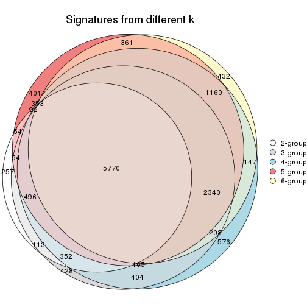

`get_signature()` returns a data frame invisibly. TO get the list of signatures, the function
call should be assigned to a variable explicitly. In following code, if `plot` argument is set
to `FALSE`, no heatmap is plotted while only the differential analysis is performed.

```r
# code only for demonstration
tb = get_signature(res, k = ..., plot = FALSE)
```

An example of the output of `tb` is:

```
#>   which_row         fdr    mean_1    mean_2 scaled_mean_1 scaled_mean_2 km
#> 1        38 0.042760348  8.373488  9.131774    -0.5533452     0.5164555  1
#> 2        40 0.018707592  7.106213  8.469186    -0.6173731     0.5762149  1
#> 3        55 0.019134737 10.221463 11.207825    -0.6159697     0.5749050  1
#> 4        59 0.006059896  5.921854  7.869574    -0.6899429     0.6439467  1
#> 5        60 0.018055526  8.928898 10.211722    -0.6204761     0.5791110  1
#> 6        98 0.009384629 15.714769 14.887706     0.6635654    -0.6193277  2
...
```

The columns in `tb` are:

1. `which_row`: row indices corresponding to the input matrix.
2. `fdr`: FDR for the differential test. 
3. `mean_x`: The mean value in group x.
4. `scaled_mean_x`: The mean value in group x after rows are scaled.
5. `km`: Row groups if k-means clustering is applied to rows.


UMAP plot which shows how samples are separated.


<script>
$( function() {
	$( '#tabs-CV-skmeans-dimension-reduction' ).tabs();
} );
</script>
<div id='tabs-CV-skmeans-dimension-reduction'>
<ul>
<li><a href='#tab-CV-skmeans-dimension-reduction-1'>k = 2</a></li>
<li><a href='#tab-CV-skmeans-dimension-reduction-2'>k = 3</a></li>
<li><a href='#tab-CV-skmeans-dimension-reduction-3'>k = 4</a></li>
<li><a href='#tab-CV-skmeans-dimension-reduction-4'>k = 5</a></li>
<li><a href='#tab-CV-skmeans-dimension-reduction-5'>k = 6</a></li>
</ul>
<div id='tab-CV-skmeans-dimension-reduction-1'>
<pre><code class="r">dimension_reduction(res, k = 2, method = &quot;UMAP&quot;)
</code></pre>

<p></p>

</div>
<div id='tab-CV-skmeans-dimension-reduction-2'>
<pre><code class="r">dimension_reduction(res, k = 3, method = &quot;UMAP&quot;)
</code></pre>

<p></p>

</div>
<div id='tab-CV-skmeans-dimension-reduction-3'>
<pre><code class="r">dimension_reduction(res, k = 4, method = &quot;UMAP&quot;)
</code></pre>

<p></p>

</div>
<div id='tab-CV-skmeans-dimension-reduction-4'>
<pre><code class="r">dimension_reduction(res, k = 5, method = &quot;UMAP&quot;)
</code></pre>

<p></p>

</div>
<div id='tab-CV-skmeans-dimension-reduction-5'>
<pre><code class="r">dimension_reduction(res, k = 6, method = &quot;UMAP&quot;)
</code></pre>

<p></p>

</div>
</div>


Following heatmap shows how subgroups are split when increasing `k`:

```r
collect_classes(res)
```


Test correlation between subgroups and known annotations. If the known
annotation is numeric, one-way ANOVA test is applied, and if the known
annotation is discrete, chi-squared contingency table test is applied.

```r
test_to_known_factors(res)
```

```
#>             n disease.state(p) k
#> CV:skmeans 61         2.53e-12 2
#> CV:skmeans 61         1.51e-13 3
#> CV:skmeans 57         6.33e-18 4
#> CV:skmeans 36         1.83e-11 5
#> CV:skmeans 34         1.23e-11 6
```


If matrix rows can be associated to genes, consider to use `GO_Enrichment(res,
...)` to perform function enrichment for the signature genes.


 

---------------------------------------------------


### CV:pam**


The object with results only for a single top-value method and a single partition method 
can be extracted as:

```r
res = res_list["CV", "pam"]
# you can also extract it by
# res = res_list["CV:pam"]
```

A summary of `res` and all the functions that can be applied to it:

```r
res
```

```
#> A 'ConsensusPartition' object with k = 2, 3, 4, 5, 6.
#>   On a matrix with 21168 rows and 61 columns.
#>   Top rows (1000, 2000, 3000, 4000, 5000) are extracted by 'CV' method.
#>   Subgroups are detected by 'pam' method.
#>   Performed in total 1250 partitions by row resampling.
#>   Best k for subgroups seems to be 4.
#> 
#> Following methods can be applied to this 'ConsensusPartition' object:
#>  [1] "cola_report"             "collect_classes"         "collect_plots"          
#>  [4] "collect_stats"           "colnames"                "compare_signatures"     
#>  [7] "consensus_heatmap"       "dimension_reduction"     "functional_enrichment"  
#> [10] "get_anno_col"            "get_anno"                "get_classes"            
#> [13] "get_consensus"           "get_matrix"              "get_membership"         
#> [16] "get_param"               "get_signatures"          "get_stats"              
#> [19] "is_best_k"               "is_stable_k"             "membership_heatmap"     
#> [22] "ncol"                    "nrow"                    "plot_ecdf"              
#> [25] "rownames"                "select_partition_number" "show"                   
#> [28] "suggest_best_k"          "test_to_known_factors"
```

`collect_plots()` function collects all the plots made from `res` for all `k` (number of partitions)
into one single page to provide an easy and fast comparison between different `k`.

```r
collect_plots(res)
```


The plots are:

- The first row: a plot of the ECDF (Empirical cumulative distribution
  function) curves of the consensus matrix for each `k` and the heatmap of
  predicted classes for each `k`.
- The second row: heatmaps of the consensus matrix for each `k`.
- The third row: heatmaps of the membership matrix for each `k`.
- The fouth row: heatmaps of the signatures for each `k`.

All the plots in panels can be made by individual functions and they are
plotted later in this section.

`select_partition_number()` produces several plots showing different
statistics for choosing "optimized" `k`. There are following statistics:

- ECDF curves of the consensus matrix for each `k`;
- 1-PAC. [The PAC
  score](https://en.wikipedia.org/wiki/Consensus_clustering#Over-interpretation_potential_of_consensus_clustering)
  measures the proportion of the ambiguous subgrouping.
- Mean silhouette score.
- Concordance. The mean probability of fiting the consensus class ids in all
  partitions.
- Area increased. Denote $A_k$ as the area under the ECDF curve for current
  `k`, the area increased is defined as $A_k - A_{k-1}$.
- Rand index. The percent of pairs of samples that are both in a same cluster
  or both are not in a same cluster in the partition of k and k-1.
- Jaccard index. The ratio of pairs of samples are both in a same cluster in
  the partition of k and k-1 and the pairs of samples are both in a same
  cluster in the partition k or k-1.

The detailed explanations of these statistics can be found in [the cola
vignette](http://bioconductor.org/packages/devel/bioc/vignettes/cola/inst/doc/cola.html#toc_13).

Generally speaking, lower PAC score, higher mean silhouette score or higher
concordance corresponds to better partition. Rand index and Jaccard index
measure how similar the current partition is compared to partition with `k-1`.
If they are too similar, we won't accept `k` is better than `k-1`.

```r
select_partition_number(res)
```


The numeric values for all these statistics can be obtained by `get_stats()`.

```r
get_stats(res)
```

```
#>   k 1-PAC mean_silhouette concordance area_increased  Rand Jaccard
#> 2 2 0.788           0.887       0.947         0.4733 0.541   0.541
#> 3 3 1.000           0.987       0.994         0.2889 0.845   0.715
#> 4 4 1.000           0.974       0.990         0.1074 0.926   0.814
#> 5 5 0.833           0.818       0.905         0.1156 0.928   0.778
#> 6 6 0.854           0.798       0.887         0.0343 0.974   0.899
```

`suggest_best_k()` suggests the best $k$ based on these statistics. The rules are as follows:

- All $k$ with Jaccard index larger than 0.95 are removed because the increase of
  the partition number does not provides enough extra information. If all $k$ are removed,
  the best $k$ is assigned by `NA`.
- For $k$ with 1-PAC larger than 0.9, the maximal $k$ is taken as the "best k". Other $k$ is called "optional k".
- If it does not fit the second rule. The $k$ with the highest vote of highest
  1-PAC, mean silhouette and concordance is taken as the "best k".

```r
suggest_best_k(res)
```

```
#> [1] 4
#> attr(,"optional")
#> [1] 3
```

There is also optional best $k$ = 3 that is worth to check.

Following shows the table of the partitions (You need to click the **show/hide
code output** link to see it). The membership matrix (columns with name `p*`)
is inferred by
[`clue::cl_consensus()`](https://www.rdocumentation.org/link/cl_consensus?package=clue)
function with the `SE` method. Basically the value in the membership matrix
represents the probability to belong to a certain group. The finall class
label for an item is determined with the group with highest probability it
belongs to.

In `get_classes()` function, the entropy is calculated from the membership
matrix and the silhouette score is calculated from the consensus matrix.


<script>
$( function() {
	$( '#tabs-CV-pam-get-classes' ).tabs();
} );
</script>
<div id='tabs-CV-pam-get-classes'>
<ul>
<li><a href='#tab-CV-pam-get-classes-1'>k = 2</a></li>
<li><a href='#tab-CV-pam-get-classes-2'>k = 3</a></li>
<li><a href='#tab-CV-pam-get-classes-3'>k = 4</a></li>
<li><a href='#tab-CV-pam-get-classes-4'>k = 5</a></li>
<li><a href='#tab-CV-pam-get-classes-5'>k = 6</a></li>
</ul>

<div id='tab-CV-pam-get-classes-1'>
<p><a id='tab-CV-pam-get-classes-1-a' style='color:#0366d6' href='#'>show/hide code output</a></p>
<pre><code class="r">cbind(get_classes(res, k = 2), get_membership(res, k = 2))
</code></pre>

<pre><code>#&gt;           class entropy silhouette    p1    p2
#&gt; GSM246087     1  0.9998      0.142 0.508 0.492
#&gt; GSM246088     1  0.7815      0.727 0.768 0.232
#&gt; GSM246089     1  0.9491      0.481 0.632 0.368
#&gt; GSM246090     1  0.9933      0.268 0.548 0.452
#&gt; GSM246119     1  0.5946      0.827 0.856 0.144
#&gt; GSM246120     1  0.8499      0.662 0.724 0.276
#&gt; GSM246121     1  0.6801      0.789 0.820 0.180
#&gt; GSM246122     2  0.9661      0.230 0.392 0.608
#&gt; GSM246123     1  0.7745      0.729 0.772 0.228
#&gt; GSM246422     1  0.0672      0.928 0.992 0.008
#&gt; GSM246423     1  0.0376      0.930 0.996 0.004
#&gt; GSM246484     1  0.2603      0.903 0.956 0.044
#&gt; GSM246485     2  0.0938      0.977 0.012 0.988
#&gt; GSM246486     2  0.0938      0.977 0.012 0.988
#&gt; GSM246487     1  0.4562      0.858 0.904 0.096
#&gt; GSM246488     2  0.1184      0.973 0.016 0.984
#&gt; GSM246489     2  0.0938      0.977 0.012 0.988
#&gt; GSM246490     2  0.0938      0.977 0.012 0.988
#&gt; GSM246491     2  0.0938      0.977 0.012 0.988
#&gt; GSM247162     2  0.0938      0.977 0.012 0.988
#&gt; GSM247163     2  0.0938      0.977 0.012 0.988
#&gt; GSM247164     2  0.0938      0.977 0.012 0.988
#&gt; GSM247165     2  0.0938      0.977 0.012 0.988
#&gt; GSM247166     2  0.0938      0.977 0.012 0.988
#&gt; GSM247168     2  0.0938      0.977 0.012 0.988
#&gt; GSM247169     2  0.0938      0.977 0.012 0.988
#&gt; GSM247171     2  0.0938      0.977 0.012 0.988
#&gt; GSM247173     2  0.0938      0.977 0.012 0.988
#&gt; GSM247174     2  0.0938      0.977 0.012 0.988
#&gt; GSM247175     2  0.0938      0.977 0.012 0.988
#&gt; GSM247188     2  0.0938      0.977 0.012 0.988
#&gt; GSM247189     2  0.0938      0.977 0.012 0.988
#&gt; GSM247190     2  0.0938      0.977 0.012 0.988
#&gt; GSM247650     1  0.0000      0.932 1.000 0.000
#&gt; GSM247651     1  0.0000      0.932 1.000 0.000
#&gt; GSM247652     1  0.0000      0.932 1.000 0.000
#&gt; GSM247653     1  0.0000      0.932 1.000 0.000
#&gt; GSM247654     1  0.0000      0.932 1.000 0.000
#&gt; GSM247655     1  0.0000      0.932 1.000 0.000
#&gt; GSM247656     1  0.0000      0.932 1.000 0.000
#&gt; GSM247657     1  0.0000      0.932 1.000 0.000
#&gt; GSM247658     1  0.0000      0.932 1.000 0.000
#&gt; GSM247659     1  0.2603      0.911 0.956 0.044
#&gt; GSM247660     1  0.0000      0.932 1.000 0.000
#&gt; GSM247661     1  0.0938      0.924 0.988 0.012
#&gt; GSM247662     1  0.0376      0.930 0.996 0.004
#&gt; GSM247663     1  0.0000      0.932 1.000 0.000
#&gt; GSM247856     1  0.0000      0.932 1.000 0.000
#&gt; GSM247857     1  0.0000      0.932 1.000 0.000
#&gt; GSM247859     1  0.0000      0.932 1.000 0.000
#&gt; GSM247860     1  0.0000      0.932 1.000 0.000
#&gt; GSM247862     1  0.0000      0.932 1.000 0.000
#&gt; GSM247864     1  0.0000      0.932 1.000 0.000
#&gt; GSM247865     1  0.0000      0.932 1.000 0.000
#&gt; GSM247866     1  0.0000      0.932 1.000 0.000
#&gt; GSM247876     1  0.0000      0.932 1.000 0.000
#&gt; GSM247877     1  0.0000      0.932 1.000 0.000
#&gt; GSM247878     1  0.0000      0.932 1.000 0.000
#&gt; GSM247879     1  0.0376      0.930 0.996 0.004
#&gt; GSM247881     1  0.0000      0.932 1.000 0.000
#&gt; GSM247883     1  0.0000      0.932 1.000 0.000
</code></pre>

<script>
$('#tab-CV-pam-get-classes-1-a').parent().next().next().hide();
$('#tab-CV-pam-get-classes-1-a').click(function(){
  $('#tab-CV-pam-get-classes-1-a').parent().next().next().toggle();
  return(false);
});
</script>
</div>

<div id='tab-CV-pam-get-classes-2'>
<p><a id='tab-CV-pam-get-classes-2-a' style='color:#0366d6' href='#'>show/hide code output</a></p>
<pre><code class="r">cbind(get_classes(res, k = 3), get_membership(res, k = 3))
</code></pre>

<pre><code>#&gt;           class entropy silhouette    p1    p2    p3
#&gt; GSM246087     3  0.0000      1.000 0.000 0.000 1.000
#&gt; GSM246088     3  0.0000      1.000 0.000 0.000 1.000
#&gt; GSM246089     3  0.0000      1.000 0.000 0.000 1.000
#&gt; GSM246090     3  0.0000      1.000 0.000 0.000 1.000
#&gt; GSM246119     3  0.0000      1.000 0.000 0.000 1.000
#&gt; GSM246120     3  0.0000      1.000 0.000 0.000 1.000
#&gt; GSM246121     3  0.0000      1.000 0.000 0.000 1.000
#&gt; GSM246122     3  0.0000      1.000 0.000 0.000 1.000
#&gt; GSM246123     3  0.0000      1.000 0.000 0.000 1.000
#&gt; GSM246422     1  0.0000      0.988 1.000 0.000 0.000
#&gt; GSM246423     1  0.0000      0.988 1.000 0.000 0.000
#&gt; GSM246484     1  0.0000      0.988 1.000 0.000 0.000
#&gt; GSM246485     2  0.0000      1.000 0.000 1.000 0.000
#&gt; GSM246486     2  0.0000      1.000 0.000 1.000 0.000
#&gt; GSM246487     1  0.0000      0.988 1.000 0.000 0.000
#&gt; GSM246488     2  0.0237      0.995 0.004 0.996 0.000
#&gt; GSM246489     2  0.0000      1.000 0.000 1.000 0.000
#&gt; GSM246490     2  0.0000      1.000 0.000 1.000 0.000
#&gt; GSM246491     2  0.0000      1.000 0.000 1.000 0.000
#&gt; GSM247162     2  0.0000      1.000 0.000 1.000 0.000
#&gt; GSM247163     2  0.0000      1.000 0.000 1.000 0.000
#&gt; GSM247164     2  0.0000      1.000 0.000 1.000 0.000
#&gt; GSM247165     2  0.0000      1.000 0.000 1.000 0.000
#&gt; GSM247166     2  0.0000      1.000 0.000 1.000 0.000
#&gt; GSM247168     2  0.0000      1.000 0.000 1.000 0.000
#&gt; GSM247169     2  0.0000      1.000 0.000 1.000 0.000
#&gt; GSM247171     2  0.0000      1.000 0.000 1.000 0.000
#&gt; GSM247173     2  0.0000      1.000 0.000 1.000 0.000
#&gt; GSM247174     2  0.0000      1.000 0.000 1.000 0.000
#&gt; GSM247175     2  0.0000      1.000 0.000 1.000 0.000
#&gt; GSM247188     2  0.0000      1.000 0.000 1.000 0.000
#&gt; GSM247189     2  0.0000      1.000 0.000 1.000 0.000
#&gt; GSM247190     2  0.0000      1.000 0.000 1.000 0.000
#&gt; GSM247650     1  0.0000      0.988 1.000 0.000 0.000
#&gt; GSM247651     1  0.0000      0.988 1.000 0.000 0.000
#&gt; GSM247652     1  0.0000      0.988 1.000 0.000 0.000
#&gt; GSM247653     1  0.0000      0.988 1.000 0.000 0.000
#&gt; GSM247654     1  0.0000      0.988 1.000 0.000 0.000
#&gt; GSM247655     1  0.0000      0.988 1.000 0.000 0.000
#&gt; GSM247656     1  0.4796      0.720 0.780 0.000 0.220
#&gt; GSM247657     1  0.0000      0.988 1.000 0.000 0.000
#&gt; GSM247658     1  0.0000      0.988 1.000 0.000 0.000
#&gt; GSM247659     1  0.4742      0.829 0.848 0.048 0.104
#&gt; GSM247660     1  0.0000      0.988 1.000 0.000 0.000
#&gt; GSM247661     1  0.0000      0.988 1.000 0.000 0.000
#&gt; GSM247662     1  0.0000      0.988 1.000 0.000 0.000
#&gt; GSM247663     1  0.0000      0.988 1.000 0.000 0.000
#&gt; GSM247856     1  0.0000      0.988 1.000 0.000 0.000
#&gt; GSM247857     1  0.0000      0.988 1.000 0.000 0.000
#&gt; GSM247859     1  0.0000      0.988 1.000 0.000 0.000
#&gt; GSM247860     1  0.0000      0.988 1.000 0.000 0.000
#&gt; GSM247862     1  0.0000      0.988 1.000 0.000 0.000
#&gt; GSM247864     1  0.0000      0.988 1.000 0.000 0.000
#&gt; GSM247865     1  0.0000      0.988 1.000 0.000 0.000
#&gt; GSM247866     1  0.0000      0.988 1.000 0.000 0.000
#&gt; GSM247876     1  0.0000      0.988 1.000 0.000 0.000
#&gt; GSM247877     1  0.0000      0.988 1.000 0.000 0.000
#&gt; GSM247878     1  0.0000      0.988 1.000 0.000 0.000
#&gt; GSM247879     1  0.0000      0.988 1.000 0.000 0.000
#&gt; GSM247881     1  0.0000      0.988 1.000 0.000 0.000
#&gt; GSM247883     1  0.0000      0.988 1.000 0.000 0.000
</code></pre>

<script>
$('#tab-CV-pam-get-classes-2-a').parent().next().next().hide();
$('#tab-CV-pam-get-classes-2-a').click(function(){
  $('#tab-CV-pam-get-classes-2-a').parent().next().next().toggle();
  return(false);
});
</script>
</div>

<div id='tab-CV-pam-get-classes-3'>
<p><a id='tab-CV-pam-get-classes-3-a' style='color:#0366d6' href='#'>show/hide code output</a></p>
<pre><code class="r">cbind(get_classes(res, k = 4), get_membership(res, k = 4))
</code></pre>

<pre><code>#&gt;           class entropy silhouette    p1    p2    p3    p4
#&gt; GSM246087     3  0.0000      1.000 0.000 0.000 1.000 0.000
#&gt; GSM246088     3  0.0000      1.000 0.000 0.000 1.000 0.000
#&gt; GSM246089     3  0.0000      1.000 0.000 0.000 1.000 0.000
#&gt; GSM246090     3  0.0000      1.000 0.000 0.000 1.000 0.000
#&gt; GSM246119     3  0.0000      1.000 0.000 0.000 1.000 0.000
#&gt; GSM246120     3  0.0000      1.000 0.000 0.000 1.000 0.000
#&gt; GSM246121     3  0.0000      1.000 0.000 0.000 1.000 0.000
#&gt; GSM246122     3  0.0000      1.000 0.000 0.000 1.000 0.000
#&gt; GSM246123     3  0.0000      1.000 0.000 0.000 1.000 0.000
#&gt; GSM246422     4  0.0000      0.911 0.000 0.000 0.000 1.000
#&gt; GSM246423     4  0.0000      0.911 0.000 0.000 0.000 1.000
#&gt; GSM246484     4  0.0000      0.911 0.000 0.000 0.000 1.000
#&gt; GSM246485     2  0.0000      0.998 0.000 1.000 0.000 0.000
#&gt; GSM246486     2  0.1118      0.963 0.000 0.964 0.000 0.036
#&gt; GSM246487     1  0.0000      0.986 1.000 0.000 0.000 0.000
#&gt; GSM246488     4  0.0000      0.911 0.000 0.000 0.000 1.000
#&gt; GSM246489     2  0.0000      0.998 0.000 1.000 0.000 0.000
#&gt; GSM246490     2  0.0000      0.998 0.000 1.000 0.000 0.000
#&gt; GSM246491     2  0.0000      0.998 0.000 1.000 0.000 0.000
#&gt; GSM247162     2  0.0000      0.998 0.000 1.000 0.000 0.000
#&gt; GSM247163     2  0.0000      0.998 0.000 1.000 0.000 0.000
#&gt; GSM247164     2  0.0000      0.998 0.000 1.000 0.000 0.000
#&gt; GSM247165     2  0.0000      0.998 0.000 1.000 0.000 0.000
#&gt; GSM247166     2  0.0000      0.998 0.000 1.000 0.000 0.000
#&gt; GSM247168     2  0.0000      0.998 0.000 1.000 0.000 0.000
#&gt; GSM247169     2  0.0000      0.998 0.000 1.000 0.000 0.000
#&gt; GSM247171     2  0.0000      0.998 0.000 1.000 0.000 0.000
#&gt; GSM247173     2  0.0000      0.998 0.000 1.000 0.000 0.000
#&gt; GSM247174     2  0.0000      0.998 0.000 1.000 0.000 0.000
#&gt; GSM247175     2  0.0000      0.998 0.000 1.000 0.000 0.000
#&gt; GSM247188     2  0.0000      0.998 0.000 1.000 0.000 0.000
#&gt; GSM247189     2  0.0000      0.998 0.000 1.000 0.000 0.000
#&gt; GSM247190     2  0.0000      0.998 0.000 1.000 0.000 0.000
#&gt; GSM247650     1  0.0000      0.986 1.000 0.000 0.000 0.000
#&gt; GSM247651     1  0.0000      0.986 1.000 0.000 0.000 0.000
#&gt; GSM247652     1  0.0000      0.986 1.000 0.000 0.000 0.000
#&gt; GSM247653     1  0.0000      0.986 1.000 0.000 0.000 0.000
#&gt; GSM247654     1  0.0000      0.986 1.000 0.000 0.000 0.000
#&gt; GSM247655     1  0.0000      0.986 1.000 0.000 0.000 0.000
#&gt; GSM247656     1  0.0592      0.970 0.984 0.000 0.016 0.000
#&gt; GSM247657     1  0.0000      0.986 1.000 0.000 0.000 0.000
#&gt; GSM247658     1  0.0000      0.986 1.000 0.000 0.000 0.000
#&gt; GSM247659     1  0.4956      0.702 0.776 0.116 0.108 0.000
#&gt; GSM247660     1  0.0000      0.986 1.000 0.000 0.000 0.000
#&gt; GSM247661     1  0.0000      0.986 1.000 0.000 0.000 0.000
#&gt; GSM247662     1  0.0000      0.986 1.000 0.000 0.000 0.000
#&gt; GSM247663     1  0.0000      0.986 1.000 0.000 0.000 0.000
#&gt; GSM247856     1  0.0000      0.986 1.000 0.000 0.000 0.000
#&gt; GSM247857     1  0.0000      0.986 1.000 0.000 0.000 0.000
#&gt; GSM247859     1  0.0000      0.986 1.000 0.000 0.000 0.000
#&gt; GSM247860     1  0.0000      0.986 1.000 0.000 0.000 0.000
#&gt; GSM247862     1  0.0000      0.986 1.000 0.000 0.000 0.000
#&gt; GSM247864     1  0.0000      0.986 1.000 0.000 0.000 0.000
#&gt; GSM247865     1  0.0000      0.986 1.000 0.000 0.000 0.000
#&gt; GSM247866     1  0.0000      0.986 1.000 0.000 0.000 0.000
#&gt; GSM247876     1  0.0000      0.986 1.000 0.000 0.000 0.000
#&gt; GSM247877     4  0.3907      0.647 0.232 0.000 0.000 0.768
#&gt; GSM247878     1  0.2530      0.862 0.888 0.000 0.000 0.112
#&gt; GSM247879     1  0.0000      0.986 1.000 0.000 0.000 0.000
#&gt; GSM247881     1  0.0000      0.986 1.000 0.000 0.000 0.000
#&gt; GSM247883     1  0.0000      0.986 1.000 0.000 0.000 0.000
</code></pre>

<script>
$('#tab-CV-pam-get-classes-3-a').parent().next().next().hide();
$('#tab-CV-pam-get-classes-3-a').click(function(){
  $('#tab-CV-pam-get-classes-3-a').parent().next().next().toggle();
  return(false);
});
</script>
</div>

<div id='tab-CV-pam-get-classes-4'>
<p><a id='tab-CV-pam-get-classes-4-a' style='color:#0366d6' href='#'>show/hide code output</a></p>
<pre><code class="r">cbind(get_classes(res, k = 5), get_membership(res, k = 5))
</code></pre>

<pre><code>#&gt;           class entropy silhouette    p1    p2    p3    p4    p5
#&gt; GSM246087     3  0.0000      1.000 0.000 0.000 1.000 0.000 0.000
#&gt; GSM246088     3  0.0000      1.000 0.000 0.000 1.000 0.000 0.000
#&gt; GSM246089     3  0.0162      0.997 0.000 0.000 0.996 0.000 0.004
#&gt; GSM246090     3  0.0000      1.000 0.000 0.000 1.000 0.000 0.000
#&gt; GSM246119     3  0.0000      1.000 0.000 0.000 1.000 0.000 0.000
#&gt; GSM246120     3  0.0000      1.000 0.000 0.000 1.000 0.000 0.000
#&gt; GSM246121     3  0.0000      1.000 0.000 0.000 1.000 0.000 0.000
#&gt; GSM246122     3  0.0000      1.000 0.000 0.000 1.000 0.000 0.000
#&gt; GSM246123     3  0.0000      1.000 0.000 0.000 1.000 0.000 0.000
#&gt; GSM246422     4  0.0000      0.865 0.000 0.000 0.000 1.000 0.000
#&gt; GSM246423     4  0.0000      0.865 0.000 0.000 0.000 1.000 0.000
#&gt; GSM246484     4  0.0000      0.865 0.000 0.000 0.000 1.000 0.000
#&gt; GSM246485     2  0.0000      0.998 0.000 1.000 0.000 0.000 0.000
#&gt; GSM246486     2  0.0963      0.963 0.000 0.964 0.000 0.036 0.000
#&gt; GSM246487     1  0.0000      0.767 1.000 0.000 0.000 0.000 0.000
#&gt; GSM246488     4  0.0000      0.865 0.000 0.000 0.000 1.000 0.000
#&gt; GSM246489     2  0.0000      0.998 0.000 1.000 0.000 0.000 0.000
#&gt; GSM246490     2  0.0000      0.998 0.000 1.000 0.000 0.000 0.000
#&gt; GSM246491     2  0.0000      0.998 0.000 1.000 0.000 0.000 0.000
#&gt; GSM247162     2  0.0000      0.998 0.000 1.000 0.000 0.000 0.000
#&gt; GSM247163     2  0.0000      0.998 0.000 1.000 0.000 0.000 0.000
#&gt; GSM247164     2  0.0000      0.998 0.000 1.000 0.000 0.000 0.000
#&gt; GSM247165     2  0.0000      0.998 0.000 1.000 0.000 0.000 0.000
#&gt; GSM247166     2  0.0000      0.998 0.000 1.000 0.000 0.000 0.000
#&gt; GSM247168     2  0.0000      0.998 0.000 1.000 0.000 0.000 0.000
#&gt; GSM247169     2  0.0000      0.998 0.000 1.000 0.000 0.000 0.000
#&gt; GSM247171     2  0.0000      0.998 0.000 1.000 0.000 0.000 0.000
#&gt; GSM247173     2  0.0000      0.998 0.000 1.000 0.000 0.000 0.000
#&gt; GSM247174     2  0.0000      0.998 0.000 1.000 0.000 0.000 0.000
#&gt; GSM247175     2  0.0000      0.998 0.000 1.000 0.000 0.000 0.000
#&gt; GSM247188     2  0.0000      0.998 0.000 1.000 0.000 0.000 0.000
#&gt; GSM247189     2  0.0000      0.998 0.000 1.000 0.000 0.000 0.000
#&gt; GSM247190     2  0.0000      0.998 0.000 1.000 0.000 0.000 0.000
#&gt; GSM247650     1  0.1478      0.715 0.936 0.000 0.000 0.000 0.064
#&gt; GSM247651     1  0.0290      0.767 0.992 0.000 0.000 0.000 0.008
#&gt; GSM247652     1  0.3730      0.643 0.712 0.000 0.000 0.000 0.288
#&gt; GSM247653     1  0.4305      0.327 0.512 0.000 0.000 0.000 0.488
#&gt; GSM247654     1  0.4101      0.551 0.628 0.000 0.000 0.000 0.372
#&gt; GSM247655     1  0.0000      0.767 1.000 0.000 0.000 0.000 0.000
#&gt; GSM247656     5  0.3074      0.649 0.196 0.000 0.000 0.000 0.804
#&gt; GSM247657     5  0.3661      0.666 0.276 0.000 0.000 0.000 0.724
#&gt; GSM247658     1  0.3210      0.705 0.788 0.000 0.000 0.000 0.212
#&gt; GSM247659     5  0.4738      0.631 0.164 0.012 0.076 0.000 0.748
#&gt; GSM247660     1  0.0000      0.767 1.000 0.000 0.000 0.000 0.000
#&gt; GSM247661     5  0.3143      0.576 0.204 0.000 0.000 0.000 0.796
#&gt; GSM247662     5  0.4305      0.583 0.488 0.000 0.000 0.000 0.512
#&gt; GSM247663     1  0.2852      0.720 0.828 0.000 0.000 0.000 0.172
#&gt; GSM247856     1  0.4161      0.502 0.608 0.000 0.000 0.000 0.392
#&gt; GSM247857     5  0.4256      0.628 0.436 0.000 0.000 0.000 0.564
#&gt; GSM247859     1  0.2852      0.729 0.828 0.000 0.000 0.000 0.172
#&gt; GSM247860     1  0.3949      0.445 0.668 0.000 0.000 0.000 0.332
#&gt; GSM247862     1  0.0000      0.767 1.000 0.000 0.000 0.000 0.000
#&gt; GSM247864     1  0.0000      0.767 1.000 0.000 0.000 0.000 0.000
#&gt; GSM247865     1  0.2732      0.737 0.840 0.000 0.000 0.000 0.160
#&gt; GSM247866     1  0.0162      0.766 0.996 0.000 0.000 0.000 0.004
#&gt; GSM247876     1  0.2424      0.745 0.868 0.000 0.000 0.000 0.132
#&gt; GSM247877     4  0.4161      0.262 0.392 0.000 0.000 0.608 0.000
#&gt; GSM247878     1  0.1608      0.717 0.928 0.000 0.000 0.072 0.000
#&gt; GSM247879     1  0.3932      0.105 0.672 0.000 0.000 0.000 0.328
#&gt; GSM247881     1  0.2377      0.756 0.872 0.000 0.000 0.000 0.128
#&gt; GSM247883     1  0.2891      0.738 0.824 0.000 0.000 0.000 0.176
</code></pre>

<script>
$('#tab-CV-pam-get-classes-4-a').parent().next().next().hide();
$('#tab-CV-pam-get-classes-4-a').click(function(){
  $('#tab-CV-pam-get-classes-4-a').parent().next().next().toggle();
  return(false);
});
</script>
</div>

<div id='tab-CV-pam-get-classes-5'>
<p><a id='tab-CV-pam-get-classes-5-a' style='color:#0366d6' href='#'>show/hide code output</a></p>
<pre><code class="r">cbind(get_classes(res, k = 6), get_membership(res, k = 6))
</code></pre>

<pre><code>#&gt;           class entropy silhouette    p1    p2    p3    p4    p5    p6
#&gt; GSM246087     3  0.0000      0.972 0.000 0.000 1.000 0.000 0.000 0.000
#&gt; GSM246088     3  0.0000      0.972 0.000 0.000 1.000 0.000 0.000 0.000
#&gt; GSM246089     3  0.3953      0.741 0.000 0.000 0.744 0.000 0.060 0.196
#&gt; GSM246090     3  0.0000      0.972 0.000 0.000 1.000 0.000 0.000 0.000
#&gt; GSM246119     3  0.0000      0.972 0.000 0.000 1.000 0.000 0.000 0.000
#&gt; GSM246120     3  0.0000      0.972 0.000 0.000 1.000 0.000 0.000 0.000
#&gt; GSM246121     3  0.0000      0.972 0.000 0.000 1.000 0.000 0.000 0.000
#&gt; GSM246122     3  0.0000      0.972 0.000 0.000 1.000 0.000 0.000 0.000
#&gt; GSM246123     3  0.0000      0.972 0.000 0.000 1.000 0.000 0.000 0.000
#&gt; GSM246422     4  0.0000      0.844 0.000 0.000 0.000 1.000 0.000 0.000
#&gt; GSM246423     4  0.0000      0.844 0.000 0.000 0.000 1.000 0.000 0.000
#&gt; GSM246484     4  0.0000      0.844 0.000 0.000 0.000 1.000 0.000 0.000
#&gt; GSM246485     2  0.0000      0.998 0.000 1.000 0.000 0.000 0.000 0.000
#&gt; GSM246486     2  0.0865      0.962 0.000 0.964 0.000 0.036 0.000 0.000
#&gt; GSM246487     1  0.0146      0.768 0.996 0.000 0.000 0.000 0.000 0.004
#&gt; GSM246488     4  0.0000      0.844 0.000 0.000 0.000 1.000 0.000 0.000
#&gt; GSM246489     2  0.0000      0.998 0.000 1.000 0.000 0.000 0.000 0.000
#&gt; GSM246490     2  0.0000      0.998 0.000 1.000 0.000 0.000 0.000 0.000
#&gt; GSM246491     2  0.0000      0.998 0.000 1.000 0.000 0.000 0.000 0.000
#&gt; GSM247162     2  0.0000      0.998 0.000 1.000 0.000 0.000 0.000 0.000
#&gt; GSM247163     2  0.0000      0.998 0.000 1.000 0.000 0.000 0.000 0.000
#&gt; GSM247164     2  0.0000      0.998 0.000 1.000 0.000 0.000 0.000 0.000
#&gt; GSM247165     2  0.0000      0.998 0.000 1.000 0.000 0.000 0.000 0.000
#&gt; GSM247166     2  0.0000      0.998 0.000 1.000 0.000 0.000 0.000 0.000
#&gt; GSM247168     2  0.0000      0.998 0.000 1.000 0.000 0.000 0.000 0.000
#&gt; GSM247169     2  0.0000      0.998 0.000 1.000 0.000 0.000 0.000 0.000
#&gt; GSM247171     2  0.0000      0.998 0.000 1.000 0.000 0.000 0.000 0.000
#&gt; GSM247173     2  0.0000      0.998 0.000 1.000 0.000 0.000 0.000 0.000
#&gt; GSM247174     2  0.0000      0.998 0.000 1.000 0.000 0.000 0.000 0.000
#&gt; GSM247175     2  0.0000      0.998 0.000 1.000 0.000 0.000 0.000 0.000
#&gt; GSM247188     2  0.0000      0.998 0.000 1.000 0.000 0.000 0.000 0.000
#&gt; GSM247189     2  0.0000      0.998 0.000 1.000 0.000 0.000 0.000 0.000
#&gt; GSM247190     2  0.0000      0.998 0.000 1.000 0.000 0.000 0.000 0.000
#&gt; GSM247650     1  0.2558      0.676 0.840 0.000 0.000 0.000 0.004 0.156
#&gt; GSM247651     1  0.0291      0.768 0.992 0.000 0.000 0.000 0.004 0.004
#&gt; GSM247652     1  0.3684      0.584 0.628 0.000 0.000 0.000 0.372 0.000
#&gt; GSM247653     6  0.5663      0.537 0.248 0.000 0.000 0.000 0.220 0.532
#&gt; GSM247654     1  0.3823      0.506 0.564 0.000 0.000 0.000 0.436 0.000
#&gt; GSM247655     1  0.0000      0.769 1.000 0.000 0.000 0.000 0.000 0.000
#&gt; GSM247656     5  0.1444      0.426 0.072 0.000 0.000 0.000 0.928 0.000
#&gt; GSM247657     5  0.4487      0.788 0.068 0.000 0.000 0.000 0.668 0.264
#&gt; GSM247658     1  0.3409      0.648 0.700 0.000 0.000 0.000 0.300 0.000
#&gt; GSM247659     5  0.5005      0.758 0.072 0.004 0.004 0.000 0.612 0.308
#&gt; GSM247660     1  0.0146      0.768 0.996 0.000 0.000 0.000 0.000 0.004
#&gt; GSM247661     6  0.4176     -0.144 0.064 0.000 0.000 0.000 0.220 0.716
#&gt; GSM247662     5  0.5287      0.767 0.144 0.000 0.000 0.000 0.584 0.272
#&gt; GSM247663     1  0.3151      0.672 0.748 0.000 0.000 0.000 0.252 0.000
#&gt; GSM247856     1  0.3838      0.482 0.552 0.000 0.000 0.000 0.448 0.000
#&gt; GSM247857     5  0.4972      0.800 0.108 0.000 0.000 0.000 0.620 0.272
#&gt; GSM247859     1  0.2597      0.745 0.824 0.000 0.000 0.000 0.176 0.000
#&gt; GSM247860     6  0.5575      0.555 0.296 0.000 0.000 0.000 0.172 0.532
#&gt; GSM247862     1  0.0146      0.768 0.996 0.000 0.000 0.000 0.000 0.004
#&gt; GSM247864     1  0.0000      0.769 1.000 0.000 0.000 0.000 0.000 0.000
#&gt; GSM247865     1  0.2632      0.751 0.832 0.000 0.000 0.000 0.164 0.004
#&gt; GSM247866     1  0.0363      0.765 0.988 0.000 0.000 0.000 0.000 0.012
#&gt; GSM247876     1  0.2006      0.763 0.892 0.000 0.000 0.000 0.104 0.004
#&gt; GSM247877     4  0.4144      0.179 0.408 0.000 0.000 0.580 0.008 0.004
#&gt; GSM247878     1  0.1644      0.708 0.920 0.000 0.000 0.076 0.000 0.004
#&gt; GSM247879     1  0.5438     -0.178 0.496 0.000 0.000 0.000 0.380 0.124
#&gt; GSM247881     1  0.2482      0.755 0.848 0.000 0.000 0.000 0.148 0.004
#&gt; GSM247883     1  0.2996      0.718 0.772 0.000 0.000 0.000 0.228 0.000
</code></pre>

<script>
$('#tab-CV-pam-get-classes-5-a').parent().next().next().hide();
$('#tab-CV-pam-get-classes-5-a').click(function(){
  $('#tab-CV-pam-get-classes-5-a').parent().next().next().toggle();
  return(false);
});
</script>
</div>
</div>

Heatmaps for the consensus matrix. It visualizes the probability of two
samples to be in a same group.


<script>
$( function() {
	$( '#tabs-CV-pam-consensus-heatmap' ).tabs();
} );
</script>
<div id='tabs-CV-pam-consensus-heatmap'>
<ul>
<li><a href='#tab-CV-pam-consensus-heatmap-1'>k = 2</a></li>
<li><a href='#tab-CV-pam-consensus-heatmap-2'>k = 3</a></li>
<li><a href='#tab-CV-pam-consensus-heatmap-3'>k = 4</a></li>
<li><a href='#tab-CV-pam-consensus-heatmap-4'>k = 5</a></li>
<li><a href='#tab-CV-pam-consensus-heatmap-5'>k = 6</a></li>
</ul>
<div id='tab-CV-pam-consensus-heatmap-1'>
<pre><code class="r">consensus_heatmap(res, k = 2)
</code></pre>

<p></p>

</div>
<div id='tab-CV-pam-consensus-heatmap-2'>
<pre><code class="r">consensus_heatmap(res, k = 3)
</code></pre>

<p></p>

</div>
<div id='tab-CV-pam-consensus-heatmap-3'>
<pre><code class="r">consensus_heatmap(res, k = 4)
</code></pre>

<p></p>

</div>
<div id='tab-CV-pam-consensus-heatmap-4'>
<pre><code class="r">consensus_heatmap(res, k = 5)
</code></pre>

<p></p>

</div>
<div id='tab-CV-pam-consensus-heatmap-5'>
<pre><code class="r">consensus_heatmap(res, k = 6)
</code></pre>

<p></p>

</div>
</div>

Heatmaps for the membership of samples in all partitions to see how consistent they are:


<script>
$( function() {
	$( '#tabs-CV-pam-membership-heatmap' ).tabs();
} );
</script>
<div id='tabs-CV-pam-membership-heatmap'>
<ul>
<li><a href='#tab-CV-pam-membership-heatmap-1'>k = 2</a></li>
<li><a href='#tab-CV-pam-membership-heatmap-2'>k = 3</a></li>
<li><a href='#tab-CV-pam-membership-heatmap-3'>k = 4</a></li>
<li><a href='#tab-CV-pam-membership-heatmap-4'>k = 5</a></li>
<li><a href='#tab-CV-pam-membership-heatmap-5'>k = 6</a></li>
</ul>
<div id='tab-CV-pam-membership-heatmap-1'>
<pre><code class="r">membership_heatmap(res, k = 2)
</code></pre>

<p></p>

</div>
<div id='tab-CV-pam-membership-heatmap-2'>
<pre><code class="r">membership_heatmap(res, k = 3)
</code></pre>

<p></p>

</div>
<div id='tab-CV-pam-membership-heatmap-3'>
<pre><code class="r">membership_heatmap(res, k = 4)
</code></pre>

<p></p>

</div>
<div id='tab-CV-pam-membership-heatmap-4'>
<pre><code class="r">membership_heatmap(res, k = 5)
</code></pre>

<p></p>

</div>
<div id='tab-CV-pam-membership-heatmap-5'>
<pre><code class="r">membership_heatmap(res, k = 6)
</code></pre>

<p></p>

</div>
</div>

As soon as we have had the classes for columns, we can look for signatures
which are significantly different between classes which can be candidate marks
for certain classes. Following are the heatmaps for signatures.


Signature heatmaps where rows are scaled:


<script>
$( function() {
	$( '#tabs-CV-pam-get-signatures' ).tabs();
} );
</script>
<div id='tabs-CV-pam-get-signatures'>
<ul>
<li><a href='#tab-CV-pam-get-signatures-1'>k = 2</a></li>
<li><a href='#tab-CV-pam-get-signatures-2'>k = 3</a></li>
<li><a href='#tab-CV-pam-get-signatures-3'>k = 4</a></li>
<li><a href='#tab-CV-pam-get-signatures-4'>k = 5</a></li>
<li><a href='#tab-CV-pam-get-signatures-5'>k = 6</a></li>
</ul>
<div id='tab-CV-pam-get-signatures-1'>
<pre><code class="r">get_signatures(res, k = 2)
</code></pre>

<p></p>

</div>
<div id='tab-CV-pam-get-signatures-2'>
<pre><code class="r">get_signatures(res, k = 3)
</code></pre>

<p></p>

</div>
<div id='tab-CV-pam-get-signatures-3'>
<pre><code class="r">get_signatures(res, k = 4)
</code></pre>

<p></p>

</div>
<div id='tab-CV-pam-get-signatures-4'>
<pre><code class="r">get_signatures(res, k = 5)
</code></pre>

<p></p>

</div>
<div id='tab-CV-pam-get-signatures-5'>
<pre><code class="r">get_signatures(res, k = 6)
</code></pre>

<p></p>

</div>
</div>


Signature heatmaps where rows are not scaled:


<script>
$( function() {
	$( '#tabs-CV-pam-get-signatures-no-scale' ).tabs();
} );
</script>
<div id='tabs-CV-pam-get-signatures-no-scale'>
<ul>
<li><a href='#tab-CV-pam-get-signatures-no-scale-1'>k = 2</a></li>
<li><a href='#tab-CV-pam-get-signatures-no-scale-2'>k = 3</a></li>
<li><a href='#tab-CV-pam-get-signatures-no-scale-3'>k = 4</a></li>
<li><a href='#tab-CV-pam-get-signatures-no-scale-4'>k = 5</a></li>
<li><a href='#tab-CV-pam-get-signatures-no-scale-5'>k = 6</a></li>
</ul>
<div id='tab-CV-pam-get-signatures-no-scale-1'>
<pre><code class="r">get_signatures(res, k = 2, scale_rows = FALSE)
</code></pre>

<p></p>

</div>
<div id='tab-CV-pam-get-signatures-no-scale-2'>
<pre><code class="r">get_signatures(res, k = 3, scale_rows = FALSE)
</code></pre>

<p></p>

</div>
<div id='tab-CV-pam-get-signatures-no-scale-3'>
<pre><code class="r">get_signatures(res, k = 4, scale_rows = FALSE)
</code></pre>

<p></p>

</div>
<div id='tab-CV-pam-get-signatures-no-scale-4'>
<pre><code class="r">get_signatures(res, k = 5, scale_rows = FALSE)
</code></pre>

<p></p>

</div>
<div id='tab-CV-pam-get-signatures-no-scale-5'>
<pre><code class="r">get_signatures(res, k = 6, scale_rows = FALSE)
</code></pre>

<p></p>

</div>
</div>


Compare the overlap of signatures from different k:

```r
compare_signatures(res)
```


`get_signature()` returns a data frame invisibly. TO get the list of signatures, the function
call should be assigned to a variable explicitly. In following code, if `plot` argument is set
to `FALSE`, no heatmap is plotted while only the differential analysis is performed.

```r
# code only for demonstration
tb = get_signature(res, k = ..., plot = FALSE)
```

An example of the output of `tb` is:

```
#>   which_row         fdr    mean_1    mean_2 scaled_mean_1 scaled_mean_2 km
#> 1        38 0.042760348  8.373488  9.131774    -0.5533452     0.5164555  1
#> 2        40 0.018707592  7.106213  8.469186    -0.6173731     0.5762149  1
#> 3        55 0.019134737 10.221463 11.207825    -0.6159697     0.5749050  1
#> 4        59 0.006059896  5.921854  7.869574    -0.6899429     0.6439467  1
#> 5        60 0.018055526  8.928898 10.211722    -0.6204761     0.5791110  1
#> 6        98 0.009384629 15.714769 14.887706     0.6635654    -0.6193277  2
...
```

The columns in `tb` are:

1. `which_row`: row indices corresponding to the input matrix.
2. `fdr`: FDR for the differential test. 
3. `mean_x`: The mean value in group x.
4. `scaled_mean_x`: The mean value in group x after rows are scaled.
5. `km`: Row groups if k-means clustering is applied to rows.


UMAP plot which shows how samples are separated.


<script>
$( function() {
	$( '#tabs-CV-pam-dimension-reduction' ).tabs();
} );
</script>
<div id='tabs-CV-pam-dimension-reduction'>
<ul>
<li><a href='#tab-CV-pam-dimension-reduction-1'>k = 2</a></li>
<li><a href='#tab-CV-pam-dimension-reduction-2'>k = 3</a></li>
<li><a href='#tab-CV-pam-dimension-reduction-3'>k = 4</a></li>
<li><a href='#tab-CV-pam-dimension-reduction-4'>k = 5</a></li>
<li><a href='#tab-CV-pam-dimension-reduction-5'>k = 6</a></li>
</ul>
<div id='tab-CV-pam-dimension-reduction-1'>
<pre><code class="r">dimension_reduction(res, k = 2, method = &quot;UMAP&quot;)
</code></pre>

<p></p>

</div>
<div id='tab-CV-pam-dimension-reduction-2'>
<pre><code class="r">dimension_reduction(res, k = 3, method = &quot;UMAP&quot;)
</code></pre>

<p></p>

</div>
<div id='tab-CV-pam-dimension-reduction-3'>
<pre><code class="r">dimension_reduction(res, k = 4, method = &quot;UMAP&quot;)
</code></pre>

<p></p>

</div>
<div id='tab-CV-pam-dimension-reduction-4'>
<pre><code class="r">dimension_reduction(res, k = 5, method = &quot;UMAP&quot;)
</code></pre>

<p></p>

</div>
<div id='tab-CV-pam-dimension-reduction-5'>
<pre><code class="r">dimension_reduction(res, k = 6, method = &quot;UMAP&quot;)
</code></pre>

<p></p>

</div>
</div>


Following heatmap shows how subgroups are split when increasing `k`:

```r
collect_classes(res)
```


Test correlation between subgroups and known annotations. If the known
annotation is numeric, one-way ANOVA test is applied, and if the known
annotation is discrete, chi-squared contingency table test is applied.

```r
test_to_known_factors(res)
```

```
#>         n disease.state(p) k
#> CV:pam 57         6.32e-10 2
#> CV:pam 61         6.70e-22 3
#> CV:pam 61         3.47e-22 4
#> CV:pam 57         4.82e-20 5
#> CV:pam 56         1.70e-18 6
```


If matrix rows can be associated to genes, consider to use `GO_Enrichment(res,
...)` to perform function enrichment for the signature genes.


 

---------------------------------------------------


### CV:mclust*


The object with results only for a single top-value method and a single partition method 
can be extracted as:

```r
res = res_list["CV", "mclust"]
# you can also extract it by
# res = res_list["CV:mclust"]
```

A summary of `res` and all the functions that can be applied to it:

```r
res
```

```
#> A 'ConsensusPartition' object with k = 2, 3, 4, 5, 6.
#>   On a matrix with 21168 rows and 61 columns.
#>   Top rows (1000, 2000, 3000, 4000, 5000) are extracted by 'CV' method.
#>   Subgroups are detected by 'mclust' method.
#>   Performed in total 1250 partitions by row resampling.
#>   Best k for subgroups seems to be 4.
#> 
#> Following methods can be applied to this 'ConsensusPartition' object:
#>  [1] "cola_report"             "collect_classes"         "collect_plots"          
#>  [4] "collect_stats"           "colnames"                "compare_signatures"     
#>  [7] "consensus_heatmap"       "dimension_reduction"     "functional_enrichment"  
#> [10] "get_anno_col"            "get_anno"                "get_classes"            
#> [13] "get_consensus"           "get_matrix"              "get_membership"         
#> [16] "get_param"               "get_signatures"          "get_stats"              
#> [19] "is_best_k"               "is_stable_k"             "membership_heatmap"     
#> [22] "ncol"                    "nrow"                    "plot_ecdf"              
#> [25] "rownames"                "select_partition_number" "show"                   
#> [28] "suggest_best_k"          "test_to_known_factors"
```

`collect_plots()` function collects all the plots made from `res` for all `k` (number of partitions)
into one single page to provide an easy and fast comparison between different `k`.

```r
collect_plots(res)
```


The plots are:

- The first row: a plot of the ECDF (Empirical cumulative distribution
  function) curves of the consensus matrix for each `k` and the heatmap of
  predicted classes for each `k`.
- The second row: heatmaps of the consensus matrix for each `k`.
- The third row: heatmaps of the membership matrix for each `k`.
- The fouth row: heatmaps of the signatures for each `k`.

All the plots in panels can be made by individual functions and they are
plotted later in this section.

`select_partition_number()` produces several plots showing different
statistics for choosing "optimized" `k`. There are following statistics:

- ECDF curves of the consensus matrix for each `k`;
- 1-PAC. [The PAC
  score](https://en.wikipedia.org/wiki/Consensus_clustering#Over-interpretation_potential_of_consensus_clustering)
  measures the proportion of the ambiguous subgrouping.
- Mean silhouette score.
- Concordance. The mean probability of fiting the consensus class ids in all
  partitions.
- Area increased. Denote $A_k$ as the area under the ECDF curve for current
  `k`, the area increased is defined as $A_k - A_{k-1}$.
- Rand index. The percent of pairs of samples that are both in a same cluster
  or both are not in a same cluster in the partition of k and k-1.
- Jaccard index. The ratio of pairs of samples are both in a same cluster in
  the partition of k and k-1 and the pairs of samples are both in a same
  cluster in the partition k or k-1.

The detailed explanations of these statistics can be found in [the cola
vignette](http://bioconductor.org/packages/devel/bioc/vignettes/cola/inst/doc/cola.html#toc_13).

Generally speaking, lower PAC score, higher mean silhouette score or higher
concordance corresponds to better partition. Rand index and Jaccard index
measure how similar the current partition is compared to partition with `k-1`.
If they are too similar, we won't accept `k` is better than `k-1`.

```r
select_partition_number(res)
```


The numeric values for all these statistics can be obtained by `get_stats()`.

```r
get_stats(res)
```

```
#>   k 1-PAC mean_silhouette concordance area_increased  Rand Jaccard
#> 2 2 0.494           0.772       0.885         0.4954 0.503   0.503
#> 3 3 0.842           0.865       0.939         0.3144 0.733   0.522
#> 4 4 0.941           0.917       0.966         0.0982 0.918   0.774
#> 5 5 0.786           0.586       0.803         0.0628 0.923   0.740
#> 6 6 0.805           0.680       0.838         0.0613 0.905   0.621
```

`suggest_best_k()` suggests the best $k$ based on these statistics. The rules are as follows:

- All $k$ with Jaccard index larger than 0.95 are removed because the increase of
  the partition number does not provides enough extra information. If all $k$ are removed,
  the best $k$ is assigned by `NA`.
- For $k$ with 1-PAC larger than 0.9, the maximal $k$ is taken as the "best k". Other $k$ is called "optional k".
- If it does not fit the second rule. The $k$ with the highest vote of highest
  1-PAC, mean silhouette and concordance is taken as the "best k".

```r
suggest_best_k(res)
```

```
#> [1] 4
```


Following shows the table of the partitions (You need to click the **show/hide
code output** link to see it). The membership matrix (columns with name `p*`)
is inferred by
[`clue::cl_consensus()`](https://www.rdocumentation.org/link/cl_consensus?package=clue)
function with the `SE` method. Basically the value in the membership matrix
represents the probability to belong to a certain group. The finall class
label for an item is determined with the group with highest probability it
belongs to.

In `get_classes()` function, the entropy is calculated from the membership
matrix and the silhouette score is calculated from the consensus matrix.


<script>
$( function() {
	$( '#tabs-CV-mclust-get-classes' ).tabs();
} );
</script>
<div id='tabs-CV-mclust-get-classes'>
<ul>
<li><a href='#tab-CV-mclust-get-classes-1'>k = 2</a></li>
<li><a href='#tab-CV-mclust-get-classes-2'>k = 3</a></li>
<li><a href='#tab-CV-mclust-get-classes-3'>k = 4</a></li>
<li><a href='#tab-CV-mclust-get-classes-4'>k = 5</a></li>
<li><a href='#tab-CV-mclust-get-classes-5'>k = 6</a></li>
</ul>

<div id='tab-CV-mclust-get-classes-1'>
<p><a id='tab-CV-mclust-get-classes-1-a' style='color:#0366d6' href='#'>show/hide code output</a></p>
<pre><code class="r">cbind(get_classes(res, k = 2), get_membership(res, k = 2))
</code></pre>

<pre><code>#&gt;           class entropy silhouette    p1    p2
#&gt; GSM246087     2  0.8555      0.698 0.280 0.720
#&gt; GSM246088     2  0.8555      0.698 0.280 0.720
#&gt; GSM246089     2  0.8555      0.698 0.280 0.720
#&gt; GSM246090     2  0.8555      0.698 0.280 0.720
#&gt; GSM246119     2  0.8555      0.698 0.280 0.720
#&gt; GSM246120     2  0.8555      0.698 0.280 0.720
#&gt; GSM246121     2  0.8555      0.698 0.280 0.720
#&gt; GSM246122     2  0.8555      0.698 0.280 0.720
#&gt; GSM246123     2  0.8555      0.698 0.280 0.720
#&gt; GSM246422     1  0.9983      0.373 0.524 0.476
#&gt; GSM246423     1  0.9983      0.373 0.524 0.476
#&gt; GSM246484     1  0.9983      0.373 0.524 0.476
#&gt; GSM246485     1  0.9933      0.401 0.548 0.452
#&gt; GSM246486     1  0.9970      0.368 0.532 0.468
#&gt; GSM246487     1  0.9286      0.563 0.656 0.344
#&gt; GSM246488     1  0.9963      0.377 0.536 0.464
#&gt; GSM246489     2  0.0938      0.867 0.012 0.988
#&gt; GSM246490     2  0.0938      0.867 0.012 0.988
#&gt; GSM246491     2  0.0938      0.867 0.012 0.988
#&gt; GSM247162     2  0.0938      0.867 0.012 0.988
#&gt; GSM247163     2  0.1184      0.865 0.016 0.984
#&gt; GSM247164     2  0.0938      0.867 0.012 0.988
#&gt; GSM247165     2  0.0938      0.867 0.012 0.988
#&gt; GSM247166     2  0.0938      0.867 0.012 0.988
#&gt; GSM247168     2  0.0938      0.867 0.012 0.988
#&gt; GSM247169     2  0.0938      0.867 0.012 0.988
#&gt; GSM247171     2  0.0938      0.867 0.012 0.988
#&gt; GSM247173     2  0.0938      0.867 0.012 0.988
#&gt; GSM247174     2  0.0938      0.867 0.012 0.988
#&gt; GSM247175     2  0.0938      0.867 0.012 0.988
#&gt; GSM247188     2  0.0938      0.867 0.012 0.988
#&gt; GSM247189     2  0.2948      0.833 0.052 0.948
#&gt; GSM247190     2  0.0938      0.867 0.012 0.988
#&gt; GSM247650     1  0.0000      0.859 1.000 0.000
#&gt; GSM247651     1  0.0000      0.859 1.000 0.000
#&gt; GSM247652     1  0.0000      0.859 1.000 0.000
#&gt; GSM247653     1  0.0000      0.859 1.000 0.000
#&gt; GSM247654     1  0.0000      0.859 1.000 0.000
#&gt; GSM247655     1  0.0000      0.859 1.000 0.000
#&gt; GSM247656     1  0.0376      0.856 0.996 0.004
#&gt; GSM247657     1  0.0000      0.859 1.000 0.000
#&gt; GSM247658     1  0.0000      0.859 1.000 0.000
#&gt; GSM247659     1  0.4161      0.806 0.916 0.084
#&gt; GSM247660     1  0.0000      0.859 1.000 0.000
#&gt; GSM247661     1  0.0000      0.859 1.000 0.000
#&gt; GSM247662     1  0.0672      0.854 0.992 0.008
#&gt; GSM247663     1  0.0000      0.859 1.000 0.000
#&gt; GSM247856     1  0.0000      0.859 1.000 0.000
#&gt; GSM247857     1  0.0000      0.859 1.000 0.000
#&gt; GSM247859     1  0.0000      0.859 1.000 0.000
#&gt; GSM247860     1  0.0000      0.859 1.000 0.000
#&gt; GSM247862     1  0.0000      0.859 1.000 0.000
#&gt; GSM247864     1  0.0000      0.859 1.000 0.000
#&gt; GSM247865     1  0.5519      0.775 0.872 0.128
#&gt; GSM247866     1  0.0000      0.859 1.000 0.000
#&gt; GSM247876     1  0.2948      0.830 0.948 0.052
#&gt; GSM247877     1  0.9248      0.562 0.660 0.340
#&gt; GSM247878     1  0.8555      0.657 0.720 0.280
#&gt; GSM247879     1  0.5519      0.773 0.872 0.128
#&gt; GSM247881     1  0.0000      0.859 1.000 0.000
#&gt; GSM247883     1  0.2423      0.839 0.960 0.040
</code></pre>

<script>
$('#tab-CV-mclust-get-classes-1-a').parent().next().next().hide();
$('#tab-CV-mclust-get-classes-1-a').click(function(){
  $('#tab-CV-mclust-get-classes-1-a').parent().next().next().toggle();
  return(false);
});
</script>
</div>

<div id='tab-CV-mclust-get-classes-2'>
<p><a id='tab-CV-mclust-get-classes-2-a' style='color:#0366d6' href='#'>show/hide code output</a></p>
<pre><code class="r">cbind(get_classes(res, k = 3), get_membership(res, k = 3))
</code></pre>

<pre><code>#&gt;           class entropy silhouette    p1    p2    p3
#&gt; GSM246087     3  0.0000      0.948 0.000 0.000 1.000
#&gt; GSM246088     3  0.0000      0.948 0.000 0.000 1.000
#&gt; GSM246089     3  0.0000      0.948 0.000 0.000 1.000
#&gt; GSM246090     3  0.0000      0.948 0.000 0.000 1.000
#&gt; GSM246119     3  0.0000      0.948 0.000 0.000 1.000
#&gt; GSM246120     3  0.0000      0.948 0.000 0.000 1.000
#&gt; GSM246121     3  0.0000      0.948 0.000 0.000 1.000
#&gt; GSM246122     3  0.0000      0.948 0.000 0.000 1.000
#&gt; GSM246123     3  0.0000      0.948 0.000 0.000 1.000
#&gt; GSM246422     3  0.3589      0.897 0.052 0.048 0.900
#&gt; GSM246423     3  0.3589      0.897 0.052 0.048 0.900
#&gt; GSM246484     3  0.3589      0.897 0.052 0.048 0.900
#&gt; GSM246485     2  0.7425      0.509 0.052 0.620 0.328
#&gt; GSM246486     2  0.6579      0.549 0.020 0.652 0.328
#&gt; GSM246487     2  0.7514      0.504 0.056 0.616 0.328
#&gt; GSM246488     2  0.6819      0.539 0.028 0.644 0.328
#&gt; GSM246489     2  0.0000      0.892 0.000 1.000 0.000
#&gt; GSM246490     2  0.0000      0.892 0.000 1.000 0.000
#&gt; GSM246491     2  0.1289      0.875 0.000 0.968 0.032
#&gt; GSM247162     2  0.0000      0.892 0.000 1.000 0.000
#&gt; GSM247163     2  0.2448      0.845 0.000 0.924 0.076
#&gt; GSM247164     2  0.0237      0.890 0.000 0.996 0.004
#&gt; GSM247165     2  0.0475      0.888 0.004 0.992 0.004
#&gt; GSM247166     2  0.0000      0.892 0.000 1.000 0.000
#&gt; GSM247168     2  0.0000      0.892 0.000 1.000 0.000
#&gt; GSM247169     2  0.0000      0.892 0.000 1.000 0.000
#&gt; GSM247171     2  0.0000      0.892 0.000 1.000 0.000
#&gt; GSM247173     2  0.0000      0.892 0.000 1.000 0.000
#&gt; GSM247174     2  0.0000      0.892 0.000 1.000 0.000
#&gt; GSM247175     2  0.0000      0.892 0.000 1.000 0.000
#&gt; GSM247188     2  0.0000      0.892 0.000 1.000 0.000
#&gt; GSM247189     2  0.6579      0.549 0.020 0.652 0.328
#&gt; GSM247190     2  0.0000      0.892 0.000 1.000 0.000
#&gt; GSM247650     1  0.0000      0.947 1.000 0.000 0.000
#&gt; GSM247651     1  0.0000      0.947 1.000 0.000 0.000
#&gt; GSM247652     1  0.0000      0.947 1.000 0.000 0.000
#&gt; GSM247653     1  0.0000      0.947 1.000 0.000 0.000
#&gt; GSM247654     1  0.0000      0.947 1.000 0.000 0.000
#&gt; GSM247655     1  0.0000      0.947 1.000 0.000 0.000
#&gt; GSM247656     1  0.0000      0.947 1.000 0.000 0.000
#&gt; GSM247657     1  0.0000      0.947 1.000 0.000 0.000
#&gt; GSM247658     1  0.0000      0.947 1.000 0.000 0.000
#&gt; GSM247659     1  0.5810      0.490 0.664 0.000 0.336
#&gt; GSM247660     1  0.0000      0.947 1.000 0.000 0.000
#&gt; GSM247661     1  0.0000      0.947 1.000 0.000 0.000
#&gt; GSM247662     1  0.0000      0.947 1.000 0.000 0.000
#&gt; GSM247663     1  0.0000      0.947 1.000 0.000 0.000
#&gt; GSM247856     1  0.0000      0.947 1.000 0.000 0.000
#&gt; GSM247857     1  0.0000      0.947 1.000 0.000 0.000
#&gt; GSM247859     1  0.0000      0.947 1.000 0.000 0.000
#&gt; GSM247860     1  0.0000      0.947 1.000 0.000 0.000
#&gt; GSM247862     1  0.0000      0.947 1.000 0.000 0.000
#&gt; GSM247864     1  0.0000      0.947 1.000 0.000 0.000
#&gt; GSM247865     1  0.0237      0.943 0.996 0.000 0.004
#&gt; GSM247866     1  0.0000      0.947 1.000 0.000 0.000
#&gt; GSM247876     1  0.5397      0.601 0.720 0.000 0.280
#&gt; GSM247877     3  0.5619      0.668 0.244 0.012 0.744
#&gt; GSM247878     1  0.5178      0.641 0.744 0.000 0.256
#&gt; GSM247879     1  0.5810      0.490 0.664 0.000 0.336
#&gt; GSM247881     1  0.0000      0.947 1.000 0.000 0.000
#&gt; GSM247883     1  0.0000      0.947 1.000 0.000 0.000
</code></pre>

<script>
$('#tab-CV-mclust-get-classes-2-a').parent().next().next().hide();
$('#tab-CV-mclust-get-classes-2-a').click(function(){
  $('#tab-CV-mclust-get-classes-2-a').parent().next().next().toggle();
  return(false);
});
</script>
</div>

<div id='tab-CV-mclust-get-classes-3'>
<p><a id='tab-CV-mclust-get-classes-3-a' style='color:#0366d6' href='#'>show/hide code output</a></p>
<pre><code class="r">cbind(get_classes(res, k = 4), get_membership(res, k = 4))
</code></pre>

<pre><code>#&gt;           class entropy silhouette    p1    p2 p3    p4
#&gt; GSM246087     3  0.0000      1.000 0.000 0.000  1 0.000
#&gt; GSM246088     3  0.0000      1.000 0.000 0.000  1 0.000
#&gt; GSM246089     3  0.0000      1.000 0.000 0.000  1 0.000
#&gt; GSM246090     3  0.0000      1.000 0.000 0.000  1 0.000
#&gt; GSM246119     3  0.0000      1.000 0.000 0.000  1 0.000
#&gt; GSM246120     3  0.0000      1.000 0.000 0.000  1 0.000
#&gt; GSM246121     3  0.0000      1.000 0.000 0.000  1 0.000
#&gt; GSM246122     3  0.0000      1.000 0.000 0.000  1 0.000
#&gt; GSM246123     3  0.0000      1.000 0.000 0.000  1 0.000
#&gt; GSM246422     4  0.0000      0.944 0.000 0.000  0 1.000
#&gt; GSM246423     4  0.0000      0.944 0.000 0.000  0 1.000
#&gt; GSM246484     4  0.0000      0.944 0.000 0.000  0 1.000
#&gt; GSM246485     4  0.0000      0.944 0.000 0.000  0 1.000
#&gt; GSM246486     4  0.0000      0.944 0.000 0.000  0 1.000
#&gt; GSM246487     4  0.0188      0.940 0.004 0.000  0 0.996
#&gt; GSM246488     4  0.0000      0.944 0.000 0.000  0 1.000
#&gt; GSM246489     2  0.0000      0.974 0.000 1.000  0 0.000
#&gt; GSM246490     2  0.0000      0.974 0.000 1.000  0 0.000
#&gt; GSM246491     2  0.4564      0.459 0.000 0.672  0 0.328
#&gt; GSM247162     2  0.0000      0.974 0.000 1.000  0 0.000
#&gt; GSM247163     4  0.4925      0.221 0.000 0.428  0 0.572
#&gt; GSM247164     2  0.0000      0.974 0.000 1.000  0 0.000
#&gt; GSM247165     2  0.0336      0.966 0.000 0.992  0 0.008
#&gt; GSM247166     2  0.0000      0.974 0.000 1.000  0 0.000
#&gt; GSM247168     2  0.0000      0.974 0.000 1.000  0 0.000
#&gt; GSM247169     2  0.0000      0.974 0.000 1.000  0 0.000
#&gt; GSM247171     2  0.0000      0.974 0.000 1.000  0 0.000
#&gt; GSM247173     2  0.0000      0.974 0.000 1.000  0 0.000
#&gt; GSM247174     2  0.0000      0.974 0.000 1.000  0 0.000
#&gt; GSM247175     2  0.0000      0.974 0.000 1.000  0 0.000
#&gt; GSM247188     2  0.0000      0.974 0.000 1.000  0 0.000
#&gt; GSM247189     4  0.0000      0.944 0.000 0.000  0 1.000
#&gt; GSM247190     2  0.0000      0.974 0.000 1.000  0 0.000
#&gt; GSM247650     1  0.0469      0.944 0.988 0.000  0 0.012
#&gt; GSM247651     1  0.0469      0.944 0.988 0.000  0 0.012
#&gt; GSM247652     1  0.0000      0.947 1.000 0.000  0 0.000
#&gt; GSM247653     1  0.0000      0.947 1.000 0.000  0 0.000
#&gt; GSM247654     1  0.0000      0.947 1.000 0.000  0 0.000
#&gt; GSM247655     1  0.0188      0.947 0.996 0.000  0 0.004
#&gt; GSM247656     1  0.0336      0.945 0.992 0.000  0 0.008
#&gt; GSM247657     1  0.0000      0.947 1.000 0.000  0 0.000
#&gt; GSM247658     1  0.0000      0.947 1.000 0.000  0 0.000
#&gt; GSM247659     1  0.4564      0.565 0.672 0.000  0 0.328
#&gt; GSM247660     1  0.0188      0.947 0.996 0.000  0 0.004
#&gt; GSM247661     1  0.0000      0.947 1.000 0.000  0 0.000
#&gt; GSM247662     1  0.0336      0.945 0.992 0.000  0 0.008
#&gt; GSM247663     1  0.0469      0.944 0.988 0.000  0 0.012
#&gt; GSM247856     1  0.0188      0.947 0.996 0.000  0 0.004
#&gt; GSM247857     1  0.0000      0.947 1.000 0.000  0 0.000
#&gt; GSM247859     1  0.0188      0.947 0.996 0.000  0 0.004
#&gt; GSM247860     1  0.0000      0.947 1.000 0.000  0 0.000
#&gt; GSM247862     1  0.0000      0.947 1.000 0.000  0 0.000
#&gt; GSM247864     1  0.0188      0.947 0.996 0.000  0 0.004
#&gt; GSM247865     1  0.1118      0.926 0.964 0.000  0 0.036
#&gt; GSM247866     1  0.0000      0.947 1.000 0.000  0 0.000
#&gt; GSM247876     1  0.3311      0.792 0.828 0.000  0 0.172
#&gt; GSM247877     4  0.0188      0.940 0.004 0.000  0 0.996
#&gt; GSM247878     1  0.4790      0.464 0.620 0.000  0 0.380
#&gt; GSM247879     1  0.4624      0.544 0.660 0.000  0 0.340
#&gt; GSM247881     1  0.0000      0.947 1.000 0.000  0 0.000
#&gt; GSM247883     1  0.0188      0.947 0.996 0.000  0 0.004
</code></pre>

<script>
$('#tab-CV-mclust-get-classes-3-a').parent().next().next().hide();
$('#tab-CV-mclust-get-classes-3-a').click(function(){
  $('#tab-CV-mclust-get-classes-3-a').parent().next().next().toggle();
  return(false);
});
</script>
</div>

<div id='tab-CV-mclust-get-classes-4'>
<p><a id='tab-CV-mclust-get-classes-4-a' style='color:#0366d6' href='#'>show/hide code output</a></p>
<pre><code class="r">cbind(get_classes(res, k = 5), get_membership(res, k = 5))
</code></pre>

<pre><code>#&gt;           class entropy silhouette    p1    p2 p3    p4    p5
#&gt; GSM246087     3  0.0000    1.00000 0.000 0.000  1 0.000 0.000
#&gt; GSM246088     3  0.0000    1.00000 0.000 0.000  1 0.000 0.000
#&gt; GSM246089     3  0.0000    1.00000 0.000 0.000  1 0.000 0.000
#&gt; GSM246090     3  0.0000    1.00000 0.000 0.000  1 0.000 0.000
#&gt; GSM246119     3  0.0000    1.00000 0.000 0.000  1 0.000 0.000
#&gt; GSM246120     3  0.0000    1.00000 0.000 0.000  1 0.000 0.000
#&gt; GSM246121     3  0.0000    1.00000 0.000 0.000  1 0.000 0.000
#&gt; GSM246122     3  0.0000    1.00000 0.000 0.000  1 0.000 0.000
#&gt; GSM246123     3  0.0000    1.00000 0.000 0.000  1 0.000 0.000
#&gt; GSM246422     4  0.4249    0.68785 0.000 0.000  0 0.568 0.432
#&gt; GSM246423     4  0.4249    0.68785 0.000 0.000  0 0.568 0.432
#&gt; GSM246484     4  0.4249    0.68785 0.000 0.000  0 0.568 0.432
#&gt; GSM246485     4  0.1757    0.77432 0.012 0.004  0 0.936 0.048
#&gt; GSM246486     4  0.1124    0.78774 0.000 0.004  0 0.960 0.036
#&gt; GSM246487     4  0.2052    0.78127 0.004 0.004  0 0.912 0.080
#&gt; GSM246488     4  0.0963    0.78846 0.000 0.000  0 0.964 0.036
#&gt; GSM246489     2  0.0000    0.96145 0.000 1.000  0 0.000 0.000
#&gt; GSM246490     2  0.0000    0.96145 0.000 1.000  0 0.000 0.000
#&gt; GSM246491     2  0.3966    0.46339 0.000 0.664  0 0.336 0.000
#&gt; GSM247162     2  0.0000    0.96145 0.000 1.000  0 0.000 0.000
#&gt; GSM247163     4  0.4291    0.00574 0.000 0.464  0 0.536 0.000
#&gt; GSM247164     2  0.1043    0.93325 0.000 0.960  0 0.040 0.000
#&gt; GSM247165     2  0.1851    0.88544 0.000 0.912  0 0.088 0.000
#&gt; GSM247166     2  0.0162    0.96116 0.000 0.996  0 0.000 0.004
#&gt; GSM247168     2  0.0162    0.96116 0.000 0.996  0 0.000 0.004
#&gt; GSM247169     2  0.0162    0.96116 0.000 0.996  0 0.000 0.004
#&gt; GSM247171     2  0.0404    0.95471 0.000 0.988  0 0.012 0.000
#&gt; GSM247173     2  0.0000    0.96145 0.000 1.000  0 0.000 0.000
#&gt; GSM247174     2  0.0162    0.96116 0.000 0.996  0 0.000 0.004
#&gt; GSM247175     2  0.0000    0.96145 0.000 1.000  0 0.000 0.000
#&gt; GSM247188     2  0.0000    0.96145 0.000 1.000  0 0.000 0.000
#&gt; GSM247189     4  0.0963    0.78846 0.000 0.000  0 0.964 0.036
#&gt; GSM247190     2  0.0162    0.96116 0.000 0.996  0 0.000 0.004
#&gt; GSM247650     1  0.4331    0.27343 0.596 0.000  0 0.004 0.400
#&gt; GSM247651     5  0.4555    0.14467 0.472 0.000  0 0.008 0.520
#&gt; GSM247652     1  0.3752    0.46048 0.708 0.000  0 0.000 0.292
#&gt; GSM247653     1  0.1043    0.44886 0.960 0.000  0 0.000 0.040
#&gt; GSM247654     1  0.0510    0.45866 0.984 0.000  0 0.000 0.016
#&gt; GSM247655     5  0.4446    0.13576 0.476 0.000  0 0.004 0.520
#&gt; GSM247656     1  0.3480    0.50164 0.752 0.000  0 0.000 0.248
#&gt; GSM247657     1  0.0510    0.45866 0.984 0.000  0 0.000 0.016
#&gt; GSM247658     1  0.3143    0.50598 0.796 0.000  0 0.000 0.204
#&gt; GSM247659     1  0.5579    0.21167 0.552 0.000  0 0.080 0.368
#&gt; GSM247660     5  0.4555    0.14467 0.472 0.000  0 0.008 0.520
#&gt; GSM247661     1  0.1608    0.45652 0.928 0.000  0 0.000 0.072
#&gt; GSM247662     1  0.3949    0.42266 0.668 0.000  0 0.000 0.332
#&gt; GSM247663     1  0.4331    0.27343 0.596 0.000  0 0.004 0.400
#&gt; GSM247856     1  0.3109    0.51487 0.800 0.000  0 0.000 0.200
#&gt; GSM247857     1  0.2377    0.51026 0.872 0.000  0 0.000 0.128
#&gt; GSM247859     1  0.4449   -0.11743 0.512 0.000  0 0.004 0.484
#&gt; GSM247860     1  0.0794    0.45481 0.972 0.000  0 0.000 0.028
#&gt; GSM247862     1  0.4114    0.28083 0.624 0.000  0 0.000 0.376
#&gt; GSM247864     5  0.4302    0.11600 0.480 0.000  0 0.000 0.520
#&gt; GSM247865     5  0.5114    0.07558 0.476 0.000  0 0.036 0.488
#&gt; GSM247866     1  0.3983    0.34775 0.660 0.000  0 0.000 0.340
#&gt; GSM247876     1  0.4590    0.24471 0.568 0.000  0 0.012 0.420
#&gt; GSM247877     5  0.5594   -0.57579 0.072 0.000  0 0.436 0.492
#&gt; GSM247878     5  0.6429    0.06379 0.296 0.000  0 0.208 0.496
#&gt; GSM247879     1  0.6000    0.03230 0.460 0.000  0 0.112 0.428
#&gt; GSM247881     1  0.4425    0.24517 0.600 0.000  0 0.008 0.392
#&gt; GSM247883     1  0.4656   -0.12766 0.508 0.000  0 0.012 0.480
</code></pre>

<script>
$('#tab-CV-mclust-get-classes-4-a').parent().next().next().hide();
$('#tab-CV-mclust-get-classes-4-a').click(function(){
  $('#tab-CV-mclust-get-classes-4-a').parent().next().next().toggle();
  return(false);
});
</script>
</div>

<div id='tab-CV-mclust-get-classes-5'>
<p><a id='tab-CV-mclust-get-classes-5-a' style='color:#0366d6' href='#'>show/hide code output</a></p>
<pre><code class="r">cbind(get_classes(res, k = 6), get_membership(res, k = 6))
</code></pre>

<pre><code>#&gt;           class entropy silhouette    p1    p2 p3    p4    p5    p6
#&gt; GSM246087     3  0.0000     1.0000 0.000 0.000  1 0.000 0.000 0.000
#&gt; GSM246088     3  0.0000     1.0000 0.000 0.000  1 0.000 0.000 0.000
#&gt; GSM246089     3  0.0000     1.0000 0.000 0.000  1 0.000 0.000 0.000
#&gt; GSM246090     3  0.0000     1.0000 0.000 0.000  1 0.000 0.000 0.000
#&gt; GSM246119     3  0.0000     1.0000 0.000 0.000  1 0.000 0.000 0.000
#&gt; GSM246120     3  0.0000     1.0000 0.000 0.000  1 0.000 0.000 0.000
#&gt; GSM246121     3  0.0000     1.0000 0.000 0.000  1 0.000 0.000 0.000
#&gt; GSM246122     3  0.0000     1.0000 0.000 0.000  1 0.000 0.000 0.000
#&gt; GSM246123     3  0.0000     1.0000 0.000 0.000  1 0.000 0.000 0.000
#&gt; GSM246422     6  0.0632     0.8122 0.000 0.000  0 0.024 0.000 0.976
#&gt; GSM246423     6  0.0632     0.8122 0.000 0.000  0 0.024 0.000 0.976
#&gt; GSM246484     6  0.0632     0.8122 0.000 0.000  0 0.024 0.000 0.976
#&gt; GSM246485     4  0.1411     0.9089 0.000 0.004  0 0.936 0.060 0.000
#&gt; GSM246486     4  0.0000     0.9366 0.000 0.000  0 1.000 0.000 0.000
#&gt; GSM246487     4  0.3004     0.8375 0.008 0.004  0 0.860 0.080 0.048
#&gt; GSM246488     4  0.0000     0.9366 0.000 0.000  0 1.000 0.000 0.000
#&gt; GSM246489     2  0.0000     0.9441 0.000 1.000  0 0.000 0.000 0.000
#&gt; GSM246490     2  0.0692     0.9362 0.000 0.976  0 0.020 0.000 0.004
#&gt; GSM246491     2  0.1814     0.8800 0.000 0.900  0 0.100 0.000 0.000
#&gt; GSM247162     2  0.0260     0.9444 0.000 0.992  0 0.000 0.000 0.008
#&gt; GSM247163     2  0.3101     0.7339 0.000 0.756  0 0.244 0.000 0.000
#&gt; GSM247164     2  0.2320     0.8494 0.000 0.864  0 0.132 0.000 0.004
#&gt; GSM247165     2  0.3383     0.6838 0.000 0.728  0 0.268 0.000 0.004
#&gt; GSM247166     2  0.0260     0.9444 0.000 0.992  0 0.000 0.000 0.008
#&gt; GSM247168     2  0.0260     0.9444 0.000 0.992  0 0.000 0.000 0.008
#&gt; GSM247169     2  0.0260     0.9444 0.000 0.992  0 0.000 0.000 0.008
#&gt; GSM247171     2  0.0603     0.9387 0.000 0.980  0 0.016 0.000 0.004
#&gt; GSM247173     2  0.0146     0.9433 0.000 0.996  0 0.000 0.000 0.004
#&gt; GSM247174     2  0.0260     0.9444 0.000 0.992  0 0.000 0.000 0.008
#&gt; GSM247175     2  0.0000     0.9441 0.000 1.000  0 0.000 0.000 0.000
#&gt; GSM247188     2  0.0000     0.9441 0.000 1.000  0 0.000 0.000 0.000
#&gt; GSM247189     4  0.0146     0.9347 0.000 0.004  0 0.996 0.000 0.000
#&gt; GSM247190     2  0.0260     0.9444 0.000 0.992  0 0.000 0.000 0.008
#&gt; GSM247650     5  0.4062    -0.1954 0.440 0.000  0 0.000 0.552 0.008
#&gt; GSM247651     5  0.3565     0.5203 0.304 0.000  0 0.004 0.692 0.000
#&gt; GSM247652     1  0.2340     0.5754 0.852 0.000  0 0.000 0.148 0.000
#&gt; GSM247653     1  0.0458     0.6456 0.984 0.000  0 0.000 0.016 0.000
#&gt; GSM247654     1  0.0000     0.6431 1.000 0.000  0 0.000 0.000 0.000
#&gt; GSM247655     5  0.3428     0.5225 0.304 0.000  0 0.000 0.696 0.000
#&gt; GSM247656     1  0.3695     0.3653 0.624 0.000  0 0.000 0.376 0.000
#&gt; GSM247657     1  0.0000     0.6431 1.000 0.000  0 0.000 0.000 0.000
#&gt; GSM247658     1  0.2597     0.5451 0.824 0.000  0 0.000 0.176 0.000
#&gt; GSM247659     1  0.5206     0.1550 0.492 0.000  0 0.012 0.436 0.060
#&gt; GSM247660     5  0.3428     0.5225 0.304 0.000  0 0.000 0.696 0.000
#&gt; GSM247661     1  0.1010     0.6400 0.960 0.000  0 0.000 0.036 0.004
#&gt; GSM247662     1  0.4032     0.3100 0.572 0.000  0 0.000 0.420 0.008
#&gt; GSM247663     5  0.4057    -0.1894 0.436 0.000  0 0.000 0.556 0.008
#&gt; GSM247856     1  0.3101     0.5075 0.756 0.000  0 0.000 0.244 0.000
#&gt; GSM247857     1  0.0937     0.6411 0.960 0.000  0 0.000 0.040 0.000
#&gt; GSM247859     5  0.3578     0.4994 0.340 0.000  0 0.000 0.660 0.000
#&gt; GSM247860     1  0.0260     0.6458 0.992 0.000  0 0.000 0.008 0.000
#&gt; GSM247862     1  0.3607     0.1987 0.652 0.000  0 0.000 0.348 0.000
#&gt; GSM247864     5  0.3428     0.5225 0.304 0.000  0 0.000 0.696 0.000
#&gt; GSM247865     5  0.4124     0.5049 0.332 0.000  0 0.008 0.648 0.012
#&gt; GSM247866     1  0.3774     0.0227 0.592 0.000  0 0.000 0.408 0.000
#&gt; GSM247876     5  0.4760    -0.1874 0.436 0.000  0 0.004 0.520 0.040
#&gt; GSM247877     6  0.3649     0.7204 0.000 0.000  0 0.040 0.196 0.764
#&gt; GSM247878     6  0.4565     0.5385 0.000 0.000  0 0.036 0.432 0.532
#&gt; GSM247879     5  0.5407    -0.0553 0.340 0.000  0 0.024 0.564 0.072
#&gt; GSM247881     1  0.3563     0.2412 0.664 0.000  0 0.000 0.336 0.000
#&gt; GSM247883     5  0.3699     0.5038 0.336 0.000  0 0.004 0.660 0.000
</code></pre>

<script>
$('#tab-CV-mclust-get-classes-5-a').parent().next().next().hide();
$('#tab-CV-mclust-get-classes-5-a').click(function(){
  $('#tab-CV-mclust-get-classes-5-a').parent().next().next().toggle();
  return(false);
});
</script>
</div>
</div>

Heatmaps for the consensus matrix. It visualizes the probability of two
samples to be in a same group.


<script>
$( function() {
	$( '#tabs-CV-mclust-consensus-heatmap' ).tabs();
} );
</script>
<div id='tabs-CV-mclust-consensus-heatmap'>
<ul>
<li><a href='#tab-CV-mclust-consensus-heatmap-1'>k = 2</a></li>
<li><a href='#tab-CV-mclust-consensus-heatmap-2'>k = 3</a></li>
<li><a href='#tab-CV-mclust-consensus-heatmap-3'>k = 4</a></li>
<li><a href='#tab-CV-mclust-consensus-heatmap-4'>k = 5</a></li>
<li><a href='#tab-CV-mclust-consensus-heatmap-5'>k = 6</a></li>
</ul>
<div id='tab-CV-mclust-consensus-heatmap-1'>
<pre><code class="r">consensus_heatmap(res, k = 2)
</code></pre>

<p></p>

</div>
<div id='tab-CV-mclust-consensus-heatmap-2'>
<pre><code class="r">consensus_heatmap(res, k = 3)
</code></pre>

<p></p>

</div>
<div id='tab-CV-mclust-consensus-heatmap-3'>
<pre><code class="r">consensus_heatmap(res, k = 4)
</code></pre>

<p></p>

</div>
<div id='tab-CV-mclust-consensus-heatmap-4'>
<pre><code class="r">consensus_heatmap(res, k = 5)
</code></pre>

<p></p>

</div>
<div id='tab-CV-mclust-consensus-heatmap-5'>
<pre><code class="r">consensus_heatmap(res, k = 6)
</code></pre>

<p></p>

</div>
</div>

Heatmaps for the membership of samples in all partitions to see how consistent they are:


<script>
$( function() {
	$( '#tabs-CV-mclust-membership-heatmap' ).tabs();
} );
</script>
<div id='tabs-CV-mclust-membership-heatmap'>
<ul>
<li><a href='#tab-CV-mclust-membership-heatmap-1'>k = 2</a></li>
<li><a href='#tab-CV-mclust-membership-heatmap-2'>k = 3</a></li>
<li><a href='#tab-CV-mclust-membership-heatmap-3'>k = 4</a></li>
<li><a href='#tab-CV-mclust-membership-heatmap-4'>k = 5</a></li>
<li><a href='#tab-CV-mclust-membership-heatmap-5'>k = 6</a></li>
</ul>
<div id='tab-CV-mclust-membership-heatmap-1'>
<pre><code class="r">membership_heatmap(res, k = 2)
</code></pre>

<p></p>

</div>
<div id='tab-CV-mclust-membership-heatmap-2'>
<pre><code class="r">membership_heatmap(res, k = 3)
</code></pre>

<p></p>

</div>
<div id='tab-CV-mclust-membership-heatmap-3'>
<pre><code class="r">membership_heatmap(res, k = 4)
</code></pre>

<p></p>

</div>
<div id='tab-CV-mclust-membership-heatmap-4'>
<pre><code class="r">membership_heatmap(res, k = 5)
</code></pre>

<p></p>

</div>
<div id='tab-CV-mclust-membership-heatmap-5'>
<pre><code class="r">membership_heatmap(res, k = 6)
</code></pre>

<p></p>

</div>
</div>

As soon as we have had the classes for columns, we can look for signatures
which are significantly different between classes which can be candidate marks
for certain classes. Following are the heatmaps for signatures.


Signature heatmaps where rows are scaled:


<script>
$( function() {
	$( '#tabs-CV-mclust-get-signatures' ).tabs();
} );
</script>
<div id='tabs-CV-mclust-get-signatures'>
<ul>
<li><a href='#tab-CV-mclust-get-signatures-1'>k = 2</a></li>
<li><a href='#tab-CV-mclust-get-signatures-2'>k = 3</a></li>
<li><a href='#tab-CV-mclust-get-signatures-3'>k = 4</a></li>
<li><a href='#tab-CV-mclust-get-signatures-4'>k = 5</a></li>
<li><a href='#tab-CV-mclust-get-signatures-5'>k = 6</a></li>
</ul>
<div id='tab-CV-mclust-get-signatures-1'>
<pre><code class="r">get_signatures(res, k = 2)
</code></pre>

<p></p>

</div>
<div id='tab-CV-mclust-get-signatures-2'>
<pre><code class="r">get_signatures(res, k = 3)
</code></pre>

<p></p>

</div>
<div id='tab-CV-mclust-get-signatures-3'>
<pre><code class="r">get_signatures(res, k = 4)
</code></pre>

<p></p>

</div>
<div id='tab-CV-mclust-get-signatures-4'>
<pre><code class="r">get_signatures(res, k = 5)
</code></pre>

<p></p>

</div>
<div id='tab-CV-mclust-get-signatures-5'>
<pre><code class="r">get_signatures(res, k = 6)
</code></pre>

<p></p>

</div>
</div>


Signature heatmaps where rows are not scaled:


<script>
$( function() {
	$( '#tabs-CV-mclust-get-signatures-no-scale' ).tabs();
} );
</script>
<div id='tabs-CV-mclust-get-signatures-no-scale'>
<ul>
<li><a href='#tab-CV-mclust-get-signatures-no-scale-1'>k = 2</a></li>
<li><a href='#tab-CV-mclust-get-signatures-no-scale-2'>k = 3</a></li>
<li><a href='#tab-CV-mclust-get-signatures-no-scale-3'>k = 4</a></li>
<li><a href='#tab-CV-mclust-get-signatures-no-scale-4'>k = 5</a></li>
<li><a href='#tab-CV-mclust-get-signatures-no-scale-5'>k = 6</a></li>
</ul>
<div id='tab-CV-mclust-get-signatures-no-scale-1'>
<pre><code class="r">get_signatures(res, k = 2, scale_rows = FALSE)
</code></pre>

<p></p>

</div>
<div id='tab-CV-mclust-get-signatures-no-scale-2'>
<pre><code class="r">get_signatures(res, k = 3, scale_rows = FALSE)
</code></pre>

<p></p>

</div>
<div id='tab-CV-mclust-get-signatures-no-scale-3'>
<pre><code class="r">get_signatures(res, k = 4, scale_rows = FALSE)
</code></pre>

<p></p>

</div>
<div id='tab-CV-mclust-get-signatures-no-scale-4'>
<pre><code class="r">get_signatures(res, k = 5, scale_rows = FALSE)
</code></pre>

<p></p>

</div>
<div id='tab-CV-mclust-get-signatures-no-scale-5'>
<pre><code class="r">get_signatures(res, k = 6, scale_rows = FALSE)
</code></pre>

<p></p>

</div>
</div>


Compare the overlap of signatures from different k:

```r
compare_signatures(res)
```


`get_signature()` returns a data frame invisibly. TO get the list of signatures, the function
call should be assigned to a variable explicitly. In following code, if `plot` argument is set
to `FALSE`, no heatmap is plotted while only the differential analysis is performed.

```r
# code only for demonstration
tb = get_signature(res, k = ..., plot = FALSE)
```

An example of the output of `tb` is:

```
#>   which_row         fdr    mean_1    mean_2 scaled_mean_1 scaled_mean_2 km
#> 1        38 0.042760348  8.373488  9.131774    -0.5533452     0.5164555  1
#> 2        40 0.018707592  7.106213  8.469186    -0.6173731     0.5762149  1
#> 3        55 0.019134737 10.221463 11.207825    -0.6159697     0.5749050  1
#> 4        59 0.006059896  5.921854  7.869574    -0.6899429     0.6439467  1
#> 5        60 0.018055526  8.928898 10.211722    -0.6204761     0.5791110  1
#> 6        98 0.009384629 15.714769 14.887706     0.6635654    -0.6193277  2
...
```

The columns in `tb` are:

1. `which_row`: row indices corresponding to the input matrix.
2. `fdr`: FDR for the differential test. 
3. `mean_x`: The mean value in group x.
4. `scaled_mean_x`: The mean value in group x after rows are scaled.
5. `km`: Row groups if k-means clustering is applied to rows.


UMAP plot which shows how samples are separated.


<script>
$( function() {
	$( '#tabs-CV-mclust-dimension-reduction' ).tabs();
} );
</script>
<div id='tabs-CV-mclust-dimension-reduction'>
<ul>
<li><a href='#tab-CV-mclust-dimension-reduction-1'>k = 2</a></li>
<li><a href='#tab-CV-mclust-dimension-reduction-2'>k = 3</a></li>
<li><a href='#tab-CV-mclust-dimension-reduction-3'>k = 4</a></li>
<li><a href='#tab-CV-mclust-dimension-reduction-4'>k = 5</a></li>
<li><a href='#tab-CV-mclust-dimension-reduction-5'>k = 6</a></li>
</ul>
<div id='tab-CV-mclust-dimension-reduction-1'>
<pre><code class="r">dimension_reduction(res, k = 2, method = &quot;UMAP&quot;)
</code></pre>

<p></p>

</div>
<div id='tab-CV-mclust-dimension-reduction-2'>
<pre><code class="r">dimension_reduction(res, k = 3, method = &quot;UMAP&quot;)
</code></pre>

<p></p>

</div>
<div id='tab-CV-mclust-dimension-reduction-3'>
<pre><code class="r">dimension_reduction(res, k = 4, method = &quot;UMAP&quot;)
</code></pre>

<p></p>

</div>
<div id='tab-CV-mclust-dimension-reduction-4'>
<pre><code class="r">dimension_reduction(res, k = 5, method = &quot;UMAP&quot;)
</code></pre>

<p></p>

</div>
<div id='tab-CV-mclust-dimension-reduction-5'>
<pre><code class="r">dimension_reduction(res, k = 6, method = &quot;UMAP&quot;)
</code></pre>

<p></p>

</div>
</div>


Following heatmap shows how subgroups are split when increasing `k`:

```r
collect_classes(res)
```

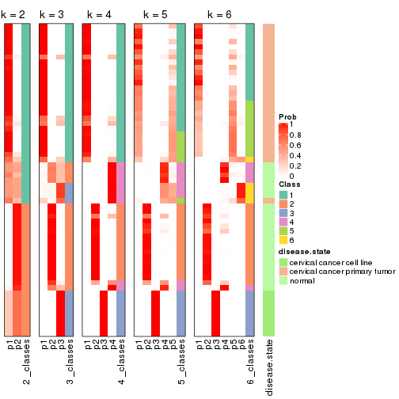


Test correlation between subgroups and known annotations. If the known
annotation is numeric, one-way ANOVA test is applied, and if the known
annotation is discrete, chi-squared contingency table test is applied.

```r
test_to_known_factors(res)
```

```
#>            n disease.state(p) k
#> CV:mclust 55         7.58e-12 2
#> CV:mclust 59         4.76e-19 3
#> CV:mclust 58         8.78e-22 4
#> CV:mclust 35         4.09e-13 5
#> CV:mclust 50         8.71e-16 6
```


If matrix rows can be associated to genes, consider to use `GO_Enrichment(res,
...)` to perform function enrichment for the signature genes.


 

---------------------------------------------------


### CV:NMF


The object with results only for a single top-value method and a single partition method 
can be extracted as:

```r
res = res_list["CV", "NMF"]
# you can also extract it by
# res = res_list["CV:NMF"]
```

A summary of `res` and all the functions that can be applied to it:

```r
res
```

```
#> A 'ConsensusPartition' object with k = 2, 3, 4, 5, 6.
#>   On a matrix with 21168 rows and 61 columns.
#>   Top rows (1000, 2000, 3000, 4000, 5000) are extracted by 'CV' method.
#>   Subgroups are detected by 'NMF' method.
#>   Performed in total 1250 partitions by row resampling.
#>   Best k for subgroups seems to be 3.
#> 
#> Following methods can be applied to this 'ConsensusPartition' object:
#>  [1] "cola_report"             "collect_classes"         "collect_plots"          
#>  [4] "collect_stats"           "colnames"                "compare_signatures"     
#>  [7] "consensus_heatmap"       "dimension_reduction"     "functional_enrichment"  
#> [10] "get_anno_col"            "get_anno"                "get_classes"            
#> [13] "get_consensus"           "get_matrix"              "get_membership"         
#> [16] "get_param"               "get_signatures"          "get_stats"              
#> [19] "is_best_k"               "is_stable_k"             "membership_heatmap"     
#> [22] "ncol"                    "nrow"                    "plot_ecdf"              
#> [25] "rownames"                "select_partition_number" "show"                   
#> [28] "suggest_best_k"          "test_to_known_factors"
```

`collect_plots()` function collects all the plots made from `res` for all `k` (number of partitions)
into one single page to provide an easy and fast comparison between different `k`.

```r
collect_plots(res)
```


The plots are:

- The first row: a plot of the ECDF (Empirical cumulative distribution
  function) curves of the consensus matrix for each `k` and the heatmap of
  predicted classes for each `k`.
- The second row: heatmaps of the consensus matrix for each `k`.
- The third row: heatmaps of the membership matrix for each `k`.
- The fouth row: heatmaps of the signatures for each `k`.

All the plots in panels can be made by individual functions and they are
plotted later in this section.

`select_partition_number()` produces several plots showing different
statistics for choosing "optimized" `k`. There are following statistics:

- ECDF curves of the consensus matrix for each `k`;
- 1-PAC. [The PAC
  score](https://en.wikipedia.org/wiki/Consensus_clustering#Over-interpretation_potential_of_consensus_clustering)
  measures the proportion of the ambiguous subgrouping.
- Mean silhouette score.
- Concordance. The mean probability of fiting the consensus class ids in all
  partitions.
- Area increased. Denote $A_k$ as the area under the ECDF curve for current
  `k`, the area increased is defined as $A_k - A_{k-1}$.
- Rand index. The percent of pairs of samples that are both in a same cluster
  or both are not in a same cluster in the partition of k and k-1.
- Jaccard index. The ratio of pairs of samples are both in a same cluster in
  the partition of k and k-1 and the pairs of samples are both in a same
  cluster in the partition k or k-1.

The detailed explanations of these statistics can be found in [the cola
vignette](http://bioconductor.org/packages/devel/bioc/vignettes/cola/inst/doc/cola.html#toc_13).

Generally speaking, lower PAC score, higher mean silhouette score or higher
concordance corresponds to better partition. Rand index and Jaccard index
measure how similar the current partition is compared to partition with `k-1`.
If they are too similar, we won't accept `k` is better than `k-1`.

```r
select_partition_number(res)
```


The numeric values for all these statistics can be obtained by `get_stats()`.

```r
get_stats(res)
```

```
#>   k 1-PAC mean_silhouette concordance area_increased  Rand Jaccard
#> 2 2 0.774           0.870       0.947         0.5008 0.492   0.492
#> 3 3 0.874           0.895       0.956         0.3011 0.661   0.424
#> 4 4 0.885           0.892       0.950         0.1035 0.830   0.579
#> 5 5 0.835           0.800       0.907         0.0507 0.966   0.885
#> 6 6 0.735           0.597       0.792         0.0610 0.961   0.855
```

`suggest_best_k()` suggests the best $k$ based on these statistics. The rules are as follows:

- All $k$ with Jaccard index larger than 0.95 are removed because the increase of
  the partition number does not provides enough extra information. If all $k$ are removed,
  the best $k$ is assigned by `NA`.
- For $k$ with 1-PAC larger than 0.9, the maximal $k$ is taken as the "best k". Other $k$ is called "optional k".
- If it does not fit the second rule. The $k$ with the highest vote of highest
  1-PAC, mean silhouette and concordance is taken as the "best k".

```r
suggest_best_k(res)
```

```
#> [1] 3
```


Following shows the table of the partitions (You need to click the **show/hide
code output** link to see it). The membership matrix (columns with name `p*`)
is inferred by
[`clue::cl_consensus()`](https://www.rdocumentation.org/link/cl_consensus?package=clue)
function with the `SE` method. Basically the value in the membership matrix
represents the probability to belong to a certain group. The finall class
label for an item is determined with the group with highest probability it
belongs to.

In `get_classes()` function, the entropy is calculated from the membership
matrix and the silhouette score is calculated from the consensus matrix.


<script>
$( function() {
	$( '#tabs-CV-NMF-get-classes' ).tabs();
} );
</script>
<div id='tabs-CV-NMF-get-classes'>
<ul>
<li><a href='#tab-CV-NMF-get-classes-1'>k = 2</a></li>
<li><a href='#tab-CV-NMF-get-classes-2'>k = 3</a></li>
<li><a href='#tab-CV-NMF-get-classes-3'>k = 4</a></li>
<li><a href='#tab-CV-NMF-get-classes-4'>k = 5</a></li>
<li><a href='#tab-CV-NMF-get-classes-5'>k = 6</a></li>
</ul>

<div id='tab-CV-NMF-get-classes-1'>
<p><a id='tab-CV-NMF-get-classes-1-a' style='color:#0366d6' href='#'>show/hide code output</a></p>
<pre><code class="r">cbind(get_classes(res, k = 2), get_membership(res, k = 2))
</code></pre>

<pre><code>#&gt;           class entropy silhouette    p1    p2
#&gt; GSM246087     1  0.0000      0.939 1.000 0.000
#&gt; GSM246088     1  0.0000      0.939 1.000 0.000
#&gt; GSM246089     1  0.0000      0.939 1.000 0.000
#&gt; GSM246090     1  0.0000      0.939 1.000 0.000
#&gt; GSM246119     1  0.0000      0.939 1.000 0.000
#&gt; GSM246120     1  0.0000      0.939 1.000 0.000
#&gt; GSM246121     1  0.0000      0.939 1.000 0.000
#&gt; GSM246122     1  0.0000      0.939 1.000 0.000
#&gt; GSM246123     1  0.0000      0.939 1.000 0.000
#&gt; GSM246422     2  0.0000      0.940 0.000 1.000
#&gt; GSM246423     2  0.0000      0.940 0.000 1.000
#&gt; GSM246484     2  0.0000      0.940 0.000 1.000
#&gt; GSM246485     2  0.0000      0.940 0.000 1.000
#&gt; GSM246486     2  0.0000      0.940 0.000 1.000
#&gt; GSM246487     2  0.0000      0.940 0.000 1.000
#&gt; GSM246488     2  0.0000      0.940 0.000 1.000
#&gt; GSM246489     2  0.0000      0.940 0.000 1.000
#&gt; GSM246490     2  0.0000      0.940 0.000 1.000
#&gt; GSM246491     2  0.0000      0.940 0.000 1.000
#&gt; GSM247162     2  0.0000      0.940 0.000 1.000
#&gt; GSM247163     2  0.0000      0.940 0.000 1.000
#&gt; GSM247164     2  0.0000      0.940 0.000 1.000
#&gt; GSM247165     2  0.0000      0.940 0.000 1.000
#&gt; GSM247166     2  0.0000      0.940 0.000 1.000
#&gt; GSM247168     2  0.0000      0.940 0.000 1.000
#&gt; GSM247169     2  0.0000      0.940 0.000 1.000
#&gt; GSM247171     2  0.0000      0.940 0.000 1.000
#&gt; GSM247173     2  0.0000      0.940 0.000 1.000
#&gt; GSM247174     2  0.0000      0.940 0.000 1.000
#&gt; GSM247175     2  0.0000      0.940 0.000 1.000
#&gt; GSM247188     2  0.0000      0.940 0.000 1.000
#&gt; GSM247189     2  0.0000      0.940 0.000 1.000
#&gt; GSM247190     2  0.0000      0.940 0.000 1.000
#&gt; GSM247650     1  0.0000      0.939 1.000 0.000
#&gt; GSM247651     2  0.7883      0.688 0.236 0.764
#&gt; GSM247652     1  0.0000      0.939 1.000 0.000
#&gt; GSM247653     1  0.0000      0.939 1.000 0.000
#&gt; GSM247654     1  0.0000      0.939 1.000 0.000
#&gt; GSM247655     1  0.9944      0.142 0.544 0.456
#&gt; GSM247656     1  0.0000      0.939 1.000 0.000
#&gt; GSM247657     1  0.0000      0.939 1.000 0.000
#&gt; GSM247658     1  0.3114      0.895 0.944 0.056
#&gt; GSM247659     1  0.0000      0.939 1.000 0.000
#&gt; GSM247660     2  0.8608      0.609 0.284 0.716
#&gt; GSM247661     1  0.0000      0.939 1.000 0.000
#&gt; GSM247662     1  0.0000      0.939 1.000 0.000
#&gt; GSM247663     1  0.0000      0.939 1.000 0.000
#&gt; GSM247856     1  0.0000      0.939 1.000 0.000
#&gt; GSM247857     1  0.0000      0.939 1.000 0.000
#&gt; GSM247859     2  0.8327      0.644 0.264 0.736
#&gt; GSM247860     1  0.0938      0.930 0.988 0.012
#&gt; GSM247862     1  0.9248      0.481 0.660 0.340
#&gt; GSM247864     1  0.6438      0.780 0.836 0.164
#&gt; GSM247865     2  0.1633      0.922 0.024 0.976
#&gt; GSM247866     2  0.9635      0.374 0.388 0.612
#&gt; GSM247876     1  0.0000      0.939 1.000 0.000
#&gt; GSM247877     1  0.7299      0.726 0.796 0.204
#&gt; GSM247878     1  0.9580      0.380 0.620 0.380
#&gt; GSM247879     1  0.0000      0.939 1.000 0.000
#&gt; GSM247881     2  0.9393      0.457 0.356 0.644
#&gt; GSM247883     2  0.3733      0.881 0.072 0.928
</code></pre>

<script>
$('#tab-CV-NMF-get-classes-1-a').parent().next().next().hide();
$('#tab-CV-NMF-get-classes-1-a').click(function(){
  $('#tab-CV-NMF-get-classes-1-a').parent().next().next().toggle();
  return(false);
});
</script>
</div>

<div id='tab-CV-NMF-get-classes-2'>
<p><a id='tab-CV-NMF-get-classes-2-a' style='color:#0366d6' href='#'>show/hide code output</a></p>
<pre><code class="r">cbind(get_classes(res, k = 3), get_membership(res, k = 3))
</code></pre>

<pre><code>#&gt;           class entropy silhouette    p1    p2    p3
#&gt; GSM246087     3  0.0000     0.9197 0.000 0.000 1.000
#&gt; GSM246088     3  0.0000     0.9197 0.000 0.000 1.000
#&gt; GSM246089     3  0.0000     0.9197 0.000 0.000 1.000
#&gt; GSM246090     3  0.0000     0.9197 0.000 0.000 1.000
#&gt; GSM246119     3  0.0000     0.9197 0.000 0.000 1.000
#&gt; GSM246120     3  0.0000     0.9197 0.000 0.000 1.000
#&gt; GSM246121     3  0.0000     0.9197 0.000 0.000 1.000
#&gt; GSM246122     3  0.0000     0.9197 0.000 0.000 1.000
#&gt; GSM246123     3  0.0000     0.9197 0.000 0.000 1.000
#&gt; GSM246422     1  0.0000     0.9497 1.000 0.000 0.000
#&gt; GSM246423     1  0.0000     0.9497 1.000 0.000 0.000
#&gt; GSM246484     1  0.0000     0.9497 1.000 0.000 0.000
#&gt; GSM246485     2  0.2625     0.8872 0.084 0.916 0.000
#&gt; GSM246486     2  0.2537     0.8914 0.080 0.920 0.000
#&gt; GSM246487     1  0.0000     0.9497 1.000 0.000 0.000
#&gt; GSM246488     2  0.6026     0.4174 0.376 0.624 0.000
#&gt; GSM246489     2  0.0000     0.9666 0.000 1.000 0.000
#&gt; GSM246490     2  0.0000     0.9666 0.000 1.000 0.000
#&gt; GSM246491     2  0.0000     0.9666 0.000 1.000 0.000
#&gt; GSM247162     2  0.0000     0.9666 0.000 1.000 0.000
#&gt; GSM247163     2  0.0000     0.9666 0.000 1.000 0.000
#&gt; GSM247164     2  0.0000     0.9666 0.000 1.000 0.000
#&gt; GSM247165     2  0.0000     0.9666 0.000 1.000 0.000
#&gt; GSM247166     2  0.0000     0.9666 0.000 1.000 0.000
#&gt; GSM247168     2  0.0000     0.9666 0.000 1.000 0.000
#&gt; GSM247169     2  0.0000     0.9666 0.000 1.000 0.000
#&gt; GSM247171     2  0.0000     0.9666 0.000 1.000 0.000
#&gt; GSM247173     2  0.0000     0.9666 0.000 1.000 0.000
#&gt; GSM247174     2  0.0000     0.9666 0.000 1.000 0.000
#&gt; GSM247175     2  0.0000     0.9666 0.000 1.000 0.000
#&gt; GSM247188     2  0.0000     0.9666 0.000 1.000 0.000
#&gt; GSM247189     2  0.0000     0.9666 0.000 1.000 0.000
#&gt; GSM247190     2  0.0000     0.9666 0.000 1.000 0.000
#&gt; GSM247650     1  0.2356     0.8969 0.928 0.000 0.072
#&gt; GSM247651     1  0.0000     0.9497 1.000 0.000 0.000
#&gt; GSM247652     1  0.0237     0.9476 0.996 0.000 0.004
#&gt; GSM247653     3  0.5529     0.6190 0.296 0.000 0.704
#&gt; GSM247654     1  0.4291     0.7652 0.820 0.000 0.180
#&gt; GSM247655     1  0.0000     0.9497 1.000 0.000 0.000
#&gt; GSM247656     3  0.4291     0.7856 0.180 0.000 0.820
#&gt; GSM247657     1  0.6299     0.0164 0.524 0.000 0.476
#&gt; GSM247658     1  0.0000     0.9497 1.000 0.000 0.000
#&gt; GSM247659     3  0.0000     0.9197 0.000 0.000 1.000
#&gt; GSM247660     1  0.0000     0.9497 1.000 0.000 0.000
#&gt; GSM247661     3  0.4504     0.7692 0.196 0.000 0.804
#&gt; GSM247662     3  0.5363     0.6305 0.276 0.000 0.724
#&gt; GSM247663     1  0.0424     0.9453 0.992 0.000 0.008
#&gt; GSM247856     1  0.2356     0.8954 0.928 0.000 0.072
#&gt; GSM247857     1  0.5363     0.6175 0.724 0.000 0.276
#&gt; GSM247859     1  0.0000     0.9497 1.000 0.000 0.000
#&gt; GSM247860     1  0.2959     0.8680 0.900 0.000 0.100
#&gt; GSM247862     1  0.0000     0.9497 1.000 0.000 0.000
#&gt; GSM247864     1  0.0000     0.9497 1.000 0.000 0.000
#&gt; GSM247865     1  0.0000     0.9497 1.000 0.000 0.000
#&gt; GSM247866     1  0.0000     0.9497 1.000 0.000 0.000
#&gt; GSM247876     1  0.0000     0.9497 1.000 0.000 0.000
#&gt; GSM247877     1  0.0000     0.9497 1.000 0.000 0.000
#&gt; GSM247878     1  0.0000     0.9497 1.000 0.000 0.000
#&gt; GSM247879     1  0.0424     0.9453 0.992 0.000 0.008
#&gt; GSM247881     1  0.0000     0.9497 1.000 0.000 0.000
#&gt; GSM247883     1  0.0000     0.9497 1.000 0.000 0.000
</code></pre>

<script>
$('#tab-CV-NMF-get-classes-2-a').parent().next().next().hide();
$('#tab-CV-NMF-get-classes-2-a').click(function(){
  $('#tab-CV-NMF-get-classes-2-a').parent().next().next().toggle();
  return(false);
});
</script>
</div>

<div id='tab-CV-NMF-get-classes-3'>
<p><a id='tab-CV-NMF-get-classes-3-a' style='color:#0366d6' href='#'>show/hide code output</a></p>
<pre><code class="r">cbind(get_classes(res, k = 4), get_membership(res, k = 4))
</code></pre>

<pre><code>#&gt;           class entropy silhouette    p1    p2    p3    p4
#&gt; GSM246087     3  0.0000      0.999 0.000 0.000 1.000 0.000
#&gt; GSM246088     3  0.0000      0.999 0.000 0.000 1.000 0.000
#&gt; GSM246089     3  0.0336      0.991 0.000 0.000 0.992 0.008
#&gt; GSM246090     3  0.0000      0.999 0.000 0.000 1.000 0.000
#&gt; GSM246119     3  0.0000      0.999 0.000 0.000 1.000 0.000
#&gt; GSM246120     3  0.0000      0.999 0.000 0.000 1.000 0.000
#&gt; GSM246121     3  0.0000      0.999 0.000 0.000 1.000 0.000
#&gt; GSM246122     3  0.0000      0.999 0.000 0.000 1.000 0.000
#&gt; GSM246123     3  0.0000      0.999 0.000 0.000 1.000 0.000
#&gt; GSM246422     4  0.0336      0.905 0.008 0.000 0.000 0.992
#&gt; GSM246423     4  0.0336      0.905 0.008 0.000 0.000 0.992
#&gt; GSM246484     4  0.0336      0.905 0.008 0.000 0.000 0.992
#&gt; GSM246485     2  0.2408      0.859 0.000 0.896 0.000 0.104
#&gt; GSM246486     2  0.4855      0.361 0.000 0.600 0.000 0.400
#&gt; GSM246487     4  0.5395      0.724 0.092 0.172 0.000 0.736
#&gt; GSM246488     4  0.1576      0.878 0.004 0.048 0.000 0.948
#&gt; GSM246489     2  0.0000      0.950 0.000 1.000 0.000 0.000
#&gt; GSM246490     2  0.0000      0.950 0.000 1.000 0.000 0.000
#&gt; GSM246491     2  0.0000      0.950 0.000 1.000 0.000 0.000
#&gt; GSM247162     2  0.0000      0.950 0.000 1.000 0.000 0.000
#&gt; GSM247163     2  0.0000      0.950 0.000 1.000 0.000 0.000
#&gt; GSM247164     2  0.0000      0.950 0.000 1.000 0.000 0.000
#&gt; GSM247165     2  0.0592      0.938 0.000 0.984 0.000 0.016
#&gt; GSM247166     2  0.0000      0.950 0.000 1.000 0.000 0.000
#&gt; GSM247168     2  0.0000      0.950 0.000 1.000 0.000 0.000
#&gt; GSM247169     2  0.0000      0.950 0.000 1.000 0.000 0.000
#&gt; GSM247171     2  0.0000      0.950 0.000 1.000 0.000 0.000
#&gt; GSM247173     2  0.0000      0.950 0.000 1.000 0.000 0.000
#&gt; GSM247174     2  0.0000      0.950 0.000 1.000 0.000 0.000
#&gt; GSM247175     2  0.0000      0.950 0.000 1.000 0.000 0.000
#&gt; GSM247188     2  0.0000      0.950 0.000 1.000 0.000 0.000
#&gt; GSM247189     2  0.4661      0.490 0.000 0.652 0.000 0.348
#&gt; GSM247190     2  0.0000      0.950 0.000 1.000 0.000 0.000
#&gt; GSM247650     1  0.0469      0.932 0.988 0.000 0.012 0.000
#&gt; GSM247651     1  0.4072      0.675 0.748 0.000 0.000 0.252
#&gt; GSM247652     1  0.0188      0.932 0.996 0.000 0.004 0.000
#&gt; GSM247653     1  0.0672      0.931 0.984 0.000 0.008 0.008
#&gt; GSM247654     1  0.0469      0.931 0.988 0.000 0.012 0.000
#&gt; GSM247655     1  0.0707      0.927 0.980 0.000 0.000 0.020
#&gt; GSM247656     1  0.3764      0.735 0.784 0.000 0.216 0.000
#&gt; GSM247657     1  0.0592      0.930 0.984 0.000 0.016 0.000
#&gt; GSM247658     1  0.0188      0.932 0.996 0.000 0.000 0.004
#&gt; GSM247659     1  0.5143      0.212 0.540 0.000 0.456 0.004
#&gt; GSM247660     1  0.2408      0.862 0.896 0.000 0.000 0.104
#&gt; GSM247661     1  0.0672      0.931 0.984 0.000 0.008 0.008
#&gt; GSM247662     1  0.1302      0.915 0.956 0.000 0.044 0.000
#&gt; GSM247663     1  0.1042      0.927 0.972 0.000 0.008 0.020
#&gt; GSM247856     1  0.0188      0.932 0.996 0.000 0.004 0.000
#&gt; GSM247857     1  0.0336      0.932 0.992 0.000 0.008 0.000
#&gt; GSM247859     1  0.0592      0.929 0.984 0.000 0.000 0.016
#&gt; GSM247860     1  0.0524      0.932 0.988 0.000 0.004 0.008
#&gt; GSM247862     1  0.0000      0.932 1.000 0.000 0.000 0.000
#&gt; GSM247864     1  0.0592      0.929 0.984 0.000 0.000 0.016
#&gt; GSM247865     1  0.1022      0.921 0.968 0.000 0.000 0.032
#&gt; GSM247866     1  0.0336      0.932 0.992 0.000 0.000 0.008
#&gt; GSM247876     1  0.3975      0.691 0.760 0.000 0.000 0.240
#&gt; GSM247877     4  0.0188      0.902 0.004 0.000 0.000 0.996
#&gt; GSM247878     4  0.0817      0.900 0.024 0.000 0.000 0.976
#&gt; GSM247879     4  0.4228      0.675 0.232 0.000 0.008 0.760
#&gt; GSM247881     1  0.0000      0.932 1.000 0.000 0.000 0.000
#&gt; GSM247883     1  0.0592      0.929 0.984 0.000 0.000 0.016
</code></pre>

<script>
$('#tab-CV-NMF-get-classes-3-a').parent().next().next().hide();
$('#tab-CV-NMF-get-classes-3-a').click(function(){
  $('#tab-CV-NMF-get-classes-3-a').parent().next().next().toggle();
  return(false);
});
</script>
</div>

<div id='tab-CV-NMF-get-classes-4'>
<p><a id='tab-CV-NMF-get-classes-4-a' style='color:#0366d6' href='#'>show/hide code output</a></p>
<pre><code class="r">cbind(get_classes(res, k = 5), get_membership(res, k = 5))
</code></pre>

<pre><code>#&gt;           class entropy silhouette    p1    p2    p3    p4    p5
#&gt; GSM246087     3  0.0510      0.915 0.000 0.000 0.984 0.000 0.016
#&gt; GSM246088     3  0.0404      0.916 0.000 0.000 0.988 0.000 0.012
#&gt; GSM246089     3  0.4291      0.289 0.000 0.000 0.536 0.000 0.464
#&gt; GSM246090     3  0.0000      0.918 0.000 0.000 1.000 0.000 0.000
#&gt; GSM246119     3  0.0703      0.917 0.000 0.000 0.976 0.000 0.024
#&gt; GSM246120     3  0.0510      0.918 0.000 0.000 0.984 0.000 0.016
#&gt; GSM246121     3  0.1341      0.904 0.000 0.000 0.944 0.000 0.056
#&gt; GSM246122     3  0.0609      0.913 0.000 0.000 0.980 0.000 0.020
#&gt; GSM246123     3  0.1410      0.902 0.000 0.000 0.940 0.000 0.060
#&gt; GSM246422     4  0.0162      0.885 0.000 0.000 0.000 0.996 0.004
#&gt; GSM246423     4  0.0000      0.884 0.000 0.000 0.000 1.000 0.000
#&gt; GSM246484     4  0.0162      0.885 0.000 0.000 0.000 0.996 0.004
#&gt; GSM246485     2  0.3063      0.839 0.012 0.864 0.000 0.104 0.020
#&gt; GSM246486     2  0.3928      0.593 0.000 0.700 0.000 0.296 0.004
#&gt; GSM246487     4  0.4454      0.705 0.092 0.108 0.000 0.784 0.016
#&gt; GSM246488     4  0.1571      0.846 0.000 0.060 0.000 0.936 0.004
#&gt; GSM246489     2  0.0000      0.954 0.000 1.000 0.000 0.000 0.000
#&gt; GSM246490     2  0.0162      0.954 0.000 0.996 0.000 0.000 0.004
#&gt; GSM246491     2  0.0000      0.954 0.000 1.000 0.000 0.000 0.000
#&gt; GSM247162     2  0.0290      0.954 0.000 0.992 0.000 0.000 0.008
#&gt; GSM247163     2  0.0000      0.954 0.000 1.000 0.000 0.000 0.000
#&gt; GSM247164     2  0.0566      0.952 0.000 0.984 0.000 0.004 0.012
#&gt; GSM247165     2  0.0162      0.953 0.000 0.996 0.000 0.004 0.000
#&gt; GSM247166     2  0.0000      0.954 0.000 1.000 0.000 0.000 0.000
#&gt; GSM247168     2  0.0000      0.954 0.000 1.000 0.000 0.000 0.000
#&gt; GSM247169     2  0.0162      0.954 0.000 0.996 0.000 0.000 0.004
#&gt; GSM247171     2  0.0404      0.953 0.000 0.988 0.000 0.000 0.012
#&gt; GSM247173     2  0.0162      0.954 0.000 0.996 0.000 0.000 0.004
#&gt; GSM247174     2  0.0290      0.954 0.000 0.992 0.000 0.000 0.008
#&gt; GSM247175     2  0.0162      0.954 0.000 0.996 0.000 0.000 0.004
#&gt; GSM247188     2  0.0404      0.953 0.000 0.988 0.000 0.000 0.012
#&gt; GSM247189     2  0.4622      0.591 0.000 0.692 0.000 0.264 0.044
#&gt; GSM247190     2  0.0404      0.953 0.000 0.988 0.000 0.000 0.012
#&gt; GSM247650     1  0.1300      0.859 0.956 0.000 0.016 0.000 0.028
#&gt; GSM247651     1  0.4651      0.379 0.608 0.000 0.000 0.372 0.020
#&gt; GSM247652     1  0.0609      0.856 0.980 0.000 0.000 0.000 0.020
#&gt; GSM247653     1  0.2852      0.750 0.828 0.000 0.000 0.000 0.172
#&gt; GSM247654     1  0.0671      0.858 0.980 0.000 0.004 0.000 0.016
#&gt; GSM247655     1  0.0693      0.860 0.980 0.000 0.000 0.008 0.012
#&gt; GSM247656     1  0.4804      0.413 0.636 0.000 0.328 0.000 0.036
#&gt; GSM247657     1  0.0955      0.856 0.968 0.000 0.004 0.000 0.028
#&gt; GSM247658     1  0.0880      0.858 0.968 0.000 0.000 0.000 0.032
#&gt; GSM247659     1  0.6176      0.219 0.540 0.000 0.172 0.000 0.288
#&gt; GSM247660     1  0.2900      0.797 0.864 0.000 0.000 0.108 0.028
#&gt; GSM247661     1  0.1965      0.824 0.904 0.000 0.000 0.000 0.096
#&gt; GSM247662     1  0.3437      0.750 0.832 0.000 0.120 0.000 0.048
#&gt; GSM247663     1  0.1626      0.855 0.940 0.000 0.000 0.016 0.044
#&gt; GSM247856     1  0.0771      0.856 0.976 0.000 0.000 0.004 0.020
#&gt; GSM247857     1  0.1282      0.854 0.952 0.000 0.004 0.000 0.044
#&gt; GSM247859     1  0.0898      0.855 0.972 0.000 0.000 0.008 0.020
#&gt; GSM247860     5  0.4256      0.155 0.436 0.000 0.000 0.000 0.564
#&gt; GSM247862     1  0.1197      0.852 0.952 0.000 0.000 0.000 0.048
#&gt; GSM247864     1  0.1364      0.855 0.952 0.000 0.000 0.012 0.036
#&gt; GSM247865     1  0.2293      0.819 0.900 0.000 0.000 0.084 0.016
#&gt; GSM247866     1  0.4219      0.233 0.584 0.000 0.000 0.000 0.416
#&gt; GSM247876     5  0.3351      0.634 0.148 0.000 0.004 0.020 0.828
#&gt; GSM247877     5  0.3756      0.409 0.000 0.000 0.008 0.248 0.744
#&gt; GSM247878     4  0.3081      0.747 0.012 0.000 0.000 0.832 0.156
#&gt; GSM247879     5  0.2151      0.589 0.016 0.000 0.020 0.040 0.924
#&gt; GSM247881     1  0.0963      0.855 0.964 0.000 0.000 0.000 0.036
#&gt; GSM247883     1  0.0566      0.858 0.984 0.000 0.000 0.004 0.012
</code></pre>

<script>
$('#tab-CV-NMF-get-classes-4-a').parent().next().next().hide();
$('#tab-CV-NMF-get-classes-4-a').click(function(){
  $('#tab-CV-NMF-get-classes-4-a').parent().next().next().toggle();
  return(false);
});
</script>
</div>

<div id='tab-CV-NMF-get-classes-5'>
<p><a id='tab-CV-NMF-get-classes-5-a' style='color:#0366d6' href='#'>show/hide code output</a></p>
<pre><code class="r">cbind(get_classes(res, k = 6), get_membership(res, k = 6))
</code></pre>

<pre><code>#&gt;           class entropy silhouette    p1    p2    p3    p4    p5    p6
#&gt; GSM246087     3  0.0632     0.7827 0.000 0.000 0.976 0.000 0.000 0.024
#&gt; GSM246088     3  0.0458     0.7877 0.000 0.000 0.984 0.000 0.000 0.016
#&gt; GSM246089     3  0.6217     0.0499 0.000 0.000 0.384 0.004 0.316 0.296
#&gt; GSM246090     3  0.0260     0.7886 0.000 0.000 0.992 0.000 0.000 0.008
#&gt; GSM246119     3  0.1461     0.7842 0.000 0.000 0.940 0.000 0.016 0.044
#&gt; GSM246120     3  0.0909     0.7901 0.000 0.000 0.968 0.000 0.012 0.020
#&gt; GSM246121     3  0.2527     0.7443 0.000 0.000 0.868 0.000 0.024 0.108
#&gt; GSM246122     3  0.1219     0.7676 0.000 0.000 0.948 0.000 0.004 0.048
#&gt; GSM246123     3  0.1408     0.7864 0.000 0.000 0.944 0.000 0.020 0.036
#&gt; GSM246422     4  0.0146     0.8114 0.000 0.000 0.000 0.996 0.000 0.004
#&gt; GSM246423     4  0.0508     0.8098 0.000 0.000 0.000 0.984 0.012 0.004
#&gt; GSM246484     4  0.0405     0.8118 0.000 0.000 0.000 0.988 0.008 0.004
#&gt; GSM246485     2  0.6160     0.0436 0.008 0.428 0.000 0.340 0.000 0.224
#&gt; GSM246486     2  0.4263     0.0831 0.000 0.504 0.000 0.480 0.000 0.016
#&gt; GSM246487     4  0.5361     0.5547 0.128 0.144 0.000 0.676 0.000 0.052
#&gt; GSM246488     4  0.1461     0.7851 0.000 0.044 0.000 0.940 0.000 0.016
#&gt; GSM246489     2  0.0622     0.8756 0.000 0.980 0.000 0.008 0.000 0.012
#&gt; GSM246490     2  0.0692     0.8742 0.000 0.976 0.000 0.000 0.004 0.020
#&gt; GSM246491     2  0.0458     0.8757 0.000 0.984 0.000 0.000 0.000 0.016
#&gt; GSM247162     2  0.0653     0.8747 0.000 0.980 0.000 0.012 0.004 0.004
#&gt; GSM247163     2  0.0909     0.8749 0.000 0.968 0.000 0.012 0.000 0.020
#&gt; GSM247164     2  0.0964     0.8726 0.000 0.968 0.000 0.016 0.004 0.012
#&gt; GSM247165     2  0.1003     0.8718 0.000 0.964 0.000 0.016 0.000 0.020
#&gt; GSM247166     2  0.2048     0.8301 0.000 0.880 0.000 0.000 0.000 0.120
#&gt; GSM247168     2  0.2048     0.8301 0.000 0.880 0.000 0.000 0.000 0.120
#&gt; GSM247169     2  0.2053     0.8330 0.000 0.888 0.000 0.000 0.004 0.108
#&gt; GSM247171     2  0.1269     0.8692 0.000 0.956 0.000 0.012 0.020 0.012
#&gt; GSM247173     2  0.0508     0.8762 0.000 0.984 0.000 0.012 0.000 0.004
#&gt; GSM247174     2  0.1082     0.8659 0.000 0.956 0.000 0.000 0.004 0.040
#&gt; GSM247175     2  0.0260     0.8761 0.000 0.992 0.000 0.000 0.000 0.008
#&gt; GSM247188     2  0.0725     0.8739 0.000 0.976 0.000 0.000 0.012 0.012
#&gt; GSM247189     2  0.5978    -0.0877 0.000 0.432 0.000 0.428 0.112 0.028
#&gt; GSM247190     2  0.0622     0.8738 0.000 0.980 0.000 0.000 0.008 0.012
#&gt; GSM247650     1  0.4153     0.5372 0.792 0.000 0.100 0.004 0.048 0.056
#&gt; GSM247651     1  0.3972     0.3746 0.664 0.000 0.000 0.320 0.012 0.004
#&gt; GSM247652     1  0.1219     0.6389 0.948 0.000 0.000 0.000 0.004 0.048
#&gt; GSM247653     1  0.5658     0.2398 0.432 0.000 0.000 0.000 0.152 0.416
#&gt; GSM247654     1  0.3534     0.5958 0.740 0.000 0.000 0.000 0.016 0.244
#&gt; GSM247655     1  0.2902     0.6095 0.800 0.000 0.000 0.004 0.000 0.196
#&gt; GSM247656     3  0.5635    -0.3245 0.408 0.000 0.468 0.000 0.008 0.116
#&gt; GSM247657     1  0.3923     0.4753 0.580 0.000 0.004 0.000 0.000 0.416
#&gt; GSM247658     1  0.2163     0.6333 0.892 0.000 0.000 0.000 0.016 0.092
#&gt; GSM247659     6  0.7497     0.4686 0.148 0.004 0.180 0.000 0.304 0.364
#&gt; GSM247660     1  0.5726     0.4630 0.580 0.000 0.000 0.224 0.016 0.180
#&gt; GSM247661     1  0.5132     0.4000 0.500 0.000 0.000 0.000 0.084 0.416
#&gt; GSM247662     6  0.6664     0.5499 0.236 0.000 0.336 0.000 0.036 0.392
#&gt; GSM247663     1  0.1341     0.6360 0.948 0.000 0.000 0.000 0.028 0.024
#&gt; GSM247856     1  0.0862     0.6323 0.972 0.000 0.016 0.000 0.008 0.004
#&gt; GSM247857     1  0.5473     0.2500 0.520 0.000 0.052 0.000 0.036 0.392
#&gt; GSM247859     1  0.1889     0.6350 0.920 0.000 0.000 0.020 0.004 0.056
#&gt; GSM247860     5  0.6099    -0.0261 0.300 0.000 0.000 0.000 0.384 0.316
#&gt; GSM247862     1  0.4252     0.5475 0.652 0.000 0.000 0.000 0.036 0.312
#&gt; GSM247864     1  0.4306     0.5573 0.700 0.000 0.000 0.008 0.044 0.248
#&gt; GSM247865     1  0.3598     0.5264 0.804 0.000 0.000 0.112 0.004 0.080
#&gt; GSM247866     1  0.5575     0.2061 0.460 0.000 0.000 0.000 0.400 0.140
#&gt; GSM247876     5  0.3339     0.4528 0.188 0.000 0.004 0.008 0.792 0.008
#&gt; GSM247877     5  0.3133     0.4612 0.000 0.000 0.008 0.180 0.804 0.008
#&gt; GSM247878     4  0.4771     0.3612 0.056 0.000 0.000 0.628 0.308 0.008
#&gt; GSM247879     5  0.1639     0.5341 0.020 0.004 0.004 0.008 0.944 0.020
#&gt; GSM247881     1  0.5005     0.4443 0.628 0.000 0.000 0.000 0.124 0.248
#&gt; GSM247883     1  0.1624     0.6173 0.936 0.004 0.000 0.000 0.020 0.040
</code></pre>

<script>
$('#tab-CV-NMF-get-classes-5-a').parent().next().next().hide();
$('#tab-CV-NMF-get-classes-5-a').click(function(){
  $('#tab-CV-NMF-get-classes-5-a').parent().next().next().toggle();
  return(false);
});
</script>
</div>
</div>

Heatmaps for the consensus matrix. It visualizes the probability of two
samples to be in a same group.


<script>
$( function() {
	$( '#tabs-CV-NMF-consensus-heatmap' ).tabs();
} );
</script>
<div id='tabs-CV-NMF-consensus-heatmap'>
<ul>
<li><a href='#tab-CV-NMF-consensus-heatmap-1'>k = 2</a></li>
<li><a href='#tab-CV-NMF-consensus-heatmap-2'>k = 3</a></li>
<li><a href='#tab-CV-NMF-consensus-heatmap-3'>k = 4</a></li>
<li><a href='#tab-CV-NMF-consensus-heatmap-4'>k = 5</a></li>
<li><a href='#tab-CV-NMF-consensus-heatmap-5'>k = 6</a></li>
</ul>
<div id='tab-CV-NMF-consensus-heatmap-1'>
<pre><code class="r">consensus_heatmap(res, k = 2)
</code></pre>

<p></p>

</div>
<div id='tab-CV-NMF-consensus-heatmap-2'>
<pre><code class="r">consensus_heatmap(res, k = 3)
</code></pre>

<p></p>

</div>
<div id='tab-CV-NMF-consensus-heatmap-3'>
<pre><code class="r">consensus_heatmap(res, k = 4)
</code></pre>

<p>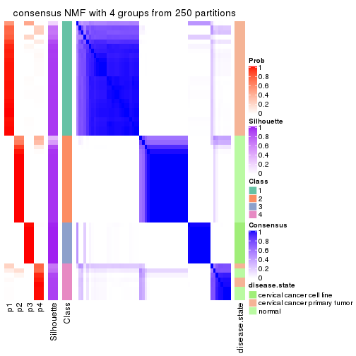</p>

</div>
<div id='tab-CV-NMF-consensus-heatmap-4'>
<pre><code class="r">consensus_heatmap(res, k = 5)
</code></pre>

<p></p>

</div>
<div id='tab-CV-NMF-consensus-heatmap-5'>
<pre><code class="r">consensus_heatmap(res, k = 6)
</code></pre>

<p></p>

</div>
</div>

Heatmaps for the membership of samples in all partitions to see how consistent they are:


<script>
$( function() {
	$( '#tabs-CV-NMF-membership-heatmap' ).tabs();
} );
</script>
<div id='tabs-CV-NMF-membership-heatmap'>
<ul>
<li><a href='#tab-CV-NMF-membership-heatmap-1'>k = 2</a></li>
<li><a href='#tab-CV-NMF-membership-heatmap-2'>k = 3</a></li>
<li><a href='#tab-CV-NMF-membership-heatmap-3'>k = 4</a></li>
<li><a href='#tab-CV-NMF-membership-heatmap-4'>k = 5</a></li>
<li><a href='#tab-CV-NMF-membership-heatmap-5'>k = 6</a></li>
</ul>
<div id='tab-CV-NMF-membership-heatmap-1'>
<pre><code class="r">membership_heatmap(res, k = 2)
</code></pre>

<p></p>

</div>
<div id='tab-CV-NMF-membership-heatmap-2'>
<pre><code class="r">membership_heatmap(res, k = 3)
</code></pre>

<p></p>

</div>
<div id='tab-CV-NMF-membership-heatmap-3'>
<pre><code class="r">membership_heatmap(res, k = 4)
</code></pre>

<p></p>

</div>
<div id='tab-CV-NMF-membership-heatmap-4'>
<pre><code class="r">membership_heatmap(res, k = 5)
</code></pre>

<p></p>

</div>
<div id='tab-CV-NMF-membership-heatmap-5'>
<pre><code class="r">membership_heatmap(res, k = 6)
</code></pre>

<p>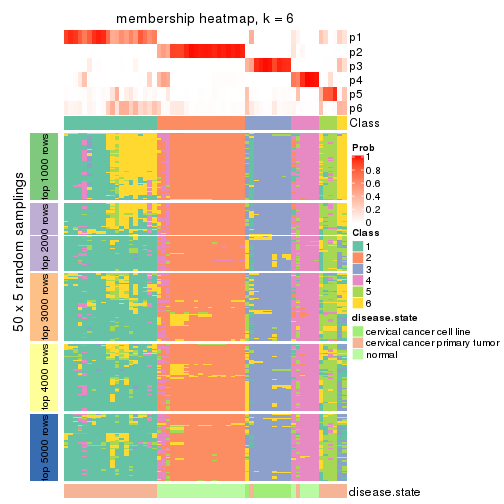</p>

</div>
</div>

As soon as we have had the classes for columns, we can look for signatures
which are significantly different between classes which can be candidate marks
for certain classes. Following are the heatmaps for signatures.


Signature heatmaps where rows are scaled:


<script>
$( function() {
	$( '#tabs-CV-NMF-get-signatures' ).tabs();
} );
</script>
<div id='tabs-CV-NMF-get-signatures'>
<ul>
<li><a href='#tab-CV-NMF-get-signatures-1'>k = 2</a></li>
<li><a href='#tab-CV-NMF-get-signatures-2'>k = 3</a></li>
<li><a href='#tab-CV-NMF-get-signatures-3'>k = 4</a></li>
<li><a href='#tab-CV-NMF-get-signatures-4'>k = 5</a></li>
<li><a href='#tab-CV-NMF-get-signatures-5'>k = 6</a></li>
</ul>
<div id='tab-CV-NMF-get-signatures-1'>
<pre><code class="r">get_signatures(res, k = 2)
</code></pre>

<p></p>

</div>
<div id='tab-CV-NMF-get-signatures-2'>
<pre><code class="r">get_signatures(res, k = 3)
</code></pre>

<p></p>

</div>
<div id='tab-CV-NMF-get-signatures-3'>
<pre><code class="r">get_signatures(res, k = 4)
</code></pre>

<p></p>

</div>
<div id='tab-CV-NMF-get-signatures-4'>
<pre><code class="r">get_signatures(res, k = 5)
</code></pre>

<p></p>

</div>
<div id='tab-CV-NMF-get-signatures-5'>
<pre><code class="r">get_signatures(res, k = 6)
</code></pre>

<p></p>

</div>
</div>


Signature heatmaps where rows are not scaled:


<script>
$( function() {
	$( '#tabs-CV-NMF-get-signatures-no-scale' ).tabs();
} );
</script>
<div id='tabs-CV-NMF-get-signatures-no-scale'>
<ul>
<li><a href='#tab-CV-NMF-get-signatures-no-scale-1'>k = 2</a></li>
<li><a href='#tab-CV-NMF-get-signatures-no-scale-2'>k = 3</a></li>
<li><a href='#tab-CV-NMF-get-signatures-no-scale-3'>k = 4</a></li>
<li><a href='#tab-CV-NMF-get-signatures-no-scale-4'>k = 5</a></li>
<li><a href='#tab-CV-NMF-get-signatures-no-scale-5'>k = 6</a></li>
</ul>
<div id='tab-CV-NMF-get-signatures-no-scale-1'>
<pre><code class="r">get_signatures(res, k = 2, scale_rows = FALSE)
</code></pre>

<p></p>

</div>
<div id='tab-CV-NMF-get-signatures-no-scale-2'>
<pre><code class="r">get_signatures(res, k = 3, scale_rows = FALSE)
</code></pre>

<p></p>

</div>
<div id='tab-CV-NMF-get-signatures-no-scale-3'>
<pre><code class="r">get_signatures(res, k = 4, scale_rows = FALSE)
</code></pre>

<p></p>

</div>
<div id='tab-CV-NMF-get-signatures-no-scale-4'>
<pre><code class="r">get_signatures(res, k = 5, scale_rows = FALSE)
</code></pre>

<p></p>

</div>
<div id='tab-CV-NMF-get-signatures-no-scale-5'>
<pre><code class="r">get_signatures(res, k = 6, scale_rows = FALSE)
</code></pre>

<p>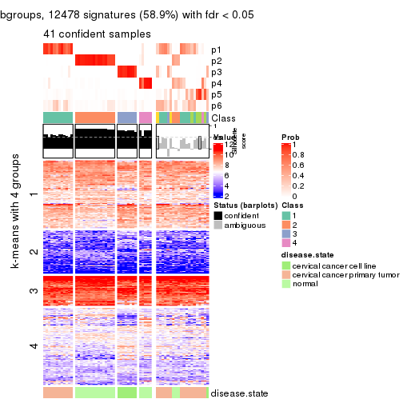</p>

</div>
</div>


Compare the overlap of signatures from different k:

```r
compare_signatures(res)
```


`get_signature()` returns a data frame invisibly. TO get the list of signatures, the function
call should be assigned to a variable explicitly. In following code, if `plot` argument is set
to `FALSE`, no heatmap is plotted while only the differential analysis is performed.

```r
# code only for demonstration
tb = get_signature(res, k = ..., plot = FALSE)
```

An example of the output of `tb` is:

```
#>   which_row         fdr    mean_1    mean_2 scaled_mean_1 scaled_mean_2 km
#> 1        38 0.042760348  8.373488  9.131774    -0.5533452     0.5164555  1
#> 2        40 0.018707592  7.106213  8.469186    -0.6173731     0.5762149  1
#> 3        55 0.019134737 10.221463 11.207825    -0.6159697     0.5749050  1
#> 4        59 0.006059896  5.921854  7.869574    -0.6899429     0.6439467  1
#> 5        60 0.018055526  8.928898 10.211722    -0.6204761     0.5791110  1
#> 6        98 0.009384629 15.714769 14.887706     0.6635654    -0.6193277  2
...
```

The columns in `tb` are:

1. `which_row`: row indices corresponding to the input matrix.
2. `fdr`: FDR for the differential test. 
3. `mean_x`: The mean value in group x.
4. `scaled_mean_x`: The mean value in group x after rows are scaled.
5. `km`: Row groups if k-means clustering is applied to rows.


UMAP plot which shows how samples are separated.


<script>
$( function() {
	$( '#tabs-CV-NMF-dimension-reduction' ).tabs();
} );
</script>
<div id='tabs-CV-NMF-dimension-reduction'>
<ul>
<li><a href='#tab-CV-NMF-dimension-reduction-1'>k = 2</a></li>
<li><a href='#tab-CV-NMF-dimension-reduction-2'>k = 3</a></li>
<li><a href='#tab-CV-NMF-dimension-reduction-3'>k = 4</a></li>
<li><a href='#tab-CV-NMF-dimension-reduction-4'>k = 5</a></li>
<li><a href='#tab-CV-NMF-dimension-reduction-5'>k = 6</a></li>
</ul>
<div id='tab-CV-NMF-dimension-reduction-1'>
<pre><code class="r">dimension_reduction(res, k = 2, method = &quot;UMAP&quot;)
</code></pre>

<p></p>

</div>
<div id='tab-CV-NMF-dimension-reduction-2'>
<pre><code class="r">dimension_reduction(res, k = 3, method = &quot;UMAP&quot;)
</code></pre>

<p></p>

</div>
<div id='tab-CV-NMF-dimension-reduction-3'>
<pre><code class="r">dimension_reduction(res, k = 4, method = &quot;UMAP&quot;)
</code></pre>

<p></p>

</div>
<div id='tab-CV-NMF-dimension-reduction-4'>
<pre><code class="r">dimension_reduction(res, k = 5, method = &quot;UMAP&quot;)
</code></pre>

<p></p>

</div>
<div id='tab-CV-NMF-dimension-reduction-5'>
<pre><code class="r">dimension_reduction(res, k = 6, method = &quot;UMAP&quot;)
</code></pre>

<p></p>

</div>
</div>


Following heatmap shows how subgroups are split when increasing `k`:

```r
collect_classes(res)
```


Test correlation between subgroups and known annotations. If the known
annotation is numeric, one-way ANOVA test is applied, and if the known
annotation is discrete, chi-squared contingency table test is applied.

```r
test_to_known_factors(res)
```

```
#>         n disease.state(p) k
#> CV:NMF 56         1.75e-09 2
#> CV:NMF 59         3.53e-15 3
#> CV:NMF 58         8.53e-21 4
#> CV:NMF 54         6.25e-19 5
#> CV:NMF 43         3.31e-14 6
```


If matrix rows can be associated to genes, consider to use `GO_Enrichment(res,
...)` to perform function enrichment for the signature genes.


 

---------------------------------------------------


### MAD:hclust*


The object with results only for a single top-value method and a single partition method 
can be extracted as:

```r
res = res_list["MAD", "hclust"]
# you can also extract it by
# res = res_list["MAD:hclust"]
```

A summary of `res` and all the functions that can be applied to it:

```r
res
```

```
#> A 'ConsensusPartition' object with k = 2, 3, 4, 5, 6.
#>   On a matrix with 21168 rows and 61 columns.
#>   Top rows (1000, 2000, 3000, 4000, 5000) are extracted by 'MAD' method.
#>   Subgroups are detected by 'hclust' method.
#>   Performed in total 1250 partitions by row resampling.
#>   Best k for subgroups seems to be 4.
#> 
#> Following methods can be applied to this 'ConsensusPartition' object:
#>  [1] "cola_report"             "collect_classes"         "collect_plots"          
#>  [4] "collect_stats"           "colnames"                "compare_signatures"     
#>  [7] "consensus_heatmap"       "dimension_reduction"     "functional_enrichment"  
#> [10] "get_anno_col"            "get_anno"                "get_classes"            
#> [13] "get_consensus"           "get_matrix"              "get_membership"         
#> [16] "get_param"               "get_signatures"          "get_stats"              
#> [19] "is_best_k"               "is_stable_k"             "membership_heatmap"     
#> [22] "ncol"                    "nrow"                    "plot_ecdf"              
#> [25] "rownames"                "select_partition_number" "show"                   
#> [28] "suggest_best_k"          "test_to_known_factors"
```

`collect_plots()` function collects all the plots made from `res` for all `k` (number of partitions)
into one single page to provide an easy and fast comparison between different `k`.

```r
collect_plots(res)
```


The plots are:

- The first row: a plot of the ECDF (Empirical cumulative distribution
  function) curves of the consensus matrix for each `k` and the heatmap of
  predicted classes for each `k`.
- The second row: heatmaps of the consensus matrix for each `k`.
- The third row: heatmaps of the membership matrix for each `k`.
- The fouth row: heatmaps of the signatures for each `k`.

All the plots in panels can be made by individual functions and they are
plotted later in this section.

`select_partition_number()` produces several plots showing different
statistics for choosing "optimized" `k`. There are following statistics:

- ECDF curves of the consensus matrix for each `k`;
- 1-PAC. [The PAC
  score](https://en.wikipedia.org/wiki/Consensus_clustering#Over-interpretation_potential_of_consensus_clustering)
  measures the proportion of the ambiguous subgrouping.
- Mean silhouette score.
- Concordance. The mean probability of fiting the consensus class ids in all
  partitions.
- Area increased. Denote $A_k$ as the area under the ECDF curve for current
  `k`, the area increased is defined as $A_k - A_{k-1}$.
- Rand index. The percent of pairs of samples that are both in a same cluster
  or both are not in a same cluster in the partition of k and k-1.
- Jaccard index. The ratio of pairs of samples are both in a same cluster in
  the partition of k and k-1 and the pairs of samples are both in a same
  cluster in the partition k or k-1.

The detailed explanations of these statistics can be found in [the cola
vignette](http://bioconductor.org/packages/devel/bioc/vignettes/cola/inst/doc/cola.html#toc_13).

Generally speaking, lower PAC score, higher mean silhouette score or higher
concordance corresponds to better partition. Rand index and Jaccard index
measure how similar the current partition is compared to partition with `k-1`.
If they are too similar, we won't accept `k` is better than `k-1`.

```r
select_partition_number(res)
```


The numeric values for all these statistics can be obtained by `get_stats()`.

```r
get_stats(res)
```

```
#>   k 1-PAC mean_silhouette concordance area_increased  Rand Jaccard
#> 2 2 0.432           0.579       0.718         0.3381 0.531   0.531
#> 3 3 0.915           0.913       0.965         0.7230 0.702   0.526
#> 4 4 0.918           0.883       0.944         0.2066 0.850   0.650
#> 5 5 0.927           0.910       0.954         0.0306 0.987   0.953
#> 6 6 0.865           0.867       0.926         0.0282 0.996   0.984
```

`suggest_best_k()` suggests the best $k$ based on these statistics. The rules are as follows:

- All $k$ with Jaccard index larger than 0.95 are removed because the increase of
  the partition number does not provides enough extra information. If all $k$ are removed,
  the best $k$ is assigned by `NA`.
- For $k$ with 1-PAC larger than 0.9, the maximal $k$ is taken as the "best k". Other $k$ is called "optional k".
- If it does not fit the second rule. The $k$ with the highest vote of highest
  1-PAC, mean silhouette and concordance is taken as the "best k".

```r
suggest_best_k(res)
```

```
#> [1] 4
#> attr(,"optional")
#> [1] 3
```

There is also optional best $k$ = 3 that is worth to check.

Following shows the table of the partitions (You need to click the **show/hide
code output** link to see it). The membership matrix (columns with name `p*`)
is inferred by
[`clue::cl_consensus()`](https://www.rdocumentation.org/link/cl_consensus?package=clue)
function with the `SE` method. Basically the value in the membership matrix
represents the probability to belong to a certain group. The finall class
label for an item is determined with the group with highest probability it
belongs to.

In `get_classes()` function, the entropy is calculated from the membership
matrix and the silhouette score is calculated from the consensus matrix.


<script>
$( function() {
	$( '#tabs-MAD-hclust-get-classes' ).tabs();
} );
</script>
<div id='tabs-MAD-hclust-get-classes'>
<ul>
<li><a href='#tab-MAD-hclust-get-classes-1'>k = 2</a></li>
<li><a href='#tab-MAD-hclust-get-classes-2'>k = 3</a></li>
<li><a href='#tab-MAD-hclust-get-classes-3'>k = 4</a></li>
<li><a href='#tab-MAD-hclust-get-classes-4'>k = 5</a></li>
<li><a href='#tab-MAD-hclust-get-classes-5'>k = 6</a></li>
</ul>

<div id='tab-MAD-hclust-get-classes-1'>
<p><a id='tab-MAD-hclust-get-classes-1-a' style='color:#0366d6' href='#'>show/hide code output</a></p>
<pre><code class="r">cbind(get_classes(res, k = 2), get_membership(res, k = 2))
</code></pre>

<pre><code>#&gt;           class entropy silhouette    p1    p2
#&gt; GSM246087     1  0.1633     0.3361 0.976 0.024
#&gt; GSM246088     1  0.1633     0.3361 0.976 0.024
#&gt; GSM246089     1  0.1633     0.3361 0.976 0.024
#&gt; GSM246090     1  0.1633     0.3361 0.976 0.024
#&gt; GSM246119     1  0.1633     0.3361 0.976 0.024
#&gt; GSM246120     1  0.1633     0.3361 0.976 0.024
#&gt; GSM246121     1  0.1633     0.3361 0.976 0.024
#&gt; GSM246122     1  0.1633     0.3361 0.976 0.024
#&gt; GSM246123     1  0.1633     0.3361 0.976 0.024
#&gt; GSM246422     1  0.9993     0.6938 0.516 0.484
#&gt; GSM246423     1  0.9993     0.6938 0.516 0.484
#&gt; GSM246484     1  0.9993     0.6938 0.516 0.484
#&gt; GSM246485     2  0.9170     0.0331 0.332 0.668
#&gt; GSM246486     2  0.9552    -0.1875 0.376 0.624
#&gt; GSM246487     2  0.9552    -0.1875 0.376 0.624
#&gt; GSM246488     2  0.9323    -0.0429 0.348 0.652
#&gt; GSM246489     2  0.0000     0.7864 0.000 1.000
#&gt; GSM246490     2  0.0672     0.7832 0.008 0.992
#&gt; GSM246491     2  0.0672     0.7832 0.008 0.992
#&gt; GSM247162     2  0.0000     0.7864 0.000 1.000
#&gt; GSM247163     2  0.0672     0.7832 0.008 0.992
#&gt; GSM247164     2  0.0672     0.7832 0.008 0.992
#&gt; GSM247165     2  0.6048     0.5817 0.148 0.852
#&gt; GSM247166     2  0.0000     0.7864 0.000 1.000
#&gt; GSM247168     2  0.0000     0.7864 0.000 1.000
#&gt; GSM247169     2  0.0000     0.7864 0.000 1.000
#&gt; GSM247171     2  0.0000     0.7864 0.000 1.000
#&gt; GSM247173     2  0.0000     0.7864 0.000 1.000
#&gt; GSM247174     2  0.0000     0.7864 0.000 1.000
#&gt; GSM247175     2  0.0000     0.7864 0.000 1.000
#&gt; GSM247188     2  0.0000     0.7864 0.000 1.000
#&gt; GSM247189     2  0.9209     0.0134 0.336 0.664
#&gt; GSM247190     2  0.0000     0.7864 0.000 1.000
#&gt; GSM247650     1  0.9993     0.6938 0.516 0.484
#&gt; GSM247651     1  0.9993     0.6938 0.516 0.484
#&gt; GSM247652     1  0.9993     0.6938 0.516 0.484
#&gt; GSM247653     1  0.9993     0.6938 0.516 0.484
#&gt; GSM247654     1  0.9993     0.6938 0.516 0.484
#&gt; GSM247655     1  0.9993     0.6938 0.516 0.484
#&gt; GSM247656     1  0.9993     0.6938 0.516 0.484
#&gt; GSM247657     1  0.9993     0.6938 0.516 0.484
#&gt; GSM247658     1  0.9993     0.6938 0.516 0.484
#&gt; GSM247659     1  0.9993     0.6938 0.516 0.484
#&gt; GSM247660     1  0.9993     0.6938 0.516 0.484
#&gt; GSM247661     1  0.9993     0.6938 0.516 0.484
#&gt; GSM247662     1  0.9993     0.6938 0.516 0.484
#&gt; GSM247663     1  0.9993     0.6938 0.516 0.484
#&gt; GSM247856     1  0.9993     0.6938 0.516 0.484
#&gt; GSM247857     1  0.9993     0.6938 0.516 0.484
#&gt; GSM247859     1  0.9993     0.6938 0.516 0.484
#&gt; GSM247860     1  0.9993     0.6938 0.516 0.484
#&gt; GSM247862     1  0.9993     0.6938 0.516 0.484
#&gt; GSM247864     1  0.9993     0.6938 0.516 0.484
#&gt; GSM247865     2  0.9933    -0.5178 0.452 0.548
#&gt; GSM247866     1  0.9993     0.6938 0.516 0.484
#&gt; GSM247876     1  0.9993     0.6938 0.516 0.484
#&gt; GSM247877     1  0.9993     0.6938 0.516 0.484
#&gt; GSM247878     1  0.9993     0.6938 0.516 0.484
#&gt; GSM247879     1  0.9993     0.6938 0.516 0.484
#&gt; GSM247881     1  0.9993     0.6938 0.516 0.484
#&gt; GSM247883     1  0.9993     0.6938 0.516 0.484
</code></pre>

<script>
$('#tab-MAD-hclust-get-classes-1-a').parent().next().next().hide();
$('#tab-MAD-hclust-get-classes-1-a').click(function(){
  $('#tab-MAD-hclust-get-classes-1-a').parent().next().next().toggle();
  return(false);
});
</script>
</div>

<div id='tab-MAD-hclust-get-classes-2'>
<p><a id='tab-MAD-hclust-get-classes-2-a' style='color:#0366d6' href='#'>show/hide code output</a></p>
<pre><code class="r">cbind(get_classes(res, k = 3), get_membership(res, k = 3))
</code></pre>

<pre><code>#&gt;           class entropy silhouette    p1    p2 p3
#&gt; GSM246087     3  0.0000      1.000 0.000 0.000  1
#&gt; GSM246088     3  0.0000      1.000 0.000 0.000  1
#&gt; GSM246089     3  0.0000      1.000 0.000 0.000  1
#&gt; GSM246090     3  0.0000      1.000 0.000 0.000  1
#&gt; GSM246119     3  0.0000      1.000 0.000 0.000  1
#&gt; GSM246120     3  0.0000      1.000 0.000 0.000  1
#&gt; GSM246121     3  0.0000      1.000 0.000 0.000  1
#&gt; GSM246122     3  0.0000      1.000 0.000 0.000  1
#&gt; GSM246123     3  0.0000      1.000 0.000 0.000  1
#&gt; GSM246422     1  0.0000      0.942 1.000 0.000  0
#&gt; GSM246423     1  0.0000      0.942 1.000 0.000  0
#&gt; GSM246484     1  0.0000      0.942 1.000 0.000  0
#&gt; GSM246485     1  0.6111      0.400 0.604 0.396  0
#&gt; GSM246486     1  0.5650      0.574 0.688 0.312  0
#&gt; GSM246487     1  0.5650      0.574 0.688 0.312  0
#&gt; GSM246488     1  0.5988      0.464 0.632 0.368  0
#&gt; GSM246489     2  0.0000      0.971 0.000 1.000  0
#&gt; GSM246490     2  0.0424      0.966 0.008 0.992  0
#&gt; GSM246491     2  0.0424      0.966 0.008 0.992  0
#&gt; GSM247162     2  0.0000      0.971 0.000 1.000  0
#&gt; GSM247163     2  0.0424      0.966 0.008 0.992  0
#&gt; GSM247164     2  0.0424      0.966 0.008 0.992  0
#&gt; GSM247165     2  0.5327      0.582 0.272 0.728  0
#&gt; GSM247166     2  0.0000      0.971 0.000 1.000  0
#&gt; GSM247168     2  0.0000      0.971 0.000 1.000  0
#&gt; GSM247169     2  0.0000      0.971 0.000 1.000  0
#&gt; GSM247171     2  0.0000      0.971 0.000 1.000  0
#&gt; GSM247173     2  0.0000      0.971 0.000 1.000  0
#&gt; GSM247174     2  0.0000      0.971 0.000 1.000  0
#&gt; GSM247175     2  0.0000      0.971 0.000 1.000  0
#&gt; GSM247188     2  0.0000      0.971 0.000 1.000  0
#&gt; GSM247189     1  0.6095      0.410 0.608 0.392  0
#&gt; GSM247190     2  0.0000      0.971 0.000 1.000  0
#&gt; GSM247650     1  0.0000      0.942 1.000 0.000  0
#&gt; GSM247651     1  0.0000      0.942 1.000 0.000  0
#&gt; GSM247652     1  0.0000      0.942 1.000 0.000  0
#&gt; GSM247653     1  0.0000      0.942 1.000 0.000  0
#&gt; GSM247654     1  0.0000      0.942 1.000 0.000  0
#&gt; GSM247655     1  0.0000      0.942 1.000 0.000  0
#&gt; GSM247656     1  0.0000      0.942 1.000 0.000  0
#&gt; GSM247657     1  0.0000      0.942 1.000 0.000  0
#&gt; GSM247658     1  0.0000      0.942 1.000 0.000  0
#&gt; GSM247659     1  0.0000      0.942 1.000 0.000  0
#&gt; GSM247660     1  0.0000      0.942 1.000 0.000  0
#&gt; GSM247661     1  0.0000      0.942 1.000 0.000  0
#&gt; GSM247662     1  0.0000      0.942 1.000 0.000  0
#&gt; GSM247663     1  0.0000      0.942 1.000 0.000  0
#&gt; GSM247856     1  0.0000      0.942 1.000 0.000  0
#&gt; GSM247857     1  0.0000      0.942 1.000 0.000  0
#&gt; GSM247859     1  0.0000      0.942 1.000 0.000  0
#&gt; GSM247860     1  0.0000      0.942 1.000 0.000  0
#&gt; GSM247862     1  0.0000      0.942 1.000 0.000  0
#&gt; GSM247864     1  0.0000      0.942 1.000 0.000  0
#&gt; GSM247865     1  0.2165      0.889 0.936 0.064  0
#&gt; GSM247866     1  0.0000      0.942 1.000 0.000  0
#&gt; GSM247876     1  0.0000      0.942 1.000 0.000  0
#&gt; GSM247877     1  0.0000      0.942 1.000 0.000  0
#&gt; GSM247878     1  0.0000      0.942 1.000 0.000  0
#&gt; GSM247879     1  0.0000      0.942 1.000 0.000  0
#&gt; GSM247881     1  0.0000      0.942 1.000 0.000  0
#&gt; GSM247883     1  0.0000      0.942 1.000 0.000  0
</code></pre>

<script>
$('#tab-MAD-hclust-get-classes-2-a').parent().next().next().hide();
$('#tab-MAD-hclust-get-classes-2-a').click(function(){
  $('#tab-MAD-hclust-get-classes-2-a').parent().next().next().toggle();
  return(false);
});
</script>
</div>

<div id='tab-MAD-hclust-get-classes-3'>
<p><a id='tab-MAD-hclust-get-classes-3-a' style='color:#0366d6' href='#'>show/hide code output</a></p>
<pre><code class="r">cbind(get_classes(res, k = 4), get_membership(res, k = 4))
</code></pre>

<pre><code>#&gt;           class entropy silhouette    p1    p2 p3    p4
#&gt; GSM246087     3  0.0000      1.000 0.000 0.000  1 0.000
#&gt; GSM246088     3  0.0000      1.000 0.000 0.000  1 0.000
#&gt; GSM246089     3  0.0000      1.000 0.000 0.000  1 0.000
#&gt; GSM246090     3  0.0000      1.000 0.000 0.000  1 0.000
#&gt; GSM246119     3  0.0000      1.000 0.000 0.000  1 0.000
#&gt; GSM246120     3  0.0000      1.000 0.000 0.000  1 0.000
#&gt; GSM246121     3  0.0000      1.000 0.000 0.000  1 0.000
#&gt; GSM246122     3  0.0000      1.000 0.000 0.000  1 0.000
#&gt; GSM246123     3  0.0000      1.000 0.000 0.000  1 0.000
#&gt; GSM246422     4  0.0000      0.628 0.000 0.000  0 1.000
#&gt; GSM246423     4  0.0000      0.628 0.000 0.000  0 1.000
#&gt; GSM246484     4  0.0000      0.628 0.000 0.000  0 1.000
#&gt; GSM246485     4  0.4843      0.480 0.000 0.396  0 0.604
#&gt; GSM246486     4  0.4477      0.582 0.000 0.312  0 0.688
#&gt; GSM246487     4  0.4477      0.582 0.000 0.312  0 0.688
#&gt; GSM246488     4  0.4746      0.523 0.000 0.368  0 0.632
#&gt; GSM246489     2  0.0000      0.974 0.000 1.000  0 0.000
#&gt; GSM246490     2  0.0336      0.970 0.000 0.992  0 0.008
#&gt; GSM246491     2  0.0336      0.970 0.000 0.992  0 0.008
#&gt; GSM247162     2  0.0000      0.974 0.000 1.000  0 0.000
#&gt; GSM247163     2  0.0336      0.970 0.000 0.992  0 0.008
#&gt; GSM247164     2  0.0336      0.970 0.000 0.992  0 0.008
#&gt; GSM247165     2  0.4222      0.502 0.000 0.728  0 0.272
#&gt; GSM247166     2  0.0000      0.974 0.000 1.000  0 0.000
#&gt; GSM247168     2  0.0000      0.974 0.000 1.000  0 0.000
#&gt; GSM247169     2  0.0000      0.974 0.000 1.000  0 0.000
#&gt; GSM247171     2  0.0000      0.974 0.000 1.000  0 0.000
#&gt; GSM247173     2  0.0000      0.974 0.000 1.000  0 0.000
#&gt; GSM247174     2  0.0000      0.974 0.000 1.000  0 0.000
#&gt; GSM247175     2  0.0000      0.974 0.000 1.000  0 0.000
#&gt; GSM247188     2  0.0000      0.974 0.000 1.000  0 0.000
#&gt; GSM247189     4  0.4830      0.487 0.000 0.392  0 0.608
#&gt; GSM247190     2  0.0000      0.974 0.000 1.000  0 0.000
#&gt; GSM247650     1  0.0000      0.987 1.000 0.000  0 0.000
#&gt; GSM247651     1  0.0000      0.987 1.000 0.000  0 0.000
#&gt; GSM247652     1  0.0000      0.987 1.000 0.000  0 0.000
#&gt; GSM247653     1  0.0000      0.987 1.000 0.000  0 0.000
#&gt; GSM247654     1  0.0000      0.987 1.000 0.000  0 0.000
#&gt; GSM247655     1  0.0000      0.987 1.000 0.000  0 0.000
#&gt; GSM247656     1  0.0000      0.987 1.000 0.000  0 0.000
#&gt; GSM247657     1  0.0000      0.987 1.000 0.000  0 0.000
#&gt; GSM247658     1  0.0000      0.987 1.000 0.000  0 0.000
#&gt; GSM247659     1  0.0469      0.977 0.988 0.000  0 0.012
#&gt; GSM247660     1  0.0000      0.987 1.000 0.000  0 0.000
#&gt; GSM247661     1  0.0000      0.987 1.000 0.000  0 0.000
#&gt; GSM247662     1  0.0000      0.987 1.000 0.000  0 0.000
#&gt; GSM247663     1  0.0188      0.984 0.996 0.000  0 0.004
#&gt; GSM247856     1  0.0000      0.987 1.000 0.000  0 0.000
#&gt; GSM247857     1  0.0000      0.987 1.000 0.000  0 0.000
#&gt; GSM247859     1  0.0000      0.987 1.000 0.000  0 0.000
#&gt; GSM247860     1  0.0000      0.987 1.000 0.000  0 0.000
#&gt; GSM247862     1  0.0000      0.987 1.000 0.000  0 0.000
#&gt; GSM247864     1  0.0000      0.987 1.000 0.000  0 0.000
#&gt; GSM247865     1  0.4514      0.720 0.800 0.064  0 0.136
#&gt; GSM247866     1  0.0000      0.987 1.000 0.000  0 0.000
#&gt; GSM247876     1  0.1389      0.936 0.952 0.000  0 0.048
#&gt; GSM247877     4  0.4998      0.133 0.488 0.000  0 0.512
#&gt; GSM247878     4  0.2281      0.601 0.096 0.000  0 0.904
#&gt; GSM247879     4  0.4998      0.133 0.488 0.000  0 0.512
#&gt; GSM247881     1  0.0000      0.987 1.000 0.000  0 0.000
#&gt; GSM247883     1  0.0000      0.987 1.000 0.000  0 0.000
</code></pre>

<script>
$('#tab-MAD-hclust-get-classes-3-a').parent().next().next().hide();
$('#tab-MAD-hclust-get-classes-3-a').click(function(){
  $('#tab-MAD-hclust-get-classes-3-a').parent().next().next().toggle();
  return(false);
});
</script>
</div>

<div id='tab-MAD-hclust-get-classes-4'>
<p><a id='tab-MAD-hclust-get-classes-4-a' style='color:#0366d6' href='#'>show/hide code output</a></p>
<pre><code class="r">cbind(get_classes(res, k = 5), get_membership(res, k = 5))
</code></pre>

<pre><code>#&gt;           class entropy silhouette    p1    p2 p3    p4    p5
#&gt; GSM246087     3  0.0000      1.000 0.000 0.000  1 0.000 0.000
#&gt; GSM246088     3  0.0000      1.000 0.000 0.000  1 0.000 0.000
#&gt; GSM246089     3  0.0000      1.000 0.000 0.000  1 0.000 0.000
#&gt; GSM246090     3  0.0000      1.000 0.000 0.000  1 0.000 0.000
#&gt; GSM246119     3  0.0000      1.000 0.000 0.000  1 0.000 0.000
#&gt; GSM246120     3  0.0000      1.000 0.000 0.000  1 0.000 0.000
#&gt; GSM246121     3  0.0000      1.000 0.000 0.000  1 0.000 0.000
#&gt; GSM246122     3  0.0000      1.000 0.000 0.000  1 0.000 0.000
#&gt; GSM246123     3  0.0000      1.000 0.000 0.000  1 0.000 0.000
#&gt; GSM246422     4  0.0000      0.484 0.000 0.000  0 1.000 0.000
#&gt; GSM246423     4  0.0000      0.484 0.000 0.000  0 1.000 0.000
#&gt; GSM246484     4  0.0000      0.484 0.000 0.000  0 1.000 0.000
#&gt; GSM246485     4  0.4171      0.658 0.000 0.396  0 0.604 0.000
#&gt; GSM246486     4  0.3857      0.725 0.000 0.312  0 0.688 0.000
#&gt; GSM246487     4  0.3857      0.725 0.000 0.312  0 0.688 0.000
#&gt; GSM246488     4  0.4088      0.695 0.000 0.368  0 0.632 0.000
#&gt; GSM246489     2  0.0000      0.972 0.000 1.000  0 0.000 0.000
#&gt; GSM246490     2  0.0290      0.967 0.000 0.992  0 0.008 0.000
#&gt; GSM246491     2  0.0290      0.967 0.000 0.992  0 0.008 0.000
#&gt; GSM247162     2  0.0000      0.972 0.000 1.000  0 0.000 0.000
#&gt; GSM247163     2  0.0290      0.967 0.000 0.992  0 0.008 0.000
#&gt; GSM247164     2  0.0290      0.967 0.000 0.992  0 0.008 0.000
#&gt; GSM247165     2  0.3636      0.433 0.000 0.728  0 0.272 0.000
#&gt; GSM247166     2  0.0000      0.972 0.000 1.000  0 0.000 0.000
#&gt; GSM247168     2  0.0000      0.972 0.000 1.000  0 0.000 0.000
#&gt; GSM247169     2  0.0000      0.972 0.000 1.000  0 0.000 0.000
#&gt; GSM247171     2  0.0000      0.972 0.000 1.000  0 0.000 0.000
#&gt; GSM247173     2  0.0000      0.972 0.000 1.000  0 0.000 0.000
#&gt; GSM247174     2  0.0000      0.972 0.000 1.000  0 0.000 0.000
#&gt; GSM247175     2  0.0000      0.972 0.000 1.000  0 0.000 0.000
#&gt; GSM247188     2  0.0000      0.972 0.000 1.000  0 0.000 0.000
#&gt; GSM247189     4  0.4161      0.665 0.000 0.392  0 0.608 0.000
#&gt; GSM247190     2  0.0000      0.972 0.000 1.000  0 0.000 0.000
#&gt; GSM247650     1  0.0000      0.988 1.000 0.000  0 0.000 0.000
#&gt; GSM247651     1  0.0000      0.988 1.000 0.000  0 0.000 0.000
#&gt; GSM247652     1  0.0000      0.988 1.000 0.000  0 0.000 0.000
#&gt; GSM247653     1  0.0000      0.988 1.000 0.000  0 0.000 0.000
#&gt; GSM247654     1  0.0000      0.988 1.000 0.000  0 0.000 0.000
#&gt; GSM247655     1  0.0000      0.988 1.000 0.000  0 0.000 0.000
#&gt; GSM247656     1  0.0000      0.988 1.000 0.000  0 0.000 0.000
#&gt; GSM247657     1  0.0000      0.988 1.000 0.000  0 0.000 0.000
#&gt; GSM247658     1  0.0000      0.988 1.000 0.000  0 0.000 0.000
#&gt; GSM247659     1  0.0451      0.978 0.988 0.000  0 0.004 0.008
#&gt; GSM247660     1  0.0000      0.988 1.000 0.000  0 0.000 0.000
#&gt; GSM247661     1  0.0000      0.988 1.000 0.000  0 0.000 0.000
#&gt; GSM247662     1  0.0000      0.988 1.000 0.000  0 0.000 0.000
#&gt; GSM247663     1  0.0162      0.985 0.996 0.000  0 0.000 0.004
#&gt; GSM247856     1  0.0000      0.988 1.000 0.000  0 0.000 0.000
#&gt; GSM247857     1  0.0000      0.988 1.000 0.000  0 0.000 0.000
#&gt; GSM247859     1  0.0000      0.988 1.000 0.000  0 0.000 0.000
#&gt; GSM247860     1  0.0000      0.988 1.000 0.000  0 0.000 0.000
#&gt; GSM247862     1  0.0000      0.988 1.000 0.000  0 0.000 0.000
#&gt; GSM247864     1  0.0000      0.988 1.000 0.000  0 0.000 0.000
#&gt; GSM247865     1  0.3888      0.737 0.800 0.064  0 0.136 0.000
#&gt; GSM247866     1  0.0000      0.988 1.000 0.000  0 0.000 0.000
#&gt; GSM247876     1  0.1341      0.935 0.944 0.000  0 0.000 0.056
#&gt; GSM247877     5  0.0000      0.820 0.000 0.000  0 0.000 1.000
#&gt; GSM247878     5  0.4249      0.551 0.000 0.000  0 0.432 0.568
#&gt; GSM247879     5  0.0000      0.820 0.000 0.000  0 0.000 1.000
#&gt; GSM247881     1  0.0000      0.988 1.000 0.000  0 0.000 0.000
#&gt; GSM247883     1  0.0000      0.988 1.000 0.000  0 0.000 0.000
</code></pre>

<script>
$('#tab-MAD-hclust-get-classes-4-a').parent().next().next().hide();
$('#tab-MAD-hclust-get-classes-4-a').click(function(){
  $('#tab-MAD-hclust-get-classes-4-a').parent().next().next().toggle();
  return(false);
});
</script>
</div>

<div id='tab-MAD-hclust-get-classes-5'>
<p><a id='tab-MAD-hclust-get-classes-5-a' style='color:#0366d6' href='#'>show/hide code output</a></p>
<pre><code class="r">cbind(get_classes(res, k = 6), get_membership(res, k = 6))
</code></pre>

<pre><code>#&gt;           class entropy silhouette    p1    p2    p3    p4    p5    p6
#&gt; GSM246087     3  0.0000      1.000 0.000 0.000 1.000 0.000 0.000 0.000
#&gt; GSM246088     3  0.0000      1.000 0.000 0.000 1.000 0.000 0.000 0.000
#&gt; GSM246089     6  0.3482      0.000 0.000 0.000 0.316 0.000 0.000 0.684
#&gt; GSM246090     3  0.0000      1.000 0.000 0.000 1.000 0.000 0.000 0.000
#&gt; GSM246119     3  0.0000      1.000 0.000 0.000 1.000 0.000 0.000 0.000
#&gt; GSM246120     3  0.0000      1.000 0.000 0.000 1.000 0.000 0.000 0.000
#&gt; GSM246121     3  0.0000      1.000 0.000 0.000 1.000 0.000 0.000 0.000
#&gt; GSM246122     3  0.0000      1.000 0.000 0.000 1.000 0.000 0.000 0.000
#&gt; GSM246123     3  0.0000      1.000 0.000 0.000 1.000 0.000 0.000 0.000
#&gt; GSM246422     4  0.1863      0.531 0.000 0.000 0.000 0.896 0.000 0.104
#&gt; GSM246423     4  0.1863      0.531 0.000 0.000 0.000 0.896 0.000 0.104
#&gt; GSM246484     4  0.1863      0.531 0.000 0.000 0.000 0.896 0.000 0.104
#&gt; GSM246485     4  0.3784      0.710 0.000 0.308 0.000 0.680 0.000 0.012
#&gt; GSM246486     4  0.3023      0.740 0.000 0.232 0.000 0.768 0.000 0.000
#&gt; GSM246487     4  0.3023      0.740 0.000 0.232 0.000 0.768 0.000 0.000
#&gt; GSM246488     4  0.3575      0.728 0.000 0.284 0.000 0.708 0.000 0.008
#&gt; GSM246489     2  0.0146      0.955 0.000 0.996 0.000 0.000 0.000 0.004
#&gt; GSM246490     2  0.0972      0.937 0.000 0.964 0.000 0.028 0.000 0.008
#&gt; GSM246491     2  0.0972      0.937 0.000 0.964 0.000 0.028 0.000 0.008
#&gt; GSM247162     2  0.0000      0.955 0.000 1.000 0.000 0.000 0.000 0.000
#&gt; GSM247163     2  0.0972      0.937 0.000 0.964 0.000 0.028 0.000 0.008
#&gt; GSM247164     2  0.0972      0.937 0.000 0.964 0.000 0.028 0.000 0.008
#&gt; GSM247165     2  0.3927      0.283 0.000 0.644 0.000 0.344 0.000 0.012
#&gt; GSM247166     2  0.0260      0.954 0.000 0.992 0.000 0.000 0.000 0.008
#&gt; GSM247168     2  0.0260      0.954 0.000 0.992 0.000 0.000 0.000 0.008
#&gt; GSM247169     2  0.0260      0.954 0.000 0.992 0.000 0.000 0.000 0.008
#&gt; GSM247171     2  0.0000      0.955 0.000 1.000 0.000 0.000 0.000 0.000
#&gt; GSM247173     2  0.0000      0.955 0.000 1.000 0.000 0.000 0.000 0.000
#&gt; GSM247174     2  0.0260      0.954 0.000 0.992 0.000 0.000 0.000 0.008
#&gt; GSM247175     2  0.0146      0.955 0.000 0.996 0.000 0.000 0.000 0.004
#&gt; GSM247188     2  0.0260      0.954 0.000 0.992 0.000 0.000 0.000 0.008
#&gt; GSM247189     4  0.3766      0.714 0.000 0.304 0.000 0.684 0.000 0.012
#&gt; GSM247190     2  0.0000      0.955 0.000 1.000 0.000 0.000 0.000 0.000
#&gt; GSM247650     1  0.0146      0.948 0.996 0.000 0.000 0.000 0.000 0.004
#&gt; GSM247651     1  0.0000      0.947 1.000 0.000 0.000 0.000 0.000 0.000
#&gt; GSM247652     1  0.0713      0.947 0.972 0.000 0.000 0.000 0.000 0.028
#&gt; GSM247653     1  0.1556      0.933 0.920 0.000 0.000 0.000 0.000 0.080
#&gt; GSM247654     1  0.1501      0.935 0.924 0.000 0.000 0.000 0.000 0.076
#&gt; GSM247655     1  0.0146      0.948 0.996 0.000 0.000 0.000 0.000 0.004
#&gt; GSM247656     1  0.1556      0.942 0.920 0.000 0.000 0.000 0.000 0.080
#&gt; GSM247657     1  0.1556      0.932 0.920 0.000 0.000 0.000 0.000 0.080
#&gt; GSM247658     1  0.0713      0.947 0.972 0.000 0.000 0.000 0.000 0.028
#&gt; GSM247659     1  0.2003      0.919 0.884 0.000 0.000 0.000 0.000 0.116
#&gt; GSM247660     1  0.0000      0.947 1.000 0.000 0.000 0.000 0.000 0.000
#&gt; GSM247661     1  0.1910      0.922 0.892 0.000 0.000 0.000 0.000 0.108
#&gt; GSM247662     1  0.1556      0.932 0.920 0.000 0.000 0.000 0.000 0.080
#&gt; GSM247663     1  0.1556      0.925 0.920 0.000 0.000 0.000 0.000 0.080
#&gt; GSM247856     1  0.0713      0.947 0.972 0.000 0.000 0.000 0.000 0.028
#&gt; GSM247857     1  0.1556      0.932 0.920 0.000 0.000 0.000 0.000 0.080
#&gt; GSM247859     1  0.0363      0.948 0.988 0.000 0.000 0.000 0.000 0.012
#&gt; GSM247860     1  0.1910      0.922 0.892 0.000 0.000 0.000 0.000 0.108
#&gt; GSM247862     1  0.0713      0.949 0.972 0.000 0.000 0.000 0.000 0.028
#&gt; GSM247864     1  0.0146      0.948 0.996 0.000 0.000 0.000 0.000 0.004
#&gt; GSM247865     1  0.3315      0.735 0.780 0.000 0.000 0.200 0.000 0.020
#&gt; GSM247866     1  0.1863      0.924 0.896 0.000 0.000 0.000 0.000 0.104
#&gt; GSM247876     1  0.2660      0.888 0.868 0.000 0.000 0.000 0.048 0.084
#&gt; GSM247877     5  0.0000      0.731 0.000 0.000 0.000 0.000 1.000 0.000
#&gt; GSM247878     5  0.5147      0.464 0.000 0.000 0.000 0.328 0.568 0.104
#&gt; GSM247879     5  0.0260      0.729 0.000 0.000 0.000 0.000 0.992 0.008
#&gt; GSM247881     1  0.0547      0.946 0.980 0.000 0.000 0.000 0.000 0.020
#&gt; GSM247883     1  0.0458      0.947 0.984 0.000 0.000 0.000 0.000 0.016
</code></pre>

<script>
$('#tab-MAD-hclust-get-classes-5-a').parent().next().next().hide();
$('#tab-MAD-hclust-get-classes-5-a').click(function(){
  $('#tab-MAD-hclust-get-classes-5-a').parent().next().next().toggle();
  return(false);
});
</script>
</div>
</div>

Heatmaps for the consensus matrix. It visualizes the probability of two
samples to be in a same group.


<script>
$( function() {
	$( '#tabs-MAD-hclust-consensus-heatmap' ).tabs();
} );
</script>
<div id='tabs-MAD-hclust-consensus-heatmap'>
<ul>
<li><a href='#tab-MAD-hclust-consensus-heatmap-1'>k = 2</a></li>
<li><a href='#tab-MAD-hclust-consensus-heatmap-2'>k = 3</a></li>
<li><a href='#tab-MAD-hclust-consensus-heatmap-3'>k = 4</a></li>
<li><a href='#tab-MAD-hclust-consensus-heatmap-4'>k = 5</a></li>
<li><a href='#tab-MAD-hclust-consensus-heatmap-5'>k = 6</a></li>
</ul>
<div id='tab-MAD-hclust-consensus-heatmap-1'>
<pre><code class="r">consensus_heatmap(res, k = 2)
</code></pre>

<p></p>

</div>
<div id='tab-MAD-hclust-consensus-heatmap-2'>
<pre><code class="r">consensus_heatmap(res, k = 3)
</code></pre>

<p></p>

</div>
<div id='tab-MAD-hclust-consensus-heatmap-3'>
<pre><code class="r">consensus_heatmap(res, k = 4)
</code></pre>

<p></p>

</div>
<div id='tab-MAD-hclust-consensus-heatmap-4'>
<pre><code class="r">consensus_heatmap(res, k = 5)
</code></pre>

<p></p>

</div>
<div id='tab-MAD-hclust-consensus-heatmap-5'>
<pre><code class="r">consensus_heatmap(res, k = 6)
</code></pre>

<p>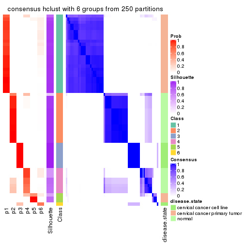</p>

</div>
</div>

Heatmaps for the membership of samples in all partitions to see how consistent they are:


<script>
$( function() {
	$( '#tabs-MAD-hclust-membership-heatmap' ).tabs();
} );
</script>
<div id='tabs-MAD-hclust-membership-heatmap'>
<ul>
<li><a href='#tab-MAD-hclust-membership-heatmap-1'>k = 2</a></li>
<li><a href='#tab-MAD-hclust-membership-heatmap-2'>k = 3</a></li>
<li><a href='#tab-MAD-hclust-membership-heatmap-3'>k = 4</a></li>
<li><a href='#tab-MAD-hclust-membership-heatmap-4'>k = 5</a></li>
<li><a href='#tab-MAD-hclust-membership-heatmap-5'>k = 6</a></li>
</ul>
<div id='tab-MAD-hclust-membership-heatmap-1'>
<pre><code class="r">membership_heatmap(res, k = 2)
</code></pre>

<p></p>

</div>
<div id='tab-MAD-hclust-membership-heatmap-2'>
<pre><code class="r">membership_heatmap(res, k = 3)
</code></pre>

<p></p>

</div>
<div id='tab-MAD-hclust-membership-heatmap-3'>
<pre><code class="r">membership_heatmap(res, k = 4)
</code></pre>

<p></p>

</div>
<div id='tab-MAD-hclust-membership-heatmap-4'>
<pre><code class="r">membership_heatmap(res, k = 5)
</code></pre>

<p></p>

</div>
<div id='tab-MAD-hclust-membership-heatmap-5'>
<pre><code class="r">membership_heatmap(res, k = 6)
</code></pre>

<p></p>

</div>
</div>

As soon as we have had the classes for columns, we can look for signatures
which are significantly different between classes which can be candidate marks
for certain classes. Following are the heatmaps for signatures.


Signature heatmaps where rows are scaled:


<script>
$( function() {
	$( '#tabs-MAD-hclust-get-signatures' ).tabs();
} );
</script>
<div id='tabs-MAD-hclust-get-signatures'>
<ul>
<li><a href='#tab-MAD-hclust-get-signatures-1'>k = 2</a></li>
<li><a href='#tab-MAD-hclust-get-signatures-2'>k = 3</a></li>
<li><a href='#tab-MAD-hclust-get-signatures-3'>k = 4</a></li>
<li><a href='#tab-MAD-hclust-get-signatures-4'>k = 5</a></li>
<li><a href='#tab-MAD-hclust-get-signatures-5'>k = 6</a></li>
</ul>
<div id='tab-MAD-hclust-get-signatures-1'>
<pre><code class="r">get_signatures(res, k = 2)
</code></pre>

<p></p>

</div>
<div id='tab-MAD-hclust-get-signatures-2'>
<pre><code class="r">get_signatures(res, k = 3)
</code></pre>

<p></p>

</div>
<div id='tab-MAD-hclust-get-signatures-3'>
<pre><code class="r">get_signatures(res, k = 4)
</code></pre>

<p></p>

</div>
<div id='tab-MAD-hclust-get-signatures-4'>
<pre><code class="r">get_signatures(res, k = 5)
</code></pre>

<p></p>

</div>
<div id='tab-MAD-hclust-get-signatures-5'>
<pre><code class="r">get_signatures(res, k = 6)
</code></pre>

<p></p>

</div>
</div>


Signature heatmaps where rows are not scaled:


<script>
$( function() {
	$( '#tabs-MAD-hclust-get-signatures-no-scale' ).tabs();
} );
</script>
<div id='tabs-MAD-hclust-get-signatures-no-scale'>
<ul>
<li><a href='#tab-MAD-hclust-get-signatures-no-scale-1'>k = 2</a></li>
<li><a href='#tab-MAD-hclust-get-signatures-no-scale-2'>k = 3</a></li>
<li><a href='#tab-MAD-hclust-get-signatures-no-scale-3'>k = 4</a></li>
<li><a href='#tab-MAD-hclust-get-signatures-no-scale-4'>k = 5</a></li>
<li><a href='#tab-MAD-hclust-get-signatures-no-scale-5'>k = 6</a></li>
</ul>
<div id='tab-MAD-hclust-get-signatures-no-scale-1'>
<pre><code class="r">get_signatures(res, k = 2, scale_rows = FALSE)
</code></pre>

<p></p>

</div>
<div id='tab-MAD-hclust-get-signatures-no-scale-2'>
<pre><code class="r">get_signatures(res, k = 3, scale_rows = FALSE)
</code></pre>

<p></p>

</div>
<div id='tab-MAD-hclust-get-signatures-no-scale-3'>
<pre><code class="r">get_signatures(res, k = 4, scale_rows = FALSE)
</code></pre>

<p></p>

</div>
<div id='tab-MAD-hclust-get-signatures-no-scale-4'>
<pre><code class="r">get_signatures(res, k = 5, scale_rows = FALSE)
</code></pre>

<p></p>

</div>
<div id='tab-MAD-hclust-get-signatures-no-scale-5'>
<pre><code class="r">get_signatures(res, k = 6, scale_rows = FALSE)
</code></pre>

<p></p>

</div>
</div>


Compare the overlap of signatures from different k:

```r
compare_signatures(res)
```


`get_signature()` returns a data frame invisibly. TO get the list of signatures, the function
call should be assigned to a variable explicitly. In following code, if `plot` argument is set
to `FALSE`, no heatmap is plotted while only the differential analysis is performed.

```r
# code only for demonstration
tb = get_signature(res, k = ..., plot = FALSE)
```

An example of the output of `tb` is:

```
#>   which_row         fdr    mean_1    mean_2 scaled_mean_1 scaled_mean_2 km
#> 1        38 0.042760348  8.373488  9.131774    -0.5533452     0.5164555  1
#> 2        40 0.018707592  7.106213  8.469186    -0.6173731     0.5762149  1
#> 3        55 0.019134737 10.221463 11.207825    -0.6159697     0.5749050  1
#> 4        59 0.006059896  5.921854  7.869574    -0.6899429     0.6439467  1
#> 5        60 0.018055526  8.928898 10.211722    -0.6204761     0.5791110  1
#> 6        98 0.009384629 15.714769 14.887706     0.6635654    -0.6193277  2
...
```

The columns in `tb` are:

1. `which_row`: row indices corresponding to the input matrix.
2. `fdr`: FDR for the differential test. 
3. `mean_x`: The mean value in group x.
4. `scaled_mean_x`: The mean value in group x after rows are scaled.
5. `km`: Row groups if k-means clustering is applied to rows.


UMAP plot which shows how samples are separated.


<script>
$( function() {
	$( '#tabs-MAD-hclust-dimension-reduction' ).tabs();
} );
</script>
<div id='tabs-MAD-hclust-dimension-reduction'>
<ul>
<li><a href='#tab-MAD-hclust-dimension-reduction-1'>k = 2</a></li>
<li><a href='#tab-MAD-hclust-dimension-reduction-2'>k = 3</a></li>
<li><a href='#tab-MAD-hclust-dimension-reduction-3'>k = 4</a></li>
<li><a href='#tab-MAD-hclust-dimension-reduction-4'>k = 5</a></li>
<li><a href='#tab-MAD-hclust-dimension-reduction-5'>k = 6</a></li>
</ul>
<div id='tab-MAD-hclust-dimension-reduction-1'>
<pre><code class="r">dimension_reduction(res, k = 2, method = &quot;UMAP&quot;)
</code></pre>

<p></p>

</div>
<div id='tab-MAD-hclust-dimension-reduction-2'>
<pre><code class="r">dimension_reduction(res, k = 3, method = &quot;UMAP&quot;)
</code></pre>

<p></p>

</div>
<div id='tab-MAD-hclust-dimension-reduction-3'>
<pre><code class="r">dimension_reduction(res, k = 4, method = &quot;UMAP&quot;)
</code></pre>

<p></p>

</div>
<div id='tab-MAD-hclust-dimension-reduction-4'>
<pre><code class="r">dimension_reduction(res, k = 5, method = &quot;UMAP&quot;)
</code></pre>

<p></p>

</div>
<div id='tab-MAD-hclust-dimension-reduction-5'>
<pre><code class="r">dimension_reduction(res, k = 6, method = &quot;UMAP&quot;)
</code></pre>

<p></p>

</div>
</div>


Following heatmap shows how subgroups are split when increasing `k`:

```r
collect_classes(res)
```


Test correlation between subgroups and known annotations. If the known
annotation is numeric, one-way ANOVA test is applied, and if the known
annotation is discrete, chi-squared contingency table test is applied.

```r
test_to_known_factors(res)
```

```
#>             n disease.state(p) k
#> MAD:hclust 46         2.27e-08 2
#> MAD:hclust 58         8.94e-20 3
#> MAD:hclust 57         2.14e-21 4
#> MAD:hclust 57         5.72e-21 5
#> MAD:hclust 58         2.22e-21 6
```


If matrix rows can be associated to genes, consider to use `GO_Enrichment(res,
...)` to perform function enrichment for the signature genes.


 

---------------------------------------------------


### MAD:kmeans**


The object with results only for a single top-value method and a single partition method 
can be extracted as:

```r
res = res_list["MAD", "kmeans"]
# you can also extract it by
# res = res_list["MAD:kmeans"]
```

A summary of `res` and all the functions that can be applied to it:

```r
res
```

```
#> A 'ConsensusPartition' object with k = 2, 3, 4, 5, 6.
#>   On a matrix with 21168 rows and 61 columns.
#>   Top rows (1000, 2000, 3000, 4000, 5000) are extracted by 'MAD' method.
#>   Subgroups are detected by 'kmeans' method.
#>   Performed in total 1250 partitions by row resampling.
#>   Best k for subgroups seems to be 4.
#> 
#> Following methods can be applied to this 'ConsensusPartition' object:
#>  [1] "cola_report"             "collect_classes"         "collect_plots"          
#>  [4] "collect_stats"           "colnames"                "compare_signatures"     
#>  [7] "consensus_heatmap"       "dimension_reduction"     "functional_enrichment"  
#> [10] "get_anno_col"            "get_anno"                "get_classes"            
#> [13] "get_consensus"           "get_matrix"              "get_membership"         
#> [16] "get_param"               "get_signatures"          "get_stats"              
#> [19] "is_best_k"               "is_stable_k"             "membership_heatmap"     
#> [22] "ncol"                    "nrow"                    "plot_ecdf"              
#> [25] "rownames"                "select_partition_number" "show"                   
#> [28] "suggest_best_k"          "test_to_known_factors"
```

`collect_plots()` function collects all the plots made from `res` for all `k` (number of partitions)
into one single page to provide an easy and fast comparison between different `k`.

```r
collect_plots(res)
```


The plots are:

- The first row: a plot of the ECDF (Empirical cumulative distribution
  function) curves of the consensus matrix for each `k` and the heatmap of
  predicted classes for each `k`.
- The second row: heatmaps of the consensus matrix for each `k`.
- The third row: heatmaps of the membership matrix for each `k`.
- The fouth row: heatmaps of the signatures for each `k`.

All the plots in panels can be made by individual functions and they are
plotted later in this section.

`select_partition_number()` produces several plots showing different
statistics for choosing "optimized" `k`. There are following statistics:

- ECDF curves of the consensus matrix for each `k`;
- 1-PAC. [The PAC
  score](https://en.wikipedia.org/wiki/Consensus_clustering#Over-interpretation_potential_of_consensus_clustering)
  measures the proportion of the ambiguous subgrouping.
- Mean silhouette score.
- Concordance. The mean probability of fiting the consensus class ids in all
  partitions.
- Area increased. Denote $A_k$ as the area under the ECDF curve for current
  `k`, the area increased is defined as $A_k - A_{k-1}$.
- Rand index. The percent of pairs of samples that are both in a same cluster
  or both are not in a same cluster in the partition of k and k-1.
- Jaccard index. The ratio of pairs of samples are both in a same cluster in
  the partition of k and k-1 and the pairs of samples are both in a same
  cluster in the partition k or k-1.

The detailed explanations of these statistics can be found in [the cola
vignette](http://bioconductor.org/packages/devel/bioc/vignettes/cola/inst/doc/cola.html#toc_13).

Generally speaking, lower PAC score, higher mean silhouette score or higher
concordance corresponds to better partition. Rand index and Jaccard index
measure how similar the current partition is compared to partition with `k-1`.
If they are too similar, we won't accept `k` is better than `k-1`.

```r
select_partition_number(res)
```


The numeric values for all these statistics can be obtained by `get_stats()`.

```r
get_stats(res)
```

```
#>   k 1-PAC mean_silhouette concordance area_increased  Rand Jaccard
#> 2 2 0.495           0.920       0.898         0.4427 0.515   0.515
#> 3 3 0.780           0.915       0.944         0.3854 0.757   0.579
#> 4 4 0.986           0.967       0.967         0.1480 0.867   0.673
#> 5 5 0.805           0.871       0.888         0.0705 1.000   1.000
#> 6 6 0.776           0.661       0.822         0.0456 0.940   0.794
```

`suggest_best_k()` suggests the best $k$ based on these statistics. The rules are as follows:

- All $k$ with Jaccard index larger than 0.95 are removed because the increase of
  the partition number does not provides enough extra information. If all $k$ are removed,
  the best $k$ is assigned by `NA`.
- For $k$ with 1-PAC larger than 0.9, the maximal $k$ is taken as the "best k". Other $k$ is called "optional k".
- If it does not fit the second rule. The $k$ with the highest vote of highest
  1-PAC, mean silhouette and concordance is taken as the "best k".

```r
suggest_best_k(res)
```

```
#> [1] 4
```


Following shows the table of the partitions (You need to click the **show/hide
code output** link to see it). The membership matrix (columns with name `p*`)
is inferred by
[`clue::cl_consensus()`](https://www.rdocumentation.org/link/cl_consensus?package=clue)
function with the `SE` method. Basically the value in the membership matrix
represents the probability to belong to a certain group. The finall class
label for an item is determined with the group with highest probability it
belongs to.

In `get_classes()` function, the entropy is calculated from the membership
matrix and the silhouette score is calculated from the consensus matrix.


<script>
$( function() {
	$( '#tabs-MAD-kmeans-get-classes' ).tabs();
} );
</script>
<div id='tabs-MAD-kmeans-get-classes'>
<ul>
<li><a href='#tab-MAD-kmeans-get-classes-1'>k = 2</a></li>
<li><a href='#tab-MAD-kmeans-get-classes-2'>k = 3</a></li>
<li><a href='#tab-MAD-kmeans-get-classes-3'>k = 4</a></li>
<li><a href='#tab-MAD-kmeans-get-classes-4'>k = 5</a></li>
<li><a href='#tab-MAD-kmeans-get-classes-5'>k = 6</a></li>
</ul>

<div id='tab-MAD-kmeans-get-classes-1'>
<p><a id='tab-MAD-kmeans-get-classes-1-a' style='color:#0366d6' href='#'>show/hide code output</a></p>
<pre><code class="r">cbind(get_classes(res, k = 2), get_membership(res, k = 2))
</code></pre>

<pre><code>#&gt;           class entropy silhouette    p1    p2
#&gt; GSM246087     1   0.311      0.787 0.944 0.056
#&gt; GSM246088     1   0.311      0.787 0.944 0.056
#&gt; GSM246089     1   0.311      0.787 0.944 0.056
#&gt; GSM246090     1   0.311      0.787 0.944 0.056
#&gt; GSM246119     1   0.311      0.787 0.944 0.056
#&gt; GSM246120     1   0.311      0.787 0.944 0.056
#&gt; GSM246121     1   0.311      0.787 0.944 0.056
#&gt; GSM246122     1   0.311      0.787 0.944 0.056
#&gt; GSM246123     1   0.311      0.787 0.944 0.056
#&gt; GSM246422     2   0.456      0.905 0.096 0.904
#&gt; GSM246423     2   0.456      0.905 0.096 0.904
#&gt; GSM246484     2   0.456      0.905 0.096 0.904
#&gt; GSM246485     2   0.327      0.934 0.060 0.940
#&gt; GSM246486     2   0.295      0.939 0.052 0.948
#&gt; GSM246487     2   0.443      0.909 0.092 0.908
#&gt; GSM246488     2   0.295      0.939 0.052 0.948
#&gt; GSM246489     2   0.000      0.972 0.000 1.000
#&gt; GSM246490     2   0.000      0.972 0.000 1.000
#&gt; GSM246491     2   0.000      0.972 0.000 1.000
#&gt; GSM247162     2   0.000      0.972 0.000 1.000
#&gt; GSM247163     2   0.000      0.972 0.000 1.000
#&gt; GSM247164     2   0.000      0.972 0.000 1.000
#&gt; GSM247165     2   0.000      0.972 0.000 1.000
#&gt; GSM247166     2   0.000      0.972 0.000 1.000
#&gt; GSM247168     2   0.000      0.972 0.000 1.000
#&gt; GSM247169     2   0.000      0.972 0.000 1.000
#&gt; GSM247171     2   0.000      0.972 0.000 1.000
#&gt; GSM247173     2   0.000      0.972 0.000 1.000
#&gt; GSM247174     2   0.000      0.972 0.000 1.000
#&gt; GSM247175     2   0.000      0.972 0.000 1.000
#&gt; GSM247188     2   0.000      0.972 0.000 1.000
#&gt; GSM247189     2   0.000      0.972 0.000 1.000
#&gt; GSM247190     2   0.000      0.972 0.000 1.000
#&gt; GSM247650     1   0.689      0.931 0.816 0.184
#&gt; GSM247651     1   0.689      0.931 0.816 0.184
#&gt; GSM247652     1   0.689      0.931 0.816 0.184
#&gt; GSM247653     1   0.689      0.931 0.816 0.184
#&gt; GSM247654     1   0.689      0.931 0.816 0.184
#&gt; GSM247655     1   0.689      0.931 0.816 0.184
#&gt; GSM247656     1   0.689      0.931 0.816 0.184
#&gt; GSM247657     1   0.689      0.931 0.816 0.184
#&gt; GSM247658     1   0.689      0.931 0.816 0.184
#&gt; GSM247659     1   0.689      0.931 0.816 0.184
#&gt; GSM247660     1   0.689      0.931 0.816 0.184
#&gt; GSM247661     1   0.689      0.931 0.816 0.184
#&gt; GSM247662     1   0.689      0.931 0.816 0.184
#&gt; GSM247663     1   0.689      0.931 0.816 0.184
#&gt; GSM247856     1   0.689      0.931 0.816 0.184
#&gt; GSM247857     1   0.689      0.931 0.816 0.184
#&gt; GSM247859     1   0.689      0.931 0.816 0.184
#&gt; GSM247860     1   0.689      0.931 0.816 0.184
#&gt; GSM247862     1   0.689      0.931 0.816 0.184
#&gt; GSM247864     1   0.689      0.931 0.816 0.184
#&gt; GSM247865     1   0.689      0.931 0.816 0.184
#&gt; GSM247866     1   0.689      0.931 0.816 0.184
#&gt; GSM247876     1   0.689      0.931 0.816 0.184
#&gt; GSM247877     1   0.689      0.931 0.816 0.184
#&gt; GSM247878     1   0.689      0.931 0.816 0.184
#&gt; GSM247879     1   0.689      0.931 0.816 0.184
#&gt; GSM247881     1   0.689      0.931 0.816 0.184
#&gt; GSM247883     1   0.689      0.931 0.816 0.184
</code></pre>

<script>
$('#tab-MAD-kmeans-get-classes-1-a').parent().next().next().hide();
$('#tab-MAD-kmeans-get-classes-1-a').click(function(){
  $('#tab-MAD-kmeans-get-classes-1-a').parent().next().next().toggle();
  return(false);
});
</script>
</div>

<div id='tab-MAD-kmeans-get-classes-2'>
<p><a id='tab-MAD-kmeans-get-classes-2-a' style='color:#0366d6' href='#'>show/hide code output</a></p>
<pre><code class="r">cbind(get_classes(res, k = 3), get_membership(res, k = 3))
</code></pre>

<pre><code>#&gt;           class entropy silhouette    p1    p2    p3
#&gt; GSM246087     3  0.0000      1.000 0.000 0.000 1.000
#&gt; GSM246088     3  0.0000      1.000 0.000 0.000 1.000
#&gt; GSM246089     3  0.0000      1.000 0.000 0.000 1.000
#&gt; GSM246090     3  0.0000      1.000 0.000 0.000 1.000
#&gt; GSM246119     3  0.0000      1.000 0.000 0.000 1.000
#&gt; GSM246120     3  0.0000      1.000 0.000 0.000 1.000
#&gt; GSM246121     3  0.0000      1.000 0.000 0.000 1.000
#&gt; GSM246122     3  0.0000      1.000 0.000 0.000 1.000
#&gt; GSM246123     3  0.0000      1.000 0.000 0.000 1.000
#&gt; GSM246422     1  0.2796      0.846 0.908 0.092 0.000
#&gt; GSM246423     1  0.2796      0.846 0.908 0.092 0.000
#&gt; GSM246484     1  0.2796      0.846 0.908 0.092 0.000
#&gt; GSM246485     2  0.6244      0.320 0.440 0.560 0.000
#&gt; GSM246486     2  0.3686      0.831 0.140 0.860 0.000
#&gt; GSM246487     1  0.2625      0.849 0.916 0.084 0.000
#&gt; GSM246488     2  0.3686      0.831 0.140 0.860 0.000
#&gt; GSM246489     2  0.0424      0.950 0.008 0.992 0.000
#&gt; GSM246490     2  0.0424      0.950 0.008 0.992 0.000
#&gt; GSM246491     2  0.0424      0.950 0.008 0.992 0.000
#&gt; GSM247162     2  0.0424      0.950 0.008 0.992 0.000
#&gt; GSM247163     2  0.0424      0.950 0.008 0.992 0.000
#&gt; GSM247164     2  0.0000      0.943 0.000 1.000 0.000
#&gt; GSM247165     2  0.0000      0.943 0.000 1.000 0.000
#&gt; GSM247166     2  0.0424      0.950 0.008 0.992 0.000
#&gt; GSM247168     2  0.0424      0.950 0.008 0.992 0.000
#&gt; GSM247169     2  0.0424      0.950 0.008 0.992 0.000
#&gt; GSM247171     2  0.0424      0.950 0.008 0.992 0.000
#&gt; GSM247173     2  0.0424      0.950 0.008 0.992 0.000
#&gt; GSM247174     2  0.0424      0.950 0.008 0.992 0.000
#&gt; GSM247175     2  0.0424      0.950 0.008 0.992 0.000
#&gt; GSM247188     2  0.0424      0.950 0.008 0.992 0.000
#&gt; GSM247189     2  0.2356      0.893 0.072 0.928 0.000
#&gt; GSM247190     2  0.0424      0.950 0.008 0.992 0.000
#&gt; GSM247650     1  0.3686      0.902 0.860 0.000 0.140
#&gt; GSM247651     1  0.0000      0.909 1.000 0.000 0.000
#&gt; GSM247652     1  0.3686      0.902 0.860 0.000 0.140
#&gt; GSM247653     1  0.3686      0.902 0.860 0.000 0.140
#&gt; GSM247654     1  0.3686      0.902 0.860 0.000 0.140
#&gt; GSM247655     1  0.0000      0.909 1.000 0.000 0.000
#&gt; GSM247656     1  0.3686      0.902 0.860 0.000 0.140
#&gt; GSM247657     1  0.3686      0.902 0.860 0.000 0.140
#&gt; GSM247658     1  0.2878      0.910 0.904 0.000 0.096
#&gt; GSM247659     1  0.3686      0.902 0.860 0.000 0.140
#&gt; GSM247660     1  0.0000      0.909 1.000 0.000 0.000
#&gt; GSM247661     1  0.3686      0.902 0.860 0.000 0.140
#&gt; GSM247662     1  0.3686      0.902 0.860 0.000 0.140
#&gt; GSM247663     1  0.3686      0.902 0.860 0.000 0.140
#&gt; GSM247856     1  0.3686      0.902 0.860 0.000 0.140
#&gt; GSM247857     1  0.3686      0.902 0.860 0.000 0.140
#&gt; GSM247859     1  0.0000      0.909 1.000 0.000 0.000
#&gt; GSM247860     1  0.3686      0.902 0.860 0.000 0.140
#&gt; GSM247862     1  0.0000      0.909 1.000 0.000 0.000
#&gt; GSM247864     1  0.0000      0.909 1.000 0.000 0.000
#&gt; GSM247865     1  0.0000      0.909 1.000 0.000 0.000
#&gt; GSM247866     1  0.0000      0.909 1.000 0.000 0.000
#&gt; GSM247876     1  0.2625      0.911 0.916 0.000 0.084
#&gt; GSM247877     1  0.0424      0.905 0.992 0.008 0.000
#&gt; GSM247878     1  0.0424      0.905 0.992 0.008 0.000
#&gt; GSM247879     1  0.3116      0.908 0.892 0.000 0.108
#&gt; GSM247881     1  0.0000      0.909 1.000 0.000 0.000
#&gt; GSM247883     1  0.0000      0.909 1.000 0.000 0.000
</code></pre>

<script>
$('#tab-MAD-kmeans-get-classes-2-a').parent().next().next().hide();
$('#tab-MAD-kmeans-get-classes-2-a').click(function(){
  $('#tab-MAD-kmeans-get-classes-2-a').parent().next().next().toggle();
  return(false);
});
</script>
</div>

<div id='tab-MAD-kmeans-get-classes-3'>
<p><a id='tab-MAD-kmeans-get-classes-3-a' style='color:#0366d6' href='#'>show/hide code output</a></p>
<pre><code class="r">cbind(get_classes(res, k = 4), get_membership(res, k = 4))
</code></pre>

<pre><code>#&gt;           class entropy silhouette    p1    p2    p3    p4
#&gt; GSM246087     3  0.1520      0.984 0.024 0.000 0.956 0.020
#&gt; GSM246088     3  0.1520      0.984 0.024 0.000 0.956 0.020
#&gt; GSM246089     3  0.1833      0.979 0.024 0.000 0.944 0.032
#&gt; GSM246090     3  0.1520      0.984 0.024 0.000 0.956 0.020
#&gt; GSM246119     3  0.1520      0.984 0.024 0.000 0.956 0.020
#&gt; GSM246120     3  0.1520      0.984 0.024 0.000 0.956 0.020
#&gt; GSM246121     3  0.0817      0.985 0.024 0.000 0.976 0.000
#&gt; GSM246122     3  0.1520      0.984 0.024 0.000 0.956 0.020
#&gt; GSM246123     3  0.1520      0.984 0.024 0.000 0.956 0.020
#&gt; GSM246422     4  0.2142      0.918 0.056 0.016 0.000 0.928
#&gt; GSM246423     4  0.2142      0.918 0.056 0.016 0.000 0.928
#&gt; GSM246484     4  0.2142      0.918 0.056 0.016 0.000 0.928
#&gt; GSM246485     4  0.3286      0.903 0.044 0.080 0.000 0.876
#&gt; GSM246486     4  0.2530      0.881 0.004 0.100 0.000 0.896
#&gt; GSM246487     4  0.2730      0.905 0.088 0.016 0.000 0.896
#&gt; GSM246488     4  0.1978      0.892 0.004 0.068 0.000 0.928
#&gt; GSM246489     2  0.0000      0.990 0.000 1.000 0.000 0.000
#&gt; GSM246490     2  0.0000      0.990 0.000 1.000 0.000 0.000
#&gt; GSM246491     2  0.0000      0.990 0.000 1.000 0.000 0.000
#&gt; GSM247162     2  0.0000      0.990 0.000 1.000 0.000 0.000
#&gt; GSM247163     2  0.0000      0.990 0.000 1.000 0.000 0.000
#&gt; GSM247164     2  0.0000      0.990 0.000 1.000 0.000 0.000
#&gt; GSM247165     2  0.0000      0.990 0.000 1.000 0.000 0.000
#&gt; GSM247166     2  0.1520      0.969 0.000 0.956 0.024 0.020
#&gt; GSM247168     2  0.1520      0.969 0.000 0.956 0.024 0.020
#&gt; GSM247169     2  0.1520      0.969 0.000 0.956 0.024 0.020
#&gt; GSM247171     2  0.0000      0.990 0.000 1.000 0.000 0.000
#&gt; GSM247173     2  0.0000      0.990 0.000 1.000 0.000 0.000
#&gt; GSM247174     2  0.1297      0.973 0.000 0.964 0.016 0.020
#&gt; GSM247175     2  0.0000      0.990 0.000 1.000 0.000 0.000
#&gt; GSM247188     2  0.0000      0.990 0.000 1.000 0.000 0.000
#&gt; GSM247189     4  0.2973      0.841 0.000 0.144 0.000 0.856
#&gt; GSM247190     2  0.0000      0.990 0.000 1.000 0.000 0.000
#&gt; GSM247650     1  0.0188      0.983 0.996 0.000 0.004 0.000
#&gt; GSM247651     1  0.1022      0.975 0.968 0.000 0.000 0.032
#&gt; GSM247652     1  0.0188      0.983 0.996 0.000 0.004 0.000
#&gt; GSM247653     1  0.0188      0.983 0.996 0.000 0.004 0.000
#&gt; GSM247654     1  0.0188      0.983 0.996 0.000 0.004 0.000
#&gt; GSM247655     1  0.1022      0.975 0.968 0.000 0.000 0.032
#&gt; GSM247656     1  0.0188      0.983 0.996 0.000 0.004 0.000
#&gt; GSM247657     1  0.0188      0.983 0.996 0.000 0.004 0.000
#&gt; GSM247658     1  0.0188      0.983 0.996 0.000 0.000 0.004
#&gt; GSM247659     1  0.0188      0.983 0.996 0.000 0.004 0.000
#&gt; GSM247660     1  0.1022      0.975 0.968 0.000 0.000 0.032
#&gt; GSM247661     1  0.0188      0.983 0.996 0.000 0.004 0.000
#&gt; GSM247662     1  0.0188      0.983 0.996 0.000 0.004 0.000
#&gt; GSM247663     1  0.0188      0.983 0.996 0.000 0.004 0.000
#&gt; GSM247856     1  0.0188      0.983 0.996 0.000 0.004 0.000
#&gt; GSM247857     1  0.0188      0.983 0.996 0.000 0.004 0.000
#&gt; GSM247859     1  0.1022      0.975 0.968 0.000 0.000 0.032
#&gt; GSM247860     1  0.0188      0.983 0.996 0.000 0.004 0.000
#&gt; GSM247862     1  0.0817      0.978 0.976 0.000 0.000 0.024
#&gt; GSM247864     1  0.1022      0.975 0.968 0.000 0.000 0.032
#&gt; GSM247865     1  0.1022      0.975 0.968 0.000 0.000 0.032
#&gt; GSM247866     1  0.0817      0.978 0.976 0.000 0.000 0.024
#&gt; GSM247876     1  0.0469      0.981 0.988 0.000 0.000 0.012
#&gt; GSM247877     4  0.3074      0.846 0.152 0.000 0.000 0.848
#&gt; GSM247878     4  0.2973      0.852 0.144 0.000 0.000 0.856
#&gt; GSM247879     1  0.0188      0.983 0.996 0.000 0.000 0.004
#&gt; GSM247881     1  0.0817      0.978 0.976 0.000 0.000 0.024
#&gt; GSM247883     1  0.1022      0.975 0.968 0.000 0.000 0.032
</code></pre>

<script>
$('#tab-MAD-kmeans-get-classes-3-a').parent().next().next().hide();
$('#tab-MAD-kmeans-get-classes-3-a').click(function(){
  $('#tab-MAD-kmeans-get-classes-3-a').parent().next().next().toggle();
  return(false);
});
</script>
</div>

<div id='tab-MAD-kmeans-get-classes-4'>
<p><a id='tab-MAD-kmeans-get-classes-4-a' style='color:#0366d6' href='#'>show/hide code output</a></p>
<pre><code class="r">cbind(get_classes(res, k = 5), get_membership(res, k = 5))
</code></pre>

<pre><code>#&gt;           class entropy silhouette    p1    p2    p3    p4    p5
#&gt; GSM246087     3  0.1270      0.966 0.000 0.000 0.948 0.000 0.052
#&gt; GSM246088     3  0.1270      0.966 0.000 0.000 0.948 0.000 0.052
#&gt; GSM246089     3  0.1768      0.939 0.000 0.000 0.924 0.004 0.072
#&gt; GSM246090     3  0.1270      0.966 0.000 0.000 0.948 0.000 0.052
#&gt; GSM246119     3  0.0671      0.966 0.000 0.000 0.980 0.004 0.016
#&gt; GSM246120     3  0.0671      0.966 0.000 0.000 0.980 0.004 0.016
#&gt; GSM246121     3  0.0000      0.968 0.000 0.000 1.000 0.000 0.000
#&gt; GSM246122     3  0.1270      0.966 0.000 0.000 0.948 0.000 0.052
#&gt; GSM246123     3  0.0671      0.966 0.000 0.000 0.980 0.004 0.016
#&gt; GSM246422     4  0.2707      0.823 0.000 0.008 0.000 0.860 0.132
#&gt; GSM246423     4  0.2707      0.823 0.000 0.008 0.000 0.860 0.132
#&gt; GSM246484     4  0.2707      0.823 0.000 0.008 0.000 0.860 0.132
#&gt; GSM246485     4  0.2956      0.803 0.020 0.096 0.000 0.872 0.012
#&gt; GSM246486     4  0.2130      0.812 0.000 0.080 0.000 0.908 0.012
#&gt; GSM246487     4  0.2633      0.799 0.068 0.012 0.000 0.896 0.024
#&gt; GSM246488     4  0.0404      0.823 0.000 0.012 0.000 0.988 0.000
#&gt; GSM246489     2  0.0000      0.955 0.000 1.000 0.000 0.000 0.000
#&gt; GSM246490     2  0.0000      0.955 0.000 1.000 0.000 0.000 0.000
#&gt; GSM246491     2  0.0000      0.955 0.000 1.000 0.000 0.000 0.000
#&gt; GSM247162     2  0.0000      0.955 0.000 1.000 0.000 0.000 0.000
#&gt; GSM247163     2  0.0510      0.947 0.000 0.984 0.000 0.016 0.000
#&gt; GSM247164     2  0.0000      0.955 0.000 1.000 0.000 0.000 0.000
#&gt; GSM247165     2  0.1544      0.908 0.000 0.932 0.000 0.068 0.000
#&gt; GSM247166     2  0.2966      0.860 0.000 0.816 0.000 0.000 0.184
#&gt; GSM247168     2  0.2966      0.860 0.000 0.816 0.000 0.000 0.184
#&gt; GSM247169     2  0.2966      0.860 0.000 0.816 0.000 0.000 0.184
#&gt; GSM247171     2  0.0000      0.955 0.000 1.000 0.000 0.000 0.000
#&gt; GSM247173     2  0.0000      0.955 0.000 1.000 0.000 0.000 0.000
#&gt; GSM247174     2  0.1671      0.926 0.000 0.924 0.000 0.000 0.076
#&gt; GSM247175     2  0.0162      0.954 0.000 0.996 0.000 0.000 0.004
#&gt; GSM247188     2  0.0609      0.950 0.000 0.980 0.000 0.000 0.020
#&gt; GSM247189     4  0.2561      0.777 0.000 0.144 0.000 0.856 0.000
#&gt; GSM247190     2  0.0703      0.949 0.000 0.976 0.000 0.000 0.024
#&gt; GSM247650     1  0.2074      0.850 0.896 0.000 0.000 0.000 0.104
#&gt; GSM247651     1  0.2763      0.834 0.848 0.000 0.000 0.004 0.148
#&gt; GSM247652     1  0.2471      0.857 0.864 0.000 0.000 0.000 0.136
#&gt; GSM247653     1  0.3816      0.783 0.696 0.000 0.000 0.000 0.304
#&gt; GSM247654     1  0.2929      0.843 0.820 0.000 0.000 0.000 0.180
#&gt; GSM247655     1  0.2674      0.838 0.856 0.000 0.000 0.004 0.140
#&gt; GSM247656     1  0.2561      0.856 0.856 0.000 0.000 0.000 0.144
#&gt; GSM247657     1  0.2648      0.853 0.848 0.000 0.000 0.000 0.152
#&gt; GSM247658     1  0.2966      0.849 0.816 0.000 0.000 0.000 0.184
#&gt; GSM247659     1  0.2179      0.866 0.888 0.000 0.000 0.000 0.112
#&gt; GSM247660     1  0.2763      0.834 0.848 0.000 0.000 0.004 0.148
#&gt; GSM247661     1  0.3816      0.783 0.696 0.000 0.000 0.000 0.304
#&gt; GSM247662     1  0.1544      0.871 0.932 0.000 0.000 0.000 0.068
#&gt; GSM247663     1  0.2648      0.855 0.848 0.000 0.000 0.000 0.152
#&gt; GSM247856     1  0.1965      0.868 0.904 0.000 0.000 0.000 0.096
#&gt; GSM247857     1  0.1544      0.871 0.932 0.000 0.000 0.000 0.068
#&gt; GSM247859     1  0.1205      0.867 0.956 0.000 0.000 0.004 0.040
#&gt; GSM247860     1  0.3816      0.783 0.696 0.000 0.000 0.000 0.304
#&gt; GSM247862     1  0.1608      0.875 0.928 0.000 0.000 0.000 0.072
#&gt; GSM247864     1  0.2674      0.838 0.856 0.000 0.000 0.004 0.140
#&gt; GSM247865     1  0.1357      0.866 0.948 0.000 0.000 0.004 0.048
#&gt; GSM247866     1  0.3752      0.786 0.708 0.000 0.000 0.000 0.292
#&gt; GSM247876     1  0.2929      0.823 0.820 0.000 0.000 0.000 0.180
#&gt; GSM247877     4  0.5990      0.618 0.116 0.000 0.000 0.500 0.384
#&gt; GSM247878     4  0.5996      0.624 0.120 0.000 0.000 0.512 0.368
#&gt; GSM247879     1  0.3612      0.747 0.732 0.000 0.000 0.000 0.268
#&gt; GSM247881     1  0.0609      0.872 0.980 0.000 0.000 0.000 0.020
#&gt; GSM247883     1  0.1205      0.867 0.956 0.000 0.000 0.004 0.040
</code></pre>

<script>
$('#tab-MAD-kmeans-get-classes-4-a').parent().next().next().hide();
$('#tab-MAD-kmeans-get-classes-4-a').click(function(){
  $('#tab-MAD-kmeans-get-classes-4-a').parent().next().next().toggle();
  return(false);
});
</script>
</div>

<div id='tab-MAD-kmeans-get-classes-5'>
<p><a id='tab-MAD-kmeans-get-classes-5-a' style='color:#0366d6' href='#'>show/hide code output</a></p>
<pre><code class="r">cbind(get_classes(res, k = 6), get_membership(res, k = 6))
</code></pre>

<pre><code>#&gt;           class entropy silhouette    p1    p2    p3    p4    p5    p6
#&gt; GSM246087     3  0.1867     0.9366 0.000 0.000 0.916 0.000 0.020 0.064
#&gt; GSM246088     3  0.1867     0.9366 0.000 0.000 0.916 0.000 0.020 0.064
#&gt; GSM246089     3  0.2688     0.8932 0.000 0.000 0.868 0.000 0.068 0.064
#&gt; GSM246090     3  0.1867     0.9366 0.000 0.000 0.916 0.000 0.020 0.064
#&gt; GSM246119     3  0.1168     0.9350 0.000 0.000 0.956 0.000 0.028 0.016
#&gt; GSM246120     3  0.1168     0.9350 0.000 0.000 0.956 0.000 0.028 0.016
#&gt; GSM246121     3  0.0000     0.9396 0.000 0.000 1.000 0.000 0.000 0.000
#&gt; GSM246122     3  0.1867     0.9366 0.000 0.000 0.916 0.000 0.020 0.064
#&gt; GSM246123     3  0.1168     0.9350 0.000 0.000 0.956 0.000 0.028 0.016
#&gt; GSM246422     4  0.3852     0.6904 0.004 0.000 0.000 0.740 0.224 0.032
#&gt; GSM246423     4  0.3852     0.6904 0.004 0.000 0.000 0.740 0.224 0.032
#&gt; GSM246484     4  0.3852     0.6904 0.004 0.000 0.000 0.740 0.224 0.032
#&gt; GSM246485     4  0.2508     0.7661 0.004 0.068 0.000 0.892 0.024 0.012
#&gt; GSM246486     4  0.1863     0.7781 0.000 0.060 0.000 0.920 0.016 0.004
#&gt; GSM246487     4  0.2082     0.7417 0.052 0.004 0.000 0.916 0.020 0.008
#&gt; GSM246488     4  0.0603     0.7809 0.000 0.016 0.000 0.980 0.004 0.000
#&gt; GSM246489     2  0.0551     0.9027 0.000 0.984 0.000 0.008 0.004 0.004
#&gt; GSM246490     2  0.1511     0.8962 0.000 0.944 0.000 0.012 0.032 0.012
#&gt; GSM246491     2  0.1605     0.8951 0.000 0.940 0.000 0.012 0.032 0.016
#&gt; GSM247162     2  0.0260     0.9019 0.000 0.992 0.000 0.008 0.000 0.000
#&gt; GSM247163     2  0.2024     0.8863 0.000 0.920 0.000 0.028 0.036 0.016
#&gt; GSM247164     2  0.1773     0.8922 0.000 0.932 0.000 0.016 0.036 0.016
#&gt; GSM247165     2  0.2507     0.8681 0.000 0.892 0.000 0.056 0.036 0.016
#&gt; GSM247166     2  0.4771     0.7041 0.000 0.652 0.000 0.000 0.100 0.248
#&gt; GSM247168     2  0.4771     0.7041 0.000 0.652 0.000 0.000 0.100 0.248
#&gt; GSM247169     2  0.4729     0.7040 0.000 0.656 0.000 0.000 0.096 0.248
#&gt; GSM247171     2  0.0551     0.9015 0.000 0.984 0.000 0.008 0.004 0.004
#&gt; GSM247173     2  0.0000     0.9021 0.000 1.000 0.000 0.000 0.000 0.000
#&gt; GSM247174     2  0.2822     0.8405 0.000 0.852 0.000 0.000 0.040 0.108
#&gt; GSM247175     2  0.0146     0.9016 0.000 0.996 0.000 0.000 0.000 0.004
#&gt; GSM247188     2  0.0993     0.8950 0.000 0.964 0.000 0.000 0.012 0.024
#&gt; GSM247189     4  0.3313     0.6883 0.000 0.140 0.000 0.820 0.024 0.016
#&gt; GSM247190     2  0.0935     0.8963 0.000 0.964 0.000 0.000 0.004 0.032
#&gt; GSM247650     1  0.3044     0.5673 0.836 0.000 0.000 0.000 0.116 0.048
#&gt; GSM247651     1  0.3719     0.5637 0.792 0.000 0.000 0.012 0.148 0.048
#&gt; GSM247652     1  0.2738     0.3449 0.820 0.000 0.000 0.000 0.004 0.176
#&gt; GSM247653     6  0.3851     0.9895 0.460 0.000 0.000 0.000 0.000 0.540
#&gt; GSM247654     1  0.3769    -0.3755 0.640 0.000 0.000 0.000 0.004 0.356
#&gt; GSM247655     1  0.3563     0.5728 0.808 0.000 0.000 0.012 0.132 0.048
#&gt; GSM247656     1  0.3440     0.2936 0.776 0.000 0.000 0.000 0.028 0.196
#&gt; GSM247657     1  0.3253     0.3284 0.788 0.000 0.000 0.000 0.020 0.192
#&gt; GSM247658     1  0.3482    -0.1714 0.684 0.000 0.000 0.000 0.000 0.316
#&gt; GSM247659     1  0.3417     0.3861 0.796 0.000 0.000 0.000 0.044 0.160
#&gt; GSM247660     1  0.3719     0.5637 0.792 0.000 0.000 0.012 0.148 0.048
#&gt; GSM247661     6  0.3847     0.9863 0.456 0.000 0.000 0.000 0.000 0.544
#&gt; GSM247662     1  0.2889     0.4819 0.848 0.000 0.000 0.000 0.044 0.108
#&gt; GSM247663     1  0.4121     0.4676 0.748 0.000 0.000 0.000 0.116 0.136
#&gt; GSM247856     1  0.1806     0.5152 0.908 0.000 0.000 0.000 0.004 0.088
#&gt; GSM247857     1  0.2889     0.4819 0.848 0.000 0.000 0.000 0.044 0.108
#&gt; GSM247859     1  0.1434     0.5962 0.948 0.000 0.000 0.012 0.028 0.012
#&gt; GSM247860     6  0.3854     0.9858 0.464 0.000 0.000 0.000 0.000 0.536
#&gt; GSM247862     1  0.3725     0.4586 0.776 0.000 0.000 0.004 0.048 0.172
#&gt; GSM247864     1  0.3583     0.5679 0.800 0.000 0.000 0.008 0.144 0.048
#&gt; GSM247865     1  0.1787     0.5932 0.932 0.000 0.000 0.020 0.032 0.016
#&gt; GSM247866     1  0.5270    -0.2221 0.548 0.000 0.000 0.004 0.096 0.352
#&gt; GSM247876     1  0.4527     0.3784 0.660 0.000 0.000 0.000 0.272 0.068
#&gt; GSM247877     5  0.4164     0.4721 0.040 0.000 0.000 0.220 0.728 0.012
#&gt; GSM247878     5  0.4255     0.4688 0.068 0.000 0.000 0.224 0.708 0.000
#&gt; GSM247879     5  0.5045    -0.0804 0.412 0.000 0.000 0.000 0.512 0.076
#&gt; GSM247881     1  0.0891     0.5874 0.968 0.000 0.000 0.000 0.024 0.008
#&gt; GSM247883     1  0.1622     0.5941 0.940 0.000 0.000 0.016 0.028 0.016
</code></pre>

<script>
$('#tab-MAD-kmeans-get-classes-5-a').parent().next().next().hide();
$('#tab-MAD-kmeans-get-classes-5-a').click(function(){
  $('#tab-MAD-kmeans-get-classes-5-a').parent().next().next().toggle();
  return(false);
});
</script>
</div>
</div>

Heatmaps for the consensus matrix. It visualizes the probability of two
samples to be in a same group.


<script>
$( function() {
	$( '#tabs-MAD-kmeans-consensus-heatmap' ).tabs();
} );
</script>
<div id='tabs-MAD-kmeans-consensus-heatmap'>
<ul>
<li><a href='#tab-MAD-kmeans-consensus-heatmap-1'>k = 2</a></li>
<li><a href='#tab-MAD-kmeans-consensus-heatmap-2'>k = 3</a></li>
<li><a href='#tab-MAD-kmeans-consensus-heatmap-3'>k = 4</a></li>
<li><a href='#tab-MAD-kmeans-consensus-heatmap-4'>k = 5</a></li>
<li><a href='#tab-MAD-kmeans-consensus-heatmap-5'>k = 6</a></li>
</ul>
<div id='tab-MAD-kmeans-consensus-heatmap-1'>
<pre><code class="r">consensus_heatmap(res, k = 2)
</code></pre>

<p></p>

</div>
<div id='tab-MAD-kmeans-consensus-heatmap-2'>
<pre><code class="r">consensus_heatmap(res, k = 3)
</code></pre>

<p></p>

</div>
<div id='tab-MAD-kmeans-consensus-heatmap-3'>
<pre><code class="r">consensus_heatmap(res, k = 4)
</code></pre>

<p></p>

</div>
<div id='tab-MAD-kmeans-consensus-heatmap-4'>
<pre><code class="r">consensus_heatmap(res, k = 5)
</code></pre>

<p></p>

</div>
<div id='tab-MAD-kmeans-consensus-heatmap-5'>
<pre><code class="r">consensus_heatmap(res, k = 6)
</code></pre>

<p></p>

</div>
</div>

Heatmaps for the membership of samples in all partitions to see how consistent they are:


<script>
$( function() {
	$( '#tabs-MAD-kmeans-membership-heatmap' ).tabs();
} );
</script>
<div id='tabs-MAD-kmeans-membership-heatmap'>
<ul>
<li><a href='#tab-MAD-kmeans-membership-heatmap-1'>k = 2</a></li>
<li><a href='#tab-MAD-kmeans-membership-heatmap-2'>k = 3</a></li>
<li><a href='#tab-MAD-kmeans-membership-heatmap-3'>k = 4</a></li>
<li><a href='#tab-MAD-kmeans-membership-heatmap-4'>k = 5</a></li>
<li><a href='#tab-MAD-kmeans-membership-heatmap-5'>k = 6</a></li>
</ul>
<div id='tab-MAD-kmeans-membership-heatmap-1'>
<pre><code class="r">membership_heatmap(res, k = 2)
</code></pre>

<p></p>

</div>
<div id='tab-MAD-kmeans-membership-heatmap-2'>
<pre><code class="r">membership_heatmap(res, k = 3)
</code></pre>

<p></p>

</div>
<div id='tab-MAD-kmeans-membership-heatmap-3'>
<pre><code class="r">membership_heatmap(res, k = 4)
</code></pre>

<p></p>

</div>
<div id='tab-MAD-kmeans-membership-heatmap-4'>
<pre><code class="r">membership_heatmap(res, k = 5)
</code></pre>

<p></p>

</div>
<div id='tab-MAD-kmeans-membership-heatmap-5'>
<pre><code class="r">membership_heatmap(res, k = 6)
</code></pre>

<p>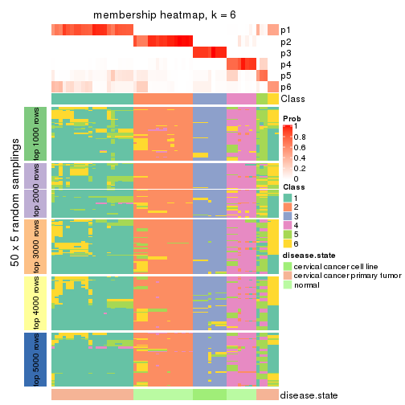</p>

</div>
</div>

As soon as we have had the classes for columns, we can look for signatures
which are significantly different between classes which can be candidate marks
for certain classes. Following are the heatmaps for signatures.


Signature heatmaps where rows are scaled:


<script>
$( function() {
	$( '#tabs-MAD-kmeans-get-signatures' ).tabs();
} );
</script>
<div id='tabs-MAD-kmeans-get-signatures'>
<ul>
<li><a href='#tab-MAD-kmeans-get-signatures-1'>k = 2</a></li>
<li><a href='#tab-MAD-kmeans-get-signatures-2'>k = 3</a></li>
<li><a href='#tab-MAD-kmeans-get-signatures-3'>k = 4</a></li>
<li><a href='#tab-MAD-kmeans-get-signatures-4'>k = 5</a></li>
<li><a href='#tab-MAD-kmeans-get-signatures-5'>k = 6</a></li>
</ul>
<div id='tab-MAD-kmeans-get-signatures-1'>
<pre><code class="r">get_signatures(res, k = 2)
</code></pre>

<p></p>

</div>
<div id='tab-MAD-kmeans-get-signatures-2'>
<pre><code class="r">get_signatures(res, k = 3)
</code></pre>

<p></p>

</div>
<div id='tab-MAD-kmeans-get-signatures-3'>
<pre><code class="r">get_signatures(res, k = 4)
</code></pre>

<p></p>

</div>
<div id='tab-MAD-kmeans-get-signatures-4'>
<pre><code class="r">get_signatures(res, k = 5)
</code></pre>

<p></p>

</div>
<div id='tab-MAD-kmeans-get-signatures-5'>
<pre><code class="r">get_signatures(res, k = 6)
</code></pre>

<p></p>

</div>
</div>


Signature heatmaps where rows are not scaled:


<script>
$( function() {
	$( '#tabs-MAD-kmeans-get-signatures-no-scale' ).tabs();
} );
</script>
<div id='tabs-MAD-kmeans-get-signatures-no-scale'>
<ul>
<li><a href='#tab-MAD-kmeans-get-signatures-no-scale-1'>k = 2</a></li>
<li><a href='#tab-MAD-kmeans-get-signatures-no-scale-2'>k = 3</a></li>
<li><a href='#tab-MAD-kmeans-get-signatures-no-scale-3'>k = 4</a></li>
<li><a href='#tab-MAD-kmeans-get-signatures-no-scale-4'>k = 5</a></li>
<li><a href='#tab-MAD-kmeans-get-signatures-no-scale-5'>k = 6</a></li>
</ul>
<div id='tab-MAD-kmeans-get-signatures-no-scale-1'>
<pre><code class="r">get_signatures(res, k = 2, scale_rows = FALSE)
</code></pre>

<p></p>

</div>
<div id='tab-MAD-kmeans-get-signatures-no-scale-2'>
<pre><code class="r">get_signatures(res, k = 3, scale_rows = FALSE)
</code></pre>

<p></p>

</div>
<div id='tab-MAD-kmeans-get-signatures-no-scale-3'>
<pre><code class="r">get_signatures(res, k = 4, scale_rows = FALSE)
</code></pre>

<p></p>

</div>
<div id='tab-MAD-kmeans-get-signatures-no-scale-4'>
<pre><code class="r">get_signatures(res, k = 5, scale_rows = FALSE)
</code></pre>

<p></p>

</div>
<div id='tab-MAD-kmeans-get-signatures-no-scale-5'>
<pre><code class="r">get_signatures(res, k = 6, scale_rows = FALSE)
</code></pre>

<p></p>

</div>
</div>


Compare the overlap of signatures from different k:

```r
compare_signatures(res)
```


`get_signature()` returns a data frame invisibly. TO get the list of signatures, the function
call should be assigned to a variable explicitly. In following code, if `plot` argument is set
to `FALSE`, no heatmap is plotted while only the differential analysis is performed.

```r
# code only for demonstration
tb = get_signature(res, k = ..., plot = FALSE)
```

An example of the output of `tb` is:

```
#>   which_row         fdr    mean_1    mean_2 scaled_mean_1 scaled_mean_2 km
#> 1        38 0.042760348  8.373488  9.131774    -0.5533452     0.5164555  1
#> 2        40 0.018707592  7.106213  8.469186    -0.6173731     0.5762149  1
#> 3        55 0.019134737 10.221463 11.207825    -0.6159697     0.5749050  1
#> 4        59 0.006059896  5.921854  7.869574    -0.6899429     0.6439467  1
#> 5        60 0.018055526  8.928898 10.211722    -0.6204761     0.5791110  1
#> 6        98 0.009384629 15.714769 14.887706     0.6635654    -0.6193277  2
...
```

The columns in `tb` are:

1. `which_row`: row indices corresponding to the input matrix.
2. `fdr`: FDR for the differential test. 
3. `mean_x`: The mean value in group x.
4. `scaled_mean_x`: The mean value in group x after rows are scaled.
5. `km`: Row groups if k-means clustering is applied to rows.


UMAP plot which shows how samples are separated.


<script>
$( function() {
	$( '#tabs-MAD-kmeans-dimension-reduction' ).tabs();
} );
</script>
<div id='tabs-MAD-kmeans-dimension-reduction'>
<ul>
<li><a href='#tab-MAD-kmeans-dimension-reduction-1'>k = 2</a></li>
<li><a href='#tab-MAD-kmeans-dimension-reduction-2'>k = 3</a></li>
<li><a href='#tab-MAD-kmeans-dimension-reduction-3'>k = 4</a></li>
<li><a href='#tab-MAD-kmeans-dimension-reduction-4'>k = 5</a></li>
<li><a href='#tab-MAD-kmeans-dimension-reduction-5'>k = 6</a></li>
</ul>
<div id='tab-MAD-kmeans-dimension-reduction-1'>
<pre><code class="r">dimension_reduction(res, k = 2, method = &quot;UMAP&quot;)
</code></pre>

<p></p>

</div>
<div id='tab-MAD-kmeans-dimension-reduction-2'>
<pre><code class="r">dimension_reduction(res, k = 3, method = &quot;UMAP&quot;)
</code></pre>

<p></p>

</div>
<div id='tab-MAD-kmeans-dimension-reduction-3'>
<pre><code class="r">dimension_reduction(res, k = 4, method = &quot;UMAP&quot;)
</code></pre>

<p></p>

</div>
<div id='tab-MAD-kmeans-dimension-reduction-4'>
<pre><code class="r">dimension_reduction(res, k = 5, method = &quot;UMAP&quot;)
</code></pre>

<p></p>

</div>
<div id='tab-MAD-kmeans-dimension-reduction-5'>
<pre><code class="r">dimension_reduction(res, k = 6, method = &quot;UMAP&quot;)
</code></pre>

<p></p>

</div>
</div>


Following heatmap shows how subgroups are split when increasing `k`:

```r
collect_classes(res)
```


Test correlation between subgroups and known annotations. If the known
annotation is numeric, one-way ANOVA test is applied, and if the known
annotation is discrete, chi-squared contingency table test is applied.

```r
test_to_known_factors(res)
```

```
#>             n disease.state(p) k
#> MAD:kmeans 61         5.68e-14 2
#> MAD:kmeans 60         1.88e-21 3
#> MAD:kmeans 61         2.38e-22 4
#> MAD:kmeans 61         2.38e-22 5
#> MAD:kmeans 46         1.82e-16 6
```


If matrix rows can be associated to genes, consider to use `GO_Enrichment(res,
...)` to perform function enrichment for the signature genes.


 

---------------------------------------------------


### MAD:skmeans**


The object with results only for a single top-value method and a single partition method 
can be extracted as:

```r
res = res_list["MAD", "skmeans"]
# you can also extract it by
# res = res_list["MAD:skmeans"]
```

A summary of `res` and all the functions that can be applied to it:

```r
res
```

```
#> A 'ConsensusPartition' object with k = 2, 3, 4, 5, 6.
#>   On a matrix with 21168 rows and 61 columns.
#>   Top rows (1000, 2000, 3000, 4000, 5000) are extracted by 'MAD' method.
#>   Subgroups are detected by 'skmeans' method.
#>   Performed in total 1250 partitions by row resampling.
#>   Best k for subgroups seems to be 2.
#> 
#> Following methods can be applied to this 'ConsensusPartition' object:
#>  [1] "cola_report"             "collect_classes"         "collect_plots"          
#>  [4] "collect_stats"           "colnames"                "compare_signatures"     
#>  [7] "consensus_heatmap"       "dimension_reduction"     "functional_enrichment"  
#> [10] "get_anno_col"            "get_anno"                "get_classes"            
#> [13] "get_consensus"           "get_matrix"              "get_membership"         
#> [16] "get_param"               "get_signatures"          "get_stats"              
#> [19] "is_best_k"               "is_stable_k"             "membership_heatmap"     
#> [22] "ncol"                    "nrow"                    "plot_ecdf"              
#> [25] "rownames"                "select_partition_number" "show"                   
#> [28] "suggest_best_k"          "test_to_known_factors"
```

`collect_plots()` function collects all the plots made from `res` for all `k` (number of partitions)
into one single page to provide an easy and fast comparison between different `k`.

```r
collect_plots(res)
```


The plots are:

- The first row: a plot of the ECDF (Empirical cumulative distribution
  function) curves of the consensus matrix for each `k` and the heatmap of
  predicted classes for each `k`.
- The second row: heatmaps of the consensus matrix for each `k`.
- The third row: heatmaps of the membership matrix for each `k`.
- The fouth row: heatmaps of the signatures for each `k`.

All the plots in panels can be made by individual functions and they are
plotted later in this section.

`select_partition_number()` produces several plots showing different
statistics for choosing "optimized" `k`. There are following statistics:

- ECDF curves of the consensus matrix for each `k`;
- 1-PAC. [The PAC
  score](https://en.wikipedia.org/wiki/Consensus_clustering#Over-interpretation_potential_of_consensus_clustering)
  measures the proportion of the ambiguous subgrouping.
- Mean silhouette score.
- Concordance. The mean probability of fiting the consensus class ids in all
  partitions.
- Area increased. Denote $A_k$ as the area under the ECDF curve for current
  `k`, the area increased is defined as $A_k - A_{k-1}$.
- Rand index. The percent of pairs of samples that are both in a same cluster
  or both are not in a same cluster in the partition of k and k-1.
- Jaccard index. The ratio of pairs of samples are both in a same cluster in
  the partition of k and k-1 and the pairs of samples are both in a same
  cluster in the partition k or k-1.

The detailed explanations of these statistics can be found in [the cola
vignette](http://bioconductor.org/packages/devel/bioc/vignettes/cola/inst/doc/cola.html#toc_13).

Generally speaking, lower PAC score, higher mean silhouette score or higher
concordance corresponds to better partition. Rand index and Jaccard index
measure how similar the current partition is compared to partition with `k-1`.
If they are too similar, we won't accept `k` is better than `k-1`.

```r
select_partition_number(res)
```


The numeric values for all these statistics can be obtained by `get_stats()`.

```r
get_stats(res)
```

```
#>   k 1-PAC mean_silhouette concordance area_increased  Rand Jaccard
#> 2 2 1.000           0.976       0.991         0.4891 0.515   0.515
#> 3 3 0.722           0.853       0.930         0.3722 0.733   0.517
#> 4 4 0.835           0.854       0.936         0.1015 0.784   0.464
#> 5 5 0.784           0.688       0.847         0.0769 0.893   0.632
#> 6 6 0.794           0.625       0.792         0.0345 0.954   0.787
```

`suggest_best_k()` suggests the best $k$ based on these statistics. The rules are as follows:

- All $k$ with Jaccard index larger than 0.95 are removed because the increase of
  the partition number does not provides enough extra information. If all $k$ are removed,
  the best $k$ is assigned by `NA`.
- For $k$ with 1-PAC larger than 0.9, the maximal $k$ is taken as the "best k". Other $k$ is called "optional k".
- If it does not fit the second rule. The $k$ with the highest vote of highest
  1-PAC, mean silhouette and concordance is taken as the "best k".

```r
suggest_best_k(res)
```

```
#> [1] 2
```


Following shows the table of the partitions (You need to click the **show/hide
code output** link to see it). The membership matrix (columns with name `p*`)
is inferred by
[`clue::cl_consensus()`](https://www.rdocumentation.org/link/cl_consensus?package=clue)
function with the `SE` method. Basically the value in the membership matrix
represents the probability to belong to a certain group. The finall class
label for an item is determined with the group with highest probability it
belongs to.

In `get_classes()` function, the entropy is calculated from the membership
matrix and the silhouette score is calculated from the consensus matrix.


<script>
$( function() {
	$( '#tabs-MAD-skmeans-get-classes' ).tabs();
} );
</script>
<div id='tabs-MAD-skmeans-get-classes'>
<ul>
<li><a href='#tab-MAD-skmeans-get-classes-1'>k = 2</a></li>
<li><a href='#tab-MAD-skmeans-get-classes-2'>k = 3</a></li>
<li><a href='#tab-MAD-skmeans-get-classes-3'>k = 4</a></li>
<li><a href='#tab-MAD-skmeans-get-classes-4'>k = 5</a></li>
<li><a href='#tab-MAD-skmeans-get-classes-5'>k = 6</a></li>
</ul>

<div id='tab-MAD-skmeans-get-classes-1'>
<p><a id='tab-MAD-skmeans-get-classes-1-a' style='color:#0366d6' href='#'>show/hide code output</a></p>
<pre><code class="r">cbind(get_classes(res, k = 2), get_membership(res, k = 2))
</code></pre>

<pre><code>#&gt;           class entropy silhouette    p1    p2
#&gt; GSM246087     1   0.000     0.9853 1.000 0.000
#&gt; GSM246088     1   0.000     0.9853 1.000 0.000
#&gt; GSM246089     1   0.000     0.9853 1.000 0.000
#&gt; GSM246090     1   0.000     0.9853 1.000 0.000
#&gt; GSM246119     1   0.000     0.9853 1.000 0.000
#&gt; GSM246120     1   0.000     0.9853 1.000 0.000
#&gt; GSM246121     1   0.000     0.9853 1.000 0.000
#&gt; GSM246122     1   0.000     0.9853 1.000 0.000
#&gt; GSM246123     1   0.000     0.9853 1.000 0.000
#&gt; GSM246422     2   0.000     1.0000 0.000 1.000
#&gt; GSM246423     2   0.000     1.0000 0.000 1.000
#&gt; GSM246484     2   0.000     1.0000 0.000 1.000
#&gt; GSM246485     2   0.000     1.0000 0.000 1.000
#&gt; GSM246486     2   0.000     1.0000 0.000 1.000
#&gt; GSM246487     2   0.000     1.0000 0.000 1.000
#&gt; GSM246488     2   0.000     1.0000 0.000 1.000
#&gt; GSM246489     2   0.000     1.0000 0.000 1.000
#&gt; GSM246490     2   0.000     1.0000 0.000 1.000
#&gt; GSM246491     2   0.000     1.0000 0.000 1.000
#&gt; GSM247162     2   0.000     1.0000 0.000 1.000
#&gt; GSM247163     2   0.000     1.0000 0.000 1.000
#&gt; GSM247164     2   0.000     1.0000 0.000 1.000
#&gt; GSM247165     2   0.000     1.0000 0.000 1.000
#&gt; GSM247166     2   0.000     1.0000 0.000 1.000
#&gt; GSM247168     2   0.000     1.0000 0.000 1.000
#&gt; GSM247169     2   0.000     1.0000 0.000 1.000
#&gt; GSM247171     2   0.000     1.0000 0.000 1.000
#&gt; GSM247173     2   0.000     1.0000 0.000 1.000
#&gt; GSM247174     2   0.000     1.0000 0.000 1.000
#&gt; GSM247175     2   0.000     1.0000 0.000 1.000
#&gt; GSM247188     2   0.000     1.0000 0.000 1.000
#&gt; GSM247189     2   0.000     1.0000 0.000 1.000
#&gt; GSM247190     2   0.000     1.0000 0.000 1.000
#&gt; GSM247650     1   0.000     0.9853 1.000 0.000
#&gt; GSM247651     1   0.000     0.9853 1.000 0.000
#&gt; GSM247652     1   0.000     0.9853 1.000 0.000
#&gt; GSM247653     1   0.000     0.9853 1.000 0.000
#&gt; GSM247654     1   0.000     0.9853 1.000 0.000
#&gt; GSM247655     1   0.000     0.9853 1.000 0.000
#&gt; GSM247656     1   0.000     0.9853 1.000 0.000
#&gt; GSM247657     1   0.000     0.9853 1.000 0.000
#&gt; GSM247658     1   0.000     0.9853 1.000 0.000
#&gt; GSM247659     1   0.000     0.9853 1.000 0.000
#&gt; GSM247660     1   0.000     0.9853 1.000 0.000
#&gt; GSM247661     1   0.000     0.9853 1.000 0.000
#&gt; GSM247662     1   0.000     0.9853 1.000 0.000
#&gt; GSM247663     1   0.000     0.9853 1.000 0.000
#&gt; GSM247856     1   0.000     0.9853 1.000 0.000
#&gt; GSM247857     1   0.000     0.9853 1.000 0.000
#&gt; GSM247859     1   0.000     0.9853 1.000 0.000
#&gt; GSM247860     1   0.000     0.9853 1.000 0.000
#&gt; GSM247862     1   0.000     0.9853 1.000 0.000
#&gt; GSM247864     1   0.000     0.9853 1.000 0.000
#&gt; GSM247865     1   0.999     0.0817 0.520 0.480
#&gt; GSM247866     1   0.000     0.9853 1.000 0.000
#&gt; GSM247876     1   0.000     0.9853 1.000 0.000
#&gt; GSM247877     1   0.000     0.9853 1.000 0.000
#&gt; GSM247878     1   0.000     0.9853 1.000 0.000
#&gt; GSM247879     1   0.000     0.9853 1.000 0.000
#&gt; GSM247881     1   0.000     0.9853 1.000 0.000
#&gt; GSM247883     1   0.260     0.9421 0.956 0.044
</code></pre>

<script>
$('#tab-MAD-skmeans-get-classes-1-a').parent().next().next().hide();
$('#tab-MAD-skmeans-get-classes-1-a').click(function(){
  $('#tab-MAD-skmeans-get-classes-1-a').parent().next().next().toggle();
  return(false);
});
</script>
</div>

<div id='tab-MAD-skmeans-get-classes-2'>
<p><a id='tab-MAD-skmeans-get-classes-2-a' style='color:#0366d6' href='#'>show/hide code output</a></p>
<pre><code class="r">cbind(get_classes(res, k = 3), get_membership(res, k = 3))
</code></pre>

<pre><code>#&gt;           class entropy silhouette    p1    p2    p3
#&gt; GSM246087     3  0.0000      0.859 0.000 0.000 1.000
#&gt; GSM246088     3  0.0000      0.859 0.000 0.000 1.000
#&gt; GSM246089     3  0.0000      0.859 0.000 0.000 1.000
#&gt; GSM246090     3  0.0000      0.859 0.000 0.000 1.000
#&gt; GSM246119     3  0.0000      0.859 0.000 0.000 1.000
#&gt; GSM246120     3  0.0000      0.859 0.000 0.000 1.000
#&gt; GSM246121     3  0.0000      0.859 0.000 0.000 1.000
#&gt; GSM246122     3  0.0000      0.859 0.000 0.000 1.000
#&gt; GSM246123     3  0.0000      0.859 0.000 0.000 1.000
#&gt; GSM246422     1  0.3816      0.784 0.852 0.148 0.000
#&gt; GSM246423     1  0.3752      0.788 0.856 0.144 0.000
#&gt; GSM246484     1  0.3816      0.784 0.852 0.148 0.000
#&gt; GSM246485     2  0.0424      0.991 0.008 0.992 0.000
#&gt; GSM246486     2  0.0237      0.995 0.004 0.996 0.000
#&gt; GSM246487     1  0.4235      0.756 0.824 0.176 0.000
#&gt; GSM246488     2  0.1163      0.972 0.028 0.972 0.000
#&gt; GSM246489     2  0.0000      0.998 0.000 1.000 0.000
#&gt; GSM246490     2  0.0000      0.998 0.000 1.000 0.000
#&gt; GSM246491     2  0.0000      0.998 0.000 1.000 0.000
#&gt; GSM247162     2  0.0000      0.998 0.000 1.000 0.000
#&gt; GSM247163     2  0.0000      0.998 0.000 1.000 0.000
#&gt; GSM247164     2  0.0000      0.998 0.000 1.000 0.000
#&gt; GSM247165     2  0.0000      0.998 0.000 1.000 0.000
#&gt; GSM247166     2  0.0000      0.998 0.000 1.000 0.000
#&gt; GSM247168     2  0.0000      0.998 0.000 1.000 0.000
#&gt; GSM247169     2  0.0000      0.998 0.000 1.000 0.000
#&gt; GSM247171     2  0.0000      0.998 0.000 1.000 0.000
#&gt; GSM247173     2  0.0000      0.998 0.000 1.000 0.000
#&gt; GSM247174     2  0.0000      0.998 0.000 1.000 0.000
#&gt; GSM247175     2  0.0000      0.998 0.000 1.000 0.000
#&gt; GSM247188     2  0.0000      0.998 0.000 1.000 0.000
#&gt; GSM247189     2  0.0000      0.998 0.000 1.000 0.000
#&gt; GSM247190     2  0.0000      0.998 0.000 1.000 0.000
#&gt; GSM247650     1  0.4452      0.713 0.808 0.000 0.192
#&gt; GSM247651     1  0.0000      0.882 1.000 0.000 0.000
#&gt; GSM247652     1  0.5882      0.367 0.652 0.000 0.348
#&gt; GSM247653     3  0.3752      0.825 0.144 0.000 0.856
#&gt; GSM247654     3  0.4842      0.763 0.224 0.000 0.776
#&gt; GSM247655     1  0.0000      0.882 1.000 0.000 0.000
#&gt; GSM247656     3  0.3412      0.833 0.124 0.000 0.876
#&gt; GSM247657     3  0.5465      0.681 0.288 0.000 0.712
#&gt; GSM247658     1  0.4291      0.729 0.820 0.000 0.180
#&gt; GSM247659     3  0.0000      0.859 0.000 0.000 1.000
#&gt; GSM247660     1  0.0000      0.882 1.000 0.000 0.000
#&gt; GSM247661     3  0.3551      0.831 0.132 0.000 0.868
#&gt; GSM247662     3  0.4399      0.793 0.188 0.000 0.812
#&gt; GSM247663     1  0.4399      0.719 0.812 0.000 0.188
#&gt; GSM247856     3  0.6305      0.202 0.484 0.000 0.516
#&gt; GSM247857     3  0.5327      0.709 0.272 0.000 0.728
#&gt; GSM247859     1  0.0000      0.882 1.000 0.000 0.000
#&gt; GSM247860     3  0.3686      0.828 0.140 0.000 0.860
#&gt; GSM247862     1  0.0000      0.882 1.000 0.000 0.000
#&gt; GSM247864     1  0.0000      0.882 1.000 0.000 0.000
#&gt; GSM247865     1  0.0000      0.882 1.000 0.000 0.000
#&gt; GSM247866     1  0.0000      0.882 1.000 0.000 0.000
#&gt; GSM247876     1  0.2625      0.832 0.916 0.000 0.084
#&gt; GSM247877     1  0.4399      0.733 0.812 0.000 0.188
#&gt; GSM247878     1  0.0000      0.882 1.000 0.000 0.000
#&gt; GSM247879     3  0.6192      0.185 0.420 0.000 0.580
#&gt; GSM247881     1  0.1289      0.866 0.968 0.000 0.032
#&gt; GSM247883     1  0.0000      0.882 1.000 0.000 0.000
</code></pre>

<script>
$('#tab-MAD-skmeans-get-classes-2-a').parent().next().next().hide();
$('#tab-MAD-skmeans-get-classes-2-a').click(function(){
  $('#tab-MAD-skmeans-get-classes-2-a').parent().next().next().toggle();
  return(false);
});
</script>
</div>

<div id='tab-MAD-skmeans-get-classes-3'>
<p><a id='tab-MAD-skmeans-get-classes-3-a' style='color:#0366d6' href='#'>show/hide code output</a></p>
<pre><code class="r">cbind(get_classes(res, k = 4), get_membership(res, k = 4))
</code></pre>

<pre><code>#&gt;           class entropy silhouette    p1    p2    p3    p4
#&gt; GSM246087     3  0.0000     0.9822 0.000 0.000 1.000 0.000
#&gt; GSM246088     3  0.0000     0.9822 0.000 0.000 1.000 0.000
#&gt; GSM246089     3  0.0000     0.9822 0.000 0.000 1.000 0.000
#&gt; GSM246090     3  0.0000     0.9822 0.000 0.000 1.000 0.000
#&gt; GSM246119     3  0.0000     0.9822 0.000 0.000 1.000 0.000
#&gt; GSM246120     3  0.0000     0.9822 0.000 0.000 1.000 0.000
#&gt; GSM246121     3  0.0000     0.9822 0.000 0.000 1.000 0.000
#&gt; GSM246122     3  0.0000     0.9822 0.000 0.000 1.000 0.000
#&gt; GSM246123     3  0.0000     0.9822 0.000 0.000 1.000 0.000
#&gt; GSM246422     4  0.0000     0.8487 0.000 0.000 0.000 1.000
#&gt; GSM246423     4  0.0000     0.8487 0.000 0.000 0.000 1.000
#&gt; GSM246484     4  0.0000     0.8487 0.000 0.000 0.000 1.000
#&gt; GSM246485     4  0.4877     0.2575 0.000 0.408 0.000 0.592
#&gt; GSM246486     4  0.2081     0.8088 0.000 0.084 0.000 0.916
#&gt; GSM246487     4  0.0000     0.8487 0.000 0.000 0.000 1.000
#&gt; GSM246488     4  0.1211     0.8361 0.000 0.040 0.000 0.960
#&gt; GSM246489     2  0.0000     0.9735 0.000 1.000 0.000 0.000
#&gt; GSM246490     2  0.0000     0.9735 0.000 1.000 0.000 0.000
#&gt; GSM246491     2  0.0000     0.9735 0.000 1.000 0.000 0.000
#&gt; GSM247162     2  0.0000     0.9735 0.000 1.000 0.000 0.000
#&gt; GSM247163     2  0.0000     0.9735 0.000 1.000 0.000 0.000
#&gt; GSM247164     2  0.0000     0.9735 0.000 1.000 0.000 0.000
#&gt; GSM247165     2  0.0000     0.9735 0.000 1.000 0.000 0.000
#&gt; GSM247166     2  0.0000     0.9735 0.000 1.000 0.000 0.000
#&gt; GSM247168     2  0.0000     0.9735 0.000 1.000 0.000 0.000
#&gt; GSM247169     2  0.0000     0.9735 0.000 1.000 0.000 0.000
#&gt; GSM247171     2  0.0000     0.9735 0.000 1.000 0.000 0.000
#&gt; GSM247173     2  0.0000     0.9735 0.000 1.000 0.000 0.000
#&gt; GSM247174     2  0.0000     0.9735 0.000 1.000 0.000 0.000
#&gt; GSM247175     2  0.0000     0.9735 0.000 1.000 0.000 0.000
#&gt; GSM247188     2  0.0000     0.9735 0.000 1.000 0.000 0.000
#&gt; GSM247189     2  0.4817     0.3142 0.000 0.612 0.000 0.388
#&gt; GSM247190     2  0.0000     0.9735 0.000 1.000 0.000 0.000
#&gt; GSM247650     1  0.0000     0.8885 1.000 0.000 0.000 0.000
#&gt; GSM247651     1  0.4331     0.6468 0.712 0.000 0.000 0.288
#&gt; GSM247652     1  0.0000     0.8885 1.000 0.000 0.000 0.000
#&gt; GSM247653     1  0.1022     0.8830 0.968 0.000 0.032 0.000
#&gt; GSM247654     1  0.0817     0.8853 0.976 0.000 0.024 0.000
#&gt; GSM247655     1  0.3024     0.8135 0.852 0.000 0.000 0.148
#&gt; GSM247656     1  0.4972     0.2012 0.544 0.000 0.456 0.000
#&gt; GSM247657     1  0.0817     0.8856 0.976 0.000 0.024 0.000
#&gt; GSM247658     1  0.0000     0.8885 1.000 0.000 0.000 0.000
#&gt; GSM247659     3  0.0469     0.9712 0.012 0.000 0.988 0.000
#&gt; GSM247660     1  0.4193     0.6784 0.732 0.000 0.000 0.268
#&gt; GSM247661     1  0.2760     0.8179 0.872 0.000 0.128 0.000
#&gt; GSM247662     1  0.4072     0.6819 0.748 0.000 0.252 0.000
#&gt; GSM247663     1  0.0000     0.8885 1.000 0.000 0.000 0.000
#&gt; GSM247856     1  0.1118     0.8819 0.964 0.000 0.036 0.000
#&gt; GSM247857     1  0.0921     0.8862 0.972 0.000 0.028 0.000
#&gt; GSM247859     1  0.3356     0.7887 0.824 0.000 0.000 0.176
#&gt; GSM247860     1  0.1302     0.8775 0.956 0.000 0.044 0.000
#&gt; GSM247862     1  0.0000     0.8885 1.000 0.000 0.000 0.000
#&gt; GSM247864     1  0.2814     0.8258 0.868 0.000 0.000 0.132
#&gt; GSM247865     4  0.4916     0.0808 0.424 0.000 0.000 0.576
#&gt; GSM247866     1  0.0188     0.8881 0.996 0.000 0.000 0.004
#&gt; GSM247876     1  0.0524     0.8880 0.988 0.000 0.004 0.008
#&gt; GSM247877     4  0.3142     0.7514 0.008 0.000 0.132 0.860
#&gt; GSM247878     4  0.1389     0.8267 0.048 0.000 0.000 0.952
#&gt; GSM247879     3  0.3217     0.8247 0.128 0.000 0.860 0.012
#&gt; GSM247881     1  0.0000     0.8885 1.000 0.000 0.000 0.000
#&gt; GSM247883     1  0.3486     0.7780 0.812 0.000 0.000 0.188
</code></pre>

<script>
$('#tab-MAD-skmeans-get-classes-3-a').parent().next().next().hide();
$('#tab-MAD-skmeans-get-classes-3-a').click(function(){
  $('#tab-MAD-skmeans-get-classes-3-a').parent().next().next().toggle();
  return(false);
});
</script>
</div>

<div id='tab-MAD-skmeans-get-classes-4'>
<p><a id='tab-MAD-skmeans-get-classes-4-a' style='color:#0366d6' href='#'>show/hide code output</a></p>
<pre><code class="r">cbind(get_classes(res, k = 5), get_membership(res, k = 5))
</code></pre>

<pre><code>#&gt;           class entropy silhouette    p1    p2    p3    p4    p5
#&gt; GSM246087     3  0.0000     0.9756 0.000 0.000 1.000 0.000 0.000
#&gt; GSM246088     3  0.0000     0.9756 0.000 0.000 1.000 0.000 0.000
#&gt; GSM246089     3  0.0000     0.9756 0.000 0.000 1.000 0.000 0.000
#&gt; GSM246090     3  0.0000     0.9756 0.000 0.000 1.000 0.000 0.000
#&gt; GSM246119     3  0.0000     0.9756 0.000 0.000 1.000 0.000 0.000
#&gt; GSM246120     3  0.0000     0.9756 0.000 0.000 1.000 0.000 0.000
#&gt; GSM246121     3  0.0000     0.9756 0.000 0.000 1.000 0.000 0.000
#&gt; GSM246122     3  0.0000     0.9756 0.000 0.000 1.000 0.000 0.000
#&gt; GSM246123     3  0.0000     0.9756 0.000 0.000 1.000 0.000 0.000
#&gt; GSM246422     4  0.0162     0.8770 0.004 0.000 0.000 0.996 0.000
#&gt; GSM246423     4  0.0162     0.8770 0.004 0.000 0.000 0.996 0.000
#&gt; GSM246484     4  0.0162     0.8770 0.004 0.000 0.000 0.996 0.000
#&gt; GSM246485     4  0.3462     0.6980 0.000 0.196 0.000 0.792 0.012
#&gt; GSM246486     4  0.1364     0.8617 0.000 0.036 0.000 0.952 0.012
#&gt; GSM246487     4  0.0579     0.8717 0.008 0.000 0.000 0.984 0.008
#&gt; GSM246488     4  0.0865     0.8704 0.000 0.024 0.000 0.972 0.004
#&gt; GSM246489     2  0.0000     0.9666 0.000 1.000 0.000 0.000 0.000
#&gt; GSM246490     2  0.0162     0.9655 0.000 0.996 0.000 0.000 0.004
#&gt; GSM246491     2  0.0162     0.9655 0.000 0.996 0.000 0.000 0.004
#&gt; GSM247162     2  0.0000     0.9666 0.000 1.000 0.000 0.000 0.000
#&gt; GSM247163     2  0.0162     0.9655 0.000 0.996 0.000 0.000 0.004
#&gt; GSM247164     2  0.0162     0.9655 0.000 0.996 0.000 0.000 0.004
#&gt; GSM247165     2  0.0451     0.9601 0.000 0.988 0.000 0.004 0.008
#&gt; GSM247166     2  0.0162     0.9652 0.000 0.996 0.000 0.000 0.004
#&gt; GSM247168     2  0.0162     0.9652 0.000 0.996 0.000 0.000 0.004
#&gt; GSM247169     2  0.0162     0.9652 0.000 0.996 0.000 0.000 0.004
#&gt; GSM247171     2  0.0000     0.9666 0.000 1.000 0.000 0.000 0.000
#&gt; GSM247173     2  0.0000     0.9666 0.000 1.000 0.000 0.000 0.000
#&gt; GSM247174     2  0.0000     0.9666 0.000 1.000 0.000 0.000 0.000
#&gt; GSM247175     2  0.0000     0.9666 0.000 1.000 0.000 0.000 0.000
#&gt; GSM247188     2  0.0000     0.9666 0.000 1.000 0.000 0.000 0.000
#&gt; GSM247189     2  0.4546     0.0744 0.000 0.532 0.000 0.460 0.008
#&gt; GSM247190     2  0.0000     0.9666 0.000 1.000 0.000 0.000 0.000
#&gt; GSM247650     1  0.2329     0.5310 0.876 0.000 0.000 0.000 0.124
#&gt; GSM247651     1  0.4010     0.5474 0.792 0.000 0.000 0.136 0.072
#&gt; GSM247652     5  0.3983     0.5309 0.340 0.000 0.000 0.000 0.660
#&gt; GSM247653     5  0.1956     0.6786 0.076 0.000 0.008 0.000 0.916
#&gt; GSM247654     5  0.2660     0.6864 0.128 0.000 0.008 0.000 0.864
#&gt; GSM247655     1  0.2654     0.5533 0.884 0.000 0.000 0.032 0.084
#&gt; GSM247656     5  0.6206     0.3634 0.172 0.000 0.296 0.000 0.532
#&gt; GSM247657     5  0.3534     0.5832 0.256 0.000 0.000 0.000 0.744
#&gt; GSM247658     5  0.3932     0.5242 0.328 0.000 0.000 0.000 0.672
#&gt; GSM247659     3  0.4194     0.7334 0.088 0.000 0.780 0.000 0.132
#&gt; GSM247660     1  0.3705     0.5540 0.816 0.000 0.000 0.120 0.064
#&gt; GSM247661     5  0.3527     0.6395 0.116 0.000 0.056 0.000 0.828
#&gt; GSM247662     1  0.6084     0.0164 0.508 0.000 0.132 0.000 0.360
#&gt; GSM247663     1  0.4088     0.1953 0.632 0.000 0.000 0.000 0.368
#&gt; GSM247856     5  0.5325     0.3080 0.428 0.000 0.052 0.000 0.520
#&gt; GSM247857     1  0.4590     0.0798 0.568 0.000 0.012 0.000 0.420
#&gt; GSM247859     1  0.4451     0.4401 0.712 0.000 0.000 0.040 0.248
#&gt; GSM247860     5  0.2389     0.6608 0.116 0.000 0.004 0.000 0.880
#&gt; GSM247862     1  0.4249     0.1375 0.568 0.000 0.000 0.000 0.432
#&gt; GSM247864     1  0.2344     0.5594 0.904 0.000 0.000 0.032 0.064
#&gt; GSM247865     1  0.5441     0.3952 0.596 0.000 0.000 0.324 0.080
#&gt; GSM247866     1  0.4533     0.1164 0.544 0.000 0.000 0.008 0.448
#&gt; GSM247876     1  0.3790     0.4459 0.724 0.000 0.004 0.000 0.272
#&gt; GSM247877     4  0.6615     0.3101 0.316 0.000 0.084 0.544 0.056
#&gt; GSM247878     1  0.4989     0.1526 0.552 0.000 0.000 0.416 0.032
#&gt; GSM247879     1  0.6487     0.0761 0.432 0.000 0.404 0.004 0.160
#&gt; GSM247881     1  0.3274     0.4562 0.780 0.000 0.000 0.000 0.220
#&gt; GSM247883     1  0.4462     0.4675 0.740 0.000 0.000 0.064 0.196
</code></pre>

<script>
$('#tab-MAD-skmeans-get-classes-4-a').parent().next().next().hide();
$('#tab-MAD-skmeans-get-classes-4-a').click(function(){
  $('#tab-MAD-skmeans-get-classes-4-a').parent().next().next().toggle();
  return(false);
});
</script>
</div>

<div id='tab-MAD-skmeans-get-classes-5'>
<p><a id='tab-MAD-skmeans-get-classes-5-a' style='color:#0366d6' href='#'>show/hide code output</a></p>
<pre><code class="r">cbind(get_classes(res, k = 6), get_membership(res, k = 6))
</code></pre>

<pre><code>#&gt;           class entropy silhouette    p1    p2    p3    p4    p5    p6
#&gt; GSM246087     3  0.0000    0.94359 0.000 0.000 1.000 0.000 0.000 0.000
#&gt; GSM246088     3  0.0000    0.94359 0.000 0.000 1.000 0.000 0.000 0.000
#&gt; GSM246089     3  0.0000    0.94359 0.000 0.000 1.000 0.000 0.000 0.000
#&gt; GSM246090     3  0.0000    0.94359 0.000 0.000 1.000 0.000 0.000 0.000
#&gt; GSM246119     3  0.0000    0.94359 0.000 0.000 1.000 0.000 0.000 0.000
#&gt; GSM246120     3  0.0000    0.94359 0.000 0.000 1.000 0.000 0.000 0.000
#&gt; GSM246121     3  0.0000    0.94359 0.000 0.000 1.000 0.000 0.000 0.000
#&gt; GSM246122     3  0.0000    0.94359 0.000 0.000 1.000 0.000 0.000 0.000
#&gt; GSM246123     3  0.0000    0.94359 0.000 0.000 1.000 0.000 0.000 0.000
#&gt; GSM246422     4  0.1219    0.79486 0.004 0.000 0.000 0.948 0.048 0.000
#&gt; GSM246423     4  0.1219    0.79486 0.004 0.000 0.000 0.948 0.048 0.000
#&gt; GSM246484     4  0.1219    0.79486 0.004 0.000 0.000 0.948 0.048 0.000
#&gt; GSM246485     4  0.3327    0.70303 0.004 0.116 0.000 0.828 0.048 0.004
#&gt; GSM246486     4  0.2122    0.77663 0.008 0.040 0.000 0.912 0.040 0.000
#&gt; GSM246487     4  0.2617    0.73665 0.080 0.004 0.000 0.876 0.040 0.000
#&gt; GSM246488     4  0.0000    0.79435 0.000 0.000 0.000 1.000 0.000 0.000
#&gt; GSM246489     2  0.0146    0.98521 0.000 0.996 0.000 0.000 0.004 0.000
#&gt; GSM246490     2  0.0603    0.98308 0.000 0.980 0.000 0.004 0.016 0.000
#&gt; GSM246491     2  0.0508    0.98426 0.000 0.984 0.000 0.004 0.012 0.000
#&gt; GSM247162     2  0.0458    0.98405 0.000 0.984 0.000 0.000 0.016 0.000
#&gt; GSM247163     2  0.0603    0.98157 0.000 0.980 0.000 0.004 0.016 0.000
#&gt; GSM247164     2  0.0405    0.98319 0.000 0.988 0.000 0.004 0.008 0.000
#&gt; GSM247165     2  0.1088    0.96304 0.000 0.960 0.000 0.024 0.016 0.000
#&gt; GSM247166     2  0.0865    0.97455 0.000 0.964 0.000 0.000 0.036 0.000
#&gt; GSM247168     2  0.0865    0.97455 0.000 0.964 0.000 0.000 0.036 0.000
#&gt; GSM247169     2  0.0790    0.97677 0.000 0.968 0.000 0.000 0.032 0.000
#&gt; GSM247171     2  0.0146    0.98529 0.000 0.996 0.000 0.000 0.004 0.000
#&gt; GSM247173     2  0.0260    0.98501 0.000 0.992 0.000 0.000 0.008 0.000
#&gt; GSM247174     2  0.0363    0.98388 0.000 0.988 0.000 0.000 0.012 0.000
#&gt; GSM247175     2  0.0146    0.98467 0.000 0.996 0.000 0.000 0.004 0.000
#&gt; GSM247188     2  0.0260    0.98486 0.000 0.992 0.000 0.000 0.008 0.000
#&gt; GSM247189     4  0.4712    0.17611 0.000 0.448 0.000 0.512 0.036 0.004
#&gt; GSM247190     2  0.0547    0.98406 0.000 0.980 0.000 0.000 0.020 0.000
#&gt; GSM247650     1  0.4412    0.44560 0.732 0.000 0.008 0.000 0.160 0.100
#&gt; GSM247651     1  0.3730    0.48316 0.812 0.000 0.000 0.052 0.104 0.032
#&gt; GSM247652     6  0.5421    0.35964 0.308 0.000 0.000 0.000 0.144 0.548
#&gt; GSM247653     6  0.1485    0.57135 0.028 0.000 0.004 0.000 0.024 0.944
#&gt; GSM247654     6  0.3052    0.57872 0.068 0.000 0.004 0.000 0.080 0.848
#&gt; GSM247655     1  0.2001    0.52816 0.912 0.000 0.000 0.000 0.040 0.048
#&gt; GSM247656     6  0.6997    0.23443 0.088 0.000 0.224 0.000 0.244 0.444
#&gt; GSM247657     6  0.5276    0.40737 0.188 0.000 0.000 0.000 0.208 0.604
#&gt; GSM247658     6  0.4655    0.39596 0.300 0.000 0.000 0.000 0.068 0.632
#&gt; GSM247659     3  0.6128    0.24468 0.044 0.000 0.544 0.000 0.272 0.140
#&gt; GSM247660     1  0.3796    0.48946 0.812 0.000 0.000 0.048 0.092 0.048
#&gt; GSM247661     6  0.3324    0.55110 0.080 0.000 0.020 0.000 0.060 0.840
#&gt; GSM247662     5  0.7374   -0.21910 0.304 0.000 0.116 0.000 0.340 0.240
#&gt; GSM247663     1  0.5461    0.23200 0.560 0.000 0.000 0.000 0.168 0.272
#&gt; GSM247856     6  0.6838    0.19759 0.348 0.000 0.060 0.000 0.200 0.392
#&gt; GSM247857     1  0.6242    0.00783 0.416 0.000 0.008 0.000 0.312 0.264
#&gt; GSM247859     1  0.5093    0.43280 0.672 0.000 0.000 0.016 0.164 0.148
#&gt; GSM247860     6  0.2442    0.55885 0.068 0.000 0.000 0.000 0.048 0.884
#&gt; GSM247862     1  0.5387    0.01443 0.464 0.000 0.000 0.000 0.112 0.424
#&gt; GSM247864     1  0.2294    0.51288 0.892 0.000 0.000 0.000 0.072 0.036
#&gt; GSM247865     1  0.5785    0.34842 0.616 0.000 0.000 0.188 0.152 0.044
#&gt; GSM247866     6  0.5782   -0.07517 0.400 0.000 0.000 0.000 0.176 0.424
#&gt; GSM247876     1  0.5558    0.07491 0.448 0.000 0.000 0.000 0.416 0.136
#&gt; GSM247877     5  0.6297    0.11347 0.208 0.000 0.012 0.332 0.444 0.004
#&gt; GSM247878     1  0.5997   -0.17416 0.416 0.000 0.000 0.240 0.344 0.000
#&gt; GSM247879     5  0.7037    0.13388 0.232 0.000 0.200 0.008 0.476 0.084
#&gt; GSM247881     1  0.4963    0.43180 0.636 0.000 0.000 0.000 0.240 0.124
#&gt; GSM247883     1  0.4675    0.45300 0.696 0.000 0.000 0.008 0.200 0.096
</code></pre>

<script>
$('#tab-MAD-skmeans-get-classes-5-a').parent().next().next().hide();
$('#tab-MAD-skmeans-get-classes-5-a').click(function(){
  $('#tab-MAD-skmeans-get-classes-5-a').parent().next().next().toggle();
  return(false);
});
</script>
</div>
</div>

Heatmaps for the consensus matrix. It visualizes the probability of two
samples to be in a same group.


<script>
$( function() {
	$( '#tabs-MAD-skmeans-consensus-heatmap' ).tabs();
} );
</script>
<div id='tabs-MAD-skmeans-consensus-heatmap'>
<ul>
<li><a href='#tab-MAD-skmeans-consensus-heatmap-1'>k = 2</a></li>
<li><a href='#tab-MAD-skmeans-consensus-heatmap-2'>k = 3</a></li>
<li><a href='#tab-MAD-skmeans-consensus-heatmap-3'>k = 4</a></li>
<li><a href='#tab-MAD-skmeans-consensus-heatmap-4'>k = 5</a></li>
<li><a href='#tab-MAD-skmeans-consensus-heatmap-5'>k = 6</a></li>
</ul>
<div id='tab-MAD-skmeans-consensus-heatmap-1'>
<pre><code class="r">consensus_heatmap(res, k = 2)
</code></pre>

<p></p>

</div>
<div id='tab-MAD-skmeans-consensus-heatmap-2'>
<pre><code class="r">consensus_heatmap(res, k = 3)
</code></pre>

<p></p>

</div>
<div id='tab-MAD-skmeans-consensus-heatmap-3'>
<pre><code class="r">consensus_heatmap(res, k = 4)
</code></pre>

<p></p>

</div>
<div id='tab-MAD-skmeans-consensus-heatmap-4'>
<pre><code class="r">consensus_heatmap(res, k = 5)
</code></pre>

<p></p>

</div>
<div id='tab-MAD-skmeans-consensus-heatmap-5'>
<pre><code class="r">consensus_heatmap(res, k = 6)
</code></pre>

<p></p>

</div>
</div>

Heatmaps for the membership of samples in all partitions to see how consistent they are:


<script>
$( function() {
	$( '#tabs-MAD-skmeans-membership-heatmap' ).tabs();
} );
</script>
<div id='tabs-MAD-skmeans-membership-heatmap'>
<ul>
<li><a href='#tab-MAD-skmeans-membership-heatmap-1'>k = 2</a></li>
<li><a href='#tab-MAD-skmeans-membership-heatmap-2'>k = 3</a></li>
<li><a href='#tab-MAD-skmeans-membership-heatmap-3'>k = 4</a></li>
<li><a href='#tab-MAD-skmeans-membership-heatmap-4'>k = 5</a></li>
<li><a href='#tab-MAD-skmeans-membership-heatmap-5'>k = 6</a></li>
</ul>
<div id='tab-MAD-skmeans-membership-heatmap-1'>
<pre><code class="r">membership_heatmap(res, k = 2)
</code></pre>

<p></p>

</div>
<div id='tab-MAD-skmeans-membership-heatmap-2'>
<pre><code class="r">membership_heatmap(res, k = 3)
</code></pre>

<p></p>

</div>
<div id='tab-MAD-skmeans-membership-heatmap-3'>
<pre><code class="r">membership_heatmap(res, k = 4)
</code></pre>

<p></p>

</div>
<div id='tab-MAD-skmeans-membership-heatmap-4'>
<pre><code class="r">membership_heatmap(res, k = 5)
</code></pre>

<p></p>

</div>
<div id='tab-MAD-skmeans-membership-heatmap-5'>
<pre><code class="r">membership_heatmap(res, k = 6)
</code></pre>

<p>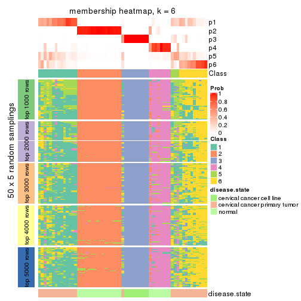</p>

</div>
</div>

As soon as we have had the classes for columns, we can look for signatures
which are significantly different between classes which can be candidate marks
for certain classes. Following are the heatmaps for signatures.


Signature heatmaps where rows are scaled:


<script>
$( function() {
	$( '#tabs-MAD-skmeans-get-signatures' ).tabs();
} );
</script>
<div id='tabs-MAD-skmeans-get-signatures'>
<ul>
<li><a href='#tab-MAD-skmeans-get-signatures-1'>k = 2</a></li>
<li><a href='#tab-MAD-skmeans-get-signatures-2'>k = 3</a></li>
<li><a href='#tab-MAD-skmeans-get-signatures-3'>k = 4</a></li>
<li><a href='#tab-MAD-skmeans-get-signatures-4'>k = 5</a></li>
<li><a href='#tab-MAD-skmeans-get-signatures-5'>k = 6</a></li>
</ul>
<div id='tab-MAD-skmeans-get-signatures-1'>
<pre><code class="r">get_signatures(res, k = 2)
</code></pre>

<p></p>

</div>
<div id='tab-MAD-skmeans-get-signatures-2'>
<pre><code class="r">get_signatures(res, k = 3)
</code></pre>

<p></p>

</div>
<div id='tab-MAD-skmeans-get-signatures-3'>
<pre><code class="r">get_signatures(res, k = 4)
</code></pre>

<p></p>

</div>
<div id='tab-MAD-skmeans-get-signatures-4'>
<pre><code class="r">get_signatures(res, k = 5)
</code></pre>

<p></p>

</div>
<div id='tab-MAD-skmeans-get-signatures-5'>
<pre><code class="r">get_signatures(res, k = 6)
</code></pre>

<p></p>

</div>
</div>


Signature heatmaps where rows are not scaled:


<script>
$( function() {
	$( '#tabs-MAD-skmeans-get-signatures-no-scale' ).tabs();
} );
</script>
<div id='tabs-MAD-skmeans-get-signatures-no-scale'>
<ul>
<li><a href='#tab-MAD-skmeans-get-signatures-no-scale-1'>k = 2</a></li>
<li><a href='#tab-MAD-skmeans-get-signatures-no-scale-2'>k = 3</a></li>
<li><a href='#tab-MAD-skmeans-get-signatures-no-scale-3'>k = 4</a></li>
<li><a href='#tab-MAD-skmeans-get-signatures-no-scale-4'>k = 5</a></li>
<li><a href='#tab-MAD-skmeans-get-signatures-no-scale-5'>k = 6</a></li>
</ul>
<div id='tab-MAD-skmeans-get-signatures-no-scale-1'>
<pre><code class="r">get_signatures(res, k = 2, scale_rows = FALSE)
</code></pre>

<p></p>

</div>
<div id='tab-MAD-skmeans-get-signatures-no-scale-2'>
<pre><code class="r">get_signatures(res, k = 3, scale_rows = FALSE)
</code></pre>

<p></p>

</div>
<div id='tab-MAD-skmeans-get-signatures-no-scale-3'>
<pre><code class="r">get_signatures(res, k = 4, scale_rows = FALSE)
</code></pre>

<p></p>

</div>
<div id='tab-MAD-skmeans-get-signatures-no-scale-4'>
<pre><code class="r">get_signatures(res, k = 5, scale_rows = FALSE)
</code></pre>

<p></p>

</div>
<div id='tab-MAD-skmeans-get-signatures-no-scale-5'>
<pre><code class="r">get_signatures(res, k = 6, scale_rows = FALSE)
</code></pre>

<p></p>

</div>
</div>


Compare the overlap of signatures from different k:

```r
compare_signatures(res)
```


`get_signature()` returns a data frame invisibly. TO get the list of signatures, the function
call should be assigned to a variable explicitly. In following code, if `plot` argument is set
to `FALSE`, no heatmap is plotted while only the differential analysis is performed.

```r
# code only for demonstration
tb = get_signature(res, k = ..., plot = FALSE)
```

An example of the output of `tb` is:

```
#>   which_row         fdr    mean_1    mean_2 scaled_mean_1 scaled_mean_2 km
#> 1        38 0.042760348  8.373488  9.131774    -0.5533452     0.5164555  1
#> 2        40 0.018707592  7.106213  8.469186    -0.6173731     0.5762149  1
#> 3        55 0.019134737 10.221463 11.207825    -0.6159697     0.5749050  1
#> 4        59 0.006059896  5.921854  7.869574    -0.6899429     0.6439467  1
#> 5        60 0.018055526  8.928898 10.211722    -0.6204761     0.5791110  1
#> 6        98 0.009384629 15.714769 14.887706     0.6635654    -0.6193277  2
...
```

The columns in `tb` are:

1. `which_row`: row indices corresponding to the input matrix.
2. `fdr`: FDR for the differential test. 
3. `mean_x`: The mean value in group x.
4. `scaled_mean_x`: The mean value in group x after rows are scaled.
5. `km`: Row groups if k-means clustering is applied to rows.


UMAP plot which shows how samples are separated.


<script>
$( function() {
	$( '#tabs-MAD-skmeans-dimension-reduction' ).tabs();
} );
</script>
<div id='tabs-MAD-skmeans-dimension-reduction'>
<ul>
<li><a href='#tab-MAD-skmeans-dimension-reduction-1'>k = 2</a></li>
<li><a href='#tab-MAD-skmeans-dimension-reduction-2'>k = 3</a></li>
<li><a href='#tab-MAD-skmeans-dimension-reduction-3'>k = 4</a></li>
<li><a href='#tab-MAD-skmeans-dimension-reduction-4'>k = 5</a></li>
<li><a href='#tab-MAD-skmeans-dimension-reduction-5'>k = 6</a></li>
</ul>
<div id='tab-MAD-skmeans-dimension-reduction-1'>
<pre><code class="r">dimension_reduction(res, k = 2, method = &quot;UMAP&quot;)
</code></pre>

<p></p>

</div>
<div id='tab-MAD-skmeans-dimension-reduction-2'>
<pre><code class="r">dimension_reduction(res, k = 3, method = &quot;UMAP&quot;)
</code></pre>

<p></p>

</div>
<div id='tab-MAD-skmeans-dimension-reduction-3'>
<pre><code class="r">dimension_reduction(res, k = 4, method = &quot;UMAP&quot;)
</code></pre>

<p></p>

</div>
<div id='tab-MAD-skmeans-dimension-reduction-4'>
<pre><code class="r">dimension_reduction(res, k = 5, method = &quot;UMAP&quot;)
</code></pre>

<p></p>

</div>
<div id='tab-MAD-skmeans-dimension-reduction-5'>
<pre><code class="r">dimension_reduction(res, k = 6, method = &quot;UMAP&quot;)
</code></pre>

<p></p>

</div>
</div>


Following heatmap shows how subgroups are split when increasing `k`:

```r
collect_classes(res)
```


Test correlation between subgroups and known annotations. If the known
annotation is numeric, one-way ANOVA test is applied, and if the known
annotation is discrete, chi-squared contingency table test is applied.

```r
test_to_known_factors(res)
```

```
#>              n disease.state(p) k
#> MAD:skmeans 60         9.36e-14 2
#> MAD:skmeans 58         1.47e-12 3
#> MAD:skmeans 57         7.66e-18 4
#> MAD:skmeans 45         1.62e-14 5
#> MAD:skmeans 38         3.11e-13 6
```


If matrix rows can be associated to genes, consider to use `GO_Enrichment(res,
...)` to perform function enrichment for the signature genes.


 

---------------------------------------------------


### MAD:pam**


The object with results only for a single top-value method and a single partition method 
can be extracted as:

```r
res = res_list["MAD", "pam"]
# you can also extract it by
# res = res_list["MAD:pam"]
```

A summary of `res` and all the functions that can be applied to it:

```r
res
```

```
#> A 'ConsensusPartition' object with k = 2, 3, 4, 5, 6.
#>   On a matrix with 21168 rows and 61 columns.
#>   Top rows (1000, 2000, 3000, 4000, 5000) are extracted by 'MAD' method.
#>   Subgroups are detected by 'pam' method.
#>   Performed in total 1250 partitions by row resampling.
#>   Best k for subgroups seems to be 4.
#> 
#> Following methods can be applied to this 'ConsensusPartition' object:
#>  [1] "cola_report"             "collect_classes"         "collect_plots"          
#>  [4] "collect_stats"           "colnames"                "compare_signatures"     
#>  [7] "consensus_heatmap"       "dimension_reduction"     "functional_enrichment"  
#> [10] "get_anno_col"            "get_anno"                "get_classes"            
#> [13] "get_consensus"           "get_matrix"              "get_membership"         
#> [16] "get_param"               "get_signatures"          "get_stats"              
#> [19] "is_best_k"               "is_stable_k"             "membership_heatmap"     
#> [22] "ncol"                    "nrow"                    "plot_ecdf"              
#> [25] "rownames"                "select_partition_number" "show"                   
#> [28] "suggest_best_k"          "test_to_known_factors"
```

`collect_plots()` function collects all the plots made from `res` for all `k` (number of partitions)
into one single page to provide an easy and fast comparison between different `k`.

```r
collect_plots(res)
```

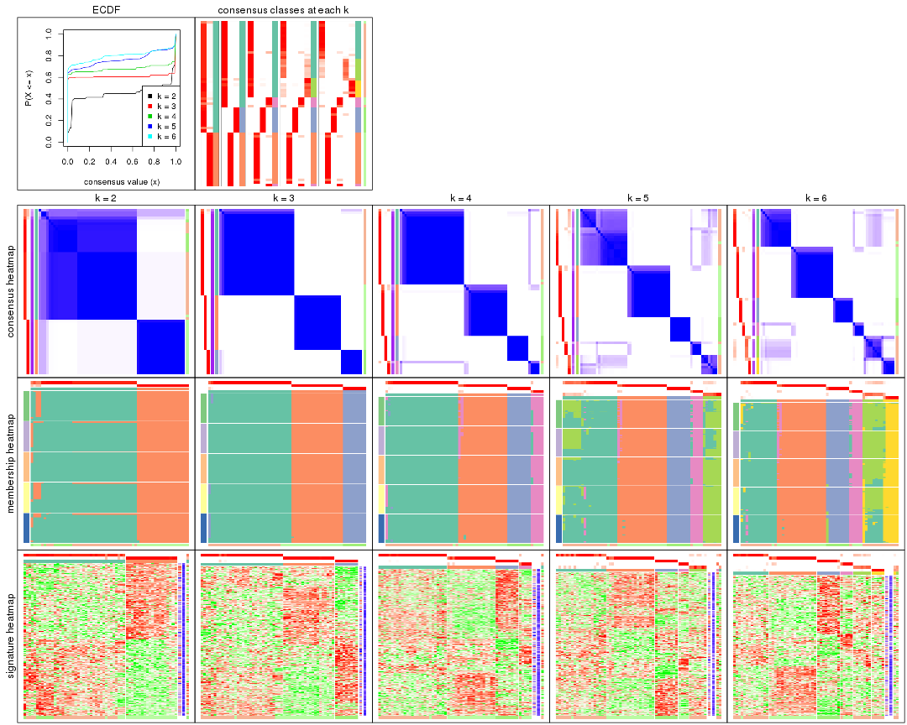

The plots are:

- The first row: a plot of the ECDF (Empirical cumulative distribution
  function) curves of the consensus matrix for each `k` and the heatmap of
  predicted classes for each `k`.
- The second row: heatmaps of the consensus matrix for each `k`.
- The third row: heatmaps of the membership matrix for each `k`.
- The fouth row: heatmaps of the signatures for each `k`.

All the plots in panels can be made by individual functions and they are
plotted later in this section.

`select_partition_number()` produces several plots showing different
statistics for choosing "optimized" `k`. There are following statistics:

- ECDF curves of the consensus matrix for each `k`;
- 1-PAC. [The PAC
  score](https://en.wikipedia.org/wiki/Consensus_clustering#Over-interpretation_potential_of_consensus_clustering)
  measures the proportion of the ambiguous subgrouping.
- Mean silhouette score.
- Concordance. The mean probability of fiting the consensus class ids in all
  partitions.
- Area increased. Denote $A_k$ as the area under the ECDF curve for current
  `k`, the area increased is defined as $A_k - A_{k-1}$.
- Rand index. The percent of pairs of samples that are both in a same cluster
  or both are not in a same cluster in the partition of k and k-1.
- Jaccard index. The ratio of pairs of samples are both in a same cluster in
  the partition of k and k-1 and the pairs of samples are both in a same
  cluster in the partition k or k-1.

The detailed explanations of these statistics can be found in [the cola
vignette](http://bioconductor.org/packages/devel/bioc/vignettes/cola/inst/doc/cola.html#toc_13).

Generally speaking, lower PAC score, higher mean silhouette score or higher
concordance corresponds to better partition. Rand index and Jaccard index
measure how similar the current partition is compared to partition with `k-1`.
If they are too similar, we won't accept `k` is better than `k-1`.

```r
select_partition_number(res)
```


The numeric values for all these statistics can be obtained by `get_stats()`.

```r
get_stats(res)
```

```
#>   k 1-PAC mean_silhouette concordance area_increased  Rand Jaccard
#> 2 2 0.966           0.948       0.965         0.4553 0.552   0.552
#> 3 3 1.000           0.989       0.995         0.3384 0.843   0.715
#> 4 4 0.987           0.944       0.978         0.1157 0.926   0.814
#> 5 5 0.854           0.847       0.923         0.1271 0.920   0.753
#> 6 6 0.882           0.872       0.924         0.0432 0.939   0.756
```

`suggest_best_k()` suggests the best $k$ based on these statistics. The rules are as follows:

- All $k$ with Jaccard index larger than 0.95 are removed because the increase of
  the partition number does not provides enough extra information. If all $k$ are removed,
  the best $k$ is assigned by `NA`.
- For $k$ with 1-PAC larger than 0.9, the maximal $k$ is taken as the "best k". Other $k$ is called "optional k".
- If it does not fit the second rule. The $k$ with the highest vote of highest
  1-PAC, mean silhouette and concordance is taken as the "best k".

```r
suggest_best_k(res)
```

```
#> [1] 4
#> attr(,"optional")
#> [1] 2 3
```

There is also optional best $k$ = 2 3 that is worth to check.

Following shows the table of the partitions (You need to click the **show/hide
code output** link to see it). The membership matrix (columns with name `p*`)
is inferred by
[`clue::cl_consensus()`](https://www.rdocumentation.org/link/cl_consensus?package=clue)
function with the `SE` method. Basically the value in the membership matrix
represents the probability to belong to a certain group. The finall class
label for an item is determined with the group with highest probability it
belongs to.

In `get_classes()` function, the entropy is calculated from the membership
matrix and the silhouette score is calculated from the consensus matrix.


<script>
$( function() {
	$( '#tabs-MAD-pam-get-classes' ).tabs();
} );
</script>
<div id='tabs-MAD-pam-get-classes'>
<ul>
<li><a href='#tab-MAD-pam-get-classes-1'>k = 2</a></li>
<li><a href='#tab-MAD-pam-get-classes-2'>k = 3</a></li>
<li><a href='#tab-MAD-pam-get-classes-3'>k = 4</a></li>
<li><a href='#tab-MAD-pam-get-classes-4'>k = 5</a></li>
<li><a href='#tab-MAD-pam-get-classes-5'>k = 6</a></li>
</ul>

<div id='tab-MAD-pam-get-classes-1'>
<p><a id='tab-MAD-pam-get-classes-1-a' style='color:#0366d6' href='#'>show/hide code output</a></p>
<pre><code class="r">cbind(get_classes(res, k = 2), get_membership(res, k = 2))
</code></pre>

<pre><code>#&gt;           class entropy silhouette    p1    p2
#&gt; GSM246087     1  0.0938      0.943 0.988 0.012
#&gt; GSM246088     1  0.0000      0.947 1.000 0.000
#&gt; GSM246089     1  0.0000      0.947 1.000 0.000
#&gt; GSM246090     1  0.0000      0.947 1.000 0.000
#&gt; GSM246119     1  0.0000      0.947 1.000 0.000
#&gt; GSM246120     1  0.0000      0.947 1.000 0.000
#&gt; GSM246121     1  0.0000      0.947 1.000 0.000
#&gt; GSM246122     1  0.9170      0.485 0.668 0.332
#&gt; GSM246123     1  0.0000      0.947 1.000 0.000
#&gt; GSM246422     1  0.6438      0.835 0.836 0.164
#&gt; GSM246423     1  0.2236      0.961 0.964 0.036
#&gt; GSM246484     1  0.9170      0.574 0.668 0.332
#&gt; GSM246485     2  0.1184      0.982 0.016 0.984
#&gt; GSM246486     2  0.0000      0.999 0.000 1.000
#&gt; GSM246487     1  0.9170      0.574 0.668 0.332
#&gt; GSM246488     2  0.0000      0.999 0.000 1.000
#&gt; GSM246489     2  0.0000      0.999 0.000 1.000
#&gt; GSM246490     2  0.0000      0.999 0.000 1.000
#&gt; GSM246491     2  0.0000      0.999 0.000 1.000
#&gt; GSM247162     2  0.0000      0.999 0.000 1.000
#&gt; GSM247163     2  0.0000      0.999 0.000 1.000
#&gt; GSM247164     2  0.0000      0.999 0.000 1.000
#&gt; GSM247165     2  0.0000      0.999 0.000 1.000
#&gt; GSM247166     2  0.0000      0.999 0.000 1.000
#&gt; GSM247168     2  0.0000      0.999 0.000 1.000
#&gt; GSM247169     2  0.0000      0.999 0.000 1.000
#&gt; GSM247171     2  0.0000      0.999 0.000 1.000
#&gt; GSM247173     2  0.0000      0.999 0.000 1.000
#&gt; GSM247174     2  0.0000      0.999 0.000 1.000
#&gt; GSM247175     2  0.0000      0.999 0.000 1.000
#&gt; GSM247188     2  0.0000      0.999 0.000 1.000
#&gt; GSM247189     2  0.0000      0.999 0.000 1.000
#&gt; GSM247190     2  0.0000      0.999 0.000 1.000
#&gt; GSM247650     1  0.2236      0.961 0.964 0.036
#&gt; GSM247651     1  0.2236      0.961 0.964 0.036
#&gt; GSM247652     1  0.2236      0.961 0.964 0.036
#&gt; GSM247653     1  0.2236      0.961 0.964 0.036
#&gt; GSM247654     1  0.2236      0.961 0.964 0.036
#&gt; GSM247655     1  0.2236      0.961 0.964 0.036
#&gt; GSM247656     1  0.0938      0.953 0.988 0.012
#&gt; GSM247657     1  0.2236      0.961 0.964 0.036
#&gt; GSM247658     1  0.2236      0.961 0.964 0.036
#&gt; GSM247659     1  0.0000      0.947 1.000 0.000
#&gt; GSM247660     1  0.2236      0.961 0.964 0.036
#&gt; GSM247661     1  0.0376      0.949 0.996 0.004
#&gt; GSM247662     1  0.0376      0.949 0.996 0.004
#&gt; GSM247663     1  0.2236      0.961 0.964 0.036
#&gt; GSM247856     1  0.2236      0.961 0.964 0.036
#&gt; GSM247857     1  0.2236      0.961 0.964 0.036
#&gt; GSM247859     1  0.2236      0.961 0.964 0.036
#&gt; GSM247860     1  0.2236      0.961 0.964 0.036
#&gt; GSM247862     1  0.2236      0.961 0.964 0.036
#&gt; GSM247864     1  0.2236      0.961 0.964 0.036
#&gt; GSM247865     1  0.2236      0.961 0.964 0.036
#&gt; GSM247866     1  0.2236      0.961 0.964 0.036
#&gt; GSM247876     1  0.2236      0.961 0.964 0.036
#&gt; GSM247877     1  0.2236      0.961 0.964 0.036
#&gt; GSM247878     1  0.2236      0.961 0.964 0.036
#&gt; GSM247879     1  0.2236      0.961 0.964 0.036
#&gt; GSM247881     1  0.2236      0.961 0.964 0.036
#&gt; GSM247883     1  0.2236      0.961 0.964 0.036
</code></pre>

<script>
$('#tab-MAD-pam-get-classes-1-a').parent().next().next().hide();
$('#tab-MAD-pam-get-classes-1-a').click(function(){
  $('#tab-MAD-pam-get-classes-1-a').parent().next().next().toggle();
  return(false);
});
</script>
</div>

<div id='tab-MAD-pam-get-classes-2'>
<p><a id='tab-MAD-pam-get-classes-2-a' style='color:#0366d6' href='#'>show/hide code output</a></p>
<pre><code class="r">cbind(get_classes(res, k = 3), get_membership(res, k = 3))
</code></pre>

<pre><code>#&gt;           class entropy silhouette    p1    p2    p3
#&gt; GSM246087     3  0.0000      1.000 0.000 0.000 1.000
#&gt; GSM246088     3  0.0000      1.000 0.000 0.000 1.000
#&gt; GSM246089     3  0.0000      1.000 0.000 0.000 1.000
#&gt; GSM246090     3  0.0000      1.000 0.000 0.000 1.000
#&gt; GSM246119     3  0.0000      1.000 0.000 0.000 1.000
#&gt; GSM246120     3  0.0000      1.000 0.000 0.000 1.000
#&gt; GSM246121     3  0.0000      1.000 0.000 0.000 1.000
#&gt; GSM246122     3  0.0000      1.000 0.000 0.000 1.000
#&gt; GSM246123     3  0.0000      1.000 0.000 0.000 1.000
#&gt; GSM246422     1  0.0000      0.990 1.000 0.000 0.000
#&gt; GSM246423     1  0.0000      0.990 1.000 0.000 0.000
#&gt; GSM246484     1  0.0000      0.990 1.000 0.000 0.000
#&gt; GSM246485     2  0.0424      0.989 0.008 0.992 0.000
#&gt; GSM246486     2  0.0000      0.999 0.000 1.000 0.000
#&gt; GSM246487     1  0.0000      0.990 1.000 0.000 0.000
#&gt; GSM246488     2  0.0000      0.999 0.000 1.000 0.000
#&gt; GSM246489     2  0.0000      0.999 0.000 1.000 0.000
#&gt; GSM246490     2  0.0000      0.999 0.000 1.000 0.000
#&gt; GSM246491     2  0.0000      0.999 0.000 1.000 0.000
#&gt; GSM247162     2  0.0000      0.999 0.000 1.000 0.000
#&gt; GSM247163     2  0.0000      0.999 0.000 1.000 0.000
#&gt; GSM247164     2  0.0000      0.999 0.000 1.000 0.000
#&gt; GSM247165     2  0.0000      0.999 0.000 1.000 0.000
#&gt; GSM247166     2  0.0000      0.999 0.000 1.000 0.000
#&gt; GSM247168     2  0.0000      0.999 0.000 1.000 0.000
#&gt; GSM247169     2  0.0000      0.999 0.000 1.000 0.000
#&gt; GSM247171     2  0.0000      0.999 0.000 1.000 0.000
#&gt; GSM247173     2  0.0000      0.999 0.000 1.000 0.000
#&gt; GSM247174     2  0.0000      0.999 0.000 1.000 0.000
#&gt; GSM247175     2  0.0000      0.999 0.000 1.000 0.000
#&gt; GSM247188     2  0.0000      0.999 0.000 1.000 0.000
#&gt; GSM247189     2  0.0000      0.999 0.000 1.000 0.000
#&gt; GSM247190     2  0.0000      0.999 0.000 1.000 0.000
#&gt; GSM247650     1  0.0000      0.990 1.000 0.000 0.000
#&gt; GSM247651     1  0.0000      0.990 1.000 0.000 0.000
#&gt; GSM247652     1  0.0000      0.990 1.000 0.000 0.000
#&gt; GSM247653     1  0.0000      0.990 1.000 0.000 0.000
#&gt; GSM247654     1  0.0000      0.990 1.000 0.000 0.000
#&gt; GSM247655     1  0.0000      0.990 1.000 0.000 0.000
#&gt; GSM247656     1  0.4974      0.692 0.764 0.000 0.236
#&gt; GSM247657     1  0.0000      0.990 1.000 0.000 0.000
#&gt; GSM247658     1  0.0000      0.990 1.000 0.000 0.000
#&gt; GSM247659     1  0.2165      0.927 0.936 0.000 0.064
#&gt; GSM247660     1  0.0000      0.990 1.000 0.000 0.000
#&gt; GSM247661     1  0.0000      0.990 1.000 0.000 0.000
#&gt; GSM247662     1  0.0000      0.990 1.000 0.000 0.000
#&gt; GSM247663     1  0.0000      0.990 1.000 0.000 0.000
#&gt; GSM247856     1  0.0000      0.990 1.000 0.000 0.000
#&gt; GSM247857     1  0.0000      0.990 1.000 0.000 0.000
#&gt; GSM247859     1  0.0000      0.990 1.000 0.000 0.000
#&gt; GSM247860     1  0.0000      0.990 1.000 0.000 0.000
#&gt; GSM247862     1  0.0000      0.990 1.000 0.000 0.000
#&gt; GSM247864     1  0.0000      0.990 1.000 0.000 0.000
#&gt; GSM247865     1  0.0000      0.990 1.000 0.000 0.000
#&gt; GSM247866     1  0.0000      0.990 1.000 0.000 0.000
#&gt; GSM247876     1  0.0000      0.990 1.000 0.000 0.000
#&gt; GSM247877     1  0.0000      0.990 1.000 0.000 0.000
#&gt; GSM247878     1  0.0000      0.990 1.000 0.000 0.000
#&gt; GSM247879     1  0.0000      0.990 1.000 0.000 0.000
#&gt; GSM247881     1  0.0000      0.990 1.000 0.000 0.000
#&gt; GSM247883     1  0.0000      0.990 1.000 0.000 0.000
</code></pre>

<script>
$('#tab-MAD-pam-get-classes-2-a').parent().next().next().hide();
$('#tab-MAD-pam-get-classes-2-a').click(function(){
  $('#tab-MAD-pam-get-classes-2-a').parent().next().next().toggle();
  return(false);
});
</script>
</div>

<div id='tab-MAD-pam-get-classes-3'>
<p><a id='tab-MAD-pam-get-classes-3-a' style='color:#0366d6' href='#'>show/hide code output</a></p>
<pre><code class="r">cbind(get_classes(res, k = 4), get_membership(res, k = 4))
</code></pre>

<pre><code>#&gt;           class entropy silhouette    p1    p2    p3    p4
#&gt; GSM246087     3   0.000      1.000 0.000 0.000 1.000 0.000
#&gt; GSM246088     3   0.000      1.000 0.000 0.000 1.000 0.000
#&gt; GSM246089     3   0.000      1.000 0.000 0.000 1.000 0.000
#&gt; GSM246090     3   0.000      1.000 0.000 0.000 1.000 0.000
#&gt; GSM246119     3   0.000      1.000 0.000 0.000 1.000 0.000
#&gt; GSM246120     3   0.000      1.000 0.000 0.000 1.000 0.000
#&gt; GSM246121     3   0.000      1.000 0.000 0.000 1.000 0.000
#&gt; GSM246122     3   0.000      1.000 0.000 0.000 1.000 0.000
#&gt; GSM246123     3   0.000      1.000 0.000 0.000 1.000 0.000
#&gt; GSM246422     4   0.000      0.877 0.000 0.000 0.000 1.000
#&gt; GSM246423     4   0.000      0.877 0.000 0.000 0.000 1.000
#&gt; GSM246484     4   0.000      0.877 0.000 0.000 0.000 1.000
#&gt; GSM246485     2   0.102      0.931 0.032 0.968 0.000 0.000
#&gt; GSM246486     2   0.394      0.711 0.000 0.764 0.000 0.236
#&gt; GSM246487     1   0.000      0.981 1.000 0.000 0.000 0.000
#&gt; GSM246488     4   0.000      0.877 0.000 0.000 0.000 1.000
#&gt; GSM246489     2   0.000      0.969 0.000 1.000 0.000 0.000
#&gt; GSM246490     2   0.000      0.969 0.000 1.000 0.000 0.000
#&gt; GSM246491     2   0.000      0.969 0.000 1.000 0.000 0.000
#&gt; GSM247162     2   0.000      0.969 0.000 1.000 0.000 0.000
#&gt; GSM247163     2   0.000      0.969 0.000 1.000 0.000 0.000
#&gt; GSM247164     2   0.000      0.969 0.000 1.000 0.000 0.000
#&gt; GSM247165     2   0.000      0.969 0.000 1.000 0.000 0.000
#&gt; GSM247166     2   0.000      0.969 0.000 1.000 0.000 0.000
#&gt; GSM247168     2   0.000      0.969 0.000 1.000 0.000 0.000
#&gt; GSM247169     2   0.000      0.969 0.000 1.000 0.000 0.000
#&gt; GSM247171     2   0.000      0.969 0.000 1.000 0.000 0.000
#&gt; GSM247173     2   0.000      0.969 0.000 1.000 0.000 0.000
#&gt; GSM247174     2   0.000      0.969 0.000 1.000 0.000 0.000
#&gt; GSM247175     2   0.000      0.969 0.000 1.000 0.000 0.000
#&gt; GSM247188     2   0.000      0.969 0.000 1.000 0.000 0.000
#&gt; GSM247189     2   0.425      0.648 0.000 0.724 0.000 0.276
#&gt; GSM247190     2   0.000      0.969 0.000 1.000 0.000 0.000
#&gt; GSM247650     1   0.000      0.981 1.000 0.000 0.000 0.000
#&gt; GSM247651     1   0.000      0.981 1.000 0.000 0.000 0.000
#&gt; GSM247652     1   0.000      0.981 1.000 0.000 0.000 0.000
#&gt; GSM247653     1   0.000      0.981 1.000 0.000 0.000 0.000
#&gt; GSM247654     1   0.000      0.981 1.000 0.000 0.000 0.000
#&gt; GSM247655     1   0.000      0.981 1.000 0.000 0.000 0.000
#&gt; GSM247656     1   0.102      0.949 0.968 0.000 0.032 0.000
#&gt; GSM247657     1   0.000      0.981 1.000 0.000 0.000 0.000
#&gt; GSM247658     1   0.000      0.981 1.000 0.000 0.000 0.000
#&gt; GSM247659     1   0.172      0.912 0.936 0.000 0.064 0.000
#&gt; GSM247660     1   0.000      0.981 1.000 0.000 0.000 0.000
#&gt; GSM247661     1   0.000      0.981 1.000 0.000 0.000 0.000
#&gt; GSM247662     1   0.000      0.981 1.000 0.000 0.000 0.000
#&gt; GSM247663     1   0.000      0.981 1.000 0.000 0.000 0.000
#&gt; GSM247856     1   0.000      0.981 1.000 0.000 0.000 0.000
#&gt; GSM247857     1   0.000      0.981 1.000 0.000 0.000 0.000
#&gt; GSM247859     1   0.000      0.981 1.000 0.000 0.000 0.000
#&gt; GSM247860     1   0.000      0.981 1.000 0.000 0.000 0.000
#&gt; GSM247862     1   0.000      0.981 1.000 0.000 0.000 0.000
#&gt; GSM247864     1   0.000      0.981 1.000 0.000 0.000 0.000
#&gt; GSM247865     1   0.000      0.981 1.000 0.000 0.000 0.000
#&gt; GSM247866     1   0.000      0.981 1.000 0.000 0.000 0.000
#&gt; GSM247876     1   0.000      0.981 1.000 0.000 0.000 0.000
#&gt; GSM247877     4   0.450      0.517 0.316 0.000 0.000 0.684
#&gt; GSM247878     1   0.473      0.361 0.636 0.000 0.000 0.364
#&gt; GSM247879     1   0.000      0.981 1.000 0.000 0.000 0.000
#&gt; GSM247881     1   0.000      0.981 1.000 0.000 0.000 0.000
#&gt; GSM247883     1   0.000      0.981 1.000 0.000 0.000 0.000
</code></pre>

<script>
$('#tab-MAD-pam-get-classes-3-a').parent().next().next().hide();
$('#tab-MAD-pam-get-classes-3-a').click(function(){
  $('#tab-MAD-pam-get-classes-3-a').parent().next().next().toggle();
  return(false);
});
</script>
</div>

<div id='tab-MAD-pam-get-classes-4'>
<p><a id='tab-MAD-pam-get-classes-4-a' style='color:#0366d6' href='#'>show/hide code output</a></p>
<pre><code class="r">cbind(get_classes(res, k = 5), get_membership(res, k = 5))
</code></pre>

<pre><code>#&gt;           class entropy silhouette    p1    p2    p3    p4    p5
#&gt; GSM246087     3  0.0000      1.000 0.000 0.000 1.000 0.000 0.000
#&gt; GSM246088     3  0.0000      1.000 0.000 0.000 1.000 0.000 0.000
#&gt; GSM246089     3  0.0000      1.000 0.000 0.000 1.000 0.000 0.000
#&gt; GSM246090     3  0.0000      1.000 0.000 0.000 1.000 0.000 0.000
#&gt; GSM246119     3  0.0000      1.000 0.000 0.000 1.000 0.000 0.000
#&gt; GSM246120     3  0.0000      1.000 0.000 0.000 1.000 0.000 0.000
#&gt; GSM246121     3  0.0000      1.000 0.000 0.000 1.000 0.000 0.000
#&gt; GSM246122     3  0.0000      1.000 0.000 0.000 1.000 0.000 0.000
#&gt; GSM246123     3  0.0000      1.000 0.000 0.000 1.000 0.000 0.000
#&gt; GSM246422     4  0.0000      0.886 0.000 0.000 0.000 1.000 0.000
#&gt; GSM246423     4  0.0000      0.886 0.000 0.000 0.000 1.000 0.000
#&gt; GSM246484     4  0.0000      0.886 0.000 0.000 0.000 1.000 0.000
#&gt; GSM246485     2  0.0794      0.939 0.028 0.972 0.000 0.000 0.000
#&gt; GSM246486     2  0.3395      0.708 0.000 0.764 0.000 0.236 0.000
#&gt; GSM246487     1  0.0162      0.834 0.996 0.000 0.000 0.000 0.004
#&gt; GSM246488     4  0.0000      0.886 0.000 0.000 0.000 1.000 0.000
#&gt; GSM246489     2  0.0000      0.969 0.000 1.000 0.000 0.000 0.000
#&gt; GSM246490     2  0.0000      0.969 0.000 1.000 0.000 0.000 0.000
#&gt; GSM246491     2  0.0000      0.969 0.000 1.000 0.000 0.000 0.000
#&gt; GSM247162     2  0.0000      0.969 0.000 1.000 0.000 0.000 0.000
#&gt; GSM247163     2  0.0000      0.969 0.000 1.000 0.000 0.000 0.000
#&gt; GSM247164     2  0.0000      0.969 0.000 1.000 0.000 0.000 0.000
#&gt; GSM247165     2  0.0000      0.969 0.000 1.000 0.000 0.000 0.000
#&gt; GSM247166     2  0.0000      0.969 0.000 1.000 0.000 0.000 0.000
#&gt; GSM247168     2  0.0000      0.969 0.000 1.000 0.000 0.000 0.000
#&gt; GSM247169     2  0.0000      0.969 0.000 1.000 0.000 0.000 0.000
#&gt; GSM247171     2  0.0000      0.969 0.000 1.000 0.000 0.000 0.000
#&gt; GSM247173     2  0.0000      0.969 0.000 1.000 0.000 0.000 0.000
#&gt; GSM247174     2  0.0000      0.969 0.000 1.000 0.000 0.000 0.000
#&gt; GSM247175     2  0.0000      0.969 0.000 1.000 0.000 0.000 0.000
#&gt; GSM247188     2  0.0000      0.969 0.000 1.000 0.000 0.000 0.000
#&gt; GSM247189     2  0.3661      0.643 0.000 0.724 0.000 0.276 0.000
#&gt; GSM247190     2  0.0000      0.969 0.000 1.000 0.000 0.000 0.000
#&gt; GSM247650     1  0.0703      0.824 0.976 0.000 0.000 0.000 0.024
#&gt; GSM247651     1  0.0000      0.834 1.000 0.000 0.000 0.000 0.000
#&gt; GSM247652     1  0.3932      0.646 0.672 0.000 0.000 0.000 0.328
#&gt; GSM247653     1  0.3837      0.672 0.692 0.000 0.000 0.000 0.308
#&gt; GSM247654     1  0.4304      0.350 0.516 0.000 0.000 0.000 0.484
#&gt; GSM247655     1  0.0162      0.833 0.996 0.000 0.000 0.000 0.004
#&gt; GSM247656     5  0.0162      0.724 0.004 0.000 0.000 0.000 0.996
#&gt; GSM247657     5  0.0162      0.724 0.004 0.000 0.000 0.000 0.996
#&gt; GSM247658     1  0.3508      0.715 0.748 0.000 0.000 0.000 0.252
#&gt; GSM247659     5  0.4087      0.757 0.208 0.000 0.036 0.000 0.756
#&gt; GSM247660     1  0.0000      0.834 1.000 0.000 0.000 0.000 0.000
#&gt; GSM247661     5  0.2329      0.781 0.124 0.000 0.000 0.000 0.876
#&gt; GSM247662     5  0.3508      0.747 0.252 0.000 0.000 0.000 0.748
#&gt; GSM247663     1  0.3534      0.716 0.744 0.000 0.000 0.000 0.256
#&gt; GSM247856     5  0.3274      0.632 0.220 0.000 0.000 0.000 0.780
#&gt; GSM247857     5  0.3452      0.753 0.244 0.000 0.000 0.000 0.756
#&gt; GSM247859     1  0.0290      0.834 0.992 0.000 0.000 0.000 0.008
#&gt; GSM247860     1  0.3730      0.690 0.712 0.000 0.000 0.000 0.288
#&gt; GSM247862     1  0.0000      0.834 1.000 0.000 0.000 0.000 0.000
#&gt; GSM247864     1  0.0162      0.833 0.996 0.000 0.000 0.000 0.004
#&gt; GSM247865     1  0.0290      0.834 0.992 0.000 0.000 0.000 0.008
#&gt; GSM247866     1  0.0162      0.833 0.996 0.000 0.000 0.000 0.004
#&gt; GSM247876     1  0.0609      0.830 0.980 0.000 0.000 0.000 0.020
#&gt; GSM247877     4  0.4029      0.456 0.316 0.000 0.000 0.680 0.004
#&gt; GSM247878     1  0.3424      0.592 0.760 0.000 0.000 0.240 0.000
#&gt; GSM247879     1  0.2891      0.653 0.824 0.000 0.000 0.000 0.176
#&gt; GSM247881     1  0.1341      0.821 0.944 0.000 0.000 0.000 0.056
#&gt; GSM247883     1  0.3534      0.715 0.744 0.000 0.000 0.000 0.256
</code></pre>

<script>
$('#tab-MAD-pam-get-classes-4-a').parent().next().next().hide();
$('#tab-MAD-pam-get-classes-4-a').click(function(){
  $('#tab-MAD-pam-get-classes-4-a').parent().next().next().toggle();
  return(false);
});
</script>
</div>

<div id='tab-MAD-pam-get-classes-5'>
<p><a id='tab-MAD-pam-get-classes-5-a' style='color:#0366d6' href='#'>show/hide code output</a></p>
<pre><code class="r">cbind(get_classes(res, k = 6), get_membership(res, k = 6))
</code></pre>

<pre><code>#&gt;           class entropy silhouette    p1    p2   p3    p4    p5    p6
#&gt; GSM246087     3  0.0000     0.9773 0.000 0.000 1.00 0.000 0.000 0.000
#&gt; GSM246088     3  0.0000     0.9773 0.000 0.000 1.00 0.000 0.000 0.000
#&gt; GSM246089     3  0.2941     0.7956 0.000 0.000 0.78 0.000 0.220 0.000
#&gt; GSM246090     3  0.0000     0.9773 0.000 0.000 1.00 0.000 0.000 0.000
#&gt; GSM246119     3  0.0000     0.9773 0.000 0.000 1.00 0.000 0.000 0.000
#&gt; GSM246120     3  0.0000     0.9773 0.000 0.000 1.00 0.000 0.000 0.000
#&gt; GSM246121     3  0.0000     0.9773 0.000 0.000 1.00 0.000 0.000 0.000
#&gt; GSM246122     3  0.0000     0.9773 0.000 0.000 1.00 0.000 0.000 0.000
#&gt; GSM246123     3  0.0000     0.9773 0.000 0.000 1.00 0.000 0.000 0.000
#&gt; GSM246422     4  0.0000     0.8904 0.000 0.000 0.00 1.000 0.000 0.000
#&gt; GSM246423     4  0.0000     0.8904 0.000 0.000 0.00 1.000 0.000 0.000
#&gt; GSM246484     4  0.0000     0.8904 0.000 0.000 0.00 1.000 0.000 0.000
#&gt; GSM246485     2  0.0713     0.9393 0.028 0.972 0.00 0.000 0.000 0.000
#&gt; GSM246486     2  0.3050     0.7067 0.000 0.764 0.00 0.236 0.000 0.000
#&gt; GSM246487     1  0.0000     0.9424 1.000 0.000 0.00 0.000 0.000 0.000
#&gt; GSM246488     4  0.0000     0.8904 0.000 0.000 0.00 1.000 0.000 0.000
#&gt; GSM246489     2  0.0000     0.9693 0.000 1.000 0.00 0.000 0.000 0.000
#&gt; GSM246490     2  0.0000     0.9693 0.000 1.000 0.00 0.000 0.000 0.000
#&gt; GSM246491     2  0.0000     0.9693 0.000 1.000 0.00 0.000 0.000 0.000
#&gt; GSM247162     2  0.0000     0.9693 0.000 1.000 0.00 0.000 0.000 0.000
#&gt; GSM247163     2  0.0000     0.9693 0.000 1.000 0.00 0.000 0.000 0.000
#&gt; GSM247164     2  0.0000     0.9693 0.000 1.000 0.00 0.000 0.000 0.000
#&gt; GSM247165     2  0.0000     0.9693 0.000 1.000 0.00 0.000 0.000 0.000
#&gt; GSM247166     2  0.0000     0.9693 0.000 1.000 0.00 0.000 0.000 0.000
#&gt; GSM247168     2  0.0000     0.9693 0.000 1.000 0.00 0.000 0.000 0.000
#&gt; GSM247169     2  0.0000     0.9693 0.000 1.000 0.00 0.000 0.000 0.000
#&gt; GSM247171     2  0.0000     0.9693 0.000 1.000 0.00 0.000 0.000 0.000
#&gt; GSM247173     2  0.0000     0.9693 0.000 1.000 0.00 0.000 0.000 0.000
#&gt; GSM247174     2  0.0000     0.9693 0.000 1.000 0.00 0.000 0.000 0.000
#&gt; GSM247175     2  0.0000     0.9693 0.000 1.000 0.00 0.000 0.000 0.000
#&gt; GSM247188     2  0.0000     0.9693 0.000 1.000 0.00 0.000 0.000 0.000
#&gt; GSM247189     2  0.3288     0.6418 0.000 0.724 0.00 0.276 0.000 0.000
#&gt; GSM247190     2  0.0000     0.9693 0.000 1.000 0.00 0.000 0.000 0.000
#&gt; GSM247650     1  0.1444     0.8879 0.928 0.000 0.00 0.000 0.000 0.072
#&gt; GSM247651     1  0.0000     0.9424 1.000 0.000 0.00 0.000 0.000 0.000
#&gt; GSM247652     5  0.3993     0.8250 0.300 0.000 0.00 0.000 0.676 0.024
#&gt; GSM247653     5  0.2941     0.8170 0.220 0.000 0.00 0.000 0.780 0.000
#&gt; GSM247654     5  0.3806     0.7437 0.152 0.000 0.00 0.000 0.772 0.076
#&gt; GSM247655     1  0.0146     0.9415 0.996 0.000 0.00 0.000 0.000 0.004
#&gt; GSM247656     5  0.3993    -0.0921 0.004 0.000 0.00 0.000 0.520 0.476
#&gt; GSM247657     6  0.0146     0.8893 0.004 0.000 0.00 0.000 0.000 0.996
#&gt; GSM247658     5  0.3515     0.8166 0.324 0.000 0.00 0.000 0.676 0.000
#&gt; GSM247659     6  0.0000     0.8911 0.000 0.000 0.00 0.000 0.000 1.000
#&gt; GSM247660     1  0.0000     0.9424 1.000 0.000 0.00 0.000 0.000 0.000
#&gt; GSM247661     6  0.0622     0.8824 0.008 0.000 0.00 0.000 0.012 0.980
#&gt; GSM247662     6  0.0000     0.8911 0.000 0.000 0.00 0.000 0.000 1.000
#&gt; GSM247663     5  0.3636     0.8167 0.320 0.000 0.00 0.000 0.676 0.004
#&gt; GSM247856     6  0.5257     0.0990 0.104 0.000 0.00 0.000 0.372 0.524
#&gt; GSM247857     6  0.0000     0.8911 0.000 0.000 0.00 0.000 0.000 1.000
#&gt; GSM247859     1  0.0000     0.9424 1.000 0.000 0.00 0.000 0.000 0.000
#&gt; GSM247860     5  0.2969     0.8180 0.224 0.000 0.00 0.000 0.776 0.000
#&gt; GSM247862     1  0.0000     0.9424 1.000 0.000 0.00 0.000 0.000 0.000
#&gt; GSM247864     1  0.0146     0.9415 0.996 0.000 0.00 0.000 0.000 0.004
#&gt; GSM247865     1  0.0000     0.9424 1.000 0.000 0.00 0.000 0.000 0.000
#&gt; GSM247866     1  0.0146     0.9415 0.996 0.000 0.00 0.000 0.000 0.004
#&gt; GSM247876     1  0.0713     0.9276 0.972 0.000 0.00 0.000 0.000 0.028
#&gt; GSM247877     4  0.3619     0.5134 0.316 0.000 0.00 0.680 0.000 0.004
#&gt; GSM247878     1  0.2454     0.7649 0.840 0.000 0.00 0.160 0.000 0.000
#&gt; GSM247879     1  0.2969     0.6854 0.776 0.000 0.00 0.000 0.000 0.224
#&gt; GSM247881     1  0.1387     0.8688 0.932 0.000 0.00 0.000 0.068 0.000
#&gt; GSM247883     5  0.3714     0.7991 0.340 0.000 0.00 0.000 0.656 0.004
</code></pre>

<script>
$('#tab-MAD-pam-get-classes-5-a').parent().next().next().hide();
$('#tab-MAD-pam-get-classes-5-a').click(function(){
  $('#tab-MAD-pam-get-classes-5-a').parent().next().next().toggle();
  return(false);
});
</script>
</div>
</div>

Heatmaps for the consensus matrix. It visualizes the probability of two
samples to be in a same group.


<script>
$( function() {
	$( '#tabs-MAD-pam-consensus-heatmap' ).tabs();
} );
</script>
<div id='tabs-MAD-pam-consensus-heatmap'>
<ul>
<li><a href='#tab-MAD-pam-consensus-heatmap-1'>k = 2</a></li>
<li><a href='#tab-MAD-pam-consensus-heatmap-2'>k = 3</a></li>
<li><a href='#tab-MAD-pam-consensus-heatmap-3'>k = 4</a></li>
<li><a href='#tab-MAD-pam-consensus-heatmap-4'>k = 5</a></li>
<li><a href='#tab-MAD-pam-consensus-heatmap-5'>k = 6</a></li>
</ul>
<div id='tab-MAD-pam-consensus-heatmap-1'>
<pre><code class="r">consensus_heatmap(res, k = 2)
</code></pre>

<p></p>

</div>
<div id='tab-MAD-pam-consensus-heatmap-2'>
<pre><code class="r">consensus_heatmap(res, k = 3)
</code></pre>

<p></p>

</div>
<div id='tab-MAD-pam-consensus-heatmap-3'>
<pre><code class="r">consensus_heatmap(res, k = 4)
</code></pre>

<p></p>

</div>
<div id='tab-MAD-pam-consensus-heatmap-4'>
<pre><code class="r">consensus_heatmap(res, k = 5)
</code></pre>

<p></p>

</div>
<div id='tab-MAD-pam-consensus-heatmap-5'>
<pre><code class="r">consensus_heatmap(res, k = 6)
</code></pre>

<p></p>

</div>
</div>

Heatmaps for the membership of samples in all partitions to see how consistent they are:


<script>
$( function() {
	$( '#tabs-MAD-pam-membership-heatmap' ).tabs();
} );
</script>
<div id='tabs-MAD-pam-membership-heatmap'>
<ul>
<li><a href='#tab-MAD-pam-membership-heatmap-1'>k = 2</a></li>
<li><a href='#tab-MAD-pam-membership-heatmap-2'>k = 3</a></li>
<li><a href='#tab-MAD-pam-membership-heatmap-3'>k = 4</a></li>
<li><a href='#tab-MAD-pam-membership-heatmap-4'>k = 5</a></li>
<li><a href='#tab-MAD-pam-membership-heatmap-5'>k = 6</a></li>
</ul>
<div id='tab-MAD-pam-membership-heatmap-1'>
<pre><code class="r">membership_heatmap(res, k = 2)
</code></pre>

<p></p>

</div>
<div id='tab-MAD-pam-membership-heatmap-2'>
<pre><code class="r">membership_heatmap(res, k = 3)
</code></pre>

<p></p>

</div>
<div id='tab-MAD-pam-membership-heatmap-3'>
<pre><code class="r">membership_heatmap(res, k = 4)
</code></pre>

<p></p>

</div>
<div id='tab-MAD-pam-membership-heatmap-4'>
<pre><code class="r">membership_heatmap(res, k = 5)
</code></pre>

<p></p>

</div>
<div id='tab-MAD-pam-membership-heatmap-5'>
<pre><code class="r">membership_heatmap(res, k = 6)
</code></pre>

<p></p>

</div>
</div>

As soon as we have had the classes for columns, we can look for signatures
which are significantly different between classes which can be candidate marks
for certain classes. Following are the heatmaps for signatures.


Signature heatmaps where rows are scaled:


<script>
$( function() {
	$( '#tabs-MAD-pam-get-signatures' ).tabs();
} );
</script>
<div id='tabs-MAD-pam-get-signatures'>
<ul>
<li><a href='#tab-MAD-pam-get-signatures-1'>k = 2</a></li>
<li><a href='#tab-MAD-pam-get-signatures-2'>k = 3</a></li>
<li><a href='#tab-MAD-pam-get-signatures-3'>k = 4</a></li>
<li><a href='#tab-MAD-pam-get-signatures-4'>k = 5</a></li>
<li><a href='#tab-MAD-pam-get-signatures-5'>k = 6</a></li>
</ul>
<div id='tab-MAD-pam-get-signatures-1'>
<pre><code class="r">get_signatures(res, k = 2)
</code></pre>

<p></p>

</div>
<div id='tab-MAD-pam-get-signatures-2'>
<pre><code class="r">get_signatures(res, k = 3)
</code></pre>

<p></p>

</div>
<div id='tab-MAD-pam-get-signatures-3'>
<pre><code class="r">get_signatures(res, k = 4)
</code></pre>

<p></p>

</div>
<div id='tab-MAD-pam-get-signatures-4'>
<pre><code class="r">get_signatures(res, k = 5)
</code></pre>

<p></p>

</div>
<div id='tab-MAD-pam-get-signatures-5'>
<pre><code class="r">get_signatures(res, k = 6)
</code></pre>

<p></p>

</div>
</div>


Signature heatmaps where rows are not scaled:


<script>
$( function() {
	$( '#tabs-MAD-pam-get-signatures-no-scale' ).tabs();
} );
</script>
<div id='tabs-MAD-pam-get-signatures-no-scale'>
<ul>
<li><a href='#tab-MAD-pam-get-signatures-no-scale-1'>k = 2</a></li>
<li><a href='#tab-MAD-pam-get-signatures-no-scale-2'>k = 3</a></li>
<li><a href='#tab-MAD-pam-get-signatures-no-scale-3'>k = 4</a></li>
<li><a href='#tab-MAD-pam-get-signatures-no-scale-4'>k = 5</a></li>
<li><a href='#tab-MAD-pam-get-signatures-no-scale-5'>k = 6</a></li>
</ul>
<div id='tab-MAD-pam-get-signatures-no-scale-1'>
<pre><code class="r">get_signatures(res, k = 2, scale_rows = FALSE)
</code></pre>

<p>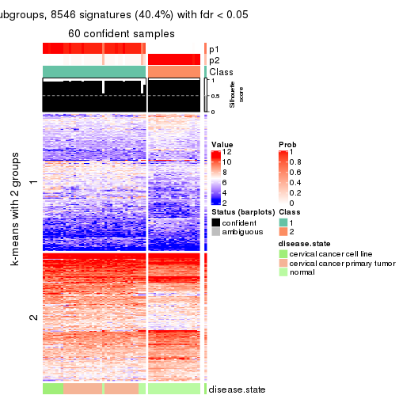</p>

</div>
<div id='tab-MAD-pam-get-signatures-no-scale-2'>
<pre><code class="r">get_signatures(res, k = 3, scale_rows = FALSE)
</code></pre>

<p></p>

</div>
<div id='tab-MAD-pam-get-signatures-no-scale-3'>
<pre><code class="r">get_signatures(res, k = 4, scale_rows = FALSE)
</code></pre>

<p></p>

</div>
<div id='tab-MAD-pam-get-signatures-no-scale-4'>
<pre><code class="r">get_signatures(res, k = 5, scale_rows = FALSE)
</code></pre>

<p></p>

</div>
<div id='tab-MAD-pam-get-signatures-no-scale-5'>
<pre><code class="r">get_signatures(res, k = 6, scale_rows = FALSE)
</code></pre>

<p></p>

</div>
</div>


Compare the overlap of signatures from different k:

```r
compare_signatures(res)
```


`get_signature()` returns a data frame invisibly. TO get the list of signatures, the function
call should be assigned to a variable explicitly. In following code, if `plot` argument is set
to `FALSE`, no heatmap is plotted while only the differential analysis is performed.

```r
# code only for demonstration
tb = get_signature(res, k = ..., plot = FALSE)
```

An example of the output of `tb` is:

```
#>   which_row         fdr    mean_1    mean_2 scaled_mean_1 scaled_mean_2 km
#> 1        38 0.042760348  8.373488  9.131774    -0.5533452     0.5164555  1
#> 2        40 0.018707592  7.106213  8.469186    -0.6173731     0.5762149  1
#> 3        55 0.019134737 10.221463 11.207825    -0.6159697     0.5749050  1
#> 4        59 0.006059896  5.921854  7.869574    -0.6899429     0.6439467  1
#> 5        60 0.018055526  8.928898 10.211722    -0.6204761     0.5791110  1
#> 6        98 0.009384629 15.714769 14.887706     0.6635654    -0.6193277  2
...
```

The columns in `tb` are:

1. `which_row`: row indices corresponding to the input matrix.
2. `fdr`: FDR for the differential test. 
3. `mean_x`: The mean value in group x.
4. `scaled_mean_x`: The mean value in group x after rows are scaled.
5. `km`: Row groups if k-means clustering is applied to rows.


UMAP plot which shows how samples are separated.


<script>
$( function() {
	$( '#tabs-MAD-pam-dimension-reduction' ).tabs();
} );
</script>
<div id='tabs-MAD-pam-dimension-reduction'>
<ul>
<li><a href='#tab-MAD-pam-dimension-reduction-1'>k = 2</a></li>
<li><a href='#tab-MAD-pam-dimension-reduction-2'>k = 3</a></li>
<li><a href='#tab-MAD-pam-dimension-reduction-3'>k = 4</a></li>
<li><a href='#tab-MAD-pam-dimension-reduction-4'>k = 5</a></li>
<li><a href='#tab-MAD-pam-dimension-reduction-5'>k = 6</a></li>
</ul>
<div id='tab-MAD-pam-dimension-reduction-1'>
<pre><code class="r">dimension_reduction(res, k = 2, method = &quot;UMAP&quot;)
</code></pre>

<p></p>

</div>
<div id='tab-MAD-pam-dimension-reduction-2'>
<pre><code class="r">dimension_reduction(res, k = 3, method = &quot;UMAP&quot;)
</code></pre>

<p></p>

</div>
<div id='tab-MAD-pam-dimension-reduction-3'>
<pre><code class="r">dimension_reduction(res, k = 4, method = &quot;UMAP&quot;)
</code></pre>

<p>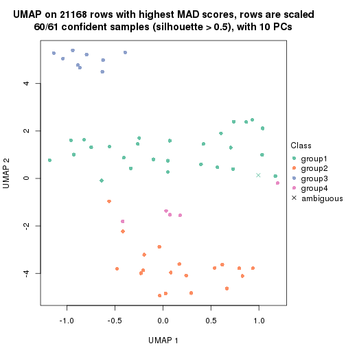</p>

</div>
<div id='tab-MAD-pam-dimension-reduction-4'>
<pre><code class="r">dimension_reduction(res, k = 5, method = &quot;UMAP&quot;)
</code></pre>

<p></p>

</div>
<div id='tab-MAD-pam-dimension-reduction-5'>
<pre><code class="r">dimension_reduction(res, k = 6, method = &quot;UMAP&quot;)
</code></pre>

<p></p>

</div>
</div>


Following heatmap shows how subgroups are split when increasing `k`:

```r
collect_classes(res)
```


Test correlation between subgroups and known annotations. If the known
annotation is numeric, one-way ANOVA test is applied, and if the known
annotation is discrete, chi-squared contingency table test is applied.

```r
test_to_known_factors(res)
```

```
#>          n disease.state(p) k
#> MAD:pam 60         1.69e-10 2
#> MAD:pam 61         6.70e-22 3
#> MAD:pam 60         9.09e-22 4
#> MAD:pam 59         7.23e-21 5
#> MAD:pam 59         5.78e-19 6
```


If matrix rows can be associated to genes, consider to use `GO_Enrichment(res,
...)` to perform function enrichment for the signature genes.


 

---------------------------------------------------


### MAD:mclust**


The object with results only for a single top-value method and a single partition method 
can be extracted as:

```r
res = res_list["MAD", "mclust"]
# you can also extract it by
# res = res_list["MAD:mclust"]
```

A summary of `res` and all the functions that can be applied to it:

```r
res
```

```
#> A 'ConsensusPartition' object with k = 2, 3, 4, 5, 6.
#>   On a matrix with 21168 rows and 61 columns.
#>   Top rows (1000, 2000, 3000, 4000, 5000) are extracted by 'MAD' method.
#>   Subgroups are detected by 'mclust' method.
#>   Performed in total 1250 partitions by row resampling.
#>   Best k for subgroups seems to be 6.
#> 
#> Following methods can be applied to this 'ConsensusPartition' object:
#>  [1] "cola_report"             "collect_classes"         "collect_plots"          
#>  [4] "collect_stats"           "colnames"                "compare_signatures"     
#>  [7] "consensus_heatmap"       "dimension_reduction"     "functional_enrichment"  
#> [10] "get_anno_col"            "get_anno"                "get_classes"            
#> [13] "get_consensus"           "get_matrix"              "get_membership"         
#> [16] "get_param"               "get_signatures"          "get_stats"              
#> [19] "is_best_k"               "is_stable_k"             "membership_heatmap"     
#> [22] "ncol"                    "nrow"                    "plot_ecdf"              
#> [25] "rownames"                "select_partition_number" "show"                   
#> [28] "suggest_best_k"          "test_to_known_factors"
```

`collect_plots()` function collects all the plots made from `res` for all `k` (number of partitions)
into one single page to provide an easy and fast comparison between different `k`.

```r
collect_plots(res)
```


The plots are:

- The first row: a plot of the ECDF (Empirical cumulative distribution
  function) curves of the consensus matrix for each `k` and the heatmap of
  predicted classes for each `k`.
- The second row: heatmaps of the consensus matrix for each `k`.
- The third row: heatmaps of the membership matrix for each `k`.
- The fouth row: heatmaps of the signatures for each `k`.

All the plots in panels can be made by individual functions and they are
plotted later in this section.

`select_partition_number()` produces several plots showing different
statistics for choosing "optimized" `k`. There are following statistics:

- ECDF curves of the consensus matrix for each `k`;
- 1-PAC. [The PAC
  score](https://en.wikipedia.org/wiki/Consensus_clustering#Over-interpretation_potential_of_consensus_clustering)
  measures the proportion of the ambiguous subgrouping.
- Mean silhouette score.
- Concordance. The mean probability of fiting the consensus class ids in all
  partitions.
- Area increased. Denote $A_k$ as the area under the ECDF curve for current
  `k`, the area increased is defined as $A_k - A_{k-1}$.
- Rand index. The percent of pairs of samples that are both in a same cluster
  or both are not in a same cluster in the partition of k and k-1.
- Jaccard index. The ratio of pairs of samples are both in a same cluster in
  the partition of k and k-1 and the pairs of samples are both in a same
  cluster in the partition k or k-1.

The detailed explanations of these statistics can be found in [the cola
vignette](http://bioconductor.org/packages/devel/bioc/vignettes/cola/inst/doc/cola.html#toc_13).

Generally speaking, lower PAC score, higher mean silhouette score or higher
concordance corresponds to better partition. Rand index and Jaccard index
measure how similar the current partition is compared to partition with `k-1`.
If they are too similar, we won't accept `k` is better than `k-1`.

```r
select_partition_number(res)
```

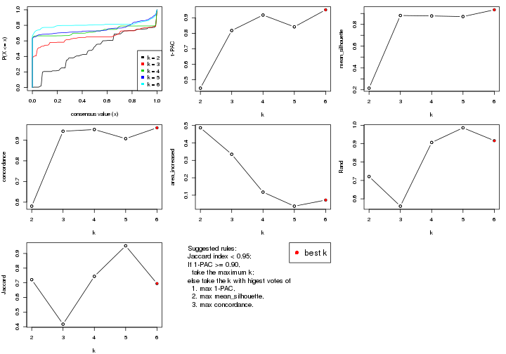

The numeric values for all these statistics can be obtained by `get_stats()`.

```r
get_stats(res)
```

```
#>   k 1-PAC mean_silhouette concordance area_increased  Rand Jaccard
#> 2 2 0.446           0.215       0.581         0.4869 0.721   0.721
#> 3 3 0.818           0.882       0.943         0.3350 0.560   0.418
#> 4 4 0.918           0.878       0.951         0.1176 0.907   0.744
#> 5 5 0.842           0.872       0.907         0.0369 0.986   0.952
#> 6 6 0.952           0.934       0.960         0.0720 0.916   0.695
```

`suggest_best_k()` suggests the best $k$ based on these statistics. The rules are as follows:

- All $k$ with Jaccard index larger than 0.95 are removed because the increase of
  the partition number does not provides enough extra information. If all $k$ are removed,
  the best $k$ is assigned by `NA`.
- For $k$ with 1-PAC larger than 0.9, the maximal $k$ is taken as the "best k". Other $k$ is called "optional k".
- If it does not fit the second rule. The $k$ with the highest vote of highest
  1-PAC, mean silhouette and concordance is taken as the "best k".

```r
suggest_best_k(res)
```

```
#> [1] 6
#> attr(,"optional")
#> [1] 4
```

There is also optional best $k$ = 4 that is worth to check.

Following shows the table of the partitions (You need to click the **show/hide
code output** link to see it). The membership matrix (columns with name `p*`)
is inferred by
[`clue::cl_consensus()`](https://www.rdocumentation.org/link/cl_consensus?package=clue)
function with the `SE` method. Basically the value in the membership matrix
represents the probability to belong to a certain group. The finall class
label for an item is determined with the group with highest probability it
belongs to.

In `get_classes()` function, the entropy is calculated from the membership
matrix and the silhouette score is calculated from the consensus matrix.


<script>
$( function() {
	$( '#tabs-MAD-mclust-get-classes' ).tabs();
} );
</script>
<div id='tabs-MAD-mclust-get-classes'>
<ul>
<li><a href='#tab-MAD-mclust-get-classes-1'>k = 2</a></li>
<li><a href='#tab-MAD-mclust-get-classes-2'>k = 3</a></li>
<li><a href='#tab-MAD-mclust-get-classes-3'>k = 4</a></li>
<li><a href='#tab-MAD-mclust-get-classes-4'>k = 5</a></li>
<li><a href='#tab-MAD-mclust-get-classes-5'>k = 6</a></li>
</ul>

<div id='tab-MAD-mclust-get-classes-1'>
<p><a id='tab-MAD-mclust-get-classes-1-a' style='color:#0366d6' href='#'>show/hide code output</a></p>
<pre><code class="r">cbind(get_classes(res, k = 2), get_membership(res, k = 2))
</code></pre>

<pre><code>#&gt;           class entropy silhouette    p1    p2
#&gt; GSM246087     1  0.7602      0.853 0.780 0.220
#&gt; GSM246088     1  0.7602      0.853 0.780 0.220
#&gt; GSM246089     1  0.7602      0.853 0.780 0.220
#&gt; GSM246090     1  0.7602      0.853 0.780 0.220
#&gt; GSM246119     1  0.7602      0.853 0.780 0.220
#&gt; GSM246120     1  0.7602      0.853 0.780 0.220
#&gt; GSM246121     1  0.7602      0.853 0.780 0.220
#&gt; GSM246122     1  0.7602      0.853 0.780 0.220
#&gt; GSM246123     1  0.7602      0.853 0.780 0.220
#&gt; GSM246422     2  0.3733      0.104 0.072 0.928
#&gt; GSM246423     2  0.3733      0.104 0.072 0.928
#&gt; GSM246484     2  0.3733      0.104 0.072 0.928
#&gt; GSM246485     2  0.0000      0.155 0.000 1.000
#&gt; GSM246486     2  0.0000      0.155 0.000 1.000
#&gt; GSM246487     2  0.7528      0.292 0.216 0.784
#&gt; GSM246488     2  0.0938      0.149 0.012 0.988
#&gt; GSM246489     2  0.9881     -0.294 0.436 0.564
#&gt; GSM246490     2  0.9881     -0.294 0.436 0.564
#&gt; GSM246491     2  0.9881     -0.294 0.436 0.564
#&gt; GSM247162     2  0.9881     -0.294 0.436 0.564
#&gt; GSM247163     2  0.9881     -0.294 0.436 0.564
#&gt; GSM247164     2  0.9881     -0.294 0.436 0.564
#&gt; GSM247165     2  0.9881     -0.294 0.436 0.564
#&gt; GSM247166     2  0.9881     -0.294 0.436 0.564
#&gt; GSM247168     2  0.9881     -0.294 0.436 0.564
#&gt; GSM247169     2  0.9881     -0.294 0.436 0.564
#&gt; GSM247171     2  0.9881     -0.294 0.436 0.564
#&gt; GSM247173     2  0.9881     -0.294 0.436 0.564
#&gt; GSM247174     2  0.9881     -0.294 0.436 0.564
#&gt; GSM247175     2  0.9881     -0.294 0.436 0.564
#&gt; GSM247188     2  0.9881     -0.294 0.436 0.564
#&gt; GSM247189     2  0.6531     -0.114 0.168 0.832
#&gt; GSM247190     2  0.9881     -0.294 0.436 0.564
#&gt; GSM247650     2  0.9998      0.393 0.492 0.508
#&gt; GSM247651     2  0.9998      0.393 0.492 0.508
#&gt; GSM247652     2  0.9998      0.393 0.492 0.508
#&gt; GSM247653     2  0.9998      0.393 0.492 0.508
#&gt; GSM247654     2  0.9998      0.393 0.492 0.508
#&gt; GSM247655     2  0.9998      0.393 0.492 0.508
#&gt; GSM247656     1  1.0000     -0.454 0.504 0.496
#&gt; GSM247657     2  0.9998      0.393 0.492 0.508
#&gt; GSM247658     2  0.9998      0.393 0.492 0.508
#&gt; GSM247659     2  0.9170      0.263 0.332 0.668
#&gt; GSM247660     2  0.9998      0.393 0.492 0.508
#&gt; GSM247661     2  0.9998      0.393 0.492 0.508
#&gt; GSM247662     2  1.0000      0.389 0.496 0.504
#&gt; GSM247663     2  0.9998      0.393 0.492 0.508
#&gt; GSM247856     2  0.9998      0.393 0.492 0.508
#&gt; GSM247857     2  0.9998      0.393 0.492 0.508
#&gt; GSM247859     2  0.9998      0.393 0.492 0.508
#&gt; GSM247860     2  0.9998      0.393 0.492 0.508
#&gt; GSM247862     2  0.9998      0.393 0.492 0.508
#&gt; GSM247864     2  0.9998      0.393 0.492 0.508
#&gt; GSM247865     2  0.9775      0.365 0.412 0.588
#&gt; GSM247866     2  0.9998      0.393 0.492 0.508
#&gt; GSM247876     2  0.9983      0.383 0.476 0.524
#&gt; GSM247877     2  0.6887      0.108 0.184 0.816
#&gt; GSM247878     2  0.5059      0.106 0.112 0.888
#&gt; GSM247879     2  0.9286      0.137 0.344 0.656
#&gt; GSM247881     2  0.9998      0.393 0.492 0.508
#&gt; GSM247883     2  0.9998      0.393 0.492 0.508
</code></pre>

<script>
$('#tab-MAD-mclust-get-classes-1-a').parent().next().next().hide();
$('#tab-MAD-mclust-get-classes-1-a').click(function(){
  $('#tab-MAD-mclust-get-classes-1-a').parent().next().next().toggle();
  return(false);
});
</script>
</div>

<div id='tab-MAD-mclust-get-classes-2'>
<p><a id='tab-MAD-mclust-get-classes-2-a' style='color:#0366d6' href='#'>show/hide code output</a></p>
<pre><code class="r">cbind(get_classes(res, k = 3), get_membership(res, k = 3))
</code></pre>

<pre><code>#&gt;           class entropy silhouette    p1    p2    p3
#&gt; GSM246087     3  0.0000      0.944 0.000 0.000 1.000
#&gt; GSM246088     3  0.0000      0.944 0.000 0.000 1.000
#&gt; GSM246089     3  0.0000      0.944 0.000 0.000 1.000
#&gt; GSM246090     3  0.0000      0.944 0.000 0.000 1.000
#&gt; GSM246119     3  0.0000      0.944 0.000 0.000 1.000
#&gt; GSM246120     3  0.0000      0.944 0.000 0.000 1.000
#&gt; GSM246121     3  0.0000      0.944 0.000 0.000 1.000
#&gt; GSM246122     3  0.0000      0.944 0.000 0.000 1.000
#&gt; GSM246123     3  0.0000      0.944 0.000 0.000 1.000
#&gt; GSM246422     3  0.4982      0.830 0.036 0.136 0.828
#&gt; GSM246423     3  0.4982      0.830 0.036 0.136 0.828
#&gt; GSM246484     3  0.4982      0.830 0.036 0.136 0.828
#&gt; GSM246485     2  0.6526      0.658 0.036 0.704 0.260
#&gt; GSM246486     2  0.6526      0.658 0.036 0.704 0.260
#&gt; GSM246487     2  0.7884      0.585 0.100 0.640 0.260
#&gt; GSM246488     2  0.6526      0.658 0.036 0.704 0.260
#&gt; GSM246489     2  0.0000      0.898 0.000 1.000 0.000
#&gt; GSM246490     2  0.0000      0.898 0.000 1.000 0.000
#&gt; GSM246491     2  0.3482      0.822 0.000 0.872 0.128
#&gt; GSM247162     2  0.0000      0.898 0.000 1.000 0.000
#&gt; GSM247163     2  0.3619      0.815 0.000 0.864 0.136
#&gt; GSM247164     2  0.0000      0.898 0.000 1.000 0.000
#&gt; GSM247165     2  0.0237      0.896 0.000 0.996 0.004
#&gt; GSM247166     2  0.0000      0.898 0.000 1.000 0.000
#&gt; GSM247168     2  0.0000      0.898 0.000 1.000 0.000
#&gt; GSM247169     2  0.0000      0.898 0.000 1.000 0.000
#&gt; GSM247171     2  0.0000      0.898 0.000 1.000 0.000
#&gt; GSM247173     2  0.0000      0.898 0.000 1.000 0.000
#&gt; GSM247174     2  0.0000      0.898 0.000 1.000 0.000
#&gt; GSM247175     2  0.0000      0.898 0.000 1.000 0.000
#&gt; GSM247188     2  0.0000      0.898 0.000 1.000 0.000
#&gt; GSM247189     2  0.6526      0.658 0.036 0.704 0.260
#&gt; GSM247190     2  0.0000      0.898 0.000 1.000 0.000
#&gt; GSM247650     1  0.0000      0.957 1.000 0.000 0.000
#&gt; GSM247651     1  0.0000      0.957 1.000 0.000 0.000
#&gt; GSM247652     1  0.0000      0.957 1.000 0.000 0.000
#&gt; GSM247653     1  0.0000      0.957 1.000 0.000 0.000
#&gt; GSM247654     1  0.0000      0.957 1.000 0.000 0.000
#&gt; GSM247655     1  0.0000      0.957 1.000 0.000 0.000
#&gt; GSM247656     1  0.0000      0.957 1.000 0.000 0.000
#&gt; GSM247657     1  0.0000      0.957 1.000 0.000 0.000
#&gt; GSM247658     1  0.0000      0.957 1.000 0.000 0.000
#&gt; GSM247659     1  0.5815      0.558 0.692 0.004 0.304
#&gt; GSM247660     1  0.0000      0.957 1.000 0.000 0.000
#&gt; GSM247661     1  0.0000      0.957 1.000 0.000 0.000
#&gt; GSM247662     1  0.0000      0.957 1.000 0.000 0.000
#&gt; GSM247663     1  0.0000      0.957 1.000 0.000 0.000
#&gt; GSM247856     1  0.0000      0.957 1.000 0.000 0.000
#&gt; GSM247857     1  0.0000      0.957 1.000 0.000 0.000
#&gt; GSM247859     1  0.0000      0.957 1.000 0.000 0.000
#&gt; GSM247860     1  0.0000      0.957 1.000 0.000 0.000
#&gt; GSM247862     1  0.0000      0.957 1.000 0.000 0.000
#&gt; GSM247864     1  0.0000      0.957 1.000 0.000 0.000
#&gt; GSM247865     1  0.0424      0.951 0.992 0.000 0.008
#&gt; GSM247866     1  0.0000      0.957 1.000 0.000 0.000
#&gt; GSM247876     1  0.1529      0.921 0.960 0.000 0.040
#&gt; GSM247877     3  0.3780      0.884 0.044 0.064 0.892
#&gt; GSM247878     1  0.7267      0.521 0.668 0.064 0.268
#&gt; GSM247879     1  0.6333      0.494 0.656 0.012 0.332
#&gt; GSM247881     1  0.0000      0.957 1.000 0.000 0.000
#&gt; GSM247883     1  0.0000      0.957 1.000 0.000 0.000
</code></pre>

<script>
$('#tab-MAD-mclust-get-classes-2-a').parent().next().next().hide();
$('#tab-MAD-mclust-get-classes-2-a').click(function(){
  $('#tab-MAD-mclust-get-classes-2-a').parent().next().next().toggle();
  return(false);
});
</script>
</div>

<div id='tab-MAD-mclust-get-classes-3'>
<p><a id='tab-MAD-mclust-get-classes-3-a' style='color:#0366d6' href='#'>show/hide code output</a></p>
<pre><code class="r">cbind(get_classes(res, k = 4), get_membership(res, k = 4))
</code></pre>

<pre><code>#&gt;           class entropy silhouette    p1    p2 p3    p4
#&gt; GSM246087     3  0.0000     1.0000 0.000 0.000  1 0.000
#&gt; GSM246088     3  0.0000     1.0000 0.000 0.000  1 0.000
#&gt; GSM246089     3  0.0000     1.0000 0.000 0.000  1 0.000
#&gt; GSM246090     3  0.0000     1.0000 0.000 0.000  1 0.000
#&gt; GSM246119     3  0.0000     1.0000 0.000 0.000  1 0.000
#&gt; GSM246120     3  0.0000     1.0000 0.000 0.000  1 0.000
#&gt; GSM246121     3  0.0000     1.0000 0.000 0.000  1 0.000
#&gt; GSM246122     3  0.0000     1.0000 0.000 0.000  1 0.000
#&gt; GSM246123     3  0.0000     1.0000 0.000 0.000  1 0.000
#&gt; GSM246422     4  0.0000     0.9988 0.000 0.000  0 1.000
#&gt; GSM246423     4  0.0000     0.9988 0.000 0.000  0 1.000
#&gt; GSM246484     4  0.0000     0.9988 0.000 0.000  0 1.000
#&gt; GSM246485     4  0.0000     0.9988 0.000 0.000  0 1.000
#&gt; GSM246486     4  0.0000     0.9988 0.000 0.000  0 1.000
#&gt; GSM246487     4  0.0000     0.9988 0.000 0.000  0 1.000
#&gt; GSM246488     4  0.0000     0.9988 0.000 0.000  0 1.000
#&gt; GSM246489     2  0.0000     0.8982 0.000 1.000  0 0.000
#&gt; GSM246490     2  0.0000     0.8982 0.000 1.000  0 0.000
#&gt; GSM246491     2  0.4382     0.5667 0.000 0.704  0 0.296
#&gt; GSM247162     2  0.0000     0.8982 0.000 1.000  0 0.000
#&gt; GSM247163     2  0.4967     0.2096 0.000 0.548  0 0.452
#&gt; GSM247164     2  0.4522     0.5421 0.000 0.680  0 0.320
#&gt; GSM247165     2  0.4522     0.5421 0.000 0.680  0 0.320
#&gt; GSM247166     2  0.0000     0.8982 0.000 1.000  0 0.000
#&gt; GSM247168     2  0.0000     0.8982 0.000 1.000  0 0.000
#&gt; GSM247169     2  0.0000     0.8982 0.000 1.000  0 0.000
#&gt; GSM247171     2  0.0000     0.8982 0.000 1.000  0 0.000
#&gt; GSM247173     2  0.0000     0.8982 0.000 1.000  0 0.000
#&gt; GSM247174     2  0.0000     0.8982 0.000 1.000  0 0.000
#&gt; GSM247175     2  0.0000     0.8982 0.000 1.000  0 0.000
#&gt; GSM247188     2  0.0000     0.8982 0.000 1.000  0 0.000
#&gt; GSM247189     4  0.0000     0.9988 0.000 0.000  0 1.000
#&gt; GSM247190     2  0.0000     0.8982 0.000 1.000  0 0.000
#&gt; GSM247650     1  0.0000     0.9325 1.000 0.000  0 0.000
#&gt; GSM247651     1  0.0707     0.9173 0.980 0.000  0 0.020
#&gt; GSM247652     1  0.0000     0.9325 1.000 0.000  0 0.000
#&gt; GSM247653     1  0.0000     0.9325 1.000 0.000  0 0.000
#&gt; GSM247654     1  0.0000     0.9325 1.000 0.000  0 0.000
#&gt; GSM247655     1  0.0000     0.9325 1.000 0.000  0 0.000
#&gt; GSM247656     1  0.0000     0.9325 1.000 0.000  0 0.000
#&gt; GSM247657     1  0.0000     0.9325 1.000 0.000  0 0.000
#&gt; GSM247658     1  0.0000     0.9325 1.000 0.000  0 0.000
#&gt; GSM247659     1  0.4933     0.2532 0.568 0.000  0 0.432
#&gt; GSM247660     1  0.0000     0.9325 1.000 0.000  0 0.000
#&gt; GSM247661     1  0.0000     0.9325 1.000 0.000  0 0.000
#&gt; GSM247662     1  0.0000     0.9325 1.000 0.000  0 0.000
#&gt; GSM247663     1  0.0000     0.9325 1.000 0.000  0 0.000
#&gt; GSM247856     1  0.0000     0.9325 1.000 0.000  0 0.000
#&gt; GSM247857     1  0.0000     0.9325 1.000 0.000  0 0.000
#&gt; GSM247859     1  0.0000     0.9325 1.000 0.000  0 0.000
#&gt; GSM247860     1  0.0000     0.9325 1.000 0.000  0 0.000
#&gt; GSM247862     1  0.0000     0.9325 1.000 0.000  0 0.000
#&gt; GSM247864     1  0.0000     0.9325 1.000 0.000  0 0.000
#&gt; GSM247865     1  0.4500     0.5382 0.684 0.000  0 0.316
#&gt; GSM247866     1  0.0000     0.9325 1.000 0.000  0 0.000
#&gt; GSM247876     1  0.0188     0.9298 0.996 0.000  0 0.004
#&gt; GSM247877     4  0.0000     0.9988 0.000 0.000  0 1.000
#&gt; GSM247878     4  0.0336     0.9889 0.008 0.000  0 0.992
#&gt; GSM247879     1  0.4998     0.0812 0.512 0.000  0 0.488
#&gt; GSM247881     1  0.0000     0.9325 1.000 0.000  0 0.000
#&gt; GSM247883     1  0.4477     0.5456 0.688 0.000  0 0.312
</code></pre>

<script>
$('#tab-MAD-mclust-get-classes-3-a').parent().next().next().hide();
$('#tab-MAD-mclust-get-classes-3-a').click(function(){
  $('#tab-MAD-mclust-get-classes-3-a').parent().next().next().toggle();
  return(false);
});
</script>
</div>

<div id='tab-MAD-mclust-get-classes-4'>
<p><a id='tab-MAD-mclust-get-classes-4-a' style='color:#0366d6' href='#'>show/hide code output</a></p>
<pre><code class="r">cbind(get_classes(res, k = 5), get_membership(res, k = 5))
</code></pre>

<pre><code>#&gt;           class entropy silhouette    p1    p2 p3    p4    p5
#&gt; GSM246087     3  0.0000      1.000 0.000 0.000  1 0.000 0.000
#&gt; GSM246088     3  0.0000      1.000 0.000 0.000  1 0.000 0.000
#&gt; GSM246089     3  0.0000      1.000 0.000 0.000  1 0.000 0.000
#&gt; GSM246090     3  0.0000      1.000 0.000 0.000  1 0.000 0.000
#&gt; GSM246119     3  0.0000      1.000 0.000 0.000  1 0.000 0.000
#&gt; GSM246120     3  0.0000      1.000 0.000 0.000  1 0.000 0.000
#&gt; GSM246121     3  0.0000      1.000 0.000 0.000  1 0.000 0.000
#&gt; GSM246122     3  0.0000      1.000 0.000 0.000  1 0.000 0.000
#&gt; GSM246123     3  0.0000      1.000 0.000 0.000  1 0.000 0.000
#&gt; GSM246422     4  0.0703      0.972 0.000 0.000  0 0.976 0.024
#&gt; GSM246423     4  0.0794      0.971 0.000 0.000  0 0.972 0.028
#&gt; GSM246484     4  0.0703      0.972 0.000 0.000  0 0.976 0.024
#&gt; GSM246485     5  0.4378      0.886 0.036 0.000  0 0.248 0.716
#&gt; GSM246486     5  0.3612      0.905 0.000 0.000  0 0.268 0.732
#&gt; GSM246487     5  0.4921      0.783 0.036 0.000  0 0.360 0.604
#&gt; GSM246488     5  0.3636      0.907 0.000 0.000  0 0.272 0.728
#&gt; GSM246489     2  0.0000      0.896 0.000 1.000  0 0.000 0.000
#&gt; GSM246490     2  0.0963      0.874 0.000 0.964  0 0.000 0.036
#&gt; GSM246491     2  0.3691      0.722 0.000 0.804  0 0.040 0.156
#&gt; GSM247162     2  0.0000      0.896 0.000 1.000  0 0.000 0.000
#&gt; GSM247163     2  0.5167      0.340 0.000 0.552  0 0.044 0.404
#&gt; GSM247164     2  0.4192      0.403 0.000 0.596  0 0.000 0.404
#&gt; GSM247165     2  0.4192      0.403 0.000 0.596  0 0.000 0.404
#&gt; GSM247166     2  0.0000      0.896 0.000 1.000  0 0.000 0.000
#&gt; GSM247168     2  0.0000      0.896 0.000 1.000  0 0.000 0.000
#&gt; GSM247169     2  0.0000      0.896 0.000 1.000  0 0.000 0.000
#&gt; GSM247171     2  0.0000      0.896 0.000 1.000  0 0.000 0.000
#&gt; GSM247173     2  0.0000      0.896 0.000 1.000  0 0.000 0.000
#&gt; GSM247174     2  0.0000      0.896 0.000 1.000  0 0.000 0.000
#&gt; GSM247175     2  0.0000      0.896 0.000 1.000  0 0.000 0.000
#&gt; GSM247188     2  0.0000      0.896 0.000 1.000  0 0.000 0.000
#&gt; GSM247189     5  0.3857      0.896 0.000 0.000  0 0.312 0.688
#&gt; GSM247190     2  0.0000      0.896 0.000 1.000  0 0.000 0.000
#&gt; GSM247650     1  0.0000      0.904 1.000 0.000  0 0.000 0.000
#&gt; GSM247651     1  0.1478      0.897 0.936 0.000  0 0.000 0.064
#&gt; GSM247652     1  0.0794      0.903 0.972 0.000  0 0.000 0.028
#&gt; GSM247653     1  0.3210      0.804 0.788 0.000  0 0.000 0.212
#&gt; GSM247654     1  0.3177      0.807 0.792 0.000  0 0.000 0.208
#&gt; GSM247655     1  0.1478      0.897 0.936 0.000  0 0.000 0.064
#&gt; GSM247656     1  0.1410      0.892 0.940 0.000  0 0.000 0.060
#&gt; GSM247657     1  0.3003      0.823 0.812 0.000  0 0.000 0.188
#&gt; GSM247658     1  0.0609      0.905 0.980 0.000  0 0.000 0.020
#&gt; GSM247659     1  0.3586      0.762 0.792 0.000  0 0.188 0.020
#&gt; GSM247660     1  0.1478      0.897 0.936 0.000  0 0.000 0.064
#&gt; GSM247661     1  0.3177      0.807 0.792 0.000  0 0.000 0.208
#&gt; GSM247662     1  0.0404      0.904 0.988 0.000  0 0.000 0.012
#&gt; GSM247663     1  0.0000      0.904 1.000 0.000  0 0.000 0.000
#&gt; GSM247856     1  0.0404      0.904 0.988 0.000  0 0.000 0.012
#&gt; GSM247857     1  0.0703      0.902 0.976 0.000  0 0.000 0.024
#&gt; GSM247859     1  0.2424      0.854 0.868 0.000  0 0.000 0.132
#&gt; GSM247860     1  0.3210      0.804 0.788 0.000  0 0.000 0.212
#&gt; GSM247862     1  0.1043      0.902 0.960 0.000  0 0.000 0.040
#&gt; GSM247864     1  0.1478      0.897 0.936 0.000  0 0.000 0.064
#&gt; GSM247865     1  0.3519      0.763 0.776 0.000  0 0.008 0.216
#&gt; GSM247866     1  0.1043      0.902 0.960 0.000  0 0.000 0.040
#&gt; GSM247876     1  0.0162      0.904 0.996 0.000  0 0.000 0.004
#&gt; GSM247877     4  0.0404      0.961 0.000 0.000  0 0.988 0.012
#&gt; GSM247878     4  0.0671      0.951 0.004 0.000  0 0.980 0.016
#&gt; GSM247879     1  0.3630      0.742 0.780 0.000  0 0.204 0.016
#&gt; GSM247881     1  0.1043      0.902 0.960 0.000  0 0.000 0.040
#&gt; GSM247883     1  0.3039      0.798 0.808 0.000  0 0.000 0.192
</code></pre>

<script>
$('#tab-MAD-mclust-get-classes-4-a').parent().next().next().hide();
$('#tab-MAD-mclust-get-classes-4-a').click(function(){
  $('#tab-MAD-mclust-get-classes-4-a').parent().next().next().toggle();
  return(false);
});
</script>
</div>

<div id='tab-MAD-mclust-get-classes-5'>
<p><a id='tab-MAD-mclust-get-classes-5-a' style='color:#0366d6' href='#'>show/hide code output</a></p>
<pre><code class="r">cbind(get_classes(res, k = 6), get_membership(res, k = 6))
</code></pre>

<pre><code>#&gt;           class entropy silhouette    p1    p2 p3    p4    p5    p6
#&gt; GSM246087     3  0.0000      1.000 0.000 0.000  1 0.000 0.000 0.000
#&gt; GSM246088     3  0.0000      1.000 0.000 0.000  1 0.000 0.000 0.000
#&gt; GSM246089     3  0.0000      1.000 0.000 0.000  1 0.000 0.000 0.000
#&gt; GSM246090     3  0.0000      1.000 0.000 0.000  1 0.000 0.000 0.000
#&gt; GSM246119     3  0.0000      1.000 0.000 0.000  1 0.000 0.000 0.000
#&gt; GSM246120     3  0.0000      1.000 0.000 0.000  1 0.000 0.000 0.000
#&gt; GSM246121     3  0.0000      1.000 0.000 0.000  1 0.000 0.000 0.000
#&gt; GSM246122     3  0.0000      1.000 0.000 0.000  1 0.000 0.000 0.000
#&gt; GSM246123     3  0.0000      1.000 0.000 0.000  1 0.000 0.000 0.000
#&gt; GSM246422     5  0.0146      0.985 0.000 0.000  0 0.004 0.996 0.000
#&gt; GSM246423     5  0.0146      0.985 0.000 0.000  0 0.004 0.996 0.000
#&gt; GSM246484     5  0.0146      0.985 0.000 0.000  0 0.004 0.996 0.000
#&gt; GSM246485     4  0.0000      0.993 0.000 0.000  0 1.000 0.000 0.000
#&gt; GSM246486     4  0.0000      0.993 0.000 0.000  0 1.000 0.000 0.000
#&gt; GSM246487     4  0.0862      0.971 0.000 0.004  0 0.972 0.008 0.016
#&gt; GSM246488     4  0.0000      0.993 0.000 0.000  0 1.000 0.000 0.000
#&gt; GSM246489     2  0.0000      0.977 0.000 1.000  0 0.000 0.000 0.000
#&gt; GSM246490     2  0.0547      0.967 0.000 0.980  0 0.020 0.000 0.000
#&gt; GSM246491     2  0.0632      0.964 0.000 0.976  0 0.024 0.000 0.000
#&gt; GSM247162     2  0.0000      0.977 0.000 1.000  0 0.000 0.000 0.000
#&gt; GSM247163     2  0.2597      0.814 0.000 0.824  0 0.176 0.000 0.000
#&gt; GSM247164     2  0.1387      0.933 0.000 0.932  0 0.068 0.000 0.000
#&gt; GSM247165     2  0.1387      0.933 0.000 0.932  0 0.068 0.000 0.000
#&gt; GSM247166     2  0.0000      0.977 0.000 1.000  0 0.000 0.000 0.000
#&gt; GSM247168     2  0.0000      0.977 0.000 1.000  0 0.000 0.000 0.000
#&gt; GSM247169     2  0.0000      0.977 0.000 1.000  0 0.000 0.000 0.000
#&gt; GSM247171     2  0.0000      0.977 0.000 1.000  0 0.000 0.000 0.000
#&gt; GSM247173     2  0.0000      0.977 0.000 1.000  0 0.000 0.000 0.000
#&gt; GSM247174     2  0.0000      0.977 0.000 1.000  0 0.000 0.000 0.000
#&gt; GSM247175     2  0.0000      0.977 0.000 1.000  0 0.000 0.000 0.000
#&gt; GSM247188     2  0.0000      0.977 0.000 1.000  0 0.000 0.000 0.000
#&gt; GSM247189     4  0.0000      0.993 0.000 0.000  0 1.000 0.000 0.000
#&gt; GSM247190     2  0.0000      0.977 0.000 1.000  0 0.000 0.000 0.000
#&gt; GSM247650     1  0.2491      0.865 0.836 0.000  0 0.000 0.000 0.164
#&gt; GSM247651     6  0.0458      0.896 0.016 0.000  0 0.000 0.000 0.984
#&gt; GSM247652     1  0.1141      0.940 0.948 0.000  0 0.000 0.000 0.052
#&gt; GSM247653     1  0.0260      0.926 0.992 0.000  0 0.000 0.000 0.008
#&gt; GSM247654     1  0.0363      0.928 0.988 0.000  0 0.000 0.000 0.012
#&gt; GSM247655     6  0.0458      0.896 0.016 0.000  0 0.000 0.000 0.984
#&gt; GSM247656     1  0.0937      0.937 0.960 0.000  0 0.000 0.000 0.040
#&gt; GSM247657     1  0.0547      0.932 0.980 0.000  0 0.000 0.000 0.020
#&gt; GSM247658     1  0.1204      0.940 0.944 0.000  0 0.000 0.000 0.056
#&gt; GSM247659     1  0.1802      0.929 0.916 0.000  0 0.000 0.012 0.072
#&gt; GSM247660     6  0.0458      0.896 0.016 0.000  0 0.000 0.000 0.984
#&gt; GSM247661     1  0.0260      0.922 0.992 0.000  0 0.000 0.000 0.008
#&gt; GSM247662     1  0.1141      0.940 0.948 0.000  0 0.000 0.000 0.052
#&gt; GSM247663     1  0.2562      0.860 0.828 0.000  0 0.000 0.000 0.172
#&gt; GSM247856     1  0.1141      0.940 0.948 0.000  0 0.000 0.000 0.052
#&gt; GSM247857     1  0.1075      0.940 0.952 0.000  0 0.000 0.000 0.048
#&gt; GSM247859     6  0.0547      0.895 0.020 0.000  0 0.000 0.000 0.980
#&gt; GSM247860     1  0.0146      0.924 0.996 0.000  0 0.000 0.000 0.004
#&gt; GSM247862     6  0.3817      0.176 0.432 0.000  0 0.000 0.000 0.568
#&gt; GSM247864     6  0.0458      0.896 0.016 0.000  0 0.000 0.000 0.984
#&gt; GSM247865     6  0.0508      0.888 0.012 0.000  0 0.004 0.000 0.984
#&gt; GSM247866     6  0.2527      0.762 0.168 0.000  0 0.000 0.000 0.832
#&gt; GSM247876     1  0.2631      0.850 0.820 0.000  0 0.000 0.000 0.180
#&gt; GSM247877     5  0.0632      0.977 0.000 0.000  0 0.000 0.976 0.024
#&gt; GSM247878     5  0.0632      0.977 0.000 0.000  0 0.000 0.976 0.024
#&gt; GSM247879     1  0.2980      0.847 0.808 0.000  0 0.000 0.012 0.180
#&gt; GSM247881     1  0.1444      0.935 0.928 0.000  0 0.000 0.000 0.072
#&gt; GSM247883     6  0.0692      0.894 0.020 0.000  0 0.004 0.000 0.976
</code></pre>

<script>
$('#tab-MAD-mclust-get-classes-5-a').parent().next().next().hide();
$('#tab-MAD-mclust-get-classes-5-a').click(function(){
  $('#tab-MAD-mclust-get-classes-5-a').parent().next().next().toggle();
  return(false);
});
</script>
</div>
</div>

Heatmaps for the consensus matrix. It visualizes the probability of two
samples to be in a same group.


<script>
$( function() {
	$( '#tabs-MAD-mclust-consensus-heatmap' ).tabs();
} );
</script>
<div id='tabs-MAD-mclust-consensus-heatmap'>
<ul>
<li><a href='#tab-MAD-mclust-consensus-heatmap-1'>k = 2</a></li>
<li><a href='#tab-MAD-mclust-consensus-heatmap-2'>k = 3</a></li>
<li><a href='#tab-MAD-mclust-consensus-heatmap-3'>k = 4</a></li>
<li><a href='#tab-MAD-mclust-consensus-heatmap-4'>k = 5</a></li>
<li><a href='#tab-MAD-mclust-consensus-heatmap-5'>k = 6</a></li>
</ul>
<div id='tab-MAD-mclust-consensus-heatmap-1'>
<pre><code class="r">consensus_heatmap(res, k = 2)
</code></pre>

<p></p>

</div>
<div id='tab-MAD-mclust-consensus-heatmap-2'>
<pre><code class="r">consensus_heatmap(res, k = 3)
</code></pre>

<p>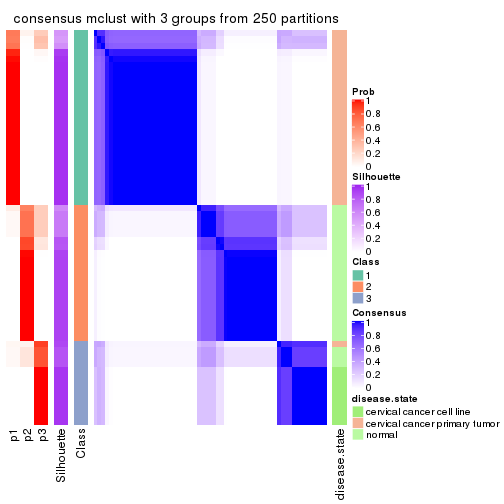</p>

</div>
<div id='tab-MAD-mclust-consensus-heatmap-3'>
<pre><code class="r">consensus_heatmap(res, k = 4)
</code></pre>

<p></p>

</div>
<div id='tab-MAD-mclust-consensus-heatmap-4'>
<pre><code class="r">consensus_heatmap(res, k = 5)
</code></pre>

<p></p>

</div>
<div id='tab-MAD-mclust-consensus-heatmap-5'>
<pre><code class="r">consensus_heatmap(res, k = 6)
</code></pre>

<p></p>

</div>
</div>

Heatmaps for the membership of samples in all partitions to see how consistent they are:


<script>
$( function() {
	$( '#tabs-MAD-mclust-membership-heatmap' ).tabs();
} );
</script>
<div id='tabs-MAD-mclust-membership-heatmap'>
<ul>
<li><a href='#tab-MAD-mclust-membership-heatmap-1'>k = 2</a></li>
<li><a href='#tab-MAD-mclust-membership-heatmap-2'>k = 3</a></li>
<li><a href='#tab-MAD-mclust-membership-heatmap-3'>k = 4</a></li>
<li><a href='#tab-MAD-mclust-membership-heatmap-4'>k = 5</a></li>
<li><a href='#tab-MAD-mclust-membership-heatmap-5'>k = 6</a></li>
</ul>
<div id='tab-MAD-mclust-membership-heatmap-1'>
<pre><code class="r">membership_heatmap(res, k = 2)
</code></pre>

<p></p>

</div>
<div id='tab-MAD-mclust-membership-heatmap-2'>
<pre><code class="r">membership_heatmap(res, k = 3)
</code></pre>

<p></p>

</div>
<div id='tab-MAD-mclust-membership-heatmap-3'>
<pre><code class="r">membership_heatmap(res, k = 4)
</code></pre>

<p></p>

</div>
<div id='tab-MAD-mclust-membership-heatmap-4'>
<pre><code class="r">membership_heatmap(res, k = 5)
</code></pre>

<p></p>

</div>
<div id='tab-MAD-mclust-membership-heatmap-5'>
<pre><code class="r">membership_heatmap(res, k = 6)
</code></pre>

<p></p>

</div>
</div>

As soon as we have had the classes for columns, we can look for signatures
which are significantly different between classes which can be candidate marks
for certain classes. Following are the heatmaps for signatures.


Signature heatmaps where rows are scaled:


<script>
$( function() {
	$( '#tabs-MAD-mclust-get-signatures' ).tabs();
} );
</script>
<div id='tabs-MAD-mclust-get-signatures'>
<ul>
<li><a href='#tab-MAD-mclust-get-signatures-1'>k = 2</a></li>
<li><a href='#tab-MAD-mclust-get-signatures-2'>k = 3</a></li>
<li><a href='#tab-MAD-mclust-get-signatures-3'>k = 4</a></li>
<li><a href='#tab-MAD-mclust-get-signatures-4'>k = 5</a></li>
<li><a href='#tab-MAD-mclust-get-signatures-5'>k = 6</a></li>
</ul>
<div id='tab-MAD-mclust-get-signatures-1'>
<pre><code class="r">get_signatures(res, k = 2)
</code></pre>

<p></p>

</div>
<div id='tab-MAD-mclust-get-signatures-2'>
<pre><code class="r">get_signatures(res, k = 3)
</code></pre>

<p></p>

</div>
<div id='tab-MAD-mclust-get-signatures-3'>
<pre><code class="r">get_signatures(res, k = 4)
</code></pre>

<p></p>

</div>
<div id='tab-MAD-mclust-get-signatures-4'>
<pre><code class="r">get_signatures(res, k = 5)
</code></pre>

<p></p>

</div>
<div id='tab-MAD-mclust-get-signatures-5'>
<pre><code class="r">get_signatures(res, k = 6)
</code></pre>

<p></p>

</div>
</div>


Signature heatmaps where rows are not scaled:


<script>
$( function() {
	$( '#tabs-MAD-mclust-get-signatures-no-scale' ).tabs();
} );
</script>
<div id='tabs-MAD-mclust-get-signatures-no-scale'>
<ul>
<li><a href='#tab-MAD-mclust-get-signatures-no-scale-1'>k = 2</a></li>
<li><a href='#tab-MAD-mclust-get-signatures-no-scale-2'>k = 3</a></li>
<li><a href='#tab-MAD-mclust-get-signatures-no-scale-3'>k = 4</a></li>
<li><a href='#tab-MAD-mclust-get-signatures-no-scale-4'>k = 5</a></li>
<li><a href='#tab-MAD-mclust-get-signatures-no-scale-5'>k = 6</a></li>
</ul>
<div id='tab-MAD-mclust-get-signatures-no-scale-1'>
<pre><code class="r">get_signatures(res, k = 2, scale_rows = FALSE)
</code></pre>

<p></p>

</div>
<div id='tab-MAD-mclust-get-signatures-no-scale-2'>
<pre><code class="r">get_signatures(res, k = 3, scale_rows = FALSE)
</code></pre>

<p></p>

</div>
<div id='tab-MAD-mclust-get-signatures-no-scale-3'>
<pre><code class="r">get_signatures(res, k = 4, scale_rows = FALSE)
</code></pre>

<p></p>

</div>
<div id='tab-MAD-mclust-get-signatures-no-scale-4'>
<pre><code class="r">get_signatures(res, k = 5, scale_rows = FALSE)
</code></pre>

<p></p>

</div>
<div id='tab-MAD-mclust-get-signatures-no-scale-5'>
<pre><code class="r">get_signatures(res, k = 6, scale_rows = FALSE)
</code></pre>

<p></p>

</div>
</div>


Compare the overlap of signatures from different k:

```r
compare_signatures(res)
```


`get_signature()` returns a data frame invisibly. TO get the list of signatures, the function
call should be assigned to a variable explicitly. In following code, if `plot` argument is set
to `FALSE`, no heatmap is plotted while only the differential analysis is performed.

```r
# code only for demonstration
tb = get_signature(res, k = ..., plot = FALSE)
```

An example of the output of `tb` is:

```
#>   which_row         fdr    mean_1    mean_2 scaled_mean_1 scaled_mean_2 km
#> 1        38 0.042760348  8.373488  9.131774    -0.5533452     0.5164555  1
#> 2        40 0.018707592  7.106213  8.469186    -0.6173731     0.5762149  1
#> 3        55 0.019134737 10.221463 11.207825    -0.6159697     0.5749050  1
#> 4        59 0.006059896  5.921854  7.869574    -0.6899429     0.6439467  1
#> 5        60 0.018055526  8.928898 10.211722    -0.6204761     0.5791110  1
#> 6        98 0.009384629 15.714769 14.887706     0.6635654    -0.6193277  2
...
```

The columns in `tb` are:

1. `which_row`: row indices corresponding to the input matrix.
2. `fdr`: FDR for the differential test. 
3. `mean_x`: The mean value in group x.
4. `scaled_mean_x`: The mean value in group x after rows are scaled.
5. `km`: Row groups if k-means clustering is applied to rows.


UMAP plot which shows how samples are separated.


<script>
$( function() {
	$( '#tabs-MAD-mclust-dimension-reduction' ).tabs();
} );
</script>
<div id='tabs-MAD-mclust-dimension-reduction'>
<ul>
<li><a href='#tab-MAD-mclust-dimension-reduction-1'>k = 2</a></li>
<li><a href='#tab-MAD-mclust-dimension-reduction-2'>k = 3</a></li>
<li><a href='#tab-MAD-mclust-dimension-reduction-3'>k = 4</a></li>
<li><a href='#tab-MAD-mclust-dimension-reduction-4'>k = 5</a></li>
<li><a href='#tab-MAD-mclust-dimension-reduction-5'>k = 6</a></li>
</ul>
<div id='tab-MAD-mclust-dimension-reduction-1'>
<pre><code class="r">dimension_reduction(res, k = 2, method = &quot;UMAP&quot;)
</code></pre>

<p></p>

</div>
<div id='tab-MAD-mclust-dimension-reduction-2'>
<pre><code class="r">dimension_reduction(res, k = 3, method = &quot;UMAP&quot;)
</code></pre>

<p></p>

</div>
<div id='tab-MAD-mclust-dimension-reduction-3'>
<pre><code class="r">dimension_reduction(res, k = 4, method = &quot;UMAP&quot;)
</code></pre>

<p></p>

</div>
<div id='tab-MAD-mclust-dimension-reduction-4'>
<pre><code class="r">dimension_reduction(res, k = 5, method = &quot;UMAP&quot;)
</code></pre>

<p></p>

</div>
<div id='tab-MAD-mclust-dimension-reduction-5'>
<pre><code class="r">dimension_reduction(res, k = 6, method = &quot;UMAP&quot;)
</code></pre>

<p></p>

</div>
</div>


Following heatmap shows how subgroups are split when increasing `k`:

```r
collect_classes(res)
```


Test correlation between subgroups and known annotations. If the known
annotation is numeric, one-way ANOVA test is applied, and if the known
annotation is discrete, chi-squared contingency table test is applied.

```r
test_to_known_factors(res)
```

```
#>             n disease.state(p) k
#> MAD:mclust  9               NA 2
#> MAD:mclust 60         2.13e-19 3
#> MAD:mclust 58         4.42e-21 4
#> MAD:mclust 58         3.46e-20 5
#> MAD:mclust 60         7.11e-20 6
```


If matrix rows can be associated to genes, consider to use `GO_Enrichment(res,
...)` to perform function enrichment for the signature genes.


 

---------------------------------------------------


### MAD:NMF**


The object with results only for a single top-value method and a single partition method 
can be extracted as:

```r
res = res_list["MAD", "NMF"]
# you can also extract it by
# res = res_list["MAD:NMF"]
```

A summary of `res` and all the functions that can be applied to it:

```r
res
```

```
#> A 'ConsensusPartition' object with k = 2, 3, 4, 5, 6.
#>   On a matrix with 21168 rows and 61 columns.
#>   Top rows (1000, 2000, 3000, 4000, 5000) are extracted by 'MAD' method.
#>   Subgroups are detected by 'NMF' method.
#>   Performed in total 1250 partitions by row resampling.
#>   Best k for subgroups seems to be 2.
#> 
#> Following methods can be applied to this 'ConsensusPartition' object:
#>  [1] "cola_report"             "collect_classes"         "collect_plots"          
#>  [4] "collect_stats"           "colnames"                "compare_signatures"     
#>  [7] "consensus_heatmap"       "dimension_reduction"     "functional_enrichment"  
#> [10] "get_anno_col"            "get_anno"                "get_classes"            
#> [13] "get_consensus"           "get_matrix"              "get_membership"         
#> [16] "get_param"               "get_signatures"          "get_stats"              
#> [19] "is_best_k"               "is_stable_k"             "membership_heatmap"     
#> [22] "ncol"                    "nrow"                    "plot_ecdf"              
#> [25] "rownames"                "select_partition_number" "show"                   
#> [28] "suggest_best_k"          "test_to_known_factors"
```

`collect_plots()` function collects all the plots made from `res` for all `k` (number of partitions)
into one single page to provide an easy and fast comparison between different `k`.

```r
collect_plots(res)
```


The plots are:

- The first row: a plot of the ECDF (Empirical cumulative distribution
  function) curves of the consensus matrix for each `k` and the heatmap of
  predicted classes for each `k`.
- The second row: heatmaps of the consensus matrix for each `k`.
- The third row: heatmaps of the membership matrix for each `k`.
- The fouth row: heatmaps of the signatures for each `k`.

All the plots in panels can be made by individual functions and they are
plotted later in this section.

`select_partition_number()` produces several plots showing different
statistics for choosing "optimized" `k`. There are following statistics:

- ECDF curves of the consensus matrix for each `k`;
- 1-PAC. [The PAC
  score](https://en.wikipedia.org/wiki/Consensus_clustering#Over-interpretation_potential_of_consensus_clustering)
  measures the proportion of the ambiguous subgrouping.
- Mean silhouette score.
- Concordance. The mean probability of fiting the consensus class ids in all
  partitions.
- Area increased. Denote $A_k$ as the area under the ECDF curve for current
  `k`, the area increased is defined as $A_k - A_{k-1}$.
- Rand index. The percent of pairs of samples that are both in a same cluster
  or both are not in a same cluster in the partition of k and k-1.
- Jaccard index. The ratio of pairs of samples are both in a same cluster in
  the partition of k and k-1 and the pairs of samples are both in a same
  cluster in the partition k or k-1.

The detailed explanations of these statistics can be found in [the cola
vignette](http://bioconductor.org/packages/devel/bioc/vignettes/cola/inst/doc/cola.html#toc_13).

Generally speaking, lower PAC score, higher mean silhouette score or higher
concordance corresponds to better partition. Rand index and Jaccard index
measure how similar the current partition is compared to partition with `k-1`.
If they are too similar, we won't accept `k` is better than `k-1`.

```r
select_partition_number(res)
```


The numeric values for all these statistics can be obtained by `get_stats()`.

```r
get_stats(res)
```

```
#>   k 1-PAC mean_silhouette concordance area_increased  Rand Jaccard
#> 2 2 1.000           0.972       0.988         0.4944 0.503   0.503
#> 3 3 0.814           0.851       0.939         0.3451 0.708   0.481
#> 4 4 0.894           0.900       0.953         0.0853 0.804   0.513
#> 5 5 0.770           0.759       0.885         0.0485 0.978   0.921
#> 6 6 0.759           0.667       0.811         0.0493 0.952   0.827
```

`suggest_best_k()` suggests the best $k$ based on these statistics. The rules are as follows:

- All $k$ with Jaccard index larger than 0.95 are removed because the increase of
  the partition number does not provides enough extra information. If all $k$ are removed,
  the best $k$ is assigned by `NA`.
- For $k$ with 1-PAC larger than 0.9, the maximal $k$ is taken as the "best k". Other $k$ is called "optional k".
- If it does not fit the second rule. The $k$ with the highest vote of highest
  1-PAC, mean silhouette and concordance is taken as the "best k".

```r
suggest_best_k(res)
```

```
#> [1] 2
```


Following shows the table of the partitions (You need to click the **show/hide
code output** link to see it). The membership matrix (columns with name `p*`)
is inferred by
[`clue::cl_consensus()`](https://www.rdocumentation.org/link/cl_consensus?package=clue)
function with the `SE` method. Basically the value in the membership matrix
represents the probability to belong to a certain group. The finall class
label for an item is determined with the group with highest probability it
belongs to.

In `get_classes()` function, the entropy is calculated from the membership
matrix and the silhouette score is calculated from the consensus matrix.


<script>
$( function() {
	$( '#tabs-MAD-NMF-get-classes' ).tabs();
} );
</script>
<div id='tabs-MAD-NMF-get-classes'>
<ul>
<li><a href='#tab-MAD-NMF-get-classes-1'>k = 2</a></li>
<li><a href='#tab-MAD-NMF-get-classes-2'>k = 3</a></li>
<li><a href='#tab-MAD-NMF-get-classes-3'>k = 4</a></li>
<li><a href='#tab-MAD-NMF-get-classes-4'>k = 5</a></li>
<li><a href='#tab-MAD-NMF-get-classes-5'>k = 6</a></li>
</ul>

<div id='tab-MAD-NMF-get-classes-1'>
<p><a id='tab-MAD-NMF-get-classes-1-a' style='color:#0366d6' href='#'>show/hide code output</a></p>
<pre><code class="r">cbind(get_classes(res, k = 2), get_membership(res, k = 2))
</code></pre>

<pre><code>#&gt;           class entropy silhouette    p1    p2
#&gt; GSM246087     1  0.0000      0.996 1.000 0.000
#&gt; GSM246088     1  0.0000      0.996 1.000 0.000
#&gt; GSM246089     1  0.0000      0.996 1.000 0.000
#&gt; GSM246090     1  0.0000      0.996 1.000 0.000
#&gt; GSM246119     1  0.0000      0.996 1.000 0.000
#&gt; GSM246120     1  0.0000      0.996 1.000 0.000
#&gt; GSM246121     1  0.0000      0.996 1.000 0.000
#&gt; GSM246122     1  0.0000      0.996 1.000 0.000
#&gt; GSM246123     1  0.0000      0.996 1.000 0.000
#&gt; GSM246422     2  0.0376      0.972 0.004 0.996
#&gt; GSM246423     2  0.1633      0.955 0.024 0.976
#&gt; GSM246484     2  0.0000      0.975 0.000 1.000
#&gt; GSM246485     2  0.0000      0.975 0.000 1.000
#&gt; GSM246486     2  0.0000      0.975 0.000 1.000
#&gt; GSM246487     2  0.0000      0.975 0.000 1.000
#&gt; GSM246488     2  0.0000      0.975 0.000 1.000
#&gt; GSM246489     2  0.0000      0.975 0.000 1.000
#&gt; GSM246490     2  0.0000      0.975 0.000 1.000
#&gt; GSM246491     2  0.0000      0.975 0.000 1.000
#&gt; GSM247162     2  0.0000      0.975 0.000 1.000
#&gt; GSM247163     2  0.0000      0.975 0.000 1.000
#&gt; GSM247164     2  0.0000      0.975 0.000 1.000
#&gt; GSM247165     2  0.0000      0.975 0.000 1.000
#&gt; GSM247166     2  0.0000      0.975 0.000 1.000
#&gt; GSM247168     2  0.0000      0.975 0.000 1.000
#&gt; GSM247169     2  0.0000      0.975 0.000 1.000
#&gt; GSM247171     2  0.0000      0.975 0.000 1.000
#&gt; GSM247173     2  0.0000      0.975 0.000 1.000
#&gt; GSM247174     2  0.0000      0.975 0.000 1.000
#&gt; GSM247175     2  0.0000      0.975 0.000 1.000
#&gt; GSM247188     2  0.0000      0.975 0.000 1.000
#&gt; GSM247189     2  0.0000      0.975 0.000 1.000
#&gt; GSM247190     2  0.0000      0.975 0.000 1.000
#&gt; GSM247650     1  0.0000      0.996 1.000 0.000
#&gt; GSM247651     1  0.1633      0.978 0.976 0.024
#&gt; GSM247652     1  0.0000      0.996 1.000 0.000
#&gt; GSM247653     1  0.0000      0.996 1.000 0.000
#&gt; GSM247654     1  0.0000      0.996 1.000 0.000
#&gt; GSM247655     1  0.0000      0.996 1.000 0.000
#&gt; GSM247656     1  0.0000      0.996 1.000 0.000
#&gt; GSM247657     1  0.0000      0.996 1.000 0.000
#&gt; GSM247658     1  0.0000      0.996 1.000 0.000
#&gt; GSM247659     1  0.0000      0.996 1.000 0.000
#&gt; GSM247660     1  0.1184      0.984 0.984 0.016
#&gt; GSM247661     1  0.0000      0.996 1.000 0.000
#&gt; GSM247662     1  0.0000      0.996 1.000 0.000
#&gt; GSM247663     1  0.0000      0.996 1.000 0.000
#&gt; GSM247856     1  0.0000      0.996 1.000 0.000
#&gt; GSM247857     1  0.0000      0.996 1.000 0.000
#&gt; GSM247859     1  0.2043      0.970 0.968 0.032
#&gt; GSM247860     1  0.0000      0.996 1.000 0.000
#&gt; GSM247862     1  0.0000      0.996 1.000 0.000
#&gt; GSM247864     1  0.0000      0.996 1.000 0.000
#&gt; GSM247865     2  0.7674      0.714 0.224 0.776
#&gt; GSM247866     1  0.0376      0.993 0.996 0.004
#&gt; GSM247876     1  0.0000      0.996 1.000 0.000
#&gt; GSM247877     1  0.1633      0.978 0.976 0.024
#&gt; GSM247878     1  0.1633      0.978 0.976 0.024
#&gt; GSM247879     1  0.0000      0.996 1.000 0.000
#&gt; GSM247881     1  0.0000      0.996 1.000 0.000
#&gt; GSM247883     2  0.9460      0.443 0.364 0.636
</code></pre>

<script>
$('#tab-MAD-NMF-get-classes-1-a').parent().next().next().hide();
$('#tab-MAD-NMF-get-classes-1-a').click(function(){
  $('#tab-MAD-NMF-get-classes-1-a').parent().next().next().toggle();
  return(false);
});
</script>
</div>

<div id='tab-MAD-NMF-get-classes-2'>
<p><a id='tab-MAD-NMF-get-classes-2-a' style='color:#0366d6' href='#'>show/hide code output</a></p>
<pre><code class="r">cbind(get_classes(res, k = 3), get_membership(res, k = 3))
</code></pre>

<pre><code>#&gt;           class entropy silhouette    p1    p2    p3
#&gt; GSM246087     3  0.0000     0.8961 0.000 0.000 1.000
#&gt; GSM246088     3  0.0000     0.8961 0.000 0.000 1.000
#&gt; GSM246089     3  0.0000     0.8961 0.000 0.000 1.000
#&gt; GSM246090     3  0.0000     0.8961 0.000 0.000 1.000
#&gt; GSM246119     3  0.0000     0.8961 0.000 0.000 1.000
#&gt; GSM246120     3  0.0000     0.8961 0.000 0.000 1.000
#&gt; GSM246121     3  0.0000     0.8961 0.000 0.000 1.000
#&gt; GSM246122     3  0.0000     0.8961 0.000 0.000 1.000
#&gt; GSM246123     3  0.0000     0.8961 0.000 0.000 1.000
#&gt; GSM246422     1  0.0000     0.9016 1.000 0.000 0.000
#&gt; GSM246423     1  0.0000     0.9016 1.000 0.000 0.000
#&gt; GSM246484     1  0.0000     0.9016 1.000 0.000 0.000
#&gt; GSM246485     2  0.2537     0.9150 0.080 0.920 0.000
#&gt; GSM246486     2  0.3482     0.8660 0.128 0.872 0.000
#&gt; GSM246487     1  0.0237     0.8987 0.996 0.004 0.000
#&gt; GSM246488     2  0.4235     0.8136 0.176 0.824 0.000
#&gt; GSM246489     2  0.0000     0.9787 0.000 1.000 0.000
#&gt; GSM246490     2  0.0000     0.9787 0.000 1.000 0.000
#&gt; GSM246491     2  0.0000     0.9787 0.000 1.000 0.000
#&gt; GSM247162     2  0.0000     0.9787 0.000 1.000 0.000
#&gt; GSM247163     2  0.0000     0.9787 0.000 1.000 0.000
#&gt; GSM247164     2  0.0000     0.9787 0.000 1.000 0.000
#&gt; GSM247165     2  0.0000     0.9787 0.000 1.000 0.000
#&gt; GSM247166     2  0.0000     0.9787 0.000 1.000 0.000
#&gt; GSM247168     2  0.0000     0.9787 0.000 1.000 0.000
#&gt; GSM247169     2  0.0000     0.9787 0.000 1.000 0.000
#&gt; GSM247171     2  0.0000     0.9787 0.000 1.000 0.000
#&gt; GSM247173     2  0.0000     0.9787 0.000 1.000 0.000
#&gt; GSM247174     2  0.0000     0.9787 0.000 1.000 0.000
#&gt; GSM247175     2  0.0000     0.9787 0.000 1.000 0.000
#&gt; GSM247188     2  0.0000     0.9787 0.000 1.000 0.000
#&gt; GSM247189     2  0.0424     0.9733 0.008 0.992 0.000
#&gt; GSM247190     2  0.0000     0.9787 0.000 1.000 0.000
#&gt; GSM247650     1  0.5678     0.5455 0.684 0.000 0.316
#&gt; GSM247651     1  0.0000     0.9016 1.000 0.000 0.000
#&gt; GSM247652     1  0.4399     0.7424 0.812 0.000 0.188
#&gt; GSM247653     3  0.5529     0.5630 0.296 0.000 0.704
#&gt; GSM247654     3  0.6252     0.1621 0.444 0.000 0.556
#&gt; GSM247655     1  0.0000     0.9016 1.000 0.000 0.000
#&gt; GSM247656     3  0.0592     0.8905 0.012 0.000 0.988
#&gt; GSM247657     3  0.5835     0.4730 0.340 0.000 0.660
#&gt; GSM247658     1  0.1289     0.8833 0.968 0.000 0.032
#&gt; GSM247659     3  0.0000     0.8961 0.000 0.000 1.000
#&gt; GSM247660     1  0.0000     0.9016 1.000 0.000 0.000
#&gt; GSM247661     3  0.1860     0.8631 0.052 0.000 0.948
#&gt; GSM247662     3  0.0237     0.8946 0.004 0.000 0.996
#&gt; GSM247663     1  0.3941     0.7793 0.844 0.000 0.156
#&gt; GSM247856     1  0.6295     0.0924 0.528 0.000 0.472
#&gt; GSM247857     3  0.5291     0.6131 0.268 0.000 0.732
#&gt; GSM247859     1  0.0000     0.9016 1.000 0.000 0.000
#&gt; GSM247860     1  0.5882     0.4805 0.652 0.000 0.348
#&gt; GSM247862     1  0.0000     0.9016 1.000 0.000 0.000
#&gt; GSM247864     1  0.0000     0.9016 1.000 0.000 0.000
#&gt; GSM247865     1  0.0000     0.9016 1.000 0.000 0.000
#&gt; GSM247866     1  0.0000     0.9016 1.000 0.000 0.000
#&gt; GSM247876     1  0.2261     0.8582 0.932 0.000 0.068
#&gt; GSM247877     1  0.0000     0.9016 1.000 0.000 0.000
#&gt; GSM247878     1  0.0000     0.9016 1.000 0.000 0.000
#&gt; GSM247879     1  0.5905     0.4674 0.648 0.000 0.352
#&gt; GSM247881     1  0.0000     0.9016 1.000 0.000 0.000
#&gt; GSM247883     1  0.0000     0.9016 1.000 0.000 0.000
</code></pre>

<script>
$('#tab-MAD-NMF-get-classes-2-a').parent().next().next().hide();
$('#tab-MAD-NMF-get-classes-2-a').click(function(){
  $('#tab-MAD-NMF-get-classes-2-a').parent().next().next().toggle();
  return(false);
});
</script>
</div>

<div id='tab-MAD-NMF-get-classes-3'>
<p><a id='tab-MAD-NMF-get-classes-3-a' style='color:#0366d6' href='#'>show/hide code output</a></p>
<pre><code class="r">cbind(get_classes(res, k = 4), get_membership(res, k = 4))
</code></pre>

<pre><code>#&gt;           class entropy silhouette    p1    p2    p3    p4
#&gt; GSM246087     3  0.0336      0.976 0.008 0.000 0.992 0.000
#&gt; GSM246088     3  0.0336      0.976 0.008 0.000 0.992 0.000
#&gt; GSM246089     3  0.0469      0.968 0.000 0.000 0.988 0.012
#&gt; GSM246090     3  0.0336      0.976 0.008 0.000 0.992 0.000
#&gt; GSM246119     3  0.0188      0.976 0.004 0.000 0.996 0.000
#&gt; GSM246120     3  0.0336      0.972 0.000 0.000 0.992 0.008
#&gt; GSM246121     3  0.0188      0.976 0.004 0.000 0.996 0.000
#&gt; GSM246122     3  0.0336      0.976 0.008 0.000 0.992 0.000
#&gt; GSM246123     3  0.0336      0.972 0.000 0.000 0.992 0.008
#&gt; GSM246422     4  0.0188      0.830 0.000 0.000 0.004 0.996
#&gt; GSM246423     4  0.0000      0.831 0.000 0.000 0.000 1.000
#&gt; GSM246484     4  0.0000      0.831 0.000 0.000 0.000 1.000
#&gt; GSM246485     2  0.1716      0.912 0.000 0.936 0.000 0.064
#&gt; GSM246486     2  0.4500      0.498 0.000 0.684 0.000 0.316
#&gt; GSM246487     4  0.7123      0.140 0.416 0.112 0.004 0.468
#&gt; GSM246488     4  0.2469      0.779 0.000 0.108 0.000 0.892
#&gt; GSM246489     2  0.0000      0.975 0.000 1.000 0.000 0.000
#&gt; GSM246490     2  0.0000      0.975 0.000 1.000 0.000 0.000
#&gt; GSM246491     2  0.0000      0.975 0.000 1.000 0.000 0.000
#&gt; GSM247162     2  0.0000      0.975 0.000 1.000 0.000 0.000
#&gt; GSM247163     2  0.0000      0.975 0.000 1.000 0.000 0.000
#&gt; GSM247164     2  0.0000      0.975 0.000 1.000 0.000 0.000
#&gt; GSM247165     2  0.0188      0.972 0.000 0.996 0.000 0.004
#&gt; GSM247166     2  0.0000      0.975 0.000 1.000 0.000 0.000
#&gt; GSM247168     2  0.0000      0.975 0.000 1.000 0.000 0.000
#&gt; GSM247169     2  0.0000      0.975 0.000 1.000 0.000 0.000
#&gt; GSM247171     2  0.0000      0.975 0.000 1.000 0.000 0.000
#&gt; GSM247173     2  0.0000      0.975 0.000 1.000 0.000 0.000
#&gt; GSM247174     2  0.0000      0.975 0.000 1.000 0.000 0.000
#&gt; GSM247175     2  0.0000      0.975 0.000 1.000 0.000 0.000
#&gt; GSM247188     2  0.0000      0.975 0.000 1.000 0.000 0.000
#&gt; GSM247189     4  0.4543      0.484 0.000 0.324 0.000 0.676
#&gt; GSM247190     2  0.0000      0.975 0.000 1.000 0.000 0.000
#&gt; GSM247650     1  0.1004      0.946 0.972 0.000 0.024 0.004
#&gt; GSM247651     1  0.4155      0.698 0.756 0.000 0.004 0.240
#&gt; GSM247652     1  0.0469      0.951 0.988 0.000 0.012 0.000
#&gt; GSM247653     1  0.0469      0.951 0.988 0.000 0.012 0.000
#&gt; GSM247654     1  0.0469      0.951 0.988 0.000 0.012 0.000
#&gt; GSM247655     1  0.1305      0.934 0.960 0.000 0.004 0.036
#&gt; GSM247656     1  0.3172      0.814 0.840 0.000 0.160 0.000
#&gt; GSM247657     1  0.0469      0.951 0.988 0.000 0.012 0.000
#&gt; GSM247658     1  0.0469      0.951 0.988 0.000 0.012 0.000
#&gt; GSM247659     3  0.2647      0.834 0.120 0.000 0.880 0.000
#&gt; GSM247660     1  0.2593      0.879 0.892 0.000 0.004 0.104
#&gt; GSM247661     1  0.0469      0.951 0.988 0.000 0.012 0.000
#&gt; GSM247662     1  0.3975      0.706 0.760 0.000 0.240 0.000
#&gt; GSM247663     1  0.1297      0.946 0.964 0.000 0.020 0.016
#&gt; GSM247856     1  0.0469      0.951 0.988 0.000 0.012 0.000
#&gt; GSM247857     1  0.0469      0.951 0.988 0.000 0.012 0.000
#&gt; GSM247859     1  0.0524      0.947 0.988 0.000 0.004 0.008
#&gt; GSM247860     1  0.0469      0.951 0.988 0.000 0.012 0.000
#&gt; GSM247862     1  0.0000      0.949 1.000 0.000 0.000 0.000
#&gt; GSM247864     1  0.1661      0.924 0.944 0.000 0.004 0.052
#&gt; GSM247865     1  0.1209      0.936 0.964 0.000 0.004 0.032
#&gt; GSM247866     1  0.0895      0.942 0.976 0.000 0.004 0.020
#&gt; GSM247876     1  0.1388      0.944 0.960 0.000 0.012 0.028
#&gt; GSM247877     4  0.0707      0.824 0.000 0.000 0.020 0.980
#&gt; GSM247878     4  0.0469      0.828 0.012 0.000 0.000 0.988
#&gt; GSM247879     4  0.3498      0.705 0.008 0.000 0.160 0.832
#&gt; GSM247881     1  0.0188      0.950 0.996 0.000 0.004 0.000
#&gt; GSM247883     1  0.0524      0.946 0.988 0.000 0.004 0.008
</code></pre>

<script>
$('#tab-MAD-NMF-get-classes-3-a').parent().next().next().hide();
$('#tab-MAD-NMF-get-classes-3-a').click(function(){
  $('#tab-MAD-NMF-get-classes-3-a').parent().next().next().toggle();
  return(false);
});
</script>
</div>

<div id='tab-MAD-NMF-get-classes-4'>
<p><a id='tab-MAD-NMF-get-classes-4-a' style='color:#0366d6' href='#'>show/hide code output</a></p>
<pre><code class="r">cbind(get_classes(res, k = 5), get_membership(res, k = 5))
</code></pre>

<pre><code>#&gt;           class entropy silhouette    p1    p2    p3    p4    p5
#&gt; GSM246087     3  0.0290     0.8062 0.000 0.000 0.992 0.000 0.008
#&gt; GSM246088     3  0.0000     0.8080 0.000 0.000 1.000 0.000 0.000
#&gt; GSM246089     3  0.4300     0.0892 0.000 0.000 0.524 0.000 0.476
#&gt; GSM246090     3  0.0404     0.8079 0.000 0.000 0.988 0.000 0.012
#&gt; GSM246119     3  0.1732     0.8004 0.000 0.000 0.920 0.000 0.080
#&gt; GSM246120     3  0.1831     0.8005 0.000 0.000 0.920 0.004 0.076
#&gt; GSM246121     3  0.2179     0.7818 0.000 0.000 0.888 0.000 0.112
#&gt; GSM246122     3  0.0609     0.8011 0.000 0.000 0.980 0.000 0.020
#&gt; GSM246123     3  0.2011     0.7973 0.000 0.000 0.908 0.004 0.088
#&gt; GSM246422     4  0.0000     0.6497 0.000 0.000 0.000 1.000 0.000
#&gt; GSM246423     4  0.0290     0.6484 0.000 0.000 0.000 0.992 0.008
#&gt; GSM246484     4  0.0510     0.6465 0.000 0.000 0.000 0.984 0.016
#&gt; GSM246485     2  0.3640     0.8114 0.008 0.836 0.000 0.084 0.072
#&gt; GSM246486     2  0.3762     0.6477 0.004 0.748 0.000 0.244 0.004
#&gt; GSM246487     4  0.6471     0.2540 0.256 0.124 0.000 0.584 0.036
#&gt; GSM246488     4  0.2172     0.6134 0.000 0.076 0.000 0.908 0.016
#&gt; GSM246489     2  0.0000     0.9687 0.000 1.000 0.000 0.000 0.000
#&gt; GSM246490     2  0.0162     0.9691 0.000 0.996 0.000 0.000 0.004
#&gt; GSM246491     2  0.0162     0.9679 0.000 0.996 0.000 0.000 0.004
#&gt; GSM247162     2  0.0162     0.9691 0.000 0.996 0.000 0.000 0.004
#&gt; GSM247163     2  0.0451     0.9634 0.000 0.988 0.000 0.008 0.004
#&gt; GSM247164     2  0.0290     0.9682 0.000 0.992 0.000 0.000 0.008
#&gt; GSM247165     2  0.0162     0.9681 0.000 0.996 0.000 0.000 0.004
#&gt; GSM247166     2  0.0000     0.9687 0.000 1.000 0.000 0.000 0.000
#&gt; GSM247168     2  0.0162     0.9682 0.000 0.996 0.000 0.000 0.004
#&gt; GSM247169     2  0.0000     0.9687 0.000 1.000 0.000 0.000 0.000
#&gt; GSM247171     2  0.0609     0.9633 0.000 0.980 0.000 0.000 0.020
#&gt; GSM247173     2  0.0162     0.9691 0.000 0.996 0.000 0.000 0.004
#&gt; GSM247174     2  0.0162     0.9691 0.000 0.996 0.000 0.000 0.004
#&gt; GSM247175     2  0.0162     0.9691 0.000 0.996 0.000 0.000 0.004
#&gt; GSM247188     2  0.0510     0.9647 0.000 0.984 0.000 0.000 0.016
#&gt; GSM247189     4  0.5810     0.1490 0.000 0.428 0.000 0.480 0.092
#&gt; GSM247190     2  0.0404     0.9666 0.000 0.988 0.000 0.000 0.012
#&gt; GSM247650     1  0.2395     0.8641 0.912 0.000 0.036 0.012 0.040
#&gt; GSM247651     1  0.3849     0.6858 0.752 0.000 0.000 0.232 0.016
#&gt; GSM247652     1  0.1205     0.8668 0.956 0.000 0.004 0.000 0.040
#&gt; GSM247653     1  0.2127     0.8582 0.892 0.000 0.000 0.000 0.108
#&gt; GSM247654     1  0.1124     0.8729 0.960 0.000 0.004 0.000 0.036
#&gt; GSM247655     1  0.1403     0.8733 0.952 0.000 0.000 0.024 0.024
#&gt; GSM247656     1  0.5246     0.2840 0.564 0.000 0.384 0.000 0.052
#&gt; GSM247657     1  0.1952     0.8684 0.912 0.000 0.004 0.000 0.084
#&gt; GSM247658     1  0.1043     0.8694 0.960 0.000 0.000 0.000 0.040
#&gt; GSM247659     3  0.4360     0.5915 0.064 0.000 0.752 0.000 0.184
#&gt; GSM247660     1  0.3169     0.8481 0.856 0.000 0.000 0.084 0.060
#&gt; GSM247661     1  0.2338     0.8602 0.884 0.000 0.004 0.000 0.112
#&gt; GSM247662     3  0.6128     0.2552 0.252 0.000 0.560 0.000 0.188
#&gt; GSM247663     1  0.1357     0.8696 0.948 0.000 0.000 0.004 0.048
#&gt; GSM247856     1  0.1618     0.8673 0.944 0.000 0.008 0.008 0.040
#&gt; GSM247857     1  0.3649     0.8079 0.808 0.000 0.040 0.000 0.152
#&gt; GSM247859     1  0.1331     0.8665 0.952 0.000 0.000 0.008 0.040
#&gt; GSM247860     1  0.4030     0.5729 0.648 0.000 0.000 0.000 0.352
#&gt; GSM247862     1  0.1956     0.8668 0.916 0.000 0.000 0.008 0.076
#&gt; GSM247864     1  0.2446     0.8661 0.900 0.000 0.000 0.044 0.056
#&gt; GSM247865     1  0.3176     0.8219 0.856 0.000 0.000 0.080 0.064
#&gt; GSM247866     1  0.3366     0.7548 0.768 0.000 0.000 0.000 0.232
#&gt; GSM247876     1  0.4134     0.6587 0.704 0.000 0.008 0.004 0.284
#&gt; GSM247877     4  0.4490     0.0121 0.004 0.000 0.004 0.588 0.404
#&gt; GSM247878     4  0.2017     0.6069 0.008 0.000 0.000 0.912 0.080
#&gt; GSM247879     5  0.4558     0.0000 0.028 0.000 0.056 0.140 0.776
#&gt; GSM247881     1  0.1671     0.8691 0.924 0.000 0.000 0.000 0.076
#&gt; GSM247883     1  0.1331     0.8671 0.952 0.000 0.000 0.008 0.040
</code></pre>

<script>
$('#tab-MAD-NMF-get-classes-4-a').parent().next().next().hide();
$('#tab-MAD-NMF-get-classes-4-a').click(function(){
  $('#tab-MAD-NMF-get-classes-4-a').parent().next().next().toggle();
  return(false);
});
</script>
</div>

<div id='tab-MAD-NMF-get-classes-5'>
<p><a id='tab-MAD-NMF-get-classes-5-a' style='color:#0366d6' href='#'>show/hide code output</a></p>
<pre><code class="r">cbind(get_classes(res, k = 6), get_membership(res, k = 6))
</code></pre>

<pre><code>#&gt;           class entropy silhouette    p1    p2    p3    p4    p5 p6
#&gt; GSM246087     3  0.0891     0.7629 0.000 0.000 0.968 0.000 0.008 NA
#&gt; GSM246088     3  0.0520     0.7664 0.000 0.000 0.984 0.000 0.008 NA
#&gt; GSM246089     3  0.6109     0.0706 0.000 0.000 0.356 0.000 0.292 NA
#&gt; GSM246090     3  0.0717     0.7651 0.000 0.000 0.976 0.000 0.008 NA
#&gt; GSM246119     3  0.2134     0.7510 0.000 0.000 0.904 0.000 0.044 NA
#&gt; GSM246120     3  0.2066     0.7520 0.000 0.000 0.908 0.000 0.040 NA
#&gt; GSM246121     3  0.3663     0.6795 0.000 0.000 0.784 0.000 0.068 NA
#&gt; GSM246122     3  0.0909     0.7669 0.000 0.000 0.968 0.000 0.012 NA
#&gt; GSM246123     3  0.1418     0.7617 0.000 0.000 0.944 0.000 0.032 NA
#&gt; GSM246422     4  0.0622     0.6584 0.000 0.000 0.000 0.980 0.012 NA
#&gt; GSM246423     4  0.0551     0.6559 0.004 0.000 0.000 0.984 0.008 NA
#&gt; GSM246484     4  0.0547     0.6561 0.000 0.000 0.000 0.980 0.020 NA
#&gt; GSM246485     4  0.6991     0.2690 0.004 0.288 0.000 0.372 0.048 NA
#&gt; GSM246486     2  0.4315    -0.1270 0.000 0.496 0.000 0.488 0.004 NA
#&gt; GSM246487     4  0.5929     0.3952 0.216 0.084 0.000 0.624 0.012 NA
#&gt; GSM246488     4  0.1398     0.6557 0.000 0.052 0.000 0.940 0.000 NA
#&gt; GSM246489     2  0.0000     0.9438 0.000 1.000 0.000 0.000 0.000 NA
#&gt; GSM246490     2  0.0260     0.9428 0.000 0.992 0.000 0.000 0.000 NA
#&gt; GSM246491     2  0.0363     0.9419 0.000 0.988 0.000 0.000 0.000 NA
#&gt; GSM247162     2  0.0000     0.9438 0.000 1.000 0.000 0.000 0.000 NA
#&gt; GSM247163     2  0.0291     0.9432 0.000 0.992 0.000 0.004 0.000 NA
#&gt; GSM247164     2  0.0260     0.9421 0.000 0.992 0.000 0.008 0.000 NA
#&gt; GSM247165     2  0.0547     0.9353 0.000 0.980 0.000 0.020 0.000 NA
#&gt; GSM247166     2  0.1444     0.9110 0.000 0.928 0.000 0.000 0.000 NA
#&gt; GSM247168     2  0.1501     0.9083 0.000 0.924 0.000 0.000 0.000 NA
#&gt; GSM247169     2  0.1444     0.9115 0.000 0.928 0.000 0.000 0.000 NA
#&gt; GSM247171     2  0.0551     0.9394 0.000 0.984 0.000 0.008 0.004 NA
#&gt; GSM247173     2  0.0405     0.9431 0.000 0.988 0.000 0.004 0.000 NA
#&gt; GSM247174     2  0.0790     0.9335 0.000 0.968 0.000 0.000 0.000 NA
#&gt; GSM247175     2  0.0000     0.9438 0.000 1.000 0.000 0.000 0.000 NA
#&gt; GSM247188     2  0.0146     0.9438 0.000 0.996 0.000 0.000 0.000 NA
#&gt; GSM247189     4  0.5650     0.3640 0.000 0.300 0.000 0.564 0.116 NA
#&gt; GSM247190     2  0.0000     0.9438 0.000 1.000 0.000 0.000 0.000 NA
#&gt; GSM247650     1  0.5939     0.3757 0.608 0.000 0.248 0.016 0.076 NA
#&gt; GSM247651     1  0.4071     0.5603 0.716 0.000 0.000 0.248 0.020 NA
#&gt; GSM247652     1  0.1858     0.7399 0.924 0.000 0.000 0.012 0.012 NA
#&gt; GSM247653     1  0.4668     0.6433 0.620 0.000 0.000 0.000 0.064 NA
#&gt; GSM247654     1  0.3374     0.7251 0.772 0.000 0.000 0.000 0.020 NA
#&gt; GSM247655     1  0.1983     0.7434 0.916 0.000 0.000 0.012 0.012 NA
#&gt; GSM247656     3  0.5201     0.2947 0.368 0.000 0.548 0.000 0.008 NA
#&gt; GSM247657     1  0.4002     0.7141 0.704 0.000 0.000 0.000 0.036 NA
#&gt; GSM247658     1  0.1958     0.7400 0.896 0.000 0.000 0.000 0.004 NA
#&gt; GSM247659     3  0.5854     0.4650 0.020 0.004 0.588 0.000 0.192 NA
#&gt; GSM247660     1  0.4805     0.6883 0.700 0.000 0.000 0.144 0.012 NA
#&gt; GSM247661     1  0.4648     0.6438 0.604 0.000 0.000 0.000 0.056 NA
#&gt; GSM247662     3  0.6045     0.4679 0.096 0.000 0.600 0.000 0.096 NA
#&gt; GSM247663     1  0.1844     0.7299 0.932 0.000 0.012 0.004 0.028 NA
#&gt; GSM247856     1  0.1722     0.7291 0.936 0.000 0.004 0.016 0.008 NA
#&gt; GSM247857     1  0.6727     0.3863 0.500 0.000 0.152 0.000 0.096 NA
#&gt; GSM247859     1  0.1577     0.7378 0.940 0.000 0.000 0.016 0.008 NA
#&gt; GSM247860     1  0.5616     0.4569 0.492 0.000 0.000 0.000 0.156 NA
#&gt; GSM247862     1  0.3909     0.7077 0.720 0.000 0.000 0.000 0.036 NA
#&gt; GSM247864     1  0.4061     0.7110 0.792 0.000 0.000 0.052 0.052 NA
#&gt; GSM247865     1  0.3465     0.6745 0.828 0.000 0.000 0.096 0.020 NA
#&gt; GSM247866     1  0.5186     0.6106 0.616 0.000 0.000 0.000 0.216 NA
#&gt; GSM247876     5  0.5249     0.0803 0.412 0.000 0.008 0.020 0.524 NA
#&gt; GSM247877     5  0.4092     0.2170 0.000 0.000 0.000 0.344 0.636 NA
#&gt; GSM247878     4  0.3658     0.4574 0.028 0.000 0.000 0.772 0.192 NA
#&gt; GSM247879     5  0.2848     0.4650 0.016 0.000 0.024 0.064 0.880 NA
#&gt; GSM247881     1  0.4525     0.6341 0.724 0.000 0.008 0.000 0.140 NA
#&gt; GSM247883     1  0.1655     0.7259 0.932 0.000 0.000 0.008 0.008 NA
</code></pre>

<script>
$('#tab-MAD-NMF-get-classes-5-a').parent().next().next().hide();
$('#tab-MAD-NMF-get-classes-5-a').click(function(){
  $('#tab-MAD-NMF-get-classes-5-a').parent().next().next().toggle();
  return(false);
});
</script>
</div>
</div>

Heatmaps for the consensus matrix. It visualizes the probability of two
samples to be in a same group.


<script>
$( function() {
	$( '#tabs-MAD-NMF-consensus-heatmap' ).tabs();
} );
</script>
<div id='tabs-MAD-NMF-consensus-heatmap'>
<ul>
<li><a href='#tab-MAD-NMF-consensus-heatmap-1'>k = 2</a></li>
<li><a href='#tab-MAD-NMF-consensus-heatmap-2'>k = 3</a></li>
<li><a href='#tab-MAD-NMF-consensus-heatmap-3'>k = 4</a></li>
<li><a href='#tab-MAD-NMF-consensus-heatmap-4'>k = 5</a></li>
<li><a href='#tab-MAD-NMF-consensus-heatmap-5'>k = 6</a></li>
</ul>
<div id='tab-MAD-NMF-consensus-heatmap-1'>
<pre><code class="r">consensus_heatmap(res, k = 2)
</code></pre>

<p></p>

</div>
<div id='tab-MAD-NMF-consensus-heatmap-2'>
<pre><code class="r">consensus_heatmap(res, k = 3)
</code></pre>

<p></p>

</div>
<div id='tab-MAD-NMF-consensus-heatmap-3'>
<pre><code class="r">consensus_heatmap(res, k = 4)
</code></pre>

<p></p>

</div>
<div id='tab-MAD-NMF-consensus-heatmap-4'>
<pre><code class="r">consensus_heatmap(res, k = 5)
</code></pre>

<p></p>

</div>
<div id='tab-MAD-NMF-consensus-heatmap-5'>
<pre><code class="r">consensus_heatmap(res, k = 6)
</code></pre>

<p></p>

</div>
</div>

Heatmaps for the membership of samples in all partitions to see how consistent they are:


<script>
$( function() {
	$( '#tabs-MAD-NMF-membership-heatmap' ).tabs();
} );
</script>
<div id='tabs-MAD-NMF-membership-heatmap'>
<ul>
<li><a href='#tab-MAD-NMF-membership-heatmap-1'>k = 2</a></li>
<li><a href='#tab-MAD-NMF-membership-heatmap-2'>k = 3</a></li>
<li><a href='#tab-MAD-NMF-membership-heatmap-3'>k = 4</a></li>
<li><a href='#tab-MAD-NMF-membership-heatmap-4'>k = 5</a></li>
<li><a href='#tab-MAD-NMF-membership-heatmap-5'>k = 6</a></li>
</ul>
<div id='tab-MAD-NMF-membership-heatmap-1'>
<pre><code class="r">membership_heatmap(res, k = 2)
</code></pre>

<p></p>

</div>
<div id='tab-MAD-NMF-membership-heatmap-2'>
<pre><code class="r">membership_heatmap(res, k = 3)
</code></pre>

<p></p>

</div>
<div id='tab-MAD-NMF-membership-heatmap-3'>
<pre><code class="r">membership_heatmap(res, k = 4)
</code></pre>

<p></p>

</div>
<div id='tab-MAD-NMF-membership-heatmap-4'>
<pre><code class="r">membership_heatmap(res, k = 5)
</code></pre>

<p></p>

</div>
<div id='tab-MAD-NMF-membership-heatmap-5'>
<pre><code class="r">membership_heatmap(res, k = 6)
</code></pre>

<p></p>

</div>
</div>

As soon as we have had the classes for columns, we can look for signatures
which are significantly different between classes which can be candidate marks
for certain classes. Following are the heatmaps for signatures.


Signature heatmaps where rows are scaled:


<script>
$( function() {
	$( '#tabs-MAD-NMF-get-signatures' ).tabs();
} );
</script>
<div id='tabs-MAD-NMF-get-signatures'>
<ul>
<li><a href='#tab-MAD-NMF-get-signatures-1'>k = 2</a></li>
<li><a href='#tab-MAD-NMF-get-signatures-2'>k = 3</a></li>
<li><a href='#tab-MAD-NMF-get-signatures-3'>k = 4</a></li>
<li><a href='#tab-MAD-NMF-get-signatures-4'>k = 5</a></li>
<li><a href='#tab-MAD-NMF-get-signatures-5'>k = 6</a></li>
</ul>
<div id='tab-MAD-NMF-get-signatures-1'>
<pre><code class="r">get_signatures(res, k = 2)
</code></pre>

<p></p>

</div>
<div id='tab-MAD-NMF-get-signatures-2'>
<pre><code class="r">get_signatures(res, k = 3)
</code></pre>

<p></p>

</div>
<div id='tab-MAD-NMF-get-signatures-3'>
<pre><code class="r">get_signatures(res, k = 4)
</code></pre>

<p></p>

</div>
<div id='tab-MAD-NMF-get-signatures-4'>
<pre><code class="r">get_signatures(res, k = 5)
</code></pre>

<p>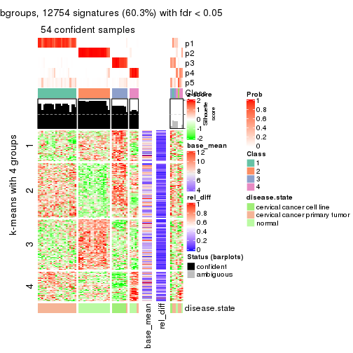</p>

</div>
<div id='tab-MAD-NMF-get-signatures-5'>
<pre><code class="r">get_signatures(res, k = 6)
</code></pre>

<p></p>

</div>
</div>


Signature heatmaps where rows are not scaled:


<script>
$( function() {
	$( '#tabs-MAD-NMF-get-signatures-no-scale' ).tabs();
} );
</script>
<div id='tabs-MAD-NMF-get-signatures-no-scale'>
<ul>
<li><a href='#tab-MAD-NMF-get-signatures-no-scale-1'>k = 2</a></li>
<li><a href='#tab-MAD-NMF-get-signatures-no-scale-2'>k = 3</a></li>
<li><a href='#tab-MAD-NMF-get-signatures-no-scale-3'>k = 4</a></li>
<li><a href='#tab-MAD-NMF-get-signatures-no-scale-4'>k = 5</a></li>
<li><a href='#tab-MAD-NMF-get-signatures-no-scale-5'>k = 6</a></li>
</ul>
<div id='tab-MAD-NMF-get-signatures-no-scale-1'>
<pre><code class="r">get_signatures(res, k = 2, scale_rows = FALSE)
</code></pre>

<p></p>

</div>
<div id='tab-MAD-NMF-get-signatures-no-scale-2'>
<pre><code class="r">get_signatures(res, k = 3, scale_rows = FALSE)
</code></pre>

<p></p>

</div>
<div id='tab-MAD-NMF-get-signatures-no-scale-3'>
<pre><code class="r">get_signatures(res, k = 4, scale_rows = FALSE)
</code></pre>

<p>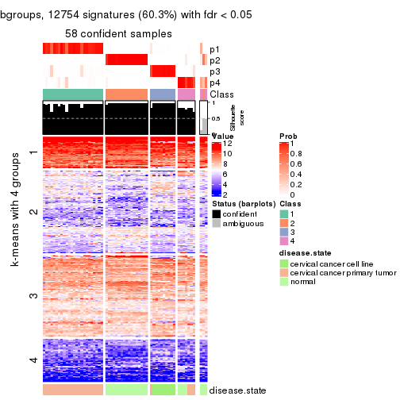</p>

</div>
<div id='tab-MAD-NMF-get-signatures-no-scale-4'>
<pre><code class="r">get_signatures(res, k = 5, scale_rows = FALSE)
</code></pre>

<p></p>

</div>
<div id='tab-MAD-NMF-get-signatures-no-scale-5'>
<pre><code class="r">get_signatures(res, k = 6, scale_rows = FALSE)
</code></pre>

<p></p>

</div>
</div>


Compare the overlap of signatures from different k:

```r
compare_signatures(res)
```


`get_signature()` returns a data frame invisibly. TO get the list of signatures, the function
call should be assigned to a variable explicitly. In following code, if `plot` argument is set
to `FALSE`, no heatmap is plotted while only the differential analysis is performed.

```r
# code only for demonstration
tb = get_signature(res, k = ..., plot = FALSE)
```

An example of the output of `tb` is:

```
#>   which_row         fdr    mean_1    mean_2 scaled_mean_1 scaled_mean_2 km
#> 1        38 0.042760348  8.373488  9.131774    -0.5533452     0.5164555  1
#> 2        40 0.018707592  7.106213  8.469186    -0.6173731     0.5762149  1
#> 3        55 0.019134737 10.221463 11.207825    -0.6159697     0.5749050  1
#> 4        59 0.006059896  5.921854  7.869574    -0.6899429     0.6439467  1
#> 5        60 0.018055526  8.928898 10.211722    -0.6204761     0.5791110  1
#> 6        98 0.009384629 15.714769 14.887706     0.6635654    -0.6193277  2
...
```

The columns in `tb` are:

1. `which_row`: row indices corresponding to the input matrix.
2. `fdr`: FDR for the differential test. 
3. `mean_x`: The mean value in group x.
4. `scaled_mean_x`: The mean value in group x after rows are scaled.
5. `km`: Row groups if k-means clustering is applied to rows.


UMAP plot which shows how samples are separated.


<script>
$( function() {
	$( '#tabs-MAD-NMF-dimension-reduction' ).tabs();
} );
</script>
<div id='tabs-MAD-NMF-dimension-reduction'>
<ul>
<li><a href='#tab-MAD-NMF-dimension-reduction-1'>k = 2</a></li>
<li><a href='#tab-MAD-NMF-dimension-reduction-2'>k = 3</a></li>
<li><a href='#tab-MAD-NMF-dimension-reduction-3'>k = 4</a></li>
<li><a href='#tab-MAD-NMF-dimension-reduction-4'>k = 5</a></li>
<li><a href='#tab-MAD-NMF-dimension-reduction-5'>k = 6</a></li>
</ul>
<div id='tab-MAD-NMF-dimension-reduction-1'>
<pre><code class="r">dimension_reduction(res, k = 2, method = &quot;UMAP&quot;)
</code></pre>

<p></p>

</div>
<div id='tab-MAD-NMF-dimension-reduction-2'>
<pre><code class="r">dimension_reduction(res, k = 3, method = &quot;UMAP&quot;)
</code></pre>

<p></p>

</div>
<div id='tab-MAD-NMF-dimension-reduction-3'>
<pre><code class="r">dimension_reduction(res, k = 4, method = &quot;UMAP&quot;)
</code></pre>

<p></p>

</div>
<div id='tab-MAD-NMF-dimension-reduction-4'>
<pre><code class="r">dimension_reduction(res, k = 5, method = &quot;UMAP&quot;)
</code></pre>

<p></p>

</div>
<div id='tab-MAD-NMF-dimension-reduction-5'>
<pre><code class="r">dimension_reduction(res, k = 6, method = &quot;UMAP&quot;)
</code></pre>

<p></p>

</div>
</div>


Following heatmap shows how subgroups are split when increasing `k`:

```r
collect_classes(res)
```


Test correlation between subgroups and known annotations. If the known
annotation is numeric, one-way ANOVA test is applied, and if the known
annotation is discrete, chi-squared contingency table test is applied.

```r
test_to_known_factors(res)
```

```
#>          n disease.state(p) k
#> MAD:NMF 60         6.78e-13 2
#> MAD:NMF 56         2.12e-13 3
#> MAD:NMF 58         2.45e-19 4
#> MAD:NMF 54         1.53e-18 5
#> MAD:NMF 46         1.16e-17 6
```


If matrix rows can be associated to genes, consider to use `GO_Enrichment(res,
...)` to perform function enrichment for the signature genes.


 

---------------------------------------------------


### ATC:hclust**


The object with results only for a single top-value method and a single partition method 
can be extracted as:

```r
res = res_list["ATC", "hclust"]
# you can also extract it by
# res = res_list["ATC:hclust"]
```

A summary of `res` and all the functions that can be applied to it:

```r
res
```

```
#> A 'ConsensusPartition' object with k = 2, 3, 4, 5, 6.
#>   On a matrix with 21168 rows and 61 columns.
#>   Top rows (1000, 2000, 3000, 4000, 5000) are extracted by 'ATC' method.
#>   Subgroups are detected by 'hclust' method.
#>   Performed in total 1250 partitions by row resampling.
#>   Best k for subgroups seems to be 4.
#> 
#> Following methods can be applied to this 'ConsensusPartition' object:
#>  [1] "cola_report"             "collect_classes"         "collect_plots"          
#>  [4] "collect_stats"           "colnames"                "compare_signatures"     
#>  [7] "consensus_heatmap"       "dimension_reduction"     "functional_enrichment"  
#> [10] "get_anno_col"            "get_anno"                "get_classes"            
#> [13] "get_consensus"           "get_matrix"              "get_membership"         
#> [16] "get_param"               "get_signatures"          "get_stats"              
#> [19] "is_best_k"               "is_stable_k"             "membership_heatmap"     
#> [22] "ncol"                    "nrow"                    "plot_ecdf"              
#> [25] "rownames"                "select_partition_number" "show"                   
#> [28] "suggest_best_k"          "test_to_known_factors"
```

`collect_plots()` function collects all the plots made from `res` for all `k` (number of partitions)
into one single page to provide an easy and fast comparison between different `k`.

```r
collect_plots(res)
```


The plots are:

- The first row: a plot of the ECDF (Empirical cumulative distribution
  function) curves of the consensus matrix for each `k` and the heatmap of
  predicted classes for each `k`.
- The second row: heatmaps of the consensus matrix for each `k`.
- The third row: heatmaps of the membership matrix for each `k`.
- The fouth row: heatmaps of the signatures for each `k`.

All the plots in panels can be made by individual functions and they are
plotted later in this section.

`select_partition_number()` produces several plots showing different
statistics for choosing "optimized" `k`. There are following statistics:

- ECDF curves of the consensus matrix for each `k`;
- 1-PAC. [The PAC
  score](https://en.wikipedia.org/wiki/Consensus_clustering#Over-interpretation_potential_of_consensus_clustering)
  measures the proportion of the ambiguous subgrouping.
- Mean silhouette score.
- Concordance. The mean probability of fiting the consensus class ids in all
  partitions.
- Area increased. Denote $A_k$ as the area under the ECDF curve for current
  `k`, the area increased is defined as $A_k - A_{k-1}$.
- Rand index. The percent of pairs of samples that are both in a same cluster
  or both are not in a same cluster in the partition of k and k-1.
- Jaccard index. The ratio of pairs of samples are both in a same cluster in
  the partition of k and k-1 and the pairs of samples are both in a same
  cluster in the partition k or k-1.

The detailed explanations of these statistics can be found in [the cola
vignette](http://bioconductor.org/packages/devel/bioc/vignettes/cola/inst/doc/cola.html#toc_13).

Generally speaking, lower PAC score, higher mean silhouette score or higher
concordance corresponds to better partition. Rand index and Jaccard index
measure how similar the current partition is compared to partition with `k-1`.
If they are too similar, we won't accept `k` is better than `k-1`.

```r
select_partition_number(res)
```


The numeric values for all these statistics can be obtained by `get_stats()`.

```r
get_stats(res)
```

```
#>   k 1-PAC mean_silhouette concordance area_increased  Rand Jaccard
#> 2 2 0.508           0.926       0.909         0.3690 0.607   0.607
#> 3 3 0.725           0.935       0.933         0.5653 0.823   0.708
#> 4 4 0.962           0.934       0.974         0.2409 0.843   0.634
#> 5 5 0.904           0.820       0.936         0.0272 0.989   0.960
#> 6 6 0.892           0.803       0.916         0.0244 0.961   0.863
```

`suggest_best_k()` suggests the best $k$ based on these statistics. The rules are as follows:

- All $k$ with Jaccard index larger than 0.95 are removed because the increase of
  the partition number does not provides enough extra information. If all $k$ are removed,
  the best $k$ is assigned by `NA`.
- For $k$ with 1-PAC larger than 0.9, the maximal $k$ is taken as the "best k". Other $k$ is called "optional k".
- If it does not fit the second rule. The $k$ with the highest vote of highest
  1-PAC, mean silhouette and concordance is taken as the "best k".

```r
suggest_best_k(res)
```

```
#> [1] 4
```


Following shows the table of the partitions (You need to click the **show/hide
code output** link to see it). The membership matrix (columns with name `p*`)
is inferred by
[`clue::cl_consensus()`](https://www.rdocumentation.org/link/cl_consensus?package=clue)
function with the `SE` method. Basically the value in the membership matrix
represents the probability to belong to a certain group. The finall class
label for an item is determined with the group with highest probability it
belongs to.

In `get_classes()` function, the entropy is calculated from the membership
matrix and the silhouette score is calculated from the consensus matrix.


<script>
$( function() {
	$( '#tabs-ATC-hclust-get-classes' ).tabs();
} );
</script>
<div id='tabs-ATC-hclust-get-classes'>
<ul>
<li><a href='#tab-ATC-hclust-get-classes-1'>k = 2</a></li>
<li><a href='#tab-ATC-hclust-get-classes-2'>k = 3</a></li>
<li><a href='#tab-ATC-hclust-get-classes-3'>k = 4</a></li>
<li><a href='#tab-ATC-hclust-get-classes-4'>k = 5</a></li>
<li><a href='#tab-ATC-hclust-get-classes-5'>k = 6</a></li>
</ul>

<div id='tab-ATC-hclust-get-classes-1'>
<p><a id='tab-ATC-hclust-get-classes-1-a' style='color:#0366d6' href='#'>show/hide code output</a></p>
<pre><code class="r">cbind(get_classes(res, k = 2), get_membership(res, k = 2))
</code></pre>

<pre><code>#&gt;           class entropy silhouette    p1    p2
#&gt; GSM246087     1   0.000      0.778 1.000 0.000
#&gt; GSM246088     1   0.000      0.778 1.000 0.000
#&gt; GSM246089     1   0.000      0.778 1.000 0.000
#&gt; GSM246090     1   0.000      0.778 1.000 0.000
#&gt; GSM246119     1   0.000      0.778 1.000 0.000
#&gt; GSM246120     1   0.000      0.778 1.000 0.000
#&gt; GSM246121     1   0.000      0.778 1.000 0.000
#&gt; GSM246122     1   0.000      0.778 1.000 0.000
#&gt; GSM246123     1   0.000      0.778 1.000 0.000
#&gt; GSM246422     1   0.802      0.913 0.756 0.244
#&gt; GSM246423     1   0.802      0.913 0.756 0.244
#&gt; GSM246484     1   0.802      0.913 0.756 0.244
#&gt; GSM246485     1   0.802      0.913 0.756 0.244
#&gt; GSM246486     1   0.802      0.913 0.756 0.244
#&gt; GSM246487     1   0.802      0.913 0.756 0.244
#&gt; GSM246488     1   0.802      0.913 0.756 0.244
#&gt; GSM246489     2   0.000      1.000 0.000 1.000
#&gt; GSM246490     2   0.000      1.000 0.000 1.000
#&gt; GSM246491     2   0.000      1.000 0.000 1.000
#&gt; GSM247162     2   0.000      1.000 0.000 1.000
#&gt; GSM247163     2   0.000      1.000 0.000 1.000
#&gt; GSM247164     2   0.000      1.000 0.000 1.000
#&gt; GSM247165     2   0.000      1.000 0.000 1.000
#&gt; GSM247166     2   0.000      1.000 0.000 1.000
#&gt; GSM247168     2   0.000      1.000 0.000 1.000
#&gt; GSM247169     2   0.000      1.000 0.000 1.000
#&gt; GSM247171     2   0.000      1.000 0.000 1.000
#&gt; GSM247173     2   0.000      1.000 0.000 1.000
#&gt; GSM247174     2   0.000      1.000 0.000 1.000
#&gt; GSM247175     2   0.000      1.000 0.000 1.000
#&gt; GSM247188     2   0.000      1.000 0.000 1.000
#&gt; GSM247189     1   0.802      0.913 0.756 0.244
#&gt; GSM247190     2   0.000      1.000 0.000 1.000
#&gt; GSM247650     1   0.738      0.936 0.792 0.208
#&gt; GSM247651     1   0.738      0.936 0.792 0.208
#&gt; GSM247652     1   0.738      0.936 0.792 0.208
#&gt; GSM247653     1   0.738      0.936 0.792 0.208
#&gt; GSM247654     1   0.738      0.936 0.792 0.208
#&gt; GSM247655     1   0.738      0.936 0.792 0.208
#&gt; GSM247656     1   0.738      0.936 0.792 0.208
#&gt; GSM247657     1   0.738      0.936 0.792 0.208
#&gt; GSM247658     1   0.738      0.936 0.792 0.208
#&gt; GSM247659     1   0.738      0.936 0.792 0.208
#&gt; GSM247660     1   0.738      0.936 0.792 0.208
#&gt; GSM247661     1   0.738      0.936 0.792 0.208
#&gt; GSM247662     1   0.738      0.936 0.792 0.208
#&gt; GSM247663     1   0.738      0.936 0.792 0.208
#&gt; GSM247856     1   0.738      0.936 0.792 0.208
#&gt; GSM247857     1   0.738      0.936 0.792 0.208
#&gt; GSM247859     1   0.738      0.936 0.792 0.208
#&gt; GSM247860     1   0.738      0.936 0.792 0.208
#&gt; GSM247862     1   0.738      0.936 0.792 0.208
#&gt; GSM247864     1   0.738      0.936 0.792 0.208
#&gt; GSM247865     1   0.788      0.919 0.764 0.236
#&gt; GSM247866     1   0.738      0.936 0.792 0.208
#&gt; GSM247876     1   0.738      0.936 0.792 0.208
#&gt; GSM247877     1   0.738      0.936 0.792 0.208
#&gt; GSM247878     1   0.738      0.936 0.792 0.208
#&gt; GSM247879     1   0.738      0.936 0.792 0.208
#&gt; GSM247881     1   0.738      0.936 0.792 0.208
#&gt; GSM247883     1   0.788      0.919 0.764 0.236
</code></pre>

<script>
$('#tab-ATC-hclust-get-classes-1-a').parent().next().next().hide();
$('#tab-ATC-hclust-get-classes-1-a').click(function(){
  $('#tab-ATC-hclust-get-classes-1-a').parent().next().next().toggle();
  return(false);
});
</script>
</div>

<div id='tab-ATC-hclust-get-classes-2'>
<p><a id='tab-ATC-hclust-get-classes-2-a' style='color:#0366d6' href='#'>show/hide code output</a></p>
<pre><code class="r">cbind(get_classes(res, k = 3), get_membership(res, k = 3))
</code></pre>

<pre><code>#&gt;           class entropy silhouette    p1 p2    p3
#&gt; GSM246087     3   0.455      1.000 0.200  0 0.800
#&gt; GSM246088     3   0.455      1.000 0.200  0 0.800
#&gt; GSM246089     3   0.455      1.000 0.200  0 0.800
#&gt; GSM246090     3   0.455      1.000 0.200  0 0.800
#&gt; GSM246119     3   0.455      1.000 0.200  0 0.800
#&gt; GSM246120     3   0.455      1.000 0.200  0 0.800
#&gt; GSM246121     3   0.455      1.000 0.200  0 0.800
#&gt; GSM246122     3   0.455      1.000 0.200  0 0.800
#&gt; GSM246123     3   0.455      1.000 0.200  0 0.800
#&gt; GSM246422     1   0.455      0.830 0.800  0 0.200
#&gt; GSM246423     1   0.455      0.830 0.800  0 0.200
#&gt; GSM246484     1   0.455      0.830 0.800  0 0.200
#&gt; GSM246485     1   0.455      0.830 0.800  0 0.200
#&gt; GSM246486     1   0.455      0.830 0.800  0 0.200
#&gt; GSM246487     1   0.455      0.830 0.800  0 0.200
#&gt; GSM246488     1   0.455      0.830 0.800  0 0.200
#&gt; GSM246489     2   0.000      1.000 0.000  1 0.000
#&gt; GSM246490     2   0.000      1.000 0.000  1 0.000
#&gt; GSM246491     2   0.000      1.000 0.000  1 0.000
#&gt; GSM247162     2   0.000      1.000 0.000  1 0.000
#&gt; GSM247163     2   0.000      1.000 0.000  1 0.000
#&gt; GSM247164     2   0.000      1.000 0.000  1 0.000
#&gt; GSM247165     2   0.000      1.000 0.000  1 0.000
#&gt; GSM247166     2   0.000      1.000 0.000  1 0.000
#&gt; GSM247168     2   0.000      1.000 0.000  1 0.000
#&gt; GSM247169     2   0.000      1.000 0.000  1 0.000
#&gt; GSM247171     2   0.000      1.000 0.000  1 0.000
#&gt; GSM247173     2   0.000      1.000 0.000  1 0.000
#&gt; GSM247174     2   0.000      1.000 0.000  1 0.000
#&gt; GSM247175     2   0.000      1.000 0.000  1 0.000
#&gt; GSM247188     2   0.000      1.000 0.000  1 0.000
#&gt; GSM247189     1   0.455      0.830 0.800  0 0.200
#&gt; GSM247190     2   0.000      1.000 0.000  1 0.000
#&gt; GSM247650     1   0.000      0.919 1.000  0 0.000
#&gt; GSM247651     1   0.000      0.919 1.000  0 0.000
#&gt; GSM247652     1   0.000      0.919 1.000  0 0.000
#&gt; GSM247653     1   0.000      0.919 1.000  0 0.000
#&gt; GSM247654     1   0.000      0.919 1.000  0 0.000
#&gt; GSM247655     1   0.000      0.919 1.000  0 0.000
#&gt; GSM247656     1   0.000      0.919 1.000  0 0.000
#&gt; GSM247657     1   0.000      0.919 1.000  0 0.000
#&gt; GSM247658     1   0.000      0.919 1.000  0 0.000
#&gt; GSM247659     1   0.000      0.919 1.000  0 0.000
#&gt; GSM247660     1   0.000      0.919 1.000  0 0.000
#&gt; GSM247661     1   0.000      0.919 1.000  0 0.000
#&gt; GSM247662     1   0.000      0.919 1.000  0 0.000
#&gt; GSM247663     1   0.000      0.919 1.000  0 0.000
#&gt; GSM247856     1   0.000      0.919 1.000  0 0.000
#&gt; GSM247857     1   0.000      0.919 1.000  0 0.000
#&gt; GSM247859     1   0.000      0.919 1.000  0 0.000
#&gt; GSM247860     1   0.000      0.919 1.000  0 0.000
#&gt; GSM247862     1   0.000      0.919 1.000  0 0.000
#&gt; GSM247864     1   0.000      0.919 1.000  0 0.000
#&gt; GSM247865     1   0.445      0.834 0.808  0 0.192
#&gt; GSM247866     1   0.000      0.919 1.000  0 0.000
#&gt; GSM247876     1   0.000      0.919 1.000  0 0.000
#&gt; GSM247877     1   0.406      0.848 0.836  0 0.164
#&gt; GSM247878     1   0.406      0.848 0.836  0 0.164
#&gt; GSM247879     1   0.000      0.919 1.000  0 0.000
#&gt; GSM247881     1   0.000      0.919 1.000  0 0.000
#&gt; GSM247883     1   0.445      0.834 0.808  0 0.192
</code></pre>

<script>
$('#tab-ATC-hclust-get-classes-2-a').parent().next().next().hide();
$('#tab-ATC-hclust-get-classes-2-a').click(function(){
  $('#tab-ATC-hclust-get-classes-2-a').parent().next().next().toggle();
  return(false);
});
</script>
</div>

<div id='tab-ATC-hclust-get-classes-3'>
<p><a id='tab-ATC-hclust-get-classes-3-a' style='color:#0366d6' href='#'>show/hide code output</a></p>
<pre><code class="r">cbind(get_classes(res, k = 4), get_membership(res, k = 4))
</code></pre>

<pre><code>#&gt;           class entropy silhouette    p1 p2 p3    p4
#&gt; GSM246087     3   0.000      1.000 0.000  0  1 0.000
#&gt; GSM246088     3   0.000      1.000 0.000  0  1 0.000
#&gt; GSM246089     3   0.000      1.000 0.000  0  1 0.000
#&gt; GSM246090     3   0.000      1.000 0.000  0  1 0.000
#&gt; GSM246119     3   0.000      1.000 0.000  0  1 0.000
#&gt; GSM246120     3   0.000      1.000 0.000  0  1 0.000
#&gt; GSM246121     3   0.000      1.000 0.000  0  1 0.000
#&gt; GSM246122     3   0.000      1.000 0.000  0  1 0.000
#&gt; GSM246123     3   0.000      1.000 0.000  0  1 0.000
#&gt; GSM246422     4   0.000      0.816 0.000  0  0 1.000
#&gt; GSM246423     4   0.000      0.816 0.000  0  0 1.000
#&gt; GSM246484     4   0.000      0.816 0.000  0  0 1.000
#&gt; GSM246485     4   0.000      0.816 0.000  0  0 1.000
#&gt; GSM246486     4   0.000      0.816 0.000  0  0 1.000
#&gt; GSM246487     4   0.000      0.816 0.000  0  0 1.000
#&gt; GSM246488     4   0.000      0.816 0.000  0  0 1.000
#&gt; GSM246489     2   0.000      1.000 0.000  1  0 0.000
#&gt; GSM246490     2   0.000      1.000 0.000  1  0 0.000
#&gt; GSM246491     2   0.000      1.000 0.000  1  0 0.000
#&gt; GSM247162     2   0.000      1.000 0.000  1  0 0.000
#&gt; GSM247163     2   0.000      1.000 0.000  1  0 0.000
#&gt; GSM247164     2   0.000      1.000 0.000  1  0 0.000
#&gt; GSM247165     2   0.000      1.000 0.000  1  0 0.000
#&gt; GSM247166     2   0.000      1.000 0.000  1  0 0.000
#&gt; GSM247168     2   0.000      1.000 0.000  1  0 0.000
#&gt; GSM247169     2   0.000      1.000 0.000  1  0 0.000
#&gt; GSM247171     2   0.000      1.000 0.000  1  0 0.000
#&gt; GSM247173     2   0.000      1.000 0.000  1  0 0.000
#&gt; GSM247174     2   0.000      1.000 0.000  1  0 0.000
#&gt; GSM247175     2   0.000      1.000 0.000  1  0 0.000
#&gt; GSM247188     2   0.000      1.000 0.000  1  0 0.000
#&gt; GSM247189     4   0.000      0.816 0.000  0  0 1.000
#&gt; GSM247190     2   0.000      1.000 0.000  1  0 0.000
#&gt; GSM247650     1   0.000      0.995 1.000  0  0 0.000
#&gt; GSM247651     1   0.000      0.995 1.000  0  0 0.000
#&gt; GSM247652     1   0.000      0.995 1.000  0  0 0.000
#&gt; GSM247653     1   0.000      0.995 1.000  0  0 0.000
#&gt; GSM247654     1   0.000      0.995 1.000  0  0 0.000
#&gt; GSM247655     1   0.000      0.995 1.000  0  0 0.000
#&gt; GSM247656     1   0.000      0.995 1.000  0  0 0.000
#&gt; GSM247657     1   0.000      0.995 1.000  0  0 0.000
#&gt; GSM247658     1   0.000      0.995 1.000  0  0 0.000
#&gt; GSM247659     1   0.000      0.995 1.000  0  0 0.000
#&gt; GSM247660     1   0.000      0.995 1.000  0  0 0.000
#&gt; GSM247661     1   0.000      0.995 1.000  0  0 0.000
#&gt; GSM247662     1   0.000      0.995 1.000  0  0 0.000
#&gt; GSM247663     1   0.000      0.995 1.000  0  0 0.000
#&gt; GSM247856     1   0.000      0.995 1.000  0  0 0.000
#&gt; GSM247857     1   0.000      0.995 1.000  0  0 0.000
#&gt; GSM247859     1   0.234      0.867 0.900  0  0 0.100
#&gt; GSM247860     1   0.000      0.995 1.000  0  0 0.000
#&gt; GSM247862     1   0.000      0.995 1.000  0  0 0.000
#&gt; GSM247864     1   0.000      0.995 1.000  0  0 0.000
#&gt; GSM247865     4   0.492      0.381 0.428  0  0 0.572
#&gt; GSM247866     1   0.000      0.995 1.000  0  0 0.000
#&gt; GSM247876     1   0.000      0.995 1.000  0  0 0.000
#&gt; GSM247877     4   0.499      0.256 0.472  0  0 0.528
#&gt; GSM247878     4   0.336      0.712 0.176  0  0 0.824
#&gt; GSM247879     1   0.000      0.995 1.000  0  0 0.000
#&gt; GSM247881     1   0.000      0.995 1.000  0  0 0.000
#&gt; GSM247883     4   0.492      0.381 0.428  0  0 0.572
</code></pre>

<script>
$('#tab-ATC-hclust-get-classes-3-a').parent().next().next().hide();
$('#tab-ATC-hclust-get-classes-3-a').click(function(){
  $('#tab-ATC-hclust-get-classes-3-a').parent().next().next().toggle();
  return(false);
});
</script>
</div>

<div id='tab-ATC-hclust-get-classes-4'>
<p><a id='tab-ATC-hclust-get-classes-4-a' style='color:#0366d6' href='#'>show/hide code output</a></p>
<pre><code class="r">cbind(get_classes(res, k = 5), get_membership(res, k = 5))
</code></pre>

<pre><code>#&gt;           class entropy silhouette    p1 p2    p3    p4    p5
#&gt; GSM246087     3   0.000     0.9654 0.000  0 1.000 0.000 0.000
#&gt; GSM246088     3   0.000     0.9654 0.000  0 1.000 0.000 0.000
#&gt; GSM246089     3   0.393     0.6685 0.000  0 0.672 0.000 0.328
#&gt; GSM246090     3   0.000     0.9654 0.000  0 1.000 0.000 0.000
#&gt; GSM246119     3   0.000     0.9654 0.000  0 1.000 0.000 0.000
#&gt; GSM246120     3   0.000     0.9654 0.000  0 1.000 0.000 0.000
#&gt; GSM246121     3   0.000     0.9654 0.000  0 1.000 0.000 0.000
#&gt; GSM246122     3   0.000     0.9654 0.000  0 1.000 0.000 0.000
#&gt; GSM246123     3   0.000     0.9654 0.000  0 1.000 0.000 0.000
#&gt; GSM246422     4   0.415    -0.0313 0.000  0 0.000 0.612 0.388
#&gt; GSM246423     4   0.415    -0.0313 0.000  0 0.000 0.612 0.388
#&gt; GSM246484     4   0.415    -0.0313 0.000  0 0.000 0.612 0.388
#&gt; GSM246485     4   0.000     0.4843 0.000  0 0.000 1.000 0.000
#&gt; GSM246486     4   0.000     0.4843 0.000  0 0.000 1.000 0.000
#&gt; GSM246487     4   0.000     0.4843 0.000  0 0.000 1.000 0.000
#&gt; GSM246488     4   0.000     0.4843 0.000  0 0.000 1.000 0.000
#&gt; GSM246489     2   0.000     1.0000 0.000  1 0.000 0.000 0.000
#&gt; GSM246490     2   0.000     1.0000 0.000  1 0.000 0.000 0.000
#&gt; GSM246491     2   0.000     1.0000 0.000  1 0.000 0.000 0.000
#&gt; GSM247162     2   0.000     1.0000 0.000  1 0.000 0.000 0.000
#&gt; GSM247163     2   0.000     1.0000 0.000  1 0.000 0.000 0.000
#&gt; GSM247164     2   0.000     1.0000 0.000  1 0.000 0.000 0.000
#&gt; GSM247165     2   0.000     1.0000 0.000  1 0.000 0.000 0.000
#&gt; GSM247166     2   0.000     1.0000 0.000  1 0.000 0.000 0.000
#&gt; GSM247168     2   0.000     1.0000 0.000  1 0.000 0.000 0.000
#&gt; GSM247169     2   0.000     1.0000 0.000  1 0.000 0.000 0.000
#&gt; GSM247171     2   0.000     1.0000 0.000  1 0.000 0.000 0.000
#&gt; GSM247173     2   0.000     1.0000 0.000  1 0.000 0.000 0.000
#&gt; GSM247174     2   0.000     1.0000 0.000  1 0.000 0.000 0.000
#&gt; GSM247175     2   0.000     1.0000 0.000  1 0.000 0.000 0.000
#&gt; GSM247188     2   0.000     1.0000 0.000  1 0.000 0.000 0.000
#&gt; GSM247189     4   0.277     0.3402 0.000  0 0.000 0.836 0.164
#&gt; GSM247190     2   0.000     1.0000 0.000  1 0.000 0.000 0.000
#&gt; GSM247650     1   0.088     0.9614 0.968  0 0.000 0.000 0.032
#&gt; GSM247651     1   0.051     0.9706 0.984  0 0.000 0.000 0.016
#&gt; GSM247652     1   0.000     0.9728 1.000  0 0.000 0.000 0.000
#&gt; GSM247653     1   0.029     0.9727 0.992  0 0.000 0.000 0.008
#&gt; GSM247654     1   0.000     0.9728 1.000  0 0.000 0.000 0.000
#&gt; GSM247655     1   0.051     0.9706 0.984  0 0.000 0.000 0.016
#&gt; GSM247656     1   0.000     0.9728 1.000  0 0.000 0.000 0.000
#&gt; GSM247657     1   0.000     0.9728 1.000  0 0.000 0.000 0.000
#&gt; GSM247658     1   0.029     0.9723 0.992  0 0.000 0.000 0.008
#&gt; GSM247659     1   0.000     0.9728 1.000  0 0.000 0.000 0.000
#&gt; GSM247660     1   0.051     0.9706 0.984  0 0.000 0.000 0.016
#&gt; GSM247661     1   0.029     0.9727 0.992  0 0.000 0.000 0.008
#&gt; GSM247662     1   0.000     0.9728 1.000  0 0.000 0.000 0.000
#&gt; GSM247663     1   0.167     0.9234 0.924  0 0.000 0.000 0.076
#&gt; GSM247856     1   0.000     0.9728 1.000  0 0.000 0.000 0.000
#&gt; GSM247857     1   0.000     0.9728 1.000  0 0.000 0.000 0.000
#&gt; GSM247859     1   0.202     0.8620 0.900  0 0.000 0.100 0.000
#&gt; GSM247860     1   0.029     0.9727 0.992  0 0.000 0.000 0.008
#&gt; GSM247862     1   0.051     0.9706 0.984  0 0.000 0.000 0.016
#&gt; GSM247864     1   0.051     0.9706 0.984  0 0.000 0.000 0.016
#&gt; GSM247865     4   0.424     0.0552 0.428  0 0.000 0.572 0.000
#&gt; GSM247866     1   0.029     0.9727 0.992  0 0.000 0.000 0.008
#&gt; GSM247876     1   0.173     0.9194 0.920  0 0.000 0.000 0.080
#&gt; GSM247877     5   0.532     0.3638 0.188  0 0.000 0.140 0.672
#&gt; GSM247878     5   0.426     0.0730 0.000  0 0.000 0.436 0.564
#&gt; GSM247879     1   0.300     0.7900 0.812  0 0.000 0.000 0.188
#&gt; GSM247881     1   0.000     0.9728 1.000  0 0.000 0.000 0.000
#&gt; GSM247883     4   0.424     0.0552 0.428  0 0.000 0.572 0.000
</code></pre>

<script>
$('#tab-ATC-hclust-get-classes-4-a').parent().next().next().hide();
$('#tab-ATC-hclust-get-classes-4-a').click(function(){
  $('#tab-ATC-hclust-get-classes-4-a').parent().next().next().toggle();
  return(false);
});
</script>
</div>

<div id='tab-ATC-hclust-get-classes-5'>
<p><a id='tab-ATC-hclust-get-classes-5-a' style='color:#0366d6' href='#'>show/hide code output</a></p>
<pre><code class="r">cbind(get_classes(res, k = 6), get_membership(res, k = 6))
</code></pre>

<pre><code>#&gt;           class entropy silhouette    p1 p2   p3    p4    p5    p6
#&gt; GSM246087     3  0.0000      1.000 0.000  0 1.00 0.000 0.000 0.000
#&gt; GSM246088     3  0.0000      1.000 0.000  0 1.00 0.000 0.000 0.000
#&gt; GSM246089     6  0.3309      0.000 0.000  0 0.28 0.000 0.000 0.720
#&gt; GSM246090     3  0.0000      1.000 0.000  0 1.00 0.000 0.000 0.000
#&gt; GSM246119     3  0.0000      1.000 0.000  0 1.00 0.000 0.000 0.000
#&gt; GSM246120     3  0.0000      1.000 0.000  0 1.00 0.000 0.000 0.000
#&gt; GSM246121     3  0.0000      1.000 0.000  0 1.00 0.000 0.000 0.000
#&gt; GSM246122     3  0.0000      1.000 0.000  0 1.00 0.000 0.000 0.000
#&gt; GSM246123     3  0.0000      1.000 0.000  0 1.00 0.000 0.000 0.000
#&gt; GSM246422     4  0.3050      0.376 0.000  0 0.00 0.764 0.236 0.000
#&gt; GSM246423     4  0.3050      0.376 0.000  0 0.00 0.764 0.236 0.000
#&gt; GSM246484     4  0.3050      0.376 0.000  0 0.00 0.764 0.236 0.000
#&gt; GSM246485     4  0.2730      0.674 0.000  0 0.00 0.808 0.000 0.192
#&gt; GSM246486     4  0.2730      0.674 0.000  0 0.00 0.808 0.000 0.192
#&gt; GSM246487     4  0.2730      0.674 0.000  0 0.00 0.808 0.000 0.192
#&gt; GSM246488     4  0.2730      0.674 0.000  0 0.00 0.808 0.000 0.192
#&gt; GSM246489     2  0.0000      1.000 0.000  1 0.00 0.000 0.000 0.000
#&gt; GSM246490     2  0.0000      1.000 0.000  1 0.00 0.000 0.000 0.000
#&gt; GSM246491     2  0.0000      1.000 0.000  1 0.00 0.000 0.000 0.000
#&gt; GSM247162     2  0.0000      1.000 0.000  1 0.00 0.000 0.000 0.000
#&gt; GSM247163     2  0.0000      1.000 0.000  1 0.00 0.000 0.000 0.000
#&gt; GSM247164     2  0.0000      1.000 0.000  1 0.00 0.000 0.000 0.000
#&gt; GSM247165     2  0.0000      1.000 0.000  1 0.00 0.000 0.000 0.000
#&gt; GSM247166     2  0.0000      1.000 0.000  1 0.00 0.000 0.000 0.000
#&gt; GSM247168     2  0.0000      1.000 0.000  1 0.00 0.000 0.000 0.000
#&gt; GSM247169     2  0.0000      1.000 0.000  1 0.00 0.000 0.000 0.000
#&gt; GSM247171     2  0.0000      1.000 0.000  1 0.00 0.000 0.000 0.000
#&gt; GSM247173     2  0.0000      1.000 0.000  1 0.00 0.000 0.000 0.000
#&gt; GSM247174     2  0.0000      1.000 0.000  1 0.00 0.000 0.000 0.000
#&gt; GSM247175     2  0.0000      1.000 0.000  1 0.00 0.000 0.000 0.000
#&gt; GSM247188     2  0.0000      1.000 0.000  1 0.00 0.000 0.000 0.000
#&gt; GSM247189     4  0.0000      0.600 0.000  0 0.00 1.000 0.000 0.000
#&gt; GSM247190     2  0.0000      1.000 0.000  1 0.00 0.000 0.000 0.000
#&gt; GSM247650     1  0.1261      0.873 0.952  0 0.00 0.000 0.024 0.024
#&gt; GSM247651     1  0.0909      0.878 0.968  0 0.00 0.000 0.012 0.020
#&gt; GSM247652     1  0.0000      0.882 1.000  0 0.00 0.000 0.000 0.000
#&gt; GSM247653     1  0.3276      0.779 0.816  0 0.00 0.000 0.132 0.052
#&gt; GSM247654     1  0.0000      0.882 1.000  0 0.00 0.000 0.000 0.000
#&gt; GSM247655     1  0.0909      0.878 0.968  0 0.00 0.000 0.012 0.020
#&gt; GSM247656     1  0.0000      0.882 1.000  0 0.00 0.000 0.000 0.000
#&gt; GSM247657     1  0.0000      0.882 1.000  0 0.00 0.000 0.000 0.000
#&gt; GSM247658     1  0.0405      0.881 0.988  0 0.00 0.000 0.008 0.004
#&gt; GSM247659     1  0.0000      0.882 1.000  0 0.00 0.000 0.000 0.000
#&gt; GSM247660     1  0.0909      0.878 0.968  0 0.00 0.000 0.012 0.020
#&gt; GSM247661     1  0.3276      0.779 0.816  0 0.00 0.000 0.132 0.052
#&gt; GSM247662     1  0.0000      0.882 1.000  0 0.00 0.000 0.000 0.000
#&gt; GSM247663     1  0.2376      0.835 0.888  0 0.00 0.000 0.068 0.044
#&gt; GSM247856     1  0.0000      0.882 1.000  0 0.00 0.000 0.000 0.000
#&gt; GSM247857     1  0.0000      0.882 1.000  0 0.00 0.000 0.000 0.000
#&gt; GSM247859     1  0.1814      0.820 0.900  0 0.00 0.100 0.000 0.000
#&gt; GSM247860     1  0.3276      0.779 0.816  0 0.00 0.000 0.132 0.052
#&gt; GSM247862     1  0.0909      0.878 0.968  0 0.00 0.000 0.012 0.020
#&gt; GSM247864     1  0.0909      0.878 0.968  0 0.00 0.000 0.012 0.020
#&gt; GSM247865     1  0.5848     -0.137 0.428  0 0.00 0.380 0.000 0.192
#&gt; GSM247866     1  0.3276      0.779 0.816  0 0.00 0.000 0.132 0.052
#&gt; GSM247876     1  0.2433      0.832 0.884  0 0.00 0.000 0.072 0.044
#&gt; GSM247877     5  0.2278      0.485 0.004  0 0.00 0.128 0.868 0.000
#&gt; GSM247878     5  0.3804      0.221 0.000  0 0.00 0.424 0.576 0.000
#&gt; GSM247879     1  0.4552      0.437 0.592  0 0.00 0.000 0.364 0.044
#&gt; GSM247881     1  0.0000      0.882 1.000  0 0.00 0.000 0.000 0.000
#&gt; GSM247883     1  0.5848     -0.137 0.428  0 0.00 0.380 0.000 0.192
</code></pre>

<script>
$('#tab-ATC-hclust-get-classes-5-a').parent().next().next().hide();
$('#tab-ATC-hclust-get-classes-5-a').click(function(){
  $('#tab-ATC-hclust-get-classes-5-a').parent().next().next().toggle();
  return(false);
});
</script>
</div>
</div>

Heatmaps for the consensus matrix. It visualizes the probability of two
samples to be in a same group.


<script>
$( function() {
	$( '#tabs-ATC-hclust-consensus-heatmap' ).tabs();
} );
</script>
<div id='tabs-ATC-hclust-consensus-heatmap'>
<ul>
<li><a href='#tab-ATC-hclust-consensus-heatmap-1'>k = 2</a></li>
<li><a href='#tab-ATC-hclust-consensus-heatmap-2'>k = 3</a></li>
<li><a href='#tab-ATC-hclust-consensus-heatmap-3'>k = 4</a></li>
<li><a href='#tab-ATC-hclust-consensus-heatmap-4'>k = 5</a></li>
<li><a href='#tab-ATC-hclust-consensus-heatmap-5'>k = 6</a></li>
</ul>
<div id='tab-ATC-hclust-consensus-heatmap-1'>
<pre><code class="r">consensus_heatmap(res, k = 2)
</code></pre>

<p></p>

</div>
<div id='tab-ATC-hclust-consensus-heatmap-2'>
<pre><code class="r">consensus_heatmap(res, k = 3)
</code></pre>

<p></p>

</div>
<div id='tab-ATC-hclust-consensus-heatmap-3'>
<pre><code class="r">consensus_heatmap(res, k = 4)
</code></pre>

<p></p>

</div>
<div id='tab-ATC-hclust-consensus-heatmap-4'>
<pre><code class="r">consensus_heatmap(res, k = 5)
</code></pre>

<p></p>

</div>
<div id='tab-ATC-hclust-consensus-heatmap-5'>
<pre><code class="r">consensus_heatmap(res, k = 6)
</code></pre>

<p></p>

</div>
</div>

Heatmaps for the membership of samples in all partitions to see how consistent they are:


<script>
$( function() {
	$( '#tabs-ATC-hclust-membership-heatmap' ).tabs();
} );
</script>
<div id='tabs-ATC-hclust-membership-heatmap'>
<ul>
<li><a href='#tab-ATC-hclust-membership-heatmap-1'>k = 2</a></li>
<li><a href='#tab-ATC-hclust-membership-heatmap-2'>k = 3</a></li>
<li><a href='#tab-ATC-hclust-membership-heatmap-3'>k = 4</a></li>
<li><a href='#tab-ATC-hclust-membership-heatmap-4'>k = 5</a></li>
<li><a href='#tab-ATC-hclust-membership-heatmap-5'>k = 6</a></li>
</ul>
<div id='tab-ATC-hclust-membership-heatmap-1'>
<pre><code class="r">membership_heatmap(res, k = 2)
</code></pre>

<p>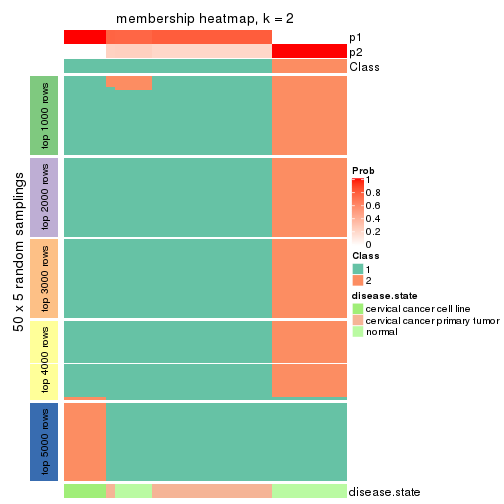</p>

</div>
<div id='tab-ATC-hclust-membership-heatmap-2'>
<pre><code class="r">membership_heatmap(res, k = 3)
</code></pre>

<p></p>

</div>
<div id='tab-ATC-hclust-membership-heatmap-3'>
<pre><code class="r">membership_heatmap(res, k = 4)
</code></pre>

<p></p>

</div>
<div id='tab-ATC-hclust-membership-heatmap-4'>
<pre><code class="r">membership_heatmap(res, k = 5)
</code></pre>

<p></p>

</div>
<div id='tab-ATC-hclust-membership-heatmap-5'>
<pre><code class="r">membership_heatmap(res, k = 6)
</code></pre>

<p></p>

</div>
</div>

As soon as we have had the classes for columns, we can look for signatures
which are significantly different between classes which can be candidate marks
for certain classes. Following are the heatmaps for signatures.


Signature heatmaps where rows are scaled:


<script>
$( function() {
	$( '#tabs-ATC-hclust-get-signatures' ).tabs();
} );
</script>
<div id='tabs-ATC-hclust-get-signatures'>
<ul>
<li><a href='#tab-ATC-hclust-get-signatures-1'>k = 2</a></li>
<li><a href='#tab-ATC-hclust-get-signatures-2'>k = 3</a></li>
<li><a href='#tab-ATC-hclust-get-signatures-3'>k = 4</a></li>
<li><a href='#tab-ATC-hclust-get-signatures-4'>k = 5</a></li>
<li><a href='#tab-ATC-hclust-get-signatures-5'>k = 6</a></li>
</ul>
<div id='tab-ATC-hclust-get-signatures-1'>
<pre><code class="r">get_signatures(res, k = 2)
</code></pre>

<p></p>

</div>
<div id='tab-ATC-hclust-get-signatures-2'>
<pre><code class="r">get_signatures(res, k = 3)
</code></pre>

<p></p>

</div>
<div id='tab-ATC-hclust-get-signatures-3'>
<pre><code class="r">get_signatures(res, k = 4)
</code></pre>

<p></p>

</div>
<div id='tab-ATC-hclust-get-signatures-4'>
<pre><code class="r">get_signatures(res, k = 5)
</code></pre>

<p></p>

</div>
<div id='tab-ATC-hclust-get-signatures-5'>
<pre><code class="r">get_signatures(res, k = 6)
</code></pre>

<p></p>

</div>
</div>


Signature heatmaps where rows are not scaled:


<script>
$( function() {
	$( '#tabs-ATC-hclust-get-signatures-no-scale' ).tabs();
} );
</script>
<div id='tabs-ATC-hclust-get-signatures-no-scale'>
<ul>
<li><a href='#tab-ATC-hclust-get-signatures-no-scale-1'>k = 2</a></li>
<li><a href='#tab-ATC-hclust-get-signatures-no-scale-2'>k = 3</a></li>
<li><a href='#tab-ATC-hclust-get-signatures-no-scale-3'>k = 4</a></li>
<li><a href='#tab-ATC-hclust-get-signatures-no-scale-4'>k = 5</a></li>
<li><a href='#tab-ATC-hclust-get-signatures-no-scale-5'>k = 6</a></li>
</ul>
<div id='tab-ATC-hclust-get-signatures-no-scale-1'>
<pre><code class="r">get_signatures(res, k = 2, scale_rows = FALSE)
</code></pre>

<p></p>

</div>
<div id='tab-ATC-hclust-get-signatures-no-scale-2'>
<pre><code class="r">get_signatures(res, k = 3, scale_rows = FALSE)
</code></pre>

<p></p>

</div>
<div id='tab-ATC-hclust-get-signatures-no-scale-3'>
<pre><code class="r">get_signatures(res, k = 4, scale_rows = FALSE)
</code></pre>

<p></p>

</div>
<div id='tab-ATC-hclust-get-signatures-no-scale-4'>
<pre><code class="r">get_signatures(res, k = 5, scale_rows = FALSE)
</code></pre>

<p></p>

</div>
<div id='tab-ATC-hclust-get-signatures-no-scale-5'>
<pre><code class="r">get_signatures(res, k = 6, scale_rows = FALSE)
</code></pre>

<p></p>

</div>
</div>


Compare the overlap of signatures from different k:

```r
compare_signatures(res)
```

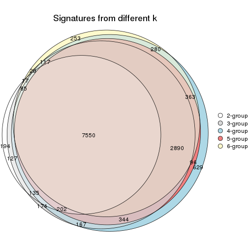

`get_signature()` returns a data frame invisibly. TO get the list of signatures, the function
call should be assigned to a variable explicitly. In following code, if `plot` argument is set
to `FALSE`, no heatmap is plotted while only the differential analysis is performed.

```r
# code only for demonstration
tb = get_signature(res, k = ..., plot = FALSE)
```

An example of the output of `tb` is:

```
#>   which_row         fdr    mean_1    mean_2 scaled_mean_1 scaled_mean_2 km
#> 1        38 0.042760348  8.373488  9.131774    -0.5533452     0.5164555  1
#> 2        40 0.018707592  7.106213  8.469186    -0.6173731     0.5762149  1
#> 3        55 0.019134737 10.221463 11.207825    -0.6159697     0.5749050  1
#> 4        59 0.006059896  5.921854  7.869574    -0.6899429     0.6439467  1
#> 5        60 0.018055526  8.928898 10.211722    -0.6204761     0.5791110  1
#> 6        98 0.009384629 15.714769 14.887706     0.6635654    -0.6193277  2
...
```

The columns in `tb` are:

1. `which_row`: row indices corresponding to the input matrix.
2. `fdr`: FDR for the differential test. 
3. `mean_x`: The mean value in group x.
4. `scaled_mean_x`: The mean value in group x after rows are scaled.
5. `km`: Row groups if k-means clustering is applied to rows.


UMAP plot which shows how samples are separated.


<script>
$( function() {
	$( '#tabs-ATC-hclust-dimension-reduction' ).tabs();
} );
</script>
<div id='tabs-ATC-hclust-dimension-reduction'>
<ul>
<li><a href='#tab-ATC-hclust-dimension-reduction-1'>k = 2</a></li>
<li><a href='#tab-ATC-hclust-dimension-reduction-2'>k = 3</a></li>
<li><a href='#tab-ATC-hclust-dimension-reduction-3'>k = 4</a></li>
<li><a href='#tab-ATC-hclust-dimension-reduction-4'>k = 5</a></li>
<li><a href='#tab-ATC-hclust-dimension-reduction-5'>k = 6</a></li>
</ul>
<div id='tab-ATC-hclust-dimension-reduction-1'>
<pre><code class="r">dimension_reduction(res, k = 2, method = &quot;UMAP&quot;)
</code></pre>

<p></p>

</div>
<div id='tab-ATC-hclust-dimension-reduction-2'>
<pre><code class="r">dimension_reduction(res, k = 3, method = &quot;UMAP&quot;)
</code></pre>

<p></p>

</div>
<div id='tab-ATC-hclust-dimension-reduction-3'>
<pre><code class="r">dimension_reduction(res, k = 4, method = &quot;UMAP&quot;)
</code></pre>

<p></p>

</div>
<div id='tab-ATC-hclust-dimension-reduction-4'>
<pre><code class="r">dimension_reduction(res, k = 5, method = &quot;UMAP&quot;)
</code></pre>

<p></p>

</div>
<div id='tab-ATC-hclust-dimension-reduction-5'>
<pre><code class="r">dimension_reduction(res, k = 6, method = &quot;UMAP&quot;)
</code></pre>

<p>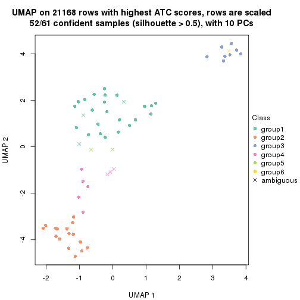</p>

</div>
</div>


Following heatmap shows how subgroups are split when increasing `k`:

```r
collect_classes(res)
```


Test correlation between subgroups and known annotations. If the known
annotation is numeric, one-way ANOVA test is applied, and if the known
annotation is discrete, chi-squared contingency table test is applied.

```r
test_to_known_factors(res)
```

```
#>             n disease.state(p) k
#> ATC:hclust 61         5.49e-08 2
#> ATC:hclust 61         3.64e-19 3
#> ATC:hclust 58         8.60e-22 4
#> ATC:hclust 49         2.62e-20 5
#> ATC:hclust 52         3.67e-20 6
```


If matrix rows can be associated to genes, consider to use `GO_Enrichment(res,
...)` to perform function enrichment for the signature genes.


 

---------------------------------------------------


### ATC:kmeans


The object with results only for a single top-value method and a single partition method 
can be extracted as:

```r
res = res_list["ATC", "kmeans"]
# you can also extract it by
# res = res_list["ATC:kmeans"]
```

A summary of `res` and all the functions that can be applied to it:

```r
res
```

```
#> A 'ConsensusPartition' object with k = 2, 3, 4, 5, 6.
#>   On a matrix with 21168 rows and 61 columns.
#>   Top rows (1000, 2000, 3000, 4000, 5000) are extracted by 'ATC' method.
#>   Subgroups are detected by 'kmeans' method.
#>   Performed in total 1250 partitions by row resampling.
#>   Best k for subgroups seems to be 2.
#> 
#> Following methods can be applied to this 'ConsensusPartition' object:
#>  [1] "cola_report"             "collect_classes"         "collect_plots"          
#>  [4] "collect_stats"           "colnames"                "compare_signatures"     
#>  [7] "consensus_heatmap"       "dimension_reduction"     "functional_enrichment"  
#> [10] "get_anno_col"            "get_anno"                "get_classes"            
#> [13] "get_consensus"           "get_matrix"              "get_membership"         
#> [16] "get_param"               "get_signatures"          "get_stats"              
#> [19] "is_best_k"               "is_stable_k"             "membership_heatmap"     
#> [22] "ncol"                    "nrow"                    "plot_ecdf"              
#> [25] "rownames"                "select_partition_number" "show"                   
#> [28] "suggest_best_k"          "test_to_known_factors"
```

`collect_plots()` function collects all the plots made from `res` for all `k` (number of partitions)
into one single page to provide an easy and fast comparison between different `k`.

```r
collect_plots(res)
```


The plots are:

- The first row: a plot of the ECDF (Empirical cumulative distribution
  function) curves of the consensus matrix for each `k` and the heatmap of
  predicted classes for each `k`.
- The second row: heatmaps of the consensus matrix for each `k`.
- The third row: heatmaps of the membership matrix for each `k`.
- The fouth row: heatmaps of the signatures for each `k`.

All the plots in panels can be made by individual functions and they are
plotted later in this section.

`select_partition_number()` produces several plots showing different
statistics for choosing "optimized" `k`. There are following statistics:

- ECDF curves of the consensus matrix for each `k`;
- 1-PAC. [The PAC
  score](https://en.wikipedia.org/wiki/Consensus_clustering#Over-interpretation_potential_of_consensus_clustering)
  measures the proportion of the ambiguous subgrouping.
- Mean silhouette score.
- Concordance. The mean probability of fiting the consensus class ids in all
  partitions.
- Area increased. Denote $A_k$ as the area under the ECDF curve for current
  `k`, the area increased is defined as $A_k - A_{k-1}$.
- Rand index. The percent of pairs of samples that are both in a same cluster
  or both are not in a same cluster in the partition of k and k-1.
- Jaccard index. The ratio of pairs of samples are both in a same cluster in
  the partition of k and k-1 and the pairs of samples are both in a same
  cluster in the partition k or k-1.

The detailed explanations of these statistics can be found in [the cola
vignette](http://bioconductor.org/packages/devel/bioc/vignettes/cola/inst/doc/cola.html#toc_13).

Generally speaking, lower PAC score, higher mean silhouette score or higher
concordance corresponds to better partition. Rand index and Jaccard index
measure how similar the current partition is compared to partition with `k-1`.
If they are too similar, we won't accept `k` is better than `k-1`.

```r
select_partition_number(res)
```


The numeric values for all these statistics can be obtained by `get_stats()`.

```r
get_stats(res)
```

```
#>   k 1-PAC mean_silhouette concordance area_increased  Rand Jaccard
#> 2 2 0.847           0.943       0.973         0.4695 0.515   0.515
#> 3 3 0.659           0.782       0.841         0.3161 0.734   0.550
#> 4 4 0.679           0.899       0.896         0.1203 0.863   0.668
#> 5 5 0.791           0.854       0.878         0.0811 1.000   1.000
#> 6 6 0.785           0.772       0.830         0.0496 0.943   0.800
```

`suggest_best_k()` suggests the best $k$ based on these statistics. The rules are as follows:

- All $k$ with Jaccard index larger than 0.95 are removed because the increase of
  the partition number does not provides enough extra information. If all $k$ are removed,
  the best $k$ is assigned by `NA`.
- For $k$ with 1-PAC larger than 0.9, the maximal $k$ is taken as the "best k". Other $k$ is called "optional k".
- If it does not fit the second rule. The $k$ with the highest vote of highest
  1-PAC, mean silhouette and concordance is taken as the "best k".

```r
suggest_best_k(res)
```

```
#> [1] 2
```


Following shows the table of the partitions (You need to click the **show/hide
code output** link to see it). The membership matrix (columns with name `p*`)
is inferred by
[`clue::cl_consensus()`](https://www.rdocumentation.org/link/cl_consensus?package=clue)
function with the `SE` method. Basically the value in the membership matrix
represents the probability to belong to a certain group. The finall class
label for an item is determined with the group with highest probability it
belongs to.

In `get_classes()` function, the entropy is calculated from the membership
matrix and the silhouette score is calculated from the consensus matrix.


<script>
$( function() {
	$( '#tabs-ATC-kmeans-get-classes' ).tabs();
} );
</script>
<div id='tabs-ATC-kmeans-get-classes'>
<ul>
<li><a href='#tab-ATC-kmeans-get-classes-1'>k = 2</a></li>
<li><a href='#tab-ATC-kmeans-get-classes-2'>k = 3</a></li>
<li><a href='#tab-ATC-kmeans-get-classes-3'>k = 4</a></li>
<li><a href='#tab-ATC-kmeans-get-classes-4'>k = 5</a></li>
<li><a href='#tab-ATC-kmeans-get-classes-5'>k = 6</a></li>
</ul>

<div id='tab-ATC-kmeans-get-classes-1'>
<p><a id='tab-ATC-kmeans-get-classes-1-a' style='color:#0366d6' href='#'>show/hide code output</a></p>
<pre><code class="r">cbind(get_classes(res, k = 2), get_membership(res, k = 2))
</code></pre>

<pre><code>#&gt;           class entropy silhouette    p1    p2
#&gt; GSM246087     1   0.000      1.000 1.000 0.000
#&gt; GSM246088     1   0.000      1.000 1.000 0.000
#&gt; GSM246089     1   0.000      1.000 1.000 0.000
#&gt; GSM246090     1   0.000      1.000 1.000 0.000
#&gt; GSM246119     1   0.000      1.000 1.000 0.000
#&gt; GSM246120     1   0.000      1.000 1.000 0.000
#&gt; GSM246121     1   0.000      1.000 1.000 0.000
#&gt; GSM246122     1   0.000      1.000 1.000 0.000
#&gt; GSM246123     1   0.000      1.000 1.000 0.000
#&gt; GSM246422     2   0.917      0.589 0.332 0.668
#&gt; GSM246423     2   0.917      0.589 0.332 0.668
#&gt; GSM246484     2   0.917      0.589 0.332 0.668
#&gt; GSM246485     2   0.917      0.589 0.332 0.668
#&gt; GSM246486     2   0.000      0.925 0.000 1.000
#&gt; GSM246487     2   0.917      0.589 0.332 0.668
#&gt; GSM246488     2   0.000      0.925 0.000 1.000
#&gt; GSM246489     2   0.000      0.925 0.000 1.000
#&gt; GSM246490     2   0.000      0.925 0.000 1.000
#&gt; GSM246491     2   0.000      0.925 0.000 1.000
#&gt; GSM247162     2   0.000      0.925 0.000 1.000
#&gt; GSM247163     2   0.000      0.925 0.000 1.000
#&gt; GSM247164     2   0.000      0.925 0.000 1.000
#&gt; GSM247165     2   0.000      0.925 0.000 1.000
#&gt; GSM247166     2   0.000      0.925 0.000 1.000
#&gt; GSM247168     2   0.000      0.925 0.000 1.000
#&gt; GSM247169     2   0.000      0.925 0.000 1.000
#&gt; GSM247171     2   0.000      0.925 0.000 1.000
#&gt; GSM247173     2   0.000      0.925 0.000 1.000
#&gt; GSM247174     2   0.000      0.925 0.000 1.000
#&gt; GSM247175     2   0.000      0.925 0.000 1.000
#&gt; GSM247188     2   0.000      0.925 0.000 1.000
#&gt; GSM247189     2   0.000      0.925 0.000 1.000
#&gt; GSM247190     2   0.000      0.925 0.000 1.000
#&gt; GSM247650     1   0.000      1.000 1.000 0.000
#&gt; GSM247651     1   0.000      1.000 1.000 0.000
#&gt; GSM247652     1   0.000      1.000 1.000 0.000
#&gt; GSM247653     1   0.000      1.000 1.000 0.000
#&gt; GSM247654     1   0.000      1.000 1.000 0.000
#&gt; GSM247655     1   0.000      1.000 1.000 0.000
#&gt; GSM247656     1   0.000      1.000 1.000 0.000
#&gt; GSM247657     1   0.000      1.000 1.000 0.000
#&gt; GSM247658     1   0.000      1.000 1.000 0.000
#&gt; GSM247659     1   0.000      1.000 1.000 0.000
#&gt; GSM247660     1   0.000      1.000 1.000 0.000
#&gt; GSM247661     1   0.000      1.000 1.000 0.000
#&gt; GSM247662     1   0.000      1.000 1.000 0.000
#&gt; GSM247663     1   0.000      1.000 1.000 0.000
#&gt; GSM247856     1   0.000      1.000 1.000 0.000
#&gt; GSM247857     1   0.000      1.000 1.000 0.000
#&gt; GSM247859     1   0.000      1.000 1.000 0.000
#&gt; GSM247860     1   0.000      1.000 1.000 0.000
#&gt; GSM247862     1   0.000      1.000 1.000 0.000
#&gt; GSM247864     1   0.000      1.000 1.000 0.000
#&gt; GSM247865     1   0.000      1.000 1.000 0.000
#&gt; GSM247866     1   0.000      1.000 1.000 0.000
#&gt; GSM247876     1   0.000      1.000 1.000 0.000
#&gt; GSM247877     1   0.000      1.000 1.000 0.000
#&gt; GSM247878     1   0.000      1.000 1.000 0.000
#&gt; GSM247879     1   0.000      1.000 1.000 0.000
#&gt; GSM247881     1   0.000      1.000 1.000 0.000
#&gt; GSM247883     1   0.000      1.000 1.000 0.000
</code></pre>

<script>
$('#tab-ATC-kmeans-get-classes-1-a').parent().next().next().hide();
$('#tab-ATC-kmeans-get-classes-1-a').click(function(){
  $('#tab-ATC-kmeans-get-classes-1-a').parent().next().next().toggle();
  return(false);
});
</script>
</div>

<div id='tab-ATC-kmeans-get-classes-2'>
<p><a id='tab-ATC-kmeans-get-classes-2-a' style='color:#0366d6' href='#'>show/hide code output</a></p>
<pre><code class="r">cbind(get_classes(res, k = 3), get_membership(res, k = 3))
</code></pre>

<pre><code>#&gt;           class entropy silhouette    p1    p2    p3
#&gt; GSM246087     3  0.6225      1.000 0.432 0.000 0.568
#&gt; GSM246088     3  0.6225      1.000 0.432 0.000 0.568
#&gt; GSM246089     3  0.6225      1.000 0.432 0.000 0.568
#&gt; GSM246090     3  0.6225      1.000 0.432 0.000 0.568
#&gt; GSM246119     3  0.6225      1.000 0.432 0.000 0.568
#&gt; GSM246120     3  0.6225      1.000 0.432 0.000 0.568
#&gt; GSM246121     3  0.6225      1.000 0.432 0.000 0.568
#&gt; GSM246122     3  0.6225      1.000 0.432 0.000 0.568
#&gt; GSM246123     3  0.6225      1.000 0.432 0.000 0.568
#&gt; GSM246422     1  0.6244      0.625 0.560 0.440 0.000
#&gt; GSM246423     1  0.6244      0.625 0.560 0.440 0.000
#&gt; GSM246484     1  0.6244      0.625 0.560 0.440 0.000
#&gt; GSM246485     1  0.6244      0.625 0.560 0.440 0.000
#&gt; GSM246486     2  0.2796      0.662 0.000 0.908 0.092
#&gt; GSM246487     1  0.6244      0.625 0.560 0.440 0.000
#&gt; GSM246488     2  0.0424      0.574 0.000 0.992 0.008
#&gt; GSM246489     2  0.6180      0.933 0.000 0.584 0.416
#&gt; GSM246490     2  0.6180      0.933 0.000 0.584 0.416
#&gt; GSM246491     2  0.6180      0.933 0.000 0.584 0.416
#&gt; GSM247162     2  0.6180      0.933 0.000 0.584 0.416
#&gt; GSM247163     2  0.6180      0.933 0.000 0.584 0.416
#&gt; GSM247164     2  0.6180      0.933 0.000 0.584 0.416
#&gt; GSM247165     2  0.6180      0.933 0.000 0.584 0.416
#&gt; GSM247166     2  0.6225      0.928 0.000 0.568 0.432
#&gt; GSM247168     2  0.6225      0.928 0.000 0.568 0.432
#&gt; GSM247169     2  0.6225      0.928 0.000 0.568 0.432
#&gt; GSM247171     2  0.6180      0.933 0.000 0.584 0.416
#&gt; GSM247173     2  0.6180      0.933 0.000 0.584 0.416
#&gt; GSM247174     2  0.6225      0.928 0.000 0.568 0.432
#&gt; GSM247175     2  0.6180      0.933 0.000 0.584 0.416
#&gt; GSM247188     2  0.6225      0.928 0.000 0.568 0.432
#&gt; GSM247189     2  0.0237      0.569 0.000 0.996 0.004
#&gt; GSM247190     2  0.6180      0.933 0.000 0.584 0.416
#&gt; GSM247650     1  0.1031      0.663 0.976 0.000 0.024
#&gt; GSM247651     1  0.5254      0.703 0.736 0.264 0.000
#&gt; GSM247652     1  0.1031      0.663 0.976 0.000 0.024
#&gt; GSM247653     1  0.1031      0.663 0.976 0.000 0.024
#&gt; GSM247654     1  0.1031      0.663 0.976 0.000 0.024
#&gt; GSM247655     1  0.5254      0.703 0.736 0.264 0.000
#&gt; GSM247656     1  0.1163      0.657 0.972 0.000 0.028
#&gt; GSM247657     1  0.0237      0.677 0.996 0.000 0.004
#&gt; GSM247658     1  0.0475      0.679 0.992 0.004 0.004
#&gt; GSM247659     1  0.1031      0.663 0.976 0.000 0.024
#&gt; GSM247660     1  0.5254      0.703 0.736 0.264 0.000
#&gt; GSM247661     1  0.1031      0.663 0.976 0.000 0.024
#&gt; GSM247662     1  0.1031      0.663 0.976 0.000 0.024
#&gt; GSM247663     1  0.0592      0.672 0.988 0.000 0.012
#&gt; GSM247856     1  0.1031      0.663 0.976 0.000 0.024
#&gt; GSM247857     1  0.0000      0.679 1.000 0.000 0.000
#&gt; GSM247859     1  0.5058      0.704 0.756 0.244 0.000
#&gt; GSM247860     1  0.0237      0.680 0.996 0.004 0.000
#&gt; GSM247862     1  0.4796      0.703 0.780 0.220 0.000
#&gt; GSM247864     1  0.5254      0.703 0.736 0.264 0.000
#&gt; GSM247865     1  0.6180      0.640 0.584 0.416 0.000
#&gt; GSM247866     1  0.5254      0.703 0.736 0.264 0.000
#&gt; GSM247876     1  0.0000      0.679 1.000 0.000 0.000
#&gt; GSM247877     1  0.6180      0.640 0.584 0.416 0.000
#&gt; GSM247878     1  0.6180      0.640 0.584 0.416 0.000
#&gt; GSM247879     1  0.0592      0.672 0.988 0.000 0.012
#&gt; GSM247881     1  0.0000      0.679 1.000 0.000 0.000
#&gt; GSM247883     1  0.6180      0.640 0.584 0.416 0.000
</code></pre>

<script>
$('#tab-ATC-kmeans-get-classes-2-a').parent().next().next().hide();
$('#tab-ATC-kmeans-get-classes-2-a').click(function(){
  $('#tab-ATC-kmeans-get-classes-2-a').parent().next().next().toggle();
  return(false);
});
</script>
</div>

<div id='tab-ATC-kmeans-get-classes-3'>
<p><a id='tab-ATC-kmeans-get-classes-3-a' style='color:#0366d6' href='#'>show/hide code output</a></p>
<pre><code class="r">cbind(get_classes(res, k = 4), get_membership(res, k = 4))
</code></pre>

<pre><code>#&gt;           class entropy silhouette    p1    p2    p3    p4
#&gt; GSM246087     3  0.3108      0.990 0.112 0.000 0.872 0.016
#&gt; GSM246088     3  0.3108      0.990 0.112 0.000 0.872 0.016
#&gt; GSM246089     3  0.3793      0.966 0.112 0.000 0.844 0.044
#&gt; GSM246090     3  0.3108      0.990 0.112 0.000 0.872 0.016
#&gt; GSM246119     3  0.2530      0.990 0.112 0.000 0.888 0.000
#&gt; GSM246120     3  0.2530      0.990 0.112 0.000 0.888 0.000
#&gt; GSM246121     3  0.2530      0.990 0.112 0.000 0.888 0.000
#&gt; GSM246122     3  0.3108      0.990 0.112 0.000 0.872 0.016
#&gt; GSM246123     3  0.2530      0.990 0.112 0.000 0.888 0.000
#&gt; GSM246422     4  0.4442      0.839 0.236 0.004 0.008 0.752
#&gt; GSM246423     4  0.4442      0.839 0.236 0.004 0.008 0.752
#&gt; GSM246484     4  0.4442      0.839 0.236 0.004 0.008 0.752
#&gt; GSM246485     4  0.4682      0.836 0.236 0.004 0.016 0.744
#&gt; GSM246486     4  0.5228      0.565 0.000 0.312 0.024 0.664
#&gt; GSM246487     4  0.4822      0.834 0.240 0.004 0.020 0.736
#&gt; GSM246488     4  0.4826      0.624 0.000 0.264 0.020 0.716
#&gt; GSM246489     2  0.0336      0.924 0.000 0.992 0.008 0.000
#&gt; GSM246490     2  0.0336      0.924 0.000 0.992 0.008 0.000
#&gt; GSM246491     2  0.0336      0.924 0.000 0.992 0.008 0.000
#&gt; GSM247162     2  0.0336      0.924 0.000 0.992 0.008 0.000
#&gt; GSM247163     2  0.0336      0.924 0.000 0.992 0.008 0.000
#&gt; GSM247164     2  0.0336      0.926 0.000 0.992 0.008 0.000
#&gt; GSM247165     2  0.0336      0.924 0.000 0.992 0.008 0.000
#&gt; GSM247166     2  0.4039      0.911 0.000 0.836 0.080 0.084
#&gt; GSM247168     2  0.4039      0.911 0.000 0.836 0.080 0.084
#&gt; GSM247169     2  0.4039      0.911 0.000 0.836 0.080 0.084
#&gt; GSM247171     2  0.0188      0.925 0.000 0.996 0.004 0.000
#&gt; GSM247173     2  0.3056      0.923 0.000 0.888 0.040 0.072
#&gt; GSM247174     2  0.4039      0.911 0.000 0.836 0.080 0.084
#&gt; GSM247175     2  0.3312      0.921 0.000 0.876 0.052 0.072
#&gt; GSM247188     2  0.4039      0.911 0.000 0.836 0.080 0.084
#&gt; GSM247189     4  0.4250      0.613 0.000 0.276 0.000 0.724
#&gt; GSM247190     2  0.3056      0.923 0.000 0.888 0.040 0.072
#&gt; GSM247650     1  0.0921      0.935 0.972 0.000 0.028 0.000
#&gt; GSM247651     1  0.1716      0.910 0.936 0.000 0.000 0.064
#&gt; GSM247652     1  0.0921      0.935 0.972 0.000 0.028 0.000
#&gt; GSM247653     1  0.2466      0.872 0.900 0.000 0.004 0.096
#&gt; GSM247654     1  0.0921      0.935 0.972 0.000 0.028 0.000
#&gt; GSM247655     1  0.1716      0.910 0.936 0.000 0.000 0.064
#&gt; GSM247656     1  0.1356      0.929 0.960 0.000 0.032 0.008
#&gt; GSM247657     1  0.0817      0.936 0.976 0.000 0.024 0.000
#&gt; GSM247658     1  0.0188      0.933 0.996 0.000 0.000 0.004
#&gt; GSM247659     1  0.0921      0.935 0.972 0.000 0.028 0.000
#&gt; GSM247660     1  0.1716      0.910 0.936 0.000 0.000 0.064
#&gt; GSM247661     1  0.2466      0.872 0.900 0.000 0.004 0.096
#&gt; GSM247662     1  0.0921      0.935 0.972 0.000 0.028 0.000
#&gt; GSM247663     1  0.1406      0.933 0.960 0.000 0.024 0.016
#&gt; GSM247856     1  0.0921      0.935 0.972 0.000 0.028 0.000
#&gt; GSM247857     1  0.0817      0.936 0.976 0.000 0.024 0.000
#&gt; GSM247859     1  0.1637      0.913 0.940 0.000 0.000 0.060
#&gt; GSM247860     1  0.2345      0.874 0.900 0.000 0.000 0.100
#&gt; GSM247862     1  0.2760      0.869 0.872 0.000 0.000 0.128
#&gt; GSM247864     1  0.1716      0.910 0.936 0.000 0.000 0.064
#&gt; GSM247865     1  0.3166      0.833 0.868 0.000 0.016 0.116
#&gt; GSM247866     1  0.2868      0.864 0.864 0.000 0.000 0.136
#&gt; GSM247876     1  0.0895      0.936 0.976 0.000 0.020 0.004
#&gt; GSM247877     4  0.4482      0.790 0.264 0.000 0.008 0.728
#&gt; GSM247878     4  0.4567      0.787 0.276 0.000 0.008 0.716
#&gt; GSM247879     1  0.1724      0.929 0.948 0.000 0.020 0.032
#&gt; GSM247881     1  0.0817      0.936 0.976 0.000 0.024 0.000
#&gt; GSM247883     1  0.3166      0.833 0.868 0.000 0.016 0.116
</code></pre>

<script>
$('#tab-ATC-kmeans-get-classes-3-a').parent().next().next().hide();
$('#tab-ATC-kmeans-get-classes-3-a').click(function(){
  $('#tab-ATC-kmeans-get-classes-3-a').parent().next().next().toggle();
  return(false);
});
</script>
</div>

<div id='tab-ATC-kmeans-get-classes-4'>
<p><a id='tab-ATC-kmeans-get-classes-4-a' style='color:#0366d6' href='#'>show/hide code output</a></p>
<pre><code class="r">cbind(get_classes(res, k = 5), get_membership(res, k = 5))
</code></pre>

<pre><code>#&gt;           class entropy silhouette    p1    p2    p3    p4 p5
#&gt; GSM246087     3  0.1243      0.983 0.028 0.000 0.960 0.004 NA
#&gt; GSM246088     3  0.1243      0.983 0.028 0.000 0.960 0.004 NA
#&gt; GSM246089     3  0.3291      0.907 0.028 0.000 0.856 0.016 NA
#&gt; GSM246090     3  0.1243      0.983 0.028 0.000 0.960 0.004 NA
#&gt; GSM246119     3  0.0955      0.983 0.028 0.000 0.968 0.000 NA
#&gt; GSM246120     3  0.0955      0.983 0.028 0.000 0.968 0.000 NA
#&gt; GSM246121     3  0.0794      0.983 0.028 0.000 0.972 0.000 NA
#&gt; GSM246122     3  0.1243      0.983 0.028 0.000 0.960 0.004 NA
#&gt; GSM246123     3  0.0955      0.983 0.028 0.000 0.968 0.000 NA
#&gt; GSM246422     4  0.1121      0.830 0.044 0.000 0.000 0.956 NA
#&gt; GSM246423     4  0.1121      0.830 0.044 0.000 0.000 0.956 NA
#&gt; GSM246484     4  0.1121      0.830 0.044 0.000 0.000 0.956 NA
#&gt; GSM246485     4  0.4622      0.816 0.060 0.000 0.024 0.768 NA
#&gt; GSM246486     4  0.6020      0.720 0.000 0.160 0.024 0.644 NA
#&gt; GSM246487     4  0.6020      0.740 0.160 0.000 0.024 0.644 NA
#&gt; GSM246488     4  0.4512      0.797 0.000 0.044 0.024 0.768 NA
#&gt; GSM246489     2  0.1211      0.893 0.000 0.960 0.000 0.016 NA
#&gt; GSM246490     2  0.1211      0.893 0.000 0.960 0.000 0.016 NA
#&gt; GSM246491     2  0.1211      0.893 0.000 0.960 0.000 0.016 NA
#&gt; GSM247162     2  0.1211      0.893 0.000 0.960 0.000 0.016 NA
#&gt; GSM247163     2  0.1211      0.893 0.000 0.960 0.000 0.016 NA
#&gt; GSM247164     2  0.0671      0.896 0.000 0.980 0.000 0.016 NA
#&gt; GSM247165     2  0.1211      0.893 0.000 0.960 0.000 0.016 NA
#&gt; GSM247166     2  0.3826      0.838 0.000 0.752 0.004 0.008 NA
#&gt; GSM247168     2  0.3826      0.840 0.000 0.752 0.004 0.008 NA
#&gt; GSM247169     2  0.3883      0.836 0.000 0.744 0.004 0.008 NA
#&gt; GSM247171     2  0.0693      0.896 0.000 0.980 0.000 0.012 NA
#&gt; GSM247173     2  0.1671      0.892 0.000 0.924 0.000 0.000 NA
#&gt; GSM247174     2  0.3671      0.841 0.000 0.756 0.000 0.008 NA
#&gt; GSM247175     2  0.2424      0.880 0.000 0.868 0.000 0.000 NA
#&gt; GSM247188     2  0.3671      0.841 0.000 0.756 0.000 0.008 NA
#&gt; GSM247189     4  0.3523      0.811 0.000 0.044 0.004 0.832 NA
#&gt; GSM247190     2  0.1671      0.892 0.000 0.924 0.000 0.000 NA
#&gt; GSM247650     1  0.0290      0.882 0.992 0.000 0.000 0.000 NA
#&gt; GSM247651     1  0.3003      0.831 0.812 0.000 0.000 0.000 NA
#&gt; GSM247652     1  0.0000      0.883 1.000 0.000 0.000 0.000 NA
#&gt; GSM247653     1  0.4030      0.689 0.648 0.000 0.000 0.000 NA
#&gt; GSM247654     1  0.0000      0.883 1.000 0.000 0.000 0.000 NA
#&gt; GSM247655     1  0.1341      0.874 0.944 0.000 0.000 0.000 NA
#&gt; GSM247656     1  0.0000      0.883 1.000 0.000 0.000 0.000 NA
#&gt; GSM247657     1  0.0162      0.882 0.996 0.000 0.000 0.000 NA
#&gt; GSM247658     1  0.0000      0.883 1.000 0.000 0.000 0.000 NA
#&gt; GSM247659     1  0.0000      0.883 1.000 0.000 0.000 0.000 NA
#&gt; GSM247660     1  0.2605      0.846 0.852 0.000 0.000 0.000 NA
#&gt; GSM247661     1  0.4030      0.689 0.648 0.000 0.000 0.000 NA
#&gt; GSM247662     1  0.0000      0.883 1.000 0.000 0.000 0.000 NA
#&gt; GSM247663     1  0.2891      0.833 0.824 0.000 0.000 0.000 NA
#&gt; GSM247856     1  0.0000      0.883 1.000 0.000 0.000 0.000 NA
#&gt; GSM247857     1  0.0290      0.881 0.992 0.000 0.000 0.000 NA
#&gt; GSM247859     1  0.0290      0.881 0.992 0.000 0.000 0.000 NA
#&gt; GSM247860     1  0.4030      0.689 0.648 0.000 0.000 0.000 NA
#&gt; GSM247862     1  0.3774      0.740 0.704 0.000 0.000 0.000 NA
#&gt; GSM247864     1  0.2929      0.834 0.820 0.000 0.000 0.000 NA
#&gt; GSM247865     1  0.2522      0.821 0.896 0.000 0.024 0.004 NA
#&gt; GSM247866     1  0.4294      0.583 0.532 0.000 0.000 0.000 NA
#&gt; GSM247876     1  0.2179      0.858 0.888 0.000 0.000 0.000 NA
#&gt; GSM247877     4  0.4734      0.707 0.064 0.000 0.000 0.704 NA
#&gt; GSM247878     4  0.4734      0.707 0.064 0.000 0.000 0.704 NA
#&gt; GSM247879     1  0.3177      0.814 0.792 0.000 0.000 0.000 NA
#&gt; GSM247881     1  0.0290      0.881 0.992 0.000 0.000 0.000 NA
#&gt; GSM247883     1  0.2522      0.821 0.896 0.000 0.024 0.004 NA
</code></pre>

<script>
$('#tab-ATC-kmeans-get-classes-4-a').parent().next().next().hide();
$('#tab-ATC-kmeans-get-classes-4-a').click(function(){
  $('#tab-ATC-kmeans-get-classes-4-a').parent().next().next().toggle();
  return(false);
});
</script>
</div>

<div id='tab-ATC-kmeans-get-classes-5'>
<p><a id='tab-ATC-kmeans-get-classes-5-a' style='color:#0366d6' href='#'>show/hide code output</a></p>
<pre><code class="r">cbind(get_classes(res, k = 6), get_membership(res, k = 6))
</code></pre>

<pre><code>#&gt;           class entropy silhouette    p1    p2    p3    p4    p5 p6
#&gt; GSM246087     3  0.0291      0.959 0.004 0.000 0.992 0.000 0.004 NA
#&gt; GSM246088     3  0.0291      0.959 0.004 0.000 0.992 0.000 0.004 NA
#&gt; GSM246089     3  0.4429      0.791 0.004 0.000 0.740 0.012 0.076 NA
#&gt; GSM246090     3  0.0291      0.959 0.004 0.000 0.992 0.000 0.004 NA
#&gt; GSM246119     3  0.1413      0.956 0.004 0.000 0.948 0.008 0.036 NA
#&gt; GSM246120     3  0.1413      0.956 0.004 0.000 0.948 0.008 0.036 NA
#&gt; GSM246121     3  0.0922      0.958 0.004 0.000 0.968 0.004 0.024 NA
#&gt; GSM246122     3  0.0291      0.959 0.004 0.000 0.992 0.000 0.004 NA
#&gt; GSM246123     3  0.1413      0.956 0.004 0.000 0.948 0.008 0.036 NA
#&gt; GSM246422     4  0.3465      0.760 0.020 0.000 0.000 0.828 0.056 NA
#&gt; GSM246423     4  0.3465      0.760 0.020 0.000 0.000 0.828 0.056 NA
#&gt; GSM246484     4  0.3465      0.760 0.020 0.000 0.000 0.828 0.056 NA
#&gt; GSM246485     4  0.2800      0.737 0.052 0.000 0.000 0.876 0.020 NA
#&gt; GSM246486     4  0.4527      0.625 0.000 0.228 0.000 0.704 0.024 NA
#&gt; GSM246487     4  0.4921      0.563 0.192 0.016 0.000 0.708 0.020 NA
#&gt; GSM246488     4  0.2934      0.739 0.000 0.064 0.000 0.868 0.024 NA
#&gt; GSM246489     2  0.0146      0.830 0.000 0.996 0.000 0.000 0.004 NA
#&gt; GSM246490     2  0.0260      0.831 0.000 0.992 0.000 0.000 0.008 NA
#&gt; GSM246491     2  0.0260      0.831 0.000 0.992 0.000 0.000 0.008 NA
#&gt; GSM247162     2  0.0405      0.831 0.000 0.988 0.000 0.000 0.008 NA
#&gt; GSM247163     2  0.0363      0.829 0.000 0.988 0.000 0.000 0.012 NA
#&gt; GSM247164     2  0.0972      0.834 0.000 0.964 0.000 0.000 0.008 NA
#&gt; GSM247165     2  0.0146      0.830 0.000 0.996 0.000 0.000 0.004 NA
#&gt; GSM247166     2  0.4897      0.699 0.000 0.556 0.004 0.000 0.056 NA
#&gt; GSM247168     2  0.4897      0.699 0.000 0.556 0.004 0.000 0.056 NA
#&gt; GSM247169     2  0.4723      0.698 0.000 0.548 0.004 0.000 0.040 NA
#&gt; GSM247171     2  0.1204      0.832 0.000 0.944 0.000 0.000 0.000 NA
#&gt; GSM247173     2  0.2219      0.826 0.000 0.864 0.000 0.000 0.000 NA
#&gt; GSM247174     2  0.3843      0.707 0.000 0.548 0.000 0.000 0.000 NA
#&gt; GSM247175     2  0.2883      0.808 0.000 0.788 0.000 0.000 0.000 NA
#&gt; GSM247188     2  0.3843      0.707 0.000 0.548 0.000 0.000 0.000 NA
#&gt; GSM247189     4  0.1219      0.755 0.000 0.048 0.000 0.948 0.000 NA
#&gt; GSM247190     2  0.2300      0.824 0.000 0.856 0.000 0.000 0.000 NA
#&gt; GSM247650     1  0.0993      0.814 0.964 0.000 0.000 0.000 0.024 NA
#&gt; GSM247651     1  0.4790      0.503 0.680 0.000 0.000 0.004 0.196 NA
#&gt; GSM247652     1  0.0458      0.819 0.984 0.000 0.000 0.000 0.016 NA
#&gt; GSM247653     5  0.3563      0.919 0.336 0.000 0.000 0.000 0.664 NA
#&gt; GSM247654     1  0.0458      0.819 0.984 0.000 0.000 0.000 0.016 NA
#&gt; GSM247655     1  0.2926      0.737 0.844 0.000 0.000 0.004 0.028 NA
#&gt; GSM247656     1  0.0603      0.817 0.980 0.000 0.004 0.000 0.016 NA
#&gt; GSM247657     1  0.0363      0.819 0.988 0.000 0.000 0.000 0.012 NA
#&gt; GSM247658     1  0.0547      0.818 0.980 0.000 0.000 0.000 0.020 NA
#&gt; GSM247659     1  0.0363      0.819 0.988 0.000 0.000 0.000 0.012 NA
#&gt; GSM247660     1  0.4508      0.551 0.716 0.000 0.000 0.004 0.164 NA
#&gt; GSM247661     5  0.3563      0.919 0.336 0.000 0.000 0.000 0.664 NA
#&gt; GSM247662     1  0.0458      0.819 0.984 0.000 0.000 0.000 0.016 NA
#&gt; GSM247663     1  0.4817      0.482 0.676 0.000 0.000 0.004 0.200 NA
#&gt; GSM247856     1  0.0363      0.819 0.988 0.000 0.000 0.000 0.012 NA
#&gt; GSM247857     1  0.0603      0.815 0.980 0.000 0.000 0.000 0.004 NA
#&gt; GSM247859     1  0.0837      0.812 0.972 0.000 0.000 0.004 0.004 NA
#&gt; GSM247860     5  0.3563      0.919 0.336 0.000 0.000 0.000 0.664 NA
#&gt; GSM247862     5  0.4141      0.753 0.432 0.000 0.000 0.000 0.556 NA
#&gt; GSM247864     1  0.4790      0.503 0.680 0.000 0.000 0.004 0.196 NA
#&gt; GSM247865     1  0.2326      0.754 0.900 0.000 0.000 0.012 0.028 NA
#&gt; GSM247866     5  0.3468      0.836 0.264 0.000 0.000 0.000 0.728 NA
#&gt; GSM247876     1  0.3985      0.651 0.768 0.000 0.000 0.004 0.088 NA
#&gt; GSM247877     4  0.6480      0.458 0.024 0.000 0.000 0.428 0.256 NA
#&gt; GSM247878     4  0.6480      0.458 0.024 0.000 0.000 0.428 0.256 NA
#&gt; GSM247879     1  0.5388      0.305 0.600 0.000 0.000 0.004 0.228 NA
#&gt; GSM247881     1  0.0458      0.816 0.984 0.000 0.000 0.000 0.000 NA
#&gt; GSM247883     1  0.2326      0.754 0.900 0.000 0.000 0.012 0.028 NA
</code></pre>

<script>
$('#tab-ATC-kmeans-get-classes-5-a').parent().next().next().hide();
$('#tab-ATC-kmeans-get-classes-5-a').click(function(){
  $('#tab-ATC-kmeans-get-classes-5-a').parent().next().next().toggle();
  return(false);
});
</script>
</div>
</div>

Heatmaps for the consensus matrix. It visualizes the probability of two
samples to be in a same group.


<script>
$( function() {
	$( '#tabs-ATC-kmeans-consensus-heatmap' ).tabs();
} );
</script>
<div id='tabs-ATC-kmeans-consensus-heatmap'>
<ul>
<li><a href='#tab-ATC-kmeans-consensus-heatmap-1'>k = 2</a></li>
<li><a href='#tab-ATC-kmeans-consensus-heatmap-2'>k = 3</a></li>
<li><a href='#tab-ATC-kmeans-consensus-heatmap-3'>k = 4</a></li>
<li><a href='#tab-ATC-kmeans-consensus-heatmap-4'>k = 5</a></li>
<li><a href='#tab-ATC-kmeans-consensus-heatmap-5'>k = 6</a></li>
</ul>
<div id='tab-ATC-kmeans-consensus-heatmap-1'>
<pre><code class="r">consensus_heatmap(res, k = 2)
</code></pre>

<p></p>

</div>
<div id='tab-ATC-kmeans-consensus-heatmap-2'>
<pre><code class="r">consensus_heatmap(res, k = 3)
</code></pre>

<p></p>

</div>
<div id='tab-ATC-kmeans-consensus-heatmap-3'>
<pre><code class="r">consensus_heatmap(res, k = 4)
</code></pre>

<p></p>

</div>
<div id='tab-ATC-kmeans-consensus-heatmap-4'>
<pre><code class="r">consensus_heatmap(res, k = 5)
</code></pre>

<p></p>

</div>
<div id='tab-ATC-kmeans-consensus-heatmap-5'>
<pre><code class="r">consensus_heatmap(res, k = 6)
</code></pre>

<p></p>

</div>
</div>

Heatmaps for the membership of samples in all partitions to see how consistent they are:


<script>
$( function() {
	$( '#tabs-ATC-kmeans-membership-heatmap' ).tabs();
} );
</script>
<div id='tabs-ATC-kmeans-membership-heatmap'>
<ul>
<li><a href='#tab-ATC-kmeans-membership-heatmap-1'>k = 2</a></li>
<li><a href='#tab-ATC-kmeans-membership-heatmap-2'>k = 3</a></li>
<li><a href='#tab-ATC-kmeans-membership-heatmap-3'>k = 4</a></li>
<li><a href='#tab-ATC-kmeans-membership-heatmap-4'>k = 5</a></li>
<li><a href='#tab-ATC-kmeans-membership-heatmap-5'>k = 6</a></li>
</ul>
<div id='tab-ATC-kmeans-membership-heatmap-1'>
<pre><code class="r">membership_heatmap(res, k = 2)
</code></pre>

<p></p>

</div>
<div id='tab-ATC-kmeans-membership-heatmap-2'>
<pre><code class="r">membership_heatmap(res, k = 3)
</code></pre>

<p></p>

</div>
<div id='tab-ATC-kmeans-membership-heatmap-3'>
<pre><code class="r">membership_heatmap(res, k = 4)
</code></pre>

<p></p>

</div>
<div id='tab-ATC-kmeans-membership-heatmap-4'>
<pre><code class="r">membership_heatmap(res, k = 5)
</code></pre>

<p></p>

</div>
<div id='tab-ATC-kmeans-membership-heatmap-5'>
<pre><code class="r">membership_heatmap(res, k = 6)
</code></pre>

<p></p>

</div>
</div>

As soon as we have had the classes for columns, we can look for signatures
which are significantly different between classes which can be candidate marks
for certain classes. Following are the heatmaps for signatures.


Signature heatmaps where rows are scaled:


<script>
$( function() {
	$( '#tabs-ATC-kmeans-get-signatures' ).tabs();
} );
</script>
<div id='tabs-ATC-kmeans-get-signatures'>
<ul>
<li><a href='#tab-ATC-kmeans-get-signatures-1'>k = 2</a></li>
<li><a href='#tab-ATC-kmeans-get-signatures-2'>k = 3</a></li>
<li><a href='#tab-ATC-kmeans-get-signatures-3'>k = 4</a></li>
<li><a href='#tab-ATC-kmeans-get-signatures-4'>k = 5</a></li>
<li><a href='#tab-ATC-kmeans-get-signatures-5'>k = 6</a></li>
</ul>
<div id='tab-ATC-kmeans-get-signatures-1'>
<pre><code class="r">get_signatures(res, k = 2)
</code></pre>

<p></p>

</div>
<div id='tab-ATC-kmeans-get-signatures-2'>
<pre><code class="r">get_signatures(res, k = 3)
</code></pre>

<p></p>

</div>
<div id='tab-ATC-kmeans-get-signatures-3'>
<pre><code class="r">get_signatures(res, k = 4)
</code></pre>

<p></p>

</div>
<div id='tab-ATC-kmeans-get-signatures-4'>
<pre><code class="r">get_signatures(res, k = 5)
</code></pre>

<p></p>

</div>
<div id='tab-ATC-kmeans-get-signatures-5'>
<pre><code class="r">get_signatures(res, k = 6)
</code></pre>

<p></p>

</div>
</div>


Signature heatmaps where rows are not scaled:


<script>
$( function() {
	$( '#tabs-ATC-kmeans-get-signatures-no-scale' ).tabs();
} );
</script>
<div id='tabs-ATC-kmeans-get-signatures-no-scale'>
<ul>
<li><a href='#tab-ATC-kmeans-get-signatures-no-scale-1'>k = 2</a></li>
<li><a href='#tab-ATC-kmeans-get-signatures-no-scale-2'>k = 3</a></li>
<li><a href='#tab-ATC-kmeans-get-signatures-no-scale-3'>k = 4</a></li>
<li><a href='#tab-ATC-kmeans-get-signatures-no-scale-4'>k = 5</a></li>
<li><a href='#tab-ATC-kmeans-get-signatures-no-scale-5'>k = 6</a></li>
</ul>
<div id='tab-ATC-kmeans-get-signatures-no-scale-1'>
<pre><code class="r">get_signatures(res, k = 2, scale_rows = FALSE)
</code></pre>

<p>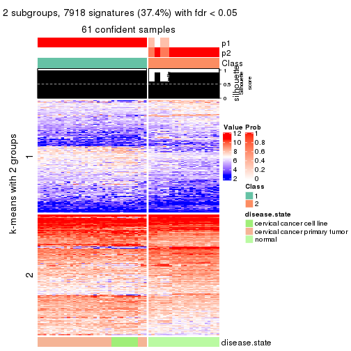</p>

</div>
<div id='tab-ATC-kmeans-get-signatures-no-scale-2'>
<pre><code class="r">get_signatures(res, k = 3, scale_rows = FALSE)
</code></pre>

<p></p>

</div>
<div id='tab-ATC-kmeans-get-signatures-no-scale-3'>
<pre><code class="r">get_signatures(res, k = 4, scale_rows = FALSE)
</code></pre>

<p></p>

</div>
<div id='tab-ATC-kmeans-get-signatures-no-scale-4'>
<pre><code class="r">get_signatures(res, k = 5, scale_rows = FALSE)
</code></pre>

<p></p>

</div>
<div id='tab-ATC-kmeans-get-signatures-no-scale-5'>
<pre><code class="r">get_signatures(res, k = 6, scale_rows = FALSE)
</code></pre>

<p></p>

</div>
</div>


Compare the overlap of signatures from different k:

```r
compare_signatures(res)
```

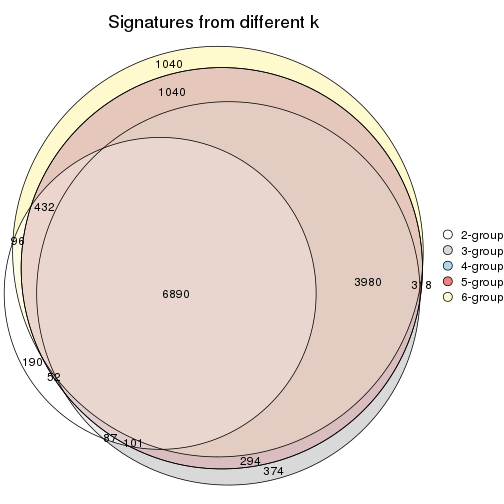

`get_signature()` returns a data frame invisibly. TO get the list of signatures, the function
call should be assigned to a variable explicitly. In following code, if `plot` argument is set
to `FALSE`, no heatmap is plotted while only the differential analysis is performed.

```r
# code only for demonstration
tb = get_signature(res, k = ..., plot = FALSE)
```

An example of the output of `tb` is:

```
#>   which_row         fdr    mean_1    mean_2 scaled_mean_1 scaled_mean_2 km
#> 1        38 0.042760348  8.373488  9.131774    -0.5533452     0.5164555  1
#> 2        40 0.018707592  7.106213  8.469186    -0.6173731     0.5762149  1
#> 3        55 0.019134737 10.221463 11.207825    -0.6159697     0.5749050  1
#> 4        59 0.006059896  5.921854  7.869574    -0.6899429     0.6439467  1
#> 5        60 0.018055526  8.928898 10.211722    -0.6204761     0.5791110  1
#> 6        98 0.009384629 15.714769 14.887706     0.6635654    -0.6193277  2
...
```

The columns in `tb` are:

1. `which_row`: row indices corresponding to the input matrix.
2. `fdr`: FDR for the differential test. 
3. `mean_x`: The mean value in group x.
4. `scaled_mean_x`: The mean value in group x after rows are scaled.
5. `km`: Row groups if k-means clustering is applied to rows.


UMAP plot which shows how samples are separated.


<script>
$( function() {
	$( '#tabs-ATC-kmeans-dimension-reduction' ).tabs();
} );
</script>
<div id='tabs-ATC-kmeans-dimension-reduction'>
<ul>
<li><a href='#tab-ATC-kmeans-dimension-reduction-1'>k = 2</a></li>
<li><a href='#tab-ATC-kmeans-dimension-reduction-2'>k = 3</a></li>
<li><a href='#tab-ATC-kmeans-dimension-reduction-3'>k = 4</a></li>
<li><a href='#tab-ATC-kmeans-dimension-reduction-4'>k = 5</a></li>
<li><a href='#tab-ATC-kmeans-dimension-reduction-5'>k = 6</a></li>
</ul>
<div id='tab-ATC-kmeans-dimension-reduction-1'>
<pre><code class="r">dimension_reduction(res, k = 2, method = &quot;UMAP&quot;)
</code></pre>

<p></p>

</div>
<div id='tab-ATC-kmeans-dimension-reduction-2'>
<pre><code class="r">dimension_reduction(res, k = 3, method = &quot;UMAP&quot;)
</code></pre>

<p></p>

</div>
<div id='tab-ATC-kmeans-dimension-reduction-3'>
<pre><code class="r">dimension_reduction(res, k = 4, method = &quot;UMAP&quot;)
</code></pre>

<p></p>

</div>
<div id='tab-ATC-kmeans-dimension-reduction-4'>
<pre><code class="r">dimension_reduction(res, k = 5, method = &quot;UMAP&quot;)
</code></pre>

<p></p>

</div>
<div id='tab-ATC-kmeans-dimension-reduction-5'>
<pre><code class="r">dimension_reduction(res, k = 6, method = &quot;UMAP&quot;)
</code></pre>

<p></p>

</div>
</div>


Following heatmap shows how subgroups are split when increasing `k`:

```r
collect_classes(res)
```


Test correlation between subgroups and known annotations. If the known
annotation is numeric, one-way ANOVA test is applied, and if the known
annotation is discrete, chi-squared contingency table test is applied.

```r
test_to_known_factors(res)
```

```
#>             n disease.state(p) k
#> ATC:kmeans 61         5.68e-14 2
#> ATC:kmeans 61         3.74e-21 3
#> ATC:kmeans 61         2.38e-22 4
#> ATC:kmeans 61         2.38e-22 5
#> ATC:kmeans 57         5.72e-21 6
```


If matrix rows can be associated to genes, consider to use `GO_Enrichment(res,
...)` to perform function enrichment for the signature genes.


 

---------------------------------------------------


### ATC:skmeans*


The object with results only for a single top-value method and a single partition method 
can be extracted as:

```r
res = res_list["ATC", "skmeans"]
# you can also extract it by
# res = res_list["ATC:skmeans"]
```

A summary of `res` and all the functions that can be applied to it:

```r
res
```

```
#> A 'ConsensusPartition' object with k = 2, 3, 4, 5, 6.
#>   On a matrix with 21168 rows and 61 columns.
#>   Top rows (1000, 2000, 3000, 4000, 5000) are extracted by 'ATC' method.
#>   Subgroups are detected by 'skmeans' method.
#>   Performed in total 1250 partitions by row resampling.
#>   Best k for subgroups seems to be 3.
#> 
#> Following methods can be applied to this 'ConsensusPartition' object:
#>  [1] "cola_report"             "collect_classes"         "collect_plots"          
#>  [4] "collect_stats"           "colnames"                "compare_signatures"     
#>  [7] "consensus_heatmap"       "dimension_reduction"     "functional_enrichment"  
#> [10] "get_anno_col"            "get_anno"                "get_classes"            
#> [13] "get_consensus"           "get_matrix"              "get_membership"         
#> [16] "get_param"               "get_signatures"          "get_stats"              
#> [19] "is_best_k"               "is_stable_k"             "membership_heatmap"     
#> [22] "ncol"                    "nrow"                    "plot_ecdf"              
#> [25] "rownames"                "select_partition_number" "show"                   
#> [28] "suggest_best_k"          "test_to_known_factors"
```

`collect_plots()` function collects all the plots made from `res` for all `k` (number of partitions)
into one single page to provide an easy and fast comparison between different `k`.

```r
collect_plots(res)
```

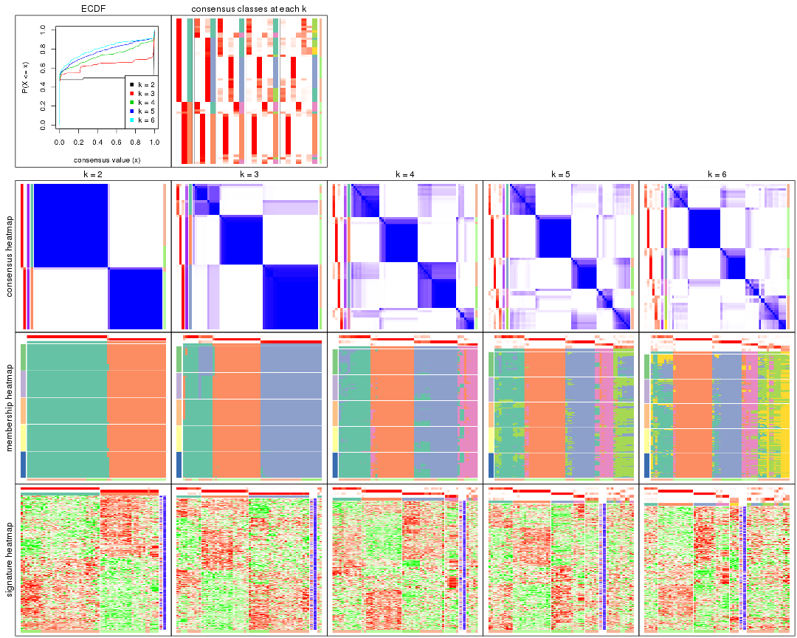

The plots are:

- The first row: a plot of the ECDF (Empirical cumulative distribution
  function) curves of the consensus matrix for each `k` and the heatmap of
  predicted classes for each `k`.
- The second row: heatmaps of the consensus matrix for each `k`.
- The third row: heatmaps of the membership matrix for each `k`.
- The fouth row: heatmaps of the signatures for each `k`.

All the plots in panels can be made by individual functions and they are
plotted later in this section.

`select_partition_number()` produces several plots showing different
statistics for choosing "optimized" `k`. There are following statistics:

- ECDF curves of the consensus matrix for each `k`;
- 1-PAC. [The PAC
  score](https://en.wikipedia.org/wiki/Consensus_clustering#Over-interpretation_potential_of_consensus_clustering)
  measures the proportion of the ambiguous subgrouping.
- Mean silhouette score.
- Concordance. The mean probability of fiting the consensus class ids in all
  partitions.
- Area increased. Denote $A_k$ as the area under the ECDF curve for current
  `k`, the area increased is defined as $A_k - A_{k-1}$.
- Rand index. The percent of pairs of samples that are both in a same cluster
  or both are not in a same cluster in the partition of k and k-1.
- Jaccard index. The ratio of pairs of samples are both in a same cluster in
  the partition of k and k-1 and the pairs of samples are both in a same
  cluster in the partition k or k-1.

The detailed explanations of these statistics can be found in [the cola
vignette](http://bioconductor.org/packages/devel/bioc/vignettes/cola/inst/doc/cola.html#toc_13).

Generally speaking, lower PAC score, higher mean silhouette score or higher
concordance corresponds to better partition. Rand index and Jaccard index
measure how similar the current partition is compared to partition with `k-1`.
If they are too similar, we won't accept `k` is better than `k-1`.

```r
select_partition_number(res)
```


The numeric values for all these statistics can be obtained by `get_stats()`.

```r
get_stats(res)
```

```
#>   k 1-PAC mean_silhouette concordance area_increased  Rand Jaccard
#> 2 2 1.000           0.991       0.996         0.4964 0.503   0.503
#> 3 3 0.900           0.932       0.962         0.2802 0.803   0.624
#> 4 4 0.754           0.800       0.906         0.1530 0.839   0.581
#> 5 5 0.750           0.720       0.853         0.0636 0.925   0.718
#> 6 6 0.762           0.652       0.796         0.0348 0.943   0.743
```

`suggest_best_k()` suggests the best $k$ based on these statistics. The rules are as follows:

- All $k$ with Jaccard index larger than 0.95 are removed because the increase of
  the partition number does not provides enough extra information. If all $k$ are removed,
  the best $k$ is assigned by `NA`.
- For $k$ with 1-PAC larger than 0.9, the maximal $k$ is taken as the "best k". Other $k$ is called "optional k".
- If it does not fit the second rule. The $k$ with the highest vote of highest
  1-PAC, mean silhouette and concordance is taken as the "best k".

```r
suggest_best_k(res)
```

```
#> [1] 3
#> attr(,"optional")
#> [1] 2
```

There is also optional best $k$ = 2 that is worth to check.

Following shows the table of the partitions (You need to click the **show/hide
code output** link to see it). The membership matrix (columns with name `p*`)
is inferred by
[`clue::cl_consensus()`](https://www.rdocumentation.org/link/cl_consensus?package=clue)
function with the `SE` method. Basically the value in the membership matrix
represents the probability to belong to a certain group. The finall class
label for an item is determined with the group with highest probability it
belongs to.

In `get_classes()` function, the entropy is calculated from the membership
matrix and the silhouette score is calculated from the consensus matrix.


<script>
$( function() {
	$( '#tabs-ATC-skmeans-get-classes' ).tabs();
} );
</script>
<div id='tabs-ATC-skmeans-get-classes'>
<ul>
<li><a href='#tab-ATC-skmeans-get-classes-1'>k = 2</a></li>
<li><a href='#tab-ATC-skmeans-get-classes-2'>k = 3</a></li>
<li><a href='#tab-ATC-skmeans-get-classes-3'>k = 4</a></li>
<li><a href='#tab-ATC-skmeans-get-classes-4'>k = 5</a></li>
<li><a href='#tab-ATC-skmeans-get-classes-5'>k = 6</a></li>
</ul>

<div id='tab-ATC-skmeans-get-classes-1'>
<p><a id='tab-ATC-skmeans-get-classes-1-a' style='color:#0366d6' href='#'>show/hide code output</a></p>
<pre><code class="r">cbind(get_classes(res, k = 2), get_membership(res, k = 2))
</code></pre>

<pre><code>#&gt;           class entropy silhouette    p1    p2
#&gt; GSM246087     1   0.000      1.000 1.000 0.000
#&gt; GSM246088     1   0.000      1.000 1.000 0.000
#&gt; GSM246089     1   0.000      1.000 1.000 0.000
#&gt; GSM246090     1   0.000      1.000 1.000 0.000
#&gt; GSM246119     1   0.000      1.000 1.000 0.000
#&gt; GSM246120     1   0.000      1.000 1.000 0.000
#&gt; GSM246121     1   0.000      1.000 1.000 0.000
#&gt; GSM246122     1   0.000      1.000 1.000 0.000
#&gt; GSM246123     1   0.000      1.000 1.000 0.000
#&gt; GSM246422     2   0.000      0.990 0.000 1.000
#&gt; GSM246423     2   0.000      0.990 0.000 1.000
#&gt; GSM246484     2   0.000      0.990 0.000 1.000
#&gt; GSM246485     2   0.000      0.990 0.000 1.000
#&gt; GSM246486     2   0.000      0.990 0.000 1.000
#&gt; GSM246487     2   0.000      0.990 0.000 1.000
#&gt; GSM246488     2   0.000      0.990 0.000 1.000
#&gt; GSM246489     2   0.000      0.990 0.000 1.000
#&gt; GSM246490     2   0.000      0.990 0.000 1.000
#&gt; GSM246491     2   0.000      0.990 0.000 1.000
#&gt; GSM247162     2   0.000      0.990 0.000 1.000
#&gt; GSM247163     2   0.000      0.990 0.000 1.000
#&gt; GSM247164     2   0.000      0.990 0.000 1.000
#&gt; GSM247165     2   0.000      0.990 0.000 1.000
#&gt; GSM247166     2   0.000      0.990 0.000 1.000
#&gt; GSM247168     2   0.000      0.990 0.000 1.000
#&gt; GSM247169     2   0.000      0.990 0.000 1.000
#&gt; GSM247171     2   0.000      0.990 0.000 1.000
#&gt; GSM247173     2   0.000      0.990 0.000 1.000
#&gt; GSM247174     2   0.000      0.990 0.000 1.000
#&gt; GSM247175     2   0.000      0.990 0.000 1.000
#&gt; GSM247188     2   0.000      0.990 0.000 1.000
#&gt; GSM247189     2   0.000      0.990 0.000 1.000
#&gt; GSM247190     2   0.000      0.990 0.000 1.000
#&gt; GSM247650     1   0.000      1.000 1.000 0.000
#&gt; GSM247651     1   0.000      1.000 1.000 0.000
#&gt; GSM247652     1   0.000      1.000 1.000 0.000
#&gt; GSM247653     1   0.000      1.000 1.000 0.000
#&gt; GSM247654     1   0.000      1.000 1.000 0.000
#&gt; GSM247655     1   0.000      1.000 1.000 0.000
#&gt; GSM247656     1   0.000      1.000 1.000 0.000
#&gt; GSM247657     1   0.000      1.000 1.000 0.000
#&gt; GSM247658     1   0.000      1.000 1.000 0.000
#&gt; GSM247659     1   0.000      1.000 1.000 0.000
#&gt; GSM247660     1   0.000      1.000 1.000 0.000
#&gt; GSM247661     1   0.000      1.000 1.000 0.000
#&gt; GSM247662     1   0.000      1.000 1.000 0.000
#&gt; GSM247663     1   0.000      1.000 1.000 0.000
#&gt; GSM247856     1   0.000      1.000 1.000 0.000
#&gt; GSM247857     1   0.000      1.000 1.000 0.000
#&gt; GSM247859     1   0.000      1.000 1.000 0.000
#&gt; GSM247860     1   0.000      1.000 1.000 0.000
#&gt; GSM247862     1   0.000      1.000 1.000 0.000
#&gt; GSM247864     1   0.000      1.000 1.000 0.000
#&gt; GSM247865     2   0.802      0.677 0.244 0.756
#&gt; GSM247866     1   0.000      1.000 1.000 0.000
#&gt; GSM247876     1   0.000      1.000 1.000 0.000
#&gt; GSM247877     1   0.000      1.000 1.000 0.000
#&gt; GSM247878     1   0.000      1.000 1.000 0.000
#&gt; GSM247879     1   0.000      1.000 1.000 0.000
#&gt; GSM247881     1   0.000      1.000 1.000 0.000
#&gt; GSM247883     2   0.000      0.990 0.000 1.000
</code></pre>

<script>
$('#tab-ATC-skmeans-get-classes-1-a').parent().next().next().hide();
$('#tab-ATC-skmeans-get-classes-1-a').click(function(){
  $('#tab-ATC-skmeans-get-classes-1-a').parent().next().next().toggle();
  return(false);
});
</script>
</div>

<div id='tab-ATC-skmeans-get-classes-2'>
<p><a id='tab-ATC-skmeans-get-classes-2-a' style='color:#0366d6' href='#'>show/hide code output</a></p>
<pre><code class="r">cbind(get_classes(res, k = 3), get_membership(res, k = 3))
</code></pre>

<pre><code>#&gt;           class entropy silhouette    p1    p2    p3
#&gt; GSM246087     3  0.0000      0.994 0.000 0.000 1.000
#&gt; GSM246088     3  0.0000      0.994 0.000 0.000 1.000
#&gt; GSM246089     3  0.0000      0.994 0.000 0.000 1.000
#&gt; GSM246090     3  0.0000      0.994 0.000 0.000 1.000
#&gt; GSM246119     3  0.0000      0.994 0.000 0.000 1.000
#&gt; GSM246120     3  0.0000      0.994 0.000 0.000 1.000
#&gt; GSM246121     3  0.0000      0.994 0.000 0.000 1.000
#&gt; GSM246122     3  0.0000      0.994 0.000 0.000 1.000
#&gt; GSM246123     3  0.0000      0.994 0.000 0.000 1.000
#&gt; GSM246422     1  0.0237      0.819 0.996 0.004 0.000
#&gt; GSM246423     1  0.0237      0.819 0.996 0.004 0.000
#&gt; GSM246484     1  0.0237      0.819 0.996 0.004 0.000
#&gt; GSM246485     1  0.5905      0.345 0.648 0.352 0.000
#&gt; GSM246486     2  0.0000      0.988 0.000 1.000 0.000
#&gt; GSM246487     2  0.0424      0.981 0.008 0.992 0.000
#&gt; GSM246488     2  0.0000      0.988 0.000 1.000 0.000
#&gt; GSM246489     2  0.0000      0.988 0.000 1.000 0.000
#&gt; GSM246490     2  0.0000      0.988 0.000 1.000 0.000
#&gt; GSM246491     2  0.0000      0.988 0.000 1.000 0.000
#&gt; GSM247162     2  0.0000      0.988 0.000 1.000 0.000
#&gt; GSM247163     2  0.0000      0.988 0.000 1.000 0.000
#&gt; GSM247164     2  0.0000      0.988 0.000 1.000 0.000
#&gt; GSM247165     2  0.0000      0.988 0.000 1.000 0.000
#&gt; GSM247166     2  0.0000      0.988 0.000 1.000 0.000
#&gt; GSM247168     2  0.0000      0.988 0.000 1.000 0.000
#&gt; GSM247169     2  0.0000      0.988 0.000 1.000 0.000
#&gt; GSM247171     2  0.0000      0.988 0.000 1.000 0.000
#&gt; GSM247173     2  0.0000      0.988 0.000 1.000 0.000
#&gt; GSM247174     2  0.0000      0.988 0.000 1.000 0.000
#&gt; GSM247175     2  0.0000      0.988 0.000 1.000 0.000
#&gt; GSM247188     2  0.0000      0.988 0.000 1.000 0.000
#&gt; GSM247189     2  0.4750      0.746 0.216 0.784 0.000
#&gt; GSM247190     2  0.0000      0.988 0.000 1.000 0.000
#&gt; GSM247650     3  0.0000      0.994 0.000 0.000 1.000
#&gt; GSM247651     1  0.4750      0.793 0.784 0.000 0.216
#&gt; GSM247652     3  0.0000      0.994 0.000 0.000 1.000
#&gt; GSM247653     3  0.0237      0.991 0.004 0.000 0.996
#&gt; GSM247654     3  0.0000      0.994 0.000 0.000 1.000
#&gt; GSM247655     1  0.4796      0.790 0.780 0.000 0.220
#&gt; GSM247656     3  0.0000      0.994 0.000 0.000 1.000
#&gt; GSM247657     3  0.0000      0.994 0.000 0.000 1.000
#&gt; GSM247658     3  0.0000      0.994 0.000 0.000 1.000
#&gt; GSM247659     3  0.0000      0.994 0.000 0.000 1.000
#&gt; GSM247660     1  0.4750      0.793 0.784 0.000 0.216
#&gt; GSM247661     3  0.0237      0.991 0.004 0.000 0.996
#&gt; GSM247662     3  0.0000      0.994 0.000 0.000 1.000
#&gt; GSM247663     3  0.0747      0.982 0.016 0.000 0.984
#&gt; GSM247856     3  0.0000      0.994 0.000 0.000 1.000
#&gt; GSM247857     3  0.0000      0.994 0.000 0.000 1.000
#&gt; GSM247859     3  0.1163      0.968 0.028 0.000 0.972
#&gt; GSM247860     3  0.2165      0.921 0.064 0.000 0.936
#&gt; GSM247862     1  0.6126      0.491 0.600 0.000 0.400
#&gt; GSM247864     1  0.4750      0.793 0.784 0.000 0.216
#&gt; GSM247865     1  0.2486      0.800 0.932 0.060 0.008
#&gt; GSM247866     1  0.4796      0.790 0.780 0.000 0.220
#&gt; GSM247876     3  0.0592      0.985 0.012 0.000 0.988
#&gt; GSM247877     1  0.0000      0.819 1.000 0.000 0.000
#&gt; GSM247878     1  0.0000      0.819 1.000 0.000 0.000
#&gt; GSM247879     3  0.0592      0.985 0.012 0.000 0.988
#&gt; GSM247881     3  0.0000      0.994 0.000 0.000 1.000
#&gt; GSM247883     2  0.1015      0.970 0.012 0.980 0.008
</code></pre>

<script>
$('#tab-ATC-skmeans-get-classes-2-a').parent().next().next().hide();
$('#tab-ATC-skmeans-get-classes-2-a').click(function(){
  $('#tab-ATC-skmeans-get-classes-2-a').parent().next().next().toggle();
  return(false);
});
</script>
</div>

<div id='tab-ATC-skmeans-get-classes-3'>
<p><a id='tab-ATC-skmeans-get-classes-3-a' style='color:#0366d6' href='#'>show/hide code output</a></p>
<pre><code class="r">cbind(get_classes(res, k = 4), get_membership(res, k = 4))
</code></pre>

<pre><code>#&gt;           class entropy silhouette    p1    p2    p3    p4
#&gt; GSM246087     3  0.0000      0.882 0.000 0.000 1.000 0.000
#&gt; GSM246088     3  0.0000      0.882 0.000 0.000 1.000 0.000
#&gt; GSM246089     3  0.0000      0.882 0.000 0.000 1.000 0.000
#&gt; GSM246090     3  0.0000      0.882 0.000 0.000 1.000 0.000
#&gt; GSM246119     3  0.0000      0.882 0.000 0.000 1.000 0.000
#&gt; GSM246120     3  0.0000      0.882 0.000 0.000 1.000 0.000
#&gt; GSM246121     3  0.0000      0.882 0.000 0.000 1.000 0.000
#&gt; GSM246122     3  0.0000      0.882 0.000 0.000 1.000 0.000
#&gt; GSM246123     3  0.0000      0.882 0.000 0.000 1.000 0.000
#&gt; GSM246422     4  0.0000      0.756 0.000 0.000 0.000 1.000
#&gt; GSM246423     4  0.0000      0.756 0.000 0.000 0.000 1.000
#&gt; GSM246484     4  0.0000      0.756 0.000 0.000 0.000 1.000
#&gt; GSM246485     4  0.1211      0.752 0.000 0.040 0.000 0.960
#&gt; GSM246486     2  0.3266      0.772 0.000 0.832 0.000 0.168
#&gt; GSM246487     2  0.4933      0.210 0.000 0.568 0.000 0.432
#&gt; GSM246488     4  0.4933      0.134 0.000 0.432 0.000 0.568
#&gt; GSM246489     2  0.0000      0.953 0.000 1.000 0.000 0.000
#&gt; GSM246490     2  0.0000      0.953 0.000 1.000 0.000 0.000
#&gt; GSM246491     2  0.0000      0.953 0.000 1.000 0.000 0.000
#&gt; GSM247162     2  0.0000      0.953 0.000 1.000 0.000 0.000
#&gt; GSM247163     2  0.0000      0.953 0.000 1.000 0.000 0.000
#&gt; GSM247164     2  0.0000      0.953 0.000 1.000 0.000 0.000
#&gt; GSM247165     2  0.0000      0.953 0.000 1.000 0.000 0.000
#&gt; GSM247166     2  0.0000      0.953 0.000 1.000 0.000 0.000
#&gt; GSM247168     2  0.0000      0.953 0.000 1.000 0.000 0.000
#&gt; GSM247169     2  0.0000      0.953 0.000 1.000 0.000 0.000
#&gt; GSM247171     2  0.0000      0.953 0.000 1.000 0.000 0.000
#&gt; GSM247173     2  0.0000      0.953 0.000 1.000 0.000 0.000
#&gt; GSM247174     2  0.0000      0.953 0.000 1.000 0.000 0.000
#&gt; GSM247175     2  0.0000      0.953 0.000 1.000 0.000 0.000
#&gt; GSM247188     2  0.0000      0.953 0.000 1.000 0.000 0.000
#&gt; GSM247189     4  0.3311      0.683 0.000 0.172 0.000 0.828
#&gt; GSM247190     2  0.0000      0.953 0.000 1.000 0.000 0.000
#&gt; GSM247650     3  0.4008      0.723 0.244 0.000 0.756 0.000
#&gt; GSM247651     1  0.0927      0.857 0.976 0.000 0.008 0.016
#&gt; GSM247652     3  0.3764      0.754 0.216 0.000 0.784 0.000
#&gt; GSM247653     1  0.1637      0.860 0.940 0.000 0.060 0.000
#&gt; GSM247654     3  0.4382      0.653 0.296 0.000 0.704 0.000
#&gt; GSM247655     1  0.0524      0.861 0.988 0.000 0.008 0.004
#&gt; GSM247656     3  0.0188      0.881 0.004 0.000 0.996 0.000
#&gt; GSM247657     3  0.4500      0.621 0.316 0.000 0.684 0.000
#&gt; GSM247658     1  0.3610      0.767 0.800 0.000 0.200 0.000
#&gt; GSM247659     3  0.0469      0.878 0.012 0.000 0.988 0.000
#&gt; GSM247660     1  0.0672      0.860 0.984 0.000 0.008 0.008
#&gt; GSM247661     1  0.1867      0.856 0.928 0.000 0.072 0.000
#&gt; GSM247662     3  0.3074      0.803 0.152 0.000 0.848 0.000
#&gt; GSM247663     1  0.2814      0.825 0.868 0.000 0.132 0.000
#&gt; GSM247856     3  0.0000      0.882 0.000 0.000 1.000 0.000
#&gt; GSM247857     3  0.4277      0.688 0.280 0.000 0.720 0.000
#&gt; GSM247859     1  0.4843      0.281 0.604 0.000 0.396 0.000
#&gt; GSM247860     1  0.0921      0.863 0.972 0.000 0.028 0.000
#&gt; GSM247862     1  0.0336      0.861 0.992 0.000 0.008 0.000
#&gt; GSM247864     1  0.0804      0.859 0.980 0.000 0.008 0.012
#&gt; GSM247865     4  0.6456      0.271 0.408 0.040 0.016 0.536
#&gt; GSM247866     1  0.0804      0.859 0.980 0.000 0.008 0.012
#&gt; GSM247876     1  0.3764      0.748 0.784 0.000 0.216 0.000
#&gt; GSM247877     4  0.4605      0.485 0.336 0.000 0.000 0.664
#&gt; GSM247878     4  0.4431      0.529 0.304 0.000 0.000 0.696
#&gt; GSM247879     1  0.3908      0.766 0.784 0.000 0.212 0.004
#&gt; GSM247881     3  0.4193      0.701 0.268 0.000 0.732 0.000
#&gt; GSM247883     2  0.3940      0.783 0.116 0.844 0.012 0.028
</code></pre>

<script>
$('#tab-ATC-skmeans-get-classes-3-a').parent().next().next().hide();
$('#tab-ATC-skmeans-get-classes-3-a').click(function(){
  $('#tab-ATC-skmeans-get-classes-3-a').parent().next().next().toggle();
  return(false);
});
</script>
</div>

<div id='tab-ATC-skmeans-get-classes-4'>
<p><a id='tab-ATC-skmeans-get-classes-4-a' style='color:#0366d6' href='#'>show/hide code output</a></p>
<pre><code class="r">cbind(get_classes(res, k = 5), get_membership(res, k = 5))
</code></pre>

<pre><code>#&gt;           class entropy silhouette    p1    p2    p3    p4    p5
#&gt; GSM246087     3  0.0000     0.8687 0.000 0.000 1.000 0.000 0.000
#&gt; GSM246088     3  0.0000     0.8687 0.000 0.000 1.000 0.000 0.000
#&gt; GSM246089     3  0.0162     0.8647 0.004 0.000 0.996 0.000 0.000
#&gt; GSM246090     3  0.0000     0.8687 0.000 0.000 1.000 0.000 0.000
#&gt; GSM246119     3  0.0000     0.8687 0.000 0.000 1.000 0.000 0.000
#&gt; GSM246120     3  0.0000     0.8687 0.000 0.000 1.000 0.000 0.000
#&gt; GSM246121     3  0.0000     0.8687 0.000 0.000 1.000 0.000 0.000
#&gt; GSM246122     3  0.0000     0.8687 0.000 0.000 1.000 0.000 0.000
#&gt; GSM246123     3  0.0000     0.8687 0.000 0.000 1.000 0.000 0.000
#&gt; GSM246422     4  0.0000     0.7374 0.000 0.000 0.000 1.000 0.000
#&gt; GSM246423     4  0.0000     0.7374 0.000 0.000 0.000 1.000 0.000
#&gt; GSM246484     4  0.0000     0.7374 0.000 0.000 0.000 1.000 0.000
#&gt; GSM246485     4  0.2438     0.7162 0.000 0.060 0.000 0.900 0.040
#&gt; GSM246486     2  0.3954     0.6812 0.000 0.772 0.000 0.192 0.036
#&gt; GSM246487     2  0.5243     0.1521 0.000 0.540 0.000 0.412 0.048
#&gt; GSM246488     4  0.5037     0.2781 0.000 0.376 0.000 0.584 0.040
#&gt; GSM246489     2  0.0000     0.9557 0.000 1.000 0.000 0.000 0.000
#&gt; GSM246490     2  0.0000     0.9557 0.000 1.000 0.000 0.000 0.000
#&gt; GSM246491     2  0.0000     0.9557 0.000 1.000 0.000 0.000 0.000
#&gt; GSM247162     2  0.0000     0.9557 0.000 1.000 0.000 0.000 0.000
#&gt; GSM247163     2  0.0000     0.9557 0.000 1.000 0.000 0.000 0.000
#&gt; GSM247164     2  0.0000     0.9557 0.000 1.000 0.000 0.000 0.000
#&gt; GSM247165     2  0.0000     0.9557 0.000 1.000 0.000 0.000 0.000
#&gt; GSM247166     2  0.0000     0.9557 0.000 1.000 0.000 0.000 0.000
#&gt; GSM247168     2  0.0000     0.9557 0.000 1.000 0.000 0.000 0.000
#&gt; GSM247169     2  0.0000     0.9557 0.000 1.000 0.000 0.000 0.000
#&gt; GSM247171     2  0.0000     0.9557 0.000 1.000 0.000 0.000 0.000
#&gt; GSM247173     2  0.0000     0.9557 0.000 1.000 0.000 0.000 0.000
#&gt; GSM247174     2  0.0000     0.9557 0.000 1.000 0.000 0.000 0.000
#&gt; GSM247175     2  0.0000     0.9557 0.000 1.000 0.000 0.000 0.000
#&gt; GSM247188     2  0.0000     0.9557 0.000 1.000 0.000 0.000 0.000
#&gt; GSM247189     4  0.3123     0.6641 0.000 0.184 0.000 0.812 0.004
#&gt; GSM247190     2  0.0000     0.9557 0.000 1.000 0.000 0.000 0.000
#&gt; GSM247650     3  0.6301    -0.2223 0.180 0.000 0.512 0.000 0.308
#&gt; GSM247651     1  0.3476     0.7771 0.804 0.000 0.000 0.020 0.176
#&gt; GSM247652     5  0.5077     0.5846 0.040 0.000 0.392 0.000 0.568
#&gt; GSM247653     1  0.1469     0.7733 0.948 0.000 0.036 0.000 0.016
#&gt; GSM247654     5  0.5498     0.6300 0.076 0.000 0.356 0.000 0.568
#&gt; GSM247655     1  0.4130     0.7057 0.696 0.000 0.000 0.012 0.292
#&gt; GSM247656     3  0.3636     0.4614 0.000 0.000 0.728 0.000 0.272
#&gt; GSM247657     5  0.5306     0.6701 0.072 0.000 0.316 0.000 0.612
#&gt; GSM247658     1  0.5834     0.3572 0.584 0.000 0.132 0.000 0.284
#&gt; GSM247659     3  0.3586     0.4840 0.000 0.000 0.736 0.000 0.264
#&gt; GSM247660     1  0.3280     0.7807 0.812 0.000 0.000 0.012 0.176
#&gt; GSM247661     1  0.1981     0.7592 0.920 0.000 0.064 0.000 0.016
#&gt; GSM247662     5  0.4890     0.4566 0.024 0.000 0.452 0.000 0.524
#&gt; GSM247663     1  0.5040     0.7081 0.680 0.000 0.084 0.000 0.236
#&gt; GSM247856     3  0.1410     0.8161 0.000 0.000 0.940 0.000 0.060
#&gt; GSM247857     5  0.5067     0.6835 0.064 0.000 0.288 0.000 0.648
#&gt; GSM247859     5  0.3866     0.5852 0.096 0.000 0.096 0.000 0.808
#&gt; GSM247860     1  0.0912     0.7781 0.972 0.000 0.012 0.000 0.016
#&gt; GSM247862     1  0.0794     0.7815 0.972 0.000 0.000 0.000 0.028
#&gt; GSM247864     1  0.2536     0.7872 0.868 0.000 0.000 0.004 0.128
#&gt; GSM247865     5  0.6057     0.0948 0.164 0.008 0.000 0.224 0.604
#&gt; GSM247866     1  0.0162     0.7743 0.996 0.000 0.000 0.000 0.004
#&gt; GSM247876     1  0.6110     0.3787 0.476 0.000 0.128 0.000 0.396
#&gt; GSM247877     4  0.5297     0.3080 0.360 0.000 0.000 0.580 0.060
#&gt; GSM247878     4  0.5203     0.3632 0.332 0.000 0.000 0.608 0.060
#&gt; GSM247879     1  0.5466     0.6655 0.656 0.000 0.152 0.000 0.192
#&gt; GSM247881     5  0.4666     0.6850 0.056 0.000 0.240 0.000 0.704
#&gt; GSM247883     5  0.3101     0.4602 0.024 0.100 0.000 0.012 0.864
</code></pre>

<script>
$('#tab-ATC-skmeans-get-classes-4-a').parent().next().next().hide();
$('#tab-ATC-skmeans-get-classes-4-a').click(function(){
  $('#tab-ATC-skmeans-get-classes-4-a').parent().next().next().toggle();
  return(false);
});
</script>
</div>

<div id='tab-ATC-skmeans-get-classes-5'>
<p><a id='tab-ATC-skmeans-get-classes-5-a' style='color:#0366d6' href='#'>show/hide code output</a></p>
<pre><code class="r">cbind(get_classes(res, k = 6), get_membership(res, k = 6))
</code></pre>

<pre><code>#&gt;           class entropy silhouette    p1    p2    p3    p4    p5    p6
#&gt; GSM246087     3  0.0000     0.8461 0.000 0.000 1.000 0.000 0.000 0.000
#&gt; GSM246088     3  0.0000     0.8461 0.000 0.000 1.000 0.000 0.000 0.000
#&gt; GSM246089     3  0.0000     0.8461 0.000 0.000 1.000 0.000 0.000 0.000
#&gt; GSM246090     3  0.0000     0.8461 0.000 0.000 1.000 0.000 0.000 0.000
#&gt; GSM246119     3  0.0000     0.8461 0.000 0.000 1.000 0.000 0.000 0.000
#&gt; GSM246120     3  0.0000     0.8461 0.000 0.000 1.000 0.000 0.000 0.000
#&gt; GSM246121     3  0.0000     0.8461 0.000 0.000 1.000 0.000 0.000 0.000
#&gt; GSM246122     3  0.0000     0.8461 0.000 0.000 1.000 0.000 0.000 0.000
#&gt; GSM246123     3  0.0000     0.8461 0.000 0.000 1.000 0.000 0.000 0.000
#&gt; GSM246422     4  0.0458     0.6705 0.000 0.000 0.000 0.984 0.016 0.000
#&gt; GSM246423     4  0.0458     0.6705 0.000 0.000 0.000 0.984 0.016 0.000
#&gt; GSM246484     4  0.0458     0.6705 0.000 0.000 0.000 0.984 0.016 0.000
#&gt; GSM246485     4  0.4488     0.6480 0.020 0.048 0.000 0.724 0.004 0.204
#&gt; GSM246486     2  0.5793     0.1807 0.020 0.580 0.000 0.204 0.000 0.196
#&gt; GSM246487     4  0.6778     0.3986 0.032 0.344 0.000 0.368 0.004 0.252
#&gt; GSM246488     4  0.5989     0.5824 0.016 0.260 0.000 0.528 0.000 0.196
#&gt; GSM246489     2  0.0000     0.9697 0.000 1.000 0.000 0.000 0.000 0.000
#&gt; GSM246490     2  0.0000     0.9697 0.000 1.000 0.000 0.000 0.000 0.000
#&gt; GSM246491     2  0.0000     0.9697 0.000 1.000 0.000 0.000 0.000 0.000
#&gt; GSM247162     2  0.0000     0.9697 0.000 1.000 0.000 0.000 0.000 0.000
#&gt; GSM247163     2  0.0000     0.9697 0.000 1.000 0.000 0.000 0.000 0.000
#&gt; GSM247164     2  0.0000     0.9697 0.000 1.000 0.000 0.000 0.000 0.000
#&gt; GSM247165     2  0.0000     0.9697 0.000 1.000 0.000 0.000 0.000 0.000
#&gt; GSM247166     2  0.0000     0.9697 0.000 1.000 0.000 0.000 0.000 0.000
#&gt; GSM247168     2  0.0000     0.9697 0.000 1.000 0.000 0.000 0.000 0.000
#&gt; GSM247169     2  0.0000     0.9697 0.000 1.000 0.000 0.000 0.000 0.000
#&gt; GSM247171     2  0.0000     0.9697 0.000 1.000 0.000 0.000 0.000 0.000
#&gt; GSM247173     2  0.0000     0.9697 0.000 1.000 0.000 0.000 0.000 0.000
#&gt; GSM247174     2  0.0000     0.9697 0.000 1.000 0.000 0.000 0.000 0.000
#&gt; GSM247175     2  0.0000     0.9697 0.000 1.000 0.000 0.000 0.000 0.000
#&gt; GSM247188     2  0.0000     0.9697 0.000 1.000 0.000 0.000 0.000 0.000
#&gt; GSM247189     4  0.3460     0.6115 0.000 0.220 0.000 0.760 0.000 0.020
#&gt; GSM247190     2  0.0000     0.9697 0.000 1.000 0.000 0.000 0.000 0.000
#&gt; GSM247650     3  0.6047    -0.0129 0.220 0.000 0.480 0.000 0.292 0.008
#&gt; GSM247651     5  0.1781     0.4892 0.060 0.000 0.000 0.008 0.924 0.008
#&gt; GSM247652     1  0.4651     0.6120 0.676 0.000 0.256 0.000 0.052 0.016
#&gt; GSM247653     6  0.4987     0.9251 0.044 0.000 0.012 0.000 0.420 0.524
#&gt; GSM247654     1  0.5244     0.6301 0.652 0.000 0.232 0.000 0.080 0.036
#&gt; GSM247655     5  0.3183     0.4848 0.164 0.000 0.000 0.008 0.812 0.016
#&gt; GSM247656     3  0.3747     0.2222 0.396 0.000 0.604 0.000 0.000 0.000
#&gt; GSM247657     1  0.4562     0.6653 0.720 0.000 0.196 0.000 0.056 0.028
#&gt; GSM247658     1  0.7391    -0.0792 0.324 0.000 0.112 0.000 0.284 0.280
#&gt; GSM247659     3  0.4151     0.1555 0.412 0.000 0.576 0.000 0.004 0.008
#&gt; GSM247660     5  0.2052     0.4643 0.056 0.000 0.000 0.004 0.912 0.028
#&gt; GSM247661     6  0.4913     0.9364 0.028 0.000 0.020 0.000 0.428 0.524
#&gt; GSM247662     1  0.4868     0.4532 0.588 0.000 0.352 0.000 0.052 0.008
#&gt; GSM247663     5  0.3936     0.4961 0.124 0.000 0.088 0.000 0.780 0.008
#&gt; GSM247856     3  0.2527     0.7532 0.084 0.000 0.880 0.000 0.004 0.032
#&gt; GSM247857     1  0.4197     0.6745 0.752 0.000 0.172 0.000 0.060 0.016
#&gt; GSM247859     1  0.3755     0.6024 0.816 0.000 0.056 0.000 0.084 0.044
#&gt; GSM247860     6  0.4453     0.9374 0.020 0.000 0.004 0.000 0.452 0.524
#&gt; GSM247862     5  0.4531    -0.8783 0.032 0.000 0.000 0.000 0.504 0.464
#&gt; GSM247864     5  0.2069     0.3553 0.020 0.000 0.000 0.004 0.908 0.068
#&gt; GSM247865     1  0.6861     0.0957 0.424 0.000 0.000 0.128 0.104 0.344
#&gt; GSM247866     6  0.4097     0.8987 0.008 0.000 0.000 0.000 0.492 0.500
#&gt; GSM247876     5  0.5522     0.4139 0.240 0.000 0.108 0.000 0.620 0.032
#&gt; GSM247877     5  0.4399     0.2135 0.000 0.000 0.000 0.460 0.516 0.024
#&gt; GSM247878     5  0.4407     0.1737 0.000 0.000 0.000 0.480 0.496 0.024
#&gt; GSM247879     5  0.4670     0.4693 0.072 0.000 0.148 0.004 0.740 0.036
#&gt; GSM247881     1  0.3457     0.6680 0.820 0.000 0.116 0.000 0.052 0.012
#&gt; GSM247883     1  0.4204     0.4119 0.716 0.012 0.000 0.008 0.020 0.244
</code></pre>

<script>
$('#tab-ATC-skmeans-get-classes-5-a').parent().next().next().hide();
$('#tab-ATC-skmeans-get-classes-5-a').click(function(){
  $('#tab-ATC-skmeans-get-classes-5-a').parent().next().next().toggle();
  return(false);
});
</script>
</div>
</div>

Heatmaps for the consensus matrix. It visualizes the probability of two
samples to be in a same group.


<script>
$( function() {
	$( '#tabs-ATC-skmeans-consensus-heatmap' ).tabs();
} );
</script>
<div id='tabs-ATC-skmeans-consensus-heatmap'>
<ul>
<li><a href='#tab-ATC-skmeans-consensus-heatmap-1'>k = 2</a></li>
<li><a href='#tab-ATC-skmeans-consensus-heatmap-2'>k = 3</a></li>
<li><a href='#tab-ATC-skmeans-consensus-heatmap-3'>k = 4</a></li>
<li><a href='#tab-ATC-skmeans-consensus-heatmap-4'>k = 5</a></li>
<li><a href='#tab-ATC-skmeans-consensus-heatmap-5'>k = 6</a></li>
</ul>
<div id='tab-ATC-skmeans-consensus-heatmap-1'>
<pre><code class="r">consensus_heatmap(res, k = 2)
</code></pre>

<p></p>

</div>
<div id='tab-ATC-skmeans-consensus-heatmap-2'>
<pre><code class="r">consensus_heatmap(res, k = 3)
</code></pre>

<p></p>

</div>
<div id='tab-ATC-skmeans-consensus-heatmap-3'>
<pre><code class="r">consensus_heatmap(res, k = 4)
</code></pre>

<p></p>

</div>
<div id='tab-ATC-skmeans-consensus-heatmap-4'>
<pre><code class="r">consensus_heatmap(res, k = 5)
</code></pre>

<p></p>

</div>
<div id='tab-ATC-skmeans-consensus-heatmap-5'>
<pre><code class="r">consensus_heatmap(res, k = 6)
</code></pre>

<p></p>

</div>
</div>

Heatmaps for the membership of samples in all partitions to see how consistent they are:


<script>
$( function() {
	$( '#tabs-ATC-skmeans-membership-heatmap' ).tabs();
} );
</script>
<div id='tabs-ATC-skmeans-membership-heatmap'>
<ul>
<li><a href='#tab-ATC-skmeans-membership-heatmap-1'>k = 2</a></li>
<li><a href='#tab-ATC-skmeans-membership-heatmap-2'>k = 3</a></li>
<li><a href='#tab-ATC-skmeans-membership-heatmap-3'>k = 4</a></li>
<li><a href='#tab-ATC-skmeans-membership-heatmap-4'>k = 5</a></li>
<li><a href='#tab-ATC-skmeans-membership-heatmap-5'>k = 6</a></li>
</ul>
<div id='tab-ATC-skmeans-membership-heatmap-1'>
<pre><code class="r">membership_heatmap(res, k = 2)
</code></pre>

<p></p>

</div>
<div id='tab-ATC-skmeans-membership-heatmap-2'>
<pre><code class="r">membership_heatmap(res, k = 3)
</code></pre>

<p></p>

</div>
<div id='tab-ATC-skmeans-membership-heatmap-3'>
<pre><code class="r">membership_heatmap(res, k = 4)
</code></pre>

<p></p>

</div>
<div id='tab-ATC-skmeans-membership-heatmap-4'>
<pre><code class="r">membership_heatmap(res, k = 5)
</code></pre>

<p></p>

</div>
<div id='tab-ATC-skmeans-membership-heatmap-5'>
<pre><code class="r">membership_heatmap(res, k = 6)
</code></pre>

<p></p>

</div>
</div>

As soon as we have had the classes for columns, we can look for signatures
which are significantly different between classes which can be candidate marks
for certain classes. Following are the heatmaps for signatures.


Signature heatmaps where rows are scaled:


<script>
$( function() {
	$( '#tabs-ATC-skmeans-get-signatures' ).tabs();
} );
</script>
<div id='tabs-ATC-skmeans-get-signatures'>
<ul>
<li><a href='#tab-ATC-skmeans-get-signatures-1'>k = 2</a></li>
<li><a href='#tab-ATC-skmeans-get-signatures-2'>k = 3</a></li>
<li><a href='#tab-ATC-skmeans-get-signatures-3'>k = 4</a></li>
<li><a href='#tab-ATC-skmeans-get-signatures-4'>k = 5</a></li>
<li><a href='#tab-ATC-skmeans-get-signatures-5'>k = 6</a></li>
</ul>
<div id='tab-ATC-skmeans-get-signatures-1'>
<pre><code class="r">get_signatures(res, k = 2)
</code></pre>

<p></p>

</div>
<div id='tab-ATC-skmeans-get-signatures-2'>
<pre><code class="r">get_signatures(res, k = 3)
</code></pre>

<p></p>

</div>
<div id='tab-ATC-skmeans-get-signatures-3'>
<pre><code class="r">get_signatures(res, k = 4)
</code></pre>

<p></p>

</div>
<div id='tab-ATC-skmeans-get-signatures-4'>
<pre><code class="r">get_signatures(res, k = 5)
</code></pre>

<p></p>

</div>
<div id='tab-ATC-skmeans-get-signatures-5'>
<pre><code class="r">get_signatures(res, k = 6)
</code></pre>

<p></p>

</div>
</div>


Signature heatmaps where rows are not scaled:


<script>
$( function() {
	$( '#tabs-ATC-skmeans-get-signatures-no-scale' ).tabs();
} );
</script>
<div id='tabs-ATC-skmeans-get-signatures-no-scale'>
<ul>
<li><a href='#tab-ATC-skmeans-get-signatures-no-scale-1'>k = 2</a></li>
<li><a href='#tab-ATC-skmeans-get-signatures-no-scale-2'>k = 3</a></li>
<li><a href='#tab-ATC-skmeans-get-signatures-no-scale-3'>k = 4</a></li>
<li><a href='#tab-ATC-skmeans-get-signatures-no-scale-4'>k = 5</a></li>
<li><a href='#tab-ATC-skmeans-get-signatures-no-scale-5'>k = 6</a></li>
</ul>
<div id='tab-ATC-skmeans-get-signatures-no-scale-1'>
<pre><code class="r">get_signatures(res, k = 2, scale_rows = FALSE)
</code></pre>

<p></p>

</div>
<div id='tab-ATC-skmeans-get-signatures-no-scale-2'>
<pre><code class="r">get_signatures(res, k = 3, scale_rows = FALSE)
</code></pre>

<p></p>

</div>
<div id='tab-ATC-skmeans-get-signatures-no-scale-3'>
<pre><code class="r">get_signatures(res, k = 4, scale_rows = FALSE)
</code></pre>

<p></p>

</div>
<div id='tab-ATC-skmeans-get-signatures-no-scale-4'>
<pre><code class="r">get_signatures(res, k = 5, scale_rows = FALSE)
</code></pre>

<p></p>

</div>
<div id='tab-ATC-skmeans-get-signatures-no-scale-5'>
<pre><code class="r">get_signatures(res, k = 6, scale_rows = FALSE)
</code></pre>

<p></p>

</div>
</div>


Compare the overlap of signatures from different k:

```r
compare_signatures(res)
```

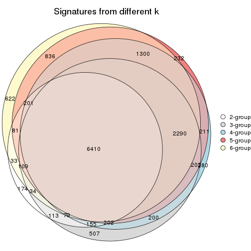

`get_signature()` returns a data frame invisibly. TO get the list of signatures, the function
call should be assigned to a variable explicitly. In following code, if `plot` argument is set
to `FALSE`, no heatmap is plotted while only the differential analysis is performed.

```r
# code only for demonstration
tb = get_signature(res, k = ..., plot = FALSE)
```

An example of the output of `tb` is:

```
#>   which_row         fdr    mean_1    mean_2 scaled_mean_1 scaled_mean_2 km
#> 1        38 0.042760348  8.373488  9.131774    -0.5533452     0.5164555  1
#> 2        40 0.018707592  7.106213  8.469186    -0.6173731     0.5762149  1
#> 3        55 0.019134737 10.221463 11.207825    -0.6159697     0.5749050  1
#> 4        59 0.006059896  5.921854  7.869574    -0.6899429     0.6439467  1
#> 5        60 0.018055526  8.928898 10.211722    -0.6204761     0.5791110  1
#> 6        98 0.009384629 15.714769 14.887706     0.6635654    -0.6193277  2
...
```

The columns in `tb` are:

1. `which_row`: row indices corresponding to the input matrix.
2. `fdr`: FDR for the differential test. 
3. `mean_x`: The mean value in group x.
4. `scaled_mean_x`: The mean value in group x after rows are scaled.
5. `km`: Row groups if k-means clustering is applied to rows.


UMAP plot which shows how samples are separated.


<script>
$( function() {
	$( '#tabs-ATC-skmeans-dimension-reduction' ).tabs();
} );
</script>
<div id='tabs-ATC-skmeans-dimension-reduction'>
<ul>
<li><a href='#tab-ATC-skmeans-dimension-reduction-1'>k = 2</a></li>
<li><a href='#tab-ATC-skmeans-dimension-reduction-2'>k = 3</a></li>
<li><a href='#tab-ATC-skmeans-dimension-reduction-3'>k = 4</a></li>
<li><a href='#tab-ATC-skmeans-dimension-reduction-4'>k = 5</a></li>
<li><a href='#tab-ATC-skmeans-dimension-reduction-5'>k = 6</a></li>
</ul>
<div id='tab-ATC-skmeans-dimension-reduction-1'>
<pre><code class="r">dimension_reduction(res, k = 2, method = &quot;UMAP&quot;)
</code></pre>

<p></p>

</div>
<div id='tab-ATC-skmeans-dimension-reduction-2'>
<pre><code class="r">dimension_reduction(res, k = 3, method = &quot;UMAP&quot;)
</code></pre>

<p></p>

</div>
<div id='tab-ATC-skmeans-dimension-reduction-3'>
<pre><code class="r">dimension_reduction(res, k = 4, method = &quot;UMAP&quot;)
</code></pre>

<p></p>

</div>
<div id='tab-ATC-skmeans-dimension-reduction-4'>
<pre><code class="r">dimension_reduction(res, k = 5, method = &quot;UMAP&quot;)
</code></pre>

<p></p>

</div>
<div id='tab-ATC-skmeans-dimension-reduction-5'>
<pre><code class="r">dimension_reduction(res, k = 6, method = &quot;UMAP&quot;)
</code></pre>

<p></p>

</div>
</div>


Following heatmap shows how subgroups are split when increasing `k`:

```r
collect_classes(res)
```


Test correlation between subgroups and known annotations. If the known
annotation is numeric, one-way ANOVA test is applied, and if the known
annotation is discrete, chi-squared contingency table test is applied.

```r
test_to_known_factors(res)
```

```
#>              n disease.state(p) k
#> ATC:skmeans 61         2.53e-12 2
#> ATC:skmeans 59         2.62e-10 3
#> ATC:skmeans 56         9.11e-12 4
#> ATC:skmeans 49         3.43e-16 5
#> ATC:skmeans 42         2.63e-13 6
```


If matrix rows can be associated to genes, consider to use `GO_Enrichment(res,
...)` to perform function enrichment for the signature genes.


 

---------------------------------------------------


### ATC:pam**


The object with results only for a single top-value method and a single partition method 
can be extracted as:

```r
res = res_list["ATC", "pam"]
# you can also extract it by
# res = res_list["ATC:pam"]
```

A summary of `res` and all the functions that can be applied to it:

```r
res
```

```
#> A 'ConsensusPartition' object with k = 2, 3, 4, 5, 6.
#>   On a matrix with 21168 rows and 61 columns.
#>   Top rows (1000, 2000, 3000, 4000, 5000) are extracted by 'ATC' method.
#>   Subgroups are detected by 'pam' method.
#>   Performed in total 1250 partitions by row resampling.
#>   Best k for subgroups seems to be 4.
#> 
#> Following methods can be applied to this 'ConsensusPartition' object:
#>  [1] "cola_report"             "collect_classes"         "collect_plots"          
#>  [4] "collect_stats"           "colnames"                "compare_signatures"     
#>  [7] "consensus_heatmap"       "dimension_reduction"     "functional_enrichment"  
#> [10] "get_anno_col"            "get_anno"                "get_classes"            
#> [13] "get_consensus"           "get_matrix"              "get_membership"         
#> [16] "get_param"               "get_signatures"          "get_stats"              
#> [19] "is_best_k"               "is_stable_k"             "membership_heatmap"     
#> [22] "ncol"                    "nrow"                    "plot_ecdf"              
#> [25] "rownames"                "select_partition_number" "show"                   
#> [28] "suggest_best_k"          "test_to_known_factors"
```

`collect_plots()` function collects all the plots made from `res` for all `k` (number of partitions)
into one single page to provide an easy and fast comparison between different `k`.

```r
collect_plots(res)
```


The plots are:

- The first row: a plot of the ECDF (Empirical cumulative distribution
  function) curves of the consensus matrix for each `k` and the heatmap of
  predicted classes for each `k`.
- The second row: heatmaps of the consensus matrix for each `k`.
- The third row: heatmaps of the membership matrix for each `k`.
- The fouth row: heatmaps of the signatures for each `k`.

All the plots in panels can be made by individual functions and they are
plotted later in this section.

`select_partition_number()` produces several plots showing different
statistics for choosing "optimized" `k`. There are following statistics:

- ECDF curves of the consensus matrix for each `k`;
- 1-PAC. [The PAC
  score](https://en.wikipedia.org/wiki/Consensus_clustering#Over-interpretation_potential_of_consensus_clustering)
  measures the proportion of the ambiguous subgrouping.
- Mean silhouette score.
- Concordance. The mean probability of fiting the consensus class ids in all
  partitions.
- Area increased. Denote $A_k$ as the area under the ECDF curve for current
  `k`, the area increased is defined as $A_k - A_{k-1}$.
- Rand index. The percent of pairs of samples that are both in a same cluster
  or both are not in a same cluster in the partition of k and k-1.
- Jaccard index. The ratio of pairs of samples are both in a same cluster in
  the partition of k and k-1 and the pairs of samples are both in a same
  cluster in the partition k or k-1.

The detailed explanations of these statistics can be found in [the cola
vignette](http://bioconductor.org/packages/devel/bioc/vignettes/cola/inst/doc/cola.html#toc_13).

Generally speaking, lower PAC score, higher mean silhouette score or higher
concordance corresponds to better partition. Rand index and Jaccard index
measure how similar the current partition is compared to partition with `k-1`.
If they are too similar, we won't accept `k` is better than `k-1`.

```r
select_partition_number(res)
```


The numeric values for all these statistics can be obtained by `get_stats()`.

```r
get_stats(res)
```

```
#>   k 1-PAC mean_silhouette concordance area_increased  Rand Jaccard
#> 2 2 0.932           0.953       0.978         0.4497 0.564   0.564
#> 3 3 1.000           0.971       0.987         0.3419 0.838   0.712
#> 4 4 1.000           0.972       0.989         0.1370 0.911   0.780
#> 5 5 0.850           0.839       0.918         0.1094 0.920   0.747
#> 6 6 0.819           0.691       0.882         0.0365 0.975   0.896
```

`suggest_best_k()` suggests the best $k$ based on these statistics. The rules are as follows:

- All $k$ with Jaccard index larger than 0.95 are removed because the increase of
  the partition number does not provides enough extra information. If all $k$ are removed,
  the best $k$ is assigned by `NA`.
- For $k$ with 1-PAC larger than 0.9, the maximal $k$ is taken as the "best k". Other $k$ is called "optional k".
- If it does not fit the second rule. The $k$ with the highest vote of highest
  1-PAC, mean silhouette and concordance is taken as the "best k".

```r
suggest_best_k(res)
```

```
#> [1] 4
#> attr(,"optional")
#> [1] 2 3
```

There is also optional best $k$ = 2 3 that is worth to check.

Following shows the table of the partitions (You need to click the **show/hide
code output** link to see it). The membership matrix (columns with name `p*`)
is inferred by
[`clue::cl_consensus()`](https://www.rdocumentation.org/link/cl_consensus?package=clue)
function with the `SE` method. Basically the value in the membership matrix
represents the probability to belong to a certain group. The finall class
label for an item is determined with the group with highest probability it
belongs to.

In `get_classes()` function, the entropy is calculated from the membership
matrix and the silhouette score is calculated from the consensus matrix.


<script>
$( function() {
	$( '#tabs-ATC-pam-get-classes' ).tabs();
} );
</script>
<div id='tabs-ATC-pam-get-classes'>
<ul>
<li><a href='#tab-ATC-pam-get-classes-1'>k = 2</a></li>
<li><a href='#tab-ATC-pam-get-classes-2'>k = 3</a></li>
<li><a href='#tab-ATC-pam-get-classes-3'>k = 4</a></li>
<li><a href='#tab-ATC-pam-get-classes-4'>k = 5</a></li>
<li><a href='#tab-ATC-pam-get-classes-5'>k = 6</a></li>
</ul>

<div id='tab-ATC-pam-get-classes-1'>
<p><a id='tab-ATC-pam-get-classes-1-a' style='color:#0366d6' href='#'>show/hide code output</a></p>
<pre><code class="r">cbind(get_classes(res, k = 2), get_membership(res, k = 2))
</code></pre>

<pre><code>#&gt;           class entropy silhouette    p1    p2
#&gt; GSM246087     1   0.000      0.967 1.000 0.000
#&gt; GSM246088     1   0.000      0.967 1.000 0.000
#&gt; GSM246089     1   0.000      0.967 1.000 0.000
#&gt; GSM246090     1   0.000      0.967 1.000 0.000
#&gt; GSM246119     1   0.000      0.967 1.000 0.000
#&gt; GSM246120     1   0.000      0.967 1.000 0.000
#&gt; GSM246121     1   0.000      0.967 1.000 0.000
#&gt; GSM246122     1   0.000      0.967 1.000 0.000
#&gt; GSM246123     1   0.000      0.967 1.000 0.000
#&gt; GSM246422     1   0.844      0.663 0.728 0.272
#&gt; GSM246423     1   0.814      0.693 0.748 0.252
#&gt; GSM246484     1   0.844      0.663 0.728 0.272
#&gt; GSM246485     1   0.850      0.656 0.724 0.276
#&gt; GSM246486     2   0.000      1.000 0.000 1.000
#&gt; GSM246487     1   0.814      0.693 0.748 0.252
#&gt; GSM246488     2   0.000      1.000 0.000 1.000
#&gt; GSM246489     2   0.000      1.000 0.000 1.000
#&gt; GSM246490     2   0.000      1.000 0.000 1.000
#&gt; GSM246491     2   0.000      1.000 0.000 1.000
#&gt; GSM247162     2   0.000      1.000 0.000 1.000
#&gt; GSM247163     2   0.000      1.000 0.000 1.000
#&gt; GSM247164     2   0.000      1.000 0.000 1.000
#&gt; GSM247165     2   0.000      1.000 0.000 1.000
#&gt; GSM247166     2   0.000      1.000 0.000 1.000
#&gt; GSM247168     2   0.000      1.000 0.000 1.000
#&gt; GSM247169     2   0.000      1.000 0.000 1.000
#&gt; GSM247171     2   0.000      1.000 0.000 1.000
#&gt; GSM247173     2   0.000      1.000 0.000 1.000
#&gt; GSM247174     2   0.000      1.000 0.000 1.000
#&gt; GSM247175     2   0.000      1.000 0.000 1.000
#&gt; GSM247188     2   0.000      1.000 0.000 1.000
#&gt; GSM247189     2   0.000      1.000 0.000 1.000
#&gt; GSM247190     2   0.000      1.000 0.000 1.000
#&gt; GSM247650     1   0.000      0.967 1.000 0.000
#&gt; GSM247651     1   0.000      0.967 1.000 0.000
#&gt; GSM247652     1   0.000      0.967 1.000 0.000
#&gt; GSM247653     1   0.000      0.967 1.000 0.000
#&gt; GSM247654     1   0.000      0.967 1.000 0.000
#&gt; GSM247655     1   0.000      0.967 1.000 0.000
#&gt; GSM247656     1   0.000      0.967 1.000 0.000
#&gt; GSM247657     1   0.000      0.967 1.000 0.000
#&gt; GSM247658     1   0.000      0.967 1.000 0.000
#&gt; GSM247659     1   0.000      0.967 1.000 0.000
#&gt; GSM247660     1   0.000      0.967 1.000 0.000
#&gt; GSM247661     1   0.000      0.967 1.000 0.000
#&gt; GSM247662     1   0.000      0.967 1.000 0.000
#&gt; GSM247663     1   0.000      0.967 1.000 0.000
#&gt; GSM247856     1   0.000      0.967 1.000 0.000
#&gt; GSM247857     1   0.000      0.967 1.000 0.000
#&gt; GSM247859     1   0.000      0.967 1.000 0.000
#&gt; GSM247860     1   0.000      0.967 1.000 0.000
#&gt; GSM247862     1   0.000      0.967 1.000 0.000
#&gt; GSM247864     1   0.000      0.967 1.000 0.000
#&gt; GSM247865     1   0.000      0.967 1.000 0.000
#&gt; GSM247866     1   0.000      0.967 1.000 0.000
#&gt; GSM247876     1   0.000      0.967 1.000 0.000
#&gt; GSM247877     1   0.000      0.967 1.000 0.000
#&gt; GSM247878     1   0.000      0.967 1.000 0.000
#&gt; GSM247879     1   0.000      0.967 1.000 0.000
#&gt; GSM247881     1   0.000      0.967 1.000 0.000
#&gt; GSM247883     1   0.000      0.967 1.000 0.000
</code></pre>

<script>
$('#tab-ATC-pam-get-classes-1-a').parent().next().next().hide();
$('#tab-ATC-pam-get-classes-1-a').click(function(){
  $('#tab-ATC-pam-get-classes-1-a').parent().next().next().toggle();
  return(false);
});
</script>
</div>

<div id='tab-ATC-pam-get-classes-2'>
<p><a id='tab-ATC-pam-get-classes-2-a' style='color:#0366d6' href='#'>show/hide code output</a></p>
<pre><code class="r">cbind(get_classes(res, k = 3), get_membership(res, k = 3))
</code></pre>

<pre><code>#&gt;           class entropy silhouette    p1    p2    p3
#&gt; GSM246087     3  0.0000      1.000 0.000 0.000 1.000
#&gt; GSM246088     3  0.0000      1.000 0.000 0.000 1.000
#&gt; GSM246089     3  0.0000      1.000 0.000 0.000 1.000
#&gt; GSM246090     3  0.0000      1.000 0.000 0.000 1.000
#&gt; GSM246119     3  0.0000      1.000 0.000 0.000 1.000
#&gt; GSM246120     3  0.0000      1.000 0.000 0.000 1.000
#&gt; GSM246121     3  0.0000      1.000 0.000 0.000 1.000
#&gt; GSM246122     3  0.0000      1.000 0.000 0.000 1.000
#&gt; GSM246123     3  0.0000      1.000 0.000 0.000 1.000
#&gt; GSM246422     1  0.5058      0.698 0.756 0.244 0.000
#&gt; GSM246423     1  0.0592      0.963 0.988 0.012 0.000
#&gt; GSM246484     1  0.5058      0.698 0.756 0.244 0.000
#&gt; GSM246485     1  0.5138      0.686 0.748 0.252 0.000
#&gt; GSM246486     2  0.0000      1.000 0.000 1.000 0.000
#&gt; GSM246487     1  0.0000      0.973 1.000 0.000 0.000
#&gt; GSM246488     2  0.0000      1.000 0.000 1.000 0.000
#&gt; GSM246489     2  0.0000      1.000 0.000 1.000 0.000
#&gt; GSM246490     2  0.0000      1.000 0.000 1.000 0.000
#&gt; GSM246491     2  0.0000      1.000 0.000 1.000 0.000
#&gt; GSM247162     2  0.0000      1.000 0.000 1.000 0.000
#&gt; GSM247163     2  0.0000      1.000 0.000 1.000 0.000
#&gt; GSM247164     2  0.0000      1.000 0.000 1.000 0.000
#&gt; GSM247165     2  0.0000      1.000 0.000 1.000 0.000
#&gt; GSM247166     2  0.0000      1.000 0.000 1.000 0.000
#&gt; GSM247168     2  0.0000      1.000 0.000 1.000 0.000
#&gt; GSM247169     2  0.0000      1.000 0.000 1.000 0.000
#&gt; GSM247171     2  0.0000      1.000 0.000 1.000 0.000
#&gt; GSM247173     2  0.0000      1.000 0.000 1.000 0.000
#&gt; GSM247174     2  0.0000      1.000 0.000 1.000 0.000
#&gt; GSM247175     2  0.0000      1.000 0.000 1.000 0.000
#&gt; GSM247188     2  0.0000      1.000 0.000 1.000 0.000
#&gt; GSM247189     2  0.0000      1.000 0.000 1.000 0.000
#&gt; GSM247190     2  0.0000      1.000 0.000 1.000 0.000
#&gt; GSM247650     1  0.0000      0.973 1.000 0.000 0.000
#&gt; GSM247651     1  0.0000      0.973 1.000 0.000 0.000
#&gt; GSM247652     1  0.0000      0.973 1.000 0.000 0.000
#&gt; GSM247653     1  0.0000      0.973 1.000 0.000 0.000
#&gt; GSM247654     1  0.0000      0.973 1.000 0.000 0.000
#&gt; GSM247655     1  0.0000      0.973 1.000 0.000 0.000
#&gt; GSM247656     1  0.0747      0.960 0.984 0.000 0.016
#&gt; GSM247657     1  0.0000      0.973 1.000 0.000 0.000
#&gt; GSM247658     1  0.0000      0.973 1.000 0.000 0.000
#&gt; GSM247659     1  0.0000      0.973 1.000 0.000 0.000
#&gt; GSM247660     1  0.0000      0.973 1.000 0.000 0.000
#&gt; GSM247661     1  0.0000      0.973 1.000 0.000 0.000
#&gt; GSM247662     1  0.0000      0.973 1.000 0.000 0.000
#&gt; GSM247663     1  0.0000      0.973 1.000 0.000 0.000
#&gt; GSM247856     1  0.0000      0.973 1.000 0.000 0.000
#&gt; GSM247857     1  0.0000      0.973 1.000 0.000 0.000
#&gt; GSM247859     1  0.0000      0.973 1.000 0.000 0.000
#&gt; GSM247860     1  0.0000      0.973 1.000 0.000 0.000
#&gt; GSM247862     1  0.0000      0.973 1.000 0.000 0.000
#&gt; GSM247864     1  0.0000      0.973 1.000 0.000 0.000
#&gt; GSM247865     1  0.0000      0.973 1.000 0.000 0.000
#&gt; GSM247866     1  0.0000      0.973 1.000 0.000 0.000
#&gt; GSM247876     1  0.0000      0.973 1.000 0.000 0.000
#&gt; GSM247877     1  0.0000      0.973 1.000 0.000 0.000
#&gt; GSM247878     1  0.0000      0.973 1.000 0.000 0.000
#&gt; GSM247879     1  0.0000      0.973 1.000 0.000 0.000
#&gt; GSM247881     1  0.0000      0.973 1.000 0.000 0.000
#&gt; GSM247883     1  0.0000      0.973 1.000 0.000 0.000
</code></pre>

<script>
$('#tab-ATC-pam-get-classes-2-a').parent().next().next().hide();
$('#tab-ATC-pam-get-classes-2-a').click(function(){
  $('#tab-ATC-pam-get-classes-2-a').parent().next().next().toggle();
  return(false);
});
</script>
</div>

<div id='tab-ATC-pam-get-classes-3'>
<p><a id='tab-ATC-pam-get-classes-3-a' style='color:#0366d6' href='#'>show/hide code output</a></p>
<pre><code class="r">cbind(get_classes(res, k = 4), get_membership(res, k = 4))
</code></pre>

<pre><code>#&gt;           class entropy silhouette    p1    p2 p3    p4
#&gt; GSM246087     3   0.000      1.000 0.000 0.000  1 0.000
#&gt; GSM246088     3   0.000      1.000 0.000 0.000  1 0.000
#&gt; GSM246089     3   0.000      1.000 0.000 0.000  1 0.000
#&gt; GSM246090     3   0.000      1.000 0.000 0.000  1 0.000
#&gt; GSM246119     3   0.000      1.000 0.000 0.000  1 0.000
#&gt; GSM246120     3   0.000      1.000 0.000 0.000  1 0.000
#&gt; GSM246121     3   0.000      1.000 0.000 0.000  1 0.000
#&gt; GSM246122     3   0.000      1.000 0.000 0.000  1 0.000
#&gt; GSM246123     3   0.000      1.000 0.000 0.000  1 0.000
#&gt; GSM246422     4   0.000      0.956 0.000 0.000  0 1.000
#&gt; GSM246423     4   0.000      0.956 0.000 0.000  0 1.000
#&gt; GSM246484     4   0.000      0.956 0.000 0.000  0 1.000
#&gt; GSM246485     1   0.482      0.360 0.612 0.000  0 0.388
#&gt; GSM246486     2   0.156      0.941 0.000 0.944  0 0.056
#&gt; GSM246487     1   0.000      0.985 1.000 0.000  0 0.000
#&gt; GSM246488     2   0.164      0.937 0.000 0.940  0 0.060
#&gt; GSM246489     2   0.000      0.993 0.000 1.000  0 0.000
#&gt; GSM246490     2   0.000      0.993 0.000 1.000  0 0.000
#&gt; GSM246491     2   0.000      0.993 0.000 1.000  0 0.000
#&gt; GSM247162     2   0.000      0.993 0.000 1.000  0 0.000
#&gt; GSM247163     2   0.000      0.993 0.000 1.000  0 0.000
#&gt; GSM247164     2   0.000      0.993 0.000 1.000  0 0.000
#&gt; GSM247165     2   0.000      0.993 0.000 1.000  0 0.000
#&gt; GSM247166     2   0.000      0.993 0.000 1.000  0 0.000
#&gt; GSM247168     2   0.000      0.993 0.000 1.000  0 0.000
#&gt; GSM247169     2   0.000      0.993 0.000 1.000  0 0.000
#&gt; GSM247171     2   0.000      0.993 0.000 1.000  0 0.000
#&gt; GSM247173     2   0.000      0.993 0.000 1.000  0 0.000
#&gt; GSM247174     2   0.000      0.993 0.000 1.000  0 0.000
#&gt; GSM247175     2   0.000      0.993 0.000 1.000  0 0.000
#&gt; GSM247188     2   0.000      0.993 0.000 1.000  0 0.000
#&gt; GSM247189     4   0.331      0.776 0.000 0.172  0 0.828
#&gt; GSM247190     2   0.000      0.993 0.000 1.000  0 0.000
#&gt; GSM247650     1   0.000      0.985 1.000 0.000  0 0.000
#&gt; GSM247651     1   0.000      0.985 1.000 0.000  0 0.000
#&gt; GSM247652     1   0.000      0.985 1.000 0.000  0 0.000
#&gt; GSM247653     1   0.000      0.985 1.000 0.000  0 0.000
#&gt; GSM247654     1   0.000      0.985 1.000 0.000  0 0.000
#&gt; GSM247655     1   0.000      0.985 1.000 0.000  0 0.000
#&gt; GSM247656     1   0.000      0.985 1.000 0.000  0 0.000
#&gt; GSM247657     1   0.000      0.985 1.000 0.000  0 0.000
#&gt; GSM247658     1   0.000      0.985 1.000 0.000  0 0.000
#&gt; GSM247659     1   0.000      0.985 1.000 0.000  0 0.000
#&gt; GSM247660     1   0.000      0.985 1.000 0.000  0 0.000
#&gt; GSM247661     1   0.000      0.985 1.000 0.000  0 0.000
#&gt; GSM247662     1   0.000      0.985 1.000 0.000  0 0.000
#&gt; GSM247663     1   0.000      0.985 1.000 0.000  0 0.000
#&gt; GSM247856     1   0.000      0.985 1.000 0.000  0 0.000
#&gt; GSM247857     1   0.000      0.985 1.000 0.000  0 0.000
#&gt; GSM247859     1   0.000      0.985 1.000 0.000  0 0.000
#&gt; GSM247860     1   0.000      0.985 1.000 0.000  0 0.000
#&gt; GSM247862     1   0.000      0.985 1.000 0.000  0 0.000
#&gt; GSM247864     1   0.000      0.985 1.000 0.000  0 0.000
#&gt; GSM247865     1   0.000      0.985 1.000 0.000  0 0.000
#&gt; GSM247866     1   0.000      0.985 1.000 0.000  0 0.000
#&gt; GSM247876     1   0.000      0.985 1.000 0.000  0 0.000
#&gt; GSM247877     4   0.000      0.956 0.000 0.000  0 1.000
#&gt; GSM247878     4   0.000      0.956 0.000 0.000  0 1.000
#&gt; GSM247879     1   0.000      0.985 1.000 0.000  0 0.000
#&gt; GSM247881     1   0.000      0.985 1.000 0.000  0 0.000
#&gt; GSM247883     1   0.000      0.985 1.000 0.000  0 0.000
</code></pre>

<script>
$('#tab-ATC-pam-get-classes-3-a').parent().next().next().hide();
$('#tab-ATC-pam-get-classes-3-a').click(function(){
  $('#tab-ATC-pam-get-classes-3-a').parent().next().next().toggle();
  return(false);
});
</script>
</div>

<div id='tab-ATC-pam-get-classes-4'>
<p><a id='tab-ATC-pam-get-classes-4-a' style='color:#0366d6' href='#'>show/hide code output</a></p>
<pre><code class="r">cbind(get_classes(res, k = 5), get_membership(res, k = 5))
</code></pre>

<pre><code>#&gt;           class entropy silhouette    p1    p2 p3    p4    p5
#&gt; GSM246087     3  0.0000      1.000 0.000 0.000  1 0.000 0.000
#&gt; GSM246088     3  0.0000      1.000 0.000 0.000  1 0.000 0.000
#&gt; GSM246089     3  0.0000      1.000 0.000 0.000  1 0.000 0.000
#&gt; GSM246090     3  0.0000      1.000 0.000 0.000  1 0.000 0.000
#&gt; GSM246119     3  0.0000      1.000 0.000 0.000  1 0.000 0.000
#&gt; GSM246120     3  0.0000      1.000 0.000 0.000  1 0.000 0.000
#&gt; GSM246121     3  0.0000      1.000 0.000 0.000  1 0.000 0.000
#&gt; GSM246122     3  0.0000      1.000 0.000 0.000  1 0.000 0.000
#&gt; GSM246123     3  0.0000      1.000 0.000 0.000  1 0.000 0.000
#&gt; GSM246422     4  0.0000      0.821 0.000 0.000  0 1.000 0.000
#&gt; GSM246423     4  0.0000      0.821 0.000 0.000  0 1.000 0.000
#&gt; GSM246484     4  0.0000      0.821 0.000 0.000  0 1.000 0.000
#&gt; GSM246485     1  0.5767      0.419 0.612 0.016  0 0.292 0.080
#&gt; GSM246486     2  0.2233      0.902 0.000 0.904  0 0.016 0.080
#&gt; GSM246487     1  0.1732      0.781 0.920 0.000  0 0.000 0.080
#&gt; GSM246488     2  0.2331      0.898 0.000 0.900  0 0.020 0.080
#&gt; GSM246489     2  0.0000      0.970 0.000 1.000  0 0.000 0.000
#&gt; GSM246490     2  0.0000      0.970 0.000 1.000  0 0.000 0.000
#&gt; GSM246491     2  0.0000      0.970 0.000 1.000  0 0.000 0.000
#&gt; GSM247162     2  0.0000      0.970 0.000 1.000  0 0.000 0.000
#&gt; GSM247163     2  0.0000      0.970 0.000 1.000  0 0.000 0.000
#&gt; GSM247164     2  0.0000      0.970 0.000 1.000  0 0.000 0.000
#&gt; GSM247165     2  0.0162      0.968 0.000 0.996  0 0.000 0.004
#&gt; GSM247166     2  0.1043      0.961 0.000 0.960  0 0.000 0.040
#&gt; GSM247168     2  0.0000      0.970 0.000 1.000  0 0.000 0.000
#&gt; GSM247169     2  0.1410      0.954 0.000 0.940  0 0.000 0.060
#&gt; GSM247171     2  0.0000      0.970 0.000 1.000  0 0.000 0.000
#&gt; GSM247173     2  0.0290      0.969 0.000 0.992  0 0.000 0.008
#&gt; GSM247174     2  0.1410      0.954 0.000 0.940  0 0.000 0.060
#&gt; GSM247175     2  0.1410      0.954 0.000 0.940  0 0.000 0.060
#&gt; GSM247188     2  0.1410      0.954 0.000 0.940  0 0.000 0.060
#&gt; GSM247189     4  0.3438      0.673 0.000 0.172  0 0.808 0.020
#&gt; GSM247190     2  0.1410      0.954 0.000 0.940  0 0.000 0.060
#&gt; GSM247650     1  0.3452      0.610 0.756 0.000  0 0.000 0.244
#&gt; GSM247651     1  0.3612      0.569 0.732 0.000  0 0.000 0.268
#&gt; GSM247652     1  0.0000      0.861 1.000 0.000  0 0.000 0.000
#&gt; GSM247653     5  0.3707      0.755 0.284 0.000  0 0.000 0.716
#&gt; GSM247654     1  0.0290      0.857 0.992 0.000  0 0.000 0.008
#&gt; GSM247655     1  0.3508      0.596 0.748 0.000  0 0.000 0.252
#&gt; GSM247656     1  0.0000      0.861 1.000 0.000  0 0.000 0.000
#&gt; GSM247657     1  0.0000      0.861 1.000 0.000  0 0.000 0.000
#&gt; GSM247658     1  0.0162      0.859 0.996 0.000  0 0.000 0.004
#&gt; GSM247659     1  0.0000      0.861 1.000 0.000  0 0.000 0.000
#&gt; GSM247660     5  0.2561      0.808 0.144 0.000  0 0.000 0.856
#&gt; GSM247661     5  0.4114      0.628 0.376 0.000  0 0.000 0.624
#&gt; GSM247662     1  0.0000      0.861 1.000 0.000  0 0.000 0.000
#&gt; GSM247663     1  0.4307     -0.180 0.504 0.000  0 0.000 0.496
#&gt; GSM247856     1  0.0000      0.861 1.000 0.000  0 0.000 0.000
#&gt; GSM247857     1  0.0000      0.861 1.000 0.000  0 0.000 0.000
#&gt; GSM247859     1  0.0000      0.861 1.000 0.000  0 0.000 0.000
#&gt; GSM247860     5  0.2561      0.809 0.144 0.000  0 0.000 0.856
#&gt; GSM247862     5  0.2891      0.811 0.176 0.000  0 0.000 0.824
#&gt; GSM247864     5  0.4210      0.429 0.412 0.000  0 0.000 0.588
#&gt; GSM247865     1  0.0000      0.861 1.000 0.000  0 0.000 0.000
#&gt; GSM247866     5  0.2516      0.806 0.140 0.000  0 0.000 0.860
#&gt; GSM247876     1  0.0794      0.843 0.972 0.000  0 0.000 0.028
#&gt; GSM247877     4  0.3612      0.657 0.000 0.000  0 0.732 0.268
#&gt; GSM247878     4  0.3586      0.663 0.000 0.000  0 0.736 0.264
#&gt; GSM247879     1  0.3452      0.609 0.756 0.000  0 0.000 0.244
#&gt; GSM247881     1  0.0000      0.861 1.000 0.000  0 0.000 0.000
#&gt; GSM247883     1  0.0000      0.861 1.000 0.000  0 0.000 0.000
</code></pre>

<script>
$('#tab-ATC-pam-get-classes-4-a').parent().next().next().hide();
$('#tab-ATC-pam-get-classes-4-a').click(function(){
  $('#tab-ATC-pam-get-classes-4-a').parent().next().next().toggle();
  return(false);
});
</script>
</div>

<div id='tab-ATC-pam-get-classes-5'>
<p><a id='tab-ATC-pam-get-classes-5-a' style='color:#0366d6' href='#'>show/hide code output</a></p>
<pre><code class="r">cbind(get_classes(res, k = 6), get_membership(res, k = 6))
</code></pre>

<pre><code>#&gt;           class entropy silhouette    p1    p2    p3    p4    p5    p6
#&gt; GSM246087     3  0.0000      0.958 0.000 0.000 1.000 0.000 0.000 0.000
#&gt; GSM246088     3  0.0000      0.958 0.000 0.000 1.000 0.000 0.000 0.000
#&gt; GSM246089     3  0.3737      0.583 0.000 0.000 0.608 0.000 0.000 0.392
#&gt; GSM246090     3  0.0000      0.958 0.000 0.000 1.000 0.000 0.000 0.000
#&gt; GSM246119     3  0.0000      0.958 0.000 0.000 1.000 0.000 0.000 0.000
#&gt; GSM246120     3  0.0000      0.958 0.000 0.000 1.000 0.000 0.000 0.000
#&gt; GSM246121     3  0.0000      0.958 0.000 0.000 1.000 0.000 0.000 0.000
#&gt; GSM246122     3  0.0000      0.958 0.000 0.000 1.000 0.000 0.000 0.000
#&gt; GSM246123     3  0.0000      0.958 0.000 0.000 1.000 0.000 0.000 0.000
#&gt; GSM246422     4  0.0000      0.677 0.000 0.000 0.000 1.000 0.000 0.000
#&gt; GSM246423     4  0.0000      0.677 0.000 0.000 0.000 1.000 0.000 0.000
#&gt; GSM246484     4  0.0000      0.677 0.000 0.000 0.000 1.000 0.000 0.000
#&gt; GSM246485     6  0.6024      0.000 0.404 0.036 0.000 0.104 0.000 0.456
#&gt; GSM246486     2  0.3847      0.311 0.000 0.544 0.000 0.000 0.000 0.456
#&gt; GSM246487     1  0.3847     -0.690 0.544 0.000 0.000 0.000 0.000 0.456
#&gt; GSM246488     2  0.3979      0.304 0.000 0.540 0.000 0.004 0.000 0.456
#&gt; GSM246489     2  0.0000      0.902 0.000 1.000 0.000 0.000 0.000 0.000
#&gt; GSM246490     2  0.0000      0.902 0.000 1.000 0.000 0.000 0.000 0.000
#&gt; GSM246491     2  0.0000      0.902 0.000 1.000 0.000 0.000 0.000 0.000
#&gt; GSM247162     2  0.0000      0.902 0.000 1.000 0.000 0.000 0.000 0.000
#&gt; GSM247163     2  0.0000      0.902 0.000 1.000 0.000 0.000 0.000 0.000
#&gt; GSM247164     2  0.0146      0.902 0.000 0.996 0.000 0.000 0.000 0.004
#&gt; GSM247165     2  0.1204      0.870 0.000 0.944 0.000 0.000 0.000 0.056
#&gt; GSM247166     2  0.1204      0.891 0.000 0.944 0.000 0.000 0.000 0.056
#&gt; GSM247168     2  0.0000      0.902 0.000 1.000 0.000 0.000 0.000 0.000
#&gt; GSM247169     2  0.2003      0.870 0.000 0.884 0.000 0.000 0.000 0.116
#&gt; GSM247171     2  0.0000      0.902 0.000 1.000 0.000 0.000 0.000 0.000
#&gt; GSM247173     2  0.0458      0.900 0.000 0.984 0.000 0.000 0.000 0.016
#&gt; GSM247174     2  0.2003      0.870 0.000 0.884 0.000 0.000 0.000 0.116
#&gt; GSM247175     2  0.2003      0.870 0.000 0.884 0.000 0.000 0.000 0.116
#&gt; GSM247188     2  0.2003      0.870 0.000 0.884 0.000 0.000 0.000 0.116
#&gt; GSM247189     4  0.5699      0.168 0.000 0.172 0.000 0.484 0.000 0.344
#&gt; GSM247190     2  0.2003      0.870 0.000 0.884 0.000 0.000 0.000 0.116
#&gt; GSM247650     1  0.3634      0.307 0.644 0.000 0.000 0.000 0.356 0.000
#&gt; GSM247651     1  0.3717      0.261 0.616 0.000 0.000 0.000 0.384 0.000
#&gt; GSM247652     1  0.0000      0.796 1.000 0.000 0.000 0.000 0.000 0.000
#&gt; GSM247653     5  0.3134      0.637 0.144 0.000 0.000 0.000 0.820 0.036
#&gt; GSM247654     1  0.0260      0.790 0.992 0.000 0.000 0.000 0.008 0.000
#&gt; GSM247655     1  0.3607      0.320 0.652 0.000 0.000 0.000 0.348 0.000
#&gt; GSM247656     1  0.0000      0.796 1.000 0.000 0.000 0.000 0.000 0.000
#&gt; GSM247657     1  0.0000      0.796 1.000 0.000 0.000 0.000 0.000 0.000
#&gt; GSM247658     1  0.0146      0.793 0.996 0.000 0.000 0.000 0.004 0.000
#&gt; GSM247659     1  0.0000      0.796 1.000 0.000 0.000 0.000 0.000 0.000
#&gt; GSM247660     5  0.0260      0.666 0.008 0.000 0.000 0.000 0.992 0.000
#&gt; GSM247661     5  0.4165      0.458 0.292 0.000 0.000 0.000 0.672 0.036
#&gt; GSM247662     1  0.0000      0.796 1.000 0.000 0.000 0.000 0.000 0.000
#&gt; GSM247663     5  0.3672      0.217 0.368 0.000 0.000 0.000 0.632 0.000
#&gt; GSM247856     1  0.0000      0.796 1.000 0.000 0.000 0.000 0.000 0.000
#&gt; GSM247857     1  0.0000      0.796 1.000 0.000 0.000 0.000 0.000 0.000
#&gt; GSM247859     1  0.0000      0.796 1.000 0.000 0.000 0.000 0.000 0.000
#&gt; GSM247860     5  0.1010      0.663 0.004 0.000 0.000 0.000 0.960 0.036
#&gt; GSM247862     5  0.2092      0.673 0.124 0.000 0.000 0.000 0.876 0.000
#&gt; GSM247864     5  0.3309      0.468 0.280 0.000 0.000 0.000 0.720 0.000
#&gt; GSM247865     1  0.0146      0.793 0.996 0.000 0.000 0.000 0.000 0.004
#&gt; GSM247866     5  0.0146      0.663 0.000 0.000 0.000 0.000 0.996 0.004
#&gt; GSM247876     1  0.0937      0.755 0.960 0.000 0.000 0.000 0.040 0.000
#&gt; GSM247877     4  0.3756      0.378 0.000 0.000 0.000 0.600 0.400 0.000
#&gt; GSM247878     4  0.3747      0.385 0.000 0.000 0.000 0.604 0.396 0.000
#&gt; GSM247879     1  0.3578      0.331 0.660 0.000 0.000 0.000 0.340 0.000
#&gt; GSM247881     1  0.0000      0.796 1.000 0.000 0.000 0.000 0.000 0.000
#&gt; GSM247883     1  0.0000      0.796 1.000 0.000 0.000 0.000 0.000 0.000
</code></pre>

<script>
$('#tab-ATC-pam-get-classes-5-a').parent().next().next().hide();
$('#tab-ATC-pam-get-classes-5-a').click(function(){
  $('#tab-ATC-pam-get-classes-5-a').parent().next().next().toggle();
  return(false);
});
</script>
</div>
</div>

Heatmaps for the consensus matrix. It visualizes the probability of two
samples to be in a same group.


<script>
$( function() {
	$( '#tabs-ATC-pam-consensus-heatmap' ).tabs();
} );
</script>
<div id='tabs-ATC-pam-consensus-heatmap'>
<ul>
<li><a href='#tab-ATC-pam-consensus-heatmap-1'>k = 2</a></li>
<li><a href='#tab-ATC-pam-consensus-heatmap-2'>k = 3</a></li>
<li><a href='#tab-ATC-pam-consensus-heatmap-3'>k = 4</a></li>
<li><a href='#tab-ATC-pam-consensus-heatmap-4'>k = 5</a></li>
<li><a href='#tab-ATC-pam-consensus-heatmap-5'>k = 6</a></li>
</ul>
<div id='tab-ATC-pam-consensus-heatmap-1'>
<pre><code class="r">consensus_heatmap(res, k = 2)
</code></pre>

<p></p>

</div>
<div id='tab-ATC-pam-consensus-heatmap-2'>
<pre><code class="r">consensus_heatmap(res, k = 3)
</code></pre>

<p></p>

</div>
<div id='tab-ATC-pam-consensus-heatmap-3'>
<pre><code class="r">consensus_heatmap(res, k = 4)
</code></pre>

<p></p>

</div>
<div id='tab-ATC-pam-consensus-heatmap-4'>
<pre><code class="r">consensus_heatmap(res, k = 5)
</code></pre>

<p></p>

</div>
<div id='tab-ATC-pam-consensus-heatmap-5'>
<pre><code class="r">consensus_heatmap(res, k = 6)
</code></pre>

<p></p>

</div>
</div>

Heatmaps for the membership of samples in all partitions to see how consistent they are:


<script>
$( function() {
	$( '#tabs-ATC-pam-membership-heatmap' ).tabs();
} );
</script>
<div id='tabs-ATC-pam-membership-heatmap'>
<ul>
<li><a href='#tab-ATC-pam-membership-heatmap-1'>k = 2</a></li>
<li><a href='#tab-ATC-pam-membership-heatmap-2'>k = 3</a></li>
<li><a href='#tab-ATC-pam-membership-heatmap-3'>k = 4</a></li>
<li><a href='#tab-ATC-pam-membership-heatmap-4'>k = 5</a></li>
<li><a href='#tab-ATC-pam-membership-heatmap-5'>k = 6</a></li>
</ul>
<div id='tab-ATC-pam-membership-heatmap-1'>
<pre><code class="r">membership_heatmap(res, k = 2)
</code></pre>

<p></p>

</div>
<div id='tab-ATC-pam-membership-heatmap-2'>
<pre><code class="r">membership_heatmap(res, k = 3)
</code></pre>

<p></p>

</div>
<div id='tab-ATC-pam-membership-heatmap-3'>
<pre><code class="r">membership_heatmap(res, k = 4)
</code></pre>

<p></p>

</div>
<div id='tab-ATC-pam-membership-heatmap-4'>
<pre><code class="r">membership_heatmap(res, k = 5)
</code></pre>

<p></p>

</div>
<div id='tab-ATC-pam-membership-heatmap-5'>
<pre><code class="r">membership_heatmap(res, k = 6)
</code></pre>

<p></p>

</div>
</div>

As soon as we have had the classes for columns, we can look for signatures
which are significantly different between classes which can be candidate marks
for certain classes. Following are the heatmaps for signatures.


Signature heatmaps where rows are scaled:


<script>
$( function() {
	$( '#tabs-ATC-pam-get-signatures' ).tabs();
} );
</script>
<div id='tabs-ATC-pam-get-signatures'>
<ul>
<li><a href='#tab-ATC-pam-get-signatures-1'>k = 2</a></li>
<li><a href='#tab-ATC-pam-get-signatures-2'>k = 3</a></li>
<li><a href='#tab-ATC-pam-get-signatures-3'>k = 4</a></li>
<li><a href='#tab-ATC-pam-get-signatures-4'>k = 5</a></li>
<li><a href='#tab-ATC-pam-get-signatures-5'>k = 6</a></li>
</ul>
<div id='tab-ATC-pam-get-signatures-1'>
<pre><code class="r">get_signatures(res, k = 2)
</code></pre>

<p></p>

</div>
<div id='tab-ATC-pam-get-signatures-2'>
<pre><code class="r">get_signatures(res, k = 3)
</code></pre>

<p></p>

</div>
<div id='tab-ATC-pam-get-signatures-3'>
<pre><code class="r">get_signatures(res, k = 4)
</code></pre>

<p></p>

</div>
<div id='tab-ATC-pam-get-signatures-4'>
<pre><code class="r">get_signatures(res, k = 5)
</code></pre>

<p></p>

</div>
<div id='tab-ATC-pam-get-signatures-5'>
<pre><code class="r">get_signatures(res, k = 6)
</code></pre>

<p></p>

</div>
</div>


Signature heatmaps where rows are not scaled:


<script>
$( function() {
	$( '#tabs-ATC-pam-get-signatures-no-scale' ).tabs();
} );
</script>
<div id='tabs-ATC-pam-get-signatures-no-scale'>
<ul>
<li><a href='#tab-ATC-pam-get-signatures-no-scale-1'>k = 2</a></li>
<li><a href='#tab-ATC-pam-get-signatures-no-scale-2'>k = 3</a></li>
<li><a href='#tab-ATC-pam-get-signatures-no-scale-3'>k = 4</a></li>
<li><a href='#tab-ATC-pam-get-signatures-no-scale-4'>k = 5</a></li>
<li><a href='#tab-ATC-pam-get-signatures-no-scale-5'>k = 6</a></li>
</ul>
<div id='tab-ATC-pam-get-signatures-no-scale-1'>
<pre><code class="r">get_signatures(res, k = 2, scale_rows = FALSE)
</code></pre>

<p></p>

</div>
<div id='tab-ATC-pam-get-signatures-no-scale-2'>
<pre><code class="r">get_signatures(res, k = 3, scale_rows = FALSE)
</code></pre>

<p></p>

</div>
<div id='tab-ATC-pam-get-signatures-no-scale-3'>
<pre><code class="r">get_signatures(res, k = 4, scale_rows = FALSE)
</code></pre>

<p></p>

</div>
<div id='tab-ATC-pam-get-signatures-no-scale-4'>
<pre><code class="r">get_signatures(res, k = 5, scale_rows = FALSE)
</code></pre>

<p></p>

</div>
<div id='tab-ATC-pam-get-signatures-no-scale-5'>
<pre><code class="r">get_signatures(res, k = 6, scale_rows = FALSE)
</code></pre>

<p></p>

</div>
</div>


Compare the overlap of signatures from different k:

```r
compare_signatures(res)
```


`get_signature()` returns a data frame invisibly. TO get the list of signatures, the function
call should be assigned to a variable explicitly. In following code, if `plot` argument is set
to `FALSE`, no heatmap is plotted while only the differential analysis is performed.

```r
# code only for demonstration
tb = get_signature(res, k = ..., plot = FALSE)
```

An example of the output of `tb` is:

```
#>   which_row         fdr    mean_1    mean_2 scaled_mean_1 scaled_mean_2 km
#> 1        38 0.042760348  8.373488  9.131774    -0.5533452     0.5164555  1
#> 2        40 0.018707592  7.106213  8.469186    -0.6173731     0.5762149  1
#> 3        55 0.019134737 10.221463 11.207825    -0.6159697     0.5749050  1
#> 4        59 0.006059896  5.921854  7.869574    -0.6899429     0.6439467  1
#> 5        60 0.018055526  8.928898 10.211722    -0.6204761     0.5791110  1
#> 6        98 0.009384629 15.714769 14.887706     0.6635654    -0.6193277  2
...
```

The columns in `tb` are:

1. `which_row`: row indices corresponding to the input matrix.
2. `fdr`: FDR for the differential test. 
3. `mean_x`: The mean value in group x.
4. `scaled_mean_x`: The mean value in group x after rows are scaled.
5. `km`: Row groups if k-means clustering is applied to rows.


UMAP plot which shows how samples are separated.


<script>
$( function() {
	$( '#tabs-ATC-pam-dimension-reduction' ).tabs();
} );
</script>
<div id='tabs-ATC-pam-dimension-reduction'>
<ul>
<li><a href='#tab-ATC-pam-dimension-reduction-1'>k = 2</a></li>
<li><a href='#tab-ATC-pam-dimension-reduction-2'>k = 3</a></li>
<li><a href='#tab-ATC-pam-dimension-reduction-3'>k = 4</a></li>
<li><a href='#tab-ATC-pam-dimension-reduction-4'>k = 5</a></li>
<li><a href='#tab-ATC-pam-dimension-reduction-5'>k = 6</a></li>
</ul>
<div id='tab-ATC-pam-dimension-reduction-1'>
<pre><code class="r">dimension_reduction(res, k = 2, method = &quot;UMAP&quot;)
</code></pre>

<p></p>

</div>
<div id='tab-ATC-pam-dimension-reduction-2'>
<pre><code class="r">dimension_reduction(res, k = 3, method = &quot;UMAP&quot;)
</code></pre>

<p></p>

</div>
<div id='tab-ATC-pam-dimension-reduction-3'>
<pre><code class="r">dimension_reduction(res, k = 4, method = &quot;UMAP&quot;)
</code></pre>

<p></p>

</div>
<div id='tab-ATC-pam-dimension-reduction-4'>
<pre><code class="r">dimension_reduction(res, k = 5, method = &quot;UMAP&quot;)
</code></pre>

<p></p>

</div>
<div id='tab-ATC-pam-dimension-reduction-5'>
<pre><code class="r">dimension_reduction(res, k = 6, method = &quot;UMAP&quot;)
</code></pre>

<p></p>

</div>
</div>


Following heatmap shows how subgroups are split when increasing `k`:

```r
collect_classes(res)
```


Test correlation between subgroups and known annotations. If the known
annotation is numeric, one-way ANOVA test is applied, and if the known
annotation is discrete, chi-squared contingency table test is applied.

```r
test_to_known_factors(res)
```

```
#>          n disease.state(p) k
#> ATC:pam 61         5.78e-10 2
#> ATC:pam 61         3.74e-21 3
#> ATC:pam 60         3.16e-21 4
#> ATC:pam 58         3.75e-19 5
#> ATC:pam 47         7.15e-17 6
```


If matrix rows can be associated to genes, consider to use `GO_Enrichment(res,
...)` to perform function enrichment for the signature genes.


 

---------------------------------------------------


### ATC:mclust


The object with results only for a single top-value method and a single partition method 
can be extracted as:

```r
res = res_list["ATC", "mclust"]
# you can also extract it by
# res = res_list["ATC:mclust"]
```

A summary of `res` and all the functions that can be applied to it:

```r
res
```

```
#> A 'ConsensusPartition' object with k = 2, 3, 4, 5, 6.
#>   On a matrix with 21168 rows and 61 columns.
#>   Top rows (1000, 2000, 3000, 4000, 5000) are extracted by 'ATC' method.
#>   Subgroups are detected by 'mclust' method.
#>   Performed in total 1250 partitions by row resampling.
#>   Best k for subgroups seems to be 2.
#> 
#> Following methods can be applied to this 'ConsensusPartition' object:
#>  [1] "cola_report"             "collect_classes"         "collect_plots"          
#>  [4] "collect_stats"           "colnames"                "compare_signatures"     
#>  [7] "consensus_heatmap"       "dimension_reduction"     "functional_enrichment"  
#> [10] "get_anno_col"            "get_anno"                "get_classes"            
#> [13] "get_consensus"           "get_matrix"              "get_membership"         
#> [16] "get_param"               "get_signatures"          "get_stats"              
#> [19] "is_best_k"               "is_stable_k"             "membership_heatmap"     
#> [22] "ncol"                    "nrow"                    "plot_ecdf"              
#> [25] "rownames"                "select_partition_number" "show"                   
#> [28] "suggest_best_k"          "test_to_known_factors"
```

`collect_plots()` function collects all the plots made from `res` for all `k` (number of partitions)
into one single page to provide an easy and fast comparison between different `k`.

```r
collect_plots(res)
```


The plots are:

- The first row: a plot of the ECDF (Empirical cumulative distribution
  function) curves of the consensus matrix for each `k` and the heatmap of
  predicted classes for each `k`.
- The second row: heatmaps of the consensus matrix for each `k`.
- The third row: heatmaps of the membership matrix for each `k`.
- The fouth row: heatmaps of the signatures for each `k`.

All the plots in panels can be made by individual functions and they are
plotted later in this section.

`select_partition_number()` produces several plots showing different
statistics for choosing "optimized" `k`. There are following statistics:

- ECDF curves of the consensus matrix for each `k`;
- 1-PAC. [The PAC
  score](https://en.wikipedia.org/wiki/Consensus_clustering#Over-interpretation_potential_of_consensus_clustering)
  measures the proportion of the ambiguous subgrouping.
- Mean silhouette score.
- Concordance. The mean probability of fiting the consensus class ids in all
  partitions.
- Area increased. Denote $A_k$ as the area under the ECDF curve for current
  `k`, the area increased is defined as $A_k - A_{k-1}$.
- Rand index. The percent of pairs of samples that are both in a same cluster
  or both are not in a same cluster in the partition of k and k-1.
- Jaccard index. The ratio of pairs of samples are both in a same cluster in
  the partition of k and k-1 and the pairs of samples are both in a same
  cluster in the partition k or k-1.

The detailed explanations of these statistics can be found in [the cola
vignette](http://bioconductor.org/packages/devel/bioc/vignettes/cola/inst/doc/cola.html#toc_13).

Generally speaking, lower PAC score, higher mean silhouette score or higher
concordance corresponds to better partition. Rand index and Jaccard index
measure how similar the current partition is compared to partition with `k-1`.
If they are too similar, we won't accept `k` is better than `k-1`.

```r
select_partition_number(res)
```


The numeric values for all these statistics can be obtained by `get_stats()`.

```r
get_stats(res)
```

```
#>   k 1-PAC mean_silhouette concordance area_increased  Rand Jaccard
#> 2 2 0.642           0.778       0.913         0.4559 0.552   0.552
#> 3 3 0.668           0.814       0.898         0.3735 0.727   0.537
#> 4 4 0.707           0.758       0.881         0.1159 0.946   0.851
#> 5 5 0.778           0.701       0.850         0.0991 0.938   0.808
#> 6 6 0.838           0.774       0.861         0.0271 0.936   0.759
```

`suggest_best_k()` suggests the best $k$ based on these statistics. The rules are as follows:

- All $k$ with Jaccard index larger than 0.95 are removed because the increase of
  the partition number does not provides enough extra information. If all $k$ are removed,
  the best $k$ is assigned by `NA`.
- For $k$ with 1-PAC larger than 0.9, the maximal $k$ is taken as the "best k". Other $k$ is called "optional k".
- If it does not fit the second rule. The $k$ with the highest vote of highest
  1-PAC, mean silhouette and concordance is taken as the "best k".

```r
suggest_best_k(res)
```

```
#> [1] 2
```


Following shows the table of the partitions (You need to click the **show/hide
code output** link to see it). The membership matrix (columns with name `p*`)
is inferred by
[`clue::cl_consensus()`](https://www.rdocumentation.org/link/cl_consensus?package=clue)
function with the `SE` method. Basically the value in the membership matrix
represents the probability to belong to a certain group. The finall class
label for an item is determined with the group with highest probability it
belongs to.

In `get_classes()` function, the entropy is calculated from the membership
matrix and the silhouette score is calculated from the consensus matrix.


<script>
$( function() {
	$( '#tabs-ATC-mclust-get-classes' ).tabs();
} );
</script>
<div id='tabs-ATC-mclust-get-classes'>
<ul>
<li><a href='#tab-ATC-mclust-get-classes-1'>k = 2</a></li>
<li><a href='#tab-ATC-mclust-get-classes-2'>k = 3</a></li>
<li><a href='#tab-ATC-mclust-get-classes-3'>k = 4</a></li>
<li><a href='#tab-ATC-mclust-get-classes-4'>k = 5</a></li>
<li><a href='#tab-ATC-mclust-get-classes-5'>k = 6</a></li>
</ul>

<div id='tab-ATC-mclust-get-classes-1'>
<p><a id='tab-ATC-mclust-get-classes-1-a' style='color:#0366d6' href='#'>show/hide code output</a></p>
<pre><code class="r">cbind(get_classes(res, k = 2), get_membership(res, k = 2))
</code></pre>

<pre><code>#&gt;           class entropy silhouette    p1    p2
#&gt; GSM246087     1  0.0000     0.8845 1.000 0.000
#&gt; GSM246088     1  0.0000     0.8845 1.000 0.000
#&gt; GSM246089     1  0.0000     0.8845 1.000 0.000
#&gt; GSM246090     1  0.0000     0.8845 1.000 0.000
#&gt; GSM246119     1  0.0000     0.8845 1.000 0.000
#&gt; GSM246120     1  0.0000     0.8845 1.000 0.000
#&gt; GSM246121     1  0.0000     0.8845 1.000 0.000
#&gt; GSM246122     1  0.0000     0.8845 1.000 0.000
#&gt; GSM246123     1  0.0000     0.8845 1.000 0.000
#&gt; GSM246422     1  0.9881     0.2957 0.564 0.436
#&gt; GSM246423     1  0.9881     0.2957 0.564 0.436
#&gt; GSM246484     1  0.9881     0.2957 0.564 0.436
#&gt; GSM246485     1  0.9954     0.2339 0.540 0.460
#&gt; GSM246486     2  0.5946     0.7660 0.144 0.856
#&gt; GSM246487     2  0.9993    -0.0963 0.484 0.516
#&gt; GSM246488     2  0.8144     0.5988 0.252 0.748
#&gt; GSM246489     2  0.0000     0.9156 0.000 1.000
#&gt; GSM246490     2  0.0000     0.9156 0.000 1.000
#&gt; GSM246491     2  0.0000     0.9156 0.000 1.000
#&gt; GSM247162     2  0.0000     0.9156 0.000 1.000
#&gt; GSM247163     2  0.0000     0.9156 0.000 1.000
#&gt; GSM247164     2  0.0000     0.9156 0.000 1.000
#&gt; GSM247165     2  0.0000     0.9156 0.000 1.000
#&gt; GSM247166     2  0.0000     0.9156 0.000 1.000
#&gt; GSM247168     2  0.0000     0.9156 0.000 1.000
#&gt; GSM247169     2  0.0000     0.9156 0.000 1.000
#&gt; GSM247171     2  0.0000     0.9156 0.000 1.000
#&gt; GSM247173     2  0.0000     0.9156 0.000 1.000
#&gt; GSM247174     2  0.0000     0.9156 0.000 1.000
#&gt; GSM247175     2  0.0000     0.9156 0.000 1.000
#&gt; GSM247188     2  0.0000     0.9156 0.000 1.000
#&gt; GSM247189     2  0.9909     0.0627 0.444 0.556
#&gt; GSM247190     2  0.0000     0.9156 0.000 1.000
#&gt; GSM247650     1  0.0376     0.8859 0.996 0.004
#&gt; GSM247651     1  0.5842     0.7846 0.860 0.140
#&gt; GSM247652     1  0.0376     0.8859 0.996 0.004
#&gt; GSM247653     1  0.0376     0.8859 0.996 0.004
#&gt; GSM247654     1  0.0376     0.8859 0.996 0.004
#&gt; GSM247655     1  0.5842     0.7846 0.860 0.140
#&gt; GSM247656     1  0.0376     0.8859 0.996 0.004
#&gt; GSM247657     1  0.0376     0.8859 0.996 0.004
#&gt; GSM247658     1  0.0376     0.8859 0.996 0.004
#&gt; GSM247659     1  0.0376     0.8859 0.996 0.004
#&gt; GSM247660     1  0.5842     0.7846 0.860 0.140
#&gt; GSM247661     1  0.0376     0.8859 0.996 0.004
#&gt; GSM247662     1  0.0376     0.8859 0.996 0.004
#&gt; GSM247663     1  0.0376     0.8859 0.996 0.004
#&gt; GSM247856     1  0.0376     0.8859 0.996 0.004
#&gt; GSM247857     1  0.0376     0.8859 0.996 0.004
#&gt; GSM247859     1  0.0376     0.8859 0.996 0.004
#&gt; GSM247860     1  0.0376     0.8859 0.996 0.004
#&gt; GSM247862     1  0.0376     0.8859 0.996 0.004
#&gt; GSM247864     1  0.4298     0.8284 0.912 0.088
#&gt; GSM247865     1  0.9896     0.2945 0.560 0.440
#&gt; GSM247866     1  0.0376     0.8859 0.996 0.004
#&gt; GSM247876     1  0.0376     0.8859 0.996 0.004
#&gt; GSM247877     1  0.9522     0.4428 0.628 0.372
#&gt; GSM247878     1  0.9522     0.4428 0.628 0.372
#&gt; GSM247879     1  0.0376     0.8859 0.996 0.004
#&gt; GSM247881     1  0.0376     0.8859 0.996 0.004
#&gt; GSM247883     1  0.9896     0.2945 0.560 0.440
</code></pre>

<script>
$('#tab-ATC-mclust-get-classes-1-a').parent().next().next().hide();
$('#tab-ATC-mclust-get-classes-1-a').click(function(){
  $('#tab-ATC-mclust-get-classes-1-a').parent().next().next().toggle();
  return(false);
});
</script>
</div>

<div id='tab-ATC-mclust-get-classes-2'>
<p><a id='tab-ATC-mclust-get-classes-2-a' style='color:#0366d6' href='#'>show/hide code output</a></p>
<pre><code class="r">cbind(get_classes(res, k = 3), get_membership(res, k = 3))
</code></pre>

<pre><code>#&gt;           class entropy silhouette    p1    p2    p3
#&gt; GSM246087     3  0.1529      0.776 0.040 0.000 0.960
#&gt; GSM246088     3  0.1529      0.776 0.040 0.000 0.960
#&gt; GSM246089     3  0.5016      0.723 0.240 0.000 0.760
#&gt; GSM246090     3  0.1529      0.776 0.040 0.000 0.960
#&gt; GSM246119     3  0.1529      0.776 0.040 0.000 0.960
#&gt; GSM246120     3  0.1529      0.776 0.040 0.000 0.960
#&gt; GSM246121     3  0.5621      0.682 0.308 0.000 0.692
#&gt; GSM246122     3  0.1529      0.776 0.040 0.000 0.960
#&gt; GSM246123     3  0.1529      0.776 0.040 0.000 0.960
#&gt; GSM246422     3  0.6473      0.637 0.332 0.016 0.652
#&gt; GSM246423     3  0.6473      0.637 0.332 0.016 0.652
#&gt; GSM246484     3  0.6473      0.637 0.332 0.016 0.652
#&gt; GSM246485     1  0.3686      0.766 0.860 0.140 0.000
#&gt; GSM246486     2  0.6244      0.171 0.440 0.560 0.000
#&gt; GSM246487     1  0.3267      0.794 0.884 0.116 0.000
#&gt; GSM246488     1  0.6192      0.286 0.580 0.420 0.000
#&gt; GSM246489     2  0.0000      0.965 0.000 1.000 0.000
#&gt; GSM246490     2  0.0000      0.965 0.000 1.000 0.000
#&gt; GSM246491     2  0.0000      0.965 0.000 1.000 0.000
#&gt; GSM247162     2  0.0000      0.965 0.000 1.000 0.000
#&gt; GSM247163     2  0.0000      0.965 0.000 1.000 0.000
#&gt; GSM247164     2  0.0000      0.965 0.000 1.000 0.000
#&gt; GSM247165     2  0.0000      0.965 0.000 1.000 0.000
#&gt; GSM247166     2  0.0000      0.965 0.000 1.000 0.000
#&gt; GSM247168     2  0.0000      0.965 0.000 1.000 0.000
#&gt; GSM247169     2  0.0000      0.965 0.000 1.000 0.000
#&gt; GSM247171     2  0.0000      0.965 0.000 1.000 0.000
#&gt; GSM247173     2  0.0000      0.965 0.000 1.000 0.000
#&gt; GSM247174     2  0.0000      0.965 0.000 1.000 0.000
#&gt; GSM247175     2  0.0000      0.965 0.000 1.000 0.000
#&gt; GSM247188     2  0.0000      0.965 0.000 1.000 0.000
#&gt; GSM247189     3  0.9865      0.369 0.292 0.292 0.416
#&gt; GSM247190     2  0.0000      0.965 0.000 1.000 0.000
#&gt; GSM247650     1  0.2356      0.865 0.928 0.000 0.072
#&gt; GSM247651     1  0.3752      0.833 0.856 0.000 0.144
#&gt; GSM247652     1  0.0424      0.884 0.992 0.000 0.008
#&gt; GSM247653     1  0.2261      0.874 0.932 0.000 0.068
#&gt; GSM247654     1  0.0237      0.884 0.996 0.000 0.004
#&gt; GSM247655     1  0.3686      0.836 0.860 0.000 0.140
#&gt; GSM247656     1  0.0592      0.884 0.988 0.000 0.012
#&gt; GSM247657     1  0.0237      0.884 0.996 0.000 0.004
#&gt; GSM247658     1  0.0237      0.884 0.996 0.000 0.004
#&gt; GSM247659     1  0.0000      0.884 1.000 0.000 0.000
#&gt; GSM247660     1  0.3752      0.833 0.856 0.000 0.144
#&gt; GSM247661     1  0.2959      0.862 0.900 0.000 0.100
#&gt; GSM247662     1  0.0424      0.884 0.992 0.000 0.008
#&gt; GSM247663     1  0.3752      0.832 0.856 0.000 0.144
#&gt; GSM247856     1  0.0237      0.884 0.996 0.000 0.004
#&gt; GSM247857     1  0.0000      0.884 1.000 0.000 0.000
#&gt; GSM247859     1  0.0000      0.884 1.000 0.000 0.000
#&gt; GSM247860     1  0.2066      0.875 0.940 0.000 0.060
#&gt; GSM247862     1  0.3619      0.842 0.864 0.000 0.136
#&gt; GSM247864     1  0.3752      0.833 0.856 0.000 0.144
#&gt; GSM247865     1  0.2356      0.830 0.928 0.072 0.000
#&gt; GSM247866     1  0.4062      0.816 0.836 0.000 0.164
#&gt; GSM247876     1  0.1031      0.882 0.976 0.000 0.024
#&gt; GSM247877     3  0.6180      0.635 0.332 0.008 0.660
#&gt; GSM247878     3  0.6307      0.637 0.328 0.012 0.660
#&gt; GSM247879     1  0.6026      0.226 0.624 0.000 0.376
#&gt; GSM247881     1  0.0000      0.884 1.000 0.000 0.000
#&gt; GSM247883     1  0.2356      0.830 0.928 0.072 0.000
</code></pre>

<script>
$('#tab-ATC-mclust-get-classes-2-a').parent().next().next().hide();
$('#tab-ATC-mclust-get-classes-2-a').click(function(){
  $('#tab-ATC-mclust-get-classes-2-a').parent().next().next().toggle();
  return(false);
});
</script>
</div>

<div id='tab-ATC-mclust-get-classes-3'>
<p><a id='tab-ATC-mclust-get-classes-3-a' style='color:#0366d6' href='#'>show/hide code output</a></p>
<pre><code class="r">cbind(get_classes(res, k = 4), get_membership(res, k = 4))
</code></pre>

<pre><code>#&gt;           class entropy silhouette    p1    p2    p3    p4
#&gt; GSM246087     3  0.0000      0.960 0.000 0.000 1.000 0.000
#&gt; GSM246088     3  0.0000      0.960 0.000 0.000 1.000 0.000
#&gt; GSM246089     3  0.3245      0.834 0.064 0.000 0.880 0.056
#&gt; GSM246090     3  0.0000      0.960 0.000 0.000 1.000 0.000
#&gt; GSM246119     3  0.0000      0.960 0.000 0.000 1.000 0.000
#&gt; GSM246120     3  0.0000      0.960 0.000 0.000 1.000 0.000
#&gt; GSM246121     3  0.2530      0.837 0.112 0.000 0.888 0.000
#&gt; GSM246122     3  0.0000      0.960 0.000 0.000 1.000 0.000
#&gt; GSM246123     3  0.0000      0.960 0.000 0.000 1.000 0.000
#&gt; GSM246422     4  0.4462      0.832 0.064 0.132 0.000 0.804
#&gt; GSM246423     4  0.4462      0.832 0.064 0.132 0.000 0.804
#&gt; GSM246484     4  0.4462      0.832 0.064 0.132 0.000 0.804
#&gt; GSM246485     1  0.6779      0.188 0.560 0.324 0.000 0.116
#&gt; GSM246486     2  0.6704      0.253 0.264 0.600 0.000 0.136
#&gt; GSM246487     1  0.6779      0.188 0.560 0.324 0.000 0.116
#&gt; GSM246488     2  0.6794      0.212 0.280 0.584 0.000 0.136
#&gt; GSM246489     2  0.0000      0.934 0.000 1.000 0.000 0.000
#&gt; GSM246490     2  0.0000      0.934 0.000 1.000 0.000 0.000
#&gt; GSM246491     2  0.0000      0.934 0.000 1.000 0.000 0.000
#&gt; GSM247162     2  0.0000      0.934 0.000 1.000 0.000 0.000
#&gt; GSM247163     2  0.0000      0.934 0.000 1.000 0.000 0.000
#&gt; GSM247164     2  0.0000      0.934 0.000 1.000 0.000 0.000
#&gt; GSM247165     2  0.0000      0.934 0.000 1.000 0.000 0.000
#&gt; GSM247166     2  0.0000      0.934 0.000 1.000 0.000 0.000
#&gt; GSM247168     2  0.0000      0.934 0.000 1.000 0.000 0.000
#&gt; GSM247169     2  0.0000      0.934 0.000 1.000 0.000 0.000
#&gt; GSM247171     2  0.0000      0.934 0.000 1.000 0.000 0.000
#&gt; GSM247173     2  0.0000      0.934 0.000 1.000 0.000 0.000
#&gt; GSM247174     2  0.0000      0.934 0.000 1.000 0.000 0.000
#&gt; GSM247175     2  0.0000      0.934 0.000 1.000 0.000 0.000
#&gt; GSM247188     2  0.0000      0.934 0.000 1.000 0.000 0.000
#&gt; GSM247189     4  0.6784      0.441 0.368 0.104 0.000 0.528
#&gt; GSM247190     2  0.0000      0.934 0.000 1.000 0.000 0.000
#&gt; GSM247650     1  0.0000      0.761 1.000 0.000 0.000 0.000
#&gt; GSM247651     1  0.4431      0.644 0.696 0.000 0.000 0.304
#&gt; GSM247652     1  0.0000      0.761 1.000 0.000 0.000 0.000
#&gt; GSM247653     1  0.4585      0.633 0.668 0.000 0.000 0.332
#&gt; GSM247654     1  0.1211      0.759 0.960 0.000 0.000 0.040
#&gt; GSM247655     1  0.4222      0.665 0.728 0.000 0.000 0.272
#&gt; GSM247656     1  0.0188      0.760 0.996 0.000 0.000 0.004
#&gt; GSM247657     1  0.1022      0.759 0.968 0.000 0.000 0.032
#&gt; GSM247658     1  0.4250      0.665 0.724 0.000 0.000 0.276
#&gt; GSM247659     1  0.0000      0.761 1.000 0.000 0.000 0.000
#&gt; GSM247660     1  0.4431      0.644 0.696 0.000 0.000 0.304
#&gt; GSM247661     1  0.4585      0.633 0.668 0.000 0.000 0.332
#&gt; GSM247662     1  0.0188      0.760 0.996 0.000 0.000 0.004
#&gt; GSM247663     1  0.1211      0.757 0.960 0.000 0.000 0.040
#&gt; GSM247856     1  0.0000      0.761 1.000 0.000 0.000 0.000
#&gt; GSM247857     1  0.0000      0.761 1.000 0.000 0.000 0.000
#&gt; GSM247859     1  0.0000      0.761 1.000 0.000 0.000 0.000
#&gt; GSM247860     1  0.4585      0.633 0.668 0.000 0.000 0.332
#&gt; GSM247862     1  0.4585      0.633 0.668 0.000 0.000 0.332
#&gt; GSM247864     1  0.4277      0.661 0.720 0.000 0.000 0.280
#&gt; GSM247865     1  0.6299      0.252 0.600 0.320 0.000 0.080
#&gt; GSM247866     1  0.4790      0.593 0.620 0.000 0.000 0.380
#&gt; GSM247876     1  0.0000      0.761 1.000 0.000 0.000 0.000
#&gt; GSM247877     4  0.1716      0.787 0.064 0.000 0.000 0.936
#&gt; GSM247878     4  0.1716      0.787 0.064 0.000 0.000 0.936
#&gt; GSM247879     1  0.2281      0.743 0.904 0.000 0.000 0.096
#&gt; GSM247881     1  0.0000      0.761 1.000 0.000 0.000 0.000
#&gt; GSM247883     1  0.5936      0.286 0.620 0.324 0.000 0.056
</code></pre>

<script>
$('#tab-ATC-mclust-get-classes-3-a').parent().next().next().hide();
$('#tab-ATC-mclust-get-classes-3-a').click(function(){
  $('#tab-ATC-mclust-get-classes-3-a').parent().next().next().toggle();
  return(false);
});
</script>
</div>

<div id='tab-ATC-mclust-get-classes-4'>
<p><a id='tab-ATC-mclust-get-classes-4-a' style='color:#0366d6' href='#'>show/hide code output</a></p>
<pre><code class="r">cbind(get_classes(res, k = 5), get_membership(res, k = 5))
</code></pre>

<pre><code>#&gt;           class entropy silhouette    p1    p2    p3    p4    p5
#&gt; GSM246087     3  0.0000     0.9859 0.000 0.000 1.000 0.000 0.000
#&gt; GSM246088     3  0.0000     0.9859 0.000 0.000 1.000 0.000 0.000
#&gt; GSM246089     3  0.1270     0.9514 0.000 0.000 0.948 0.000 0.052
#&gt; GSM246090     3  0.0000     0.9859 0.000 0.000 1.000 0.000 0.000
#&gt; GSM246119     3  0.0000     0.9859 0.000 0.000 1.000 0.000 0.000
#&gt; GSM246120     3  0.0000     0.9859 0.000 0.000 1.000 0.000 0.000
#&gt; GSM246121     3  0.1818     0.9397 0.024 0.000 0.932 0.000 0.044
#&gt; GSM246122     3  0.0000     0.9859 0.000 0.000 1.000 0.000 0.000
#&gt; GSM246123     3  0.0000     0.9859 0.000 0.000 1.000 0.000 0.000
#&gt; GSM246422     4  0.0000     0.8388 0.000 0.000 0.000 1.000 0.000
#&gt; GSM246423     4  0.0000     0.8388 0.000 0.000 0.000 1.000 0.000
#&gt; GSM246484     4  0.0000     0.8388 0.000 0.000 0.000 1.000 0.000
#&gt; GSM246485     5  0.5960     0.3953 0.264 0.004 0.000 0.140 0.592
#&gt; GSM246486     5  0.6186     0.3247 0.016 0.224 0.000 0.156 0.604
#&gt; GSM246487     5  0.6177     0.3232 0.400 0.000 0.000 0.136 0.464
#&gt; GSM246488     5  0.6214     0.3120 0.016 0.172 0.000 0.208 0.604
#&gt; GSM246489     2  0.0000     0.9976 0.000 1.000 0.000 0.000 0.000
#&gt; GSM246490     2  0.0000     0.9976 0.000 1.000 0.000 0.000 0.000
#&gt; GSM246491     2  0.0000     0.9976 0.000 1.000 0.000 0.000 0.000
#&gt; GSM247162     2  0.0000     0.9976 0.000 1.000 0.000 0.000 0.000
#&gt; GSM247163     2  0.0000     0.9976 0.000 1.000 0.000 0.000 0.000
#&gt; GSM247164     2  0.0404     0.9864 0.000 0.988 0.000 0.012 0.000
#&gt; GSM247165     2  0.0609     0.9776 0.000 0.980 0.000 0.020 0.000
#&gt; GSM247166     2  0.0000     0.9976 0.000 1.000 0.000 0.000 0.000
#&gt; GSM247168     2  0.0000     0.9976 0.000 1.000 0.000 0.000 0.000
#&gt; GSM247169     2  0.0000     0.9976 0.000 1.000 0.000 0.000 0.000
#&gt; GSM247171     2  0.0000     0.9976 0.000 1.000 0.000 0.000 0.000
#&gt; GSM247173     2  0.0000     0.9976 0.000 1.000 0.000 0.000 0.000
#&gt; GSM247174     2  0.0000     0.9976 0.000 1.000 0.000 0.000 0.000
#&gt; GSM247175     2  0.0000     0.9976 0.000 1.000 0.000 0.000 0.000
#&gt; GSM247188     2  0.0000     0.9976 0.000 1.000 0.000 0.000 0.000
#&gt; GSM247189     4  0.6821    -0.0806 0.168 0.020 0.000 0.476 0.336
#&gt; GSM247190     2  0.0000     0.9976 0.000 1.000 0.000 0.000 0.000
#&gt; GSM247650     1  0.1608     0.6555 0.928 0.000 0.000 0.000 0.072
#&gt; GSM247651     1  0.6495     0.2683 0.424 0.000 0.000 0.188 0.388
#&gt; GSM247652     1  0.0000     0.6670 1.000 0.000 0.000 0.000 0.000
#&gt; GSM247653     1  0.4161     0.5241 0.608 0.000 0.000 0.000 0.392
#&gt; GSM247654     1  0.3109     0.6253 0.800 0.000 0.000 0.000 0.200
#&gt; GSM247655     1  0.6475     0.2727 0.428 0.000 0.000 0.184 0.388
#&gt; GSM247656     1  0.0404     0.6694 0.988 0.000 0.000 0.000 0.012
#&gt; GSM247657     1  0.3074     0.6266 0.804 0.000 0.000 0.000 0.196
#&gt; GSM247658     1  0.5421     0.5396 0.628 0.000 0.000 0.096 0.276
#&gt; GSM247659     1  0.0290     0.6673 0.992 0.000 0.000 0.000 0.008
#&gt; GSM247660     1  0.6436     0.2740 0.428 0.000 0.000 0.176 0.396
#&gt; GSM247661     1  0.4182     0.5243 0.600 0.000 0.000 0.000 0.400
#&gt; GSM247662     1  0.0290     0.6691 0.992 0.000 0.000 0.000 0.008
#&gt; GSM247663     1  0.3561     0.4941 0.740 0.000 0.000 0.000 0.260
#&gt; GSM247856     1  0.0703     0.6693 0.976 0.000 0.000 0.000 0.024
#&gt; GSM247857     1  0.0162     0.6676 0.996 0.000 0.000 0.000 0.004
#&gt; GSM247859     1  0.0000     0.6670 1.000 0.000 0.000 0.000 0.000
#&gt; GSM247860     1  0.4182     0.5243 0.600 0.000 0.000 0.000 0.400
#&gt; GSM247862     1  0.4905     0.4566 0.500 0.000 0.000 0.024 0.476
#&gt; GSM247864     1  0.6475     0.2777 0.428 0.000 0.000 0.184 0.388
#&gt; GSM247865     1  0.4907     0.2260 0.656 0.000 0.000 0.052 0.292
#&gt; GSM247866     5  0.4613    -0.3862 0.360 0.000 0.000 0.020 0.620
#&gt; GSM247876     1  0.2127     0.6335 0.892 0.000 0.000 0.000 0.108
#&gt; GSM247877     4  0.1670     0.8104 0.012 0.000 0.000 0.936 0.052
#&gt; GSM247878     4  0.1430     0.8158 0.004 0.000 0.000 0.944 0.052
#&gt; GSM247879     1  0.4333     0.6130 0.740 0.000 0.000 0.048 0.212
#&gt; GSM247881     1  0.0162     0.6676 0.996 0.000 0.000 0.000 0.004
#&gt; GSM247883     1  0.4030     0.1359 0.648 0.000 0.000 0.000 0.352
</code></pre>

<script>
$('#tab-ATC-mclust-get-classes-4-a').parent().next().next().hide();
$('#tab-ATC-mclust-get-classes-4-a').click(function(){
  $('#tab-ATC-mclust-get-classes-4-a').parent().next().next().toggle();
  return(false);
});
</script>
</div>

<div id='tab-ATC-mclust-get-classes-5'>
<p><a id='tab-ATC-mclust-get-classes-5-a' style='color:#0366d6' href='#'>show/hide code output</a></p>
<pre><code class="r">cbind(get_classes(res, k = 6), get_membership(res, k = 6))
</code></pre>

<pre><code>#&gt;           class entropy silhouette    p1    p2    p3    p4    p5    p6
#&gt; GSM246087     3  0.0000      0.952 0.000 0.000 1.000 0.000 0.000 0.000
#&gt; GSM246088     3  0.0000      0.952 0.000 0.000 1.000 0.000 0.000 0.000
#&gt; GSM246089     3  0.5336      0.584 0.000 0.000 0.592 0.180 0.000 0.228
#&gt; GSM246090     3  0.0000      0.952 0.000 0.000 1.000 0.000 0.000 0.000
#&gt; GSM246119     3  0.0000      0.952 0.000 0.000 1.000 0.000 0.000 0.000
#&gt; GSM246120     3  0.0000      0.952 0.000 0.000 1.000 0.000 0.000 0.000
#&gt; GSM246121     3  0.1152      0.917 0.004 0.000 0.952 0.000 0.000 0.044
#&gt; GSM246122     3  0.0000      0.952 0.000 0.000 1.000 0.000 0.000 0.000
#&gt; GSM246123     3  0.0000      0.952 0.000 0.000 1.000 0.000 0.000 0.000
#&gt; GSM246422     5  0.2454      0.835 0.000 0.000 0.000 0.160 0.840 0.000
#&gt; GSM246423     5  0.2454      0.835 0.000 0.000 0.000 0.160 0.840 0.000
#&gt; GSM246484     5  0.2454      0.835 0.000 0.000 0.000 0.160 0.840 0.000
#&gt; GSM246485     4  0.3592      0.751 0.020 0.000 0.000 0.740 0.000 0.240
#&gt; GSM246486     4  0.3420      0.759 0.000 0.012 0.000 0.748 0.000 0.240
#&gt; GSM246487     4  0.3151      0.493 0.252 0.000 0.000 0.748 0.000 0.000
#&gt; GSM246488     4  0.3420      0.759 0.000 0.012 0.000 0.748 0.000 0.240
#&gt; GSM246489     2  0.0000      0.994 0.000 1.000 0.000 0.000 0.000 0.000
#&gt; GSM246490     2  0.0000      0.994 0.000 1.000 0.000 0.000 0.000 0.000
#&gt; GSM246491     2  0.0000      0.994 0.000 1.000 0.000 0.000 0.000 0.000
#&gt; GSM247162     2  0.0000      0.994 0.000 1.000 0.000 0.000 0.000 0.000
#&gt; GSM247163     2  0.0000      0.994 0.000 1.000 0.000 0.000 0.000 0.000
#&gt; GSM247164     2  0.0146      0.991 0.000 0.996 0.000 0.004 0.000 0.000
#&gt; GSM247165     2  0.1610      0.907 0.000 0.916 0.000 0.084 0.000 0.000
#&gt; GSM247166     2  0.0000      0.994 0.000 1.000 0.000 0.000 0.000 0.000
#&gt; GSM247168     2  0.0000      0.994 0.000 1.000 0.000 0.000 0.000 0.000
#&gt; GSM247169     2  0.0000      0.994 0.000 1.000 0.000 0.000 0.000 0.000
#&gt; GSM247171     2  0.0000      0.994 0.000 1.000 0.000 0.000 0.000 0.000
#&gt; GSM247173     2  0.0000      0.994 0.000 1.000 0.000 0.000 0.000 0.000
#&gt; GSM247174     2  0.0000      0.994 0.000 1.000 0.000 0.000 0.000 0.000
#&gt; GSM247175     2  0.0000      0.994 0.000 1.000 0.000 0.000 0.000 0.000
#&gt; GSM247188     2  0.0000      0.994 0.000 1.000 0.000 0.000 0.000 0.000
#&gt; GSM247189     4  0.3330      0.393 0.000 0.000 0.000 0.716 0.284 0.000
#&gt; GSM247190     2  0.0000      0.994 0.000 1.000 0.000 0.000 0.000 0.000
#&gt; GSM247650     1  0.1720      0.763 0.928 0.000 0.000 0.040 0.000 0.032
#&gt; GSM247651     6  0.6528      0.766 0.316 0.000 0.000 0.052 0.164 0.468
#&gt; GSM247652     1  0.0000      0.779 1.000 0.000 0.000 0.000 0.000 0.000
#&gt; GSM247653     1  0.3706      0.335 0.620 0.000 0.000 0.000 0.000 0.380
#&gt; GSM247654     1  0.1700      0.743 0.916 0.000 0.000 0.000 0.004 0.080
#&gt; GSM247655     6  0.6732      0.761 0.328 0.000 0.000 0.068 0.164 0.440
#&gt; GSM247656     1  0.1168      0.776 0.956 0.000 0.000 0.016 0.000 0.028
#&gt; GSM247657     1  0.1806      0.741 0.908 0.000 0.000 0.000 0.004 0.088
#&gt; GSM247658     1  0.1858      0.735 0.904 0.000 0.000 0.000 0.004 0.092
#&gt; GSM247659     1  0.1296      0.776 0.952 0.000 0.000 0.012 0.004 0.032
#&gt; GSM247660     6  0.6584      0.765 0.320 0.000 0.000 0.056 0.164 0.460
#&gt; GSM247661     1  0.4310      0.300 0.580 0.000 0.000 0.024 0.000 0.396
#&gt; GSM247662     1  0.0000      0.779 1.000 0.000 0.000 0.000 0.000 0.000
#&gt; GSM247663     1  0.4602     -0.290 0.572 0.000 0.000 0.044 0.000 0.384
#&gt; GSM247856     1  0.1390      0.775 0.948 0.000 0.000 0.016 0.004 0.032
#&gt; GSM247857     1  0.0000      0.779 1.000 0.000 0.000 0.000 0.000 0.000
#&gt; GSM247859     1  0.0777      0.770 0.972 0.000 0.000 0.024 0.000 0.004
#&gt; GSM247860     1  0.3727      0.326 0.612 0.000 0.000 0.000 0.000 0.388
#&gt; GSM247862     6  0.4617      0.124 0.444 0.000 0.000 0.024 0.008 0.524
#&gt; GSM247864     6  0.6362      0.761 0.312 0.000 0.000 0.040 0.164 0.484
#&gt; GSM247865     1  0.2994      0.572 0.788 0.000 0.000 0.208 0.000 0.004
#&gt; GSM247866     6  0.3352      0.529 0.172 0.000 0.000 0.012 0.016 0.800
#&gt; GSM247876     1  0.0935      0.778 0.964 0.000 0.000 0.004 0.000 0.032
#&gt; GSM247877     5  0.2240      0.733 0.032 0.000 0.000 0.016 0.908 0.044
#&gt; GSM247878     5  0.1549      0.765 0.000 0.000 0.000 0.020 0.936 0.044
#&gt; GSM247879     1  0.2776      0.705 0.860 0.000 0.000 0.032 0.004 0.104
#&gt; GSM247881     1  0.0405      0.776 0.988 0.000 0.000 0.008 0.000 0.004
#&gt; GSM247883     1  0.3383      0.468 0.728 0.000 0.000 0.268 0.000 0.004
</code></pre>

<script>
$('#tab-ATC-mclust-get-classes-5-a').parent().next().next().hide();
$('#tab-ATC-mclust-get-classes-5-a').click(function(){
  $('#tab-ATC-mclust-get-classes-5-a').parent().next().next().toggle();
  return(false);
});
</script>
</div>
</div>

Heatmaps for the consensus matrix. It visualizes the probability of two
samples to be in a same group.


<script>
$( function() {
	$( '#tabs-ATC-mclust-consensus-heatmap' ).tabs();
} );
</script>
<div id='tabs-ATC-mclust-consensus-heatmap'>
<ul>
<li><a href='#tab-ATC-mclust-consensus-heatmap-1'>k = 2</a></li>
<li><a href='#tab-ATC-mclust-consensus-heatmap-2'>k = 3</a></li>
<li><a href='#tab-ATC-mclust-consensus-heatmap-3'>k = 4</a></li>
<li><a href='#tab-ATC-mclust-consensus-heatmap-4'>k = 5</a></li>
<li><a href='#tab-ATC-mclust-consensus-heatmap-5'>k = 6</a></li>
</ul>
<div id='tab-ATC-mclust-consensus-heatmap-1'>
<pre><code class="r">consensus_heatmap(res, k = 2)
</code></pre>

<p></p>

</div>
<div id='tab-ATC-mclust-consensus-heatmap-2'>
<pre><code class="r">consensus_heatmap(res, k = 3)
</code></pre>

<p></p>

</div>
<div id='tab-ATC-mclust-consensus-heatmap-3'>
<pre><code class="r">consensus_heatmap(res, k = 4)
</code></pre>

<p></p>

</div>
<div id='tab-ATC-mclust-consensus-heatmap-4'>
<pre><code class="r">consensus_heatmap(res, k = 5)
</code></pre>

<p></p>

</div>
<div id='tab-ATC-mclust-consensus-heatmap-5'>
<pre><code class="r">consensus_heatmap(res, k = 6)
</code></pre>

<p></p>

</div>
</div>

Heatmaps for the membership of samples in all partitions to see how consistent they are:


<script>
$( function() {
	$( '#tabs-ATC-mclust-membership-heatmap' ).tabs();
} );
</script>
<div id='tabs-ATC-mclust-membership-heatmap'>
<ul>
<li><a href='#tab-ATC-mclust-membership-heatmap-1'>k = 2</a></li>
<li><a href='#tab-ATC-mclust-membership-heatmap-2'>k = 3</a></li>
<li><a href='#tab-ATC-mclust-membership-heatmap-3'>k = 4</a></li>
<li><a href='#tab-ATC-mclust-membership-heatmap-4'>k = 5</a></li>
<li><a href='#tab-ATC-mclust-membership-heatmap-5'>k = 6</a></li>
</ul>
<div id='tab-ATC-mclust-membership-heatmap-1'>
<pre><code class="r">membership_heatmap(res, k = 2)
</code></pre>

<p></p>

</div>
<div id='tab-ATC-mclust-membership-heatmap-2'>
<pre><code class="r">membership_heatmap(res, k = 3)
</code></pre>

<p></p>

</div>
<div id='tab-ATC-mclust-membership-heatmap-3'>
<pre><code class="r">membership_heatmap(res, k = 4)
</code></pre>

<p></p>

</div>
<div id='tab-ATC-mclust-membership-heatmap-4'>
<pre><code class="r">membership_heatmap(res, k = 5)
</code></pre>

<p></p>

</div>
<div id='tab-ATC-mclust-membership-heatmap-5'>
<pre><code class="r">membership_heatmap(res, k = 6)
</code></pre>

<p></p>

</div>
</div>

As soon as we have had the classes for columns, we can look for signatures
which are significantly different between classes which can be candidate marks
for certain classes. Following are the heatmaps for signatures.


Signature heatmaps where rows are scaled:


<script>
$( function() {
	$( '#tabs-ATC-mclust-get-signatures' ).tabs();
} );
</script>
<div id='tabs-ATC-mclust-get-signatures'>
<ul>
<li><a href='#tab-ATC-mclust-get-signatures-1'>k = 2</a></li>
<li><a href='#tab-ATC-mclust-get-signatures-2'>k = 3</a></li>
<li><a href='#tab-ATC-mclust-get-signatures-3'>k = 4</a></li>
<li><a href='#tab-ATC-mclust-get-signatures-4'>k = 5</a></li>
<li><a href='#tab-ATC-mclust-get-signatures-5'>k = 6</a></li>
</ul>
<div id='tab-ATC-mclust-get-signatures-1'>
<pre><code class="r">get_signatures(res, k = 2)
</code></pre>

<p></p>

</div>
<div id='tab-ATC-mclust-get-signatures-2'>
<pre><code class="r">get_signatures(res, k = 3)
</code></pre>

<p></p>

</div>
<div id='tab-ATC-mclust-get-signatures-3'>
<pre><code class="r">get_signatures(res, k = 4)
</code></pre>

<p></p>

</div>
<div id='tab-ATC-mclust-get-signatures-4'>
<pre><code class="r">get_signatures(res, k = 5)
</code></pre>

<p></p>

</div>
<div id='tab-ATC-mclust-get-signatures-5'>
<pre><code class="r">get_signatures(res, k = 6)
</code></pre>

<p>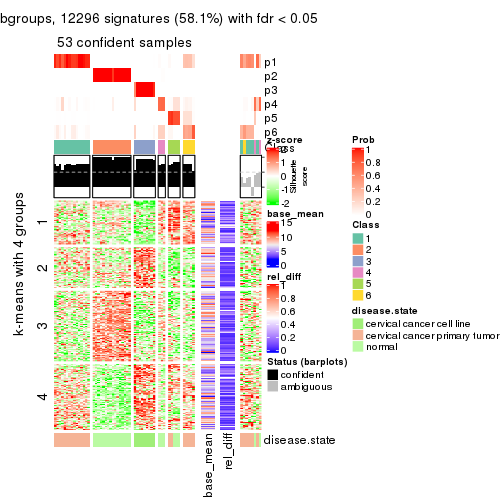</p>

</div>
</div>


Signature heatmaps where rows are not scaled:


<script>
$( function() {
	$( '#tabs-ATC-mclust-get-signatures-no-scale' ).tabs();
} );
</script>
<div id='tabs-ATC-mclust-get-signatures-no-scale'>
<ul>
<li><a href='#tab-ATC-mclust-get-signatures-no-scale-1'>k = 2</a></li>
<li><a href='#tab-ATC-mclust-get-signatures-no-scale-2'>k = 3</a></li>
<li><a href='#tab-ATC-mclust-get-signatures-no-scale-3'>k = 4</a></li>
<li><a href='#tab-ATC-mclust-get-signatures-no-scale-4'>k = 5</a></li>
<li><a href='#tab-ATC-mclust-get-signatures-no-scale-5'>k = 6</a></li>
</ul>
<div id='tab-ATC-mclust-get-signatures-no-scale-1'>
<pre><code class="r">get_signatures(res, k = 2, scale_rows = FALSE)
</code></pre>

<p></p>

</div>
<div id='tab-ATC-mclust-get-signatures-no-scale-2'>
<pre><code class="r">get_signatures(res, k = 3, scale_rows = FALSE)
</code></pre>

<p></p>

</div>
<div id='tab-ATC-mclust-get-signatures-no-scale-3'>
<pre><code class="r">get_signatures(res, k = 4, scale_rows = FALSE)
</code></pre>

<p></p>

</div>
<div id='tab-ATC-mclust-get-signatures-no-scale-4'>
<pre><code class="r">get_signatures(res, k = 5, scale_rows = FALSE)
</code></pre>

<p></p>

</div>
<div id='tab-ATC-mclust-get-signatures-no-scale-5'>
<pre><code class="r">get_signatures(res, k = 6, scale_rows = FALSE)
</code></pre>

<p></p>

</div>
</div>


Compare the overlap of signatures from different k:

```r
compare_signatures(res)
```


`get_signature()` returns a data frame invisibly. TO get the list of signatures, the function
call should be assigned to a variable explicitly. In following code, if `plot` argument is set
to `FALSE`, no heatmap is plotted while only the differential analysis is performed.

```r
# code only for demonstration
tb = get_signature(res, k = ..., plot = FALSE)
```

An example of the output of `tb` is:

```
#>   which_row         fdr    mean_1    mean_2 scaled_mean_1 scaled_mean_2 km
#> 1        38 0.042760348  8.373488  9.131774    -0.5533452     0.5164555  1
#> 2        40 0.018707592  7.106213  8.469186    -0.6173731     0.5762149  1
#> 3        55 0.019134737 10.221463 11.207825    -0.6159697     0.5749050  1
#> 4        59 0.006059896  5.921854  7.869574    -0.6899429     0.6439467  1
#> 5        60 0.018055526  8.928898 10.211722    -0.6204761     0.5791110  1
#> 6        98 0.009384629 15.714769 14.887706     0.6635654    -0.6193277  2
...
```

The columns in `tb` are:

1. `which_row`: row indices corresponding to the input matrix.
2. `fdr`: FDR for the differential test. 
3. `mean_x`: The mean value in group x.
4. `scaled_mean_x`: The mean value in group x after rows are scaled.
5. `km`: Row groups if k-means clustering is applied to rows.


UMAP plot which shows how samples are separated.


<script>
$( function() {
	$( '#tabs-ATC-mclust-dimension-reduction' ).tabs();
} );
</script>
<div id='tabs-ATC-mclust-dimension-reduction'>
<ul>
<li><a href='#tab-ATC-mclust-dimension-reduction-1'>k = 2</a></li>
<li><a href='#tab-ATC-mclust-dimension-reduction-2'>k = 3</a></li>
<li><a href='#tab-ATC-mclust-dimension-reduction-3'>k = 4</a></li>
<li><a href='#tab-ATC-mclust-dimension-reduction-4'>k = 5</a></li>
<li><a href='#tab-ATC-mclust-dimension-reduction-5'>k = 6</a></li>
</ul>
<div id='tab-ATC-mclust-dimension-reduction-1'>
<pre><code class="r">dimension_reduction(res, k = 2, method = &quot;UMAP&quot;)
</code></pre>

<p>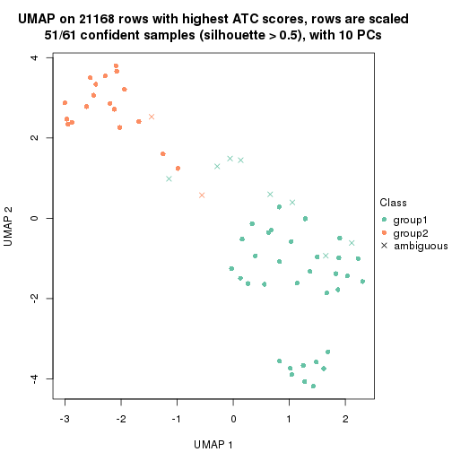</p>

</div>
<div id='tab-ATC-mclust-dimension-reduction-2'>
<pre><code class="r">dimension_reduction(res, k = 3, method = &quot;UMAP&quot;)
</code></pre>

<p></p>

</div>
<div id='tab-ATC-mclust-dimension-reduction-3'>
<pre><code class="r">dimension_reduction(res, k = 4, method = &quot;UMAP&quot;)
</code></pre>

<p></p>

</div>
<div id='tab-ATC-mclust-dimension-reduction-4'>
<pre><code class="r">dimension_reduction(res, k = 5, method = &quot;UMAP&quot;)
</code></pre>

<p>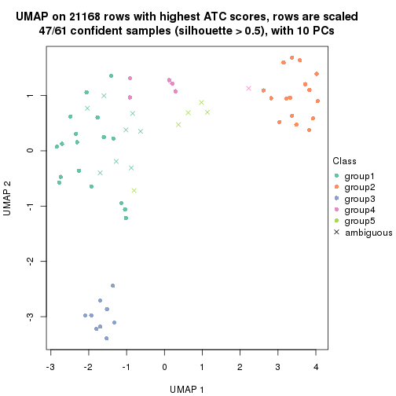</p>

</div>
<div id='tab-ATC-mclust-dimension-reduction-5'>
<pre><code class="r">dimension_reduction(res, k = 6, method = &quot;UMAP&quot;)
</code></pre>

<p></p>

</div>
</div>


Following heatmap shows how subgroups are split when increasing `k`:

```r
collect_classes(res)
```


Test correlation between subgroups and known annotations. If the known
annotation is numeric, one-way ANOVA test is applied, and if the known
annotation is discrete, chi-squared contingency table test is applied.

```r
test_to_known_factors(res)
```

```
#>             n disease.state(p) k
#> ATC:mclust 51         8.42e-12 2
#> ATC:mclust 57         2.32e-15 3
#> ATC:mclust 54         9.16e-20 4
#> ATC:mclust 47         7.65e-17 5
#> ATC:mclust 53         4.93e-17 6
```


If matrix rows can be associated to genes, consider to use `GO_Enrichment(res,
...)` to perform function enrichment for the signature genes.


 

---------------------------------------------------


### ATC:NMF**


The object with results only for a single top-value method and a single partition method 
can be extracted as:

```r
res = res_list["ATC", "NMF"]
# you can also extract it by
# res = res_list["ATC:NMF"]
```

A summary of `res` and all the functions that can be applied to it:

```r
res
```

```
#> A 'ConsensusPartition' object with k = 2, 3, 4, 5, 6.
#>   On a matrix with 21168 rows and 61 columns.
#>   Top rows (1000, 2000, 3000, 4000, 5000) are extracted by 'ATC' method.
#>   Subgroups are detected by 'NMF' method.
#>   Performed in total 1250 partitions by row resampling.
#>   Best k for subgroups seems to be 2.
#> 
#> Following methods can be applied to this 'ConsensusPartition' object:
#>  [1] "cola_report"             "collect_classes"         "collect_plots"          
#>  [4] "collect_stats"           "colnames"                "compare_signatures"     
#>  [7] "consensus_heatmap"       "dimension_reduction"     "functional_enrichment"  
#> [10] "get_anno_col"            "get_anno"                "get_classes"            
#> [13] "get_consensus"           "get_matrix"              "get_membership"         
#> [16] "get_param"               "get_signatures"          "get_stats"              
#> [19] "is_best_k"               "is_stable_k"             "membership_heatmap"     
#> [22] "ncol"                    "nrow"                    "plot_ecdf"              
#> [25] "rownames"                "select_partition_number" "show"                   
#> [28] "suggest_best_k"          "test_to_known_factors"
```

`collect_plots()` function collects all the plots made from `res` for all `k` (number of partitions)
into one single page to provide an easy and fast comparison between different `k`.

```r
collect_plots(res)
```


The plots are:

- The first row: a plot of the ECDF (Empirical cumulative distribution
  function) curves of the consensus matrix for each `k` and the heatmap of
  predicted classes for each `k`.
- The second row: heatmaps of the consensus matrix for each `k`.
- The third row: heatmaps of the membership matrix for each `k`.
- The fouth row: heatmaps of the signatures for each `k`.

All the plots in panels can be made by individual functions and they are
plotted later in this section.

`select_partition_number()` produces several plots showing different
statistics for choosing "optimized" `k`. There are following statistics:

- ECDF curves of the consensus matrix for each `k`;
- 1-PAC. [The PAC
  score](https://en.wikipedia.org/wiki/Consensus_clustering#Over-interpretation_potential_of_consensus_clustering)
  measures the proportion of the ambiguous subgrouping.
- Mean silhouette score.
- Concordance. The mean probability of fiting the consensus class ids in all
  partitions.
- Area increased. Denote $A_k$ as the area under the ECDF curve for current
  `k`, the area increased is defined as $A_k - A_{k-1}$.
- Rand index. The percent of pairs of samples that are both in a same cluster
  or both are not in a same cluster in the partition of k and k-1.
- Jaccard index. The ratio of pairs of samples are both in a same cluster in
  the partition of k and k-1 and the pairs of samples are both in a same
  cluster in the partition k or k-1.

The detailed explanations of these statistics can be found in [the cola
vignette](http://bioconductor.org/packages/devel/bioc/vignettes/cola/inst/doc/cola.html#toc_13).

Generally speaking, lower PAC score, higher mean silhouette score or higher
concordance corresponds to better partition. Rand index and Jaccard index
measure how similar the current partition is compared to partition with `k-1`.
If they are too similar, we won't accept `k` is better than `k-1`.

```r
select_partition_number(res)
```


The numeric values for all these statistics can be obtained by `get_stats()`.

```r
get_stats(res)
```

```
#>   k 1-PAC mean_silhouette concordance area_increased  Rand Jaccard
#> 2 2 1.000           0.961       0.986         0.4914 0.508   0.508
#> 3 3 0.869           0.865       0.947         0.3342 0.751   0.549
#> 4 4 0.675           0.653       0.825         0.1239 0.797   0.489
#> 5 5 0.763           0.701       0.858         0.0554 0.954   0.820
#> 6 6 0.745           0.583       0.799         0.0306 0.975   0.889
```

`suggest_best_k()` suggests the best $k$ based on these statistics. The rules are as follows:

- All $k$ with Jaccard index larger than 0.95 are removed because the increase of
  the partition number does not provides enough extra information. If all $k$ are removed,
  the best $k$ is assigned by `NA`.
- For $k$ with 1-PAC larger than 0.9, the maximal $k$ is taken as the "best k". Other $k$ is called "optional k".
- If it does not fit the second rule. The $k$ with the highest vote of highest
  1-PAC, mean silhouette and concordance is taken as the "best k".

```r
suggest_best_k(res)
```

```
#> [1] 2
```


Following shows the table of the partitions (You need to click the **show/hide
code output** link to see it). The membership matrix (columns with name `p*`)
is inferred by
[`clue::cl_consensus()`](https://www.rdocumentation.org/link/cl_consensus?package=clue)
function with the `SE` method. Basically the value in the membership matrix
represents the probability to belong to a certain group. The finall class
label for an item is determined with the group with highest probability it
belongs to.

In `get_classes()` function, the entropy is calculated from the membership
matrix and the silhouette score is calculated from the consensus matrix.


<script>
$( function() {
	$( '#tabs-ATC-NMF-get-classes' ).tabs();
} );
</script>
<div id='tabs-ATC-NMF-get-classes'>
<ul>
<li><a href='#tab-ATC-NMF-get-classes-1'>k = 2</a></li>
<li><a href='#tab-ATC-NMF-get-classes-2'>k = 3</a></li>
<li><a href='#tab-ATC-NMF-get-classes-3'>k = 4</a></li>
<li><a href='#tab-ATC-NMF-get-classes-4'>k = 5</a></li>
<li><a href='#tab-ATC-NMF-get-classes-5'>k = 6</a></li>
</ul>

<div id='tab-ATC-NMF-get-classes-1'>
<p><a id='tab-ATC-NMF-get-classes-1-a' style='color:#0366d6' href='#'>show/hide code output</a></p>
<pre><code class="r">cbind(get_classes(res, k = 2), get_membership(res, k = 2))
</code></pre>

<pre><code>#&gt;           class entropy silhouette    p1    p2
#&gt; GSM246087     1  0.0000      0.989 1.000 0.000
#&gt; GSM246088     1  0.0000      0.989 1.000 0.000
#&gt; GSM246089     1  0.0000      0.989 1.000 0.000
#&gt; GSM246090     1  0.0000      0.989 1.000 0.000
#&gt; GSM246119     1  0.0000      0.989 1.000 0.000
#&gt; GSM246120     1  0.0000      0.989 1.000 0.000
#&gt; GSM246121     1  0.0000      0.989 1.000 0.000
#&gt; GSM246122     1  0.0000      0.989 1.000 0.000
#&gt; GSM246123     1  0.0000      0.989 1.000 0.000
#&gt; GSM246422     2  0.0000      0.980 0.000 1.000
#&gt; GSM246423     2  0.0672      0.973 0.008 0.992
#&gt; GSM246484     2  0.0000      0.980 0.000 1.000
#&gt; GSM246485     2  0.0000      0.980 0.000 1.000
#&gt; GSM246486     2  0.0000      0.980 0.000 1.000
#&gt; GSM246487     2  0.0000      0.980 0.000 1.000
#&gt; GSM246488     2  0.0000      0.980 0.000 1.000
#&gt; GSM246489     2  0.0000      0.980 0.000 1.000
#&gt; GSM246490     2  0.0000      0.980 0.000 1.000
#&gt; GSM246491     2  0.0000      0.980 0.000 1.000
#&gt; GSM247162     2  0.0000      0.980 0.000 1.000
#&gt; GSM247163     2  0.0000      0.980 0.000 1.000
#&gt; GSM247164     2  0.0000      0.980 0.000 1.000
#&gt; GSM247165     2  0.0000      0.980 0.000 1.000
#&gt; GSM247166     2  0.0000      0.980 0.000 1.000
#&gt; GSM247168     2  0.0000      0.980 0.000 1.000
#&gt; GSM247169     2  0.0000      0.980 0.000 1.000
#&gt; GSM247171     2  0.0000      0.980 0.000 1.000
#&gt; GSM247173     2  0.0000      0.980 0.000 1.000
#&gt; GSM247174     2  0.0000      0.980 0.000 1.000
#&gt; GSM247175     2  0.0000      0.980 0.000 1.000
#&gt; GSM247188     2  0.0000      0.980 0.000 1.000
#&gt; GSM247189     2  0.0000      0.980 0.000 1.000
#&gt; GSM247190     2  0.0000      0.980 0.000 1.000
#&gt; GSM247650     1  0.0000      0.989 1.000 0.000
#&gt; GSM247651     1  0.0000      0.989 1.000 0.000
#&gt; GSM247652     1  0.0000      0.989 1.000 0.000
#&gt; GSM247653     1  0.0000      0.989 1.000 0.000
#&gt; GSM247654     1  0.0000      0.989 1.000 0.000
#&gt; GSM247655     1  0.0000      0.989 1.000 0.000
#&gt; GSM247656     1  0.0000      0.989 1.000 0.000
#&gt; GSM247657     1  0.0000      0.989 1.000 0.000
#&gt; GSM247658     1  0.0000      0.989 1.000 0.000
#&gt; GSM247659     1  0.0000      0.989 1.000 0.000
#&gt; GSM247660     1  0.0000      0.989 1.000 0.000
#&gt; GSM247661     1  0.0000      0.989 1.000 0.000
#&gt; GSM247662     1  0.0000      0.989 1.000 0.000
#&gt; GSM247663     1  0.0000      0.989 1.000 0.000
#&gt; GSM247856     1  0.0000      0.989 1.000 0.000
#&gt; GSM247857     1  0.0000      0.989 1.000 0.000
#&gt; GSM247859     1  0.0000      0.989 1.000 0.000
#&gt; GSM247860     1  0.0000      0.989 1.000 0.000
#&gt; GSM247862     1  0.0000      0.989 1.000 0.000
#&gt; GSM247864     1  0.0000      0.989 1.000 0.000
#&gt; GSM247865     1  0.9635      0.342 0.612 0.388
#&gt; GSM247866     1  0.0000      0.989 1.000 0.000
#&gt; GSM247876     1  0.0000      0.989 1.000 0.000
#&gt; GSM247877     1  0.0000      0.989 1.000 0.000
#&gt; GSM247878     1  0.0000      0.989 1.000 0.000
#&gt; GSM247879     1  0.0000      0.989 1.000 0.000
#&gt; GSM247881     1  0.0000      0.989 1.000 0.000
#&gt; GSM247883     2  0.9922      0.168 0.448 0.552
</code></pre>

<script>
$('#tab-ATC-NMF-get-classes-1-a').parent().next().next().hide();
$('#tab-ATC-NMF-get-classes-1-a').click(function(){
  $('#tab-ATC-NMF-get-classes-1-a').parent().next().next().toggle();
  return(false);
});
</script>
</div>

<div id='tab-ATC-NMF-get-classes-2'>
<p><a id='tab-ATC-NMF-get-classes-2-a' style='color:#0366d6' href='#'>show/hide code output</a></p>
<pre><code class="r">cbind(get_classes(res, k = 3), get_membership(res, k = 3))
</code></pre>

<pre><code>#&gt;           class entropy silhouette    p1    p2    p3
#&gt; GSM246087     3  0.0000     0.9244 0.000 0.000 1.000
#&gt; GSM246088     3  0.0000     0.9244 0.000 0.000 1.000
#&gt; GSM246089     3  0.0000     0.9244 0.000 0.000 1.000
#&gt; GSM246090     3  0.0000     0.9244 0.000 0.000 1.000
#&gt; GSM246119     3  0.0000     0.9244 0.000 0.000 1.000
#&gt; GSM246120     3  0.0000     0.9244 0.000 0.000 1.000
#&gt; GSM246121     3  0.0000     0.9244 0.000 0.000 1.000
#&gt; GSM246122     3  0.0000     0.9244 0.000 0.000 1.000
#&gt; GSM246123     3  0.0000     0.9244 0.000 0.000 1.000
#&gt; GSM246422     1  0.0000     0.9238 1.000 0.000 0.000
#&gt; GSM246423     1  0.0000     0.9238 1.000 0.000 0.000
#&gt; GSM246484     1  0.0000     0.9238 1.000 0.000 0.000
#&gt; GSM246485     1  0.0000     0.9238 1.000 0.000 0.000
#&gt; GSM246486     2  0.0747     0.9587 0.016 0.984 0.000
#&gt; GSM246487     2  0.6095     0.2811 0.392 0.608 0.000
#&gt; GSM246488     1  0.5968     0.4158 0.636 0.364 0.000
#&gt; GSM246489     2  0.0000     0.9736 0.000 1.000 0.000
#&gt; GSM246490     2  0.0000     0.9736 0.000 1.000 0.000
#&gt; GSM246491     2  0.0000     0.9736 0.000 1.000 0.000
#&gt; GSM247162     2  0.0000     0.9736 0.000 1.000 0.000
#&gt; GSM247163     2  0.0000     0.9736 0.000 1.000 0.000
#&gt; GSM247164     2  0.0000     0.9736 0.000 1.000 0.000
#&gt; GSM247165     2  0.0000     0.9736 0.000 1.000 0.000
#&gt; GSM247166     2  0.0000     0.9736 0.000 1.000 0.000
#&gt; GSM247168     2  0.0000     0.9736 0.000 1.000 0.000
#&gt; GSM247169     2  0.0000     0.9736 0.000 1.000 0.000
#&gt; GSM247171     2  0.0000     0.9736 0.000 1.000 0.000
#&gt; GSM247173     2  0.0000     0.9736 0.000 1.000 0.000
#&gt; GSM247174     2  0.0000     0.9736 0.000 1.000 0.000
#&gt; GSM247175     2  0.0000     0.9736 0.000 1.000 0.000
#&gt; GSM247188     2  0.0000     0.9736 0.000 1.000 0.000
#&gt; GSM247189     1  0.0424     0.9182 0.992 0.008 0.000
#&gt; GSM247190     2  0.0000     0.9736 0.000 1.000 0.000
#&gt; GSM247650     3  0.0237     0.9222 0.004 0.000 0.996
#&gt; GSM247651     1  0.0000     0.9238 1.000 0.000 0.000
#&gt; GSM247652     3  0.0000     0.9244 0.000 0.000 1.000
#&gt; GSM247653     3  0.0424     0.9198 0.008 0.000 0.992
#&gt; GSM247654     3  0.0000     0.9244 0.000 0.000 1.000
#&gt; GSM247655     1  0.0000     0.9238 1.000 0.000 0.000
#&gt; GSM247656     3  0.0000     0.9244 0.000 0.000 1.000
#&gt; GSM247657     3  0.0000     0.9244 0.000 0.000 1.000
#&gt; GSM247658     3  0.4702     0.7136 0.212 0.000 0.788
#&gt; GSM247659     3  0.0000     0.9244 0.000 0.000 1.000
#&gt; GSM247660     1  0.0000     0.9238 1.000 0.000 0.000
#&gt; GSM247661     3  0.0000     0.9244 0.000 0.000 1.000
#&gt; GSM247662     3  0.0000     0.9244 0.000 0.000 1.000
#&gt; GSM247663     3  0.6274     0.1795 0.456 0.000 0.544
#&gt; GSM247856     3  0.0000     0.9244 0.000 0.000 1.000
#&gt; GSM247857     3  0.0000     0.9244 0.000 0.000 1.000
#&gt; GSM247859     3  0.5431     0.6039 0.284 0.000 0.716
#&gt; GSM247860     3  0.5591     0.5676 0.304 0.000 0.696
#&gt; GSM247862     1  0.4887     0.6680 0.772 0.000 0.228
#&gt; GSM247864     1  0.0237     0.9219 0.996 0.000 0.004
#&gt; GSM247865     1  0.7529     0.4529 0.624 0.060 0.316
#&gt; GSM247866     1  0.0237     0.9219 0.996 0.000 0.004
#&gt; GSM247876     3  0.1031     0.9086 0.024 0.000 0.976
#&gt; GSM247877     1  0.0000     0.9238 1.000 0.000 0.000
#&gt; GSM247878     1  0.0000     0.9238 1.000 0.000 0.000
#&gt; GSM247879     3  0.2537     0.8620 0.080 0.000 0.920
#&gt; GSM247881     3  0.0000     0.9244 0.000 0.000 1.000
#&gt; GSM247883     3  0.6952     0.0931 0.016 0.480 0.504
</code></pre>

<script>
$('#tab-ATC-NMF-get-classes-2-a').parent().next().next().hide();
$('#tab-ATC-NMF-get-classes-2-a').click(function(){
  $('#tab-ATC-NMF-get-classes-2-a').parent().next().next().toggle();
  return(false);
});
</script>
</div>

<div id='tab-ATC-NMF-get-classes-3'>
<p><a id='tab-ATC-NMF-get-classes-3-a' style='color:#0366d6' href='#'>show/hide code output</a></p>
<pre><code class="r">cbind(get_classes(res, k = 4), get_membership(res, k = 4))
</code></pre>

<pre><code>#&gt;           class entropy silhouette    p1    p2    p3    p4
#&gt; GSM246087     3  0.0188     0.7711 0.004 0.000 0.996 0.000
#&gt; GSM246088     3  0.0188     0.7711 0.004 0.000 0.996 0.000
#&gt; GSM246089     3  0.3831     0.6097 0.204 0.000 0.792 0.004
#&gt; GSM246090     3  0.0188     0.7711 0.004 0.000 0.996 0.000
#&gt; GSM246119     3  0.0707     0.7653 0.020 0.000 0.980 0.000
#&gt; GSM246120     3  0.0336     0.7695 0.008 0.000 0.992 0.000
#&gt; GSM246121     3  0.1637     0.7456 0.060 0.000 0.940 0.000
#&gt; GSM246122     3  0.0336     0.7704 0.008 0.000 0.992 0.000
#&gt; GSM246123     3  0.0188     0.7702 0.004 0.000 0.996 0.000
#&gt; GSM246422     4  0.0000     0.7754 0.000 0.000 0.000 1.000
#&gt; GSM246423     4  0.0188     0.7752 0.004 0.000 0.000 0.996
#&gt; GSM246484     4  0.0000     0.7754 0.000 0.000 0.000 1.000
#&gt; GSM246485     4  0.1637     0.7599 0.060 0.000 0.000 0.940
#&gt; GSM246486     2  0.1406     0.9231 0.016 0.960 0.000 0.024
#&gt; GSM246487     1  0.7641     0.2383 0.500 0.264 0.004 0.232
#&gt; GSM246488     4  0.5592     0.2777 0.024 0.404 0.000 0.572
#&gt; GSM246489     2  0.0188     0.9552 0.004 0.996 0.000 0.000
#&gt; GSM246490     2  0.0000     0.9577 0.000 1.000 0.000 0.000
#&gt; GSM246491     2  0.0000     0.9577 0.000 1.000 0.000 0.000
#&gt; GSM247162     2  0.0000     0.9577 0.000 1.000 0.000 0.000
#&gt; GSM247163     2  0.0000     0.9577 0.000 1.000 0.000 0.000
#&gt; GSM247164     2  0.0000     0.9577 0.000 1.000 0.000 0.000
#&gt; GSM247165     2  0.0000     0.9577 0.000 1.000 0.000 0.000
#&gt; GSM247166     2  0.0000     0.9577 0.000 1.000 0.000 0.000
#&gt; GSM247168     2  0.0000     0.9577 0.000 1.000 0.000 0.000
#&gt; GSM247169     2  0.0000     0.9577 0.000 1.000 0.000 0.000
#&gt; GSM247171     2  0.0000     0.9577 0.000 1.000 0.000 0.000
#&gt; GSM247173     2  0.0188     0.9553 0.004 0.996 0.000 0.000
#&gt; GSM247174     2  0.0000     0.9577 0.000 1.000 0.000 0.000
#&gt; GSM247175     2  0.0000     0.9577 0.000 1.000 0.000 0.000
#&gt; GSM247188     2  0.0000     0.9577 0.000 1.000 0.000 0.000
#&gt; GSM247189     4  0.1576     0.7552 0.004 0.048 0.000 0.948
#&gt; GSM247190     2  0.0188     0.9553 0.004 0.996 0.000 0.000
#&gt; GSM247650     3  0.3908     0.6089 0.212 0.000 0.784 0.004
#&gt; GSM247651     4  0.4049     0.5753 0.212 0.000 0.008 0.780
#&gt; GSM247652     1  0.4967     0.2916 0.548 0.000 0.452 0.000
#&gt; GSM247653     1  0.2868     0.6321 0.864 0.000 0.136 0.000
#&gt; GSM247654     1  0.4222     0.6063 0.728 0.000 0.272 0.000
#&gt; GSM247655     1  0.5203     0.3021 0.576 0.000 0.008 0.416
#&gt; GSM247656     3  0.3907     0.5793 0.232 0.000 0.768 0.000
#&gt; GSM247657     1  0.4250     0.6029 0.724 0.000 0.276 0.000
#&gt; GSM247658     1  0.5174     0.6742 0.756 0.000 0.152 0.092
#&gt; GSM247659     3  0.4877     0.1369 0.408 0.000 0.592 0.000
#&gt; GSM247660     1  0.4925     0.2144 0.572 0.000 0.000 0.428
#&gt; GSM247661     1  0.3219     0.6077 0.836 0.000 0.164 0.000
#&gt; GSM247662     3  0.4972    -0.0611 0.456 0.000 0.544 0.000
#&gt; GSM247663     4  0.7646     0.0581 0.244 0.000 0.292 0.464
#&gt; GSM247856     3  0.2704     0.7075 0.124 0.000 0.876 0.000
#&gt; GSM247857     1  0.4866     0.3977 0.596 0.000 0.404 0.000
#&gt; GSM247859     1  0.5747     0.6582 0.704 0.000 0.196 0.100
#&gt; GSM247860     1  0.2859     0.6185 0.880 0.000 0.112 0.008
#&gt; GSM247862     1  0.4776     0.6434 0.776 0.000 0.060 0.164
#&gt; GSM247864     4  0.5403     0.3028 0.348 0.000 0.024 0.628
#&gt; GSM247865     1  0.5934     0.6120 0.704 0.012 0.076 0.208
#&gt; GSM247866     1  0.4482     0.3502 0.728 0.000 0.008 0.264
#&gt; GSM247876     3  0.6147     0.4875 0.224 0.000 0.664 0.112
#&gt; GSM247877     4  0.3257     0.6926 0.152 0.000 0.004 0.844
#&gt; GSM247878     4  0.0592     0.7736 0.016 0.000 0.000 0.984
#&gt; GSM247879     3  0.6795     0.1749 0.432 0.000 0.472 0.096
#&gt; GSM247881     1  0.4761     0.4721 0.628 0.000 0.372 0.000
#&gt; GSM247883     2  0.7517    -0.2559 0.388 0.428 0.184 0.000
</code></pre>

<script>
$('#tab-ATC-NMF-get-classes-3-a').parent().next().next().hide();
$('#tab-ATC-NMF-get-classes-3-a').click(function(){
  $('#tab-ATC-NMF-get-classes-3-a').parent().next().next().toggle();
  return(false);
});
</script>
</div>

<div id='tab-ATC-NMF-get-classes-4'>
<p><a id='tab-ATC-NMF-get-classes-4-a' style='color:#0366d6' href='#'>show/hide code output</a></p>
<pre><code class="r">cbind(get_classes(res, k = 5), get_membership(res, k = 5))
</code></pre>

<pre><code>#&gt;           class entropy silhouette    p1    p2    p3    p4    p5
#&gt; GSM246087     3  0.0671     0.8279 0.016 0.000 0.980 0.000 0.004
#&gt; GSM246088     3  0.0566     0.8270 0.012 0.000 0.984 0.000 0.004
#&gt; GSM246089     5  0.4015     0.3990 0.000 0.000 0.348 0.000 0.652
#&gt; GSM246090     3  0.0671     0.8275 0.016 0.000 0.980 0.000 0.004
#&gt; GSM246119     3  0.1670     0.7945 0.012 0.000 0.936 0.000 0.052
#&gt; GSM246120     3  0.0865     0.8139 0.004 0.000 0.972 0.000 0.024
#&gt; GSM246121     3  0.2723     0.7211 0.012 0.000 0.864 0.000 0.124
#&gt; GSM246122     3  0.0898     0.8280 0.020 0.000 0.972 0.000 0.008
#&gt; GSM246123     3  0.0671     0.8186 0.004 0.000 0.980 0.000 0.016
#&gt; GSM246422     4  0.0000     0.7549 0.000 0.000 0.000 1.000 0.000
#&gt; GSM246423     4  0.0609     0.7531 0.000 0.000 0.000 0.980 0.020
#&gt; GSM246484     4  0.0290     0.7541 0.000 0.000 0.000 0.992 0.008
#&gt; GSM246485     4  0.1670     0.7423 0.012 0.000 0.000 0.936 0.052
#&gt; GSM246486     2  0.1082     0.9297 0.000 0.964 0.000 0.028 0.008
#&gt; GSM246487     1  0.6646     0.4096 0.608 0.216 0.004 0.112 0.060
#&gt; GSM246488     4  0.3978     0.6210 0.004 0.148 0.000 0.796 0.052
#&gt; GSM246489     2  0.0000     0.9620 0.000 1.000 0.000 0.000 0.000
#&gt; GSM246490     2  0.0000     0.9620 0.000 1.000 0.000 0.000 0.000
#&gt; GSM246491     2  0.0000     0.9620 0.000 1.000 0.000 0.000 0.000
#&gt; GSM247162     2  0.0000     0.9620 0.000 1.000 0.000 0.000 0.000
#&gt; GSM247163     2  0.0000     0.9620 0.000 1.000 0.000 0.000 0.000
#&gt; GSM247164     2  0.0000     0.9620 0.000 1.000 0.000 0.000 0.000
#&gt; GSM247165     2  0.0000     0.9620 0.000 1.000 0.000 0.000 0.000
#&gt; GSM247166     2  0.0000     0.9620 0.000 1.000 0.000 0.000 0.000
#&gt; GSM247168     2  0.0000     0.9620 0.000 1.000 0.000 0.000 0.000
#&gt; GSM247169     2  0.0000     0.9620 0.000 1.000 0.000 0.000 0.000
#&gt; GSM247171     2  0.0000     0.9620 0.000 1.000 0.000 0.000 0.000
#&gt; GSM247173     2  0.0162     0.9593 0.000 0.996 0.000 0.000 0.004
#&gt; GSM247174     2  0.0000     0.9620 0.000 1.000 0.000 0.000 0.000
#&gt; GSM247175     2  0.0000     0.9620 0.000 1.000 0.000 0.000 0.000
#&gt; GSM247188     2  0.0000     0.9620 0.000 1.000 0.000 0.000 0.000
#&gt; GSM247189     4  0.2142     0.7365 0.004 0.028 0.000 0.920 0.048
#&gt; GSM247190     2  0.0290     0.9563 0.000 0.992 0.000 0.000 0.008
#&gt; GSM247650     3  0.2930     0.7650 0.164 0.000 0.832 0.000 0.004
#&gt; GSM247651     4  0.5002     0.2885 0.364 0.000 0.000 0.596 0.040
#&gt; GSM247652     1  0.3861     0.5627 0.728 0.000 0.264 0.000 0.008
#&gt; GSM247653     1  0.3741     0.4869 0.732 0.000 0.004 0.000 0.264
#&gt; GSM247654     1  0.1740     0.7224 0.932 0.000 0.056 0.000 0.012
#&gt; GSM247655     1  0.2522     0.6965 0.880 0.000 0.000 0.108 0.012
#&gt; GSM247656     3  0.2583     0.7880 0.132 0.000 0.864 0.000 0.004
#&gt; GSM247657     1  0.1638     0.7218 0.932 0.000 0.064 0.000 0.004
#&gt; GSM247658     1  0.2144     0.7001 0.912 0.000 0.020 0.000 0.068
#&gt; GSM247659     3  0.4238     0.4850 0.368 0.000 0.628 0.000 0.004
#&gt; GSM247660     1  0.3412     0.6457 0.820 0.000 0.000 0.152 0.028
#&gt; GSM247661     1  0.4663     0.2203 0.604 0.000 0.020 0.000 0.376
#&gt; GSM247662     3  0.5013     0.4714 0.352 0.000 0.612 0.008 0.028
#&gt; GSM247663     4  0.7951     0.0331 0.292 0.000 0.260 0.368 0.080
#&gt; GSM247856     3  0.2249     0.8098 0.096 0.000 0.896 0.000 0.008
#&gt; GSM247857     1  0.4043     0.6088 0.756 0.000 0.220 0.012 0.012
#&gt; GSM247859     1  0.1990     0.7204 0.920 0.000 0.068 0.008 0.004
#&gt; GSM247860     5  0.4356     0.4909 0.340 0.000 0.012 0.000 0.648
#&gt; GSM247862     1  0.2629     0.6729 0.880 0.000 0.004 0.012 0.104
#&gt; GSM247864     1  0.5377     0.0370 0.496 0.000 0.004 0.456 0.044
#&gt; GSM247865     1  0.4432     0.6769 0.820 0.040 0.028 0.064 0.048
#&gt; GSM247866     5  0.4244     0.5837 0.268 0.000 0.004 0.016 0.712
#&gt; GSM247876     3  0.6451     0.4551 0.212 0.000 0.612 0.048 0.128
#&gt; GSM247877     4  0.4291     0.2029 0.000 0.000 0.000 0.536 0.464
#&gt; GSM247878     4  0.1571     0.7414 0.004 0.000 0.000 0.936 0.060
#&gt; GSM247879     5  0.3361     0.5935 0.020 0.000 0.092 0.032 0.856
#&gt; GSM247881     1  0.2674     0.6877 0.856 0.000 0.140 0.000 0.004
#&gt; GSM247883     2  0.6447    -0.0629 0.420 0.472 0.080 0.008 0.020
</code></pre>

<script>
$('#tab-ATC-NMF-get-classes-4-a').parent().next().next().hide();
$('#tab-ATC-NMF-get-classes-4-a').click(function(){
  $('#tab-ATC-NMF-get-classes-4-a').parent().next().next().toggle();
  return(false);
});
</script>
</div>

<div id='tab-ATC-NMF-get-classes-5'>
<p><a id='tab-ATC-NMF-get-classes-5-a' style='color:#0366d6' href='#'>show/hide code output</a></p>
<pre><code class="r">cbind(get_classes(res, k = 6), get_membership(res, k = 6))
</code></pre>

<pre><code>#&gt;           class entropy silhouette    p1    p2    p3    p4    p5    p6
#&gt; GSM246087     3  0.1152     0.7233 0.004 0.000 0.952 0.000 0.044 0.000
#&gt; GSM246088     3  0.0000     0.7323 0.000 0.000 1.000 0.000 0.000 0.000
#&gt; GSM246089     6  0.4084     0.0928 0.000 0.000 0.400 0.000 0.012 0.588
#&gt; GSM246090     3  0.0260     0.7330 0.000 0.000 0.992 0.000 0.008 0.000
#&gt; GSM246119     3  0.0972     0.7145 0.000 0.000 0.964 0.000 0.008 0.028
#&gt; GSM246120     3  0.0260     0.7295 0.000 0.000 0.992 0.000 0.000 0.008
#&gt; GSM246121     3  0.3351     0.5886 0.004 0.000 0.808 0.000 0.036 0.152
#&gt; GSM246122     3  0.0692     0.7325 0.004 0.000 0.976 0.000 0.020 0.000
#&gt; GSM246123     3  0.0858     0.7306 0.000 0.000 0.968 0.000 0.028 0.004
#&gt; GSM246422     4  0.0000     0.7693 0.000 0.000 0.000 1.000 0.000 0.000
#&gt; GSM246423     4  0.0146     0.7687 0.000 0.000 0.000 0.996 0.004 0.000
#&gt; GSM246484     4  0.0146     0.7695 0.000 0.000 0.000 0.996 0.000 0.004
#&gt; GSM246485     4  0.6525     0.4493 0.104 0.036 0.000 0.556 0.260 0.044
#&gt; GSM246486     2  0.1196     0.9195 0.000 0.952 0.000 0.040 0.008 0.000
#&gt; GSM246487     1  0.7322     0.1080 0.464 0.196 0.000 0.124 0.204 0.012
#&gt; GSM246488     4  0.2804     0.6752 0.000 0.120 0.000 0.852 0.024 0.004
#&gt; GSM246489     2  0.0260     0.9536 0.000 0.992 0.000 0.000 0.008 0.000
#&gt; GSM246490     2  0.0000     0.9547 0.000 1.000 0.000 0.000 0.000 0.000
#&gt; GSM246491     2  0.0260     0.9530 0.000 0.992 0.000 0.000 0.000 0.008
#&gt; GSM247162     2  0.0260     0.9530 0.000 0.992 0.000 0.000 0.000 0.008
#&gt; GSM247163     2  0.0146     0.9539 0.000 0.996 0.000 0.000 0.004 0.000
#&gt; GSM247164     2  0.0000     0.9547 0.000 1.000 0.000 0.000 0.000 0.000
#&gt; GSM247165     2  0.0458     0.9512 0.000 0.984 0.000 0.000 0.016 0.000
#&gt; GSM247166     2  0.0547     0.9493 0.000 0.980 0.000 0.000 0.020 0.000
#&gt; GSM247168     2  0.0547     0.9493 0.000 0.980 0.000 0.000 0.020 0.000
#&gt; GSM247169     2  0.0458     0.9512 0.000 0.984 0.000 0.000 0.016 0.000
#&gt; GSM247171     2  0.0405     0.9509 0.000 0.988 0.000 0.000 0.004 0.008
#&gt; GSM247173     2  0.0000     0.9547 0.000 1.000 0.000 0.000 0.000 0.000
#&gt; GSM247174     2  0.0146     0.9544 0.000 0.996 0.000 0.000 0.004 0.000
#&gt; GSM247175     2  0.0000     0.9547 0.000 1.000 0.000 0.000 0.000 0.000
#&gt; GSM247188     2  0.0000     0.9547 0.000 1.000 0.000 0.000 0.000 0.000
#&gt; GSM247189     4  0.2119     0.7529 0.000 0.008 0.000 0.912 0.044 0.036
#&gt; GSM247190     2  0.0146     0.9541 0.000 0.996 0.000 0.000 0.004 0.000
#&gt; GSM247650     3  0.5117     0.3223 0.116 0.000 0.596 0.000 0.288 0.000
#&gt; GSM247651     4  0.5646     0.1993 0.348 0.000 0.000 0.532 0.100 0.020
#&gt; GSM247652     1  0.4369     0.3783 0.720 0.000 0.116 0.000 0.164 0.000
#&gt; GSM247653     1  0.4312    -0.0327 0.604 0.000 0.000 0.000 0.028 0.368
#&gt; GSM247654     1  0.1341     0.6003 0.948 0.000 0.024 0.000 0.028 0.000
#&gt; GSM247655     1  0.3907     0.5211 0.764 0.000 0.000 0.152 0.084 0.000
#&gt; GSM247656     3  0.4327     0.4694 0.056 0.000 0.680 0.000 0.264 0.000
#&gt; GSM247657     1  0.2011     0.6057 0.912 0.000 0.020 0.000 0.064 0.004
#&gt; GSM247658     1  0.1485     0.6033 0.944 0.000 0.004 0.000 0.024 0.028
#&gt; GSM247659     3  0.5817     0.0320 0.208 0.000 0.480 0.000 0.312 0.000
#&gt; GSM247660     1  0.3233     0.5714 0.828 0.000 0.000 0.132 0.024 0.016
#&gt; GSM247661     1  0.4700    -0.3002 0.500 0.000 0.000 0.000 0.044 0.456
#&gt; GSM247662     3  0.6103    -0.0883 0.320 0.000 0.432 0.004 0.244 0.000
#&gt; GSM247663     5  0.8177     0.4749 0.172 0.000 0.272 0.144 0.356 0.056
#&gt; GSM247856     3  0.4176     0.5328 0.200 0.000 0.740 0.000 0.044 0.016
#&gt; GSM247857     1  0.5044     0.2674 0.644 0.000 0.128 0.004 0.224 0.000
#&gt; GSM247859     1  0.3702     0.4852 0.784 0.000 0.044 0.008 0.164 0.000
#&gt; GSM247860     6  0.3937     0.2553 0.424 0.000 0.000 0.000 0.004 0.572
#&gt; GSM247862     1  0.2112     0.5491 0.896 0.000 0.000 0.000 0.016 0.088
#&gt; GSM247864     1  0.4661     0.0561 0.500 0.000 0.000 0.464 0.004 0.032
#&gt; GSM247865     1  0.5531     0.4518 0.660 0.016 0.000 0.064 0.212 0.048
#&gt; GSM247866     6  0.4157     0.4367 0.276 0.000 0.000 0.004 0.032 0.688
#&gt; GSM247876     5  0.6174     0.5306 0.160 0.000 0.224 0.008 0.572 0.036
#&gt; GSM247877     4  0.5303     0.4249 0.000 0.000 0.000 0.548 0.120 0.332
#&gt; GSM247878     4  0.1934     0.7518 0.000 0.000 0.000 0.916 0.044 0.040
#&gt; GSM247879     5  0.7599     0.1864 0.092 0.000 0.112 0.056 0.380 0.360
#&gt; GSM247881     5  0.5428     0.2468 0.396 0.000 0.120 0.000 0.484 0.000
#&gt; GSM247883     2  0.6913    -0.2032 0.272 0.420 0.064 0.000 0.244 0.000
</code></pre>

<script>
$('#tab-ATC-NMF-get-classes-5-a').parent().next().next().hide();
$('#tab-ATC-NMF-get-classes-5-a').click(function(){
  $('#tab-ATC-NMF-get-classes-5-a').parent().next().next().toggle();
  return(false);
});
</script>
</div>
</div>

Heatmaps for the consensus matrix. It visualizes the probability of two
samples to be in a same group.


<script>
$( function() {
	$( '#tabs-ATC-NMF-consensus-heatmap' ).tabs();
} );
</script>
<div id='tabs-ATC-NMF-consensus-heatmap'>
<ul>
<li><a href='#tab-ATC-NMF-consensus-heatmap-1'>k = 2</a></li>
<li><a href='#tab-ATC-NMF-consensus-heatmap-2'>k = 3</a></li>
<li><a href='#tab-ATC-NMF-consensus-heatmap-3'>k = 4</a></li>
<li><a href='#tab-ATC-NMF-consensus-heatmap-4'>k = 5</a></li>
<li><a href='#tab-ATC-NMF-consensus-heatmap-5'>k = 6</a></li>
</ul>
<div id='tab-ATC-NMF-consensus-heatmap-1'>
<pre><code class="r">consensus_heatmap(res, k = 2)
</code></pre>

<p></p>

</div>
<div id='tab-ATC-NMF-consensus-heatmap-2'>
<pre><code class="r">consensus_heatmap(res, k = 3)
</code></pre>

<p></p>

</div>
<div id='tab-ATC-NMF-consensus-heatmap-3'>
<pre><code class="r">consensus_heatmap(res, k = 4)
</code></pre>

<p></p>

</div>
<div id='tab-ATC-NMF-consensus-heatmap-4'>
<pre><code class="r">consensus_heatmap(res, k = 5)
</code></pre>

<p></p>

</div>
<div id='tab-ATC-NMF-consensus-heatmap-5'>
<pre><code class="r">consensus_heatmap(res, k = 6)
</code></pre>

<p></p>

</div>
</div>

Heatmaps for the membership of samples in all partitions to see how consistent they are:


<script>
$( function() {
	$( '#tabs-ATC-NMF-membership-heatmap' ).tabs();
} );
</script>
<div id='tabs-ATC-NMF-membership-heatmap'>
<ul>
<li><a href='#tab-ATC-NMF-membership-heatmap-1'>k = 2</a></li>
<li><a href='#tab-ATC-NMF-membership-heatmap-2'>k = 3</a></li>
<li><a href='#tab-ATC-NMF-membership-heatmap-3'>k = 4</a></li>
<li><a href='#tab-ATC-NMF-membership-heatmap-4'>k = 5</a></li>
<li><a href='#tab-ATC-NMF-membership-heatmap-5'>k = 6</a></li>
</ul>
<div id='tab-ATC-NMF-membership-heatmap-1'>
<pre><code class="r">membership_heatmap(res, k = 2)
</code></pre>

<p></p>

</div>
<div id='tab-ATC-NMF-membership-heatmap-2'>
<pre><code class="r">membership_heatmap(res, k = 3)
</code></pre>

<p></p>

</div>
<div id='tab-ATC-NMF-membership-heatmap-3'>
<pre><code class="r">membership_heatmap(res, k = 4)
</code></pre>

<p></p>

</div>
<div id='tab-ATC-NMF-membership-heatmap-4'>
<pre><code class="r">membership_heatmap(res, k = 5)
</code></pre>

<p></p>

</div>
<div id='tab-ATC-NMF-membership-heatmap-5'>
<pre><code class="r">membership_heatmap(res, k = 6)
</code></pre>

<p></p>

</div>
</div>

As soon as we have had the classes for columns, we can look for signatures
which are significantly different between classes which can be candidate marks
for certain classes. Following are the heatmaps for signatures.


Signature heatmaps where rows are scaled:


<script>
$( function() {
	$( '#tabs-ATC-NMF-get-signatures' ).tabs();
} );
</script>
<div id='tabs-ATC-NMF-get-signatures'>
<ul>
<li><a href='#tab-ATC-NMF-get-signatures-1'>k = 2</a></li>
<li><a href='#tab-ATC-NMF-get-signatures-2'>k = 3</a></li>
<li><a href='#tab-ATC-NMF-get-signatures-3'>k = 4</a></li>
<li><a href='#tab-ATC-NMF-get-signatures-4'>k = 5</a></li>
<li><a href='#tab-ATC-NMF-get-signatures-5'>k = 6</a></li>
</ul>
<div id='tab-ATC-NMF-get-signatures-1'>
<pre><code class="r">get_signatures(res, k = 2)
</code></pre>

<p></p>

</div>
<div id='tab-ATC-NMF-get-signatures-2'>
<pre><code class="r">get_signatures(res, k = 3)
</code></pre>

<p></p>

</div>
<div id='tab-ATC-NMF-get-signatures-3'>
<pre><code class="r">get_signatures(res, k = 4)
</code></pre>

<p></p>

</div>
<div id='tab-ATC-NMF-get-signatures-4'>
<pre><code class="r">get_signatures(res, k = 5)
</code></pre>

<p></p>

</div>
<div id='tab-ATC-NMF-get-signatures-5'>
<pre><code class="r">get_signatures(res, k = 6)
</code></pre>

<p></p>

</div>
</div>


Signature heatmaps where rows are not scaled:


<script>
$( function() {
	$( '#tabs-ATC-NMF-get-signatures-no-scale' ).tabs();
} );
</script>
<div id='tabs-ATC-NMF-get-signatures-no-scale'>
<ul>
<li><a href='#tab-ATC-NMF-get-signatures-no-scale-1'>k = 2</a></li>
<li><a href='#tab-ATC-NMF-get-signatures-no-scale-2'>k = 3</a></li>
<li><a href='#tab-ATC-NMF-get-signatures-no-scale-3'>k = 4</a></li>
<li><a href='#tab-ATC-NMF-get-signatures-no-scale-4'>k = 5</a></li>
<li><a href='#tab-ATC-NMF-get-signatures-no-scale-5'>k = 6</a></li>
</ul>
<div id='tab-ATC-NMF-get-signatures-no-scale-1'>
<pre><code class="r">get_signatures(res, k = 2, scale_rows = FALSE)
</code></pre>

<p></p>

</div>
<div id='tab-ATC-NMF-get-signatures-no-scale-2'>
<pre><code class="r">get_signatures(res, k = 3, scale_rows = FALSE)
</code></pre>

<p></p>

</div>
<div id='tab-ATC-NMF-get-signatures-no-scale-3'>
<pre><code class="r">get_signatures(res, k = 4, scale_rows = FALSE)
</code></pre>

<p></p>

</div>
<div id='tab-ATC-NMF-get-signatures-no-scale-4'>
<pre><code class="r">get_signatures(res, k = 5, scale_rows = FALSE)
</code></pre>

<p></p>

</div>
<div id='tab-ATC-NMF-get-signatures-no-scale-5'>
<pre><code class="r">get_signatures(res, k = 6, scale_rows = FALSE)
</code></pre>

<p></p>

</div>
</div>


Compare the overlap of signatures from different k:

```r
compare_signatures(res)
```


`get_signature()` returns a data frame invisibly. TO get the list of signatures, the function
call should be assigned to a variable explicitly. In following code, if `plot` argument is set
to `FALSE`, no heatmap is plotted while only the differential analysis is performed.

```r
# code only for demonstration
tb = get_signature(res, k = ..., plot = FALSE)
```

An example of the output of `tb` is:

```
#>   which_row         fdr    mean_1    mean_2 scaled_mean_1 scaled_mean_2 km
#> 1        38 0.042760348  8.373488  9.131774    -0.5533452     0.5164555  1
#> 2        40 0.018707592  7.106213  8.469186    -0.6173731     0.5762149  1
#> 3        55 0.019134737 10.221463 11.207825    -0.6159697     0.5749050  1
#> 4        59 0.006059896  5.921854  7.869574    -0.6899429     0.6439467  1
#> 5        60 0.018055526  8.928898 10.211722    -0.6204761     0.5791110  1
#> 6        98 0.009384629 15.714769 14.887706     0.6635654    -0.6193277  2
...
```

The columns in `tb` are:

1. `which_row`: row indices corresponding to the input matrix.
2. `fdr`: FDR for the differential test. 
3. `mean_x`: The mean value in group x.
4. `scaled_mean_x`: The mean value in group x after rows are scaled.
5. `km`: Row groups if k-means clustering is applied to rows.


UMAP plot which shows how samples are separated.


<script>
$( function() {
	$( '#tabs-ATC-NMF-dimension-reduction' ).tabs();
} );
</script>
<div id='tabs-ATC-NMF-dimension-reduction'>
<ul>
<li><a href='#tab-ATC-NMF-dimension-reduction-1'>k = 2</a></li>
<li><a href='#tab-ATC-NMF-dimension-reduction-2'>k = 3</a></li>
<li><a href='#tab-ATC-NMF-dimension-reduction-3'>k = 4</a></li>
<li><a href='#tab-ATC-NMF-dimension-reduction-4'>k = 5</a></li>
<li><a href='#tab-ATC-NMF-dimension-reduction-5'>k = 6</a></li>
</ul>
<div id='tab-ATC-NMF-dimension-reduction-1'>
<pre><code class="r">dimension_reduction(res, k = 2, method = &quot;UMAP&quot;)
</code></pre>

<p></p>

</div>
<div id='tab-ATC-NMF-dimension-reduction-2'>
<pre><code class="r">dimension_reduction(res, k = 3, method = &quot;UMAP&quot;)
</code></pre>

<p></p>

</div>
<div id='tab-ATC-NMF-dimension-reduction-3'>
<pre><code class="r">dimension_reduction(res, k = 4, method = &quot;UMAP&quot;)
</code></pre>

<p></p>

</div>
<div id='tab-ATC-NMF-dimension-reduction-4'>
<pre><code class="r">dimension_reduction(res, k = 5, method = &quot;UMAP&quot;)
</code></pre>

<p></p>

</div>
<div id='tab-ATC-NMF-dimension-reduction-5'>
<pre><code class="r">dimension_reduction(res, k = 6, method = &quot;UMAP&quot;)
</code></pre>

<p></p>

</div>
</div>


Following heatmap shows how subgroups are split when increasing `k`:

```r
collect_classes(res)
```


Test correlation between subgroups and known annotations. If the known
annotation is numeric, one-way ANOVA test is applied, and if the known
annotation is discrete, chi-squared contingency table test is applied.

```r
test_to_known_factors(res)
```

```
#>          n disease.state(p) k
#> ATC:NMF 59         1.54e-13 2
#> ATC:NMF 56         1.21e-09 3
#> ATC:NMF 46         7.13e-12 4
#> ATC:NMF 48         1.53e-12 5
#> ATC:NMF 39         5.47e-11 6
```


If matrix rows can be associated to genes, consider to use `GO_Enrichment(res,
...)` to perform function enrichment for the signature genes.


 

## Session info


```r
sessionInfo()
```

```
#> R version 3.6.0 (2019-04-26)
#> Platform: x86_64-pc-linux-gnu (64-bit)
#> Running under: CentOS Linux 7 (Core)
#> 
#> Matrix products: default
#> BLAS:   /usr/lib64/libblas.so.3.4.2
#> LAPACK: /usr/lib64/liblapack.so.3.4.2
#> 
#> locale:
#>  [1] LC_CTYPE=en_GB.UTF-8       LC_NUMERIC=C               LC_TIME=en_GB.UTF-8       
#>  [4] LC_COLLATE=en_GB.UTF-8     LC_MONETARY=en_GB.UTF-8    LC_MESSAGES=en_GB.UTF-8   
#>  [7] LC_PAPER=en_GB.UTF-8       LC_NAME=C                  LC_ADDRESS=C              
#> [10] LC_TELEPHONE=C             LC_MEASUREMENT=en_GB.UTF-8 LC_IDENTIFICATION=C       
#> 
#> attached base packages:
#> [1] grid      parallel  stats     graphics  grDevices utils     datasets  methods   base     
#> 
#> other attached packages:
#>  [1] genefilter_1.66.0     ComplexHeatmap_2.1.1  markdown_1.1          knitr_1.26           
#>  [5] preprocessCore_1.46.0 cola_1.3.2            GEOquery_2.52.0       Biobase_2.44.0       
#>  [9] BiocGenerics_0.30.0   GetoptLong_0.1.7     
#> 
#> loaded via a namespace (and not attached):
#>  [1] bitops_1.0-6         matrixStats_0.55.0   bit64_0.9-7          doParallel_1.0.15   
#>  [5] RColorBrewer_1.1-2   httr_1.4.1           tools_3.6.0          backports_1.1.5     
#>  [9] R6_2.4.1             DBI_1.0.0            lazyeval_0.2.2       colorspace_1.4-1    
#> [13] withr_2.1.2          tidyselect_0.2.5     gridExtra_2.3        bit_1.1-14          
#> [17] compiler_3.6.0       xml2_1.2.2           microbenchmark_1.4-7 pkgmaker_0.28       
#> [21] slam_0.1-46          scales_1.1.0         readr_1.3.1          NMF_0.23.6          
#> [25] stringr_1.4.0        digest_0.6.23        pkgconfig_2.0.3      bibtex_0.4.2        
#> [29] highr_0.8            limma_3.40.6         rlang_0.4.2          GlobalOptions_0.1.1 
#> [33] RSQLite_2.1.2        impute_1.58.0        shape_1.4.4          mclust_5.4.5        
#> [37] dendextend_1.12.0    dplyr_0.8.3          RCurl_1.95-4.12      magrittr_1.5        
#> [41] Matrix_1.2-17        Rcpp_1.0.3           munsell_0.5.0        S4Vectors_0.22.1    
#> [45] viridis_0.5.1        lifecycle_0.1.0      stringi_1.4.3        plyr_1.8.4          
#> [49] blob_1.2.0           crayon_1.3.4         lattice_0.20-38      splines_3.6.0       
#> [53] annotate_1.62.0      circlize_0.4.9       hms_0.5.2            zeallot_0.1.0       
#> [57] pillar_1.4.2         rjson_0.2.20         rngtools_1.4         reshape2_1.4.3      
#> [61] codetools_0.2-16     stats4_3.6.0         XML_3.98-1.20        glue_1.3.1          
#> [65] evaluate_0.14        png_0.1-7            vctrs_0.2.0          foreach_1.4.7       
#> [69] polyclip_1.10-0      gtable_0.3.0         purrr_0.3.3          tidyr_1.0.0         
#> [73] clue_0.3-57          assertthat_0.2.1     ggplot2_3.2.1        xfun_0.11           
#> [77] gridBase_0.4-7       eulerr_6.0.0         xtable_1.8-4         skmeans_0.2-11      
#> [81] survival_2.44-1.1    viridisLite_0.3.0    tibble_2.1.3         iterators_1.0.12    
#> [85] AnnotationDbi_1.46.1 registry_0.5-1       memoise_1.1.0        IRanges_2.18.3      
#> [89] cluster_2.1.0        brew_1.0-6
```


